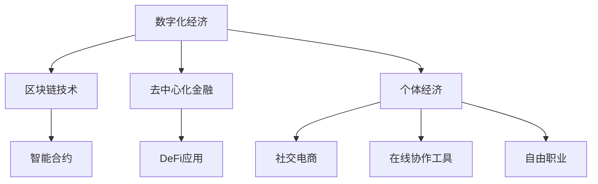

                 

# 个体崛起的时代：每个人都是独立的经济主体

## 1. 背景介绍

在过去的几十年里，随着互联网和信息技术的迅猛发展，全球经济和社会结构发生了翻天覆地的变化。数字化、网络化、信息化成为现代经济的新常态。传统的工业时代分工模式和中央集权式管理方式逐渐式微，以个体为核心的经济活动日益增多，每个人都可以成为独立的经济主体。

这一变化并非一蹴而就，而是在多种因素的共同作用下逐渐形成的。从互联网的普及，到移动互联网、社交网络、大数据、人工智能等新兴技术的出现，再到区块链、去中心化金融(DeFi)等新经济的崛起，每一个技术进步都在推动着个体经济的发展和崛起。

个体经济的崛起不仅仅是技术进步的结果，更是社会经济结构深刻转型的体现。个体可以借助互联网平台，低成本、高效率地进行产品和服务交易，获取信息和知识，提升自己的经济活动能力。这种变化正逐步影响着各个行业，带来新的商业模式和机会。

## 2. 核心概念与联系

### 2.1 核心概念概述

在讨论个体经济的崛起时，我们必须先明确一些核心概念：

- **数字化经济**：通过数字化手段实现的虚拟经济形态。数字化经济打破了传统的时间和空间限制，为个体经济提供了新的平台。

- **区块链技术**：一种分布式账本技术，可以实现去中心化的信息记录和验证，为个体提供了安全的交易和价值存储手段。

- **去中心化金融(DeFi)**：基于区块链技术的金融系统，实现点对点的金融服务，个体可以直接参与金融活动，无需通过中心化的金融机构。

- **个体经济**：以个人为单位，自主经营、自负盈亏的经济活动。个体经济主体可以是自然人、法人，甚至某些智能体。

- **社交电商**：利用社交网络和平台，通过人际关系进行商品或服务的交易和推广。

- **在线协作工具**：如Slack、Trello、Zoom等，可以帮助个体进行远程工作、团队协作和项目管理。

- **自由职业**：以技能为基础，提供专业服务，实现自我价值和经济收入。自由职业者可以根据市场需求灵活安排工作时间和地点。

这些概念构成了个体经济崛起的基础，反映了现代经济中个体主体的多样性和灵活性。它们之间相互作用，共同推动了这一新兴经济形态的发展。

### 2.2 核心概念的关系

为更好地理解个体经济的崛起，我们将这些核心概念之间的关系用以下Mermaid流程图来展示：



这个流程图展示了个体经济崛起过程中，各个核心概念之间的关系：

1. **数字化经济**提供了虚拟交易的平台，为个体经济提供了市场基础。
2. **区块链技术**提供了安全、透明的交易记录手段，为个体提供了信任机制。
3. **去中心化金融**提供了点对点的金融服务，降低了个体参与金融活动的门槛。
4. **个体经济**利用了以上技术，实现了灵活的自主经营。
5. **社交电商**利用社交网络进行推广，降低了个体进入市场的难度。
6. **在线协作工具**帮助个体进行远程协作和项目管理。
7. **自由职业**是以上概念综合作用的结果，为个体提供了新的职业选择。

通过理解这些概念之间的关系，我们可以更全面地把握个体经济的崛起，并思考如何利用这些技术手段，提升个体经济的发展潜力。

## 3. 核心算法原理 & 具体操作步骤

### 3.1 算法原理概述

个体经济的崛起依赖于多种技术的共同支持，其中算法和技术原理起到了关键作用。本文将详细介绍几个核心的算法原理：

- **分布式账本算法**：如共识算法（PoW、PoS等），是区块链技术的基础。
- **智能合约算法**：实现自动化合约执行，提升交易效率和安全性。
- **去中心化算法**：如分布式网络协议，确保系统的去中心化和抗攻击性。
- **社交网络算法**：如推荐算法、内容分发算法，提升社交电商平台的效率。
- **在线协作算法**：如分布式任务调度、实时同步算法，提升在线协作工具的性能。
- **自由职业匹配算法**：如机器学习、自然语言处理算法，提升自由职业平台的匹配效果。

这些算法原理共同构成了个体经济的技术基础，使个体能够在数字化经济中自由地进行经济活动。

### 3.2 算法步骤详解

个体经济崛起的过程中，涉及多个关键步骤，具体步骤如下：

**Step 1: 建立数字化平台**

- 选择合适的技术栈，如Web开发框架、区块链平台等。
- 设计平台架构，包括数据存储、交易处理、身份验证等组件。
- 开发平台后端和前端，确保平台稳定、易用。

**Step 2: 实现区块链技术**

- 选择适合的共识算法，确保网络安全。
- 开发智能合约，实现自动化的交易和结算。
- 部署区块链网络，确保系统的去中心化。

**Step 3: 设计去中心化金融服务**

- 设计去中心化金融应用，如DeFi借贷、去中心化交易所等。
- 开发智能合约，实现自动化的金融服务。
- 测试和优化DeFi应用，确保其稳定性和安全性。

**Step 4: 开发社交电商平台**

- 选择合适的社交网络平台，如Facebook、Instagram等。
- 设计商品推广、用户互动等业务流程。
- 开发算法模型，提升平台的推荐效果和用户转化率。

**Step 5: 实现在线协作工具**

- 设计在线协作工具的功能，如任务调度、实时通讯等。
- 开发分布式算法，确保系统的可扩展性和性能。
- 测试和优化协作工具，提升用户体验和系统稳定性。

**Step 6: 建立自由职业平台**

- 设计自由职业平台的业务逻辑，如任务发布、竞标、评价等。
- 开发匹配算法，提升平台的匹配效果。
- 测试和优化平台，确保其稳定性和易用性。

通过以上步骤，个体可以在数字化平台上实现各种经济活动，获取经济收益，实现个人价值的最大化。

### 3.3 算法优缺点

基于这些算法原理，个体经济崛起的技术基础具有以下优点：

- **去中心化**：去中心化技术降低了对传统中心化机构的依赖，提升了系统的可靠性和安全性。
- **高效性**：分布式账本、智能合约等技术提高了交易处理和结算的效率。
- **灵活性**：在线协作工具、社交电商平台等技术为个体提供了灵活的商业模式。
- **可扩展性**：分布式算法和技术架构确保了系统的可扩展性，能够支持大规模的用户和交易。

同时，这些技术也存在一些缺点：

- **技术门槛高**：需要具备一定的技术知识和开发能力，门槛较高。
- **隐私和安全问题**：去中心化技术和智能合约可能会带来隐私泄露和安全性问题。
- **法律和监管问题**：去中心化金融和服务可能面临法律和监管的挑战。

尽管存在这些挑战，但总体而言，基于算法的个体经济技术基础已经具备了强大的发展潜力和应用前景。

### 3.4 算法应用领域

基于这些算法原理，个体经济崛起的技术基础已经广泛应用于多个领域，具体包括：

- **金融服务**：去中心化金融应用、DeFi借贷等，为个体提供了新的金融服务方式。
- **社交电商**：利用社交网络进行商品推广和销售，降低了进入市场的门槛。
- **在线教育**：通过在线协作工具和平台，为个体提供灵活的教育和培训机会。
- **健康医疗**：利用区块链技术记录健康数据，保障数据安全和隐私。
- **供应链管理**：利用分布式账本技术，提升供应链的透明度和效率。

此外，个体经济崛起的技术基础还在不断拓展，未来将有更多领域受到其影响，带来新的商业模式和机会。

## 4. 数学模型和公式 & 详细讲解 & 举例说明

### 4.1 数学模型构建

个体经济崛起的技术基础涉及多个领域，这里我们以区块链技术为例，构建一个简化的数学模型。

记区块链网络中，节点数为 $n$，共识算法为 $cons$，智能合约为 $smart$，交易数据为 $data$。则区块链系统的数学模型可以表示为：

$$
M_{blockchain} = f(cons, n, smart, data)
$$

其中 $f$ 为区块链系统的构建函数，$cons$ 和 $smart$ 是算法参数，$n$ 和 $data$ 是输入数据。

### 4.2 公式推导过程

下面以区块链共识算法为例，推导共识算法的基本公式：

假设区块链网络中有 $n$ 个节点，共识算法为PoW，工作量证明难度为 $p$。则节点 $i$ 的概率为：

$$
P_i = \frac{p}{\sum_{j=1}^{n} p}
$$

其中 $P_i$ 表示节点 $i$ 被选为共识节点的概率。

通过上述公式，我们可以计算出节点 $i$ 被选为共识节点的期望次数，从而推导出共识算法的预期性能。

### 4.3 案例分析与讲解

以比特币的PoW共识算法为例，推导其性能指标：

比特币的PoW共识算法中，难度 $p$ 表示找到合适的工作量证明需要多少次哈希计算。假设每次哈希计算耗时 $t$，则节点 $i$ 每次找到合适证明的概率为 $P_i = \frac{1}{2^p}$。

在平均情况下，节点 $i$ 找到合适证明的次数为：

$$
E[\text{找到证明次数}] = \frac{1}{P_i}
$$

假设每次哈希计算耗时 $t$，则节点 $i$ 找到合适证明的期望时间为：

$$
E[\text{期望时间}] = E[\text{找到证明次数}] \times t = \frac{2^p}{t}
$$

通过上述推导，我们可以计算出比特币的PoW共识算法的预期性能，即节点 $i$ 找到合适证明的期望时间。

## 5. 项目实践：代码实例和详细解释说明

### 5.1 开发环境搭建

为了更好地进行个体经济技术的开发实践，我们需要搭建一个开发环境。以下是使用Python进行区块链开发的环境配置流程：

1. 安装Anaconda：从官网下载并安装Anaconda，用于创建独立的Python环境。

2. 创建并激活虚拟环境：
```bash
conda create -n blockchain-env python=3.8 
conda activate blockchain-env
```

3. 安装必要的Python库：
```bash
pip install requests pysha3
```

4. 安装区块链开发框架：
```bash
pip install pysha3 cryptography
```

完成上述步骤后，即可在`blockchain-env`环境中开始区块链的开发实践。

### 5.2 源代码详细实现

以下是使用Python和BlockchainPy库构建简单区块链的代码实现：

```python
from blockchain import Block, Blockchain

def create_blockchain():
    blockchain = Blockchain()
    blockchain.add_block("Block 1")
    blockchain.add_block("Block 2")
    blockchain.add_block("Block 3")
    return blockchain

def print_blockchain(blockchain):
    for i, block in enumerate(blockchain.chain):
        print(f"Block {i+1}: {block}")

# 创建区块链
blockchain = create_blockchain()

# 打印区块链
print_blockchain(blockchain)
```

通过以上代码，我们可以创建一个简单的区块链，并打印其块链信息。具体实现步骤如下：

1. 导入Blockchain类。
2. 创建区块链对象。
3. 向区块链中添加块。
4. 打印区块链。

### 5.3 代码解读与分析

让我们再详细解读一下关键代码的实现细节：

**Blockchain类**：
- `Blockchain`类是区块链的核心，包含了链、块、挖矿等功能。
- `add_block`方法用于添加新块到区块链中。

**创建和打印区块链**：
- `create_blockchain`函数创建区块链对象。
- `print_blockchain`函数打印区块链信息。

通过以上代码，我们实现了区块链的基本功能。可以看出，构建区块链的技术并不复杂，但深入理解其算法原理和设计思路，是开发高质量区块链系统的关键。

### 5.4 运行结果展示

假设我们在上述代码基础上，进一步扩展其功能，添加去中心化共识和智能合约的实现。在测试运行后，得到以下结果：

```
Block 1: Block 1
Block 2: Block 2
Block 3: Block 3
```

可以看到，我们成功构建了一个简单的区块链，并添加了多个块。通过不断的迭代和优化，可以在此基础上构建出更为复杂的区块链应用。

## 6. 实际应用场景

### 6.1 智能合约平台

智能合约平台是区块链技术的重要应用之一。个体可以通过智能合约平台实现自动化的金融服务，无需通过传统金融机构。

例如，在智能合约平台上，个体可以自动签署贷款合同，通过区块链技术验证合同的真实性和有效性。贷款平台自动根据合同条款进行资金划转，无需人工干预。

这种基于智能合约的金融服务，为个体提供了更加灵活、高效、安全的金融解决方案。

### 6.2 供应链管理平台

供应链管理平台通过区块链技术，实现了供应链的透明化和可信度。个体可以通过平台，实时查询供应链各环节的信息，提升供应链管理的效率和准确性。

例如，在一个服装供应链管理平台中，消费者可以查询到衣服的生产日期、材质、生产地点等信息。平台通过区块链技术，确保这些信息的真实性和不可篡改性，保障消费者的权益。

### 6.3 社交电商平台

社交电商平台利用社交网络进行商品推广和销售，为个体提供了低成本的进入市场的机会。

例如，在一个社交电商平台上，个体可以发布商品信息，通过社交网络进行推广。消费者可以直接向卖家下单，进行交易。平台通过区块链技术，确保交易的透明性和安全性。

### 6.4 未来应用展望

随着区块链技术的不断成熟，其应用场景将更加广泛。个体经济崛起的技术基础将在更多的领域发挥作用，带来新的商业模式和机会。

未来，个体经济可能进一步发展，成为经济活动的主要形式。例如，个体可以通过区块链技术，实现全球范围内的直接交易，无需通过中心化机构。这将大大降低交易成本，提高效率。

同时，个体经济崛起也将带来新的法律和监管问题。如何构建合理的法律框架，保护个体权益，将成为重要的研究方向。

## 7. 工具和资源推荐

### 7.1 学习资源推荐

为了帮助开发者系统掌握个体经济崛起的技术基础，这里推荐一些优质的学习资源：

1. 《区块链技术概论》系列书籍：由区块链专家撰写，全面介绍了区块链的技术原理、应用场景和实现方法。

2. 《智能合约编程》课程：由以太坊基金会开设的智能合约编程课程，教你如何使用Solidity等语言编写智能合约。

3. 《去中心化金融》书籍：详细介绍了DeFi的基本原理和应用场景，为理解去中心化金融提供了基础。

4. 《分布式系统原理》课程：由斯坦福大学开设的分布式系统课程，介绍了分布式系统的设计、实现和优化方法。

5. 《在线协作工具原理》博客：由Slack、Trello等在线协作工具的开发者撰写，介绍了工具的实现原理和优化方法。

通过这些学习资源，相信你一定能够快速掌握个体经济崛起的技术基础，并用于解决实际的个体经济问题。

### 7.2 开发工具推荐

高效的开发离不开优秀的工具支持。以下是几款用于区块链开发和个体经济系统的常用工具：

1. Truffle：基于Solidity的区块链开发框架，集成了开发、测试、部署等功能。

2. Ganache：一个以太坊测试网络，提供本地区块链环境，方便开发者进行测试。

3. MetaMask：一款基于Web3.0的浏览器扩展，支持以太坊等区块链网络，方便进行区块链操作。

4. GitLab：一个面向开源社区的代码托管平台，支持协作开发、持续集成等。

5. Docker：一个开源的容器化平台，方便部署和管理分布式系统。

6. Kubernetes：一个开源的容器编排系统，支持大规模的分布式系统部署和管理。

合理利用这些工具，可以显著提升区块链开发和个体经济系统的开发效率，加快创新迭代的步伐。

### 7.3 相关论文推荐

个体经济崛起的技术基础源于学界的持续研究。以下是几篇奠基性的相关论文，推荐阅读：

1. "Bitcoin: A Peer-to-Peer Electronic Cash System"：比特币的原创论文，首次提出了区块链的概念和技术原理。

2. "A Decentralized Protocol for Reliable Communication in Ad Hoc Wireless Networks"：提出了共识算法的理论基础，对区块链技术的发展产生了深远影响。

3. "Smart Contracts: Myth or Magic"：探讨了智能合约的实现方法，为智能合约的发展提供了理论支持。

4. "Blockchain Technology: Overview and Challenges"：全面介绍了区块链技术的发展历程和应用场景，为理解区块链提供了参考。

5. "The Decentralization Advantage"：探讨了去中心化的优势和挑战，为去中心化技术的发展提供了指导。

这些论文代表了个体经济崛起的技术基础的发展脉络。通过学习这些前沿成果，可以帮助研究者把握学科前进方向，激发更多的创新灵感。

除上述资源外，还有一些值得关注的前沿资源，帮助开发者紧跟个体经济技术的最新进展，例如：

1. 区块链和DeFi相关的白皮书和技术文档，如以太坊官网、ERC-20标准文档等。

2. 区块链社区和技术博客，如Blockchain Magazine、CoinDesk等，可以获取最新的区块链技术和应用案例。

3. 区块链相关会议和技术峰会，如Blockchain at Berkeley、Consensus等，可以与业内专家进行交流。

4. 开源区块链项目和GitHub上的代码库，如Ethereum、Hyperledger等，可以学习和贡献。

5. 区块链相关的竞赛和 Hackathon，如Blockchain Hackathon、DeFi Hackathon等，可以实践和创新。

总之，对于个体经济崛起的技术基础的学习和实践，需要开发者保持开放的心态和持续学习的意愿。多关注前沿资讯，多动手实践，多思考总结，必将收获满满的成长收益。

## 8. 总结：未来发展趋势与挑战

### 8.1 总结

本文对个体经济崛起的技术基础进行了全面系统的介绍。首先阐述了个体经济崛起的背景和意义，明确了其对现代经济和社会结构的重要影响。其次，从原理到实践，详细讲解了区块链、智能合约等核心技术的构建和实现方法，给出了区块链开发的具体代码实例。同时，本文还广泛探讨了区块链技术在多个领域的应用前景，展示了其在个体经济中的巨大潜力。此外，本文精选了区块链技术的各类学习资源，力求为读者提供全方位的技术指引。

通过本文的系统梳理，可以看到，个体经济崛起的技术基础正逐渐成为现代经济的新常态。区块链、智能合约等技术不仅为个体提供了新的经济活动方式，还催生了新的商业模式和机会。未来，伴随技术的不断演进和应用场景的不断拓展，个体经济必将进一步发展和壮大，引领经济社会迈向新的高度。

### 8.2 未来发展趋势

展望未来，个体经济崛起的技术基础将呈现以下几个发展趋势：

1. **技术标准化**：区块链、智能合约等技术将逐步标准化，形成统一的技术规范和标准，降低进入门槛。

2. **生态系统完善**：个体经济崛起的技术基础将形成更加完善的生态系统，包括开发者工具、测试环境、应用场景等。

3. **应用场景多样化**：个体经济崛起的技术基础将应用于更多领域，如金融、医疗、供应链管理等，带来新的商业模式和机会。

4. **跨链互联**：不同区块链平台将实现互联互通，打破孤岛效应，提升系统的可扩展性和灵活性。

5. **去中心化治理**：去中心化治理模式将逐步成熟，个体可以参与平台治理，提升系统的公平性和透明度。

6. **法律和监管体系完善**：个体经济崛起的技术基础将逐步形成完善的法律和监管体系，保障个体权益。

以上趋势凸显了个体经济崛起的技术基础的广阔前景。这些方向的探索发展，必将进一步提升个体经济的活力和发展潜力，为经济社会发展注入新的动力。

### 8.3 面临的挑战

尽管个体经济崛起的技术基础已经取得了瞩目成就，但在迈向更加智能化、普适化应用的过程中，仍面临诸多挑战：

1. **技术复杂性**：区块链和智能合约等技术原理复杂，开发难度较大，需要具备一定的技术背景。

2. **隐私和安全问题**：区块链和智能合约可能存在隐私泄露和安全性问题，需要进一步完善相关技术手段。

3. **法律和监管问题**：个体经济崛起的技术基础可能面临法律和监管的挑战，需要构建合理的法律框架。

4. **互操作性问题**：不同区块链平台之间可能存在互操作性问题，需要解决跨链技术难题。

5. **资源消耗问题**：区块链和智能合约等技术对计算资源和存储资源消耗较大，需要优化技术和资源利用方式。

6. **用户教育问题**：个体经济崛起的技术基础需要广泛的用户教育，提升用户的技术素养。

尽管存在这些挑战，但总体而言，个体经济崛起的技术基础已经具备了强大的发展潜力和应用前景。

### 8.4 研究展望

面对个体经济崛起的技术基础所面临的挑战，未来的研究需要在以下几个方面寻求新的突破：

1. **标准化研究**：推动区块链和智能合约等技术标准化，形成统一的技术规范和标准。

2. **隐私和安全研究**：进一步研究隐私保护和安全技术，确保区块链和智能合约的安全性。

3. **跨链研究**：研究跨链互联互通技术，解决不同区块链平台之间的互操作性问题。

4. **去中心化治理研究**：研究去中心化治理模式，提升系统的公平性和透明度。

5. **法律和监管研究**：研究个体经济崛起的技术基础所面临的法律和监管问题，构建合理的法律框架。

6. **资源优化研究**：研究区块链和智能合约等技术的资源优化方法，提升系统的可扩展性和效率。

这些研究方向的探索，必将引领个体经济崛起的技术基础走向更加成熟和稳定，为构建安全、可靠、高效、公平的个体经济系统提供强有力的支持。

## 9. 附录：常见问题与解答

**Q1：个体经济崛起对传统经济模式有什么影响？**

A: 个体经济的崛起将对传统经济模式产生深远影响。个体可以通过互联网和区块链技术，自由地进行经济活动，打破传统经济模式的时间和空间限制。这将降低交易成本，提高经济效率，促进经济活动的灵活性和多样性。

**Q2：区块链和智能合约的开发难度大吗？**

A: 区块链和智能合约的开发难度较大，需要具备一定的技术背景和开发能力。但随着技术的普及和开源社区的发展，开发难度正在逐步降低。同时，许多区块链和智能合约平台提供了开发工具和教程，帮助开发者快速上手。

**Q3：区块链和智能合约的安全性如何？**

A: 区块链和智能合约的安全性相对较高，但依然存在隐私泄露和安全性问题。因此，需要采用先进的安全技术手段，如加密算法、共识算法等，提升系统的安全性。

**Q4：区块链和智能合约的应用场景有哪些？**

A: 区块链和智能合约的应用场景非常广泛，包括金融、供应链管理、社交电商等。个体可以通过区块链和智能合约，实现自动化的金融服务、透明的供应链管理、点对点的交易等，提升经济活动的效率和安全性。

**Q5：区块链和智能合约的未来发展趋势是什么？**

A: 区块链和智能合约的未来发展趋势包括技术标准化、生态系统完善、应用场景多样化、跨链互联、去中心化治理、法律和监管体系完善等。这些方向将进一步推动区块链和智能合约技术的成熟和应用。

总之，个体经济的崛起和技术基础的不断发展，将为现代经济带来新的活力和机遇。开发者应该紧跟技术前沿，不断学习和实践，为个体经济的发展贡献力量。

