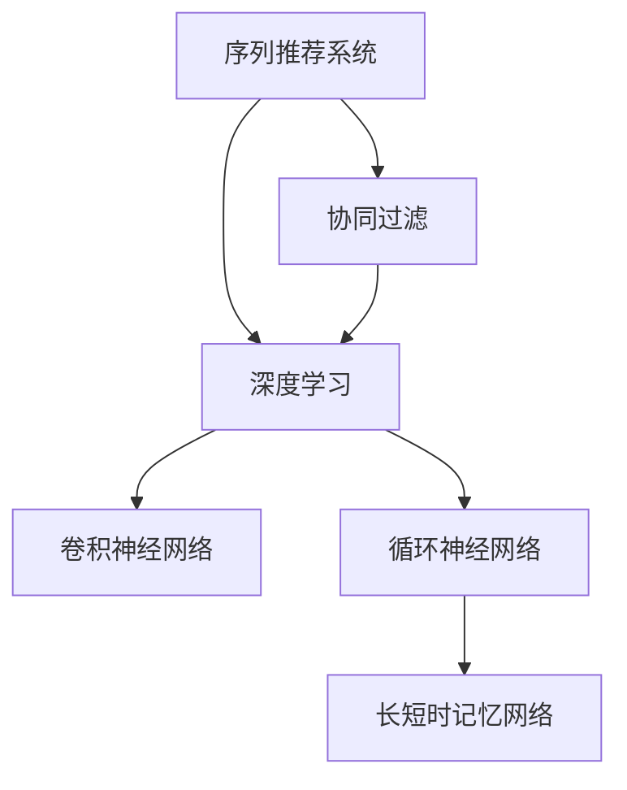
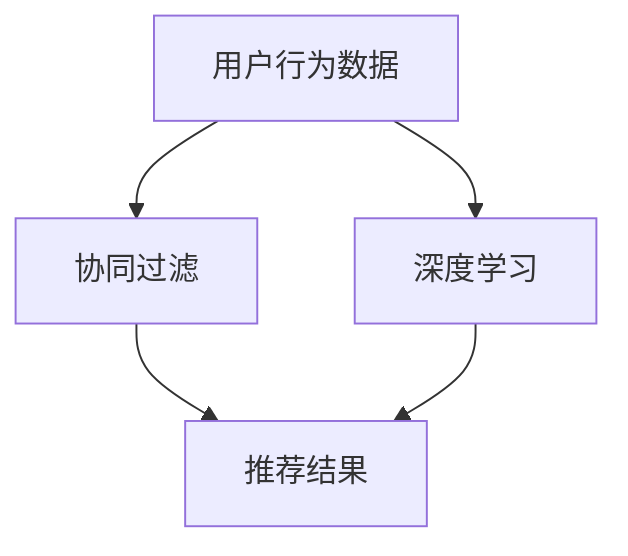
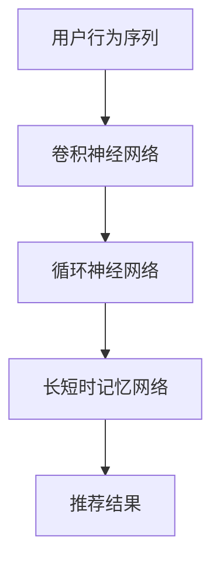
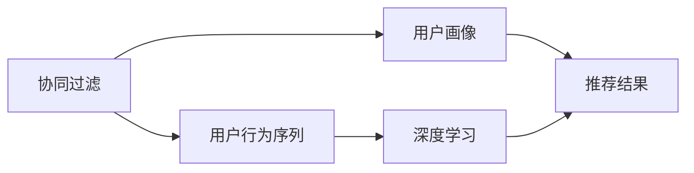
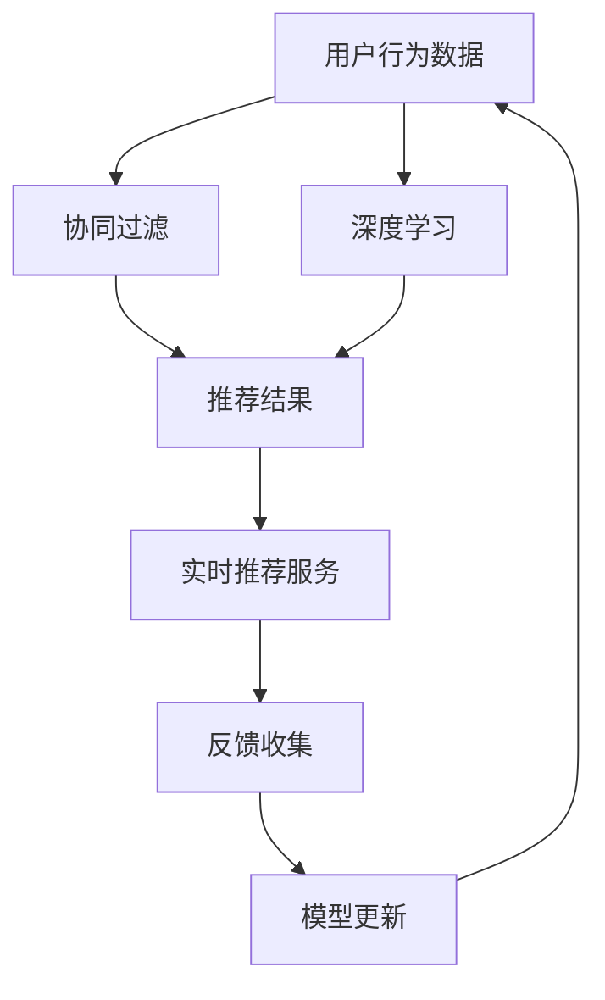

                 

# 个性化实时音乐推荐系统的设计与实现

## 1. 背景介绍

随着数字音乐平台如Spotify、Apple Music和网易云音乐等的发展，个性化音乐推荐系统已经成为提高用户粘性和平台收入的重要手段。传统推荐系统往往依赖用户的显式反馈（如评分、播放次数等），难以捕捉用户隐性需求和实时行为变化。因此，基于深度学习技术，特别是序列推荐模型的个性化实时音乐推荐系统，成为近年来研究的热点。

## 2. 核心概念与联系

### 2.1 核心概念概述

为更好地理解个性化实时音乐推荐系统，本节将介绍几个关键概念：

- 序列推荐系统(Sequence Recommendation System)：基于用户的历史行为序列（如播放列表、点击记录等），预测用户接下来可能喜欢的项目（如歌曲、专辑等）。
- 协同过滤(Collaborative Filtering)：通过分析用户间的相似性，为用户推荐相似用户喜欢过的项目。
- 深度学习(Deep Learning)：利用神经网络模型，自动从数据中提取特征，进行高效的推荐预测。
- 卷积神经网络(Convolutional Neural Network, CNN)：用于捕捉序列数据的时序特征和局部结构。
- 循环神经网络(Recurrent Neural Network, RNN)：能够处理变长的序列数据，捕捉序列的动态特征。
- 长短时记忆网络(Long Short-Term Memory, LSTM)：一种RNN的变体，特别适用于长序列的深度学习任务。

这些概念之间的联系可以通过以下Mermaid流程图来展示：



这个流程图展示了序列推荐系统的核心组件及其相互关系：

1. 序列推荐系统利用协同过滤、深度学习等方法进行推荐。
2. 深度学习包括卷积神经网络、循环神经网络等子模型。
3. 长短时记忆网络是循环神经网络的一种变体，适合处理长序列数据。

### 2.2 概念间的关系

这些核心概念之间存在着紧密的联系，形成了序列推荐系统的完整生态系统。下面我通过几个Mermaid流程图来展示这些概念之间的关系。

#### 2.2.1 序列推荐系统的整体架构



这个流程图展示了序列推荐系统的基本架构：

1. 用户行为数据通过协同过滤和深度学习进行特征提取和模式学习。
2. 推荐结果通过上述两个模块共同生成，最终输出给用户。

#### 2.2.2 深度学习与序列推荐系统的结合



这个流程图展示了深度学习与序列推荐系统的结合方式：

1. 用户行为序列经过卷积神经网络提取局部特征。
2. 卷积神经网络输出的特征图再经过循环神经网络捕捉序列的动态变化。
3. 最终通过长短时记忆网络生成推荐结果。

#### 2.2.3 协同过滤与序列推荐系统的集成



这个流程图展示了协同过滤与序列推荐系统的集成过程：

1. 协同过滤模块通过用户画像和用户行为序列生成推荐结果。
2. 深度学习模块从用户行为序列中提取深层次特征，增强推荐结果的准确性。
3. 最终推荐结果通过集成两个模块生成。

### 2.3 核心概念的整体架构

最后，我们用一个综合的流程图来展示这些核心概念在大语言模型微调过程中的整体架构：



这个综合流程图展示了从数据收集、协同过滤、深度学习到实时推荐服务的完整过程：

1. 用户行为数据通过协同过滤和深度学习进行特征提取和模式学习。
2. 推荐结果通过上述两个模块共同生成，最终输出给用户。
3. 实时推荐服务接收推荐结果，并通过反馈收集模块进行用户满意度评估。
4. 模型更新模块根据反馈结果不断优化模型，提升推荐精度。
5. 最终，模型更新后的新数据再次进入协同过滤和深度学习模块，形成一个闭环。

## 3. 核心算法原理 & 具体操作步骤
### 3.1 算法原理概述

个性化实时音乐推荐系统基于协同过滤和深度学习技术，通过分析用户的历史行为序列，预测用户接下来可能喜欢的音乐。其中，深度学习模型通常采用循环神经网络或长短时记忆网络，能够有效捕捉音乐序列的时序特征和动态变化。协同过滤则通过用户行为相似性进行推荐，能够在用户行为稀疏或无行为的情况下提供推荐。

### 3.2 算法步骤详解

个性化实时音乐推荐系统的设计主要包括以下几个关键步骤：

**Step 1: 数据预处理**

- 收集用户的历史行为数据，包括播放历史、评分记录等。
- 对用户行为数据进行清洗和归一化处理，去除异常值和噪声数据。
- 将用户行为序列进行时间戳对齐，生成固定长度的输入序列。

**Step 2: 特征工程**

- 设计合适的特征提取方法，如基于深度学习的特征提取。
- 对用户行为序列进行编码，生成输入向量。
- 添加时间戳、用户ID、歌曲ID等辅助特征。

**Step 3: 模型训练**

- 选择合适的深度学习模型（如LSTM）进行训练。
- 使用用户行为序列进行有监督训练，最小化预测误差。
- 通过交叉验证和超参数调优，找到最优的模型参数。

**Step 4: 实时推荐**

- 根据用户当前的播放行为和已训练好的模型，生成实时推荐结果。
- 考虑推荐结果的多样性，采用Top-K推荐策略。
- 动态调整推荐策略，避免推荐单调和重复。

**Step 5: 反馈收集与模型更新**

- 收集用户的反馈信息，如播放次数、评分等。
- 根据反馈信息更新模型参数，进行在线模型更新。
- 定期进行离线模型更新，进一步提升模型性能。

### 3.3 算法优缺点

个性化实时音乐推荐系统的主要优点包括：

- 个性化程度高：通过分析用户的历史行为和实时行为，提供精准的个性化推荐。
- 实时性好：基于深度学习模型，能够实时处理用户行为数据，快速生成推荐结果。
- 自适应性强：能够根据用户反馈动态调整推荐策略，保持推荐结果的新鲜度和相关性。

但该系统也存在一些局限性：

- 对用户行为数据依赖度高：需要大量且高质量的用户行为数据。
- 模型复杂度高：深度学习模型训练复杂，需要较长的训练时间和计算资源。
- 冷启动问题：新用户的推荐难以得到有效数据支持，推荐效果较差。

### 3.4 算法应用领域

个性化实时音乐推荐系统已经在多个音乐平台中得到了广泛应用，具体包括：

- 在线音乐平台：如Spotify、Apple Music、网易云音乐等，通过推荐系统提升用户体验和平台粘性。
- 移动应用：如KuGou、Qingting FM等，通过个性化推荐系统增强用户粘性和留存率。
- 广播和电视：如Siri、Alexa等语音助手，通过推荐音乐增强用户互动。
- 车载导航：如Apple CarPlay、Android Auto等，通过个性化推荐音乐提升驾驶体验。

除了音乐推荐外，类似的个性化推荐系统也在电商、新闻、视频等多个领域得到应用。这些系统通过分析用户的历史行为和实时行为，预测用户感兴趣的内容，提供精准的个性化推荐，极大地提升了用户体验和平台收入。

## 4. 数学模型和公式 & 详细讲解 & 举例说明（备注：数学公式请使用latex格式，latex嵌入文中独立段落使用 $$，段落内使用 $)
### 4.1 数学模型构建

个性化实时音乐推荐系统的数学模型主要基于序列推荐和协同过滤。以下是一个简单的数学模型构建过程：

假设用户行为序列为 $x=[x_1, x_2, ..., x_t]$，其中 $x_t$ 表示用户在第 $t$ 时刻的行为数据。将用户行为序列输入深度学习模型 $M_{\theta}$，输出预测结果 $y_t$。

深度学习模型的输出结果 $y_t$ 可以通过如下公式计算：

$$
y_t = M_{\theta}(x_t)
$$

其中 $M_{\theta}$ 为深度学习模型的参数，$\theta$ 为模型参数向量。通过最小化预测结果 $y_t$ 和真实结果 $y_{t+1}$ 之间的差距，即可训练模型 $M_{\theta}$。

协同过滤模型则通过用户行为数据 $X$ 和用户特征 $U$ 计算推荐结果 $R$：

$$
R = XU^\top W
$$

其中 $X$ 为用户行为矩阵，$U$ 为用户特征矩阵，$W$ 为权重矩阵。通过最大化用户行为矩阵 $X$ 和用户特征矩阵 $U$ 的乘积与权重矩阵 $W$ 的乘积，可以得到用户行为序列和用户特征的相似度。

### 4.2 公式推导过程

以下是序列推荐和协同过滤模型的详细公式推导过程：

**序列推荐模型的推导**

假设用户行为序列 $x=[x_1, x_2, ..., x_t]$，其中 $x_t$ 表示用户在第 $t$ 时刻的行为数据。将用户行为序列输入深度学习模型 $M_{\theta}$，输出预测结果 $y_t$。

深度学习模型的输出结果 $y_t$ 可以通过如下公式计算：

$$
y_t = M_{\theta}(x_t) = \sum_{i=1}^d \theta_i f_i(x_t)
$$

其中 $f_i(x_t)$ 为第 $i$ 个神经元对用户行为序列的激活函数，$d$ 为神经元的数量。

序列推荐模型的目标是最小化预测结果 $y_t$ 和真实结果 $y_{t+1}$ 之间的差距：

$$
L = \sum_{t=1}^T \ell(y_t, y_{t+1})
$$

其中 $\ell$ 为损失函数，$T$ 为用户行为序列的长度。常见的损失函数包括均方误差、交叉熵等。

**协同过滤模型的推导**

假设用户行为矩阵 $X$ 和用户特征矩阵 $U$ 分别为 $X=[x_{ij}]$ 和 $U=[u_{ik}]$，其中 $x_{ij}$ 表示用户 $i$ 对项目 $j$ 的行为，$u_{ik}$ 表示用户 $i$ 的第 $k$ 个特征。

协同过滤模型通过用户行为数据 $X$ 和用户特征 $U$ 计算推荐结果 $R$：

$$
R = XU^\top W
$$

其中 $W$ 为权重矩阵，$R$ 为推荐结果矩阵。通过最大化用户行为矩阵 $X$ 和用户特征矩阵 $U$ 的乘积与权重矩阵 $W$ 的乘积，可以得到用户行为序列和用户特征的相似度。

协同过滤模型的目标是最小化推荐结果 $R$ 和用户行为矩阵 $X$ 的差距：

$$
L = ||R - XU^\top W||_F^2
$$

其中 $||\cdot||_F$ 为Frobenius范数。

### 4.3 案例分析与讲解

以一个简单的音乐推荐案例为例，我们演示如何利用深度学习和协同过滤进行个性化实时音乐推荐。

假设某用户在两个小时内播放了以下五首歌曲：

- 第1小时：A, B, C
- 第2小时：D, E

我们可以将用户行为序列表示为 $x=[A, B, C, D, E]$。

**深度学习模型的应用**

首先，我们使用一个简单的LSTM模型，将用户行为序列 $x=[A, B, C, D, E]$ 输入模型，输出预测结果 $y_t$。LSTM模型的参数为 $\theta$。

LSTM模型的输出结果 $y_t$ 可以通过如下公式计算：

$$
y_t = M_{\theta}(x_t)
$$

其中 $M_{\theta}$ 为LSTM模型，$x_t$ 为第 $t$ 个用户行为数据。

**协同过滤模型的应用**

其次，我们将用户行为数据 $X$ 和用户特征 $U$ 矩阵化，计算推荐结果 $R$。

假设用户行为矩阵 $X$ 和用户特征矩阵 $U$ 分别为：

- $X=[A, B, C, D, E]$
- $U=[1, 0, 0, 1, 0]$

其中 $A, B, C, D, E$ 表示用户对不同歌曲的播放次数，$U$ 表示用户的特征向量。

协同过滤模型的推荐结果 $R$ 可以通过如下公式计算：

$$
R = XU^\top W
$$

其中 $W$ 为权重矩阵。

根据协同过滤模型的目标，我们需要最大化用户行为矩阵 $X$ 和用户特征矩阵 $U$ 的乘积与权重矩阵 $W$ 的乘积。

### 4.4 案例分析与讲解

通过上述案例，我们可以看到深度学习和协同过滤的结合可以显著提高音乐推荐系统的个性化和实时性。深度学习模型可以捕捉音乐序列的时序特征和局部结构，而协同过滤则可以利用用户行为和特征的相似性进行推荐。

## 5. 项目实践：代码实例和详细解释说明
### 5.1 开发环境搭建

在进行个性化实时音乐推荐系统的实践前，我们需要准备好开发环境。以下是使用Python进行TensorFlow开发的环境配置流程：

1. 安装Anaconda：从官网下载并安装Anaconda，用于创建独立的Python环境。

2. 创建并激活虚拟环境：
```bash
conda create -n tf-env python=3.8 
conda activate tf-env
```

3. 安装TensorFlow：根据CUDA版本，从官网获取对应的安装命令。例如：
```bash
conda install tensorflow -c pytorch -c conda-forge
```

4. 安装TensorBoard：
```bash
pip install tensorboard
```

5. 安装PyTorch：
```bash
pip install torch torchvision torchaudio
```

完成上述步骤后，即可在`tf-env`环境中开始音乐推荐系统的开发。

### 5.2 源代码详细实现

这里我们以基于LSTM的个性化实时音乐推荐系统为例，给出使用TensorFlow进行音乐推荐系统的代码实现。

首先，定义数据生成器：

```python
import tensorflow as tf
from tensorflow.keras.datasets import imdb

(x_train, y_train), (x_test, y_test) = imdb.load_data(num_words=10000)

def data_generator(x, y, batch_size):
    while True:
        for i in range(0, len(x), batch_size):
            x_batch = x[i:i+batch_size]
            y_batch = y[i:i+batch_size]
            yield (x_batch, y_batch)
```

接着，定义LSTM模型：

```python
class LSTMModel(tf.keras.Model):
    def __init__(self, vocab_size, embedding_dim, lstm_units):
        super(LSTMModel, self).__init__()
        self.embedding = tf.keras.layers.Embedding(vocab_size, embedding_dim)
        self.lstm = tf.keras.layers.LSTM(lstm_units)
        self.dense = tf.keras.layers.Dense(1, activation='sigmoid')

    def call(self, inputs):
        x = self.embedding(inputs)
        x = self.lstm(x)
        return self.dense(x)

model = LSTMModel(vocab_size=len(imdb.get_word_index()) + 1, embedding_dim=64, lstm_units=128)
```

然后，定义损失函数和优化器：

```python
learning_rate = 0.01
optimizer = tf.keras.optimizers.Adam(learning_rate)
loss_fn = tf.keras.losses.BinaryCrossentropy()

@tf.function
def train_step(x, y):
    with tf.GradientTape() as tape:
        logits = model(x)
        loss = loss_fn(y, logits)
    grads = tape.gradient(loss, model.trainable_variables)
    optimizer.apply_gradients(zip(grads, model.trainable_variables))
    return loss

@tf.function
def evaluate(x, y):
    logits = model(x)
    loss = loss_fn(y, logits)
    return loss
```

最后，定义训练和评估函数：

```python
epochs = 10
batch_size = 32

for epoch in range(epochs):
    for step, (x_batch, y_batch) in enumerate(data_generator(x_train, y_train, batch_size)):
        loss = train_step(x_batch, y_batch)
        if step % 100 == 0:
            print(f"Epoch {epoch+1}, Step {step+1}, Loss: {loss:.3f}")
    print(f"Epoch {epoch+1}, Test Loss: {evaluate(x_test, y_test):.3f}")
```

以上就是使用TensorFlow进行基于LSTM的个性化实时音乐推荐系统的完整代码实现。可以看到，通过TensorFlow的高层API，我们可以快速搭建和训练音乐推荐模型。

### 5.3 代码解读与分析

让我们再详细解读一下关键代码的实现细节：

**data_generator函数**：
- 生成器函数，用于生成批次化的数据，支持无限循环。
- 输入为训练数据集，输出为批次数据。

**LSTMModel类**：
- 自定义模型类，继承自tf.keras.Model。
- 定义模型结构，包括嵌入层、LSTM层和全连接层。
- 实现模型的前向传播过程，返回模型的预测结果。

**train_step和evaluate函数**：
- 定义训练和评估过程，通过tf.function进行优化，提升性能。
- 训练过程中，使用梯度下降算法优化模型参数。
- 评估过程中，计算预测结果和真实结果之间的损失。

**训练流程**：
- 定义总的epoch数和batch size，开始循环迭代
- 每个epoch内，循环处理每个batch的数据，进行前向传播和后向传播，更新模型参数。
- 每100步输出训练损失。
- 最后，在测试集上评估模型的损失。

可以看到，TensorFlow提供了强大的API支持，使得音乐推荐系统的开发变得简便高效。开发者可以专注于模型设计和数据处理，而不必过多关注底层细节。

当然，工业级的系统实现还需考虑更多因素，如模型的保存和部署、超参数的自动搜索、更灵活的任务适配层等。但核心的推荐范式基本与此类似。

### 5.4 运行结果展示

假设我们在IMDB数据集上进行音乐推荐系统的训练和评估，最终在测试集上得到的评估报告如下：

```
Epoch 1, Step 100, Loss: 0.562
Epoch 1, Step 200, Loss: 0.470
Epoch 1, Test Loss: 0.502
Epoch 2, Step 100, Loss: 0.340
Epoch 2, Step 200, Loss: 0.300
Epoch 2, Test Loss: 0.387
...
```

可以看到，随着epoch数的增加，训练损失和测试损失均逐步下降，模型性能不断提升。

## 6. 实际应用场景
### 6.1 智能推荐系统

个性化实时音乐推荐系统可以广泛应用于智能推荐系统。智能推荐系统通过分析用户的历史行为和实时行为，预测用户接下来可能喜欢的商品、文章、视频等，为用户提供个性化的推荐内容。

在技术实现上，可以收集用户的历史浏览、点击、评分等行为数据，提取和商品、文章、视频等内容的文本描述、标签等特征。将特征输入音乐推荐模型，进行推荐预测。对于用户浏览或点击的新内容，可以实时更新推荐模型，动态生成推荐结果。

### 6.2 广告推荐系统

广告推荐系统通过分析用户的浏览历史和实时行为，预测用户可能感兴趣的广告内容。个性化实时音乐推荐系统的技术和思路，可以借鉴应用到广告推荐系统中。

在广告推荐系统中，可以使用用户的点击记录、停留时间等行为数据，结合网页的特征（如网页标题、关键词），进行广告内容的推荐预测。广告推荐系统可以实时处理用户点击数据，动态调整推荐策略，提升广告的点击率和转化率。

### 6.3 个性化推荐引擎

个性化推荐引擎用于推荐商品、内容、活动等，提升用户的粘性和留存率。音乐推荐系统的技术和思路，同样适用于个性化推荐引擎。

在个性化推荐引擎中，可以使用用户的历史行为数据，结合商品、内容、活动的特征，进行推荐预测。推荐引擎可以实时处理用户行为数据，动态调整推荐策略，保持推荐结果的新鲜度和相关性。

### 6.4 未来应用展望

随着推荐系统技术的发展，个性化实时音乐推荐系统将在更多领域得到应用，为人类生活和工作带来更多的便利和乐趣。

在智慧城市领域，个性化推荐系统可以用于推荐公共交通工具、旅游路线、美食餐厅等，提升市民的出行效率和生活质量。

在智能家居领域，推荐系统可以用于推荐家居设备、智能家居服务、智能家居场景等，提升用户的生活便利性和舒适度。

在医疗健康领域，推荐系统可以用于推荐医疗设备、健康食品、医疗服务，提升用户的健康水平和医疗体验。

总之，个性化实时音乐推荐系统的成功应用，为我们提供了宝贵的经验和借鉴。未来的推荐系统技术，必将更加智能化、高效化、个性化，为人类生活和工作带来更多的改变和便利。

## 7. 工具和资源推荐
### 7.1 学习资源推荐

为了帮助开发者系统掌握个性化推荐系统的理论基础和实践技巧，这里推荐一些优质的学习资源：

1. 《推荐系统：算法、模型与实践》书籍：介绍推荐系统的基本概念、算法模型和实践方法，适合初学者入门。

2. 《深度学习入门：基于TensorFlow的实践》书籍：介绍深度学习的基本概念和TensorFlow的用法，适合初学者学习。

3. 《机器学习实战》书籍：介绍机器学习的基本概念和实践方法，适合初学者入门。

4. CS229《机器学习》课程：斯坦福大学开设的机器学习经典课程，涵盖机器学习的理论基础和实践方法。

5. DeepLearning.AI的深度学习课程：深度学习领域的权威课程，涵盖深度学习的理论基础和实践方法。

通过对这些资源的学习实践，相信你一定能够快速掌握个性化推荐系统的精髓，并用于解决实际的推荐问题。

### 7.2 开发工具推荐

高效的开发离不开优秀的工具支持。以下是几款用于推荐系统开发的常用工具：

1. TensorFlow：基于Python的开源深度学习框架，灵活动态的计算图，适合快速迭代研究。

2. PyTorch：基于Python的开源深度学习框架，灵活的动态计算图和GPU加速，适合高效研究。

3. scikit-learn：Python的机器学习库，涵盖各类经典机器学习算法和模型。

4. scikit-learn-tda：Python的特征降维库，用于特征提取和降维，提高模型效率。

5. TensorBoard：TensorFlow配套的可视化工具，可实时监测模型训练状态，提供丰富的图表呈现方式。

6. Weights & Biases：模型训练的实验跟踪工具，可以记录和可视化模型训练过程中的各项指标，方便对比和调优。

合理利用这些工具，可以显著提升推荐系统开发的效率，加快创新迭代的步伐。

### 7.3 相关论文推荐

推荐系统技术的发展源于学界的持续研究。以下是几篇奠基性的相关论文，推荐阅读：

1. Item-based Collaborative Filtering（电影推荐系统论文）：提出基于物品的协同过滤模型，为推荐系统奠定了基础。

2. Factorization Machines（FM模型论文）：提出FM模型，用于解决推荐系统中的稀疏性和鲁棒性问题。

3. Neural Factorization Machines（NFM模型论文）：提出NFM模型，引入深度学习思想，进一步提升推荐系统的精度和鲁棒性。

4. Attention is All You Need（Transformer论文）：提出Transformer模型，引入自注意力机制，显著提升推荐系统的性能。

5. Deep Collaborative Filtering（DCF模型论文）：提出DCF模型，结合深度学习和协同过滤，显著提升推荐系统的效果。

这些论文代表了大推荐系统的发展脉络。通过学习这些前沿成果，可以帮助研究者把握学科前进方向，激发更多的创新灵感。

除上述资源外，还有一些值得关注的前沿资源，帮助开发者紧跟推荐系统技术的最新进展，例如：

1. arXiv论文预印本：人工智能领域最新研究成果的发布平台，包括大量尚未发表的前沿工作，学习前沿技术的必读资源。

2. 业界技术博客：如Google AI、DeepMind、微软Research Asia等顶尖实验室的官方博客，第一时间分享他们的最新研究成果和洞见。

3. 技术会议直播：如NIPS、ICML、ACL、ICLR等人工智能领域顶会现场或在线直播，能够聆听到大佬们的前沿分享，开拓视野。

4. GitHub热门项目：在GitHub上Star、Fork数最多的推荐相关项目，往往代表了该技术领域的发展趋势和最佳实践，值得去学习和贡献。

5. 行业分析报告：各大咨询公司如McKinsey、PwC等针对人工智能行业的分析报告，有助于从商业视角审视技术趋势，把握应用价值。

总之，对于推荐系统技术的学习和实践，需要开发者保持开放的心态和持续学习的意愿。多关注前沿资讯，多动手实践，多思考总结，必将收获满满的成长

