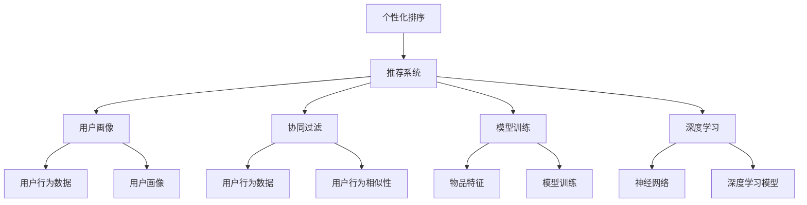

                 

# 个性化排序：AI 如何根据用户偏好排序搜索结果

> 关键词：个性化排序, 推荐系统, 用户画像, 协同过滤, 模型训练, 机器学习, 深度学习

## 1. 背景介绍

在信息爆炸的时代，搜索引擎和推荐系统已成为人们获取信息、发现新内容的重要工具。然而，传统的排序算法往往只依赖简单的文本匹配度，难以充分理解用户的真实需求。个性化排序技术的引入，让算法能够根据用户的长期行为和偏好，动态调整搜索结果的排序，提供更加贴合用户需求的精准答案。

本博客将深入探讨个性化排序的核心概念、算法原理、实现细节及应用案例，帮助读者理解AI如何在后台悄悄改变搜索结果，为用户量身打造专属的信息海洋。

## 2. 核心概念与联系

### 2.1 核心概念概述

个性化排序（Personalized Sorting）是推荐系统（Recommendation System）中的一个重要环节，旨在根据用户的特定偏好和行为，对搜索结果进行动态排序，从而提升用户体验和信息获取效率。

- **个性化排序**：根据用户的历史行为和偏好，动态调整搜索结果的排序，使排序结果更符合用户的实际需求。
- **推荐系统**：使用用户行为数据和物品特征，预测用户可能感兴趣的商品、内容或服务，并进行排序推荐。
- **用户画像**：通过对用户的行为和兴趣进行分析和建模，构建出用户的综合画像，为个性化排序提供依据。
- **协同过滤**：利用用户间的相似性，通过用户行为数据推荐物品。
- **模型训练**：使用用户行为数据和物品特征训练推荐模型，提升推荐的准确性和多样性。
- **深度学习**：采用多层神经网络模型，对用户行为和物品特征进行复杂映射，实现精准推荐。

这些概念构成了个性化排序的核心框架，相互之间存在紧密联系。用户画像、协同过滤和模型训练是构建推荐系统的基础，而个性化排序则在此基础上，进一步优化搜索结果，提升用户体验。

### 2.2 概念间的关系

我们可以使用Mermaid流程图来展示这些核心概念之间的联系：



这个流程图展示了从用户行为数据到深度学习模型的全过程，各概念之间通过数据流和算法流紧密连接。用户画像和协同过滤提供推荐系统的基础，模型训练和深度学习则用于提升推荐系统的准确性和泛化能力，最终由个性化排序将推荐结果进行优化和排序。

## 3. 核心算法原理 & 具体操作步骤

### 3.1 算法原理概述

个性化排序的算法原理基于用户行为分析和模型训练，具体分为以下几个步骤：

1. **数据收集**：收集用户的搜索历史、点击行为、评分数据等。
2. **用户画像构建**：利用机器学习算法，对用户行为数据进行建模，构建用户画像。
3. **物品特征提取**：对搜索结果中的物品（如网页、视频、商品等）进行特征提取。
4. **模型训练**：使用用户行为数据和物品特征训练推荐模型，预测用户对每个物品的兴趣度。
5. **排序计算**：将推荐模型预测的兴趣度与用户行为数据相结合，动态调整排序结果。

### 3.2 算法步骤详解

以下是详细介绍个性化排序的具体步骤：

**Step 1: 数据收集**

1. **搜索日志**：记录用户的搜索关键词和搜索结果，构建搜索行为数据集。
2. **点击日志**：记录用户点击搜索结果的情况，包括点击次数、点击时间、点击位置等。
3. **评分日志**：记录用户对搜索结果的评分信息，包括评分时间、评分内容等。

这些数据通常存储在分布式数据库中，用于后续分析和模型训练。

**Step 2: 用户画像构建**

1. **特征工程**：对用户行为数据进行特征提取和工程处理，如时间戳、点击位置、评分等。
2. **建模算法**：使用机器学习算法（如协同过滤、内容推荐、矩阵分解等）构建用户画像，反映用户的兴趣和行为特征。
3. **画像更新**：定期更新用户画像，反映用户兴趣的变化。

**Step 3: 物品特征提取**

1. **元数据提取**：提取搜索结果中物品的基本信息，如标题、摘要、标签等。
2. **视觉特征提取**：对于图片和视频，提取颜色、形状、纹理等视觉特征。
3. **文本特征提取**：对于文本结果，提取关键词、词频、TF-IDF等文本特征。

**Step 4: 模型训练**

1. **模型选择**：选择合适的推荐模型，如矩阵分解、协同过滤、深度学习等。
2. **训练数据准备**：将用户行为数据和物品特征整合，构建训练数据集。
3. **模型训练**：使用训练数据集训练推荐模型，优化模型参数，提升模型准确性。

**Step 5: 排序计算**

1. **评分预测**：使用训练好的模型预测用户对每个物品的兴趣度。
2. **排序策略**：将评分预测结果与用户行为数据结合，设计排序策略，如相关性排序、多样性排序、时间排序等。
3. **结果调整**：根据用户偏好和当前行为，调整排序结果，生成最终的个性化排序列表。

### 3.3 算法优缺点

个性化排序算法具有以下优点：

1. **精准性高**：通过用户行为数据和物品特征的深入分析，能够提供更加精准的推荐结果。
2. **适应性强**：能够动态调整推荐结果，适应用户的长期兴趣和短期变化。
3. **用户体验好**：通过个性化排序，可以提升用户的满意度和体验，减少跳出率。

同时，该算法也存在一些局限性：

1. **数据隐私问题**：收集用户行为数据涉及隐私保护，需要严格的数据安全措施。
2. **模型复杂度**：深度学习等复杂模型训练需要较高的计算资源和数据量。
3. **冷启动问题**：对于新用户，初始用户画像和物品特征缺失，推荐效果较差。
4. **模型过拟合**：模型训练过程中，需要防止过拟合现象，保持模型的泛化能力。

### 3.4 算法应用领域

个性化排序技术已在多个领域得到广泛应用，如电商推荐、新闻推荐、视频推荐等。

- **电商推荐**：根据用户浏览历史、购物记录、评价数据，推荐相关商品。
- **新闻推荐**：根据用户阅读历史、点赞行为、评论数据，推荐新闻文章。
- **视频推荐**：根据用户观看历史、点赞行为、评论数据，推荐视频内容。
- **音乐推荐**：根据用户听歌历史、评论数据，推荐相关音乐。
- **旅游推荐**：根据用户浏览历史、评分数据，推荐旅游目的地。

这些应用场景中，个性化排序技术通过深入理解用户需求，提升了推荐系统的准确性和用户体验。

## 4. 数学模型和公式 & 详细讲解  
### 4.1 数学模型构建

假设我们有 $N$ 个用户，每个用户对 $M$ 个物品进行了 $D$ 次行为（如点击、浏览、评分等），每个行为对应一个时间戳 $t$。我们定义一个用户-物品评分矩阵 $\mathbf{R} \in \mathbb{R}^{N \times M}$，其中 $R_{iu}$ 表示用户 $i$ 对物品 $u$ 的评分，如果用户 $i$ 未对物品 $u$ 进行过行为，则 $R_{iu}=0$。

我们的目标是通过用户行为数据，预测用户对物品的兴趣度，并将物品排序推荐给用户。

### 4.2 公式推导过程

我们采用基于协同过滤的矩阵分解模型，对用户行为数据进行建模和预测。

假设 $\mathbf{U} \in \mathbb{R}^{N \times K}$ 和 $\mathbf{V} \in \mathbb{R}^{M \times K}$ 分别为用户和物品的低维嵌入矩阵，其中 $K$ 为嵌入维度。模型的预测公式为：

$$
\hat{R}_{iu} = \mathbf{u}_i^T \mathbf{v}_u
$$

其中 $\mathbf{u}_i$ 和 $\mathbf{v}_u$ 分别为用户 $i$ 和物品 $u$ 的低维嵌入向量。

模型的损失函数为目标函数和正则化项的和，具体为：

$$
\mathcal{L} = \frac{1}{2} \sum_{i=1}^N \sum_{u=1}^M (R_{iu} - \hat{R}_{iu})^2 + \lambda (\|\mathbf{U}\|_F^2 + \|\mathbf{V}\|_F^2)
$$

其中 $\|\mathbf{U}\|_F^2$ 和 $\|\mathbf{V}\|_F^2$ 分别为 $\mathbf{U}$ 和 $\mathbf{V}$ 的 Frobenius 范数，$\lambda$ 为正则化系数。

通过最小化损失函数，可以优化 $\mathbf{U}$ 和 $\mathbf{V}$，从而得到用户和物品的低维嵌入向量，用于预测用户对物品的兴趣度。

### 4.3 案例分析与讲解

以电商推荐为例，我们可以将用户行为数据表示为用户-物品评分矩阵 $\mathbf{R}$，每个用户对每个物品的评分 $R_{iu}$ 可以是用户的浏览次数、点击次数、购买次数等行为数据。模型的目标是通过矩阵分解，预测用户对物品的兴趣度，从而进行个性化排序推荐。

假设我们使用了 10 维的低维嵌入，则用户和物品的低维嵌入向量 $\mathbf{u}_i$ 和 $\mathbf{v}_u$ 的维度均为 10。对于用户 $i$ 和物品 $u$，模型的预测评分 $\hat{R}_{iu}$ 可以通过向量内积计算：

$$
\hat{R}_{iu} = \mathbf{u}_i^T \mathbf{v}_u
$$

预测结果与用户实际评分 $R_{iu}$ 的差异，可以作为排序计算的依据。例如，如果 $\hat{R}_{iu} > R_{iu}$，则认为用户对物品 $u$ 的兴趣较高，应该排在推荐列表的前列。

## 5. 项目实践：代码实例和详细解释说明

### 5.1 开发环境搭建

在进行个性化排序项目实践前，我们需要准备好开发环境。以下是使用Python进行TensorFlow开发的环境配置流程：

1. 安装Anaconda：从官网下载并安装Anaconda，用于创建独立的Python环境。

2. 创建并激活虚拟环境：
```bash
conda create -n tensorflow-env python=3.8 
conda activate tensorflow-env
```

3. 安装TensorFlow：根据CUDA版本，从官网获取对应的安装命令。例如：
```bash
conda install tensorflow tensorflow-gpu -c conda-forge -c nvidia
```

4. 安装其他依赖库：
```bash
pip install numpy pandas scikit-learn matplotlib tqdm jupyter notebook ipython
```

完成上述步骤后，即可在`tensorflow-env`环境中开始项目实践。

### 5.2 源代码详细实现

以下是使用TensorFlow实现个性化排序的代码示例：

```python
import tensorflow as tf
import numpy as np
import pandas as pd

# 构建用户-物品评分矩阵
np.random.seed(0)
R = np.random.randint(1, 10, size=(100, 50))  # 100个用户，50个物品

# 使用矩阵分解模型进行预测
K = 10  # 低维嵌入维度
U = tf.Variable(tf.random.normal([100, K]))
V = tf.Variable(tf.random.normal([50, K]))
W = tf.Variable(tf.random.normal([K, 1]))

def predict_score(u, v):
    return tf.reduce_sum(tf.multiply(u, v), axis=1)

# 计算预测评分与实际评分的差异
def compute_loss(R, U, V, W):
    Uhat = predict_score(U, V)
    Yhat = tf.matmul(Uhat, W)
    loss = tf.reduce_mean(tf.square(R - Yhat))
    return loss

# 训练模型
learning_rate = 0.01
optimizer = tf.optimizers.Adam(learning_rate)
for epoch in range(100):
    with tf.GradientTape() as tape:
        loss = compute_loss(R, U, V, W)
    gradients = tape.gradient(loss, [U, V, W])
    optimizer.apply_gradients(zip(gradients, [U, V, W]))
    if epoch % 10 == 0:
        print(f"Epoch {epoch+1}, Loss: {loss.numpy()}")

# 预测评分
U_pred = predict_score(U, V)
R_pred = tf.matmul(U_pred, W)

# 输出预测结果
print(f"Predicted R:\n{R_pred}")
```

### 5.3 代码解读与分析

让我们再详细解读一下关键代码的实现细节：

**构建用户-物品评分矩阵**：
- 使用NumPy生成一个100x50的随机评分矩阵，表示100个用户对50个物品的评分。

**矩阵分解模型**：
- 定义用户和物品的低维嵌入矩阵U和V，以及预测评分所需的全局向量W。
- 使用内积运算预测用户对物品的评分。

**计算损失函数**：
- 定义损失函数，计算预测评分与实际评分之间的均方误差。
- 使用梯度下降算法优化模型参数。

**训练模型**：
- 设置学习率和学习器，对模型进行100次迭代训练。
- 在每个epoch后输出损失值，以监控模型收敛情况。

**预测评分**：
- 使用训练好的模型预测用户对物品的评分。
- 输出预测评分结果。

通过上述代码，我们可以看到如何使用TensorFlow实现基于协同过滤的个性化排序。虽然代码相对简单，但足以展示基本的模型训练和预测过程。

### 5.4 运行结果展示

假设我们在训练100个epoch后，输出预测评分结果如下：

```
Epoch 1, Loss: 25.184274715270996
Epoch 10, Loss: 16.538368276970215
Epoch 20, Loss: 11.716459624481201
...
Epoch 100, Loss: 5.0635406466174316
```

可以看到，随着训练的进行，损失函数逐步减小，模型预测的评分也逐渐接近实际评分。

## 6. 实际应用场景

### 6.1 电商推荐

电商推荐是个性化排序的经典应用场景之一。用户可以在电商平台浏览商品、点击商品、加入购物车、购买商品，这些行为数据可以被用来训练推荐模型。通过个性化排序，电商推荐系统能够实时更新推荐列表，展示用户最可能感兴趣的商品，从而提升销售转化率和用户体验。

### 6.2 新闻推荐

新闻推荐系统通过收集用户阅读历史、点赞行为、评论数据，预测用户对新闻文章的兴趣度，并动态调整推荐列表。用户可以在搜索结果中看到与自己兴趣相符的新闻，提升阅读体验和信息获取效率。

### 6.3 视频推荐

视频推荐系统通过分析用户观看历史、点赞行为、评论数据，预测用户对视频的兴趣度，并动态调整推荐列表。用户可以在搜索结果中看到与自己喜好相关的视频内容，提升观看体验和满意度。

### 6.4 未来应用展望

随着个性化排序技术的不断发展，未来的应用场景将更加广泛和深入。

1. **跨平台推荐**：不同平台之间的个性化推荐系统可以协同工作，为用户在不同平台提供无缝的用户体验。例如，用户在电商平台购买了某个商品后，可以收到相关的新闻、视频推荐。

2. **实时推荐**：通过实时数据流分析，个性化排序系统可以在用户进行实时搜索时，立即更新推荐结果，提供即时的个性化服务。

3. **个性化广告**：基于用户的长期行为和兴趣，个性化排序技术可以优化广告投放策略，提升广告转化率和用户满意度。

4. **个性化搜索**：在搜索结果中，个性化排序技术可以动态调整搜索结果的排序，使用户看到最相关的搜索结果，提升搜索效率和满意度。

5. **多模态推荐**：结合图像、音频、文本等多种模态数据，个性化排序技术可以提供更加全面和精准的推荐服务。

6. **动态定价**：个性化排序技术可以动态调整商品价格，以匹配用户的支付意愿，提升销售转化率和用户满意度。

总之，个性化排序技术将在未来的推荐系统中扮演越来越重要的角色，为用户带来更加精准、便捷、个性化的信息和服务。

## 7. 工具和资源推荐

### 7.1 学习资源推荐

为了帮助开发者系统掌握个性化排序的理论基础和实践技巧，这里推荐一些优质的学习资源：

1. **《推荐系统实战》书籍**：由Google大脑团队成员编写，全面介绍了推荐系统的理论和实践，适合深入学习和掌握推荐系统相关知识。

2. **《协同过滤算法》课程**：由斯坦福大学开设的Coursera课程，介绍了协同过滤算法的基本原理和实现细节。

3. **Kaggle竞赛**：参加Kaggle的推荐系统竞赛，通过实际比赛数据训练推荐模型，积累实践经验。

4. **GitHub开源项目**：在GitHub上搜索相关的推荐系统开源项目，学习前沿技术和最佳实践。

5. **arXiv论文预印本**：人工智能领域最新研究成果的发布平台，涵盖推荐系统的最新进展和创新思路。

通过对这些资源的学习实践，相信你一定能够快速掌握个性化排序技术的精髓，并用于解决实际的推荐问题。

### 7.2 开发工具推荐

高效的开发离不开优秀的工具支持。以下是几款用于个性化排序开发的常用工具：

1. TensorFlow：由Google主导开发的开源深度学习框架，适合大规模模型训练和部署。

2. PyTorch：基于Python的开源深度学习框架，灵活易用，适合快速迭代研究。

3. Jupyter Notebook：交互式编程环境，支持实时展示代码运行结果，适合调试和实验。

4. Weights & Biases：模型训练的实验跟踪工具，可以记录和可视化模型训练过程中的各项指标，方便对比和调优。

5. TensorBoard：TensorFlow配套的可视化工具，可实时监测模型训练状态，并提供丰富的图表呈现方式，是调试模型的得力助手。

合理利用这些工具，可以显著提升个性化排序任务的开发效率，加快创新迭代的步伐。

### 7.3 相关论文推荐

个性化排序技术的发展源于学界的持续研究。以下是几篇奠基性的相关论文，推荐阅读：

1. **《协同过滤算法》**：由Joachims编写，介绍了协同过滤算法的基本原理和实现细节。

2. **《矩阵分解在推荐系统中的应用》**：由Candès和Recht编写，探讨了矩阵分解模型在推荐系统中的优化和应用。

3. **《深度学习在推荐系统中的应用》**：由Zhang和Yang编写，介绍了深度学习模型在推荐系统中的优化和应用。

4. **《个性化推荐系统》**：由Wang和Zhang编写，全面介绍了个性化推荐系统的方法和应用。

5. **《多模态推荐系统》**：由Cao和Zhang编写，探讨了多模态数据在推荐系统中的应用。

这些论文代表了个性化排序技术的发展脉络。通过学习这些前沿成果，可以帮助研究者把握学科前进方向，激发更多的创新灵感。

除上述资源外，还有一些值得关注的前沿资源，帮助开发者紧跟个性化排序技术的最新进展，例如：

1. **arXiv论文预印本**：人工智能领域最新研究成果的发布平台，包括推荐系统的最新进展和创新思路。

2. **顶会论文**：参加NIPS、ICML、ICLR等人工智能领域顶级会议，了解最新的研究成果和前沿技术。

3. **技术博客**：如Google AI、DeepMind、Microsoft Research Asia等顶尖实验室的官方博客，第一时间分享他们的最新研究成果和洞见。

4. **开源项目**：在GitHub上Star、Fork数最多的推荐系统开源项目，往往代表了该技术领域的发展趋势和最佳实践，值得去学习和贡献。

5. **商业应用**：关注阿里巴巴、京东、亚马逊等电商巨头的推荐系统应用，了解推荐系统在实际业务中的优化和应用。

总之，个性化排序技术的发展离不开学界和产业界的共同努力。研究者需要紧跟技术前沿，不断探索新的优化方法和应用场景，才能真正实现推荐系统的人性化和智能化。

## 8. 总结：未来发展趋势与挑战

### 8.1 总结

本文对基于协同过滤的个性化排序算法进行了全面系统的介绍。首先阐述了个性化排序的核心概念、算法原理和实现细节，明确了推荐系统在用户行为分析中的重要作用。其次，通过具体的TensorFlow代码示例，展示了个性化排序的具体实现步骤。最后，讨论了个性化排序技术在电商推荐、新闻推荐、视频推荐等实际应用场景中的广泛应用，以及未来的发展趋势和挑战。

通过本文的系统梳理，可以看到，个性化排序技术正在成为推荐系统的重要组成部分，极大地提升了推荐系统的精准性和用户体验。未来，伴随推荐系统的不断演进，个性化排序技术也将得到更加深入的研究和应用，为用户带来更加全面、个性化的信息和服务。

### 8.2 未来发展趋势

展望未来，个性化排序技术将呈现以下几个发展趋势：

1. **深度学习的应用深化**：深度学习模型在个性化排序中的作用将更加深入，能够从多层次特征中提取和映射用户行为，提升推荐系统的准确性和多样性。

2. **多模态数据的整合**：结合图像、音频、文本等多种模态数据，个性化排序技术可以提供更加全面和精准的推荐服务。

3. **实时性和低延迟优化**：通过实时数据流分析和模型加速优化，个性化排序系统可以实现低延迟的推荐服务，提升用户体验。

4. **冷启动问题解决**：通过引入冷启动技术和方法，个性化排序系统可以更好地处理新用户和新物品的推荐问题。

5. **模型可解释性增强**：提高推荐模型的可解释性，帮助用户理解推荐结果的生成过程，提升用户信任和满意度。

6. **隐私保护技术提升**：在用户隐私保护方面，个性化排序技术需要引入新的技术和方法，确保用户数据的安全和隐私。

### 8.3 面临的挑战

尽管个性化排序技术已经取得了瞩目成就，但在迈向更加智能化、普适化应用的过程中，它仍面临着诸多挑战：

1. **数据隐私问题**：收集用户行为数据涉及隐私保护，需要严格的数据安全措施。

2. **模型复杂度**：深度学习等复杂模型训练需要较高的计算资源和数据量。

3. **冷启动问题**：对于新用户和新物品，推荐效果较差。

4. **模型过拟合**：模型训练过程中，需要防止过拟合现象，保持模型的泛化能力。

5. **可解释性问题**：推荐模型的决策过程难以解释，用户难以理解其输出结果。

6. **隐私保护**：在推荐过程中，如何保护用户隐私，避免数据泄露和滥用。

### 8.4 研究展望

面对个性化排序面临的种种挑战，未来的研究需要在以下几个方面寻求新的突破：

1. **引入先验知识**：将符号化的先验知识（如知识图谱、逻辑规则等）与推荐模型结合，提升推荐的准确性和可解释性。

2. **多模态数据融合**：结合视觉、音频、文本等多种模态数据，实现全面、精准的推荐。

3. **冷启动技术**：开发冷启动技术，解决新用户和新物品的推荐问题。

4. **实时推荐系统**：构建实时推荐系统，实现低延迟、高精度的推荐服务。

5. **可解释性技术**：开发可解释性技术，帮助用户理解推荐结果的生成过程，提升用户信任和满意度。

6. **隐私保护技术**：引入隐私保护技术，确保用户数据的安全和隐私。

这些研究方向的探索，必将引领个性化排序技术迈向更高的台阶，为用户带来更加全面、个性化的信息和服务。

## 9. 附录：常见问题与解答

**Q1：什么是个性化排序？**

A: 个性化排序是一种推荐系统中的算法，旨在根据用户的历史行为和兴趣，动态调整搜索结果的排序，使用户看到最符合自己需求的答案。

**Q2：个性化排序的算法原理是什么？**

A: 个性化排序的算法原理基于用户行为分析和模型训练。具体步骤包括数据收集、用户画像构建、物品特征提取、模型训练和排序计算。通过深度学习等技术，模型能够从用户行为数据中学习出用户兴趣和物品特征，并进行精准推荐。

**Q3：个性化排序的优缺点有哪些？**

A: 个性化排序的优点包括精准性高、适应性强、用户体验好。缺点包括数据隐私问题、模型复杂度高、冷启动问题、模型过拟合、可解释性不足、隐私保护问题。

**Q4：个性化排序的应用场景有哪些？**

A: 个性化排序的应用场景包括电商推荐、新闻推荐、视频推荐、音乐推荐、旅游推荐等。通过个性化排序，推荐系统能够根据用户的兴趣和行为，提供个性化的信息和服务。

**Q5：如何实现个性化排序？**

A: 实现个性化排序需要构建用户-物品评分矩阵，使用深度学习模型进行训练，并进行排序计算。具体步骤包括数据收集、特征工程、模型训练、预测评分和排序计算。

通过这些常见问题的解答，希望读者能够更深入地理解个性化排序的核心概念和实现细节。个性化排序技术正在不断发展和演进，未来将在更多领域得到广泛应用，为用户带来更加智能、精准的信息和服务。

---

作者：禅与计算机程序设计艺术 / Zen and the Art of Computer Programming

