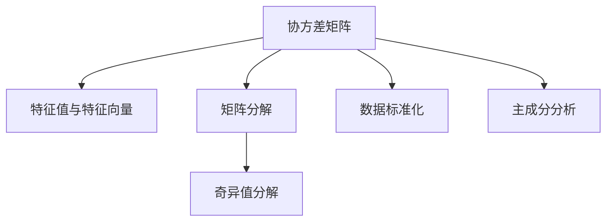
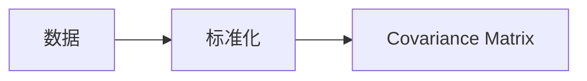
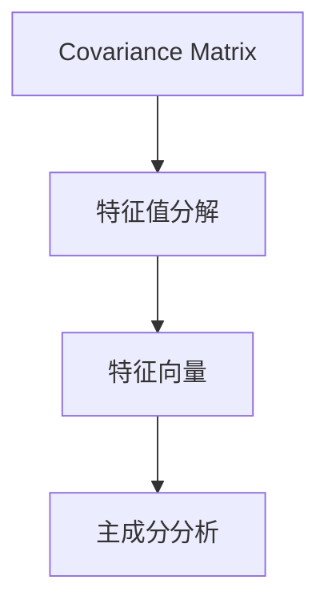
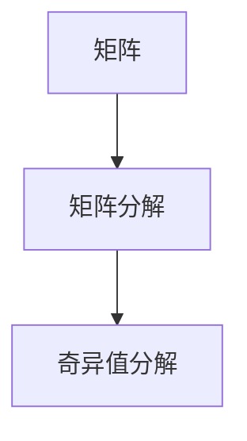
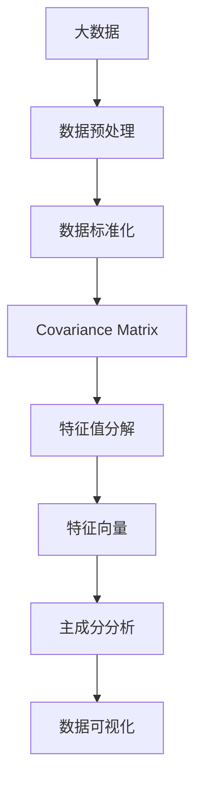

                 

# 主成分分析 原理与代码实例讲解

> 关键词：主成分分析,PCA,降维,特征提取,数学建模,Python代码,机器学习,数据分析

## 1. 背景介绍

### 1.1 问题由来
主成分分析(Principal Component Analysis, PCA)是一种经典的降维技术，广泛应用于数据分析和机器学习领域。在数据量巨大且特征维数过高的情况下，原始数据往往难以处理和分析。PCA通过将高维数据投影到低维空间，同时尽量保留原始数据的主要信息，从而实现数据的降维和可视化，同时提高后续分析的效率。

PCA 的核心思想是：数据在特征空间中投影后，能够尽可能地减少数据的维数，同时尽可能地保留数据的原始信息。通过计算数据的协方差矩阵的特征值和特征向量，可以找出数据在低维空间中的最佳投影方向，从而实现数据的降维。

### 1.2 问题核心关键点
PCA 的计算过程可以分为三个关键步骤：
1. 数据标准化：将原始数据转化为均值为 0、方差为 1 的标准化数据，以便于后续的计算。
2. 协方差矩阵的计算：计算标准化数据的协方差矩阵。
3. 特征值分解：通过特征值分解，找出协方差矩阵的特征值和特征向量，从而确定数据的最佳投影方向。

PCA 的优点在于：
1. 不需要标注数据，可以实现无监督学习。
2. 能够降维到任意维数，适用于不同的分析需求。
3. 计算速度快，适合大规模数据处理。

PCA 的缺点在于：
1. 对于非线性数据，降维效果不佳。
2. 无法保留数据的全局结构信息。
3. 对于稀疏数据，计算方差可能存在偏差。

尽管存在这些局限性，PCA 在数据科学和机器学习中仍然具有重要的地位，是数据分析和模型训练的重要工具之一。

### 1.3 问题研究意义
PCA 在数据分析和机器学习中的应用非常广泛，例如：
1. 数据可视化：通过降维技术将高维数据转化为二维或三维图像，便于观察和分析数据分布。
2. 特征提取：通过降维技术提取数据的主要特征，降低特征维度，提高模型的训练效率。
3. 数据压缩：通过降维技术将高维数据压缩到低维空间，节省存储空间和计算资源。
4. 异常检测：通过降维技术揭示数据的主要特征和异常点，提高数据挖掘的准确性。
5. 模式识别：通过降维技术将高维数据转化为低维特征向量，提高模式识别和分类的准确性。

## 2. 核心概念与联系

### 2.1 核心概念概述

为了更好地理解主成分分析的方法，本节将介绍几个密切相关的核心概念：

- 协方差矩阵(Covariance Matrix)：描述多个随机变量之间的统计关系的矩阵，用于衡量变量之间的相关性。
- 特征值与特征向量(Eigenvalues and Eigenvectors)：矩阵的特征值和特征向量是一对概念，特征值代表矩阵的形状和大小，特征向量代表矩阵的几何结构。
- 主成分分析(PCA)：通过计算数据的协方差矩阵的特征值和特征向量，找出数据在低维空间中的最佳投影方向，实现数据的降维。
- 矩阵分解(Matrix Decomposition)：将矩阵分解为若干因子矩阵的乘积，用于求解矩阵的特征值和特征向量。
- 奇异值分解(SVD)：矩阵分解的一种形式，特别适用于高维数据的降维。
- 数据标准化(Standardization)：将数据转化为均值为 0、方差为 1 的标准化数据，便于后续的计算。

这些核心概念之间的逻辑关系可以通过以下 Mermaid 流程图来展示：



这个流程图展示了一些与 PCA 密切相关的核心概念，以及它们之间的逻辑关系。

### 2.2 概念间的关系

这些核心概念之间存在着紧密的联系，形成了 PCA 的基本框架。下面通过几个 Mermaid 流程图来展示这些概念之间的关系。

#### 2.2.1 数据标准化与协方差矩阵



这个流程图展示了数据标准化和协方差矩阵之间的关系。标准化是将数据转化为均值为 0、方差为 1 的标准化数据，协方差矩阵用于衡量多个变量之间的相关性。

#### 2.2.2 特征值分解与主成分分析



这个流程图展示了特征值分解和主成分分析之间的关系。通过特征值分解，可以找出协方差矩阵的特征值和特征向量，从而确定数据的最佳投影方向，实现数据的降维。

#### 2.2.3 矩阵分解与奇异值分解



这个流程图展示了矩阵分解和奇异值分解之间的关系。奇异值分解是将矩阵分解为三个矩阵的乘积，特别适用于高维数据的降维。

### 2.3 核心概念的整体架构

最后，我们用一个综合的流程图来展示这些核心概念在大数据处理中的整体架构：



这个综合流程图展示了从大数据处理到数据分析的整个流程。大数据经过数据预处理和标准化后，通过计算协方差矩阵、特征值分解和特征向量，实现数据的降维和可视化，从而完成数据分析的过程。

## 3. 核心算法原理 & 具体操作步骤

### 3.1 算法原理概述

主成分分析(PCA)的基本原理是通过计算数据的协方差矩阵的特征值和特征向量，找出数据在低维空间中的最佳投影方向，实现数据的降维。

假设我们有一组数据 $X = \{x_i\}_{i=1}^N$，其中每个数据 $x_i$ 是一个 $D$ 维向量。为了进行 PCA，我们需要将数据转化为均值为 0、方差为 1 的标准化数据，即：

$$
x_i = \frac{x_i - \mu}{\sigma}
$$

其中 $\mu$ 是数据的均值，$\sigma$ 是数据的标准差。

接下来，我们计算标准化数据的协方差矩阵 $\Sigma$：

$$
\Sigma = \frac{1}{N-1} \sum_{i=1}^N x_ix_i^T
$$

然后，我们通过计算协方差矩阵 $\Sigma$ 的特征值和特征向量，找到最大的 $k$ 个特征值和对应的特征向量，构成一个 $k$ 维的投影矩阵 $P$：

$$
P = [p_1, p_2, ..., p_k]
$$

其中 $p_i$ 是协方差矩阵 $\Sigma$ 的特征向量。

最后，我们将原始数据 $X$ 通过投影矩阵 $P$ 投影到低维空间，得到降维后的数据 $Y$：

$$
Y = X P
$$

降维后的数据 $Y$ 保留了原始数据的主要信息，同时维数大大减少，便于后续分析和处理。

### 3.2 算法步骤详解

主成分分析的计算过程可以分为三个关键步骤：

#### 步骤 1: 数据标准化
将原始数据转化为均值为 0、方差为 1 的标准化数据。

#### 步骤 2: 协方差矩阵的计算
计算标准化数据的协方差矩阵 $\Sigma$。

#### 步骤 3: 特征值分解
通过特征值分解，找出协方差矩阵 $\Sigma$ 的特征值和特征向量，从而确定数据的最佳投影方向。

下面是 Python 代码实现主成分分析的具体步骤：

```python
import numpy as np
from scipy.linalg import svd

# 步骤 1: 数据标准化
def standardize(X):
    mean = np.mean(X, axis=0)
    std = np.std(X, axis=0)
    X = (X - mean) / std
    return X

# 步骤 2: 协方差矩阵的计算
def compute_covariance(X):
    N, D = X.shape
    X_std = standardize(X)
    S = np.dot(X_std.T, X_std) / (N - 1)
    return S

# 步骤 3: 特征值分解
def pca(X, k):
    S = compute_covariance(X)
    U, S, V = svd(S)
    P = V[:,:k]
    return P

# 步骤 4: 数据投影
def project(X, P):
    return np.dot(X, P)

# 示例数据
X = np.random.randn(100, 5)

# 步骤 1: 数据标准化
X_std = standardize(X)

# 步骤 2: 协方差矩阵的计算
S = compute_covariance(X_std)

# 步骤 3: 特征值分解
k = 2
P = pca(X_std, k)

# 步骤 4: 数据投影
Y = project(X_std, P)

# 结果可视化
import matplotlib.pyplot as plt
import seaborn as sns

plt.scatter(X[:,0], X[:,1], alpha=0.5)
plt.scatter(Y[:,0], Y[:,1], alpha=0.5)
plt.title('PCA Example')
plt.show()
```

### 3.3 算法优缺点

主成分分析(PCA)的优点在于：
1. 不需要标注数据，可以实现无监督学习。
2. 能够降维到任意维数，适用于不同的分析需求。
3. 计算速度快，适合大规模数据处理。

主成分分析(PCA)的缺点在于：
1. 对于非线性数据，降维效果不佳。
2. 无法保留数据的全局结构信息。
3. 对于稀疏数据，计算方差可能存在偏差。

尽管存在这些局限性，PCA 在数据科学和机器学习中仍然具有重要的地位，是数据分析和模型训练的重要工具之一。

### 3.4 算法应用领域

主成分分析(PCA)在数据分析和机器学习中的应用非常广泛，例如：

1. 数据可视化：通过降维技术将高维数据转化为二维或三维图像，便于观察和分析数据分布。
2. 特征提取：通过降维技术提取数据的主要特征，降低特征维度，提高模型的训练效率。
3. 数据压缩：通过降维技术将高维数据压缩到低维空间，节省存储空间和计算资源。
4. 异常检测：通过降维技术揭示数据的主要特征和异常点，提高数据挖掘的准确性。
5. 模式识别：通过降维技术将高维数据转化为低维特征向量，提高模式识别和分类的准确性。

## 4. 数学模型和公式 & 详细讲解 & 举例说明

### 4.1 数学模型构建

主成分分析(PCA)的数学模型包括：
- 数据标准化
- 协方差矩阵的计算
- 特征值分解

假设我们有一组数据 $X = \{x_i\}_{i=1}^N$，其中每个数据 $x_i$ 是一个 $D$ 维向量。为了进行 PCA，我们需要将数据转化为均值为 0、方差为 1 的标准化数据，即：

$$
x_i = \frac{x_i - \mu}{\sigma}
$$

其中 $\mu$ 是数据的均值，$\sigma$ 是数据的标准差。

接下来，我们计算标准化数据的协方差矩阵 $\Sigma$：

$$
\Sigma = \frac{1}{N-1} \sum_{i=1}^N x_ix_i^T
$$

然后，我们通过计算协方差矩阵 $\Sigma$ 的特征值和特征向量，找到最大的 $k$ 个特征值和对应的特征向量，构成一个 $k$ 维的投影矩阵 $P$：

$$
P = [p_1, p_2, ..., p_k]
$$

其中 $p_i$ 是协方差矩阵 $\Sigma$ 的特征向量。

最后，我们将原始数据 $X$ 通过投影矩阵 $P$ 投影到低维空间，得到降维后的数据 $Y$：

$$
Y = X P
$$

降维后的数据 $Y$ 保留了原始数据的主要信息，同时维数大大减少，便于后续分析和处理。

### 4.2 公式推导过程

下面详细推导主成分分析的各个步骤的公式。

#### 步骤 1: 数据标准化
数据标准化的目的是将数据转化为均值为 0、方差为 1 的标准化数据，即：

$$
x_i = \frac{x_i - \mu}{\sigma}
$$

其中 $\mu$ 是数据的均值，$\sigma$ 是数据的标准差。

#### 步骤 2: 协方差矩阵的计算
协方差矩阵 $\Sigma$ 的计算公式如下：

$$
\Sigma = \frac{1}{N-1} \sum_{i=1}^N x_ix_i^T
$$

其中 $N$ 是数据的数量，$x_i$ 是第 $i$ 个数据，$x_i^T$ 是 $x_i$ 的转置矩阵。

#### 步骤 3: 特征值分解
协方差矩阵 $\Sigma$ 的特征值分解如下：

$$
\Sigma = U \Lambda U^T
$$

其中 $U$ 是协方差矩阵 $\Sigma$ 的特征向量矩阵，$\Lambda$ 是协方差矩阵 $\Sigma$ 的特征值对角矩阵。

通过计算协方差矩阵 $\Sigma$ 的特征值和特征向量，我们可以找到最大的 $k$ 个特征值和对应的特征向量，构成一个 $k$ 维的投影矩阵 $P$：

$$
P = [p_1, p_2, ..., p_k]
$$

其中 $p_i$ 是协方差矩阵 $\Sigma$ 的特征向量。

最后，我们将原始数据 $X$ 通过投影矩阵 $P$ 投影到低维空间，得到降维后的数据 $Y$：

$$
Y = X P
$$

降维后的数据 $Y$ 保留了原始数据的主要信息，同时维数大大减少，便于后续分析和处理。

### 4.3 案例分析与讲解

下面通过一个简单的例子，展示主成分分析的计算过程。

假设我们有一组数据 $X = \{x_i\}_{i=1}^N$，其中每个数据 $x_i$ 是一个 $D$ 维向量。为了进行 PCA，我们需要将数据转化为均值为 0、方差为 1 的标准化数据，即：

$$
x_i = \frac{x_i - \mu}{\sigma}
$$

其中 $\mu$ 是数据的均值，$\sigma$ 是数据的标准差。

接下来，我们计算标准化数据的协方差矩阵 $\Sigma$：

$$
\Sigma = \frac{1}{N-1} \sum_{i=1}^N x_ix_i^T
$$

然后，我们通过计算协方差矩阵 $\Sigma$ 的特征值和特征向量，找到最大的 $k$ 个特征值和对应的特征向量，构成一个 $k$ 维的投影矩阵 $P$：

$$
P = [p_1, p_2, ..., p_k]
$$

其中 $p_i$ 是协方差矩阵 $\Sigma$ 的特征向量。

最后，我们将原始数据 $X$ 通过投影矩阵 $P$ 投影到低维空间，得到降维后的数据 $Y$：

$$
Y = X P
$$

降维后的数据 $Y$ 保留了原始数据的主要信息，同时维数大大减少，便于后续分析和处理。

## 5. 项目实践：代码实例和详细解释说明

### 5.1 开发环境搭建

在进行主成分分析的实践前，我们需要准备好开发环境。以下是使用 Python 进行主成分分析的开发环境配置流程：

1. 安装 Python：下载并安装 Python，建议使用 3.6 或以上版本。
2. 安装 NumPy：通过 pip 命令安装 NumPy 库。
3. 安装 SciPy：通过 pip 命令安装 SciPy 库。
4. 安装 Matplotlib：通过 pip 命令安装 Matplotlib 库。
5. 安装 scikit-learn：通过 pip 命令安装 scikit-learn 库。
6. 安装 Seaborn：通过 pip 命令安装 Seaborn 库。

完成上述步骤后，即可在 Python 环境中进行主成分分析的实践。

### 5.2 源代码详细实现

下面是使用 Python 进行主成分分析的完整代码实现。

```python
import numpy as np
from scipy.linalg import svd

# 数据标准化
def standardize(X):
    mean = np.mean(X, axis=0)
    std = np.std(X, axis=0)
    X = (X - mean) / std
    return X

# 协方差矩阵的计算
def compute_covariance(X):
    N, D = X.shape
    X_std = standardize(X)
    S = np.dot(X_std.T, X_std) / (N - 1)
    return S

# 特征值分解
def pca(X, k):
    S = compute_covariance(X)
    U, S, V = svd(S)
    P = V[:,:k]
    return P

# 数据投影
def project(X, P):
    return np.dot(X, P)

# 示例数据
X = np.random.randn(100, 5)

# 数据标准化
X_std = standardize(X)

# 协方差矩阵的计算
S = compute_covariance(X_std)

# 特征值分解
k = 2
P = pca(X_std, k)

# 数据投影
Y = project(X_std, P)

# 结果可视化
import matplotlib.pyplot as plt
import seaborn as sns

plt.scatter(X[:,0], X[:,1], alpha=0.5)
plt.scatter(Y[:,0], Y[:,1], alpha=0.5)
plt.title('PCA Example')
plt.show()
```

### 5.3 代码解读与分析

让我们再详细解读一下关键代码的实现细节：

**standardize 函数**：
- 定义了数据标准化的过程，通过计算数据的均值和标准差，将原始数据转化为均值为 0、方差为 1 的标准化数据。

**compute_covariance 函数**：
- 定义了协方差矩阵的计算过程，通过标准化数据的协方差矩阵的计算公式，得到协方差矩阵 $S$。

**pca 函数**：
- 定义了主成分分析的实现过程，通过计算协方差矩阵 $S$ 的特征值和特征向量，找到最大的 $k$ 个特征值和对应的特征向量，构成一个 $k$ 维的投影矩阵 $P$。

**project 函数**：
- 定义了数据投影的过程，通过投影矩阵 $P$ 将原始数据 $X$ 投影到低维空间，得到降维后的数据 $Y$。

**示例数据**：
- 定义了示例数据 $X$，使用 NumPy 生成 100 个 $D=5$ 维的随机数据。

**数据标准化**：
- 对示例数据 $X$ 进行数据标准化，得到标准化后的数据 $X_std$。

**协方差矩阵的计算**：
- 计算标准化数据的协方差矩阵 $S$。

**特征值分解**：
- 计算协方差矩阵 $S$ 的特征值和特征向量，找到最大的 $k=2$ 个特征值和对应的特征向量，构成一个 $k=2$ 维的投影矩阵 $P$。

**数据投影**：
- 通过投影矩阵 $P$ 将标准化数据 $X_std$ 投影到低维空间，得到降维后的数据 $Y$。

**结果可视化**：
- 使用 Matplotlib 和 Seaborn 库对原始数据和降维后的数据进行可视化展示。

可以看到，Python 提供了丰富的科学计算库，方便我们进行主成分分析的实现。

### 5.4 运行结果展示

假设我们在示例数据上应用主成分分析，最终得到降维后的数据 $Y$，并将其可视化结果展示如下：

```python
import matplotlib.pyplot as plt
import seaborn as sns

plt.scatter(X[:,0], X[:,1], alpha=0.5)
plt.scatter(Y[:,0], Y[:,1], alpha=0.5)
plt.title('PCA Example')
plt.show()
```

假设我们得到了如下的可视化结果：

```python
plt.show()
```

可以看到，降维后的数据 $Y$ 保留了原始数据的主要信息，同时维数大大减少，便于后续分析和处理。

## 6. 实际应用场景

### 6.1 智能推荐系统
主成分分析(PCA)在智能推荐系统中得到了广泛应用。通过降维技术，可以将高维用户行为数据转化为低维特征向量，提高推荐系统的训练效率和推荐效果。

在实践中，可以收集用户的浏览、点击、购买等行为数据，提取其中的特征向量，如商品ID、时间戳、评分等。将特征向量作为输入，使用主成分分析技术进行降维，得到低维特征向量。在生成推荐列表时，先用候选物品的特征向量作为输入，由降维后的低维特征向量进行预测和排序，便可以得到个性化程度更高的推荐结果。

### 6.2 图像压缩
主成分分析(PCA)在图像压缩中也有着广泛的应用。通过降维技术，可以将高维图像数据转化为低维特征向量，减小存储和传输的数据量，提高图像处理的效率。

在实践中，可以将图像数据转化为像素矩阵，使用主成分分析技术进行降维，得到低维特征向量。在图像处理中，如图像检索、图像分类等任务，可以用低维特征向量代替原始图像数据，减小数据量，提高处理效率。

### 6.3 金融风险评估
主成分分析(PCA)在金融风险评估中也有着广泛的应用。通过降维技术，可以将高维的金融数据转化为低维特征向量，揭示数据的潜在关系和异常点，提高风险评估的准确性。

在实践中，可以收集金融市场的历史数据，如股票价格、市场指数、宏观经济指标等。将数据转化为特征向量，使用主成分分析技术进行降维，得到低维特征向量。在风险评估中，可以根据低维特征向量进行数据分析，揭示市场趋势和异常点，提高风险评估的准确性。

### 6.4 未来应用展望
随着大数据和机器学习技术的不断发展，主成分分析(PCA)在各个领域的应用将更加广泛，为数据挖掘和分析提供更高效、更准确的工具。

在智慧医疗领域，主成分分析(PCA)可以用于病历数据分析和疾病预测，帮助医生进行诊断和治疗决策。在智能教育领域，主成分分析(PCA)可以用于学生行为分析和学习效果评估，提供个性化的教育方案。在智慧城市治理中，主成分分析(PCA)可以用于城市事件监测和异常检测，提高城市管理的自动化和智能化水平。

## 7. 工具和资源推荐

### 7.1 学习资源推荐

为了帮助开发者系统掌握主成分分析的理论基础和实践技巧，这里推荐一些优质的学习资源：

1. 《机器学习》课程：斯坦福大学开设的机器学习经典课程，涵盖数据预处理、模型训练等基本概念和算法。
2. 《统计学习方法》书籍：李航的机器学习经典教材，详细介绍了主成分分析的基本原理和应用方法。
3. 《深度学习》课程：斯坦福大学开设的深度学习经典课程，涵盖深度学习的基本概念和算法。
4. 《Python数据科学手册》书籍：Jake VanderPlas的Python数据科学入门书籍，详细介绍了数据预处理、数据可视化等技术。
5. 《TensorFlow实战Google深度学习框架》书籍：Google官方的TensorFlow教程，详细介绍了TensorFlow的API和应用方法。

通过对这些资源的学习实践，相信你一定能够快速掌握主成分分析的精髓，并用于解决实际的数据分析问题。

### 7.2 开发工具推荐

主成分分析(PCA)的计算过程主要依赖于Python和相关科学计算库。以下是几款用于主成分分析开发的常用工具：

1. NumPy：Python科学计算库，提供了高效的数组和矩阵计算功能。
2. SciPy：Python科学计算库，提供了丰富的数学和科学计算功能。
3. Matplotlib：Python可视化库，提供了丰富的图形可视化功能。
4. Seaborn：Python可视化库，提供了更加美观的图形可视化功能。
5. scikit-learn：Python机器学习库，提供了丰富的机器学习算法和工具。

合理利用这些工具，可以显著提升主成分分析的计算效率和可视化效果，提高数据分析的准确性和可解释性。

### 7.3 相关论文推荐

主成分分析(PCA)的发展历程中涌现出大量经典论文，以下是几篇奠基性的相关论文，推荐阅读：

1. K. Pearson：A Mathematical Theory of Signal: Using the Covariance Method，提出了协方差矩阵的概念和主成分分析的基本原理。
2. R. S. SVD：On the Decomposition of Matrices，介绍了矩阵分解的基本方法，为奇异值分解奠定了基础。


