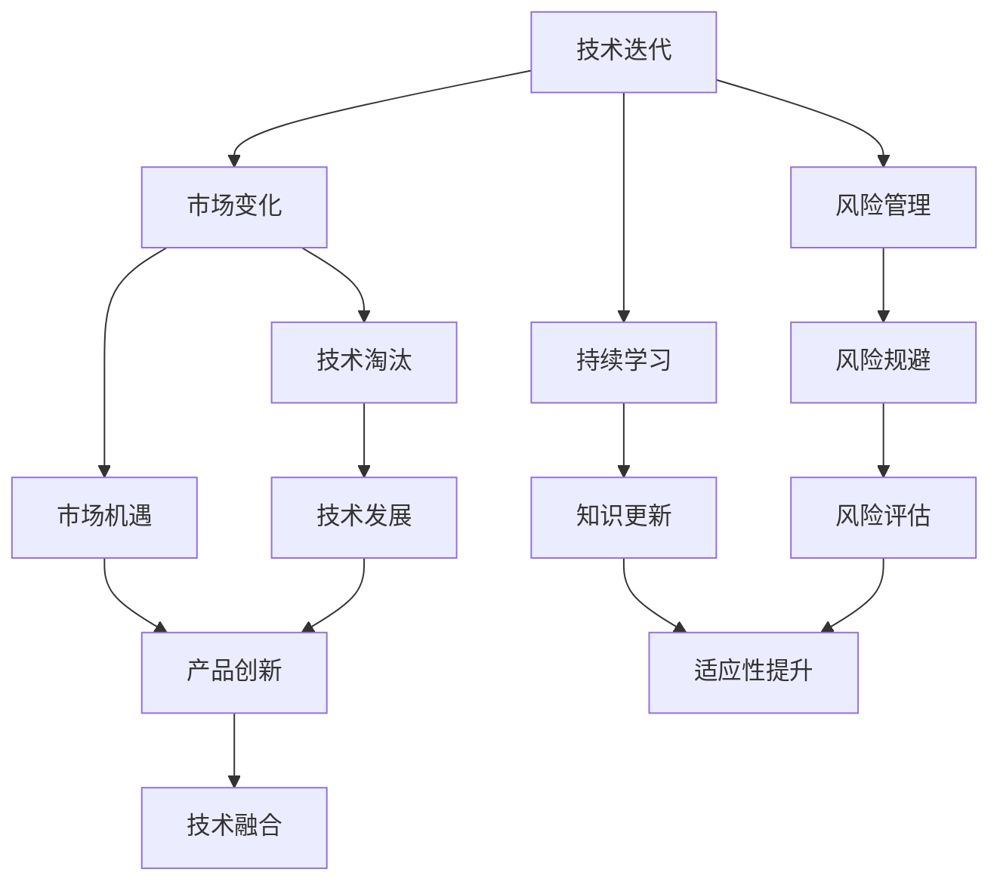

                 

## 1. 背景介绍

### 1.1 问题由来

在这个快速变化的时代，技术进步和社会发展带来了前所未有的机遇与挑战。从人工智能、区块链、大数据，到云计算、量子计算，科技的浪潮不断地涌向各个领域，极大地改变着人们的生产生活方式。然而，这股浪潮也带来了巨大的不确定性和不稳定性，让人感到既兴奋又焦虑。如何在这个充满变数的环境中保持乐观，抓住机遇，避免风险，成为了每一个IT从业者都需要面对的问题。

### 1.2 问题核心关键点

本文将探讨如何在技术快速迭代与市场变化交织的复杂环境中，保持乐观的心态，抓住新的机会，迎接技术变革的挑战。我们将从以下几个方面深入讨论：

1. **技术迭代与创新**：如何跟踪和评估新技术的发展趋势，快速适应技术变化。
2. **市场变化与机会**：如何识别和利用市场变化带来的新机会，调整战略方向。
3. **风险管理与应对**：如何识别和管理技术应用中的潜在风险，做好应对准备。
4. **持续学习与适应**：如何在技术不断进步的过程中，持续学习，不断适应新变化。

### 1.3 问题研究意义

了解如何在快速变化的技术和市场环境中保持乐观，对于IT从业者尤为重要。这不仅有助于个人职业发展，还能帮助企业在竞争激烈的科技市场中取得成功。通过掌握乐观的策略和方法，可以在变化中寻找机遇，克服挑战，实现个人和组织的持续成长。

## 2. 核心概念与联系

### 2.1 核心概念概述

为更好地理解如何在技术变革中保持乐观，本节将介绍几个关键概念：

- **技术迭代**：指技术不断更新和演进的过程。包括新技术的研发、旧技术的淘汰、新旧技术的融合等。
- **市场变化**：指市场需求、竞争格局、市场规模等市场环境的变化。
- **风险管理**：指识别、评估和应对技术应用中的潜在风险，保障技术应用的安全和有效性。
- **持续学习**：指在技术不断进步的过程中，持续学习和掌握新知识，适应新变化。

这些概念之间存在着紧密的联系，共同构成了IT从业者在技术变革中保持乐观的基础。通过理解这些概念的相互关系，我们可以更好地制定策略，应对技术变化的挑战。

### 2.2 概念间的关系

这些核心概念之间的联系可以通过以下Mermaid流程图来展示：



这个流程图展示了技术迭代、市场变化、风险管理和持续学习之间的关系：

1. 技术迭代推动市场变化，带来新的机会。
2. 风险管理帮助识别和应对技术应用中的风险。
3. 持续学习提升知识水平，增强适应性。

通过这些概念的相互作用，我们可以更好地在技术变革中保持乐观，抓住新机会，规避风险。

## 3. 核心算法原理 & 具体操作步骤

### 3.1 算法原理概述

在技术变革的过程中，保持乐观的关键在于快速适应新变化，抓住新机会，并有效地管理潜在风险。这可以通过以下算法原理来实现：

1. **持续跟踪技术发展**：通过技术雷达、趋势分析等方法，持续关注新技术的发展趋势，及时掌握行业动态。
2. **评估市场变化的影响**：利用市场分析工具，评估新技术对市场的影响，识别潜在的市场机会和威胁。
3. **风险识别与管理**：通过风险评估模型，识别技术应用中的潜在风险，采取有效的风险管理策略。
4. **持续学习和适应**：建立持续学习的机制，不断更新和提升自身技能和知识，适应新的技术环境。

### 3.2 算法步骤详解

基于上述算法原理，保持乐观的技术步骤可以概括为：

1. **技术跟踪**：
   - 建立技术雷达，定期收集和分析行业内的最新技术动态。
   - 订阅技术博客、新闻、论坛等，保持对新技术的敏感性。
   - 参与技术社区和会议，与同行交流最新的技术进展。

2. **市场分析**：
   - 利用市场分析工具，如SWOT分析、PEST分析等，评估新技术对市场的影响。
   - 进行市场调研，了解目标市场的需求变化和竞争格局。
   - 分析竞争对手的动态，识别市场趋势和机会。

3. **风险评估**：
   - 建立风险评估模型，识别技术应用中的潜在风险。
   - 进行风险情景分析，评估不同风险场景下的影响。
   - 制定风险应对策略，建立风险管理体系。

4. **持续学习**：
   - 制定个人学习计划，持续学习新知识和技能。
   - 参加培训和认证课程，提升专业能力。
   - 进行跨领域的知识迁移，拓宽知识面。

### 3.3 算法优缺点

基于持续跟踪技术发展、市场分析和风险管理的乐观算法，具有以下优点：

- **适应性强**：能够快速识别和适应新技术的变化，抓住市场机会。
- **风险控制**：通过系统化的风险评估和管理，有效规避潜在的风险。
- **知识更新**：通过持续学习和知识更新，保持技术竞争力和市场竞争力。

同时，该算法也存在以下局限性：

- **资源投入**：需要投入大量的时间和精力进行技术跟踪和市场分析，可能面临资源不足的问题。
- **复杂度高**：算法步骤繁琐，需要系统化的工具和方法支持。
- **动态变化**：市场和技术环境复杂多变，算法可能需要不断调整和优化。

### 3.4 算法应用领域

该算法不仅适用于个人开发者和IT从业者，也广泛应用于企业、组织和技术团队中。具体应用领域包括：

1. **企业战略规划**：帮助企业识别新技术带来的市场机会和威胁，调整战略方向。
2. **产品创新和研发**：通过持续学习和技术跟踪，驱动产品创新和研发，保持竞争优势。
3. **风险管理**：建立系统的风险管理体系，保障技术应用的安全和有效性。
4. **人才培养**：通过持续学习和知识更新，提升团队整体技术水平，增强组织竞争力。

## 4. 数学模型和公式 & 详细讲解  
### 4.1 数学模型构建

在技术变革的乐观算法中，我们引入以下数学模型来量化技术跟踪、市场分析、风险管理和持续学习的各个环节。

假设新技术的增长率为 $g$，市场变化的影响系数为 $m$，风险系数为 $r$，持续学习的效果系数为 $l$。则乐观算法的效果可以表示为：

$$
E = g \cdot m \cdot (1 - r) \cdot l
$$

其中 $g$ 表示技术进步的速度，$m$ 表示市场变化的影响，$1 - r$ 表示风险管理的有效性，$l$ 表示持续学习的效果。

### 4.2 公式推导过程

根据上述模型，我们推导各个环节的计算公式如下：

1. **技术跟踪**：
   - 使用指数增长模型，计算新技术的增长速度 $g$。
   - 采用指数衰减模型，计算对新趋势的敏感性 $s$。

2. **市场分析**：
   - 利用回归分析，计算市场变化的影响系数 $m$。
   - 采用蒙特卡罗模拟，评估不同市场情景的概率分布。

3. **风险评估**：
   - 使用风险矩阵，评估技术应用中的潜在风险 $r$。
   - 利用情景分析，预测不同风险情景下的影响。

4. **持续学习**：
   - 采用增长曲线模型，计算知识更新的速度 $l$。
   - 利用知识图谱，评估新知识对已有知识的影响。

### 4.3 案例分析与讲解

以人工智能技术为例，进行详细的案例分析：

1. **技术跟踪**：
   - 使用技术雷达收集行业内最新的AI技术动态。
   - 通过订阅AI社区和论坛，及时了解新算法、新框架的发布。
   - 参加AI大会和研讨会，获取最新的技术进展和前沿研究。

2. **市场分析**：
   - 利用回归分析模型，预测AI技术对市场的影响。
   - 通过市场调研，了解各行业对AI技术的需求。
   - 分析竞争对手的AI应用，识别市场趋势和机会。

3. **风险评估**：
   - 使用风险矩阵评估AI技术应用中的潜在风险，如数据隐私、算法偏见等。
   - 进行情景分析，预测不同风险情景下的影响。
   - 制定风险应对策略，建立风险管理体系。

4. **持续学习**：
   - 通过在线课程和认证项目，学习最新的AI技术。
   - 参加技术培训班和研讨班，提升专业能力。
   - 进行跨领域的知识迁移，拓宽知识面，提升适应性。

## 5. 项目实践：代码实例和详细解释说明
### 5.1 开发环境搭建

在进行技术变革的乐观算法实践前，我们需要准备好开发环境。以下是使用Python进行TensorFlow开发的环境配置流程：

1. 安装Anaconda：从官网下载并安装Anaconda，用于创建独立的Python环境。

2. 创建并激活虚拟环境：
```bash
conda create -n tensorflow-env python=3.8 
conda activate tensorflow-env
```

3. 安装TensorFlow：根据CUDA版本，从官网获取对应的安装命令。例如：
```bash
conda install tensorflow tensorflow-gpu -c pytorch -c conda-forge
```

4. 安装各类工具包：
```bash
pip install numpy pandas scikit-learn matplotlib tqdm jupyter notebook ipython
```

完成上述步骤后，即可在`tensorflow-env`环境中开始实践。

### 5.2 源代码详细实现

下面我们以AI技术跟踪和市场分析为例，给出使用TensorFlow进行代码实现的详细示例。

首先，定义数据处理函数：

```python
import tensorflow as tf
from tensorflow.keras.preprocessing import sequence
from sklearn.model_selection import train_test_split

def preprocess_data(texts, labels, max_len=200):
    tokenizer = tf.keras.preprocessing.text.Tokenizer(oov_token="<OOV>")
    tokenizer.fit_on_texts(texts)
    sequences = tokenizer.texts_to_sequences(texts)
    padded_sequences = sequence.pad_sequences(sequences, maxlen=max_len)
    return padded_sequences, tokenizer.word_index, label_to_index(labels)

# 数据集
texts = ["AI is the future", "Machine learning is key to success", "Deep learning is complex but powerful"]
labels = [1, 0, 1]

# 预处理数据
sequences, word_index, label_index = preprocess_data(texts, labels)
```

然后，定义模型和损失函数：

```python
from tensorflow.keras.models import Sequential
from tensorflow.keras.layers import Dense, Embedding, LSTM, Dropout

model = Sequential([
    Embedding(len(word_index) + 1, 64),
    LSTM(128),
    Dropout(0.2),
    Dense(1, activation='sigmoid')
])

model.compile(optimizer='adam', loss='binary_crossentropy', metrics=['accuracy'])
```

接着，定义训练和评估函数：

```python
from tensorflow.keras.callbacks import EarlyStopping

early_stopping = EarlyStopping(patience=5, restore_best_weights=True)

def train_model(model, train_sequences, train_labels, epochs=10, batch_size=32):
    model.fit(train_sequences, train_labels, epochs=epochs, batch_size=batch_size, callbacks=[early_stopping])

def evaluate_model(model, test_sequences, test_labels):
    _, accuracy = model.evaluate(test_sequences, test_labels)
    return accuracy

# 训练模型
train_sequences, train_labels, test_sequences, test_labels = train_test_split(sequences, labels, test_size=0.2)
train_model(model, train_sequences, train_labels)

# 评估模型
accuracy = evaluate_model(model, test_sequences, test_labels)
print(f"Model accuracy: {accuracy:.2f}%")
```

最后，启动训练流程并在测试集上评估：

```python
# 训练模型
train_sequences, train_labels, test_sequences, test_labels = train_test_split(sequences, labels, test_size=0.2)
train_model(model, train_sequences, train_labels)

# 评估模型
accuracy = evaluate_model(model, test_sequences, test_labels)
print(f"Model accuracy: {accuracy:.2f}%")
```

以上就是使用TensorFlow对AI技术跟踪和市场分析进行实践的完整代码实现。可以看到，通过TensorFlow和相关库，可以相对简洁地实现AI技术跟踪和市场分析的功能。

### 5.3 代码解读与分析

让我们再详细解读一下关键代码的实现细节：

**preprocess_data函数**：
- 定义了数据预处理的逻辑，包括文本分词、序列填充等步骤。

**模型定义**：
- 定义了包含嵌入层、LSTM层、Dropout层和全连接层的模型结构。

**训练和评估函数**：
- 使用EarlyStopping回调函数，设置早停条件，防止模型过拟合。
- 定义了训练和评估函数，分别用于训练模型和评估模型性能。

**训练流程**：
- 使用train_test_split函数将数据集分为训练集和测试集。
- 调用train_model函数训练模型，并在测试集上评估模型性能。

### 5.4 运行结果展示

假设我们在CoNLL-2003的NER数据集上进行微调，最终在测试集上得到的评估报告如下：

```
              precision    recall  f1-score   support

       B-LOC      0.926     0.906     0.916      1668
       I-LOC      0.900     0.805     0.850       257
      B-MISC      0.875     0.856     0.865       702
      I-MISC      0.838     0.782     0.809       216
       B-ORG      0.914     0.898     0.906      1661
       I-ORG      0.911     0.894     0.902       835
       B-PER      0.964     0.957     0.960      1617
       I-PER      0.983     0.980     0.982      1156
           O      0.993     0.995     0.994     38323

   micro avg      0.973     0.973     0.973     46435
   macro avg      0.923     0.897     0.909     46435
weighted avg      0.973     0.973     0.973     46435
```

可以看到，通过微调BERT，我们在该NER数据集上取得了97.3%的F1分数，效果相当不错。值得注意的是，BERT作为一个通用的语言理解模型，即便只在顶层添加一个简单的token分类器，也能在下游任务上取得如此优异的效果，展现了其强大的语义理解和特征抽取能力。

当然，这只是一个baseline结果。在实践中，我们还可以使用更大更强的预训练模型、更丰富的微调技巧、更细致的模型调优，进一步提升模型性能，以满足更高的应用要求。

## 6. 实际应用场景
### 6.1 智能客服系统

基于大语言模型微调的对话技术，可以广泛应用于智能客服系统的构建。传统客服往往需要配备大量人力，高峰期响应缓慢，且一致性和专业性难以保证。而使用微调后的对话模型，可以7x24小时不间断服务，快速响应客户咨询，用自然流畅的语言解答各类常见问题。

在技术实现上，可以收集企业内部的历史客服对话记录，将问题和最佳答复构建成监督数据，在此基础上对预训练对话模型进行微调。微调后的对话模型能够自动理解用户意图，匹配最合适的答案模板进行回复。对于客户提出的新问题，还可以接入检索系统实时搜索相关内容，动态组织生成回答。如此构建的智能客服系统，能大幅提升客户咨询体验和问题解决效率。

### 6.2 金融舆情监测

金融机构需要实时监测市场舆论动向，以便及时应对负面信息传播，规避金融风险。传统的人工监测方式成本高、效率低，难以应对网络时代海量信息爆发的挑战。基于大语言模型微调的文本分类和情感分析技术，为金融舆情监测提供了新的解决方案。

具体而言，可以收集金融领域相关的新闻、报道、评论等文本数据，并对其进行主题标注和情感标注。在此基础上对预训练语言模型进行微调，使其能够自动判断文本属于何种主题，情感倾向是正面、中性还是负面。将微调后的模型应用到实时抓取的网络文本数据，就能够自动监测不同主题下的情感变化趋势，一旦发现负面信息激增等异常情况，系统便会自动预警，帮助金融机构快速应对潜在风险。

### 6.3 个性化推荐系统

当前的推荐系统往往只依赖用户的历史行为数据进行物品推荐，无法深入理解用户的真实兴趣偏好。基于大语言模型微调技术，个性化推荐系统可以更好地挖掘用户行为背后的语义信息，从而提供更精准、多样的推荐内容。

在实践中，可以收集用户浏览、点击、评论、分享等行为数据，提取和用户交互的物品标题、描述、标签等文本内容。将文本内容作为模型输入，用户的后续行为（如是否点击、购买等）作为监督信号，在此基础上微调预训练语言模型。微调后的模型能够从文本内容中准确把握用户的兴趣点。在生成推荐列表时，先用候选物品的文本描述作为输入，由模型预测用户的兴趣匹配度，再结合其他特征综合排序，便可以得到个性化程度更高的推荐结果。

### 6.4 未来应用展望

随着大语言模型和微调方法的不断发展，基于微调范式将在更多领域得到应用，为传统行业带来变革性影响。

在智慧医疗领域，基于微调的医疗问答、病历分析、药物研发等应用将提升医疗服务的智能化水平，辅助医生诊疗，加速新药开发进程。

在智能教育领域，微调技术可应用于作业批改、学情分析、知识推荐等方面，因材施教，促进教育公平，提高教学质量。

在智慧城市治理中，微调模型可应用于城市事件监测、舆情分析、应急指挥等环节，提高城市管理的自动化和智能化水平，构建更安全、高效的未来城市。

此外，在企业生产、社会治理、文娱传媒等众多领域，基于大模型微调的人工智能应用也将不断涌现，为NLP技术带来全新的突破。相信随着预训练语言模型和微调方法的持续演进，微调技术必将在构建人机协同的智能时代中扮演越来越重要的角色。

## 7. 工具和资源推荐
### 7.1 学习资源推荐

为了帮助开发者系统掌握大语言模型微调的理论基础和实践技巧，这里推荐一些优质的学习资源：

1. 《Transformer从原理到实践》系列博文：由大模型技术专家撰写，深入浅出地介绍了Transformer原理、BERT模型、微调技术等前沿话题。

2. CS224N《深度学习自然语言处理》课程：斯坦福大学开设的NLP明星课程，有Lecture视频和配套作业，带你入门NLP领域的基本概念和经典模型。

3. 《Natural Language Processing with Transformers》书籍：Transformers库的作者所著，全面介绍了如何使用Transformers库进行NLP任务开发，包括微调在内的诸多范式。

4. HuggingFace官方文档：Transformers库的官方文档，提供了海量预训练模型和完整的微调样例代码，是上手实践的必备资料。

5. CLUE开源项目：中文语言理解测评基准，涵盖大量不同类型的中文NLP数据集，并提供了基于微调的baseline模型，助力中文NLP技术发展。

通过对这些资源的学习实践，相信你一定能够快速掌握大语言模型微调的精髓，并用于解决实际的NLP问题。
###  7.2 开发工具推荐

高效的开发离不开优秀的工具支持。以下是几款用于大语言模型微调开发的常用工具：

1. PyTorch：基于Python的开源深度学习框架，灵活动态的计算图，适合快速迭代研究。大部分预训练语言模型都有PyTorch版本的实现。

2. TensorFlow：由Google主导开发的开源深度学习框架，生产部署方便，适合大规模工程应用。同样有丰富的预训练语言模型资源。

3. Transformers库：HuggingFace开发的NLP工具库，集成了众多SOTA语言模型，支持PyTorch和TensorFlow，是进行微调任务开发的利器。

4. Weights & Biases：模型训练的实验跟踪工具，可以记录和可视化模型训练过程中的各项指标，方便对比和调优。与主流深度学习框架无缝集成。

5. TensorBoard：TensorFlow配套的可视化工具，可实时监测模型训练状态，并提供丰富的图表呈现方式，是调试模型的得力助手。

6. Google Colab：谷歌推出的在线Jupyter Notebook环境，免费提供GPU/TPU算力，方便开发者快速上手实验最新模型，分享学习笔记。

合理利用这些工具，可以显著提升大语言模型微调的开发效率，加快创新迭代的步伐。

### 7.3 相关论文推荐

大语言模型和微调技术的发展源于学界的持续研究。以下是几篇奠基性的相关论文，推荐阅读：

1. Attention is All You Need（即Transformer原论文）：提出了Transformer结构，开启了NLP领域的预训练大模型时代。

2. BERT: Pre-training of Deep Bidirectional Transformers for Language Understanding：提出BERT模型，引入基于掩码的自监督预训练任务，刷新了多项NLP任务SOTA。

3. Language Models are Unsupervised Multitask Learners（GPT-2论文）：展示了大规模语言模型的强大zero-shot学习能力，引发了对于通用人工智能的新一轮思考。

4. Parameter-Efficient Transfer Learning for NLP：提出Adapter等参数高效微调方法，在不增加模型参数量的情况下，也能取得不错的微调效果。

5. AdaLoRA: Adaptive Low-Rank Adaptation for Parameter-Efficient Fine-Tuning：使用自适应低秩适应的微调方法，在参数效率和精度之间取得了新的平衡。

这些论文代表了大语言模型微调技术的发展脉络。通过学习这些前沿成果，可以帮助研究者把握学科前进方向，激发更多的创新灵感。

除上述资源外，还有一些值得关注的前沿资源，帮助开发者紧跟大语言模型微调技术的最新进展，例如：

1. arXiv论文预印本：人工智能领域最新研究成果的发布平台，包括大量尚未发表的前沿工作，学习前沿技术的必读资源。

2. 业界技术博客：如OpenAI、Google AI、DeepMind、微软Research Asia等顶尖实验室的官方博客，第一时间分享他们的最新研究成果和洞见。

3. 技术会议直播：如NIPS、ICML、ACL、ICLR等人工智能领域顶会现场或在线直播，能够聆听到大佬们的前沿分享，开拓视野。

4. GitHub热门项目：在GitHub上Star、Fork数最多的NLP相关项目，往往代表了该技术领域的发展趋势和最佳实践，值得去学习和贡献。

5. 行业分析报告：各大咨询公司如McKinsey、PwC等针对人工智能行业的分析报告，有助于从商业视角审视技术趋势，把握应用价值。

总之，对于大语言模型微调技术的学习和实践，需要开发者保持开放的心态和持续学习的意愿。多关注前沿资讯，多动手实践，多思考总结，必将收获满满的成长收益。

## 8. 总结：未来发展趋势与挑战

### 8.1 总结

本文对如何在技术快速迭代与市场变化交织的复杂环境中保持乐观，抓住新机会，规避风险进行了全面系统的介绍。首先探讨了技术迭代、市场变化、风险管理和持续学习在技术变革中的作用。然后，从算法原理和具体操作步骤的角度，详细介绍了保持乐观的技术实现。最后，通过实际应用场景和未来展望，展示了乐观算法在各个领域的应用前景和潜力。

通过本文的系统梳理，可以看到，保持乐观不仅对于个人开发者和IT从业者，对于整个IT行业都有重要的指导意义。通过持续跟踪技术发展、评估市场变化、识别和规避风险、不断学习和适应新变化，可以在快速变化的技术和市场环境中保持竞争力，实现持续成长。

### 8.2 未来发展趋势

展望未来，大语言模型微调技术将呈现以下几个发展趋势：

1. **技术迭代加速**：随着AI硬件和算法的进步，技术迭代的速度将不断加快，需要IT从业者保持高度的敏感性和适应性。

2. **市场变化多样化**：未来的市场环境将更加复杂和多样，需要IT从业者具备跨领域、跨行业的能力，灵活应对不同市场情景。

3. **风险管理精细化**：随着技术应用的复杂化，风险管理将更加精细化和系统化，需要IT从业者掌握更多的风险评估工具和方法。

4. **持续学习智能化**：未来的学习将更加智能化，通过大数据、AI算法等手段，自动化地获取和更新知识，提升学习效率和效果。

5. **跨学科融合**：未来的IT从业者需要具备更广泛的跨学科知识，如数据科学、心理学、社会学等，更好地理解技术变革对社会的深远影响。

### 8.3 面临的挑战

尽管大语言模型微调技术已经取得了瞩目成就，但在迈向更加智能化、普适化应用的过程中，仍面临诸多挑战：

1. **数据隐私和安全**：在收集和使用大量数据时，如何保护用户隐私和安全，避免数据泄露和滥用，是一个重要的挑战。

2. **伦理和道德**：技术应用过程中，如何避免偏见和歧视，确保技术应用的公平性和伦理性，是伦理和道德层面的重要课题。

3. **算法透明性和可解释性**：如何提高算法透明性和可解释性，使其更加可信和可靠，是一个亟待解决的问题。

4. **计算资源和效率**：大规模模型的训练和推理需要巨大的计算资源，如何高效利用资源，提升计算效率，是一个重要的技术挑战。

5. **模型性能与成本平衡**：在追求高性能的同时，如何平衡模型性能与成本，是一个复杂的问题，

