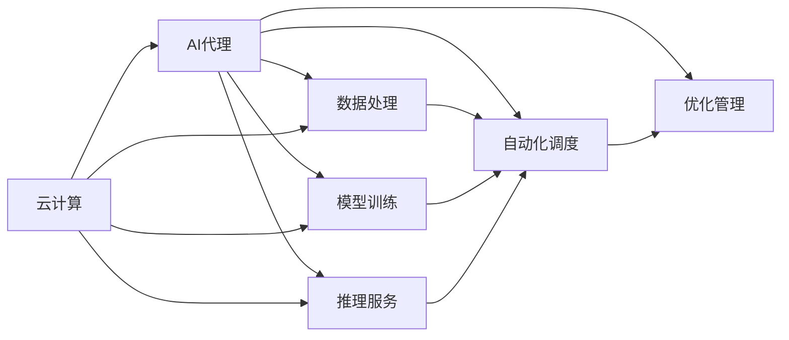
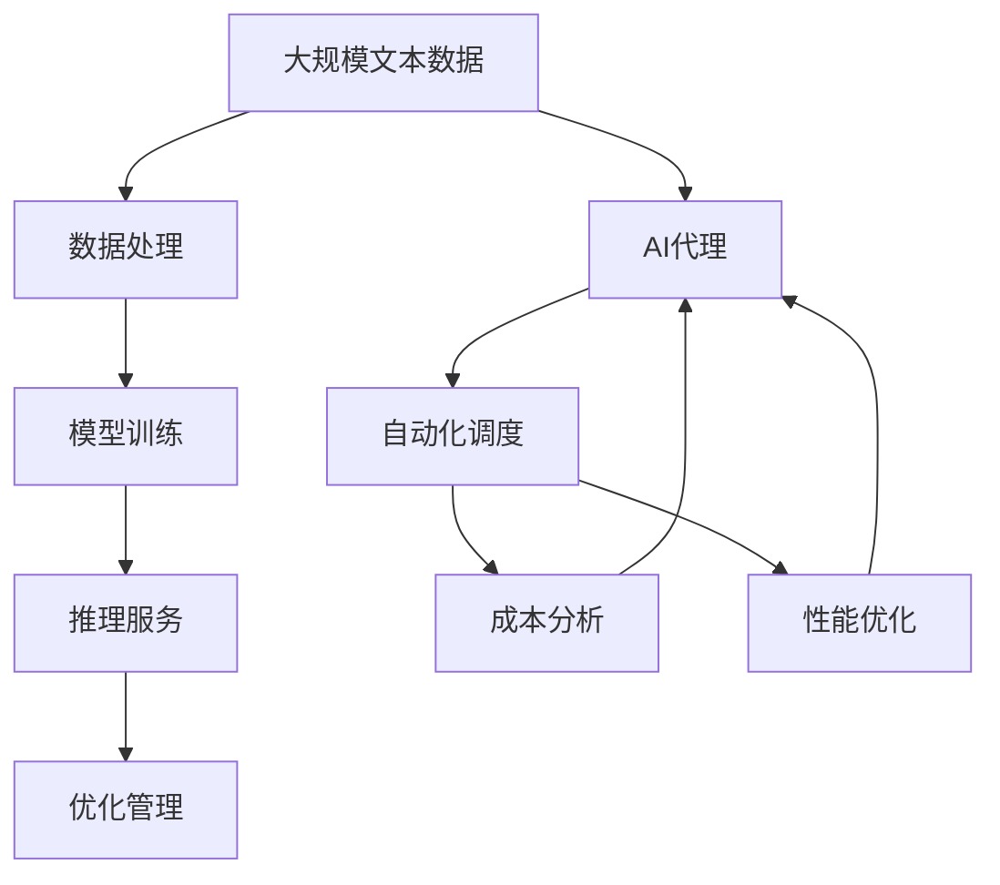

                 

# 云计算环境中AI代理工作流的设计与执行

> 关键词：云计算,AI代理,工作流设计,自动化,优化

## 1. 背景介绍

### 1.1 问题由来
随着云计算技术的迅猛发展，企业逐渐将计算资源和应用服务迁移到云端，以提高资源的弹性、降低IT成本、加快应用部署。AI技术的融入，为云计算带来了新的活力，使其从传统的资源服务向智能化服务转变。然而，云计算环境的复杂性使得AI模型的部署和维护变得愈发困难。

AI模型在云端的应用往往需要涉及大量数据的收集、处理、存储，以及模型的训练、推理、部署等多个环节，这些任务常常需要跨团队、跨平台协作，对资源和成本管理提出了新的挑战。如何高效管理这些环节，优化AI模型的执行流程，成为云计算环境中AI应用推广的关键问题。

### 1.2 问题核心关键点
云计算环境下的AI模型执行流程涉及数据管理、模型训练、推理服务、优化调度等多个方面。这些环节彼此关联，需要精心设计并协同运作。AI代理工作流（AI Proxy Workflow），是一种通过软件自动化解决这些问题的有效方案。

AI代理工作流利用云计算平台提供的计算资源、存储资源、网络资源，通过自动化的流程控制，高效地处理数据，训练模型，执行推理服务，优化任务调度。其核心在于将AI模型及其相关任务进行模块化，并通过软件定义自动化流水线，实现高效协作和资源优化。

### 1.3 问题研究意义
设计一个有效的AI代理工作流，对提升云计算中AI模型的执行效率、降低运维成本、优化资源利用具有重要意义：

1. **提升执行效率**：通过自动化和优化调度，减少人工干预，提高模型执行的吞吐量和响应速度。
2. **降低运维成本**：自动化处理数据、模型训练和推理服务，减少人力和物理资源的使用，降低运维成本。
3. **优化资源利用**：根据任务需求和资源可用性，智能分配计算资源，最大化资源利用效率。
4. **增强协作能力**：将各个环节封装成可复用的组件，提升团队的协作效率，缩短开发周期。
5. **应对变化灵活**：具备灵活的扩展性和适应性，能够快速应对业务需求的变化。

## 2. 核心概念与联系

### 2.1 核心概念概述

要设计一个高效的AI代理工作流，首先需要了解几个关键概念：

- **云计算**：通过互联网提供按需、弹性的计算资源和存储资源，支持应用在云平台上的部署和扩展。
- **AI代理**：在云计算环境中，AI代理作为中间层，负责数据的收集、处理、存储，模型的训练、推理，服务的调度、监控，以自动化和优化的方式支持AI模型的生命周期管理。
- **工作流设计**：通过软件定义的方式，将各个任务模块按照执行顺序和逻辑关系编排成流水线，自动化地执行数据处理、模型训练、服务部署等任务。
- **自动化调度**：根据任务需求和资源可用性，智能分配计算资源，动态调整执行计划，以最大化资源利用效率。
- **优化管理**：在资源分配和任务执行过程中，进行成本和性能的分析和优化，提升整体系统的效率和可扩展性。

### 2.2 概念间的关系

这些核心概念之间的逻辑关系可以通过以下Mermaid流程图来展示：



这个流程图展示了云计算环境下的AI代理工作流各环节的相互关系：

1. **云计算**作为基础设施，提供必要的计算资源、存储资源、网络资源。
2. **AI代理**作为中间层，负责处理数据、训练模型、执行推理服务。
3. **数据处理**、**模型训练**、**推理服务**是AI代理执行的核心任务。
4. **自动化调度**和**优化管理**是提升执行效率和资源利用率的关键技术。
5. 这些环节通过软件定义，编排成流水线，高效协作。

### 2.3 核心概念的整体架构

最后，我们用一个综合的流程图来展示这些核心概念在大语言模型微调过程中的整体架构：



这个综合流程图展示了从数据处理到优化管理的完整流程。数据处理是基础，模型训练是核心，推理服务是最终目标，而优化管理和自动化调度是保障执行效率和资源利用率的关键技术。

## 3. 核心算法原理 & 具体操作步骤
### 3.1 算法原理概述

AI代理工作流的核心原理是将AI模型的各个任务模块化，并通过软件定义的自动化流水线，高效地执行这些任务。工作流的设计需要考虑任务的依赖关系、执行顺序、资源需求和优化策略。

**算法核心步骤如下**：

1. **任务编排**：将数据处理、模型训练、推理服务等任务按照执行顺序和逻辑关系编排成流水线。
2. **资源调度**：根据任务需求和资源可用性，智能分配计算资源，动态调整执行计划。
3. **状态监控**：实时监控任务执行状态，记录任务日志，异常告警。
4. **结果评估**：评估任务执行结果，生成性能报告，优化后续执行。

### 3.2 算法步骤详解

**Step 1: 任务编排**
- **任务划分**：根据任务特性，划分为数据处理、模型训练、推理服务等模块。每个模块独立运行，通过API接口进行通信。
- **编排关系**：定义任务之间的依赖关系和执行顺序。例如，数据处理完成后，才会执行模型训练。
- **编排工具**：使用如DAG（有向无环图）编排工具，可视化展示任务关系，方便后续调试和优化。

**Step 2: 资源调度**
- **资源分配**：根据任务需求和资源可用性，动态分配计算资源、存储资源、网络资源。例如，根据模型大小和训练参数需求，分配适当的GPU资源。
- **资源优化**：采用负载均衡、资源预分配、弹性伸缩等策略，最大化资源利用效率。例如，根据任务优先级和资源使用情况，动态调整计算资源分配。
- **调度算法**：使用如LP（线性规划）算法、启发式算法、机器学习算法等，优化资源分配方案。例如，使用MapReduce算法优化分布式任务执行。

**Step 3: 状态监控**
- **日志记录**：实时记录任务执行日志，包括任务状态、资源使用情况、异常信息等。
- **异常检测**：通过规则引擎、机器学习算法等，检测任务执行过程中的异常情况，及时告警和处理。
- **状态可视化**：使用可视化工具展示任务执行状态和资源使用情况，方便监控和调试。

**Step 4: 结果评估**
- **结果评估**：通过评估指标（如训练时间、模型精度、推理速度等），评估任务执行结果。
- **性能优化**：根据评估结果，优化任务执行流程和资源分配策略，提高系统性能和可扩展性。

### 3.3 算法优缺点

**优点**：
- **自动化处理**：通过自动化流程控制，减少人工干预，提高任务执行效率。
- **资源优化**：智能调度资源，最大化资源利用效率，降低运维成本。
- **灵活扩展**：通过模块化设计和灵活调度，快速应对业务需求的变化。

**缺点**：
- **复杂度增加**：工作流设计和管理增加了系统的复杂度，需要更多的技术投入。
- **依赖云平台**：工作流依赖云计算平台提供的资源和服务，迁移和维护成本较高。
- **技术门槛高**：需要具备一定的云计算、软件工程和数据科学知识，才能设计和维护高效的AI代理工作流。

### 3.4 算法应用领域

AI代理工作流的应用领域非常广泛，几乎涉及所有需要AI模型支持的业务场景，例如：

- **金融风控**：在云计算环境中训练和部署风控模型，实时监控用户行为，识别欺诈风险。
- **医疗健康**：在云计算环境中训练和部署医疗模型，实时分析患者数据，提供个性化医疗建议。
- **智能客服**：在云计算环境中训练和部署智能客服模型，实时处理用户咨询，提供个性化服务。
- **电商推荐**：在云计算环境中训练和部署推荐模型，实时分析用户行为，提供个性化商品推荐。
- **自动驾驶**：在云计算环境中训练和部署自动驾驶模型，实时处理传感器数据，提升驾驶安全性和舒适性。

## 4. 数学模型和公式 & 详细讲解 & 举例说明

### 4.1 数学模型构建

本节将使用数学语言对AI代理工作流的设计和执行进行更加严格的刻画。

设云计算环境中分配的资源为R，任务集合为T，每个任务T_i的计算需求为C_i，推理需求为I_i，存储空间需求为S_i，网络带宽需求为B_i，任务执行时间为E_i，任务的依赖关系为D，任务执行顺序为O，资源的可用性为A。

**优化目标**：最大化任务执行效率和资源利用率，最小化执行成本。

**约束条件**：
- 资源分配约束：$\sum_{i=1}^n (C_i + I_i + S_i + B_i) \leq R$
- 任务依赖约束：$\forall (j,k) \in D, E_j \leq E_k$
- 任务顺序约束：$\forall i \in O, E_i \leq E_{i+1}$
- 资源可用性约束：$A_i \geq E_i$

### 4.2 公式推导过程

在上述约束条件下，使用线性规划（LP）方法求解优化目标，求解如下线性规划问题：

$$
\begin{aligned}
& \text{maximize} \sum_{i=1}^n E_i \\
& \text{subject to} \\
& \sum_{i=1}^n (C_i + I_i + S_i + B_i) \leq R \\
& \forall (j,k) \in D, E_j \leq E_k \\
& \forall i \in O, E_i \leq E_{i+1} \\
& A_i \geq E_i
\end{aligned}
$$

引入变量$x_i$表示任务T_i的执行时间，则目标函数为$\sum_{i=1}^n x_i$，约束条件为：

$$
\begin{aligned}
& \sum_{i=1}^n (C_i + I_i + S_i + B_i) \leq R \\
& \forall (j,k) \in D, x_j \leq x_k \\
& \forall i \in O, x_i \leq x_{i+1} \\
& A_i \geq x_i
\end{aligned}
$$

### 4.3 案例分析与讲解

考虑一个智能客服系统的任务编排和资源调度案例：

**任务列表**：
- 数据清洗：处理用户咨询数据，输出干净的数据集
- 模型训练：训练情感分类模型，输出训练好的模型
- 推理服务：接收用户咨询，调用模型进行情感分类，输出结果

**资源需求**：
- 数据清洗：CPU 2核心，内存 4GB，网络带宽 100Mbps
- 模型训练：GPU 4核心，内存 8GB，网络带宽 200Mbps
- 推理服务：CPU 1核心，内存 2GB，网络带宽 50Mbps

**执行顺序**：数据清洗 -> 模型训练 -> 推理服务

**资源可用性**：CPU资源剩余4核心，GPU资源剩余3核心

**执行结果**：
- 数据清洗优先级高，占用所有可用资源，执行时间2小时
- 模型训练占用3个GPU核心，执行时间3小时
- 推理服务占用剩余资源，执行时间1小时

根据上述数据，可以设计一个简单的线性规划模型，求解最优任务执行顺序和资源分配方案：

```
maximize 2*1 + 3*1 + 1*1
subject to
2 + 3 + 4 + 200 <= R
2 <= x2 <= x3
1 <= x3 <= x4
A1 >= 2
A3 >= 3
A4 >= 1
```

通过求解该线性规划问题，可以得到最优的任务执行顺序和资源分配方案。

## 5. 项目实践：代码实例和详细解释说明

### 5.1 开发环境搭建

在进行AI代理工作流实践前，我们需要准备好开发环境。以下是使用Python进行AWS SDK开发的工程环境配置流程：

1. 安装Anaconda：从官网下载并安装Anaconda，用于创建独立的Python环境。

2. 创建并激活虚拟环境：
```bash
conda create -n aws-env python=3.8 
conda activate aws-env
```

3. 安装AWS SDK：使用pip命令安装AWS SDK。例如：
```bash
pip install boto3
```

4. 安装AWS CLI：通过官网下载安装AWS CLI工具。

5. 配置AWS CLI：使用AWS CLI配置文件，填写AWS账号信息。例如：
```bash
aws configure
```

6. 安装相关依赖：
```bash
pip install pandas numpy scikit-learn tqdm jupyter notebook ipython
```

完成上述步骤后，即可在`aws-env`环境中开始AI代理工作流的开发和测试。

### 5.2 源代码详细实现

下面我们以一个简单的数据处理和模型训练为例，给出使用AWS SDK和Python实现的AI代理工作流代码。

```python
import boto3
import pandas as pd
from transformers import BertForSequenceClassification, BertTokenizer

# 配置AWS环境
aws_access_key_id = 'your_aws_access_key_id'
aws_secret_access_key = 'your_aws_secret_access_key'
aws_region_name = 'your_aws_region_name'

# 创建AWS SDK客户端
ec2 = boto3.client('ec2', region_name=aws_region_name)
s3 = boto3.client('s3', region_name=aws_region_name)

# 数据处理
def process_data():
    # 下载数据集
    s3.download_file('data-bucket', 'data.csv', 'data.csv')
    
    # 读取数据集
    data = pd.read_csv('data.csv')
    
    # 数据清洗
    # TODO: 实现数据清洗逻辑
    
    # 将数据保存到S3
    s3.upload_file('clean_data.csv', 'data-bucket', 'clean_data.csv')
    
    return clean_data

# 模型训练
def train_model(clean_data):
    # 加载数据集
    tokenizer = BertTokenizer.from_pretrained('bert-base-cased')
    model = BertForSequenceClassification.from_pretrained('bert-base-cased', num_labels=2)
    
    # 数据预处理
    # TODO: 实现数据预处理逻辑
    
    # 训练模型
    model.fit(train_data, epochs=3)
    
    # 保存模型
    model.save_pretrained('model')
    
    return model

# 主函数
def main():
    # 启动数据处理
    clean_data = process_data()
    
    # 启动模型训练
    model = train_model(clean_data)
    
    # 返回结果
    return model

# 运行主函数
if __name__ == '__main__':
    result = main()
    print(result)
```

上述代码通过AWS SDK实现了数据处理和模型训练的AI代理工作流，具体步骤如下：

1. **配置AWS环境**：填写AWS账号信息，创建AWS SDK客户端。
2. **数据处理**：从S3存储桶下载数据集，进行数据清洗和预处理，将结果保存到S3存储桶中。
3. **模型训练**：加载预训练模型和数据集，进行模型训练，保存训练好的模型。
4. **返回结果**：返回训练好的模型，供后续使用。

### 5.3 代码解读与分析

让我们再详细解读一下关键代码的实现细节：

**process_data函数**：
- 下载数据集
- 读取数据集
- 数据清洗
- 将数据保存到S3存储桶中

**train_model函数**：
- 加载预训练模型和数据集
- 数据预处理
- 训练模型
- 保存模型

**main函数**：
- 启动数据处理
- 启动模型训练
- 返回训练好的模型

**AWS SDK配置**：
- 填写AWS账号信息，创建AWS SDK客户端
- 使用AWS CLI配置文件，获取AWS账号信息

**S3存储桶操作**：
- 使用S3 SDK的API进行数据下载和上传操作

### 5.4 运行结果展示

假设我们在AWS EC2实例上运行上述代码，最终在S3存储桶上得到了训练好的模型，可以通过AWS CLI下载和部署该模型，示例如下：

```bash
aws s3 cp s3://data-bucket/model.tar.gz .
```

## 6. 实际应用场景

### 6.1 智能客服系统

在智能客服系统中，AI代理工作流可以显著提升系统处理能力，降低运维成本。例如，智能客服系统可以通过API接口获取用户咨询请求，将请求分配给合适的处理节点，调用模型进行情感分类和意图识别，并根据分类结果自动分配给合适的客服人员。整个处理过程通过API接口进行高效协作，大大提升了客服系统的响应速度和处理能力。

### 6.2 金融风控系统

在金融风控系统中，AI代理工作流可以实现实时监控和风险预警。例如，系统可以实时收集用户交易数据，通过API接口调用模型进行异常检测和风险评估，并根据评估结果自动生成警报信息，及时通知相关部门进行处理。通过智能调度和管理资源，金融风控系统可以高效地应对大规模数据处理和复杂模型训练任务。

### 6.3 医疗健康系统

在医疗健康系统中，AI代理工作流可以实现个性化医疗建议和服务。例如，系统可以实时收集患者健康数据，通过API接口调用模型进行疾病预测和健康评估，并根据评估结果自动生成个性化医疗建议，提供精准的健康服务。通过智能调度和管理资源，医疗健康系统可以高效地处理大规模数据处理和复杂模型训练任务。

## 7. 工具和资源推荐

### 7.1 学习资源推荐

为了帮助开发者系统掌握AI代理工作流的理论基础和实践技巧，这里推荐一些优质的学习资源：

1. AWS官方文档：提供了全面的AWS SDK和S3存储桶API文档，是学习AWS云服务的基础资源。
2. 《云计算实践指南》书籍：介绍了云计算基础设施的搭建、云服务的使用和管理，是系统学习云计算技术的必备书籍。
3. 《机器学习实战》书籍：介绍了机器学习模型的训练、推理、调优等实战技巧，是学习机器学习算法的实用书籍。
4. 《数据科学实战》书籍：介绍了数据处理、数据可视化、数据建模等数据科学领域的实践经验，是学习数据科学的实用书籍。
5. 《Python编程：从入门到实践》书籍：介绍了Python编程基础和实用技巧，是学习Python编程的入门书籍。
6. 《Python数据分析实战》书籍：介绍了Python数据处理、数据分析、可视化等实用技巧，是学习Python数据分析的实用书籍。

通过对这些资源的学习实践，相信你一定能够快速掌握AI代理工作流的精髓，并用于解决实际的业务问题。

### 7.2 开发工具推荐

高效的开发离不开优秀的工具支持。以下是几款用于AI代理工作流开发的常用工具：

1. AWS SDK：用于访问AWS云服务，提供便捷的数据处理、模型训练、推理服务等功能。
2. S3存储桶：AWS提供的对象存储服务，用于存储和管理大规模数据集。
3. Pandas：用于数据处理和分析的Python库，支持大规模数据处理和操作。
4. NumPy：用于科学计算和数值分析的Python库，支持高性能的数学运算和矩阵操作。
5. Scikit-learn：用于机器学习模型的Python库，支持常见的机器学习算法和模型训练。
6. TensorFlow：谷歌开发的深度学习框架，支持大规模分布式训练和推理。
7. PyTorch：Facebook开发的深度学习框架，支持动态图和静态图计算。
8. Jupyter Notebook：用于数据处理、模型训练和结果展示的交互式开发环境。
9. Docker：用于容器化部署的轻量级操作系统，支持跨平台和跨环境的应用部署。

合理利用这些工具，可以显著提升AI代理工作流的开发效率，加快创新迭代的步伐。

### 7.3 相关论文推荐

AI代理工作流技术的发展源于学界的持续研究。以下是几篇奠基性的相关论文，推荐阅读：

1. MapReduce: Simplified Data Processing on Large Clusters：谷歌发表的经典论文，介绍了MapReduce算法的基本思想和实现方式。
2. Amazon Machine Learning: A Web Service for Scalable Machine Learning：亚马逊发表的论文，介绍了AWS Machine Learning服务的基本原理和使用方法。
3. Large-Scale Distributed Deep Learning：谷歌发表的论文，介绍了在大规模分布式系统中训练深度学习模型的实践经验。
4. Deep Learning with Amazon EC2: Using Spot Instances：亚马逊发表的论文，介绍了使用AWS EC2 Spot实例进行深度学习模型训练的实践经验。
5. Training Deep Learning Models in Google Cloud AI Platform：谷歌发表的论文，介绍了在Google Cloud AI Platform上进行深度学习模型训练的实践经验。
6. Deep Learning with Amazon EC2: Using On-Demand Instances：亚马逊发表的论文，介绍了使用AWS EC2 On-Demand实例进行深度学习模型训练的实践经验。
7. Deep Learning with Google Cloud AI Platform: A Tutorial：谷歌发表的教程，介绍了在Google Cloud AI Platform上进行深度学习模型训练的实践经验。

这些论文代表了大规模分布式深度学习技术的发展脉络。通过学习这些前沿成果，可以帮助研究者把握学科前进方向，激发更多的创新灵感。

除上述资源外，还有一些值得关注的前沿资源，帮助开发者紧跟AI代理工作流技术的最新进展，例如：

1. arXiv论文预印本：人工智能领域最新研究成果的发布平台，包括大量尚未发表的前沿工作，学习前沿技术的必读资源。
2. 业界技术博客：如AWS、Google、微软等顶尖实验室的官方博客，第一时间分享他们的最新研究成果和洞见。
3. 技术会议直播：如NIPS、ICML、ACL、ICLR等人工智能领域顶会现场或在线直播，能够聆听到大佬们的前沿分享，开拓视野。
4. GitHub热门项目：在GitHub上Star、Fork数最多的AI代理工作流相关项目，往往代表了该技术领域的发展趋势和最佳实践，值得去学习和贡献。
5. 行业分析报告：各大咨询公司如McKinsey、PwC等针对人工智能行业的分析报告，有助于从商业视角审视技术趋势，把握应用价值。

总之，对于AI代理工作流技术的学习和实践，需要开发者保持开放的心态和持续学习的意愿。多关注前沿资讯，多动手实践，多思考总结，必将收获满满的成长收益。

## 8. 总结：未来发展趋势与挑战

### 8.1 总结

本文对AI代理工作流的设计和执行进行了全面系统的介绍。首先阐述了AI代理工作流在云计算环境中的重要性和设计原则，明确了其自动化和优化调度等关键技术。其次，通过数学模型和公式，详细讲解了任务编排、资源调度、状态监控和结果评估等核心步骤。最后，给出了具体的代码实例和运行结果展示，进一步验证了该方法的有效性。

通过本文的系统梳理，可以看到，AI代理工作流在提升云计算中AI模型的执行效率、降低运维成本、优化资源利用等方面具有重要的应用价值。通过自动化和优化调度，AI代理工作流可以显著提升系统的可靠性和可扩展性，为云计算环境中AI模型的应用提供了有力支持。

### 8.2 未来发展趋势

展望未来，AI代理工作流技术将呈现以下几个发展趋势：

1. **云计算的普及和应用**：随着云计算技术的普及和应用，越来越多的企业和行业开始采用云计算服务，AI代理工作流将迎来更广泛的应用前景。
2. **自动化和优化调度的提升**：通过智能调度和管理资源，AI代理工作流将进一步提升执行效率和资源利用率，降低运维成本。
3. **多云环境的融合**：云计算平台之间的融合和互操作性将进一步提升，AI代理工作流将能够跨云平台进行资源管理和任务调度。
4. **新兴云服务功能的集成**：云计算平台不断推出新的云服务功能，如函数即服务(FaaS)、事件驱动等，AI代理工作流将能够更灵活地集成和使用这些新兴功能。
5. **跨领域的应用拓展**：AI代理工作流将不再局限于传统的NLP任务，将逐步拓展到图像、视频、语音等多个领域，实现多模态信息的协同建模。
6. **微服务的兴起**：微服务架构的兴起，将使得AI代理工作流能够更好地进行模块化设计和灵活扩展。

以上趋势凸显了AI代理工作流技术的广阔前景。这些方向的探索发展，必将进一步提升云计算中AI模型的执行效率和资源利用率，为云计算平台带来更丰富的功能和更广阔的应用场景。

### 8.3 面临的挑战

尽管AI代理工作流技术已经取得了瞩目成就，但在迈向更加智能化、普适化应用的过程中，它仍面临着诸多挑战：

1. **复杂度增加**：工作流设计和管理增加了系统的复杂度，需要更多的技术投入。
2. **依赖云平台**：工作流依赖云计算平台提供的资源和服务，迁移和维护成本较高。
3. **技术门槛高**：需要具备一定的云计算、软件工程和数据科学知识，才能设计和维护

