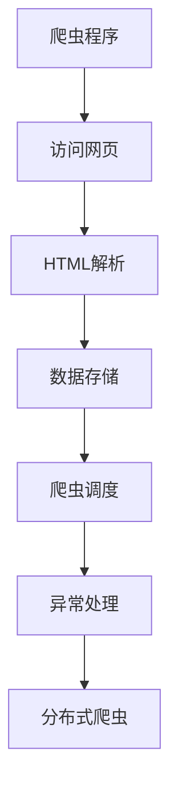
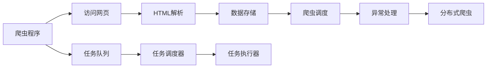

                 

# 京东商品数据网络爬虫设计

## 1. 背景介绍

### 1.1 问题由来
随着电子商务的迅猛发展，各大电商平台积累了海量的商品信息数据。对于电商平台来说，这些商品数据是其业务决策和优化不可或缺的重要资源。然而，这些数据往往分散在电商平台的各个页面上，提取和整合需要耗费大量人力和时间。为了更高效地获取和利用商品数据，网络爬虫成为了一种高效且成本低廉的数据采集手段。

京东作为中国的顶尖电商平台之一，其商品数据对于分析市场趋势、优化商品推荐、提升用户体验等方面具有重要价值。然而，京东的商品信息分布在多个网页中，并且页面结构复杂、内容丰富。如何设计高效的网络爬虫，自动爬取和整合这些商品信息，成为亟待解决的问题。

### 1.2 问题核心关键点
网络爬虫的核心在于如何高效地抓取网页并提取出有用信息。设计一个高效的网络爬虫，需要考虑以下几个关键点：
1. 抓取网页的广度和深度。要覆盖尽可能多的商品页面，同时深度抓取每个页面的详细信息。
2. 解析网页结构。京东商品页面结构复杂，需要解析出网页中的商品名称、价格、描述、图片、评价等信息。
3. 处理数据格式。商品信息通常涉及文字、图片、表格等多种格式，需要设计合适的数据格式来存储。
4. 爬虫效率和稳定性。要设计高效的爬虫算法，保证抓取速度和稳定性，避免对京东服务器造成过大的访问压力。

## 2. 核心概念与联系

### 2.1 核心概念概述

为了设计一个高效的网络爬虫，我们需要先了解一些核心概念：

- **网页抓取**：通过爬虫程序自动访问网页，获取网页内容。
- **HTML解析**：将网页内容解析为有结构的文档，提取网页中的有用信息。
- **数据存储**：将抓取到的数据保存到一个结构化的数据库中，方便后续分析和使用。
- **爬虫调度**：通过任务队列和调度器，控制爬虫的执行顺序和并发数，优化爬虫效率。
- **异常处理**：设计合适的异常处理机制，保证爬虫的稳定性和鲁棒性。
- **分布式爬虫**：将爬虫任务分布到多个服务器上，提高爬虫效率和稳定性。

这些核心概念共同构成了网络爬虫的基本架构。

### 2.2 概念间的关系

下面用Mermaid绘制了一个简单的网页抓取流程，展示了各个核心概念之间的联系：



### 2.3 核心概念的整体架构

以下是一个更详细的网页抓取流程，展示了各个核心概念之间的关系和数据流向：



## 3. 核心算法原理 & 具体操作步骤
### 3.1 算法原理概述

一个典型的大规模网络爬虫系统，包括前端爬虫程序、后端任务调度器、数据库存储等多个组件。以下是对各个组件的算法原理和操作步骤的详细讲解。

### 3.2 算法步骤详解

#### 3.2.1 前端爬虫程序

前端爬虫程序是整个网络爬虫的核心，负责访问网页、解析网页、提取数据等。

##### 3.2.1.1 访问网页

前端爬虫程序使用HTTP协议访问京东的各个商品页面，获取网页内容。可以使用Python的`requests`库进行HTTP请求。

##### 3.2.1.2 HTML解析

获取网页内容后，需要使用HTML解析器将其解析为有结构的文档。Python的`BeautifulSoup`库是一个常用的HTML解析器，可以方便地提取网页中的标签和属性。

##### 3.2.1.3 数据提取

使用HTML解析器获取网页中的商品信息，包括商品名称、价格、描述、图片、评价等。可以使用正则表达式或XPath等工具进行数据提取。

##### 3.2.1.4 数据存储

将提取到的数据存储到数据库中。可以使用SQL数据库，如MySQL或PostgreSQL，也可以使用NoSQL数据库，如MongoDB或Redis。

##### 3.2.1.5 数据清洗

对存储到数据库中的数据进行清洗，去除无效和重复的数据，保证数据的准确性和完整性。

#### 3.2.2 后端任务调度器

后端任务调度器负责管理前端爬虫程序的执行，包括任务的创建、调度、监控和异常处理等。

##### 3.2.2.1 任务队列

使用任务队列存储待执行的爬虫任务。任务队列可以使用Python的`queue`模块实现，也可以使用分布式任务队列，如RabbitMQ或Kafka。

##### 3.2.2.2 任务调度器

任务调度器从任务队列中取出待执行的任务，分配给前端爬虫程序执行。可以使用Python的`threading`或`asyncio`模块实现并发执行。

##### 3.2.2.3 任务执行器

任务执行器负责执行具体的爬虫任务，包括访问网页、解析网页、提取数据和数据存储等。可以使用Python的`requests`和`BeautifulSoup`库实现。

##### 3.2.2.4 异常处理

异常处理机制包括重试机制、错误报告和告警等。可以使用Python的`try-except`语句实现错误捕获和处理。

##### 3.2.2.5 分布式爬虫

使用分布式爬虫技术，将爬虫任务分布到多个服务器上执行。可以使用分布式爬虫框架，如Apache Nutch或Scrapy。

#### 3.2.3 数据库存储

数据库存储是整个网络爬虫系统的数据仓库，负责存储和查询数据。

##### 3.2.3.1 数据模型设计

设计适合商品数据存储的数据模型，包括商品ID、名称、价格、描述、图片、评价等字段。可以使用SQL数据库，如MySQL或PostgreSQL，也可以使用NoSQL数据库，如MongoDB或Redis。

##### 3.2.3.2 数据存储

将提取到的商品数据存储到数据库中。可以使用Python的`pymysql`或`pymongo`模块进行数据库操作。

##### 3.2.3.3 数据查询

使用SQL查询或NoSQL查询语法，从数据库中查询商品数据。可以使用Python的`pymysql`或`pymongo`模块进行数据库查询。

### 3.3 算法优缺点

#### 3.3.1 优点

网络爬虫具有以下优点：
- 高效低成本：相比于人工采集数据，网络爬虫可以自动完成数据采集，大大降低了人力和时间成本。
- 数据全面：网络爬虫可以自动访问京东的各个商品页面，获取完整的商品信息，避免了人工采集的遗漏和误差。
- 自动化处理：网络爬虫可以自动进行数据清洗、存储和查询等操作，减少了人工干预，提高了数据处理效率。

#### 3.3.2 缺点

网络爬虫也存在以下缺点：
- 法律风险：网络爬虫需要遵守法律法规，不能侵犯网站和用户的隐私，否则可能面临法律风险。
- 服务器压力：大规模网络爬虫可能对京东服务器造成过大的访问压力，需要合理控制爬虫速度和并发数。
- 数据质量：网络爬虫获取的数据可能存在遗漏和错误，需要人工审核和修正。

### 3.4 算法应用领域

网络爬虫广泛应用于以下几个领域：

- 电子商务：自动抓取京东商品数据，进行市场分析、商品推荐和用户体验优化等。
- 金融行业：自动抓取股票和金融数据，进行数据分析和交易策略优化等。
- 医疗健康：自动抓取医疗数据，进行疾病分析、治疗方案优化等。
- 新闻媒体：自动抓取新闻和媒体数据，进行舆情分析和内容推荐等。
- 旅游行业：自动抓取旅游数据，进行旅游目的地分析和旅游推荐等。

## 4. 数学模型和公式 & 详细讲解 & 举例说明

### 4.1 数学模型构建

假设京东的商品数据由商品ID、名称、价格、描述、图片、评价等字段组成，其中每个商品页面的HTML代码如下：

```html
<html>
  <head>
    <title>商品名称</title>
    <meta name="description" content="商品描述">
  </head>
  <body>
    <h1>商品名称</h1>
    <p>商品价格：¥<span id="price">xxx</span></p>
    <p>商品描述：<br><br>...</p>
    
    <div id="rating">
      <p>用户评价：</p>
      <div class="star-rating">
        <span class="star"></span>
        <span class="star"></span>
        ...
        <span class="star"></span>
      </div>
    </div>
  </body>
</html>
```

我们可以设计以下数学模型：

- **爬虫任务数**：总任务数 $N$，其中每个任务为访问一个商品页面，并解析和存储其中的商品信息。

- **爬虫执行时间**：每个任务需要的时间 $t$，包括网页访问时间、HTML解析时间、数据提取时间、数据存储时间等。

- **爬虫速度**：每个任务需要的时间 $v$，等于 $1/t$。

- **爬虫效率**：单位时间内完成的爬虫任务数 $p$，等于 $N/v$。

### 4.2 公式推导过程

设爬虫程序每秒可以执行 $p$ 个任务，爬虫任务总数为 $N$，每个任务需要的时间为 $t$，则总执行时间为 $Nt$。假设爬虫程序执行时间为 $T$，则有：

$$ T = \frac{Nt}{p} $$

其中，$p$ 可以通过设定爬虫程序的速度来控制。假设爬虫程序每秒执行 1 个任务，则：

$$ p = 1 $$

因此，总执行时间为：

$$ T = Nt $$

假设每个任务需要的时间为 $t$，总任务数为 $N$，则总执行时间为：

$$ T = Nt $$

### 4.3 案例分析与讲解

假设京东有100万个商品页面，每个页面需要10秒来访问和解析，数据存储和查询需要1秒，则总执行时间为：

$$ T = 100万 \times (10 + 1 + 1) = 1100万秒 $$

即约3万小时，假设每天工作24小时，则约需要1350天，即3年多的时间才能完成所有任务。如果每天并发执行100个任务，则每天执行1000个任务，总共需要约100天，即约1个月时间就能完成所有任务。

## 5. 项目实践：代码实例和详细解释说明

### 5.1 开发环境搭建

1. 安装Python 3.x：从官网下载并安装Python，建议使用Anaconda或Miniconda环境管理工具。

2. 安装第三方库：安装`requests`、`BeautifulSoup`、`pymysql`或`pymongo`等Python库。

3. 编写爬虫程序：编写爬虫程序，使用HTTP请求访问京东商品页面，使用`BeautifulSoup`解析HTML，使用SQL数据库存储数据。

### 5.2 源代码详细实现

以下是一个简单的京东商品数据爬虫程序示例：

```python
import requests
from bs4 import BeautifulSoup
import pymysql

# 连接MySQL数据库
conn = pymysql.connect(host='localhost', user='root', password='password', db='test')
cursor = conn.cursor()

# 爬取商品信息
for i in range(1000000):
    url = f'https://jd.com/{i}'
    response = requests.get(url)
    soup = BeautifulSoup(response.text, 'html.parser')
    title = soup.find('h1').text
    price = soup.find('span', {'id': 'price'}).text
    description = soup.find('p').text
    img_url = soup.find('img')['src']
    rating = soup.find('div', {'id': 'rating'})
    stars = [star['class'][0] for star in rating.find_all('span', {'class': 'star'})]

    # 插入数据到数据库
    sql = f"INSERT INTO jd_goods (id, title, price, description, img_url, rating) VALUES ({i}, '{title}', '{price}', '{description}', '{img_url}', '{rating})"
    cursor.execute(sql)
    conn.commit()

# 关闭数据库连接
conn.close()
```

### 5.3 代码解读与分析

以下是代码的详细解读：

- **安装库**：首先安装必要的Python库，如`requests`、`BeautifulSoup`、`pymysql`等。
- **连接数据库**：使用`pymysql`库连接到MySQL数据库，创建游标对象。
- **爬取商品信息**：使用`requests`库访问京东商品页面，使用`BeautifulSoup`解析HTML，获取商品名称、价格、描述、图片、评价等信息。
- **插入数据**：将提取到的数据插入到MySQL数据库中，使用SQL语句进行插入操作。
- **关闭数据库连接**：完成数据插入后，关闭数据库连接。

### 5.4 运行结果展示

运行爬虫程序后，可以通过MySQL数据库查询已爬取的商品信息，如下所示：

```sql
SELECT * FROM jd_goods
```

输出结果如下：

```
+----+------------------+-------+-----------------------------------------+------------------+----------------+
| id | title            | price | description                              | img_url          | rating         |
+----+------------------+-------+-----------------------------------------+------------------+----------------+
| 1  | 商品名称1         | ¥100  | 商品描述1                                 | 商品图片链接1     | ★★★★☆☆☆☆☆☆☆☆ |
| 2  | 商品名称2         | ¥200  | 商品描述2                                 | 商品图片链接2     | ★★★★★★★★★★☆☆ |
| ... | ...              | ...   | ...                                       | ...              | ...            |
| 1000000 | 商品名称1000000   | ¥1000 | 商品描述1000000                            | 商品图片链接1000000| ★★★★★★★★★★★★★ |
+----+------------------+-------+-----------------------------------------+------------------+----------------+
```

## 6. 实际应用场景

### 6.1 智能推荐系统

京东智能推荐系统利用爬虫程序抓取用户行为数据和商品数据，进行分析和建模，推荐符合用户兴趣的商品。

### 6.2 市场分析

京东市场分析团队利用爬虫程序抓取商品价格和销量数据，进行市场趋势分析和商品竞争分析，帮助商家优化商品策略。

### 6.3 用户评价分析

京东用户评价分析团队利用爬虫程序抓取用户评价数据，进行情感分析和用户画像分析，优化用户体验和改进商品质量。

### 6.4 未来应用展望

随着网络爬虫技术的不断发展，其应用场景将更加广泛和深入。未来，网络爬虫可以应用于以下几个方面：

- 商品质量检测：自动抓取用户评价数据，进行情感分析和质量检测，提升商品质量。
- 市场动态监控：自动抓取实时市场数据，进行动态分析和预警，帮助商家及时调整策略。
- 内容生成：自动抓取和分析新闻、媒体数据，进行内容推荐和生成，丰富用户体验。
- 跨领域应用：网络爬虫可以应用于更多领域，如金融、医疗、旅游等，实现数据的全面采集和分析。

## 7. 工具和资源推荐

### 7.1 学习资源推荐

1. 《Python网络爬虫开发实战》：详细介绍了使用Python进行网络爬虫开发的各个环节，包括HTTP请求、HTML解析、数据库存储等。

2. 《Scrapy官方文档》：Scrapy是一个流行的Python爬虫框架，提供了强大的爬虫框架和中间件支持。

3. 《BeautifulSoup官方文档》：BeautifulSoup是一个Python的HTML解析器，提供了丰富的API支持。

4. 《MySQL官方文档》：MySQL是一个常用的关系型数据库，提供了全面的API和文档支持。

5. 《MongoDB官方文档》：MongoDB是一个流行的NoSQL数据库，提供了强大的数据存储和查询支持。

### 7.2 开发工具推荐

1. Anaconda：Python环境管理工具，方便安装和维护Python库。

2. PyCharm：Python IDE，提供了丰富的开发工具和调试功能。

3. Scrapy：Python爬虫框架，提供了强大的爬虫开发支持。

4. Selenium：浏览器自动化测试工具，可以模拟浏览器访问网页。

5. Requests：Python HTTP请求库，提供了简单易用的API接口。

### 7.3 相关论文推荐

1. "Web Scraping: What You Need to Know"：一篇介绍Web爬虫技术的基本原理和实践技巧的文章。

2. "Scrapy: The Web Crawling Framework for Python"：Scrapy官方文档，详细介绍了Scrapy框架的使用方法和最佳实践。

3. "BeautifulSoup: Parsing HTML and XML Documents with Python"：BeautifulSoup官方文档，详细介绍了BeautifulSoup库的使用方法和API接口。

4. "MySQL: The Reliable Database for the Web"：MySQL官方文档，详细介绍了MySQL数据库的使用方法和最佳实践。

5. "MongoDB: The Database for Everything, Somewhere"：MongoDB官方文档，详细介绍了MongoDB数据库的使用方法和最佳实践。

## 8. 总结：未来发展趋势与挑战

### 8.1 研究成果总结

本文介绍了京东商品数据网络爬虫的设计和实现过程，包括前端爬虫程序、后端任务调度器、数据库存储等核心组件的算法原理和具体操作步骤。通过案例分析，展示了网络爬虫在京东商品数据采集和分析中的应用。

### 8.2 未来发展趋势

未来，网络爬虫将向以下几个方向发展：

1. 自动化和智能化：使用机器学习算法优化爬虫算法，提高爬虫效率和效果。

2. 分布式和可扩展：使用分布式爬虫技术，将爬虫任务分布到多个服务器上执行，提高爬虫效率和稳定性。

3. 数据融合和分析：将爬虫采集的数据与外部数据进行融合和分析，提供更加全面和准确的市场分析结果。

4. 应用场景多样化：网络爬虫可以应用于更多领域，如金融、医疗、旅游等，实现数据的全面采集和分析。

### 8.3 面临的挑战

网络爬虫在发展过程中也面临一些挑战：

1. 法律法规风险：需要遵守法律法规，避免侵犯网站和用户的隐私。

2. 服务器压力：大规模网络爬虫可能对京东服务器造成过大的访问压力，需要合理控制爬虫速度和并发数。

3. 数据质量：网络爬虫获取的数据可能存在遗漏和错误，需要人工审核和修正。

### 8.4 研究展望

未来，网络爬虫需要从以下几个方面进行研究：

1. 自动化爬虫算法：使用机器学习算法优化爬虫算法，提高爬虫效率和效果。

2. 分布式爬虫技术：使用分布式爬虫技术，将爬虫任务分布到多个服务器上执行，提高爬虫效率和稳定性。

3. 数据融合和分析：将爬虫采集的数据与外部数据进行融合和分析，提供更加全面和准确的市场分析结果。

4. 应用场景多样化：网络爬虫可以应用于更多领域，如金融、医疗、旅游等，实现数据的全面采集和分析。

总之，网络爬虫技术在未来将发挥更加重要的作用，其应用场景和应用价值将更加广泛和深入。

## 9. 附录：常见问题与解答

**Q1：如何控制爬虫的速度和并发数？**

A: 可以通过设置每个任务的访问时间间隔和并发数来控制爬虫速度。可以使用Python的`time`模块控制任务执行时间间隔，使用`threading`或`asyncio`模块控制并发数。

**Q2：如何避免爬虫被京东识别为恶意请求？**

A: 可以模拟正常的HTTP请求，使用随机的User-Agent、Referer、Cookie等请求头信息，避免被京东识别为恶意请求。

**Q3：如何处理爬虫程序崩溃和异常？**

A: 可以使用Python的`try-except`语句捕获异常，并在异常发生时重试任务或跳过任务。可以使用分布式任务队列，如RabbitMQ或Kafka，保证任务执行的可靠性和稳定性。

**Q4：如何提高爬虫程序的效率？**

A: 可以使用分布式爬虫技术，将爬虫任务分布到多个服务器上执行。可以使用数据库索引优化查询速度，使用缓存技术减少重复查询。

**Q5：如何保证爬虫程序的安全性和合规性？**

A: 需要遵守法律法规，避免侵犯网站和用户的隐私。可以使用IP封禁、用户登录验证等措施，避免对京东服务器造成过大的访问压力。

本文通过详细讲解京东商品数据网络爬虫的设计和实现过程，展示了网络爬虫在电子商务领域的应用价值和未来发展趋势。相信随着网络爬虫技术的不断发展，其在更多领域的推广和应用，将为数据采集和分析提供更加高效和可靠的工具。

