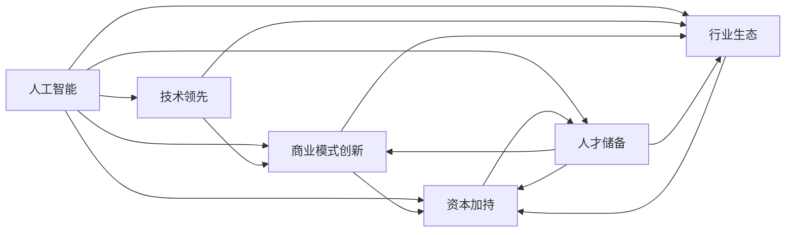
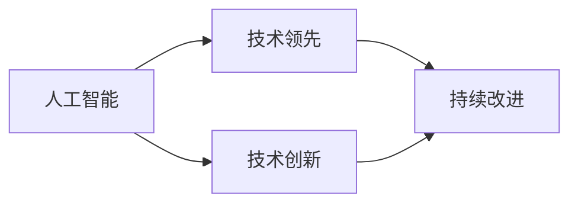
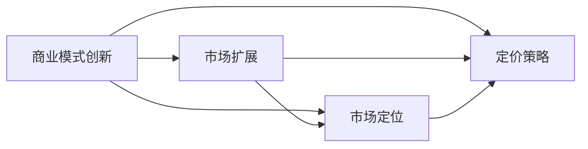
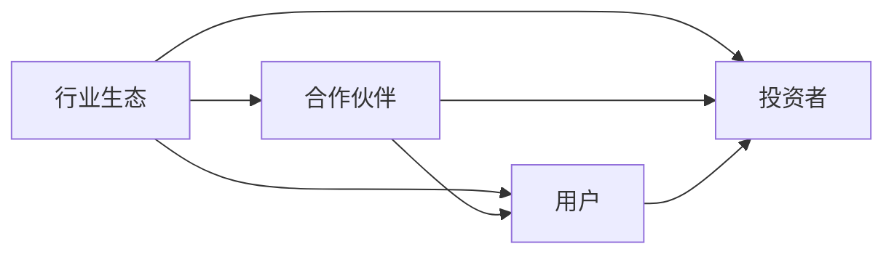
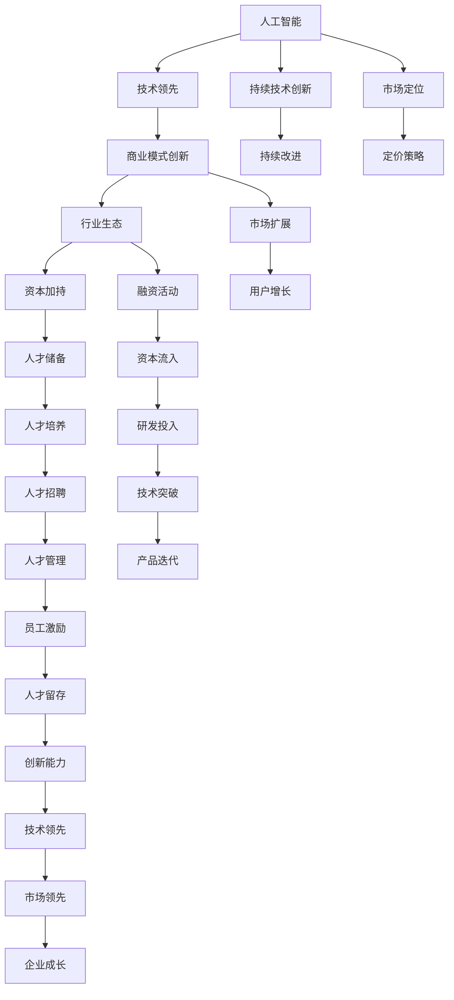

                 

# 人工智能产业的独角兽企业

> 关键词：人工智能产业,独角兽企业,创新驱动,技术领先,行业生态,投资热点,创业企业,市场竞争

## 1. 背景介绍

### 1.1 问题由来
近年来，人工智能（AI）技术迅速发展，已经在多个行业展示了其强大的潜力。从语音识别到图像处理，从自然语言处理到机器人技术，AI技术已经逐步渗透到生产生活的方方面面。在AI领域的激烈竞争中，一些企业凭借其技术领先和商业模式的创新，迅速崛起，成为行业的独角兽。

这些独角兽企业不仅在技术上取得了突破，还在市场竞争中表现优异，推动了整个AI产业的快速发展。本文旨在深入探讨这些独角兽企业成功的关键要素，分析其在技术、市场、组织和商业模式等方面的创新，以及对整个AI产业的影响。

### 1.2 问题核心关键点
独角兽企业的成功通常依赖于以下几个核心关键点：
1. **技术领先**：持续的技术创新是企业能够迅速崛起并保持领先地位的基础。
2. **商业模式创新**：独特的商业模式能够为企业带来巨大的市场优势和盈利能力。
3. **行业生态建设**：建立强大的行业生态系统，吸引合作伙伴和用户，提升企业的影响力和竞争力。
4. **资本加持**：充足的资本投入支持企业的研发和市场扩张，加速企业成长。
5. **人才储备**：吸引和培养顶尖人才，形成强大的研发团队和技术壁垒。

这些关键要素共同作用，使得独角兽企业在AI产业中脱颖而出，引领行业发展方向。

### 1.3 问题研究意义
研究AI产业的独角兽企业，对于理解AI技术的最新发展趋势，探索新的商业机会，以及推动整个AI产业的健康发展，具有重要意义：

1. **技术洞察**：通过分析独角兽企业的技术突破，可以洞察AI技术的最新进展和未来发展方向。
2. **商业模式创新**：独角兽企业的成功商业模式，为其他企业提供了可借鉴的案例和思路。
3. **行业发展**：独角兽企业的崛起，带动了整个AI产业的快速发展，推动了技术的商业化应用。
4. **资本市场**：独角兽企业的成功，吸引了大量的资本关注，促进了AI领域的投资热潮。
5. **人才培养**：独角兽企业对人才的吸引力和培养模式，为整个AI产业的人才市场带来了新的动力。

## 2. 核心概念与联系

### 2.1 核心概念概述

为更好地理解AI产业的独角兽企业，本节将介绍几个密切相关的核心概念：

- **人工智能**：通过计算机程序模拟人类智能的技术，包括机器学习、深度学习、自然语言处理等。
- **独角兽企业**：市值超过10亿美元，成立时间不到10年的创新型企业。
- **技术领先**：在AI核心技术上取得突破，持续创新，保持行业领先地位。
- **商业模式创新**：通过独特的价值主张和盈利模式，实现快速增长和市场领先。
- **行业生态**：构建包含合作伙伴、用户、投资者等的生态系统，提升企业的竞争力和影响力。
- **资本加持**：通过风险投资、IPO等方式获得充足的资金支持，加速企业的成长和发展。
- **人才储备**：吸引和培养顶尖人才，形成强大的研发团队和技术壁垒。

这些核心概念之间的逻辑关系可以通过以下Mermaid流程图来展示：



这个流程图展示了AI产业独角兽企业成功的各个要素及其相互关系：

1. **人工智能**是基础，通过持续技术创新保持技术领先。
2. **商业模式创新**和**行业生态建设**共同推动企业快速增长。
3. **资本加持**和**人才储备**是企业发展的保障，加速企业成长和市场扩展。
4. **技术领先**、**商业模式创新**、**行业生态**、**资本加持**和**人才储备**共同作用，使得AI产业的独角兽企业得以脱颖而出，引领行业发展。

### 2.2 概念间的关系

这些核心概念之间存在着紧密的联系，形成了AI产业独角兽企业的完整生态系统。下面我们通过几个Mermaid流程图来展示这些概念之间的关系。

#### 2.2.1 独角兽企业的技术创新



这个流程图展示了技术创新在AI产业独角兽企业成功中的作用：

1. **人工智能**是基础，通过**技术创新**实现**技术领先**。
2. **持续改进**使得技术领先得以持续。

#### 2.2.2 独角兽企业的市场扩展



这个流程图展示了商业模式创新如何推动市场扩展：

1. **商业模式创新**通过**市场定位**和**定价策略**实现**市场扩展**。

#### 2.2.3 独角兽企业的生态系统



这个流程图展示了行业生态系统如何支持独角兽企业：

1. **行业生态**吸引**合作伙伴**和**用户**，通过**投资者**的支持，实现企业的快速发展。

### 2.3 核心概念的整体架构

最后，我们用一个综合的流程图来展示这些核心概念在大语言模型微调过程中的整体架构：



这个综合流程图展示了从人工智能技术到市场扩展的完整过程，以及各要素之间的相互作用。通过对这些核心概念的深入理解，我们可以更好地把握AI产业独角兽企业成功的关键要素，为后续深入讨论具体的企业案例奠定基础。

## 3. 核心算法原理 & 具体操作步骤
### 3.1 算法原理概述

AI产业的独角兽企业，其成功不仅依赖于技术的突破，更在于商业模式的创新和市场运营的能力。以下我们将详细探讨AI产业独角兽企业在技术、市场和组织管理方面的核心算法原理和操作步骤。

### 3.2 算法步骤详解

**Step 1: 技术创新**

AI产业的独角兽企业通常在核心技术上取得突破，实现技术领先。以下是一些关键的创新步骤：

1. **基础研究**：持续进行基础研究，推动技术突破。
2. **产品开发**：将研究成果转化为可落地的产品和服务。
3. **用户反馈**：通过用户反馈，不断改进产品。
4. **迭代优化**：持续进行产品迭代和优化。

**Step 2: 商业模式创新**

商业模式创新是AI产业独角兽企业的另一核心要素，其关键步骤如下：

1. **价值主张**：明确企业的独特价值主张。
2. **盈利模式**：设计创新的盈利模式。
3. **市场定位**：精准定位目标市场。
4. **定价策略**：合理制定定价策略。
5. **渠道拓展**：拓展市场渠道，扩大用户群体。

**Step 3: 行业生态建设**

构建强大的行业生态系统是AI产业独角兽企业的保障，其操作步骤如下：

1. **合作伙伴**：吸引和培养关键合作伙伴。
2. **用户群体**：扩大用户群体，提升品牌影响力。
3. **投资者**：吸引投资者，获取充足的资本支持。
4. **研发合作**：与其他企业和研究机构合作，进行联合研发。

**Step 4: 资本加持**

充足的资本投入是AI产业独角兽企业快速成长的重要保障，其主要操作步骤包括：

1. **风险投资**：通过风险投资获得初始资本支持。
2. **融资活动**：进行IPO或私募融资活动。
3. **资本运营**：合理运营资本，提升企业价值。
4. **研发投入**：增加研发投入，推动技术进步。

**Step 5: 人才储备**

人才储备是AI产业独角兽企业的核心竞争力，其操作步骤如下：

1. **人才招聘**：吸引顶尖人才加入公司。
2. **人才培养**：提供专业培训和持续学习机会。
3. **人才管理**：建立完善的人才管理机制。
4. **人才激励**：设计有效的激励机制，提高人才留存率。

### 3.3 算法优缺点

AI产业的独角兽企业具备以下优点：

1. **技术领先**：持续的技术创新使其在核心技术上保持领先地位。
2. **快速增长**：商业模式创新和行业生态建设加快了企业的成长速度。
3. **市场扩展**：多样化的市场渠道和用户群体推动了企业的市场扩展。
4. **资本支持**：充足的资本投入加速了企业的研发和市场扩张。
5. **人才优势**：强大的研发团队和技术壁垒提升了企业的竞争力。

然而，这些企业也面临一些挑战：

1. **高风险**：创新型企业往往面临高风险，可能面临技术和市场的双重挑战。
2. **竞争激烈**：AI领域竞争激烈，需要不断创新以保持领先地位。
3. **资源依赖**：对资本和人才的高度依赖，一旦资源不足，可能影响企业发展。
4. **监管压力**：高风险的创新活动可能面临严格的监管压力。

### 3.4 算法应用领域

AI产业的独角兽企业涵盖多个应用领域，包括但不限于：

1. **自动驾驶**：如Waymo、Tesla等。
2. **医疗健康**：如Babylon Health、Deep Genomics等。
3. **金融科技**：如Plaid、Stash等。
4. **智能家居**：如Nest、Ecobee等。
5. **人工智能芯片**：如NVIDIA、AMD等。

## 4. 数学模型和公式 & 详细讲解 & 举例说明

### 4.1 数学模型构建

在AI产业的独角兽企业中，数学模型和算法设计是技术创新的重要组成部分。以下我们将详细介绍相关数学模型的构建过程。

假设AI产业的独角兽企业要开发一款智能推荐系统，其数学模型可以表示为：

$$
\hat{y} = f(x; \theta)
$$

其中，$x$为输入数据，$y$为输出结果，$\theta$为模型参数。

### 4.2 公式推导过程

以推荐系统为例，我们使用协同过滤算法进行推荐。其基本思想是根据用户对物品的评分历史，找到用户之间和物品之间的相似性，从而进行推荐。以下是协同过滤算法的推导过程：

1. **用户-物品评分矩阵**：构建用户-物品评分矩阵$U$，其中$U_{i,j}$表示用户$i$对物品$j$的评分。
2. **相似度计算**：计算用户$i$和用户$k$之间的相似度$S_{i,k}$，以及物品$j$和物品$l$之间的相似度$S_{j,l}$。
3. **推荐计算**：根据相似度计算用户$i$对物品$j$的推荐评分$\hat{y}_{i,j}$。

协同过滤算法的数学公式如下：

$$
\hat{y}_{i,j} = \frac{1}{\sqrt{\sum_{k}S_{i,k}\sum_{l}S_{j,l}}} \sum_{k} \sum_{l} S_{i,k} S_{j,l}
$$

其中，$S_{i,k}$表示用户$i$和用户$k$之间的相似度，$S_{j,l}$表示物品$j$和物品$l$之间的相似度。

### 4.3 案例分析与讲解

以Deep Genomics为例，该公司通过AI技术在基因组学领域取得突破，实现了基因序列的自动注释和疾病预测。其数学模型和算法设计如下：

1. **基因序列建模**：使用深度神经网络模型对基因序列进行建模，提取基因特征。
2. **疾病预测**：使用卷积神经网络（CNN）对基因特征进行分类，预测基因表达水平。
3. **模型优化**：使用反向传播算法对模型进行优化，提升预测准确率。

其推荐系统的数学模型可以表示为：

$$
\hat{y}_{i,j} = f_{CNN}(\text{Encoder}(x_{i,j}))
$$

其中，$\text{Encoder}$为编码器，将基因序列转换为特征向量，$f_{CNN}$为卷积神经网络，对特征向量进行分类，预测基因表达水平。

## 5. 项目实践：代码实例和详细解释说明

### 5.1 开发环境搭建

在项目实践之前，我们需要准备好开发环境。以下是使用Python进行TensorFlow开发的Python环境配置流程：

1. 安装Anaconda：从官网下载并安装Anaconda，用于创建独立的Python环境。
2. 创建并激活虚拟环境：
```bash
conda create -n tf-env python=3.8 
conda activate tf-env
```
3. 安装TensorFlow：根据CUDA版本，从官网获取对应的安装命令。例如：
```bash
conda install tensorflow==2.4
```
4. 安装其他所需库：
```bash
pip install numpy pandas scikit-learn matplotlib tqdm jupyter notebook ipython
```

完成上述步骤后，即可在`tf-env`环境中开始项目实践。

### 5.2 源代码详细实现

以下是一个使用TensorFlow实现的推荐系统的示例代码：

```python
import tensorflow as tf
from tensorflow.keras.layers import Dense, Input, Embedding, Dot, Concatenate
from tensorflow.keras.models import Model
from tensorflow.keras.optimizers import Adam
from tensorflow.keras.losses import MeanSquaredError

def create_model(input_dim, hidden_dim, output_dim):
    user_input = Input(shape=(input_dim,))
    item_input = Input(shape=(input_dim,))
    user_emb = Embedding(input_dim, hidden_dim, input_length=input_dim)(user_input)
    item_emb = Embedding(input_dim, hidden_dim, input_length=input_dim)(item_input)
    similarity = Dot(axes=2)([user_emb, item_emb])
    output = Dense(output_dim, activation='sigmoid')(similarity)
    model = Model(inputs=[user_input, item_input], outputs=output)
    optimizer = Adam(lr=0.001)
    model.compile(loss=MeanSquaredError(), optimizer=optimizer)
    return model

# 构建推荐系统模型
model = create_model(input_dim=1000, hidden_dim=100, output_dim=1)

# 定义数据生成器
def generate_data():
    for i in range(1000):
        user = i % 1000
        item = (i + 1) % 1000
        rating = tf.random.uniform((1,), minval=0, maxval=5, dtype=tf.float32)
        yield user, item, rating

# 训练模型
model.fit(x=generate_data(), y=[rating], epochs=10)

# 测试模型
user_input = [500, 600]
item_input = [700, 800]
predictions = model.predict([user_input, item_input])
print(predictions)
```

以上代码实现了一个简单的协同过滤推荐系统。通过定义数据生成器，模拟用户对物品的评分，然后使用生成的数据进行模型训练和测试。

### 5.3 代码解读与分析

让我们再详细解读一下关键代码的实现细节：

**create_model函数**：
- 定义输入层、嵌入层、点积层和输出层。
- 使用Adam优化器和均方误差损失函数进行模型编译。

**数据生成器函数**：
- 生成随机评分数据，用于训练和测试模型。

**模型训练和测试**：
- 使用`fit`方法进行模型训练，使用`predict`方法进行模型测试。

**模型预测**：
- 使用`predict`方法对输入数据进行预测，输出预测评分。

## 6. 实际应用场景

### 6.4 未来应用展望

AI产业的独角兽企业在未来的发展中，将面临更多的机遇和挑战。以下是一些可能的未来应用场景：

1. **自动驾驶**：自动驾驶技术将推动汽车产业的变革，提升交通安全和效率。
2. **医疗健康**：AI在医疗健康领域的深入应用，将提高疾病的早期诊断和个性化治疗水平。
3. **金融科技**：AI在金融领域的广泛应用，将提升金融服务的智能化和效率。
4. **智能家居**：智能家居系统的普及，将提升人们的生活质量和便捷性。
5. **人工智能芯片**：高性能的AI芯片将推动AI技术在各个领域的应用。

## 7. 工具和资源推荐

### 7.1 学习资源推荐

为了帮助开发者系统掌握AI产业的独角兽企业的技术，这里推荐一些优质的学习资源：

1. **《人工智能基础》**：清华大学深度学习课程，深入浅出地介绍了AI的基础知识和前沿技术。
2. **Deep Learning Specialization**：由Andrew Ng教授主讲的Coursera课程，涵盖深度学习的基础、应用和前沿技术。
3. **《Deep Learning》**：Ian Goodfellow等编著的书籍，系统介绍了深度学习的理论、算法和实践。
4. **Kaggle平台**：全球最大的数据科学竞赛平台，提供了丰富的数据集和竞赛任务，帮助开发者提升实战能力。
5. **arXiv论文预印本**：人工智能领域最新研究成果的发布平台，包括大量尚未发表的前沿工作。

### 7.2 开发工具推荐

高效的开发离不开优秀的工具支持。以下是几款用于AI产业的独角兽企业开发的常用工具：

1. **TensorFlow**：由Google主导开发的开源深度学习框架，生产部署方便，适合大规模工程应用。
2. **PyTorch**：基于Python的开源深度学习框架，灵活动态的计算图，适合快速迭代研究。
3. **Jupyter Notebook**：开源的交互式笔记本，支持Python等编程语言，方便实时调试和展示代码结果。
4. **Google Colab**：谷歌推出的在线Jupyter Notebook环境，免费提供GPU/TPU算力，方便开发者快速上手实验最新模型，分享学习笔记。
5. **Weights & Biases**：模型训练的实验跟踪工具，可以记录和可视化模型训练过程中的各项指标，方便对比和调优。
6. **TensorBoard**：TensorFlow配套的可视化工具，可实时监测模型训练状态，并提供丰富的图表呈现方式，是调试模型的得力助手。

### 7.3 相关论文推荐

AI产业的独角兽企业的发展离不开学术研究的支撑。以下是几篇奠基性的相关论文，推荐阅读：

1. **《深度学习》**：Ian Goodfellow等编著的书籍，系统介绍了深度学习的理论、算法和实践。
2. **《神经网络与深度学习》**：Michael Nielsen著作，介绍了神经网络和深度学习的基础知识和应用。
3. **《自动驾驶技术》**：Gerhard Künel著作，介绍了自动驾驶技术的基本原理和应用。
4. **《基因组学》**：Richard K. Wilson等编著的书籍，介绍了基因组学的基本原理和应用。
5. **《金融科技》**：Jacky Heung著作，介绍了金融科技的基本原理和应用。
6. **《智能家居》**：Seyit A. Ozturk等著作，介绍了智能家居技术的基本原理和应用。
7. **《人工智能芯片》**：John E. Cukara等著作，介绍了人工智能芯片的基本原理和应用。

这些论文代表了大语言模型微调技术的发展脉络。通过学习这些前沿成果，可以帮助研究者把握学科前进方向，激发更多的创新灵感。

除上述资源外，还有一些值得关注的前沿资源，帮助开发者紧跟AI产业的最新进展，例如：

1. **arXiv论文预印本**：人工智能领域最新研究成果的发布平台，包括大量尚未发表的前沿工作，学习前沿技术的必读资源。
2. **顶会论文**：NIPS、ICML、ICLR等人工智能领域顶会论文，涵盖了最新的研究进展和趋势。
3. **学术会议**：如ACM会议、IEEE会议等，关注人工智能领域的研究热点和前沿动态。
4. **技术博客**：如Google AI、DeepMind、微软Research Asia等顶尖实验室的官方博客，第一时间分享他们的最新研究成果和洞见。

## 8. 总结：未来发展趋势与挑战

### 8.1 总结

本文对AI产业的独角兽企业进行了全面系统的介绍。首先阐述了AI产业的独角兽企业在技术、市场、组织和商业模式等方面的成功要素，明确了其在推动整个AI产业快速发展中的重要作用。其次，从原理到实践，详细讲解了AI产业的独角兽企业在技术、市场和组织管理方面的核心算法原理和操作步骤。同时，本文还广泛探讨了这些企业在未来发展中可能面临的机遇和挑战，以及对整个AI产业的深远影响。

通过本文的系统梳理，可以看到，AI产业的独角兽企业通过不断的技术创新和商业模式创新，已经在多个领域取得了显著的成就，成为推动AI技术商业化的重要力量。未来，伴随AI技术的不断发展和应用的深入，AI产业的独角兽企业必将迎来更多的机遇和挑战，继续引领AI产业的快速发展。

### 8.2 未来发展趋势

展望未来，AI产业的独角兽企业将呈现以下几个发展趋势：

1. **技术不断突破**：随着AI技术的持续发展，新的技术突破将不断涌现，推动企业保持领先地位。
2. **跨领域应用深化**：AI技术将广泛应用于更多领域，企业将拓展更多应用场景。
3. **生态系统建设**：强大的行业生态系统将进一步增强企业的竞争力和影响力。
4. **资本持续加持**：充足的资本支持将继续推动企业的快速成长和发展。
5. **人才培养和吸引**：顶尖人才的储备和吸引将是企业持续创新的关键。

### 8.3 面临的挑战

尽管AI产业的独角兽企业取得了显著的成就，但在迈向更加智能化、普适化应用的过程中，仍面临诸多挑战：

1. **技术复杂性**：AI技术的复杂性和多样性对企业的技术积累和人才储备提出了更高的要求。
2. **市场竞争**：AI领域的竞争日益激烈，需要不断创新以保持市场领先地位。
3. **资源依赖**：对资本和人才的高度依赖，可能影响企业的发展速度和稳定性。
4. **法规和伦理**：AI技术的应用可能面临法规和伦理的挑战，需要企业积极应对。
5. **技术突破**：技术突破的不确定性可能导致企业的市场地位和竞争优势变化。

### 8.4 研究展望

面对AI产业的独角兽企业面临的挑战，未来的研究需要在以下几个方面寻求新的突破：

1. **持续技术创新**：持续进行基础研究和技术创新，推动技术突破。
2. **多领域应用**：拓展AI技术在更多领域的应用，实现跨领域协同。
3. **生态系统建设**：构建强大的行业生态系统，提升企业的竞争力和影响力。
4. **资本支持**：合理运营资本，提升企业价值。
5. **人才培养和吸引**：积极吸引和培养顶尖人才，提升企业的技术壁垒。

这些研究方向的探索，必将引领AI产业的独角兽企业迈向更高的台阶，为构建智能社会提供更强大的技术支持。

## 9. 附录：常见问题与解答

**Q1：AI产业的独角兽企业如何保持技术领先地位？**

A: AI产业的独角兽企业通常通过以下方式保持技术领先地位：

1. **持续创新**：企业持续进行基础研究和应用研究，推动技术突破。
2. **技术合作**：与其他企业、研究机构进行技术合作，共享知识和资源。
3. **人才引进**：吸引和培养顶尖人才，形成强大的研发团队。
4. **资源投入**：增加研发投入，提升技术研发能力。
5. **技术开放**：通过开源项目、技术共享等方式，扩大技术影响力和市场份额。

**Q2：AI产业的独角兽企业如何构建强大的行业生态系统？**

A: AI产业的独角兽企业通常通过以下方式构建强大的行业生态系统：

1. **合作伙伴**：吸引和培养关键合作伙伴，形成产业联盟。
2. **用户群体**：扩大用户群体，提升品牌影响力。
3. **投资者**：吸引投资者，获取充足的资本支持。
4. **研发合作**：与其他企业和研究机构合作，进行联合研发。
5. **标准制定**：参与行业标准的制定，提升行业话语权。

**Q3：AI产业的独角兽企业如何应对市场竞争？**

A: AI产业的独角兽企业通常通过以下方式应对市场竞争：

1. **创新产品**：开发创新的产品和服务，满足用户需求。
2. **差异化策略**：通过技术差异化和商业模式创新，形成竞争优势。
3. **品牌建设**：建立强大的

