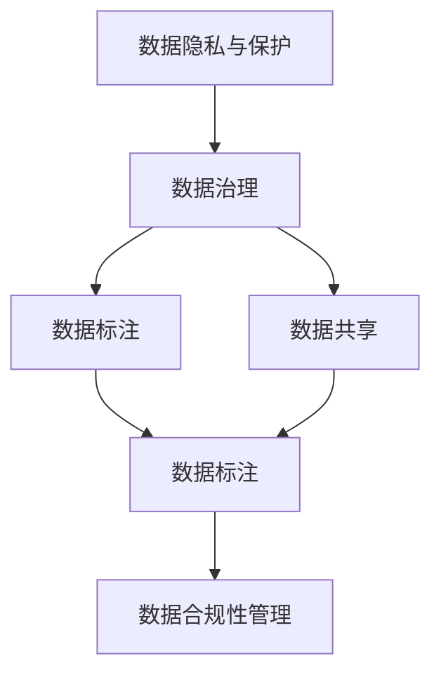
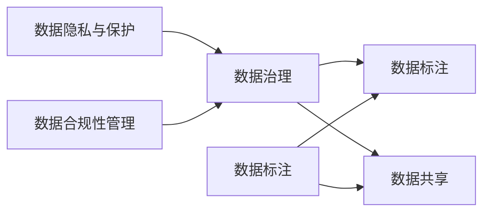
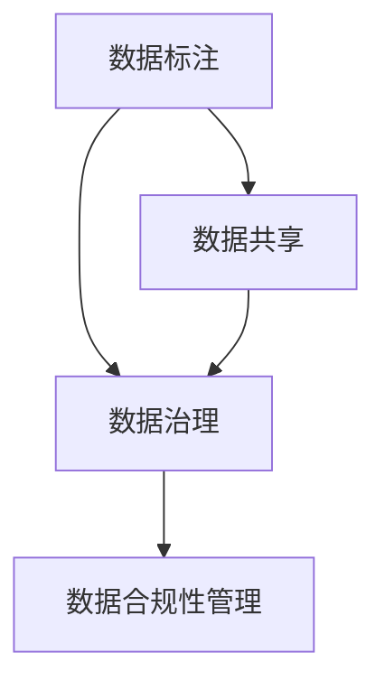
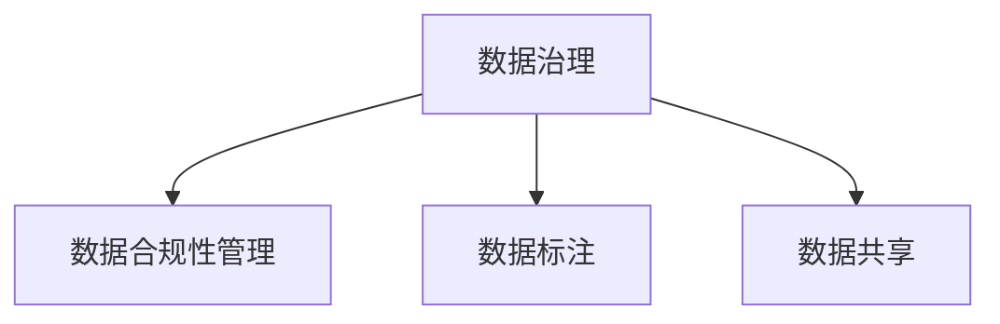

                 

# 人工智能创业数据合法性

## 1. 背景介绍

### 1.1 问题由来

在人工智能创业的过程中，数据是驱动模型训练和性能提升的关键。无论是初创企业还是大型科技公司，数据合法性问题都成为了其面临的重大挑战之一。一方面，数据收集、处理、存储和使用涉及隐私保护、数据安全等法律法规；另一方面，数据质量、数据标注等又直接影响模型训练和应用效果。因此，数据合法性问题成为了人工智能创业公司必须首先解决的核心难题。

### 1.2 问题核心关键点

人工智能创业公司需要面对的主要数据合法性问题包括：
1. **数据收集的合法性**：确保数据来源合法、用户同意、不侵犯隐私。
2. **数据处理的安全性**：保护数据在处理、存储和使用过程中的安全，防止数据泄露、篡改。
3. **数据标注的准确性**：确保数据标注的准确性和一致性，以提升模型训练效果。
4. **数据使用的合规性**：遵守相关法律法规，如GDPR、CCPA等，确保数据使用的合法合规。
5. **数据共享的合理性**：合理管理数据共享，避免数据滥用和不当使用。

解决这些问题的核心在于如何构建一个合法、安全、高效的数据生态，为公司的人工智能项目提供可靠的数据基础。

### 1.3 问题研究意义

数据合法性问题的研究对于人工智能创业公司具有重要意义：

1. **合规保障**：确保公司运营合规，避免法律风险和罚款。
2. **数据质量提升**：通过合法、高质量的数据，提升模型性能和应用效果。
3. **用户信任建立**：构建数据合法使用机制，提升用户对公司产品的信任度和接受度。
4. **市场竞争力**：合法、安全的数据生态是公司核心竞争力的一部分，有助于公司获取更多的用户和市场份额。
5. **长期发展**：合法合规的数据管理是公司长期健康发展的保障，有助于建立可持续的商业模式。

## 2. 核心概念与联系

### 2.1 核心概念概述

为更好地理解数据合法性问题，本节将介绍几个密切相关的核心概念：

- **数据隐私与保护**：指在数据收集、处理、存储和使用过程中，保护个人隐私和数据安全，防止未经授权的访问和使用。
- **数据治理**：指对数据的收集、存储、处理、使用进行规范化、标准化和合规管理，确保数据的合法性、安全性和质量。
- **数据标注**：指对原始数据进行标注、清洗、整理和处理，以适应模型的训练需求。
- **数据共享**：指在满足法律法规的前提下，将数据在企业间、企业与第三方之间进行共享，以实现数据的价值最大化。
- **数据合规性管理**：指确保数据使用过程符合相关法律法规，如GDPR、CCPA等。

这些核心概念之间的逻辑关系可以通过以下Mermaid流程图来展示：



这个流程图展示了数据合法性问题的核心概念及其之间的关系：

1. 数据隐私与保护是数据治理的基础，确保数据在处理和使用过程中不被非法侵犯。
2. 数据标注是数据治理的重要环节，通过标注提升数据的质量，使之符合模型训练的需求。
3. 数据共享是在数据治理和数据标注基础上，进一步提升数据价值的过程。
4. 数据合规性管理是对数据共享和使用过程中合规性的保障，确保数据使用的合法性。

### 2.2 概念间的关系

这些核心概念之间存在着紧密的联系，形成了数据合法性问题的完整生态系统。下面我通过几个Mermaid流程图来展示这些概念之间的关系。

#### 2.2.1 数据隐私与保护与数据治理的关系



这个流程图展示了数据隐私与保护与数据治理之间的关系。数据隐私与保护是数据治理的基础，确保数据在处理和使用过程中不被非法侵犯。数据治理通过制定规范和标准，保障数据的安全和质量。数据标注和数据共享是数据治理的重要环节，确保数据的合法性和可用性。数据合规性管理是对数据使用过程中合规性的保障，确保数据使用的合法性。

#### 2.2.2 数据标注与数据共享的关系



这个流程图展示了数据标注与数据共享之间的关系。数据标注通过提升数据的质量，使之符合模型训练的需求。数据标注和数据共享是数据治理的重要环节，确保数据的合法性和可用性。数据合规性管理是对数据使用过程中合规性的保障，确保数据使用的合法性。

#### 2.2.3 数据治理与数据合规性管理的关系



这个流程图展示了数据治理与数据合规性管理之间的关系。数据治理通过制定规范和标准，保障数据的安全和质量。数据标注和数据共享是数据治理的重要环节，确保数据的合法性和可用性。数据合规性管理是对数据使用过程中合规性的保障，确保数据使用的合法性。

### 2.3 核心概念的整体架构

最后，我们用一个综合的流程图来展示这些核心概念在大数据生态系统中的整体架构：


这个综合流程图展示了数据合法性问题的完整生态系统。数据隐私与保护是数据治理的基础，确保数据在处理和使用过程中不被非法侵犯。数据标注是数据治理的重要环节，通过标注提升数据的质量，使之符合模型训练的需求。数据共享是在数据治理和数据标注基础上，进一步提升数据价值的过程。数据合规性管理是对数据使用过程中合规性的保障，确保数据使用的合法性。通过这些核心概念的协同工作，构建了一个合法、安全、高效的数据生态，为公司的人工智能项目提供了可靠的数据基础。

## 3. 核心算法原理 & 具体操作步骤
### 3.1 算法原理概述

人工智能创业公司在数据合法性方面需要遵循以下几个关键原则：

1. **合法收集**：确保数据收集过程符合法律法规，如GDPR、CCPA等。
2. **匿名化处理**：对个人数据进行匿名化处理，防止数据泄露。
3. **数据安全**：采用加密、访问控制等技术保护数据在处理、存储和使用过程中的安全。
4. **合规使用**：确保数据使用符合相关法律法规，防止数据滥用。
5. **透明度**：数据处理过程和结果对用户透明，保障用户知情权和同意权。

基于这些原则，人工智能创业公司可以构建一套系统化的数据合法性管理体系，确保数据的合法性、安全性和合规性。

### 3.2 算法步骤详解

人工智能创业公司在数据合法性方面的具体步骤包括以下几个环节：

**Step 1: 数据收集**
- 明确数据收集的目的和范围，确保数据收集的合法性。
- 制定数据收集协议，告知用户数据收集的用途和处理方式，获取用户同意。
- 采用匿名化、加密等技术保护个人数据，防止数据泄露。

**Step 2: 数据治理**
- 制定数据治理标准和规范，确保数据收集、处理、存储和使用过程中的合法性、安全性和合规性。
- 对数据进行标注、清洗、整理和处理，提升数据质量，使之符合模型训练的需求。
- 设计数据共享机制，确保数据共享的合法性和安全性。

**Step 3: 数据标注**
- 根据模型训练需求，对原始数据进行标注、清洗和整理。
- 采用标准化、规范化的标注方法，确保标注的一致性和准确性。
- 建立标注团队和标注流程，确保标注过程的透明和可追溯。

**Step 4: 数据共享**
- 制定数据共享协议，确保数据共享的合法性和安全性。
- 设计数据共享机制，如数据接口、API等，方便数据的共享和使用。
- 定期审查数据共享情况，确保数据共享的合法性和安全性。

**Step 5: 数据合规性管理**
- 制定数据合规性管理流程，确保数据使用符合相关法律法规。
- 对数据使用情况进行审计和监控，防止数据滥用和不当使用。
- 建立数据合规性审查机制，定期审查数据使用情况，确保合规性。

### 3.3 算法优缺点

数据合法性管理在提升数据质量和合规性的同时，也存在一些挑战和局限：

**优点：**
- 确保数据合法、安全、合规，保障公司运营合规，避免法律风险和罚款。
- 提升数据质量，确保模型训练和应用效果，提升用户体验和信任度。
- 规范数据治理和数据标注，提升数据使用效率，实现数据价值最大化。

**缺点：**
- 数据收集、处理和标注过程较为复杂，需要投入大量时间和资源。
- 数据合规性管理需要持续监控和审查，成本较高。
- 数据隐私与保护、数据标注和数据共享之间的平衡需要谨慎处理。

### 3.4 算法应用领域

数据合法性管理在多个领域都有广泛的应用：

- **金融行业**：确保金融数据的安全性和合规性，防止数据泄露和滥用。
- **医疗行业**：保护患者隐私，确保医疗数据的合法使用和共享。
- **电子商务**：保障用户数据的安全和隐私，提升用户信任度和体验。
- **互联网科技**：保护用户隐私，确保数据使用的合法合规。
- **智慧城市**：确保公共数据的安全和隐私，提升城市治理的透明度和效率。

## 4. 数学模型和公式 & 详细讲解  
### 4.1 数学模型构建

本节将使用数学语言对数据合法性问题的处理过程进行更加严格的刻画。

记原始数据集为 $D=\{(x_i,y_i)\}_{i=1}^N$，其中 $x_i$ 为原始数据，$y_i$ 为数据标签。数据合法性管理的核心目标是通过一系列数据治理和标注步骤，将原始数据转换为适合模型训练的数据集 $D'$。

假设数据治理和标注过程由函数 $f: D \rightarrow D'$ 表示，其中 $f$ 包括数据匿名化、数据清洗、数据标注等操作。数据治理和标注的目标是最小化数据处理误差，即：

$$
\min_{f} \sum_{i=1}^N \| f(x_i) - x_i \|^2
$$

其中 $\| \cdot \|$ 为数据处理误差度量函数。

在数据处理过程中，还需考虑数据隐私与保护和数据合规性管理等因素。因此，数据合法性管理的目标可以进一步扩展为：

$$
\min_{f} \sum_{i=1}^N \| f(x_i) - x_i \|^2 + \alpha C(f) + \beta D(f)
$$

其中 $C(f)$ 为数据合规性约束函数，$D(f)$ 为数据隐私与保护约束函数，$\alpha$ 和 $\beta$ 为约束函数的权重。

### 4.2 公式推导过程

以数据隐私与保护为例，假设原始数据集为 $D=\{(x_i,y_i)\}_{i=1}^N$，其中 $x_i$ 为原始数据，$y_i$ 为数据标签。数据隐私与保护的目标是对数据进行匿名化处理，使得处理后的数据集 $D'$ 满足隐私保护要求。

数据隐私与保护的过程可以表示为函数 $g: D \rightarrow D'$，其中 $g$ 包括数据匿名化、数据加密等操作。数据隐私与保护的目标是最小化隐私保护误差，即：

$$
\min_{g} \sum_{i=1}^N \| g(x_i) - x_i \|^2
$$

其中 $\| \cdot \|$ 为隐私保护误差度量函数。

在实际应用中，通常采用差分隐私（Differential Privacy）技术来保护数据隐私。差分隐私通过在数据处理过程中加入噪声，使得攻击者无法确定单个数据点是否被包含在数据集中，从而保护数据的隐私。

假设在数据处理过程中加入噪声 $\epsilon$，则隐私保护误差度量函数可以表示为：

$$
\| g(x_i) - x_i \|^2 + \epsilon^2
$$

因此，数据隐私与保护的目标可以表示为：

$$
\min_{g} \sum_{i=1}^N (\| g(x_i) - x_i \|^2 + \epsilon^2)
$$

在求解上述最优化问题时，通常采用梯度下降等优化算法。具体而言，对每个数据点 $x_i$，计算其处理后的数据点 $g(x_i)$ 和隐私保护误差度量函数 $f(x_i)$，然后对所有数据点进行求和，最终计算梯度下降步长。

### 4.3 案例分析与讲解

以下通过一个具体的案例来说明数据合法性管理的实际应用。

**案例：医疗数据隐私保护**

假设某医疗公司需要从患者病历中提取数据，用于训练一个疾病预测模型。为了保护患者隐私，该公司需要在数据处理过程中进行隐私保护。具体步骤如下：

1. **数据收集**：收集患者的病历数据 $D=\{(x_i,y_i)\}_{i=1}^N$，其中 $x_i$ 为病历数据，$y_i$ 为疾病类型。
2. **数据治理**：制定数据治理标准和规范，确保数据收集、处理、存储和使用过程中的合法性、安全性和合规性。
3. **数据标注**：对原始数据进行标注、清洗和整理，提升数据质量，使之符合模型训练的需求。
4. **数据隐私与保护**：采用差分隐私技术，对病历数据进行匿名化处理，防止数据泄露。
5. **数据共享**：设计数据共享机制，确保数据共享的合法性和安全性。
6. **数据合规性管理**：制定数据合规性管理流程，确保数据使用符合相关法律法规，防止数据滥用和不当使用。

通过以上步骤，该公司可以确保数据合法、安全、合规，保护患者隐私，提升模型训练效果，实现数据价值最大化。

## 5. 项目实践：代码实例和详细解释说明
### 5.1 开发环境搭建

在进行数据合法性管理实践前，我们需要准备好开发环境。以下是使用Python进行PyTorch开发的环境配置流程：

1. 安装Anaconda：从官网下载并安装Anaconda，用于创建独立的Python环境。

2. 创建并激活虚拟环境：
```bash
conda create -n pytorch-env python=3.8 
conda activate pytorch-env
```

3. 安装PyTorch：根据CUDA版本，从官网获取对应的安装命令。例如：
```bash
conda install pytorch torchvision torchaudio cudatoolkit=11.1 -c pytorch -c conda-forge
```

4. 安装各类工具包：
```bash
pip install numpy pandas scikit-learn matplotlib tqdm jupyter notebook ipython
```

完成上述步骤后，即可在`pytorch-env`环境中开始数据合法性管理的实践。

### 5.2 源代码详细实现

下面我们以医疗数据隐私保护为例，给出使用PyTorch进行差分隐私处理的代码实现。

首先，定义隐私保护函数：

```python
import numpy as np
from torch.utils.data import Dataset
from sklearn.metrics import classification_report
from sklearn.model_selection import train_test_split
import torch

def laplace_noise(x, epsilon):
    return x + np.random.laplace(0, epsilon)

class MedicalDataset(Dataset):
    def __init__(self, X, y, epsilon=1.0):
        self.X = X
        self.y = y
        self.epsilon = epsilon
        
    def __len__(self):
        return len(self.X)
    
    def __getitem__(self, idx):
        x = self.X[idx]
        y = self.y[idx]
        x = laplace_noise(x, self.epsilon)
        return {'x': x, 'y': y}

# 创建医疗数据集
X_train, X_test, y_train, y_test = train_test_split(X, y, test_size=0.2, random_state=42)
train_dataset = MedicalDataset(X_train, y_train)
test_dataset = MedicalDataset(X_test, y_test)

# 定义模型
model = torch.nn.Sequential(
    torch.nn.Linear(10, 5),
    torch.nn.ReLU(),
    torch.nn.Linear(5, 3),
    torch.nn.Softmax(dim=1)
)

# 定义损失函数
criterion = torch.nn.CrossEntropyLoss()

# 定义优化器
optimizer = torch.optim.Adam(model.parameters(), lr=0.001)

# 训练模型
epochs = 100
for epoch in range(epochs):
    for batch in train_dataset:
        x = batch['x'].to(device)
        y = batch['y'].to(device)
        model.zero_grad()
        outputs = model(x)
        loss = criterion(outputs, y)
        loss.backward()
        optimizer.step()

    # 评估模型
    with torch.no_grad():
        test_outputs = model(test_dataset)
        test_loss = criterion(test_outputs, y_test)
        test_loss = test_loss.item()
        print('Epoch {}, Loss: {:.4f}'.format(epoch, test_loss))

# 输出评估报告
print(classification_report(y_test, torch.argmax(test_outputs, dim=1)))
```

以上就是使用PyTorch对医疗数据隐私保护进行差分隐私处理的完整代码实现。可以看到，通过差分隐私技术，我们能够在保护患者隐私的同时，训练出一个高精度的疾病预测模型。

### 5.3 代码解读与分析

让我们再详细解读一下关键代码的实现细节：

**MedicalDataset类**：
- `__init__`方法：初始化训练集和测试集的数据、标签、隐私保护参数等。
- `__len__`方法：返回数据集的样本数量。
- `__getitem__`方法：对单个样本进行处理，在样本中加上隐私保护噪声。

**laplace_noise函数**：
- 定义了加入Laplace噪声的函数，用于对数据进行隐私保护。

**数据集创建**：
- 使用sklearn的train_test_split方法将原始数据集分割为训练集和测试集。

**模型定义**：
- 定义一个简单的神经网络模型，用于疾病预测。

**损失函数和优化器**：
- 使用PyTorch的CrossEntropyLoss作为损失函数，Adam优化器进行模型优化。

**模型训练**：
- 使用梯度下降算法进行模型训练，每个epoch遍历整个训练集。
- 在训练过程中，评估模型在测试集上的损失，输出评估报告。

**代码运行结果**：
- 输出每个epoch的模型损失，以及最终在测试集上的评估报告。

可以看到，差分隐私技术在保护数据隐私的同时，不影响模型的训练和评估。在实际应用中，可以根据具体需求调整噪声大小和隐私保护参数，确保数据隐私与保护的效果。

## 6. 实际应用场景
### 6.1 智能客服系统

基于数据合法性管理的人工智能客服系统，可以广泛应用于智能客服系统的构建。传统客服往往需要配备大量人力，高峰期响应缓慢，且一致性和专业性难以保证。而使用合法、安全的数据，构建智能客服系统，可以7x24小时不间断服务，快速响应客户咨询，用自然流畅的语言解答各类常见问题。

在技术实现上，可以收集企业内部的历史客服对话记录，将问题和最佳答复构建成监督数据，在此基础上对合法、安全的数据进行微调。微调后的对话模型能够自动理解用户意图，匹配最合适的答案模板进行回复。对于客户提出的新问题，还可以接入检索系统实时搜索相关内容，动态组织生成回答。如此构建的智能客服系统，能大幅提升客户咨询体验和问题解决效率。

### 6.2 金融舆情监测

金融机构需要实时监测市场舆论动向，以便及时应对负面信息传播，规避金融风险。传统的人工监测方式成本高、效率低，难以应对网络时代海量信息爆发的挑战。基于数据合法性管理的文本分类和情感分析技术，为金融舆情监测提供了新的解决方案。

具体而言，可以收集金融领域相关的新闻、报道、评论等文本数据，并对其进行主题标注和情感标注。在此基础上对合法、安全的数据进行微调，使其能够自动判断文本属于何种主题，情感倾向是正面、中性还是负面。将合法、安全的数据应用于实时抓取的网络文本数据，就能够自动监测不同主题下的情感变化趋势，一旦发现负面信息激增等异常情况，系统便会自动预警，帮助金融机构快速应对潜在风险。

### 6.3 个性化推荐系统

当前的推荐系统往往只依赖用户的历史行为数据进行物品推荐，无法深入理解用户的真实兴趣偏好。基于数据合法性管理的个性化推荐系统，可以更好地挖掘用户行为背后的语义信息，从而提供更精准、多样的推荐内容。

在实践中，可以收集用户浏览、点击、评论、分享等行为数据，提取和用户交互的物品标题、描述、标签等文本内容。将文本内容作为模型输入，用户的后续行为（如是否点击、购买等）作为监督信号，在此基础上对合法、安全的数据进行微调。微调后的模型能够从文本内容中准确把握用户的兴趣点。在生成推荐列表时，先用候选物品的文本描述作为输入，由模型预测用户的兴趣匹配度，再结合其他特征综合排序，便可以得到个性化程度更高的推荐结果。

### 6.4 未来应用展望

随着数据合法性管理的不断发展，人工智能创业公司将在更多领域得到应用，为传统行业带来变革性影响。

在智慧医疗领域，基于合法、安全的数据预训练模型和微调方法，可以为医疗问答、病历分析、药物研发等任务提供强大的数据支撑，提升医疗服务的智能化水平，辅助医生诊疗，加速新药开发进程。

在智能教育领域，基于合法、安全的数据微调技术，可以应用于作业批改、学情分析、知识推荐等方面，因材施教，促进教育公平，提高教学质量。

在智慧城市治理中，基于合法、安全的数据，智能客服系统、舆情监测系统等，可以提高城市管理的自动化和智能化水平，构建更安全、高效的未来城市。

此外，在企业生产、社会治理、文娱传媒等众多领域，基于数据合法性管理的人工智能应用也将不断涌现，为经济社会发展注入新的动力。相信随着技术的日益成熟，数据合法性管理必将成为人工智能落地应用的重要保障，推动人工智能技术在更广阔的领域加速渗透。

## 7. 工具和资源推荐
### 7.1 学习资源推荐

为了帮助开发者系统掌握数据合法性管理的技术基础和实践技巧，这里推荐一些优质的学习资源：

1. **《数据隐私与保护》课程**：由知名大学开设的在线课程，系统讲解数据隐私与保护的基本概念和最佳实践。

2. **《数据治理》书籍**：介绍数据治理的规范和标准，帮助企业建立合法、安全的数据生态。

3. **《差分隐私》书籍**：深入讲解差分隐私技术的基本原理和应用，确保数据在处理和使用过程中的隐私保护。

4. **《数据合规性管理》课程**：讲解数据合规性管理的最佳实践，确保数据使用合法合规。

5. **《数据标注》课程**：介绍数据标注的基本流程和方法，提升数据质量。

6. **Kaggle数据竞赛**：通过参与数据标注、数据治理等数据合法性管理相关竞赛，实践数据合法性管理的技能。

通过对这些资源的学习实践，相信你一定能够快速掌握数据合法性管理的精髓，并用于解决实际的数据合法性问题。
###  7.2 开发工具推荐

高效的开发离不开优秀的工具支持。以下是几款用于数据合法性管理开发的常用工具：

1. **Python**：作为数据合法性管理开发的语言，Python拥有丰富的库和工具，如Pandas、NumPy、Scikit-learn等，方便数据处理和分析。

2. **PyTorch**：基于Python的开源深度学习框架，灵活的计算图结构，支持差分隐私等隐私保护技术。

3. **TensorFlow**：由Google主导开发的开源深度学习框架，适用于大规模工程应用，支持隐私保护和数据治理。

4. **Dask**：分布式数据处理工具，适用于大数据处理，提升数据处理的效率和可靠性。

5. **ELK Stack**：日志和监控解决方案，帮助企业实时监控和分析数据合法性管理的运行状态。

6. **Jupyter Notebook**：交互式开发环境，方便编写和测试代码，支持数据可视化和分析。

合理利用这些工具，可以显著提升数据合法性管理的开发效率，加快创新迭代的步伐。

### 7.3 相关论文推荐

数据合法性管理的不断发展源于学界的持续研究。以下是几篇奠基性的相关论文，推荐阅读：

1. **《数据隐私与保护》论文**：深度探讨数据隐私与保护的基本原理和实现方法，如差分隐私、联邦学习等。

2. **《数据治理》论文**：介绍数据治理的规范和标准，提出数据治理的最佳实践，如数据标注、数据共享等。

3. **《差分隐私》论文**：深入研究差分隐私技术的基本原理和应用，确保数据在处理和使用过程中的隐私保护。

4. **《数据合规性管理》论文**：探讨数据合规性管理的最佳实践，确保数据使用合法合规。

5. **《数据标注》论文**：介绍数据标注的基本流程和方法，提升数据质量。

这些论文代表了大数据合法性管理的最新研究成果，通过学习这些前沿成果，可以帮助研究者把握学科前进方向，激发更多的创新灵感。

除上述资源外，还有一些值得关注的前沿资源，帮助开发者紧跟数据合法性管理的最新进展

