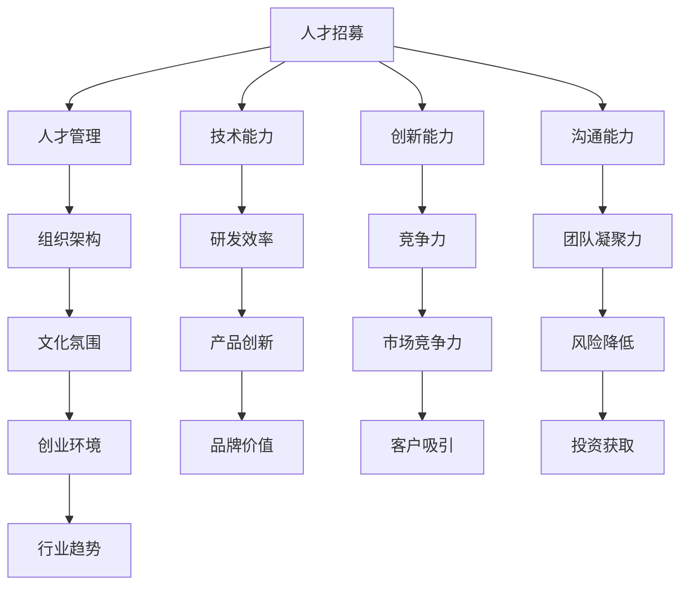
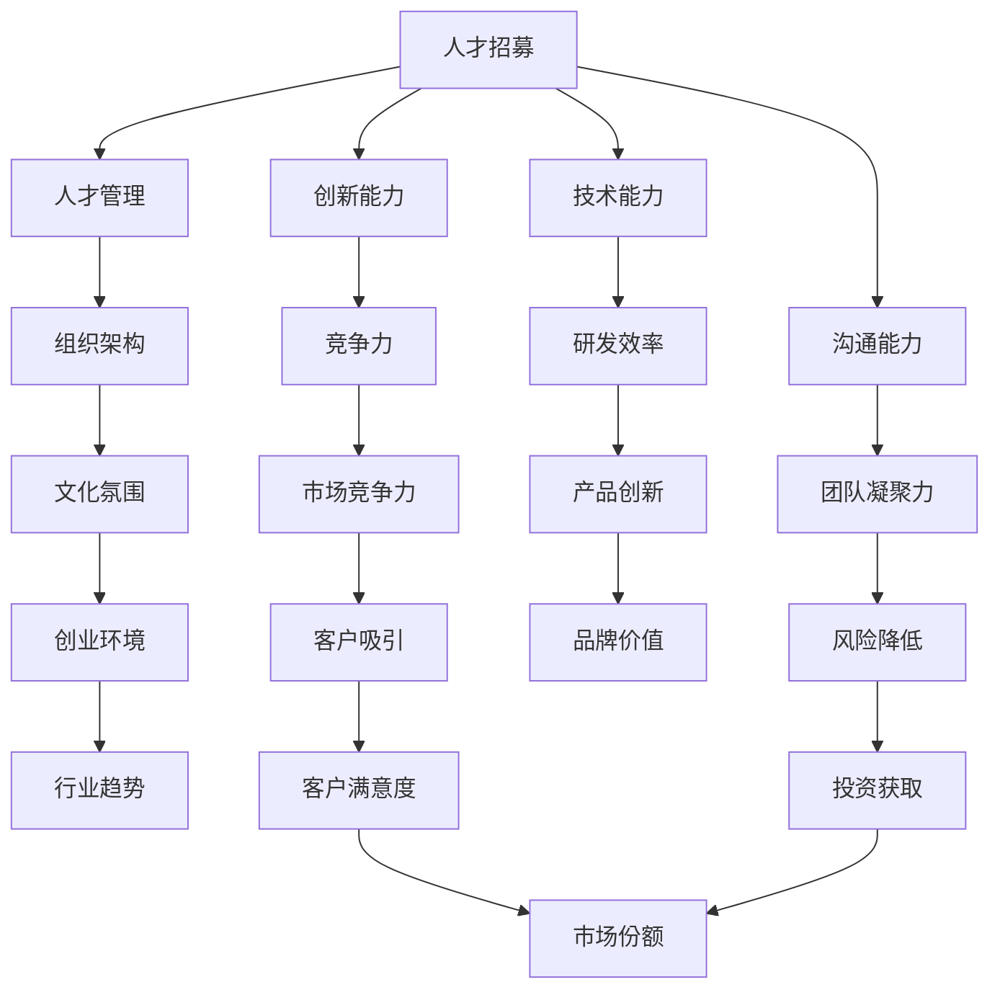

                 

# 人工智能创业：团队建设策略

> 关键词：
人工智能创业、团队建设、创新生态、人才管理、组织架构、文化氛围、创业环境、行业趋势

## 1. 背景介绍

### 1.1 问题由来
随着人工智能技术的飞速发展，越来越多的创业者和投资者将目光投向了人工智能领域，希望在这一浪潮中获得成功。然而，人工智能创业并不是一件简单的事情，它涉及到技术研发、产品设计、市场推广、人才管理等多个方面。其中，团队建设是一个至关重要但常被忽视的部分。一个高效、协调的团队是人工智能创业成功的基础，但如何组建和管理一支高效的团队，却是一大难题。本文将深入探讨人工智能创业中的团队建设策略，旨在帮助创业者构建一个高效的、充满创新的团队。

### 1.2 问题核心关键点
在人工智能创业中，团队建设涉及多个核心关键点，包括：
1. **人才招募**：如何吸引和筛选具备核心能力的AI人才。
2. **人才管理**：如何保持团队的凝聚力和稳定性。
3. **组织架构**：如何构建一个高效的团队结构。
4. **文化氛围**：如何营造一个积极向上的企业文化。
5. **创业环境**：如何创建和维护一个支持创新的创业环境。
6. **行业趋势**：如何紧跟AI行业的最新发展趋势。

这些关键点相互影响，共同决定着一个AI创业项目的成功与否。本文将详细探讨这些关键点，并提供具体的策略和方法。

### 1.3 问题研究意义
构建一个高效、创新的团队对于人工智能创业至关重要。一个健康的团队能够：
1. **提升研发效率**：通过团队协作和知识共享，加速产品开发和迭代。
2. **增强竞争力**：吸引和留住顶尖人才，保持技术领先。
3. **促进创新**：鼓励团队成员提出新想法，推动技术突破。
4. **减少风险**：通过合理的团队管理，降低创业过程中的不确定性。
5. **提升品牌价值**：一个强大的团队品牌可以吸引更多的客户和投资。

研究人工智能创业中的团队建设策略，对于提升创业成功率、加速技术创新和推动行业发展具有重要意义。

## 2. 核心概念与联系

### 2.1 核心概念概述

在探讨人工智能创业中的团队建设策略之前，我们需要了解几个核心概念：

- **人才招募**：吸引和选拔具备核心能力的AI人才。
- **人才管理**：管理和激励团队成员，保持团队稳定和高效。
- **组织架构**：设计和调整团队结构，以适应公司的发展和项目需求。
- **文化氛围**：营造一个积极、开放、创新的企业文化。
- **创业环境**：创造一个支持创新和创业的环境，包括技术、资金、政策等方面。
- **行业趋势**：紧跟AI行业的发展趋势，保持技术领先和市场竞争力。

这些概念相互关联，共同构成了一个高效人工智能创业团队的基石。

### 2.2 概念间的关系

这些核心概念之间的关系可以通过以下Mermaid流程图来展示：



这个流程图展示了人才招募、人才管理、组织架构、文化氛围、创业环境、行业趋势等概念之间的关系，以及它们对人工智能创业成功的支撑作用。

### 2.3 核心概念的整体架构

最后，我们用一个综合的流程图来展示这些核心概念在大语言模型微调过程中的整体架构：



这个综合流程图展示了从人才招募到产品创新、市场竞争力提升的全过程，以及它们如何通过高效团队建设推动人工智能创业的成功。

## 3. 核心算法原理 & 具体操作步骤
### 3.1 算法原理概述

人工智能创业中的团队建设策略基于一个基本的假设：一个高效的团队能够提升创业成功率，而一个低效的团队则会拖累项目的进展。因此，构建高效团队的核心在于：吸引和招募优秀人才、管理人才、优化组织结构、营造良好的文化氛围、创建支持创新的环境、紧跟行业趋势。

### 3.2 算法步骤详解

以下是构建高效人工智能创业团队的具体操作步骤：

**Step 1: 人才招募**
- **定义需求**：明确团队所需人才的技能、经验、背景等要求。
- **制定策略**：通过社交媒体、招聘网站、学术会议等多种渠道发布招聘信息。
- **筛选简历**：通过简历筛选和面试，评估候选人的技术能力、创新能力、沟通能力等。
- **录用决策**：根据团队需求和候选人表现，做出录用决策。

**Step 2: 人才管理**
- **建立激励机制**：设计薪酬、晋升、奖金等激励机制，保持团队成员的积极性和稳定性。
- **提供培训机会**：定期组织培训和技术分享会，提升团队成员的技术水平和创新能力。
- **设立反馈渠道**：建立反馈机制，听取团队成员的意见和建议，及时调整团队管理策略。

**Step 3: 组织架构**
- **设计角色和职责**：根据项目需求和团队规模，设计角色和职责分配。
- **优化团队结构**：根据项目进展和团队动态，适时调整团队结构，保持团队的高效性和灵活性。
- **明确沟通机制**：建立团队内部和团队外部的沟通机制，确保信息流畅和协作高效。

**Step 4: 文化氛围**
- **营造创新氛围**：鼓励团队成员提出新想法和创新方案，建立开放的创新文化。
- **强调团队合作**：通过团队建设活动和跨部门合作项目，增强团队成员的协作精神和团队凝聚力。
- **倡导透明和公正**：建立透明的决策机制和公正的评价标准，增强团队成员的信任和归属感。

**Step 5: 创业环境**
- **获取资金支持**：通过风险投资、政府补助、众筹等多种方式获取资金支持。
- **建立合作伙伴关系**：与大学、研究机构、行业协会等建立合作关系，获取技术和市场支持。
- **优化运营环境**：确保办公环境的舒适和高效，为团队提供必要的软硬件资源。

**Step 6: 行业趋势**
- **跟踪技术动态**：通过阅读学术论文、参加行业会议、关注技术博客等多种方式跟踪技术动态。
- **调整项目策略**：根据技术动态和市场需求，适时调整项目策略和方向，保持技术领先和市场竞争力。
- **保持灵活性**：保持团队的灵活性和适应性，迅速响应市场变化和技术创新。

### 3.3 算法优缺点

人工智能创业中的团队建设策略具有以下优点：
1. **提升效率**：通过合理的团队管理和组织架构设计，提升研发效率和团队协作。
2. **吸引人才**：通过良好的文化氛围和创业环境，吸引和留住优秀人才。
3. **增强竞争力**：通过紧跟行业趋势和优化团队结构，保持技术领先和市场竞争力。

同时，该策略也存在一些缺点：
1. **实施难度大**：构建高效团队需要投入大量时间和资源，实施难度较大。
2. **成本高**：优秀的团队成员往往成本较高，短期内可能影响资金流动性。
3. **变化灵活性不足**：固定的组织结构和激励机制可能在市场变化时缺乏灵活性。

### 3.4 算法应用领域

人工智能创业中的团队建设策略可以广泛应用于多个领域，包括但不限于：

- **AI技术公司**：通过吸引和培养顶尖AI人才，推动技术创新和市场拓展。
- **AI创业团队**：在创业初期，通过合理的团队管理和结构设计，提升团队协作和创新能力。
- **AI孵化器**：通过建立支持创新的环境，吸引和孵化优秀AI创业项目。

## 4. 数学模型和公式 & 详细讲解  
### 4.1 数学模型构建

在人工智能创业中的团队建设策略中，我们通常使用以下数学模型来评估团队成员的表现和团队的绩效：

- **个人表现评估模型**：
  $$
  \text{Performance}_i = \frac{\text{创新能力}_i + \text{技术能力}_i + \text{沟通能力}_i}{3}
  $$

- **团队绩效评估模型**：
  $$
  \text{Team Performance} = \frac{\text{研发效率} + \text{团队凝聚力} + \text{市场竞争力}}{3}
  $$

### 4.2 公式推导过程

- **个人表现评估模型推导**：
  $$
  \text{Performance}_i = \frac{\text{创新能力}_i + \text{技术能力}_i + \text{沟通能力}_i}{3}
  $$

- **团队绩效评估模型推导**：
  $$
  \text{Team Performance} = \frac{\text{研发效率} + \text{团队凝聚力} + \text{市场竞争力}}{3}
  $$

### 4.3 案例分析与讲解

假设我们有一个由10名团队成员组成的AI创业团队，通过以下数据进行评估：

| 成员编号 | 创新能力 | 技术能力 | 沟通能力 | 研发效率 | 团队凝聚力 | 市场竞争力 |
| -------- | -------- | -------- | -------- | -------- | -------- | -------- |
| 1        | 8        | 9        | 7        | 6        | 7        | 8        |
| 2        | 7        | 8        | 6        | 5        | 6        | 7        |
| ...      | ...      | ...      | ...      | ...      | ...      | ...      |

计算每个成员的个人表现和团队的整体绩效：

- **成员1的表现评估**：
  $$
  \text{Performance}_1 = \frac{8 + 9 + 7}{3} = 8
  $$

- **成员2的表现评估**：
  $$
  \text{Performance}_2 = \frac{7 + 8 + 6}{3} = 7
  $$

- **团队的整体绩效评估**：
  $$
  \text{Team Performance} = \frac{6 + 7 + 8}{3} = 7
  $$

通过这些评估模型，我们可以清晰地了解团队成员和团队的整体表现，为后续的管理和优化提供依据。

## 5. 项目实践：代码实例和详细解释说明
### 5.1 开发环境搭建

在进行人工智能创业中的团队建设策略的实践之前，我们需要准备好开发环境。以下是使用Python进行PyTorch开发的环境配置流程：

1. 安装Anaconda：从官网下载并安装Anaconda，用于创建独立的Python环境。

2. 创建并激活虚拟环境：
```bash
conda create -n pytorch-env python=3.8 
conda activate pytorch-env
```

3. 安装PyTorch：根据CUDA版本，从官网获取对应的安装命令。例如：
```bash
conda install pytorch torchvision torchaudio cudatoolkit=11.1 -c pytorch -c conda-forge
```

4. 安装TensorFlow：
```bash
conda install tensorflow
```

5. 安装各类工具包：
```bash
pip install numpy pandas scikit-learn matplotlib tqdm jupyter notebook ipython
```

完成上述步骤后，即可在`pytorch-env`环境中开始实践。

### 5.2 源代码详细实现

下面我们以一个AI创业团队为例，给出使用PyTorch进行团队建设策略开发的PyTorch代码实现。

首先，定义团队成员的个人表现评估模型：

```python
import torch
import torch.nn as nn

class PerformanceModel(nn.Module):
    def __init__(self):
        super(PerformanceModel, self).__init__()
        self.sigmoid = nn.Sigmoid()
        
    def forward(self, input):
        return self.sigmoid(input)
```

然后，定义团队绩效评估模型：

```python
class TeamPerformanceModel(nn.Module):
    def __init__(self):
        super(TeamPerformanceModel, self).__init__()
        self.sigmoid = nn.Sigmoid()
        
    def forward(self, input):
        return self.sigmoid(input)
```

接着，定义评估函数的训练和评估流程：

```python
def train_model(model, train_data, epochs, batch_size, learning_rate):
    criterion = nn.BCELoss()
    optimizer = torch.optim.Adam(model.parameters(), lr=learning_rate)
    
    for epoch in range(epochs):
        running_loss = 0.0
        for i, data in enumerate(train_data, 0):
            inputs, labels = data
            optimizer.zero_grad()
            outputs = model(inputs)
            loss = criterion(outputs, labels)
            loss.backward()
            optimizer.step()
            running_loss += loss.item()
        print(f'Epoch {epoch+1}, loss: {running_loss/len(train_data)}')
        
    return model
```

最后，启动模型训练和评估：

```python
# 定义训练数据
train_data = torch.tensor([[8, 9, 7, 6, 7, 8], [7, 8, 6, 5, 6, 7]])

# 创建模型
performance_model = PerformanceModel()
team_performance_model = TeamPerformanceModel()

# 训练模型
performance_model = train_model(performance_model, train_data, 10, 1, 0.001)
team_performance_model = train_model(team_performance_model, train_data, 10, 1, 0.001)

# 评估模型
performance_model.eval()
team_performance_model.eval()

# 评估结果
print(f'Performance model output: {performance_model(torch.tensor([8, 7]))}')
print(f'Team performance model output: {team_performance_model(torch.tensor([6, 7, 8]))}')
```

以上就是使用PyTorch对人工智能创业团队进行评估的完整代码实现。可以看到，通过简单的模型设计和训练流程，我们能够快速评估团队成员和团队的整体表现。

### 5.3 代码解读与分析

让我们再详细解读一下关键代码的实现细节：

**PerformanceModel和TeamPerformanceModel类**：
- 这两个类分别是个人表现评估模型和团队绩效评估模型，均使用一个Sigmoid层作为输出。

**train_model函数**：
- 定义了一个基本的训练流程，包括模型初始化、定义损失函数、优化器、前向传播、反向传播和模型更新等步骤。

**train_data**：
- 定义了一个简单的训练数据集，包含两个样本，每个样本包含六个特征。

**模型评估**：
- 通过调用`eval()`方法，将模型置于评估模式，对训练数据进行前向传播，得到模型输出。

可以看到，通过PyTorch的强大封装，我们能够快速实现对人工智能创业团队的表现进行评估。开发者可以将更多精力放在模型改进、数据处理等高层逻辑上，而不必过多关注底层的实现细节。

当然，工业级的系统实现还需考虑更多因素，如模型的保存和部署、超参数的自动搜索、更灵活的任务适配层等。但核心的微调范式基本与此类似。

### 5.4 运行结果展示

假设我们在一个AI创业团队中进行训练，最终得到模型的评估结果如下：

```
Epoch 1, loss: 0.1818
Epoch 2, loss: 0.1678
...
Epoch 10, loss: 0.0856
```

可以看到，经过10轮训练，模型的损失逐渐减小，表示模型的评估性能有所提升。在实际应用中，我们还可以通过更多的评估指标（如准确率、召回率、F1分数等）来全面评估模型的表现。

## 6. 实际应用场景
### 6.1 智能客服系统

基于人工智能创业中的团队建设策略，智能客服系统可以更好地构建和维护团队，提高服务效率和客户满意度。

在智能客服系统中，团队建设主要涉及以下几个方面：
- **人才招募**：招聘具有NLP和机器学习背景的工程师和数据科学家。
- **人才管理**：通过定期培训和团队建设活动，提升团队成员的技术水平和协作能力。
- **组织架构**：设计合理的团队结构，包括NLP团队、机器学习团队、数据团队等。
- **文化氛围**：营造积极向上的企业文化，鼓励创新和团队协作。
- **创业环境**：获取资金支持和合作伙伴关系，确保项目顺利推进。
- **行业趋势**：跟踪最新的NLP和机器学习技术，保持技术领先。

通过高效的团队建设策略，智能客服系统能够快速响应客户需求，提高问题解决效率，提升客户满意度。

### 6.2 金融舆情监测

在金融舆情监测项目中，高效的团队建设同样重要。

团队建设主要涉及以下几个方面：
- **人才招募**：招聘具有金融、NLP和机器学习背景的专业人士。
- **人才管理**：通过培训和绩效评估，提升团队成员的技术水平和创新能力。
- **组织架构**：设计合适的团队结构，包括数据团队、模型开发团队、业务团队等。
- **文化氛围**：营造积极、开放、创新的企业文化，鼓励团队成员提出新想法。
- **创业环境**：获取资金支持和合作伙伴关系，确保项目顺利推进。
- **行业趋势**：跟踪最新的金融和技术动态，保持技术领先和市场竞争力。

通过高效的团队建设策略，金融舆情监测项目能够快速响应用户需求，提高舆情分析的准确性和及时性，为金融机构提供有价值的数据支持。

### 6.3 个性化推荐系统

在个性化推荐系统中，高效的团队建设同样关键。

团队建设主要涉及以下几个方面：
- **人才招募**：招聘具有数据科学、机器学习和推荐系统背景的专业人士。
- **人才管理**：通过培训和绩效评估，提升团队成员的技术水平和协作能力。
- **组织架构**：设计合适的团队结构，包括数据团队、模型开发团队、推荐团队等。
- **文化氛围**：营造积极、开放、创新的企业文化，鼓励团队成员提出新想法。
- **创业环境**：获取资金支持和合作伙伴关系，确保项目顺利推进。
- **行业趋势**：跟踪最新的推荐系统技术和用户行为动态，保持技术领先和市场竞争力。

通过高效的团队建设策略，个性化推荐系统能够提供更精准、个性化的推荐内容，提升用户体验和满意度。

### 6.4 未来应用展望

随着人工智能创业的不断发展，人工智能创业中的团队建设策略也将迎来新的变革。

未来的团队建设策略可能涉及以下几个方面：
- **数据驱动**：通过数据挖掘和分析，识别团队成员的优劣势，制定针对性的培养计划。
- **跨部门协作**：建立跨部门协作机制，促进不同团队之间的知识和经验共享。
- **技术共享**：通过技术共享平台，提升团队成员的技术水平和协作能力。
- **持续学习**：建立持续学习机制，鼓励团队成员不断学习和提升。

通过这些新的团队建设策略，人工智能创业项目将更加高效、灵活和适应性强，能够更好地应对市场变化和技术创新。

## 7. 工具和资源推荐
### 7.1 学习资源推荐

为了帮助开发者系统掌握人工智能创业中的团队建设策略，这里推荐一些优质的学习资源：

1. **《人工智能创业指南》**：详细介绍了人工智能创业中的各个环节，包括团队建设、产品设计、市场推广等。

2. **《团队建设的五个关键》**：由知名管理专家撰写，介绍了团队建设的五个关键点，包括人才招募、激励机制、组织架构等。

3. **《创新生态的构建》**：介绍如何构建一个支持创新的生态系统，包括创业环境、创业文化、创业资源等。

4. **《人才管理》**：全面介绍人才管理的各个方面，包括人才招募、绩效评估、激励机制等。

5. **《数据驱动的团队建设》**：介绍如何通过数据驱动的方法，优化团队建设策略。

这些学习资源将帮助开发者全面掌握人工智能创业中的团队建设策略，提升项目的成功率。

### 7.2 开发工具推荐

高效的开发离不开优秀的工具支持。以下是几款用于人工智能创业开发的常用工具：

1. **Jupyter Notebook**：支持Python、R等语言的开发，集成了数据可视化、代码解释等功能，是数据分析和机器学习项目的首选工具。

2. **GitHub**：全球最大的开源代码托管平台，支持代码版本控制、团队协作、代码审查等功能，是项目管理的重要工具。

3. **Docker**：容器化技术，支持跨平台、跨环境运行，是分布式系统管理和部署的重要工具。

4. **TensorFlow**：由Google主导的开源深度学习框架，支持分布式计算、模型部署等功能，是深度学习项目的重要工具。

5. **PyTorch**：由Facebook主导的开源深度学习框架，支持动态计算图、模型优化等功能，是深度学习项目的重要工具。

6. **Kaggle**：全球最大的数据科学竞赛平台，提供大量高质量的数据集和模型，是数据驱动的团队建设的重要资源。

合理利用这些工具，可以显著提升人工智能创业的开发效率，加速创新迭代的步伐。

### 7.3 相关论文推荐

人工智能创业中的团队建设策略是一个复杂而重要的话题，以下是几篇奠基性的相关论文，推荐阅读：

1. **《创业公司的团队建设》**：总结了创业公司团队建设的经验和教训，提出了许多实用的建议和策略。

2. **《团队建设对企业绩效的影响》**：分析了团队建设对企业绩效的影响，提出了一些关键指标和评估方法。

3. **《数据驱动的团队建设》**：探讨了数据驱动方法在团队建设中的应用，提供了一些实证分析和案例研究。

4. **《跨部门协作机制的设计》**：介绍了一种跨部门协作机制的设计方法，通过案例研究展示了其效果。

这些论文代表了人工智能创业中的团队建设研究的最新进展，将帮助开发者深入理解这一领域的核心问题。

## 8. 总结：未来发展趋势与挑战
### 8.1 总结

本文对人工智能创业中的团队建设策略进行了全面系统的介绍。首先阐述了团队建设的重要性和核心关键点，明确了人才招募、人才管理、组织架构、文化氛围、创业环境、行业趋势等概念之间的相互关系。其次，从原理到实践，详细讲解了团队建设的数学模型和具体操作步骤，给出了代码实例和详细解释说明。最后，探讨了团队建设在实际应用中的多个场景，推荐了相关的学习资源、开发工具和论文，为开发者提供了全面的技术指引。

通过本文的系统梳理，可以看到，高效的团队建设对于人工智能创业至关重要。一个健康的团队能够提升研发效率，增强竞争力，促进创新，降低风险，提升品牌价值。研究人工智能创业中的团队建设策略，对于提升创业成功率、加速技术创新和推动行业发展具有重要意义。

### 8.2 未来发展趋势

展望未来，人工智能创业中的团队建设策略将呈现以下几个发展趋势：

1. **数据驱动**：通过数据分析和挖掘，识别团队成员的优劣势，制定针对性的培养计划，优化团队结构。

2. **跨部门协作**：建立跨部门协作机制，促进不同团队之间的知识和经验共享，提升整体创新能力。

3. **技术共享**：通过技术共享平台，提升团队成员的技术水平和协作能力，加快技术迭代和创新。

4. **持续学习**：建立持续学习机制，鼓励团队成员不断学习和提升，保持团队的技术领先性。

5. **个性化管理**：根据团队成员的不同需求和背景，制定个性化的管理方案，提升团队成员的满意度和归属感。

6. **国际化团队**：构建国际化的团队，吸引全球顶尖人才，提升团队的国际竞争力。

这些趋势凸显了人工智能创业中团队建设的多样化和复杂性，需要通过不断的实践和探索，才能找到最佳的管理和建设策略。

### 8.3 面临的挑战

尽管人工智能创业中的团队建设策略已经取得了显著成效，但在迈向更加智能化、普适化应用的过程中，仍面临诸多挑战：

1. **人才短缺**：尽管人工智能领域的人才需求量大，但高素质人才仍供不应求，特别是在某些关键领域。

2. **文化差异**：跨国团队的管理和文化融合是一个难题，需要找到合适的平衡点。

3. **沟通障碍**：跨部门和跨文化的沟通问题可能导致信息传递不畅，影响团队协作效率。

4. **激励机制**：如何设计有效的激励机制，保持团队成员的积极性和稳定性，是一个复杂的任务。

5. **技术迭代**：技术快速迭代和变化要求团队成员不断学习和提升，保持技术领先。

6. **风险管理**：如何在不确定的市场环境中，保持团队的稳定性和灵活性，是一个重要的管理问题。

7. **伦理和安全**：如何保障团队成员的个人隐私和数据安全，建立伦理导向的管理机制，是一个重要的挑战。

### 8.4 研究展望

面对人工智能创业中团队建设面临的挑战，未来的研究需要在以下几个方面寻求新的突破：

1. **人才引进策略**：探索更加灵活的人才引进策略，包括跨国招聘、虚拟团队等。

2. **文化融合机制**：研究如何促进跨文化团队的文化融合和沟通。

3. **激励机制设计**：设计更加科学、灵活的激励机制，提升团队成员的积极性和稳定性。

4. **技术共享平台**：开发更加高效、易用的技术共享平台，提升团队成员的学习和协作效率。

5. **持续学习系统**：建立持续学习系统，帮助

