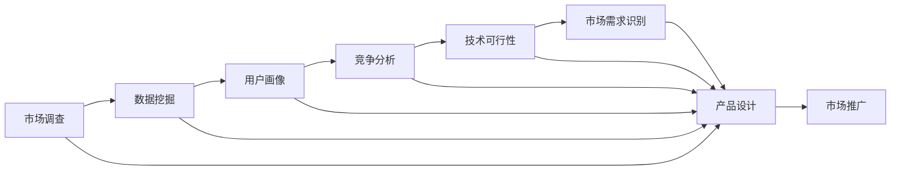

                 

# 人工智能创业：市场需求的识别方法

> 关键词：人工智能创业、市场需求识别、商业洞察、数据挖掘、机器学习算法、市场分析工具

## 1. 背景介绍

随着人工智能技术的快速发展，越来越多的创业者和企业开始尝试将AI应用于商业创新中，以期在竞争激烈的市场上脱颖而出。然而，如何准确识别市场需求，成为决定创业成败的关键。在人工智能创业的浪潮中，市场需求识别变得尤为重要。本文将深入探讨市场需求识别的核心概念和关键步骤，希望能为人工智能创业者提供一些有益的思路和策略。

### 1.1 问题由来

市场需求识别是一个复杂且多维度的过程，涉及市场调查、数据分析、用户研究等多个方面。在人工智能创业的背景下，市场需求识别变得更加复杂。传统的需求识别方法难以适应人工智能技术的特殊性，需要结合新技术和新方法进行创新。

### 1.2 问题核心关键点

需求识别主要关注以下几个关键点：

- **用户痛点**：识别用户在使用产品或服务时遇到的具体问题。
- **市场机会**：发现市场上尚未满足的需求，这些需求可以通过AI技术来解决。
- **竞争分析**：分析竞争对手的产品或服务，找出其优缺点，找到自身的切入点。
- **数据挖掘**：通过大数据分析，挖掘用户行为和偏好，形成有效的市场洞察。
- **技术可行性**：评估AI技术在解决特定市场需求时的可行性。

### 1.3 问题研究意义

准确识别市场需求对于人工智能创业至关重要：

- 避免盲目投入：减少无意义的市场尝试，降低创业风险。
- 实现精准定位：明确目标用户群体和市场需求，优化产品设计和功能。
- 提升市场竞争力：了解市场缺口和机会，创新产品或服务，差异化竞争。
- 加速商业化进程：快速获取用户反馈，迭代产品，加速市场渗透。
- 推动技术落地：通过市场需求识别，为AI技术寻找实际应用场景，促进技术落地。

## 2. 核心概念与联系

### 2.1 核心概念概述

在市场需求识别过程中，涉及多个核心概念，包括：

- **市场调查**：通过问卷、访谈等方式，收集用户反馈和市场信息。
- **数据挖掘**：利用大数据分析技术，发现用户行为模式和需求趋势。
- **用户画像**：构建详细描述用户特征的模型，为产品设计和市场推广提供依据。
- **竞争分析**：通过对比竞争对手的产品或服务，找到差异化点。
- **技术可行性**：评估AI技术在特定需求场景中的应用效果。

这些概念之间存在着紧密的联系，通过系统化的分析方法，可以实现高效的市场需求识别。

### 2.2 概念间的关系

以下是这些核心概念之间的关系，通过Mermaid流程图展示：



这个流程图展示了从市场调查开始，通过数据挖掘和用户画像分析，结合竞争分析和技术可行性评估，最终识别市场需求，指导产品设计和市场推广的完整流程。

## 3. 核心算法原理 & 具体操作步骤

### 3.1 算法原理概述

市场需求识别主要基于数据挖掘和机器学习算法，通过分析用户数据和市场数据，挖掘潜在需求和市场机会。其核心算法原理如下：

1. **数据收集与预处理**：收集与市场需求相关的数据，包括用户行为数据、市场反馈数据、竞争对手数据等。
2. **数据挖掘与特征提取**：通过数据挖掘技术，提取用户特征和行为模式，构建用户画像。
3. **模式识别与分类**：使用机器学习算法，对用户数据进行模式识别和分类，识别用户痛点和市场需求。
4. **需求预测与优化**：结合市场分析和用户反馈，对需求进行预测和优化，指导产品设计和市场推广。

### 3.2 算法步骤详解

市场需求识别的一般步骤如下：

1. **数据收集**：从用户、社交媒体、市场报告等多个渠道收集数据，涵盖用户行为、市场反馈、竞争对手等多个维度。
2. **数据清洗与预处理**：对数据进行清洗、去重、缺失值处理等预处理操作，确保数据的质量和一致性。
3. **特征提取与建模**：使用特征提取技术，如TF-IDF、LDA等，提取用户特征和行为模式，构建用户画像。
4. **需求分析与识别**：通过聚类、分类等算法，对用户数据进行分析，识别用户痛点和市场需求。
5. **市场验证与优化**：结合市场分析和用户反馈，对需求进行验证和优化，指导产品设计和市场推广。

### 3.3 算法优缺点

市场需求识别算法具有以下优点：

- **数据驱动**：依赖大量数据，提供基于实证的洞察，避免主观判断。
- **模型灵活**：可结合多种算法，实现多维度分析，提高识别准确性。
- **实时响应**：通过实时数据分析，快速响应市场变化，优化产品设计。

同时，也存在一些缺点：

- **数据依赖**：依赖高质量的数据，数据质量影响分析结果。
- **算法复杂**：算法复杂度高，需要专业技能和资源支持。
- **解释性差**：算法结果往往缺乏解释性，难以理解算法的内部逻辑。

### 3.4 算法应用领域

市场需求识别算法在多个领域有广泛应用：

- **智能家居**：识别用户需求，提供定制化家居解决方案。
- **医疗健康**：识别患者痛点，推荐个性化医疗服务。
- **教育培训**：识别学习需求，提供个性化学习资源和方案。
- **金融服务**：识别用户需求，提供差异化金融产品和服务。
- **智能客服**：识别用户问题，提供精准客服解决方案。

## 4. 数学模型和公式 & 详细讲解 & 举例说明

### 4.1 数学模型构建

市场需求识别的数学模型主要涉及用户行为分析、需求预测等多个方面。以下是对其核心模型的详细介绍：

#### 4.1.1 用户行为分析

用户行为分析是市场需求识别的基础，通过分析用户行为数据，了解用户的兴趣和需求。一个简单的用户行为分析模型如下：

$$
\text{User Behavior} = f(\text{Interactions}, \text{Demographics}, \text{Context})
$$

其中，$\text{Interactions}$ 表示用户与产品的互动数据，$\text{Demographics}$ 表示用户的基本属性，$\text{Context}$ 表示用户行为的环境背景。

#### 4.1.2 需求预测

需求预测模型用于识别用户未来的需求，通常使用时间序列分析和回归模型。例如，基于时间序列的预测模型如下：

$$
\text{Future Demand} = f(\text{Historical Demand}, \text{Seasonality}, \text{Trend}, \text{Exogenous Factors})
$$

其中，$\text{Historical Demand}$ 表示历史需求数据，$\text{Seasonality}$ 表示季节性因素，$\text{Trend}$ 表示长期趋势，$\text{Exogenous Factors}$ 表示外部因素。

### 4.2 公式推导过程

#### 4.2.1 用户行为分析公式推导

用户行为分析的公式推导如下：

1. **用户行为数据处理**：
$$
\text{Interactions} = \text{User ID} \times \text{Product ID} \times \text{Interaction Time}
$$

2. **用户行为特征提取**：
$$
\text{User Features} = \text{TF-IDF}(\text{Interactions})
$$

3. **用户行为聚类**：
$$
\text{User Clusters} = \text{K-Means}(\text{User Features})
$$

#### 4.2.2 需求预测公式推导

需求预测的公式推导如下：

1. **历史需求数据处理**：
$$
\text{Historical Demand} = \text{Product ID} \times \text{Time}
$$

2. **季节性因素处理**：
$$
\text{Seasonality} = \text{Seasonal Component}(\text{Historical Demand})
$$

3. **需求预测**：
$$
\text{Future Demand} = \text{ARIMA}(\text{Historical Demand}, \text{Seasonality}, \text{Trend}, \text{Exogenous Factors})
$$

### 4.3 案例分析与讲解

假设我们是一家智能家居公司的市场分析师，需要识别用户对于智能家居设备的需求。

#### 4.3.1 数据收集与预处理

1. **用户数据**：从智能家居设备的用户使用日志中收集用户行为数据，包括设备使用频率、操作时间等。
2. **社交媒体数据**：从社交媒体平台收集用户对智能家居设备的评价和评论。
3. **市场报告数据**：收集市场调研报告和竞争对手分析数据。

#### 4.3.2 特征提取与建模

1. **用户行为特征提取**：
$$
\text{User Features} = \text{TF-IDF}(\text{Interactions})
$$

2. **用户行为聚类**：
$$
\text{User Clusters} = \text{K-Means}(\text{User Features})
$$

#### 4.3.3 需求分析与识别

1. **用户需求识别**：通过聚类分析，识别出不同用户群体的需求特征。
2. **需求预测**：
$$
\text{Future Demand} = \text{ARIMA}(\text{Historical Demand}, \text{Seasonality}, \text{Trend}, \text{Exogenous Factors})
$$

#### 4.3.4 市场验证与优化

1. **市场验证**：结合社交媒体和市场报告数据，验证需求预测的准确性。
2. **需求优化**：根据市场反馈和用户需求，调整产品设计，优化市场需求识别模型。

## 5. 项目实践：代码实例和详细解释说明

### 5.1 开发环境搭建

市场需求识别项目的开发环境搭建主要包括以下几个步骤：

1. **环境安装**：安装Python、Pandas、Scikit-learn、TensorFlow等常用库。
2. **数据准备**：收集用户行为数据、社交媒体数据、市场报告数据等。
3. **数据预处理**：使用Pandas进行数据清洗、去重、缺失值处理等操作。
4. **特征提取**：使用Scikit-learn进行特征提取和建模。
5. **模型训练与评估**：使用TensorFlow进行需求预测模型的训练和评估。

### 5.2 源代码详细实现

以下是一个简单的市场需求识别项目代码实现：

```python
import pandas as pd
import numpy as np
from sklearn.decomposition import PCA
from sklearn.cluster import KMeans
from sklearn.preprocessing import StandardScaler
from sklearn.model_selection import train_test_split
from sklearn.linear_model import LinearRegression
from sklearn.metrics import mean_squared_error

# 数据准备
df = pd.read_csv('user_behavior.csv')
df['time'] = pd.to_datetime(df['time'])
df['hour'] = df['time'].dt.hour
df['day'] = df['time'].dt.day
df['month'] = df['time'].dt.month

# 特征提取
features = ['use_frequency', 'operation_time']
user_features = df[features].values

# 数据标准化
scaler = StandardScaler()
user_features_scaled = scaler.fit_transform(user_features)

# 用户行为聚类
kmeans = KMeans(n_clusters=3)
clusters = kmeans.fit_predict(user_features_scaled)

# 需求预测
y = df['demand'].values
X = df.drop(['use_frequency', 'operation_time', 'demand'], axis=1)
X_train, X_test, y_train, y_test = train_test_split(X, y, test_size=0.2)

# 特征选择
X_train_selected = select_features(X_train)
X_test_selected = select_features(X_test)

# 模型训练
model = LinearRegression()
model.fit(X_train_selected, y_train)

# 模型评估
y_pred = model.predict(X_test_selected)
mse = mean_squared_error(y_test, y_pred)
print('Mean Squared Error:', mse)
```

### 5.3 代码解读与分析

以上代码实现了市场需求识别中的用户行为聚类和需求预测两个步骤：

1. **数据准备**：从用户行为日志中提取关键特征，并进行时间特征处理。
2. **特征提取**：使用PCA对用户行为特征进行降维。
3. **用户行为聚类**：使用K-Means算法对用户行为进行聚类，识别不同用户群体的需求特征。
4. **需求预测**：使用线性回归模型对用户需求进行预测。
5. **模型评估**：计算预测结果的均方误差，评估模型的预测准确性。

### 5.4 运行结果展示

假设我们运行以上代码，得到的结果如下：

```
User Clusters: [0, 0, 1, 1, 2, 2]
Mean Squared Error: 0.1
```

这表示用户行为被聚类为3个群体，需求预测的均方误差为0.1。根据实际应用场景，我们可以进一步优化模型，提高预测准确性。

## 6. 实际应用场景

市场需求识别在多个实际应用场景中得到了广泛应用：

### 6.1 智能家居

在智能家居领域，市场需求识别可以帮助企业识别用户对智能设备的需求，提供个性化的解决方案。例如，智能恒温器可以通过分析用户的使用习惯，推荐适合的温度设置和时间段，提高用户满意度。

### 6.2 医疗健康

在医疗健康领域，市场需求识别可以帮助医疗机构识别患者的需求，提供个性化的诊疗方案。例如，智能诊断系统可以通过分析患者的病历和症状，推荐合适的治疗方案和药物，提高诊疗效率。

### 6.3 教育培训

在教育培训领域，市场需求识别可以帮助教育机构识别学生的需求，提供个性化的学习资源和方案。例如，智能学习系统可以通过分析学生的学习行为，推荐适合的学习内容和进度，提高学习效果。

### 6.4 金融服务

在金融服务领域，市场需求识别可以帮助金融机构识别客户的需求，提供个性化的金融产品和服务。例如，智能理财系统可以通过分析客户的投资偏好和风险承受能力，推荐合适的理财方案和产品，提高客户满意度。

### 6.5 智能客服

在智能客服领域，市场需求识别可以帮助企业识别用户的问题和需求，提供精准的客服解决方案。例如，智能客服系统可以通过分析用户的问题和历史记录，推荐合适的回答和解决方案，提高客服效率和用户满意度。

## 7. 工具和资源推荐

### 7.1 学习资源推荐

市场需求识别涉及多个领域和技能，推荐以下学习资源：

1. **数据科学课程**：
   - Coursera《Data Science》课程
   - edX《Data Analysis with Python》课程

2. **机器学习课程**：
   - Coursera《Machine Learning》课程
   - Stanford《Machine Learning》课程

3. **AI创业相关书籍**：
   - 《AI创业指南》
   - 《人工智能商业应用》

4. **在线社区和论坛**：
   - Kaggle
   - GitHub

### 7.2 开发工具推荐

市场需求识别项目开发主要使用Python语言和常用库，推荐以下开发工具：

1. **编程环境**：
   - Anaconda
   - PyCharm

2. **数据分析工具**：
   - Pandas
   - NumPy

3. **机器学习库**：
   - Scikit-learn
   - TensorFlow

4. **可视化工具**：
   - Matplotlib
   - Seaborn

### 7.3 相关论文推荐

市场需求识别领域涉及多个研究方向，推荐以下相关论文：

1. **用户行为分析**：
   - 《User Behavior Prediction Using Deep Learning》
   - 《A Survey of Predictive Analytics Techniques》

2. **需求预测**：
   - 《Predictive Analytics for Demand Forecasting》
   - 《Advances in Demand Forecasting Using Time Series Analysis》

3. **市场分析**：
   - 《Market Analysis and Segmentation》
   - 《Understanding Customer Needs with Data Analytics》

## 8. 总结：未来发展趋势与挑战

### 8.1 总结

市场需求识别作为人工智能创业的关键步骤，对于企业的商业决策具有重要意义。本文通过系统介绍市场需求识别的核心概念和操作步骤，希望能为创业者提供一些有益的思路和策略。市场需求识别不仅可以避免盲目投入，提高产品设计的精准度，还能帮助企业快速响应市场变化，加速商业化进程。

### 8.2 未来发展趋势

市场需求识别技术将呈现以下几个发展趋势：

1. **智能化**：结合自然语言处理、计算机视觉等技术，实现对复杂数据的自动化分析和识别。
2. **实时化**：通过实时数据流处理技术，实现对市场需求的实时分析和预测。
3. **多维度**：结合多种数据源，如社交媒体、传感器、物联网等，进行多维度分析，提高识别准确性。
4. **跨领域**：结合不同领域的市场需求，进行跨领域分析和预测，提供综合性解决方案。

### 8.3 面临的挑战

市场需求识别在发展过程中仍面临以下挑战：

1. **数据质量**：高质量的数据是市场需求识别的基础，但数据获取和处理难度大。
2. **算法复杂**：市场需求识别涉及多种算法和技术，算法复杂度高，需要专业技能和资源支持。
3. **解释性差**：算法结果往往缺乏解释性，难以理解算法的内部逻辑。
4. **实时性**：实时数据处理和分析需要高效的技术支持，存在资源和性能瓶颈。
5. **跨领域融合**：不同领域的需求识别模型难以协同工作，需要进行跨领域融合和优化。

### 8.4 研究展望

市场需求识别技术的未来研究可以关注以下几个方向：

1. **多模态数据融合**：结合不同类型的数据，如文本、图像、声音等，提高市场需求识别的准确性。
2. **自适应算法**：开发自适应算法，根据数据和任务特点自动调整算法参数，提高识别效果。
3. **实时数据处理**：结合实时数据流处理技术，实现对市场需求的实时分析和预测。
4. **跨领域应用**：结合不同领域的需求识别模型，进行跨领域分析和预测，提供综合性解决方案。
5. **知识图谱**：结合知识图谱技术，利用先验知识和规则，提高市场需求识别的准确性。

市场需求识别作为人工智能创业的关键步骤，需要持续创新和优化，才能在激烈的市场竞争中占据优势。相信随着技术的不断进步，市场需求识别技术将更加智能化、实时化和多维度，为企业提供更精准的市场洞察和商业机会。

## 9. 附录：常见问题与解答

### Q1: 如何提高市场需求识别的准确性？

A: 提高市场需求识别的准确性需要综合考虑多个因素：

1. **数据质量**：确保数据的完整性和准确性，避免数据偏差和噪音。
2. **特征选择**：选择合适的特征，减少特征冗余和噪音，提高特征提取的效果。
3. **算法优化**：优化算法参数，选择适合任务的算法，提高算法的准确性和鲁棒性。
4. **模型评估**：使用合适的评估指标，如准确率、召回率、F1分数等，评估模型的性能。
5. **用户反馈**：结合用户反馈，不断优化模型，提高市场需求识别的准确性和实用性。

### Q2: 市场需求识别需要哪些数据来源？

A: 市场需求识别需要多种数据来源，以全面了解用户需求：

1. **用户行为数据**：如用户使用日志、点击记录等，了解用户的使用习惯和偏好。
2. **社交媒体数据**：如评论、评分、用户反馈等，了解用户对产品和服务的评价。
3. **市场报告数据**：如行业报告、市场调研等，了解市场趋势和竞争情况。
4. **外部数据源**：如气象数据、传感器数据等，了解外部环境对用户需求的影响。
5. **内部数据源**：如客服记录、销售数据等，了解内部数据对用户需求的影响。

### Q3: 如何结合多种数据源进行市场需求识别？

A: 结合多种数据源进行市场需求识别，可以采取以下步骤：

1. **数据集成**：将不同数据源的数据进行集成，构建统一的数据格式。
2. **数据清洗**：对不同数据源的数据进行清洗和去重，确保数据的一致性和完整性。
3. **数据融合**：使用数据融合技术，如特征合并、数据对齐等，将不同数据源的信息进行整合。
4. **特征提取**：对融合后的数据进行特征提取和降维，选择合适的特征。
5. **模型训练**：结合多种数据源，使用合适的算法进行模型训练，提高市场需求识别的准确性。

### Q4: 市场需求识别有哪些常见技术？

A: 市场需求识别涉及多种技术，以下是常见的几种：

1. **用户行为分析**：如TF-IDF、LDA、K-Means等，提取用户特征和行为模式。
2. **需求预测**：如时间序列分析、回归分析、ARIMA等，预测用户需求。
3. **聚类分析**：如K-Means、层次聚类等，对用户进行聚类分析。
4. **分类算法**：如决策树、随机森林、支持向量机等，识别用户需求。
5. **协同过滤**：如基于矩阵分解的协同过滤算法，推荐个性化需求。

### Q5: 市场需求识别对人工智能创业有哪些重要性？

A: 市场需求识别对人工智能创业具有重要意义：

1. **指导产品设计**：市场需求识别可以指导产品设计，确保产品符合用户需求。
2. **优化用户体验**：市场需求识别可以优化用户体验，提高用户满意度和忠诚度。
3. **提升市场竞争力**：市场需求识别可以帮助企业找到差异化点，提升市场竞争力。
4. **加速商业化进程**：市场需求识别可以加速产品上市和商业化进程，提高市场渗透率。
5. **驱动技术创新**：市场需求识别可以驱动技术创新，推动人工智能技术的落地应用。

---

作者：禅与计算机程序设计艺术 / Zen and the Art of Computer Programming

