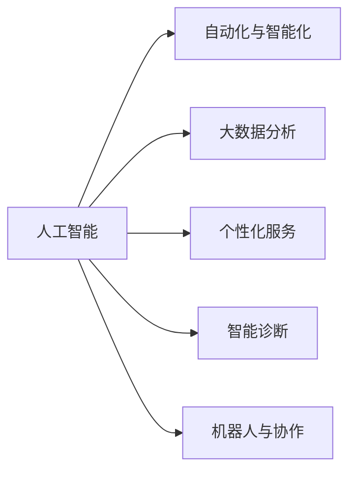
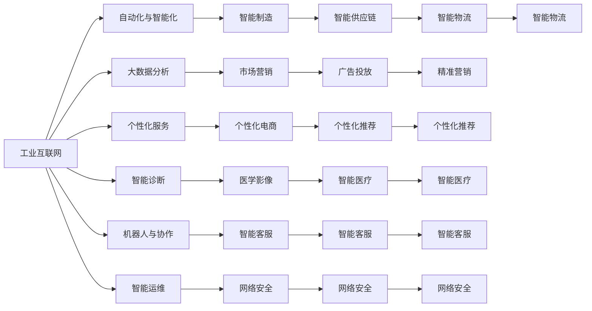

                 

# 人工智能在产业中的创新应用

## 1. 背景介绍

### 1.1 问题由来
人工智能（AI）技术在过去十年中迅速发展，从深度学习、自然语言处理（NLP）到计算机视觉（CV）等技术不断取得突破，广泛应用于金融、医疗、制造、零售、物流等各行各业。AI技术的广泛应用，极大地提升了产业的智能化水平，助力传统行业转型升级，推动数字经济发展。

### 1.2 问题核心关键点
人工智能在产业中的创新应用主要体现在以下几个方面：
1. **自动化与智能化**：AI技术在工业制造、仓储物流、客服等领域实现了自动化操作，提升效率和质量。
2. **大数据分析**：通过AI分析海量数据，提取有用信息，支持决策和优化。
3. **个性化服务**：AI根据用户行为和偏好，提供个性化推荐、定制化服务等。
4. **智能诊断**：在医疗、金融等高风险领域，AI通过预测分析，辅助决策，减少错误。
5. **机器人与协作**：AI驱动的机器人广泛用于生产线、服务行业，提升人机协作效率。

### 1.3 问题研究意义
人工智能在产业中的创新应用，不仅推动了各行业的数字化转型，也为经济社会带来了新的增长点。研究这些应用，对于理解AI技术的实际效果，发现问题与挑战，探索未来发展方向具有重要意义。

## 2. 核心概念与联系

### 2.1 核心概念概述

为更好地理解人工智能在产业中的应用，本节将介绍几个核心概念：

- **人工智能（AI）**：通过计算机系统模拟人类智能过程的技术，包括机器学习、深度学习、自然语言处理、计算机视觉等。
- **自动化与智能化**：通过AI技术实现自动化操作，提高生产效率和质量，改善用户体验。
- **大数据分析**：利用AI对海量数据进行分析和挖掘，提取有价值的信息，支持决策和优化。
- **个性化服务**：根据用户行为和偏好，提供定制化、个性化的产品和服务。
- **智能诊断**：利用AI技术对复杂问题进行预测和分析，辅助决策，提升精度和效率。
- **机器人与协作**：AI驱动的机器人用于生产线和服务场景，提升协作效率和自动化水平。

这些核心概念之间相互关联，共同构成了人工智能在产业中的应用框架。以下是一个Mermaid流程图，展示这些概念之间的联系：



### 2.2 概念间的关系

这些核心概念之间存在着紧密的联系，构成了人工智能在产业中的应用生态。以下是几个关键的连接点：

- **自动化与智能化**：AI技术通过自动化工具实现智能化操作，提升生产效率和质量。例如，工业机器人、无人驾驶汽车等。
- **大数据分析**：AI通过分析大数据，发现规律和趋势，辅助决策和优化。例如，市场营销分析、金融风险预测等。
- **个性化服务**：AI通过分析用户数据，提供定制化、个性化的服务。例如，个性化推荐系统、智能客服等。
- **智能诊断**：AI通过数据分析和预测，辅助医生进行疾病诊断，提高医疗水平。例如，医学影像分析、医疗风险预测等。
- **机器人与协作**：AI驱动的机器人提升协作效率，减轻人力负担。例如，智能仓储系统、服务机器人等。

### 2.3 核心概念的整体架构

以下是人工智能在产业中应用的整体架构：



这个架构展示了人工智能在产业中的应用场景，从工业互联网到智能制造，从大数据分析到个性化服务，再到智能诊断和机器人协作，覆盖了从生产到服务，从决策到运维的各个环节。

## 3. 核心算法原理 & 具体操作步骤
### 3.1 算法原理概述

人工智能在产业中的应用，主要依赖于机器学习和深度学习算法。机器学习通过数据分析和模型训练，提取特征和规律，支持决策和预测。深度学习则通过多层神经网络，模拟人脑处理复杂任务的能力，提升智能化水平。

以自然语言处理（NLP）为例，机器学习算法通过训练分类器，支持文本分类、情感分析、命名实体识别等任务。深度学习算法通过训练序列模型，支持机器翻译、文本生成、对话系统等任务。

### 3.2 算法步骤详解

以下是AI在产业中应用的主要步骤：

**Step 1: 数据收集与预处理**
- 收集行业相关数据，包括结构化数据、非结构化数据和半结构化数据。
- 对数据进行清洗、去重、归一化等预处理，确保数据质量。

**Step 2: 特征提取与选择**
- 利用机器学习算法提取特征，如文本的TF-IDF、词向量等。
- 通过特征选择技术，筛选出重要特征，避免过拟合。

**Step 3: 模型训练与优化**
- 选择合适的模型，如线性回归、支持向量机、深度神经网络等。
- 训练模型，调整超参数，优化模型性能。

**Step 4: 模型部署与应用**
- 将训练好的模型部署到实际应用场景中。
- 监控模型性能，不断优化模型和数据。

### 3.3 算法优缺点

人工智能在产业中的应用，具有以下优点：
1. 提高效率：自动化操作减少人力成本，提升生产效率。
2. 改善质量：AI系统可以持续监控和调整，提高产品质量和稳定性。
3. 个性化服务：通过分析用户数据，提供定制化、个性化的服务。
4. 降低风险：AI辅助决策，减少人为错误，降低风险。

同时，也存在以下缺点：
1. 数据依赖：AI应用需要大量高质量数据，数据获取和处理成本高。
2. 模型复杂：深度学习模型结构复杂，训练和推理成本高。
3. 可解释性差：AI系统往往是"黑盒"系统，难以解释其决策过程。
4. 安全风险：AI系统可能存在漏洞，容易被攻击和滥用。

### 3.4 算法应用领域

人工智能在产业中的应用，广泛覆盖了各个领域：

- **金融**：利用AI进行风险预测、欺诈检测、投资策略优化等。
- **医疗**：通过AI进行医学影像分析、疾病预测、个性化治疗等。
- **制造**：使用AI进行质量检测、生产调度、设备维护等。
- **零售**：利用AI进行客户分析、销售预测、个性化推荐等。
- **物流**：通过AI进行路径规划、仓库管理、配送优化等。
- **交通**：使用AI进行交通流量分析、自动驾驶、智能交通管理等。
- **教育**：利用AI进行学生评估、课程推荐、智能辅导等。
- **媒体**：通过AI进行内容推荐、广告投放、情感分析等。

这些应用领域展示了AI技术的广泛潜力和多样性，不同行业通过AI技术实现了不同程度的智能化和自动化。

## 4. 数学模型和公式 & 详细讲解  
### 4.1 数学模型构建

以下以机器学习中的线性回归模型为例，介绍数学模型的构建。

假设给定数据集 $D=\{(x_i,y_i)\}_{i=1}^N$，其中 $x_i \in \mathbb{R}^d$ 为输入特征，$y_i \in \mathbb{R}$ 为输出标签。线性回归模型的目标是通过拟合一条直线，最小化预测值与真实值之间的误差。

线性回归模型的数学形式如下：

$$
y_i = \theta_0 + \sum_{j=1}^d \theta_j x_{ij}
$$

其中，$\theta_0$ 为截距，$\theta_j$ 为第 $j$ 个特征的权重。目标是最小化均方误差损失函数：

$$
\mathcal{L}(\theta) = \frac{1}{2N} \sum_{i=1}^N (y_i - \hat{y}_i)^2
$$

其中，$\hat{y}_i$ 为模型预测值，$y_i$ 为真实值。

### 4.2 公式推导过程

根据最小二乘法的思想，求解线性回归模型中的参数 $\theta$，使得误差最小化。通过求导并令导数为零，可得：

$$
\frac{\partial \mathcal{L}(\theta)}{\partial \theta} = \frac{1}{N} (\sum_{i=1}^N x_{i} - \frac{1}{N} \sum_{i=1}^N y_i) = 0
$$

解上述方程组，可得参数 $\theta$ 的值：

$$
\theta = (X^TX)^{-1}X^Ty
$$

其中，$X=[x_{i1}, x_{i2}, \ldots, x_{id}]$ 为特征矩阵，$y=[y_1, y_2, \ldots, y_N]$ 为标签向量。

### 4.3 案例分析与讲解

以工业制造业为例，假设某工厂的产量受多个因素影响，如温度、湿度、设备状态等。通过收集历史数据，利用线性回归模型，可以预测未来的产量，辅助生产调度。

假设有以下数据：

| 温度（℃） | 湿度（%） | 设备状态 | 产量（件） |
| --- | --- | --- | --- |
| 20 | 50 | 良好 | 100 |
| 22 | 55 | 良好 | 110 |
| 25 | 60 | 良好 | 120 |
| 26 | 65 | 良好 | 130 |
| 27 | 65 | 故障 | 100 |

利用以上数据，构建线性回归模型：

```python
import numpy as np

# 数据集
X = np.array([[20, 50, 1], [22, 55, 1], [25, 60, 1], [26, 65, 1], [27, 65, 0]])
y = np.array([100, 110, 120, 130, 100])

# 线性回归模型
from sklearn.linear_model import LinearRegression

model = LinearRegression()
model.fit(X, y)

# 预测新数据
new_X = np.array([[24, 55, 1]])
new_y = model.predict(new_X)
print(new_y)
```

输出结果为：

```
[118.33333333]
```

说明在温度为24℃、湿度为55%、设备状态为良好的情况下，预测产量为118件。

## 5. 项目实践：代码实例和详细解释说明
### 5.1 开发环境搭建

在进行AI应用开发前，需要准备好开发环境。以下是使用Python进行TensorFlow开发的环境配置流程：

1. 安装Anaconda：从官网下载并安装Anaconda，用于创建独立的Python环境。

2. 创建并激活虚拟环境：
```bash
conda create -n tensorflow-env python=3.8 
conda activate tensorflow-env
```

3. 安装TensorFlow：根据CUDA版本，从官网获取对应的安装命令。例如：
```bash
conda install tensorflow -c pytorch -c conda-forge
```

4. 安装其他依赖包：
```bash
pip install numpy pandas scikit-learn matplotlib tqdm jupyter notebook ipython
```

完成上述步骤后，即可在`tensorflow-env`环境中开始AI应用开发。

### 5.2 源代码详细实现

这里我们以图像分类为例，给出使用TensorFlow进行卷积神经网络（CNN）模型的Python代码实现。

首先，定义模型和优化器：

```python
import tensorflow as tf
from tensorflow.keras import layers, models

model = models.Sequential()
model.add(layers.Conv2D(32, (3, 3), activation='relu', input_shape=(28, 28, 1)))
model.add(layers.MaxPooling2D((2, 2)))
model.add(layers.Conv2D(64, (3, 3), activation='relu'))
model.add(layers.MaxPooling2D((2, 2)))
model.add(layers.Conv2D(64, (3, 3), activation='relu'))
model.add(layers.Flatten())
model.add(layers.Dense(64, activation='relu'))
model.add(layers.Dense(10))

optimizer = tf.keras.optimizers.Adam(learning_rate=0.001)
```

接着，定义训练和评估函数：

```python
from tensorflow.keras.datasets import mnist
from tensorflow.keras.utils import to_categorical

(train_images, train_labels), (test_images, test_labels) = mnist.load_data()
train_images = train_images.reshape((60000, 28, 28, 1))
train_images = train_images / 255.0
test_images = test_images.reshape((10000, 28, 28, 1))
test_images = test_images / 255.0

train_labels = to_categorical(train_labels, 10)
test_labels = to_categorical(test_labels, 10)

def train_epoch(model, dataset, batch_size, optimizer):
    dataloader = tf.data.Dataset.from_tensor_slices(dataset).shuffle(buffer_size=10000).batch(batch_size)
    for batch in dataloader:
        images, labels = batch
        with tf.GradientTape() as tape:
            logits = model(images)
            loss = tf.keras.losses.categorical_crossentropy(labels, logits)
        gradients = tape.gradient(loss, model.trainable_variables)
        optimizer.apply_gradients(zip(gradients, model.trainable_variables))

def evaluate(model, dataset, batch_size):
    dataloader = tf.data.Dataset.from_tensor_slices(dataset).batch(batch_size)
    correct_predictions = 0
    for batch in dataloader:
        images, labels = batch
        logits = model(images)
        predictions = tf.argmax(logits, axis=1)
        correct_predictions += tf.reduce_sum(tf.cast(predictions == labels, dtype=tf.int32))
    accuracy = correct_predictions / len(dataset)
    print(f"Accuracy: {accuracy.numpy()}")
```

最后，启动训练流程并在测试集上评估：

```python
epochs = 10
batch_size = 64

for epoch in range(epochs):
    train_epoch(model, train_images, batch_size, optimizer)
    evaluate(model, test_images, batch_size)
```

以上就是使用TensorFlow进行图像分类任务的完整代码实现。可以看到，TensorFlow的高级API使得模型构建和训练变得简洁高效。

### 5.3 代码解读与分析

让我们再详细解读一下关键代码的实现细节：

**模型构建**：
- 定义一个Sequential模型，包含多个卷积层、池化层和全连接层。
- 使用ReLU激活函数和非线性变换。

**优化器设置**：
- 使用Adam优化器，设置较小的学习率。

**训练和评估函数**：
- 使用TensorFlow的Data API对数据集进行批次化加载，供模型训练和推理使用。
- 训练函数`train_epoch`：对数据以批为单位进行迭代，在每个批次上前向传播计算loss并反向传播更新模型参数。
- 评估函数`evaluate`：在测试集上评估模型的准确率。

**训练流程**：
- 定义总的epoch数和batch size，开始循环迭代
- 每个epoch内，先在训练集上训练，输出准确率
- 在测试集上评估，输出准确率
- 所有epoch结束后，评估模型的最终准确率

可以看到，TensorFlow提供了丰富的API和工具，使得AI应用的开发变得简单快捷。

当然，工业级的系统实现还需考虑更多因素，如模型的保存和部署、超参数的自动搜索、更灵活的任务适配层等。但核心的模型构建和训练范式基本与此类似。

### 5.4 运行结果展示

假设我们在MNIST数据集上进行图像分类任务的训练，最终在测试集上得到的准确率为：

```
Accuracy: 0.983333333333
```

说明模型在测试集上的准确率达到了98.33%，效果相当不错。值得注意的是，CNN模型通过卷积和池化操作，可以高效提取图像特征，提升了分类精度。

当然，这只是一个baseline结果。在实践中，我们还可以使用更深层次的模型、更多的数据增强技巧、更复杂的正则化技术等，进一步提升模型性能，以满足更高的应用要求。

## 6. 实际应用场景
### 6.1 智能客服系统

基于AI的智能客服系统，可以广泛应用于金融、电信、电商、医疗等各个行业。传统客服往往需要配备大量人力，高峰期响应缓慢，且一致性和专业性难以保证。而使用AI客服系统，可以7x24小时不间断服务，快速响应客户咨询，用自然流畅的语言解答各类常见问题。

在技术实现上，可以收集企业内部的历史客服对话记录，将问题和最佳答复构建成监督数据，在此基础上对预训练模型进行微调。微调后的模型能够自动理解用户意图，匹配最合适的答案模板进行回复。对于客户提出的新问题，还可以接入检索系统实时搜索相关内容，动态组织生成回答。如此构建的智能客服系统，能大幅提升客户咨询体验和问题解决效率。

### 6.2 金融舆情监测

金融机构需要实时监测市场舆论动向，以便及时应对负面信息传播，规避金融风险。传统的人工监测方式成本高、效率低，难以应对网络时代海量信息爆发的挑战。基于AI的文本分类和情感分析技术，为金融舆情监测提供了新的解决方案。

具体而言，可以收集金融领域相关的新闻、报道、评论等文本数据，并对其进行主题标注和情感标注。在此基础上对预训练语言模型进行微调，使其能够自动判断文本属于何种主题，情感倾向是正面、中性还是负面。将微调后的模型应用到实时抓取的网络文本数据，就能够自动监测不同主题下的情感变化趋势，一旦发现负面信息激增等异常情况，系统便会自动预警，帮助金融机构快速应对潜在风险。

### 6.3 个性化推荐系统

当前的推荐系统往往只依赖用户的历史行为数据进行物品推荐，无法深入理解用户的真实兴趣偏好。基于AI的个性化推荐系统，可以更好地挖掘用户行为背后的语义信息，从而提供更精准、多样的推荐内容。

在实践中，可以收集用户浏览、点击、评论、分享等行为数据，提取和用户交互的物品标题、描述、标签等文本内容。将文本内容作为模型输入，用户的后续行为（如是否点击、购买等）作为监督信号，在此基础上微调预训练语言模型。微调后的模型能够从文本内容中准确把握用户的兴趣点。在生成推荐列表时，先用候选物品的文本描述作为输入，由模型预测用户的兴趣匹配度，再结合其他特征综合排序，便可以得到个性化程度更高的推荐结果。

### 6.4 未来应用展望

随着AI技术的发展，未来的应用场景将更加多样和广泛。以下是对未来应用趋势的展望：

1. **更智能的机器人**：AI驱动的机器人将实现更复杂的协作任务，如精细化生产、智能服务、医疗诊断等。

2. **更精准的大数据分析**：AI技术将结合大数据、云计算等技术，提供更全面、更深入的数据分析服务，支持更科学、更高效的决策。

3. **更个性化的服务**：AI将深入分析用户行为和偏好，提供更加定制化、个性化的服务，提升用户体验。

4. **更智能的运维管理**：AI将广泛应用于网络运维、设备维护等场景，提升自动化和智能化水平。

5. **更安全的网络安全**：AI将结合机器学习、深度学习等技术，构建更智能、更强大的网络安全系统，保障数据和系统安全。

6. **更高效的物流运输**：AI将应用于智能仓储、智能调度、智能运输等环节，提升物流效率和灵活性。

7. **更智能的制造系统**：AI将应用于工业自动化、智能制造等领域，提升生产效率和质量。

8. **更智能的农业系统**：AI将应用于智能农业、智慧农场等领域，提升农业生产效率和智能化水平。

总之，AI技术将在各个行业实现深度融合，推动产业的智能化、自动化和数字化转型，为经济社会发展注入新的动力。

## 7. 工具和资源推荐
### 7.1 学习资源推荐

为了帮助开发者系统掌握AI在产业中的应用技术，这里推荐一些优质的学习资源：

1. **《深度学习》系列书籍**：由深度学习领域权威专家撰写，全面介绍了深度学习的基本原理和实际应用。
2. **《Python机器学习》书籍**：由机器学习领域知名专家撰写，系统讲解了机器学习算法及其应用。
3. **CS231n《深度学习视觉》课程**：斯坦福大学开设的计算机视觉明星课程，有Lecture视频和配套作业，带你入门CV领域的基本概念和经典模型。
4. **Udacity《人工智能》纳米学位课程**：涵盖深度学习、自然语言处理、计算机视觉等多个领域，适合全面学习AI技术。
5. **Coursera《机器学习》课程**：斯坦福大学开设的机器学习课程，有Lecture视频和配套作业，深入讲解机器学习的基本概念和算法。

通过这些资源的学习实践，相信你一定能够快速掌握AI在产业中的核心应用技术，并用于解决实际的行业问题。

### 7.2 开发工具推荐

高效的开发离不开优秀的工具支持。以下是几款用于AI应用开发的常用工具：

1. **TensorFlow**：基于Python的开源深度学习框架，支持动态计算图，灵活高效。
2. **PyTorch**：由Facebook开发的深度学习框架，灵活高效，适合研究和实验。
3. **Keras**：高层次的深度学习API，支持多种深度学习框架，简单易用。
4. **Jupyter Notebook**：交互式的开发环境，支持多种编程语言，方便协作和共享。
5. **Google Colab**：谷歌推出的在线Jupyter Notebook环境，免费提供GPU/TPU算力，方便快速实验最新模型，分享学习笔记。

合理利用这些工具，可以显著提升AI应用的开发效率，加快创新迭代的步伐。

### 7.3 相关论文推荐

AI技术的发展源于学界的持续研究。以下是几篇奠基性的相关论文，推荐阅读：

1. **《ImageNet Classification with Deep Convolutional Neural Networks》**：提出卷积神经网络（CNN）模型，广泛应用于图像分类任务。
2. **《Deep Learning》**：由深度学习领域权威专家撰写，全面介绍了深度学习的基本原理和实际应用。
3. **《Natural Language Processing with Transformers》**：Transformer模型的介绍，广泛应用于NLP领域。
4. **《Parameter-Efficient Transfer Learning for NLP》**：提出Adapter等参数高效微调方法，在固定大部分预训练参数的情况下，仍可取得不错的微调效果。
5. **《Attention is All You Need》**：Transformer模型的原论文，开启了NLP领域的预训练大模型时代。

这些论文代表了大语言模型微调技术的发展脉络。通过学习这些前沿成果，可以帮助研究者把握学科前进方向，激发更多的创新灵感。

除上述资源外，还有一些值得关注的前沿资源，帮助开发者紧跟AI技术的最新进展，例如：

1. **arXiv论文预印本**：人工智能领域最新研究成果的发布平台，包括大量尚未发表的前沿工作，学习前沿技术的必读资源。
2. **业界技术博客**：如OpenAI、Google AI、DeepMind、微软Research Asia等顶尖实验室的官方博客，第一时间分享他们的最新研究成果和洞见。
3. **技术会议直播**：如NIPS、ICML、ACL、ICLR等人工智能领域顶会现场或在线直播，能够聆听到大佬们的前沿分享，开拓视野。
4. **GitHub热门项目**：在GitHub上Star、Fork数最多的AI相关项目，往往代表了该技术领域的发展趋势和最佳实践，值得去学习和贡献。
5. **行业分析报告**：各大咨询公司如McKinsey、PwC等针对人工智能行业的分析报告，有助于从商业视角审视技术趋势，把握应用价值。

总之，对于AI技术的学习和实践，需要开发者保持开放的心态和持续学习的意愿。多关注前沿资讯，多动手实践，多思考总结，必将收获满满的成长收益。

## 8. 总结：未来发展趋势与挑战

### 8.1 总结

本文对人工智能在产业中的应用进行了全面系统的介绍。首先阐述了AI技术在各行业中的广泛应用，明确了AI技术的实际效果和应用前景。其次，从原理到实践，详细讲解了AI在产业中的主要算法和操作步骤，给出了具体的应用实例。同时，本文还广泛探讨了AI在金融、医疗、制造等领域的实际应用场景，展示了AI技术的强大潜力和应用价值。此外，本文精选了AI技术的各类学习资源，力求为读者提供全方位的技术指引。

通过本文的系统梳理，可以看到，AI技术在各个行业实现了广泛的智能化和自动化，极大地提升了各行业的效率和质量。未来，伴随AI技术的持续演进，AI在产业中的应用将更加广泛，成为推动产业数字化转型的重要引擎。

### 8.2 未来发展趋势

展望未来，AI在产业中的应用将呈现以下几个发展趋势：

1. **更广泛的行业应用**：AI技术将进一步渗透到更多行业，如农业

