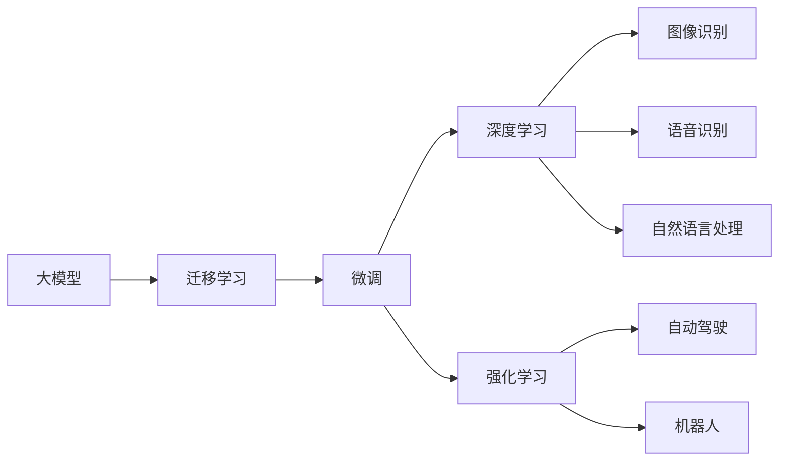

                 

# 人工智能大模型创业计划

## 1. 背景介绍

人工智能技术的快速发展为各行各业带来了前所未有的变革。然而，对于大多数创业者而言，掌握和应用最新的人工智能技术并不容易。本篇博客旨在为那些希望进入人工智能领域的创业者提供一份详细的创业指南，帮助他们从零开始构建自己的大模型创业项目。

## 2. 核心概念与联系

### 2.1 核心概念概述

在讨论人工智能大模型创业计划之前，首先需要了解几个关键概念：

- **大模型（Big Models）**：指通过大规模数据集预训练得到的，具有强大预测能力的深度学习模型。这些模型通常包含数亿个参数，能够在图像、语音、自然语言处理等领域取得令人瞩目的成果。
- **迁移学习（Transfer Learning）**：指将在大规模数据集上预训练的模型迁移到特定任务上进行微调，从而提升模型在该任务上的性能。
- **微调（Fine-Tuning）**：指在迁移学习的基础上，通过特定任务的数据集对模型进行进一步的优化，以提高模型在该任务上的准确率。
- **深度学习（Deep Learning）**：基于神经网络进行学习和推理的机器学习技术，广泛应用于图像、语音、自然语言处理等领域。
- **强化学习（Reinforcement Learning）**：通过试错机制，让机器在不断尝试中学习最优策略的机器学习方法。

这些概念构成了人工智能大模型创业计划的基础，理解它们将有助于创业者更好地设计和管理人工智能项目。

### 2.2 概念间的关系

这些概念之间的联系可以通过以下流程图来展示：



这个流程图展示了从大模型到应用的具体路径，以及深度学习和强化学习在人工智能项目中的作用。通过迁移学习和微调，大模型可以应用于多种领域，如图像识别、语音识别、自然语言处理、自动驾驶和机器人等。

## 3. 核心算法原理 & 具体操作步骤

### 3.1 算法原理概述

人工智能大模型的创业计划通常涉及以下几个核心算法：

- **迁移学习（Transfer Learning）**：在大规模数据集上预训练的模型，如BERT、GPT等，可以迁移到特定任务上进行微调，从而提高模型在该任务上的性能。
- **微调（Fine-Tuning）**：在迁移学习的基础上，通过特定任务的数据集对模型进行进一步的优化，以提高模型在该任务上的准确率。
- **深度学习（Deep Learning）**：利用神经网络进行学习和推理，广泛应用于图像、语音、自然语言处理等领域。
- **强化学习（Reinforcement Learning）**：通过试错机制，让机器在不断尝试中学习最优策略的机器学习方法。

这些算法共同构成了人工智能大模型创业计划的核心技术基础，理解它们将有助于创业者更好地设计和管理人工智能项目。

### 3.2 算法步骤详解

以下是构建人工智能大模型创业计划的基本步骤：

**Step 1: 收集和预处理数据**

- 收集和标注训练数据集。数据集应包含多样性和代表性，以确保模型在不同场景下的泛化能力。
- 对数据进行预处理，包括数据清洗、归一化、分词等，以便于后续的模型训练。

**Step 2: 选择合适的预训练模型**

- 选择适合特定任务的预训练模型，如BERT、GPT、ResNet等。
- 确定模型的架构和参数，根据实际需求进行调整。

**Step 3: 模型迁移学习**

- 使用迁移学习将预训练模型迁移到特定任务上进行微调。
- 选择合适的微调策略，如固定部分层、调整部分参数等。

**Step 4: 模型微调**

- 在特定任务的数据集上进行微调，以提高模型的准确率和泛化能力。
- 根据数据集的大小和任务的复杂度，调整学习率和正则化参数。

**Step 5: 模型评估和优化**

- 在验证集和测试集上评估模型性能。
- 根据评估结果调整模型参数和训练策略，进行进一步优化。

**Step 6: 部署和应用**

- 将优化后的模型部署到实际应用中，如网站、移动应用等。
- 对模型进行实时监控和维护，确保其稳定性和可靠性。

### 3.3 算法优缺点

人工智能大模型创业计划的优点包括：

- **效率高**：利用预训练模型和迁移学习，可以快速构建高性能模型。
- **成本低**：相比于从头训练模型，预训练和微调的成本较低。
- **泛化能力强**：预训练模型具有较好的泛化能力，适用于多种任务。

缺点包括：

- **数据需求高**：预训练和微调需要大量高质量的数据集，数据获取成本较高。
- **模型复杂**：大模型的参数量庞大，需要强大的计算资源。
- **训练时间长**：大规模模型的训练时间较长，需要耐心和资源投入。

### 3.4 算法应用领域

人工智能大模型创业计划可以应用于多个领域，包括但不限于：

- **自然语言处理（NLP）**：如机器翻译、情感分析、文本分类等。
- **计算机视觉（CV）**：如图像分类、目标检测、人脸识别等。
- **语音识别**：如语音转文字、语音合成等。
- **推荐系统**：如电商推荐、电影推荐等。
- **自动驾驶**：如路径规划、场景理解等。

## 4. 数学模型和公式 & 详细讲解  
### 4.1 数学模型构建

以下是人工智能大模型创业计划的数学模型构建过程：

**数据集**：
- 假设有一个训练数据集 $D = \{(x_1, y_1), (x_2, y_2), ..., (x_n, y_n)\}$，其中 $x_i$ 表示输入，$y_i$ 表示标签。

**模型**：
- 假设选择的预训练模型为 $M_{\theta}$，其中 $\theta$ 为模型参数。
- 在迁移学习阶段，模型使用大规模数据集进行预训练，学习到通用的语言或图像表示。

**微调**：
- 假设选择的特定任务为 $T$，微调数据集为 $D_{\text{task}} = \{(x_{\text{task},1}, y_{\text{task},1}), (x_{\text{task},2}, y_{\text{task},2}), ..., (x_{\text{task},m}, y_{\text{task},m})\}$，其中 $m$ 表示任务数据集的大小。
- 微调的目标是最小化损失函数 $\mathcal{L}$，即 $\theta^* = \mathop{\arg\min}_{\theta} \mathcal{L}(M_{\theta}, D_{\text{task}})$。

**损失函数**：
- 假设使用交叉熵损失函数，则损失函数为 $\mathcal{L}(M_{\theta}, D_{\text{task}}) = -\frac{1}{N}\sum_{i=1}^N \sum_{j=1}^m \log(M_{\theta}(x_{\text{task},j))$。

### 4.2 公式推导过程

以下是人工智能大模型创业计划的具体数学模型推导过程：

**模型输入**：
- 假设输入为 $x$，输出为 $y$。

**模型表示**：
- 假设模型 $M_{\theta}$ 的输出为 $y'$。

**交叉熵损失函数**：
- 假设使用交叉熵损失函数，则损失函数为 $\mathcal{L}(y, y') = -\frac{1}{N}\sum_{i=1}^N \sum_{j=1}^m \log(M_{\theta}(x_{\text{task},j))$。

**微调优化**：
- 假设使用随机梯度下降（SGD）优化算法，则模型参数更新为 $\theta \leftarrow \theta - \eta \nabla_{\theta}\mathcal{L}(\theta)$，其中 $\eta$ 为学习率，$\nabla_{\theta}\mathcal{L}(\theta)$ 为损失函数对参数 $\theta$ 的梯度。

### 4.3 案例分析与讲解

以情感分析任务为例，假设有一个情感分析数据集 $D_{\text{task}} = \{(x_{\text{task},1}, y_{\text{task},1}), (x_{\text{task},2}, y_{\text{task},2}), ..., (x_{\text{task},m}, y_{\text{task},m})\}$，其中 $y_{\text{task},i}$ 表示情感标签。

- 使用预训练的BERT模型进行迁移学习，模型输出为 $y' = \text{BERT}(x)$。
- 使用交叉熵损失函数 $\mathcal{L}(y, y') = -\frac{1}{N}\sum_{i=1}^N \sum_{j=1}^m \log(M_{\theta}(x_{\text{task},j))$。
- 使用随机梯度下降（SGD）优化算法进行模型优化，即 $\theta \leftarrow \theta - \eta \nabla_{\theta}\mathcal{L}(\theta)$。

## 5. 项目实践：代码实例和详细解释说明

### 5.1 开发环境搭建

构建人工智能大模型创业计划的基本环境搭建包括：

- 安装Python和相关库，如TensorFlow、PyTorch等。
- 安装相关工具，如Jupyter Notebook、TensorBoard等。
- 搭建模型训练和推理环境，如GPU、TPU等。

### 5.2 源代码详细实现

以下是使用PyTorch进行情感分析任务的代码实现：

```python
import torch
import torch.nn as nn
import torch.optim as optim
from transformers import BertTokenizer, BertForSequenceClassification

# 数据集准备
tokenizer = BertTokenizer.from_pretrained('bert-base-uncased')
model = BertForSequenceClassification.from_pretrained('bert-base-uncased', num_labels=2)
device = torch.device("cuda" if torch.cuda.is_available() else "cpu")
model.to(device)

# 数据预处理
def preprocess(text):
    return tokenizer.encode(text, add_special_tokens=True)

# 模型训练
def train(model, optimizer, train_loader, device, num_epochs):
    for epoch in range(num_epochs):
        model.train()
        for batch in train_loader:
            inputs = {key: tensor.to(device) for key, tensor in batch.items()}
            outputs = model(**inputs)
            loss = outputs.loss
            optimizer.zero_grad()
            loss.backward()
            optimizer.step()

# 模型评估
def evaluate(model, eval_loader, device):
    model.eval()
    total_loss = 0
    for batch in eval_loader:
        inputs = {key: tensor.to(device) for key, tensor in batch.items()}
        outputs = model(**inputs)
        total_loss += outputs.loss.item()
    return total_loss / len(eval_loader)

# 运行训练和评估
train_loader = ...
eval_loader = ...
num_epochs = ...
optimizer = optim.Adam(model.parameters(), lr=1e-5)
train(model, optimizer, train_loader, device, num_epochs)
eval_loss = evaluate(model, eval_loader, device)
```

### 5.3 代码解读与分析

以上代码实现了基于BERT模型的情感分析任务。首先，使用PyTorch和transformers库初始化模型和分词器。然后，定义数据预处理函数和模型训练函数。最后，在训练和评估数据集上运行训练和评估过程。

## 6. 实际应用场景

人工智能大模型创业计划可以应用于多个领域，如自然语言处理（NLP）、计算机视觉（CV）、语音识别、推荐系统、自动驾驶等。以下是一些具体的实际应用场景：

### 6.1 自然语言处理（NLP）

- **机器翻译**：利用预训练模型和微调技术，将一种语言翻译成另一种语言。
- **情感分析**：分析用户评论和反馈，评估产品的用户满意度。
- **文本分类**：对文本进行分类，如新闻分类、垃圾邮件过滤等。

### 6.2 计算机视觉（CV）

- **图像分类**：将图像分类到不同的类别中，如猫、狗、汽车等。
- **目标检测**：在图像中检测并定位特定对象，如行人、车辆等。
- **人脸识别**：识别并验证图像中的人脸信息，用于安全验证等。

### 6.3 语音识别

- **语音转文字**：将语音转换为文字，用于语音搜索、语音助手等。
- **语音合成**：将文本转换为语音，用于语音播报、智能客服等。

### 6.4 推荐系统

- **电商推荐**：根据用户历史行为和兴趣推荐商品。
- **电影推荐**：根据用户评分和兴趣推荐电影。

### 6.5 自动驾驶

- **路径规划**：在复杂交通场景下，自动规划最优驾驶路径。
- **场景理解**：识别和理解道路上的各种场景，如行人、车辆、交通标志等。

## 7. 工具和资源推荐

### 7.1 学习资源推荐

以下是一些推荐的学习资源，帮助创业者掌握人工智能大模型创业计划的相关技术：

- **Coursera**：提供人工智能领域的免费和付费课程，包括深度学习、机器学习等。
- **Udacity**：提供人工智能和机器学习的专业课程，涵盖深度学习、强化学习等。
- **Kaggle**：提供各种数据集和比赛，帮助创业者实践和验证模型性能。
- **Google AI Hub**：提供各种预训练模型和教程，帮助创业者快速上手。

### 7.2 开发工具推荐

以下是一些推荐的开发工具，帮助创业者构建和部署人工智能大模型创业计划：

- **TensorFlow**：开源的深度学习框架，适合构建高性能模型。
- **PyTorch**：灵活的深度学习框架，适合研究和原型开发。
- **Jupyter Notebook**：用于编写和运行Python代码的交互式环境。
- **TensorBoard**：用于可视化模型训练过程和结果的工具。

### 7.3 相关论文推荐

以下是一些推荐的论文，帮助创业者深入理解人工智能大模型创业计划的技术：

- **Attention is All You Need**：介绍Transformer模型的经典论文。
- **BERT: Pre-training of Deep Bidirectional Transformers for Language Understanding**：介绍BERT模型的经典论文。
- **Imagenet Classification with Deep Convolutional Neural Networks**：介绍深度卷积神经网络的经典论文。
- **Reinforcement Learning: An Introduction**：介绍强化学习的经典教材。

## 8. 总结：未来发展趋势与挑战

### 8.1 研究成果总结

人工智能大模型创业计划是一个快速发展的领域，其核心技术不断进步。以下是一些已有的研究成果：

- **BERT**：通过大规模预训练，提升了自然语言处理的性能。
- **Transformer**：提出了一种高效的神经网络结构，广泛应用于各种任务。
- **深度学习**：通过神经网络进行学习和推理，提升了模型的准确率和泛化能力。

### 8.2 未来发展趋势

未来，人工智能大模型创业计划将呈现以下几个发展趋势：

- **数据规模扩大**：随着数据生成技术的发展，数据规模将进一步扩大，提升模型的性能。
- **模型结构优化**：通过模型压缩和加速技术，提升模型的推理速度和效率。
- **模型跨领域应用**：大模型将逐步应用到更多领域，如医疗、金融、教育等。
- **模型可解释性提升**：通过模型解释技术，提高模型的可解释性和可靠性。
- **多模态融合**：通过融合图像、语音、文本等多模态数据，提升模型的性能。

### 8.3 面临的挑战

虽然人工智能大模型创业计划前景广阔，但还面临一些挑战：

- **数据隐私和安全**：保护用户隐私和数据安全是模型应用的前提。
- **模型偏见和歧视**：模型可能会学习到偏见和歧视，影响其公平性和公正性。
- **计算资源消耗**：大规模模型的计算资源消耗较大，需要相应的硬件支持。
- **模型性能瓶颈**：模型的性能瓶颈限制了其在实际应用中的表现。
- **模型迁移能力**：模型的迁移能力不足，难以适应新任务和新数据。

### 8.4 研究展望

未来，人工智能大模型创业计划将重点关注以下几个研究方向：

- **数据隐私保护**：研究数据隐私保护技术，确保用户数据的安全性。
- **模型公平性**：研究模型公平性算法，减少模型偏见和歧视。
- **模型压缩和加速**：研究模型压缩和加速技术，提升模型的推理速度和效率。
- **多模态融合**：研究多模态数据的融合技术，提升模型的性能和泛化能力。
- **模型可解释性**：研究模型解释技术，提高模型的可解释性和可靠性。

## 9. 附录：常见问题与解答

### Q1: 大模型创业计划的难点有哪些？

**A**: 大模型创业计划的难点主要包括以下几点：

- **数据获取和标注**：高质量数据集的获取和标注是模型训练的前提。
- **计算资源消耗**：大规模模型的计算资源消耗较大，需要相应的硬件支持。
- **模型性能提升**：模型的性能瓶颈限制了其在实际应用中的表现。
- **模型可解释性**：模型的可解释性不足，难以理解其决策过程和逻辑。

### Q2: 如何选择合适的预训练模型？

**A**: 选择合适的预训练模型需要考虑以下几个因素：

- **任务相关性**：选择与任务相关的预训练模型，如情感分析任务应选择BERT等。
- **模型大小**：根据实际需求选择合适的模型大小，如BERT、GPT等。
- **模型性能**：根据任务的需求和数据规模选择性能最优的模型。

### Q3: 如何处理数据不平衡问题？

**A**: 数据不平衡是模型训练中常见的问题，可以通过以下方法解决：

- **数据增强**：对少数类别进行数据增强，增加样本数量。
- **重采样**：对多数类别进行下采样，减少样本数量。
- **类别权重**：在损失函数中加入类别权重，提高少数类别的权重。

### Q4: 如何评估模型的泛化能力？

**A**: 模型的泛化能力可以通过以下方法评估：

- **交叉验证**：在训练过程中使用交叉验证，评估模型的泛化能力。
- **测试集评估**：在测试集上评估模型的性能，评估模型的泛化能力。
- **迁移学习**：通过迁移学习，评估模型在未见过的数据集上的性能。

### Q5: 如何提升模型的推理速度？

**A**: 提升模型的推理速度可以通过以下方法实现：

- **模型压缩**：通过模型压缩技术，减小模型大小，提升推理速度。
- **模型并行**：通过模型并行技术，分布式训练和推理。
- **硬件加速**：通过硬件加速技术，提升计算速度和效率。

---

作者：禅与计算机程序设计艺术 / Zen and the Art of Computer Programming

