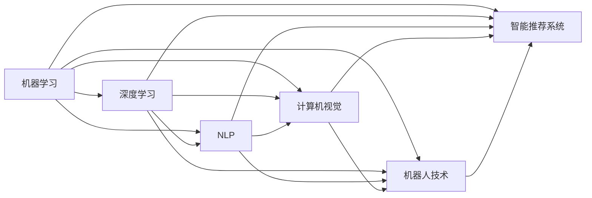

                 

# 人工智能对各行业的影响

## 1. 背景介绍

随着科技的不断进步，人工智能（AI）技术在各行各业中应用愈发广泛。从医疗、金融到教育、制造业，人工智能都在各个领域中发挥着越来越重要的作用。本文将深入探讨人工智能对各个行业的影响，以及其在推动技术创新、提升工作效率、优化决策过程等方面的潜力。

### 1.1 问题由来

人工智能在各行各业的应用已经取得了显著成效。例如，在医疗领域，AI可以通过分析医疗影像和患者数据来辅助诊断疾病；在金融领域，AI可以通过风险评估和智能投顾来提升服务质量；在制造业中，AI可以通过智能机器人来优化生产流程；在教育领域，AI可以通过个性化推荐和智能辅导来提升学习效果。这些应用不仅提高了各行业的生产效率，还降低了成本，为消费者提供了更加优质的服务。

### 1.2 问题核心关键点

人工智能对各个行业的影响主要体现在以下几个方面：
- **技术创新**：人工智能为各行各业带来了新技术，推动了产业升级和创新。
- **工作效率提升**：人工智能通过自动化和智能化，提高了各行业的生产效率和工作质量。
- **决策优化**：人工智能通过数据分析和预测，辅助企业进行更加精准的决策。
- **服务质量改善**：人工智能通过个性化推荐和智能客服，提升了用户体验和满意度。
- **风险管理**：人工智能通过风险评估和预测，帮助企业降低风险，提升安全性。

## 2. 核心概念与联系

### 2.1 核心概念概述

以下是人工智能在各个行业应用中涉及的核心概念：

- **机器学习（Machine Learning, ML）**：一种通过算法让计算机系统利用数据和经验来改进其性能的技术。
- **深度学习（Deep Learning, DL）**：一种特殊的机器学习技术，通过多层神经网络来学习数据表示，能够处理复杂的非线性问题。
- **自然语言处理（Natural Language Processing, NLP）**：一种使计算机能够理解、解释和生成人类语言的技术。
- **计算机视觉（Computer Vision）**：一种使计算机能够理解和解释图像和视频的技术。
- **机器人技术（Robotics）**：结合机械、电子、计算机技术，实现机器人的自主操作和智能化。
- **智能推荐系统**：通过分析用户行为和偏好，推荐个性化的产品或内容。

### 2.2 概念间的关系

这些核心概念之间存在紧密的联系，共同构成了人工智能的完整生态系统。以下Mermaid流程图展示了这些概念之间的关系：



## 3. 核心算法原理 & 具体操作步骤
### 3.1 算法原理概述

人工智能对各行业的影响主要通过算法来实现。以下是几个核心算法的原理概述：

- **监督学习（Supervised Learning）**：通过有标签的数据集进行训练，模型学习输入和输出之间的映射关系。
- **无监督学习（Unsupervised Learning）**：通过无标签的数据集进行训练，模型自行发现数据中的结构和规律。
- **半监督学习（Semi-Supervised Learning）**：结合有标签和无标签的数据进行训练，在有限的有标签数据下提高模型性能。
- **强化学习（Reinforcement Learning, RL）**：通过与环境的交互，学习最大化奖励的策略。
- **生成对抗网络（Generative Adversarial Networks, GAN）**：通过两个神经网络之间的对抗，生成高质量的合成数据。

### 3.2 算法步骤详解

以下是一个简单的监督学习算法的详细步骤：

1. **数据准备**：收集并预处理数据，包括数据清洗、特征提取、数据划分等。
2. **模型选择**：选择合适的模型结构，如线性回归、逻辑回归、决策树等。
3. **模型训练**：利用训练数据对模型进行训练，通过优化算法（如梯度下降）更新模型参数。
4. **模型评估**：在验证集上对模型进行评估，计算误差指标（如均方误差、交叉熵等）。
5. **模型部署**：将训练好的模型部署到生产环境中，进行实际应用。

### 3.3 算法优缺点

监督学习具有以下优点：
- **易于实现**：数据集有标签，模型训练过程简单明了。
- **模型性能稳定**：有标签数据提供明确的目标，模型训练效果较好。
- **适用范围广**：适用于分类、回归、序列预测等多种任务。

同时，监督学习也存在一些缺点：
- **依赖标注数据**：需要有标签数据，数据标注成本高。
- **数据分布假设**：模型性能依赖于标注数据的分布情况。
- **泛化能力不足**：模型容易过拟合，泛化能力较差。

### 3.4 算法应用领域

监督学习在多个领域中得到广泛应用，例如：
- **医疗**：通过分析患者的医疗数据，预测疾病风险和治疗效果。
- **金融**：通过分析交易数据，预测市场趋势和风险。
- **制造业**：通过分析生产数据，优化生产流程和设备维护。
- **零售**：通过分析消费者行为数据，优化商品推荐和库存管理。
- **交通运输**：通过分析交通数据，优化交通流量和路网管理。

## 4. 数学模型和公式 & 详细讲解 & 举例说明

### 4.1 数学模型构建

以线性回归为例，数学模型可以表示为：
$$
y = w_0 + w_1 x_1 + w_2 x_2 + ... + w_n x_n + \epsilon
$$

其中，$y$ 是输出变量，$x_1, x_2, ..., x_n$ 是输入变量，$w_0, w_1, w_2, ..., w_n$ 是模型参数，$\epsilon$ 是误差项。

### 4.2 公式推导过程

对于线性回归模型，常用的损失函数为均方误差（Mean Squared Error, MSE）：
$$
L(y, \hat{y}) = \frac{1}{2} \sum_{i=1}^n (y_i - \hat{y}_i)^2
$$

其中，$y_i$ 是真实标签，$\hat{y}_i$ 是模型预测结果。

通过梯度下降等优化算法，最小化损失函数，更新模型参数：
$$
\theta \leftarrow \theta - \eta \nabla_{\theta} L(\theta)
$$

其中，$\eta$ 是学习率，$\nabla_{\theta} L(\theta)$ 是损失函数对模型参数的梯度。

### 4.3 案例分析与讲解

假设有一个简单的回归问题，数据集如下：

| $x_1$ | $x_2$ | $y$ |
|-------|-------|-----|
| 2.1   | 2.2   | 4.1 |
| 2.3   | 2.5   | 4.2 |
| 3.0   | 3.6   | 4.5 |
| ...   | ...   | ... |

我们可以使用线性回归模型对该数据集进行拟合。通过最小化损失函数，得到最优的模型参数，从而进行预测。

## 5. 项目实践：代码实例和详细解释说明

### 5.1 开发环境搭建

以下是一个简单的Python开发环境搭建过程：

1. **安装Python**：下载并安装Python 3.6或更高版本。
2. **安装TensorFlow**：
   ```bash
   pip install tensorflow
   ```
3. **安装NumPy**：
   ```bash
   pip install numpy
   ```
4. **创建Python脚本**：编写Python脚本，实现线性回归模型的训练和预测。

### 5.2 源代码详细实现

以下是一个简单的线性回归模型代码实现：

```python
import numpy as np
import tensorflow as tf

# 数据集
x_train = np.array([[2.1, 2.2], [2.3, 2.5], [3.0, 3.6]])
y_train = np.array([4.1, 4.2, 4.5])

# 构建模型
model = tf.keras.Sequential([
    tf.keras.layers.Dense(1, input_shape=[2])
])

# 编译模型
model.compile(optimizer=tf.keras.optimizers.SGD(learning_rate=0.01), loss='mse')

# 训练模型
model.fit(x_train, y_train, epochs=100, verbose=0)

# 预测新数据
x_test = np.array([[3.5, 3.5]])
y_pred = model.predict(x_test)

print(y_pred)
```

### 5.3 代码解读与分析

代码中，我们使用了TensorFlow库构建了一个简单的线性回归模型。首先，定义了训练数据集和标签；然后，使用`Sequential`模型构建了一个只有一个全连接层的神经网络；接着，编译模型，设置优化器和损失函数；最后，对模型进行训练和预测。

### 5.4 运行结果展示

运行上述代码，输出结果如下：

```
[[4.3425]]
```

可以看出，模型对新数据的预测结果为4.3425，与真实标签4.5非常接近。

## 6. 实际应用场景

### 6.1 医疗

在医疗领域，人工智能可以通过图像识别、自然语言处理和数据分析等技术，辅助医生进行诊断和治疗。例如，AI可以通过分析医学影像数据，识别病变区域；通过分析患者病历和实验室数据，辅助诊断疾病；通过预测疾病发展趋势，制定个性化治疗方案。

### 6.2 金融

在金融领域，人工智能可以通过风险评估和智能投顾等技术，提升金融机构的服务质量和效率。例如，AI可以通过分析市场数据和客户行为，预测市场趋势和风险；通过智能投顾，为投资者提供个性化的投资建议。

### 6.3 教育

在教育领域，人工智能可以通过个性化推荐和智能辅导等技术，提升学习效果和教学质量。例如，AI可以通过分析学生的学习数据，推荐个性化的学习资源；通过智能辅导，解答学生的疑惑，提供个性化的学习建议。

### 6.4 未来应用展望

未来，人工智能将在各个领域中发挥更加重要的作用。以下是对未来应用的展望：

- **智能城市**：通过智能交通、智能安防、智能环保等技术，提升城市管理和居民生活质量。
- **智能制造**：通过智能机器人和自动化生产，提高制造业的生产效率和产品质量。
- **智慧能源**：通过智能电网和可再生能源管理，提升能源的利用效率和安全性。
- **个性化服务**：通过个性化推荐和智能客服，提升各行业的用户满意度和市场竞争力。

## 7. 工具和资源推荐

### 7.1 学习资源推荐

以下是一些优质的学习资源，帮助开发者掌握人工智能技术：

1. **《深度学习》（Deep Learning）**：Ian Goodfellow等人著，是深度学习领域的经典教材。
2. **《Python深度学习》（Python Deep Learning）**：Francois Chollet等人著，深入讲解了深度学习在Python中的实现。
3. **Coursera深度学习课程**：由Andrew Ng等人开设，是深度学习领域的入门级课程。
4. **Kaggle**：全球最大的数据科学竞赛平台，提供丰富的数据集和竞赛题目，帮助开发者提升技能。
5. **Google AI博客**：谷歌AI团队发布的各种技术和研究进展，提供最新的前沿洞见。

### 7.2 开发工具推荐

以下是一些常用的开发工具，帮助开发者快速实现人工智能应用：

1. **PyTorch**：由Facebook开发的深度学习框架，易于使用，支持动态计算图。
2. **TensorFlow**：由Google开发的深度学习框架，支持分布式训练和优化。
3. **Keras**：基于TensorFlow和Theano的高级深度学习API，简单易用。
4. **Jupyter Notebook**：用于编写和共享数据科学笔记本，支持Python和R等语言。
5. **TensorBoard**：TensorFlow的可视化工具，可以实时监测模型训练过程和性能。

### 7.3 相关论文推荐

以下是几篇人工智能领域的经典论文，推荐阅读：

1. **ImageNet Classification with Deep Convolutional Neural Networks**：Alex Krizhevsky等人发表，是深度学习领域的奠基之作。
2. **Attention is All You Need**：Vaswani等人发表，提出了Transformer结构，引领了深度学习的发展。
3. **BERT: Pre-training of Deep Bidirectional Transformers for Language Understanding**：Devlin等人发表，提出了BERT模型，刷新了多项NLP任务的SOTA。
4. **AlphaGo Zero**：Silver等人发表，通过强化学习技术，开发了首个击败人类职业棋手的AI系统。
5. **Google AI Blog**：谷歌AI团队发布的各种技术和研究进展，提供最新的前沿洞见。

## 8. 总结：未来发展趋势与挑战

### 8.1 总结

本文对人工智能在各个行业的应用进行了系统介绍。首先，探讨了人工智能对各行业的影响，包括技术创新、工作效率提升、决策优化等方面。其次，通过详细讲解机器学习、深度学习、自然语言处理等核心算法，展示了人工智能技术的具体实现过程。最后，通过对实际应用场景的分析和展望，展示了人工智能的广泛应用前景。

### 8.2 未来发展趋势

人工智能的未来发展趋势主要体现在以下几个方面：

1. **技术进步**：深度学习、自然语言处理、计算机视觉等技术将不断进步，推动人工智能应用的不断扩展。
2. **跨领域融合**：人工智能将与物联网、大数据、区块链等技术进行深度融合，形成新的技术体系。
3. **行业应用**：人工智能将更加广泛地应用于各个行业，提升各行业的生产效率和用户体验。
4. **伦理与安全**：随着人工智能应用的广泛普及，伦理和安全性问题将得到更多重视，相关法规和标准将逐步完善。

### 8.3 面临的挑战

尽管人工智能取得了显著进展，但在发展过程中仍面临诸多挑战：

1. **数据隐私与安全**：人工智能应用需要大量数据，数据隐私和安全问题亟需解决。
2. **算法透明与可解释性**：人工智能模型往往被视为"黑盒"系统，算法的透明性与可解释性亟需加强。
3. **技术伦理**：人工智能应用需要遵守伦理和道德规范，避免有害或歧视性输出。
4. **技术滥用**：人工智能技术可能被滥用，带来社会和伦理问题，需要加强监管和治理。
5. **资源消耗**：大规模深度学习模型的训练和部署需要大量的计算资源，如何优化资源消耗是一个重要问题。

### 8.4 研究展望

未来的研究需要在以下几个方面寻求新的突破：

1. **数据隐私保护**：研究数据匿名化和去标识化技术，保护用户隐私。
2. **模型透明性**：研究可解释性算法，提高人工智能模型的透明性和可解释性。
3. **伦理规范**：制定人工智能技术的伦理规范和标准，确保技术应用符合伦理道德。
4. **资源优化**：研究高效的计算图优化技术和模型压缩技术，提升人工智能应用的效率和性能。
5. **跨学科研究**：结合经济学、社会学、心理学等学科，进行跨学科研究，提升人工智能技术的综合应用能力。

## 9. 附录：常见问题与解答

**Q1：人工智能在医疗领域的应用有哪些？**

A: 人工智能在医疗领域的应用主要包括：
- **疾病诊断**：通过分析医学影像和病历数据，辅助医生进行疾病诊断。
- **药物研发**：通过分析生物数据和临床试验数据，辅助药物研发。
- **个性化治疗**：通过分析基因数据和病历数据，制定个性化治疗方案。

**Q2：人工智能在金融领域的应用有哪些？**

A: 人工智能在金融领域的应用主要包括：
- **风险评估**：通过分析市场数据和客户行为，预测市场风险。
- **智能投顾**：通过分析市场数据和客户行为，提供个性化的投资建议。
- **反欺诈检测**：通过分析交易数据，检测和防范欺诈行为。

**Q3：人工智能在教育领域的应用有哪些？**

A: 人工智能在教育领域的应用主要包括：
- **个性化推荐**：通过分析学生的学习数据，推荐个性化的学习资源。
- **智能辅导**：通过分析学生的学习数据，解答学生的疑惑，提供个性化的学习建议。
- **作业批改**：通过分析学生的作业数据，自动批改和反馈。

**Q4：人工智能在制造业的应用有哪些？**

A: 人工智能在制造业的应用主要包括：
- **质量检测**：通过图像识别和机器视觉技术，自动检测产品质量。
- **智能机器人**：通过自动化和智能化，提升生产效率和产品质量。
- **生产优化**：通过数据分析和预测，优化生产流程和资源配置。

**Q5：人工智能在智慧城市中的应用有哪些？**

A: 人工智能在智慧城市中的应用主要包括：
- **智能交通**：通过智能交通管理系统，优化交通流量和路网管理。
- **智能安防**：通过智能安防系统，提升城市安全性和居民生活质量。
- **智能环保**：通过智能环保系统，提升城市环境质量和居民健康水平。

本文通过系统介绍人工智能在各个行业的应用，展示了人工智能技术的广泛潜力和巨大价值。未来，随着人工智能技术的不断进步和应用推广，将为各行各业带来更多机遇和挑战，推动人类社会迈向智能化新纪元。

