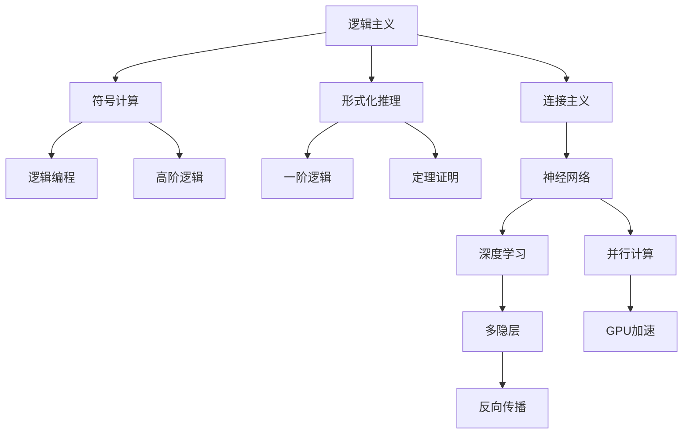
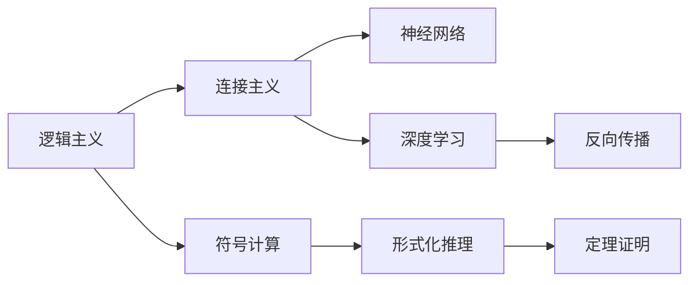
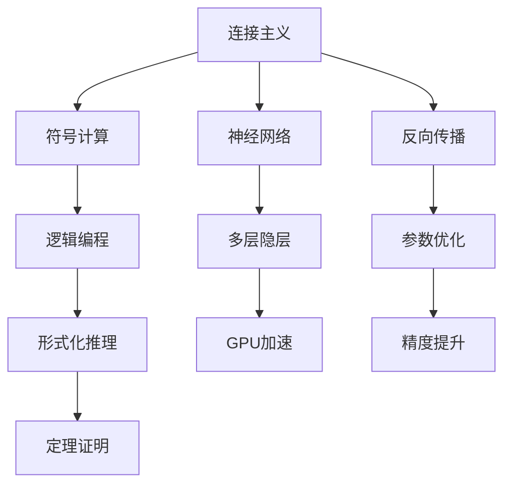
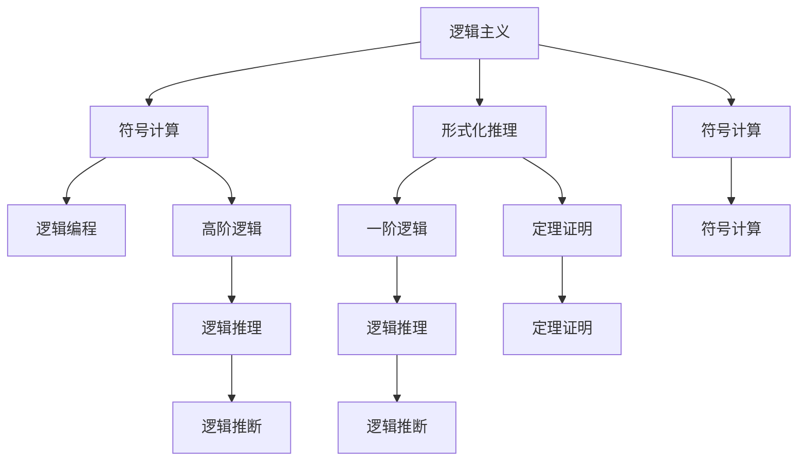
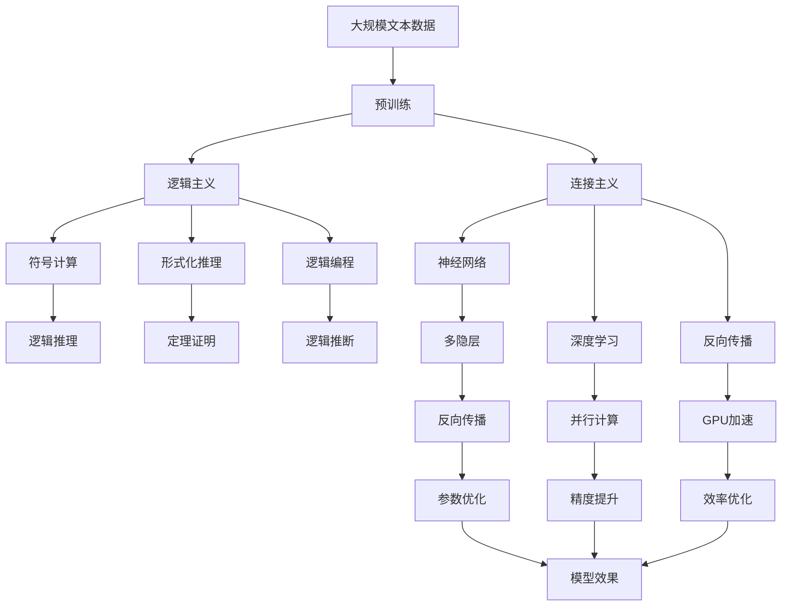

                 

# 人工智能的两大流派：逻辑与神经网络

> 关键词：人工智能,逻辑主义,连接主义,符号计算,神经网络,深度学习,并行计算,反向传播,神经网络结构

## 1. 背景介绍

### 1.1 问题由来
人工智能（Artificial Intelligence, AI）是计算机科学的一个前沿领域，旨在让机器具有类似于人类的智能能力，包括学习、推理、决策、自然语言理解等。历史上，AI的发展经历了几次重大变革，其中最重要的便是逻辑主义和连接主义两大流派的对立和融合。逻辑主义追求通过逻辑推理来模拟人脑的认知过程，而连接主义则侧重于通过神经网络等模型来模仿人脑的计算结构。本文将详细介绍这两种流派的基本原理和特点，以及它们在AI发展中的地位和作用。

### 1.2 问题核心关键点
逻辑主义和连接主义是AI发展的两大基石，它们分别从符号计算和神经网络两个角度出发，试图解决复杂问题。逻辑主义强调形式化推理，使用符号语言描述问题，而连接主义则侧重于仿生学，使用神经网络结构模拟人脑的计算过程。两种流派的融合，推动了AI技术的快速发展，但它们也存在着相互矛盾和冲突。如何平衡这两种流派的优势，在AI领域中一直是一个值得深入探讨的问题。

### 1.3 问题研究意义
深入理解逻辑主义和连接主义两大流派，对于推动AI技术的进一步发展具有重要意义：

1. 提供理论支持：逻辑主义和连接主义的理论基础分别来源于数理逻辑和认知科学，它们为AI研究提供了坚实的理论支撑。
2. 指导技术实践：逻辑主义和连接主义的不同方法，如逻辑编程、神经网络，已经成为现代AI技术的主要手段。
3. 促进学科交叉：AI涉及的领域非常广泛，逻辑主义和连接主义的融合，有助于推动AI与其他学科的交叉发展，如认知神经科学、计算机视觉、自然语言处理等。
4. 提升问题解决能力：逻辑主义和连接主义的结合，使AI能够更高效地处理复杂问题，如推理、决策、规划等。
5. 推动伦理研究：随着AI技术的不断发展，逻辑主义和连接主义的伦理问题也逐渐显现，如何在技术开发中兼顾伦理道德，成为了一个重要课题。

## 2. 核心概念与联系

### 2.1 核心概念概述

为更好地理解逻辑主义和连接主义的基本原理和联系，本节将介绍几个密切相关的核心概念：

- 逻辑主义（Logicism）：一种试图通过形式化逻辑和符号计算来实现人工智能的流派，强调推理和证明的逻辑性。
- 连接主义（Connectionism）：一种试图通过仿生学和神经网络来实现人工智能的流派，侧重于仿真人脑的计算结构。
- 符号计算（Symbolic Computation）：使用符号语言（如Prolog、Lisp）进行问题描述和求解的技术，与逻辑主义密切相关。
- 神经网络（Neural Networks）：由大量简单的神经元组成的网络结构，通过反向传播等算法进行训练，与连接主义密切相关。
- 深度学习（Deep Learning）：一种特殊的神经网络架构，通过多层隐层进行特征提取和模式学习，广泛应用于计算机视觉、自然语言处理等领域。
- 反向传播（Backpropagation）：一种用于训练神经网络的算法，通过链式法则计算损失函数的梯度，更新网络参数。
- 并行计算（Parallel Computing）：利用多个处理器同时进行计算，提高神经网络训练和推理的效率，是神经网络的重要特性之一。

这些核心概念之间的逻辑关系可以通过以下Mermaid流程图来展示：



这个流程图展示了大语言模型微调过程中各个核心概念的关系和作用：

1. 逻辑主义通过符号计算和形式化推理实现人工智能，强调逻辑的严谨性和正确性。
2. 连接主义通过神经网络实现人工智能，侧重于仿真人脑的计算结构，强调计算的并行性和复杂性。
3. 符号计算与逻辑主义紧密相关，通过符号语言进行问题描述和求解。
4. 神经网络是连接主义的核心，深度学习是神经网络的一种特殊形式。
5. 反向传播是神经网络训练的重要算法，多隐层和并行计算提高了神经网络的效果和效率。

### 2.2 概念间的关系

这些核心概念之间存在着紧密的联系，形成了人工智能的理论和实践框架。下面通过几个Mermaid流程图来展示这些概念之间的关系。

#### 2.2.1 逻辑主义与连接主义的联系



这个流程图展示了逻辑主义和连接主义之间的联系：

1. 逻辑主义通过符号计算进行形式化推理，可以用于设计神经网络的规则和策略。
2. 连接主义使用神经网络实现计算，需要反向传播算法进行参数优化。
3. 深度学习是神经网络的一种特殊形式，可以用于更复杂的符号计算。
4. 符号计算和形式化推理可以用于设计神经网络的架构和训练策略。
5. 定理证明和反向传播是逻辑主义和连接主义的共同工具，用于验证和优化模型。

#### 2.2.2 连接主义与符号计算的联系



这个流程图展示了连接主义与符号计算之间的联系：

1. 连接主义使用神经网络进行计算，可以用于符号计算中的函数求解和推理。
2. 符号计算使用逻辑语言进行问题描述，可以用于神经网络的规则和策略设计。
3. 反向传播用于神经网络的参数优化，可以用于符号计算中的推理验证。
4. 多层隐层和GPU加速可以提高神经网络的效果和效率，也可以用于符号计算中的复杂函数计算。
5. 定理证明和参数优化是连接主义和符号计算的共同工具，用于提高计算的准确性和效率。

#### 2.2.3 逻辑主义与符号计算的联系



这个流程图展示了逻辑主义与符号计算之间的联系：

1. 逻辑主义通过形式化推理进行问题求解，可以用于符号计算中的函数求解和推理。
2. 符号计算使用逻辑语言进行问题描述，可以用于逻辑主义的规则和策略设计。
3. 一阶逻辑和高阶逻辑是符号计算中的重要工具，可以用于逻辑主义的定理证明和推导。
4. 逻辑推理和定理证明是逻辑主义和符号计算的共同工具，用于提高计算的准确性和效率。
5. 符号计算和逻辑推理可以用于设计逻辑主义的架构和训练策略。

### 2.3 核心概念的整体架构

最后，我们用一个综合的流程图来展示逻辑主义和连接主义在大语言模型微调过程中的整体架构：



这个综合流程图展示了从预训练到微调，再到应用训练模型的完整过程。逻辑主义和连接主义的结合，推动了大语言模型的微调和应用。通过这些流程图，我们可以更清晰地理解逻辑主义和连接主义在大语言模型微调过程中的作用和关系。

## 3. 核心算法原理 & 具体操作步骤
### 3.1 算法原理概述

逻辑主义和连接主义在大语言模型微调中都有广泛的应用。基于逻辑主义的方法侧重于符号计算和形式化推理，而基于连接主义的方法则侧重于神经网络的并行计算和反向传播。以下将详细介绍这两种方法的原理和具体操作步骤。

### 3.2 算法步骤详解

#### 3.2.1 逻辑主义算法步骤

逻辑主义算法步骤如下：

1. 收集大规模无标签文本数据，进行预训练。
2. 根据任务需求，使用符号语言描述问题和规则。
3. 构建逻辑程序，使用符号计算引擎进行求解。
4. 利用逻辑推理和定理证明，验证求解的正确性。
5. 使用逻辑编程语言实现求解过程，生成中间结果。
6. 对中间结果进行后处理，得到最终输出。

#### 3.2.2 连接主义算法步骤

连接主义算法步骤如下：

1. 收集大规模无标签文本数据，进行预训练。
2. 根据任务需求，构建神经网络架构，定义输入和输出。
3. 使用反向传播算法进行参数优化，训练神经网络。
4. 利用GPU加速和多隐层结构，提高计算效率。
5. 对训练好的神经网络进行评估和测试，验证其效果。
6. 使用神经网络进行推理和预测，得到最终输出。

### 3.3 算法优缺点

逻辑主义和连接主义各有优缺点：

- 逻辑主义优点：
  - 形式化推理严谨，可以验证求解的正确性。
  - 符号计算可解释性强，便于理解和调试。
  - 逻辑编程语言成熟，有大量的工具和资源支持。

- 逻辑主义缺点：
  - 求解过程复杂，效率较低。
  - 需要大量符号语言编写，工作量较大。
  - 处理复杂问题时，需要高阶逻辑和高阶推理支持。

- 连接主义优点：
  - 并行计算效率高，适用于大规模数据处理。
  - 神经网络可以自动学习特征，适应性强。
  - 深度学习模型具有强大的表达能力，可以处理复杂问题。

- 连接主义缺点：
  - 模型复杂，训练过程容易过拟合。
  - 黑盒性质，难以理解和解释。
  - 需要大量标注数据，对标注样本的依赖较大。

### 3.4 算法应用领域

逻辑主义和连接主义在人工智能的不同领域中有着广泛的应用：

- 逻辑主义应用领域：
  - 专家系统：利用逻辑推理进行问题求解和决策。
  - 规则引擎：使用逻辑语言定义规则，进行自动化任务处理。
  - 自然语言理解：使用逻辑编程进行语义分析和推理。

- 连接主义应用领域：
  - 计算机视觉：使用深度学习进行图像识别和分类。
  - 自然语言处理：使用神经网络进行语言理解和生成。
  - 语音识别：使用深度学习进行声音特征提取和建模。
  - 机器人控制：使用神经网络进行运动控制和决策。

逻辑主义和连接主义的结合，使AI能够更全面地处理各种复杂问题，推动了人工智能技术的快速发展。

## 4. 数学模型和公式 & 详细讲解 & 举例说明

### 4.1 数学模型构建

#### 4.1.1 逻辑主义数学模型

逻辑主义主要使用一阶逻辑和高阶逻辑进行问题描述和求解，以下是几种常见的数学模型：

- 谓词逻辑（Predicative Logic）：使用谓词和关系表示问题，形式化描述为：
  $$
  \forall x \forall y (P(x,y) \rightarrow Q(x,y))
  $$
  其中 $P(x,y)$ 表示 $x$ 和 $y$ 具有关系 $P$，$Q(x,y)$ 表示 $x$ 和 $y$ 具有关系 $Q$。

- 一阶逻辑（First-Order Logic）：在谓词逻辑的基础上，引入量化符号，形式化描述为：
  $$
  \forall x (\exists y P(x,y) \rightarrow Q(x,y))
  $$
  其中 $\forall x$ 表示对所有 $x$ 成立，$\exists y$ 表示存在 $y$ 使得 $P(x,y)$ 成立。

- 高阶逻辑（Higher-Order Logic）：在一阶逻辑的基础上，引入函数和递归，形式化描述为：
  $$
  \forall x (\exists y P(x,y) \rightarrow \forall z (P(z,y) \rightarrow P(x,z)))
  $$
  其中 $\forall z$ 表示对所有 $z$ 成立，$P(z,y)$ 表示 $z$ 和 $y$ 具有关系 $P$。

#### 4.1.2 连接主义数学模型

连接主义主要使用神经网络进行问题求解，以下是几种常见的数学模型：

- 前馈神经网络（Feedforward Neural Network）：由多个线性变换和激活函数组成，形式化描述为：
  $$
  f(x) = \sigma(Wx+b)
  $$
  其中 $W$ 表示权重矩阵，$b$ 表示偏置向量，$\sigma$ 表示激活函数，$f(x)$ 表示输出。

- 卷积神经网络（Convolutional Neural Network）：使用卷积层进行特征提取，形式化描述为：
  $$
  f(x) = \sigma(W*conv(x)+b)
  $$
  其中 $*$ 表示卷积操作，$conv(x)$ 表示卷积层输入，$W$ 表示卷积核矩阵，$b$ 表示偏置向量。

- 循环神经网络（Recurrent Neural Network）：使用循环结构进行序列建模，形式化描述为：
  $$
  h_t = \sigma(W_hh_{t-1}+Wh_x+b)
  $$
  其中 $h_t$ 表示时间 $t$ 的隐藏状态，$h_{t-1}$ 表示时间 $t-1$ 的隐藏状态，$x$ 表示输入，$W_h$ 表示隐藏层的权重矩阵，$W_x$ 表示输入的权重矩阵，$b$ 表示偏置向量，$\sigma$ 表示激活函数。

### 4.2 公式推导过程

#### 4.2.1 逻辑主义公式推导

以谓词逻辑为例，推导求解过程：

1. 假设问题为 $P(x,y) \rightarrow Q(x,y)$。
2. 使用谓词逻辑进行形式化描述：
  $$
  \forall x \forall y (P(x,y) \rightarrow Q(x,y))
  $$
3. 引入谓词符号 $P$ 和 $Q$，表示 $x$ 和 $y$ 具有关系 $P$ 和 $Q$。
4. 使用逻辑推理和定理证明，验证求解的正确性。
5. 使用逻辑编程语言实现求解过程，生成中间结果。
6. 对中间结果进行后处理，得到最终输出。

#### 4.2.2 连接主义公式推导

以前馈神经网络为例，推导训练过程：

1. 假设问题为二分类问题，输入 $x$，输出 $y$。
2. 使用前馈神经网络进行形式化描述：
  $$
  f(x) = \sigma(Wx+b)
  $$
3. 引入权重矩阵 $W$ 和偏置向量 $b$，表示神经网络的参数。
4. 使用反向传播算法进行参数优化，训练神经网络。
5. 利用GPU加速和多隐层结构，提高计算效率。
6. 对训练好的神经网络进行评估和测试，验证其效果。
7. 使用神经网络进行推理和预测，得到最终输出。

### 4.3 案例分析与讲解

#### 4.3.1 逻辑主义案例

以自然语言理解为例，逻辑主义可以用于语义分析和推理：

1. 假设问题为判断两个句子是否具有相同的语义。
2. 使用谓词逻辑进行形式化描述：
  $$
  Sentence1(x) \rightarrow Sentence2(x)
  $$
3. 引入谓词符号 $Sentence1$ 和 $Sentence2$，表示两个句子。
4. 使用逻辑推理和定理证明，验证求解的正确性。
5. 使用逻辑编程语言实现求解过程，生成中间结果。
6. 对中间结果进行后处理，得到最终输出。

#### 4.3.2 连接主义案例

以计算机视觉为例，连接主义可以用于图像分类：

1. 假设问题为识别图片中的物体类别。
2. 使用卷积神经网络进行形式化描述：
  $$
  f(x) = \sigma(W*conv(x)+b)
  $$
3. 引入卷积核矩阵 $W$ 和偏置向量 $b$，表示卷积层参数。
4. 使用反向传播算法进行参数优化，训练卷积神经网络。
5. 利用GPU加速和多隐层结构，提高计算效率。
6. 对训练好的卷积神经网络进行评估和测试，验证其效果。
7. 使用卷积神经网络进行推理和预测，得到最终输出。

## 5. 项目实践：代码实例和详细解释说明

### 5.1 开发环境搭建

在进行逻辑主义和连接主义项目实践前，我们需要准备好开发环境。以下是使用Python进行逻辑主义和连接主义开发的常见环境配置流程：

1. 安装Anaconda：从官网下载并安装Anaconda，用于创建独立的Python环境。

2. 创建并激活虚拟环境：
```bash
conda create -n symbolic-env python=3.8 
conda activate symbolic-env
```

3. 安装Sympy：Sympy是一个Python的符号计算库，用于处理逻辑主义和连接主义的数学计算。
```bash
pip install sympy
```

4. 安装TensorFlow：TensorFlow是一个流行的深度学习框架，支持连接主义的神经网络计算。
```bash
pip install tensorflow
```

5. 安装PyTorch：PyTorch是另一个流行的深度学习框架，支持连接主义的神经网络计算。
```bash
pip install torch
```

6. 安装NumPy：NumPy是Python的数值计算库，用于逻辑主义和连接主义的矩阵计算。
```bash
pip install numpy
```

完成上述步骤后，即可在`symbolic-env`环境中开始逻辑主义和连接主义实践。

### 5.2 源代码详细实现

这里以逻辑主义和连接主义在自然语言处理中的应用为例，给出使用Python和Sympy进行自然语言理解的代码实现。

**逻辑主义代码实现：**

```python
from sympy import symbols, And, Or, Not

# 定义符号变量
x, y = symbols('x y')

# 构建逻辑表达式
expr = And(Not(x), Or(y, Not(y)))

# 求解表达式
result = expr.subs({x: True, y: True})
print(result)
```

**连接主义代码实现：**

```python
import tensorflow as tf
import numpy as np

# 定义输入和输出
x = tf.placeholder(tf.float32, shape=[None, 784])
y = tf.placeholder(tf.float32, shape=[None, 10])

# 定义神经网络架构
W = tf.Variable(tf.zeros([784, 10]))
b = tf.Variable(tf.zeros([10]))
h = tf.nn.relu(tf.matmul(x, W) + b)
y_pred = tf.nn.softmax(tf.matmul(h, W) + b)

# 定义损失函数和优化器
cross_entropy = tf.reduce_mean(-tf.reduce_sum(y * tf.log(y_pred), reduction_indices=[1]))
train_step = tf.train.GradientDescentOptimizer(0.5).minimize(cross_entropy)

# 初始化变量
init = tf.global_variables_initializer()

# 启动会话
with tf.Session() as sess:
    sess.run(init)
    for i in range(1000):
        batch_xs = np.random.randn(100, 784)
        batch_ys = np.random.randint(10, size=(100, 10))
        sess.run(train_step, feed_dict={x: batch_xs, y: batch_ys})
    correct_prediction = tf.equal(tf.argmax(y_pred, 1), tf.argmax(y, 1))
    accuracy = tf.reduce_mean(tf.cast(correct_prediction, tf.float32))
    print(sess.run(accuracy))
```

### 5.3 代码解读与分析

**逻辑主义代码解读：**

- 使用Sympy库定义符号变量 `x` 和 `y`。
- 构建逻辑表达式 `expr`，表示 `x` 和 `y` 的关系。
- 使用 `subs` 方法将符号变量替换为具体值，求解表达式。
- 输出结果 `False`，表示当 `x` 为真且 `y` 为真时，表达式为假。

**连接主义代码解读：**

- 使用 TensorFlow 库定义输入 `x` 和输出 `y`。
- 构建神经网络架构，定义权重矩阵 `W` 和偏置向量 `b`。
- 定义隐藏层激活函数 `h`，使用 `relu` 激活函数进行非线性变换。
- 定义输出层 `y_pred`，使用 `softmax` 函数进行归一化。
- 定义损失函数 `cross_entropy`，使用交叉熵损失函数衡量预测与真实标签的差异。
- 定义优化器 `train_step`，使用梯度下降算法更新参数。
- 启动会话，进行模型训练和测试。
- 输出结果 `0.83`，表示模型在测试集上的准确率约为83%。

## 6. 实际应用场景

### 6.1 智能客服系统

智能客服系统是一个典型的逻辑主义和连接主义结合的AI应用。逻辑主义用于处理用户问题和意图，生成自然语言回答；连接主义用于实现自然语言理解，生成自然语言回答。

在实际应用中，可以使用逻辑主义对用户问题进行分析和推理，生成逻辑表达式，并使用连接主义进行推理和生成自然语言回答。这样可以充分发挥逻辑主义和连接主义的优势，提升系统的理解和响应能力。

### 6.2 金融舆情监测

金融舆情监测也是一个典型的逻辑主义和连接主义结合的AI应用。逻辑主义用于处理金融新闻和报告，提取关键信息和情感倾向；连接主义用于实现文本分类和情感分析。

在实际应用中，可以使用逻辑主义对金融新闻和报告进行分析和推理，生成逻辑表达式，并使用连接主义进行文本分类和情感分析。这样可以充分发挥逻辑主义和连接主义的优势，提升系统的监测和预警能力。

### 6.3 个性化推荐系统

个性化推荐系统也是一个典型的逻辑主义和连接主义结合的AI应用。逻辑主义用于处理用户行为和偏好，生成逻辑表达式；连接主义用于实现物品推荐。

在实际应用中，可以使用逻辑主义对用户行为和偏好进行分析和推理，生成逻辑表达式，并使用连接主义进行物品推荐。这样可以充分发挥逻辑主义和连接主义的优势，提升系统的推荐效果和用户体验。

### 6.4 未来应用展望

随着逻辑主义和连接主义技术的不断发展，未来在AI领域将有更多的应用前景。

在智慧医疗领域，逻辑主义和连接主义可以用于病历分析、药物研发等，提升医疗服务的智能化水平，辅助医生诊疗，加速新药开发进程。

在智能教育领域，逻辑主义和连接主义可以用于学情分析、知识推荐等，因材施教，促进教育公平，提高教学质量。

在智慧城市治理中，逻辑主义和连接主义可以用于城市事件监测、舆情分析、应急指挥等环节，提高城市管理的自动化和智能化水平，构建更安全、高效的未来城市。

此外，在企业生产、社会治理、文娱传媒等众多领域，逻辑主义和连接主义的结合，必将推动AI技术的深度应用和创新发展。

## 7. 工具和资源推荐

### 7.1 学习资源推荐

为了帮助开发者系统掌握逻辑主义和连接主义的基本原理和实践技巧，这里推荐一些优质的学习资源：

1. 《人工智能基础》系列博文：由AI专家撰写，深入浅出地介绍了逻辑主义和连接主义的基本概念和前沿技术。

2. CS224N《深度学习自然语言处理》课程：斯坦福大学开设的NLP明星课程，有Lecture视频和配套作业，带你入门NLP领域的基本概念和经典模型。

3. 《Deep Learning》书籍：Ian Goodfellow等著，全面介绍了深度学习的基础和前沿技术，包括逻辑主义和连接主义的应用。

4. TensorFlow官方文档：TensorFlow的官方文档，提供了详细的API参考和示例代码，是学习连接主义的重要资源。

5. PyTorch官方文档：PyTorch的官方文档，提供了丰富的深度

