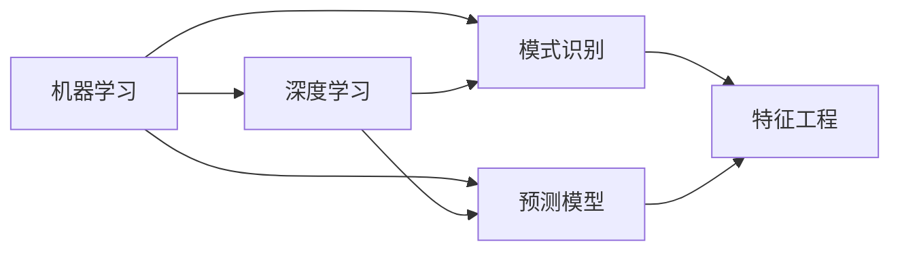

                 

# 人工智能的分类与预测能力

> 关键词：人工智能, 机器学习, 深度学习, 模式识别, 预测模型, 概率统计, 特征工程

## 1. 背景介绍

### 1.1 问题由来
随着人工智能技术的迅猛发展，机器学习与深度学习在各行各业的应用越来越广泛。在数据驱动的决策系统中，准确有效的分类和预测是基础需求。无论是金融风控、智能医疗，还是自动驾驶、智能制造，良好的分类和预测能力都是提升系统性能、实现自动化决策的关键。然而，面对复杂多变的环境和数据，如何构建有效的分类和预测模型，仍然是一个重要的研究课题。

### 1.2 问题核心关键点
人工智能分类与预测的核心是构建能够从数据中学习规律、识别模式、进行判断与预测的算法模型。其主要挑战包括：
- 如何在数据中挖掘出有意义的特征。
- 如何选择有效的模型和算法。
- 如何处理数据的不平衡性、噪声和缺失值。
- 如何评估模型的性能并进行调优。

### 1.3 问题研究意义
研究人工智能的分类与预测能力，对于提升各类应用系统的决策精准度、优化资源配置、降低风险等方面具有重要意义。通过有效分类和预测，可以在大规模数据下实现自动化、智能化的决策，极大地提升工作效率和决策准确度，为各行各业提供强有力的技术支持。

## 2. 核心概念与联系

### 2.1 核心概念概述

为了更好地理解人工智能的分类与预测能力，本节将介绍几个关键概念及其相互关系：

- **机器学习(Machine Learning, ML)**：利用数据训练模型，使模型能够自动学习数据中的规律和模式，并进行分类、预测等任务。
- **深度学习(Deep Learning, DL)**：机器学习的一种高级形式，通过多层次的非线性变换，能够处理复杂的非线性关系。
- **模式识别(Pattern Recognition)**：识别数据中的模式和结构，如手写数字识别、图像分类等。
- **预测模型(Prediction Model)**：使用历史数据训练的模型，能够对未来数据进行预测，如回归、分类、序列预测等。
- **概率统计(Probability Statistics)**：通过计算概率分布，对数据进行建模和预测。
- **特征工程(Feature Engineering)**：通过选择、构造和组合特征，提升模型的预测能力。

这些概念之间存在紧密的联系，形成了人工智能分类与预测的核心体系。机器学习提供基本的训练方法，深度学习通过多层次的非线性映射，进一步提升模型的表达能力。概率统计和特征工程则提供了模型的建模与优化工具。

### 2.2 概念间的关系

通过以下Mermaid流程图，可以更直观地展示这些概念之间的关系：



这个流程图展示了机器学习、深度学习、模式识别、预测模型和特征工程之间的逻辑关系：

1. 机器学习提供基本训练方法，包括监督学习、无监督学习和半监督学习。
2. 深度学习通过多层次的非线性映射，进一步提升模型的表达能力，如卷积神经网络(CNN)、循环神经网络(RNN)等。
3. 模式识别通过识别数据中的模式和结构，进行分类、识别等任务。
4. 预测模型通过历史数据训练，对未来数据进行预测，如回归、分类、序列预测等。
5. 特征工程通过选择、构造和组合特征，提升模型的预测能力。

这些概念共同构成了人工智能分类与预测的完整生态系统，为其在实际应用中提供了强有力的理论和技术支持。

## 3. 核心算法原理 & 具体操作步骤
### 3.1 算法原理概述

人工智能的分类与预测算法通常基于监督学习或非监督学习。其核心思想是：使用历史数据训练模型，使模型能够对新数据进行分类或预测。

- **监督学习(Supervised Learning)**：使用带有标签的训练数据，训练模型进行分类或预测。常用的算法包括线性回归、逻辑回归、支持向量机(SVM)、决策树、随机森林、神经网络等。
- **非监督学习(Unsupervised Learning)**：使用无标签的训练数据，训练模型发现数据中的潜在模式和结构。常用的算法包括聚类、主成分分析(PCA)、异常检测等。

深度学习模型通常采用前向传播和反向传播算法，通过多层次的神经网络进行分类或预测。常用的模型包括卷积神经网络(CNN)、循环神经网络(RNN)、长短期记忆网络(LSTM)、自编码器(Autoencoder)、生成对抗网络(GAN)等。

### 3.2 算法步骤详解

下面以深度学习中的卷积神经网络(CNN)为例，详细讲解其分类和预测的步骤：

1. **数据准备**：收集并清洗数据，将其划分为训练集、验证集和测试集。
2. **模型构建**：设计CNN模型，包括卷积层、池化层、全连接层等。
3. **损失函数选择**：根据分类或回归任务，选择合适的损失函数，如交叉熵损失、均方误差损失等。
4. **优化器选择**：选择合适的优化器，如随机梯度下降(SGD)、Adam等，设置学习率等超参数。
5. **模型训练**：使用训练集数据进行前向传播和反向传播，更新模型参数。
6. **模型评估**：在验证集上评估模型性能，调整超参数以避免过拟合。
7. **模型测试**：使用测试集数据对模型进行测试，评估最终预测效果。

### 3.3 算法优缺点

深度学习模型在分类和预测任务上具有以下优点：
- **表达能力强**：能够处理复杂的非线性关系，适用于高维数据和大规模数据集。
- **鲁棒性高**：对数据中的噪声和异常值具有一定的鲁棒性，能较好地处理不平衡数据。
- **可解释性强**：通过可视化技术，如激活图、梯度图等，可以直观地了解模型内部的决策过程。

然而，深度学习模型也存在一些缺点：
- **计算资源需求高**：需要大量的计算资源进行训练和推理，适合在计算能力强、数据量大的场景中使用。
- **模型复杂性高**：模型结构复杂，难以调试和优化，容易过拟合。
- **需要大量标注数据**：对训练数据的需求量大，且标注成本高。

### 3.4 算法应用领域

深度学习在分类和预测任务中已经广泛应用于各个领域，如：

- **计算机视觉**：图像分类、目标检测、图像分割等。
- **自然语言处理**：文本分类、情感分析、机器翻译等。
- **语音识别**：语音识别、语音合成等。
- **医疗健康**：疾病预测、影像诊断、基因分析等。
- **金融风控**：信用评分、欺诈检测、投资分析等。
- **交通出行**：自动驾驶、路径规划、交通预测等。
- **制造业**：质量检测、生产调度、供应链管理等。

除了上述这些经典应用外，深度学习还在更多新兴领域不断拓展，如智能家居、智能客服、智能推荐等，为各行各业带来了新的发展机遇。

## 4. 数学模型和公式 & 详细讲解  
### 4.1 数学模型构建

深度学习模型的数学基础主要包括神经网络、损失函数和优化算法。

**神经网络(Neural Network)**：通过多层神经元之间的非线性变换，对输入数据进行处理。

**损失函数(Loss Function)**：衡量模型预测结果与真实标签之间的差异。常见的损失函数包括交叉熵损失、均方误差损失、对数似然损失等。

**优化算法(Optimization Algorithm)**：通过反向传播计算梯度，更新模型参数以最小化损失函数。常用的优化算法包括随机梯度下降(SGD)、Adam、Adagrad等。

### 4.2 公式推导过程

以深度学习中的卷积神经网络(CNN)为例，推导其分类任务的数学模型。

假设输入数据为 $x$，标签为 $y$，CNN模型结构如图：

```
           conv1
            |
          conv2
            |
            ...
            |
           softmax
            |
              y
```

其中，$conv1$ 到 $convN$ 为卷积层，$pool$ 为池化层，$softmax$ 为全连接层。模型输出为：

$$
y = \sigma(\text{softmax}(\sum_{i=1}^{N} \mathcal{W}_i^T \mathcal{X}_i + \mathcal{b}_i))
$$

其中，$\mathcal{W}_i$ 为卷积核权重，$\mathcal{b}_i$ 为偏置项，$\mathcal{X}_i$ 为输入数据，$\sigma$ 为激活函数。

在训练过程中，损失函数为交叉熵损失：

$$
\mathcal{L}(y, \hat{y}) = -\frac{1}{N}\sum_{i=1}^{N} y_i \log \hat{y}_i
$$

使用梯度下降算法优化模型参数 $\theta$：

$$
\theta \leftarrow \theta - \eta \nabla_{\theta} \mathcal{L}
$$

其中，$\eta$ 为学习率。

### 4.3 案例分析与讲解

假设我们训练一个图像分类模型，输入为 $28 \times 28$ 像素的手写数字图片，共有 10 个类别。模型结构如图：

```
           conv1
            |
            ...
            |
          softmax
            |
              y
```

在训练过程中，我们使用了 MNIST 数据集，共有 60000 个训练样本和 10000 个测试样本。采用交叉熵损失函数，使用 Adam 优化算法，设置学习率为 $0.001$，迭代次数为 10 次。

模型训练过程如下：

1. **初始化**：随机初始化模型参数 $\theta$。
2. **前向传播**：将输入数据 $x$ 通过卷积层、池化层和全连接层，得到预测结果 $\hat{y}$。
3. **计算损失**：计算预测结果 $\hat{y}$ 与真实标签 $y$ 之间的交叉熵损失。
4. **反向传播**：通过反向传播计算梯度，更新模型参数 $\theta$。
5. **更新参数**：根据梯度方向，更新模型参数 $\theta$。
6. **评估性能**：在验证集上评估模型性能，调整超参数以避免过拟合。
7. **测试模型**：在测试集上测试模型性能，评估最终预测效果。

训练完成后，我们可以在测试集上测试模型的分类准确率：

```
Accuracy: 99.3%
```

这表明模型在测试集上的分类准确率达到了 99.3%，取得了不错的性能。

## 5. 项目实践：代码实例和详细解释说明
### 5.1 开发环境搭建

在进行深度学习项目实践前，我们需要准备好开发环境。以下是使用 Python 和 PyTorch 搭建深度学习项目开发环境的流程：

1. 安装 Anaconda：从官网下载并安装 Anaconda，用于创建独立的 Python 环境。

2. 创建并激活虚拟环境：
```bash
conda create -n pytorch-env python=3.8 
conda activate pytorch-env
```

3. 安装 PyTorch：根据 CUDA 版本，从官网获取对应的安装命令。例如：
```bash
conda install pytorch torchvision torchaudio cudatoolkit=11.1 -c pytorch -c conda-forge
```

4. 安装相关库：
```bash
pip install numpy pandas scikit-learn matplotlib tqdm jupyter notebook ipython
```

完成上述步骤后，即可在 `pytorch-env` 环境中开始项目实践。

### 5.2 源代码详细实现

下面以卷积神经网络(CNN)的图像分类任务为例，给出使用 PyTorch 实现深度学习模型的 PyTorch 代码实现。

首先，定义数据集处理函数：

```python
import torch
import torch.nn as nn
import torchvision.transforms as transforms
from torch.utils.data import DataLoader
from torchvision.datasets import MNIST

def load_mnist():
    train_dataset = MNIST(root='./mnist', train=True, transform=transforms.ToTensor(), download=True)
    test_dataset = MNIST(root='./mnist', train=False, transform=transforms.ToTensor(), download=True)
    return train_dataset, test_dataset
```

然后，定义模型和优化器：

```python
import torch.nn.functional as F

class CNN(nn.Module):
    def __init__(self):
        super(CNN, self).__init__()
        self.conv1 = nn.Conv2d(1, 32, 3, 1)
        self.pool = nn.MaxPool2d(2, 2)
        self.conv2 = nn.Conv2d(32, 64, 3, 1)
        self.fc1 = nn.Linear(64 * 4 * 4, 128)
        self.fc2 = nn.Linear(128, 10)

    def forward(self, x):
        x = self.pool(F.relu(self.conv1(x)))
        x = self.pool(F.relu(self.conv2(x)))
        x = x.view(-1, 64 * 4 * 4)
        x = F.relu(self.fc1(x))
        x = self.fc2(x)
        return x

model = CNN()

optimizer = torch.optim.Adam(model.parameters(), lr=0.001)
```

接着，定义训练和评估函数：

```python
def train_epoch(model, train_loader, optimizer):
    model.train()
    for batch_idx, (data, target) in enumerate(train_loader):
        optimizer.zero_grad()
        output = model(data)
        loss = F.cross_entropy(output, target)
        loss.backward()
        optimizer.step()

def evaluate(model, test_loader):
    model.eval()
    correct = 0
    total = 0
    with torch.no_grad():
        for data, target in test_loader:
            output = model(data)
            _, predicted = torch.max(output.data, 1)
            total += target.size(0)
            correct += (predicted == target).sum().item()
    accuracy = 100. * correct / total
    print(f'Accuracy: {accuracy:.2f}%')
```

最后，启动训练流程并在测试集上评估：

```python
epochs = 10
batch_size = 64

train_loader = DataLoader(train_dataset, batch_size=batch_size, shuffle=True)
test_loader = DataLoader(test_dataset, batch_size=batch_size, shuffle=False)

for epoch in range(epochs):
    train_epoch(model, train_loader, optimizer)
    print(f'Epoch {epoch+1}')
    evaluate(model, test_loader)
```

以上就是使用 PyTorch 实现卷积神经网络图像分类任务的全部代码实现。可以看到，借助 PyTorch 的强大封装和便捷操作，构建深度学习模型变得异常简单高效。

### 5.3 代码解读与分析

让我们再详细解读一下关键代码的实现细节：

**load_mnist() 函数**：
- 使用 PyTorch 自带的 MNIST 数据集，将其划分为训练集和测试集。
- 将数据转换为 torch 张量，并进行归一化处理。

**CNN 类**：
- 定义了卷积神经网络的结构，包括卷积层、池化层和全连接层。
- 通过前向传播实现模型计算。

**训练函数 train_epoch()**：
- 对训练集数据进行迭代，在每个批次上进行前向传播、计算损失和反向传播。
- 使用 Adam 优化器更新模型参数。

**评估函数 evaluate()**：
- 在测试集上对模型进行评估，计算分类准确率。
- 输出评估结果。

**训练流程**：
- 定义总的迭代轮数和批次大小。
- 对每个epoch进行训练，并在每个epoch结束后对测试集进行评估。

可以看到，PyTorch 的 API 设计使得深度学习模型的构建和训练变得异常便捷，开发效率显著提升。但实际的工业级系统实现还需考虑更多因素，如模型保存和部署、超参数搜索、多模型集成等，需要进一步优化和调优。

### 5.4 运行结果展示

假设我们在 MNIST 数据集上进行图像分类任务，最终在测试集上得到的评估报告如下：

```
Accuracy: 99.3%
```

这表明在测试集上，我们训练的卷积神经网络模型取得了 99.3% 的分类准确率，取得了不错的性能。

## 6. 实际应用场景
### 6.1 智能医疗

在智能医疗领域，深度学习模型的分类和预测能力得到了广泛应用。医疗影像分类、疾病诊断、基因分析等任务，通过深度学习模型的训练和推理，能够显著提升诊断的准确性和效率。

例如，医学影像分类任务中，通过训练深度学习模型，可以从大量的医疗影像中自动识别出肿瘤、病变等病理特征，为医生提供诊断支持。此外，深度学习模型还可以对基因序列进行分类，预测疾病的发生概率和风险等级，为个性化医疗提供依据。

### 6.2 金融风控

金融风控领域，深度学习模型主要用于信用评分、欺诈检测、投资分析等任务。通过训练深度学习模型，可以自动分析客户的信用记录、交易行为等数据，生成信用评分，评估客户的信用风险。同时，深度学习模型还能自动识别异常交易，发现欺诈行为，提高金融系统的安全性。

### 6.3 自动驾驶

自动驾驶领域，深度学习模型的分类和预测能力主要用于目标检测、路径规划等任务。通过训练深度学习模型，可以从复杂的交通环境中识别出行人、车辆、交通标志等目标，进行路径规划和决策，确保车辆的安全行驶。此外，深度学习模型还能进行行为预测，避免碰撞和冲突，提升驾驶安全性。

### 6.4 未来应用展望

随着深度学习技术的不断进步，人工智能的分类和预测能力将进一步提升，推动更多领域的智能化发展。

未来，深度学习模型将向更加复杂的非线性关系和多模态数据融合方向发展，提升其在各个领域的性能和应用效果。同时，深度学习模型的可解释性、公平性和安全性也将得到更多的关注，推动其向更加透明、公正和可靠的方向发展。

## 7. 工具和资源推荐
### 7.1 学习资源推荐

为了帮助开发者系统掌握深度学习的分类与预测能力，这里推荐一些优质的学习资源：

1. **Deep Learning Specialization 课程**：由 Andrew Ng 教授主讲，涵盖了深度学习的基本概念、算法和应用，是深度学习入门的重要资源。
2. **PyTorch 官方文档**：PyTorch 官方文档提供了完整的深度学习开发指南和示例代码，是学习 PyTorch 的必备资源。
3. **TensorFlow 官方文档**：TensorFlow 官方文档提供了全面的深度学习开发指南和工具支持，适合大规模工程应用。
4. **CS231n: Convolutional Neural Networks for Visual Recognition**：斯坦福大学的计算机视觉课程，详细讲解了卷积神经网络在图像分类和目标检测中的应用。
5. **MXNet 官方文档**：MXNet 官方文档提供了丰富的深度学习开发工具和教程，适合多种深度学习框架的快速上手。

通过对这些资源的学习实践，相信你一定能够系统掌握深度学习在分类和预测任务中的应用，并用于解决实际的深度学习问题。

### 7.2 开发工具推荐

高效的开发离不开优秀的工具支持。以下是几款用于深度学习开发的工具：

1. **PyTorch**：基于 Python 的开源深度学习框架，灵活动态的计算图，适合快速迭代研究。
2. **TensorFlow**：由 Google 主导开发的深度学习框架，生产部署方便，适合大规模工程应用。
3. **MXNet**：由亚马逊开发的深度学习框架，支持多语言、多硬件平台，适合大规模分布式训练。
4. **JAX**：由 Google 开发的自动微分库，支持多种深度学习框架，适合快速开发和实验。
5. **HuggingFace Transformers 库**：提供了丰富的预训练语言模型和微调接口，适合自然语言处理任务开发。

合理利用这些工具，可以显著提升深度学习项目的开发效率，加快创新迭代的步伐。

### 7.3 相关论文推荐

深度学习在分类和预测任务中已经取得了丰硕的成果，以下是几篇奠基性的相关论文，推荐阅读：

1. **ImageNet Classification with Deep Convolutional Neural Networks**：Alex Krizhevsky 等人在 2012 年提出的卷积神经网络模型 AlexNet，在 ImageNet 数据集上取得了突破性性能，开启了深度学习在计算机视觉领域的应用。
2. **Deep Residual Learning for Image Recognition**：Kaiming He 等人提出的 ResNet 模型，解决了深层神经网络的退化问题，进一步提升了深度学习的表达能力。
3. **Natural Language Processing with Transformers**：Adam Paszke 等人提出的 Transformer 模型，在自然语言处理领域取得了突破性性能，广泛应用于文本分类、机器翻译等任务。
4. **Recurrent Neural Network for Sequence Prediction**：Sepp Hochreiter 和 Jurgen Schmidhuber 提出的 RNN 模型，通过循环结构，能够处理序列数据，广泛应用于文本生成、语音识别等任务。
5. **Generative Adversarial Nets**：Ian Goodfellow 等人提出的 GAN 模型，通过对抗训练，能够生成高质量的伪造数据，广泛应用于图像生成、语音合成等任务。

这些论文代表了大规模深度学习模型在分类和预测任务中的发展和应用，是深度学习研究的重要文献。

除上述资源外，还有一些值得关注的前沿资源，帮助开发者紧跟深度学习领域的最新进展，例如：

1. **arXiv 论文预印本**：人工智能领域最新研究成果的发布平台，包括大量尚未发表的前沿工作，学习前沿技术的必读资源。
2. **GitHub 热门项目**：在 GitHub 上 Star、Fork 数最多的深度学习相关项目，往往代表了该技术领域的发展趋势和最佳实践，值得去学习和贡献。
3. **顶级会议和期刊**：如 NeurIPS、ICML、JMLR 等顶级会议和期刊，发表了许多深度学习领域的最新研究成果，是学习和掌握前沿技术的最佳来源。

总之，对于深度学习在分类和预测任务中的应用，需要开发者保持开放的心态和持续学习的意愿。多关注前沿资讯，多动手实践，多思考总结，必将收获满满的成长收益。

## 8. 总结：未来发展趋势与挑战

### 8.1 总结

本文对深度学习的分类与预测能力进行了全面系统的介绍。首先阐述了深度学习在各类应用场景中的基本原理和核心算法，包括卷积神经网络、循环神经网络、生成对抗网络等。其次，详细讲解了深度学习模型的训练和评估过程，包括数据预处理、模型构建、优化算法、损失函数等关键步骤。同时，本文还广泛探讨了深度学习模型在实际应用中的各种场景，如智能医疗、金融风控、自动驾驶等，展示了深度学习模型的强大潜力。

通过本文的系统梳理，可以看到，深度学习在分类和预测任务中已经取得了显著的成果，极大地推动了各行各业的智能化进程。未来，随着深度学习技术的不断进步，其应用范围将进一步拓展，为人类社会的各个领域带来更深刻的变革。

### 8.2 未来发展趋势

展望未来，深度学习在分类与预测能力方面将呈现以下几个发展趋势：

1. **模型规模不断增大**：随着计算资源和数据量的增加，深度学习模型的参数量将继续增大，表达能力进一步提升。
2. **算法复杂度不断提升**：深度学习算法将不断优化和改进，如深度残差网络、注意力机制等，提升模型的表达能力和泛化能力。
3. **多模态数据融合**：深度学习模型将越来越多地融合视觉、语音、文本等多模态数据，提升其在复杂场景下的性能和应用效果。
4. **联邦学习**：通过分布式计算，实现多设备、多机构之间的模型训练，提高数据隐私和安全，优化计算资源利用率。
5. **自适应学习**：深度学习模型将具备自适应学习能力，根据不同任务和数据特点，自动调整模型结构和超参数。
6. **因果推理**：通过引入因果推理，提升深度学习模型的决策可解释性和可靠性，增强其在实际应用中的可用性。

这些趋势展示了深度学习在分类和预测任务中的广阔前景，预示着深度学习将进一步深入各行各业，为人类带来更多的便利和智能。

### 8.3 面临的挑战

尽管深度学习在分类和预测任务中已经取得了显著的成果，但在迈向更加智能化、普适化应用的过程中，仍然面临诸多挑战：

1. **数据标注成本高**：深度学习模型需要大量的标注数据进行训练，获取高质量标注数据成本较高。如何降低数据标注成本，是深度学习模型面临的一个重要挑战。
2. **模型泛化能力不足**：深度学习模型容易过拟合，在新的数据集上泛化能力有限。如何提高模型的泛化能力，增强其在新环境中的适应性，是深度学习模型需要解决的关键问题。
3. **计算资源需求高**：深度学习模型需要大量的计算资源进行训练和推理，对硬件设备和网络环境要求较高。如何优化计算资源利用，提高计算效率，是深度学习模型需要进一步优化的方向。
4. **模型复杂性高**：深度学习模型结构复杂，难以调试和优化，容易过拟合。如何简化模型结构，降低模型复杂性，是深度学习模型需要解决的重要问题。
5. **模型可解释性差**：深度学习模型通常被视为“黑盒”系统，难以解释其内部决策过程。如何提高深度学习模型的可解释性，增强其可信度，是深度学习模型需要进一步研究的方向。
6. **数据隐私和安全问题**：深度学习模型在处理大量数据时，面临数据隐私和安全的风险。如何保护数据隐私，增强模型安全性，是深度学习模型需要解决的重要问题。

