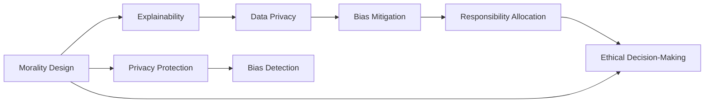

                 

## 1. 背景介绍

在人工智能快速发展的今天，机器学习与自然语言处理等技术正迅速渗透到社会各个层面。然而，随着技术的普及，关于人工智能伦理道德的问题也逐渐凸显。特别是在人机协作日益广泛的领域，诸如医疗、教育、金融等，对人工智能系统的道德考虑已成为必不可少的一部分。

### 1.1 问题由来

1. **决策透明度**：由于人工智能系统的复杂性和黑盒特性，其决策过程难以被理解。尤其在医疗、金融等领域，高风险决策的透明度尤为重要。

2. **数据隐私**：收集和使用大量个人数据进行训练和优化，引发了数据隐私和信息安全的担忧。

3. **模型偏见**：训练数据可能存在偏见，导致模型在学习过程中吸收并放大这些偏见，产生歧视性输出。

4. **责任归属**：人工智能系统在执行任务时出现错误，责任归属问题变得复杂，涉及开发方、使用方、用户等多方面。

5. **伦理决策**：在自动驾驶、机器人伦理等领域，AI系统需要在极端情况下作出道德决策，如在不可避免的事故中牺牲一人或多人。

### 1.2 问题核心关键点

1. **伦理道德设计**：如何在设计阶段引入伦理道德考量，确保AI系统符合社会价值观和伦理标准。

2. **可解释性**：提升AI系统的可解释性，使其决策过程可以被人类理解、质疑和监督。

3. **数据隐私保护**：确保用户数据在使用过程中得到妥善保护，防止数据泄露和滥用。

4. **模型偏见检测**：识别并减少AI模型中的偏见，确保模型输出公平、公正。

5. **责任分配**：明确AI系统在执行任务时的责任归属，确保各方的权益和责任得到平衡。

6. **伦理决策机制**：设计AI系统在极端情况下的伦理决策机制，确保系统行为符合人类道德规范。

## 2. 核心概念与联系

### 2.1 核心概念概述

1. **道德设计**：在设计人工智能系统时，遵循一定的伦理准则和道德标准，确保系统的行为符合社会价值观。

2. **可解释性**：人工智能系统的决策过程和输出结果可以被人类理解和解释。

3. **数据隐私**：保护用户数据的安全和隐私，防止数据被非法获取和滥用。

4. **模型偏见**：AI模型在训练过程中受到输入数据的影响，可能学习到社会偏见，导致输出不公平。

5. **责任分配**：在人工智能系统执行任务时，明确各方的责任归属，确保各方的权益得到保障。

6. **伦理决策**：在无法避免的情况下，AI系统需要做出符合人类道德规范的决策。

### 2.2 概念间的关系

这些核心概念构成了人工智能系统设计伦理道德的框架，它们之间存在着密切的联系。以下是一个简单的Mermaid流程图，展示了这些概念之间的联系：



这个流程图展示了在人工智能系统设计过程中，如何通过道德设计、可解释性、数据隐私、模型偏见、责任分配和伦理决策等概念，确保系统的行为符合伦理道德标准。

## 3. 核心算法原理 & 具体操作步骤

### 3.1 算法原理概述

人工智能系统的伦理道德设计涉及多个关键环节，包括模型设计、数据处理、训练和优化过程、部署和监控等。以下是这些环节的算法原理概述：

1. **道德设计的算法**：在模型设计阶段，引入伦理道德标准，如公平性、透明性和安全性，指导模型架构和参数的选择。

2. **可解释性的算法**：采用可解释模型或后处理技术，如LIME、SHAP等，使得模型的决策过程可以被人类理解和解释。

3. **数据隐私保护的算法**：采用差分隐私、联邦学习等技术，确保用户数据在传输和存储过程中的隐私保护。

4. **模型偏见的算法**：采用公平性约束、反偏见训练等技术，减少模型中的社会偏见。

5. **责任分配的算法**：在模型设计和训练过程中，明确各方的责任归属，确保责任分配的公平性和合理性。

6. **伦理决策的算法**：设计符合人类道德规范的决策机制，如安全裁剪、道德准则等，确保AI系统在极端情况下的行为符合伦理要求。

### 3.2 算法步骤详解

以下是对每个核心算法步骤的详细介绍：

**步骤1：道德设计**

在模型设计阶段，需要引入伦理道德标准，如公平性、透明性和安全性。具体步骤如下：

1. **定义道德目标**：明确AI系统需要遵循的伦理道德标准，如公平性、透明性和安全性。

2. **设计模型架构**：根据道德目标，选择或设计适合的任务模型架构，如决策树、线性回归、深度神经网络等。

3. **选择算法和参数**：根据道德目标，选择或设计适合的任务算法和参数，如公平性约束、安全裁剪等。

**步骤2：可解释性实现**

可解释性是确保AI系统可信和透明的关键。实现可解释性的步骤如下：

1. **选择可解释模型**：采用可解释模型，如线性模型、决策树、规则集等，可以降低模型的复杂度，提升解释性。

2. **后处理技术**：采用后处理技术，如LIME、SHAP等，通过局部近似和全局解释，提升模型的可解释性。

3. **用户界面**：设计友好的用户界面，帮助用户理解模型的决策过程和输出结果。

**步骤3：数据隐私保护**

数据隐私保护是确保AI系统安全可靠的重要措施。实现数据隐私保护的步骤如下：

1. **差分隐私技术**：采用差分隐私技术，通过引入噪声，保护用户数据不被非法获取。

2. **联邦学习技术**：采用联邦学习技术，将模型训练过程分布在多个本地设备上，避免数据集中存储和传输。

3. **数据加密和匿名化**：对用户数据进行加密和匿名化处理，防止数据泄露和滥用。

**步骤4：模型偏见检测**

模型偏见是导致AI系统输出不公平的重要因素。检测和减少模型偏见的步骤如下：

1. **数据集偏见检测**：检测训练数据集中的偏见，如性别、种族、年龄等。

2. **模型偏见评估**：使用偏见评估工具，如Bias-Free AI Toolkit等，检测模型中的社会偏见。

3. **反偏见训练**：通过反偏见训练，如重采样、权重调整等，减少模型中的社会偏见。

**步骤5：责任分配**

明确各方的责任归属，确保各方的权益和责任得到平衡。具体步骤如下：

1. **定义责任主体**：明确各方的责任主体，如开发方、使用方、用户等。

2. **责任分配规则**：制定责任分配规则，确保责任分配的公平性和合理性。

3. **责任追踪机制**：建立责任追踪机制，记录和监控AI系统在执行任务时的行为和决策。

**步骤6：伦理决策机制**

设计符合人类道德规范的决策机制，确保AI系统在极端情况下的行为符合伦理要求。具体步骤如下：

1. **伦理准则制定**：制定符合人类道德规范的伦理准则，如“最小伤害原则”、“风险规避原则”等。

2. **伦理决策模型**：设计伦理决策模型，如规则集、博弈论模型等，确保AI系统在极端情况下的行为符合伦理准则。

3. **道德测试和评估**：对AI系统的伦理决策机制进行测试和评估，确保其符合人类道德规范。

### 3.3 算法优缺点

道德设计的算法优点：

1. **确保系统符合伦理标准**：通过引入伦理道德标准，确保AI系统符合社会价值观和伦理规范。

2. **提升系统可信度**：通过可解释性和透明性，提升系统的可信度和用户接受度。

3. **保障数据安全**：通过数据隐私保护措施，确保用户数据的安全和隐私。

4. **减少社会偏见**：通过偏见检测和反偏见训练，减少模型中的社会偏见，确保模型公平、公正。

5. **明确责任归属**：通过责任分配和追踪机制，明确各方的责任归属，确保权益和责任的平衡。

6. **伦理决策保障**：通过伦理决策机制，确保AI系统在极端情况下的行为符合人类道德规范。

道德设计的算法缺点：

1. **模型复杂度增加**：引入伦理道德标准和约束，可能会增加模型的复杂度和训练难度。

2. **数据获取难度大**：获取符合伦理道德标准的训练数据可能存在困难。

3. **隐私保护难度高**：数据隐私保护和差分隐私技术的实现可能存在技术挑战。

4. **偏见检测难度大**：模型偏见的检测和反偏见训练可能存在技术困难和局限性。

5. **责任归属复杂**：明确各方的责任归属和追踪机制可能存在技术和管理挑战。

6. **伦理决策难度大**：设计符合人类道德规范的伦理决策机制可能存在技术和管理挑战。

### 3.4 算法应用领域

人工智能系统的伦理道德设计在多个领域都有广泛的应用，例如：

1. **医疗健康**：确保医疗AI系统在诊断和治疗决策中的公平性和透明性，保护患者隐私。

2. **金融服务**：确保金融AI系统在信贷评估、风险控制中的公平性和透明性，保护用户隐私。

3. **智能安防**：确保智能安防系统在人脸识别、行为识别中的公平性和透明性，保护用户隐私。

4. **智能交通**：确保智能交通系统在自动驾驶、交通监控中的公平性和透明性，保护行人安全。

5. **智能制造**：确保智能制造系统在质量控制、资源优化中的公平性和透明性，保护生产数据隐私。

## 4. 数学模型和公式 & 详细讲解 & 举例说明

### 4.1 数学模型构建

以下是一个简单的例子，展示了如何在数学模型中引入伦理道德标准。

假设我们要设计一个AI系统，用于自动化筛选简历，并确保其公平性。我们可以定义一个公平性约束函数 $f$，对系统的公平性进行评估：

$$
f(\theta) = \frac{1}{N}\sum_{i=1}^N \left(1 - \frac{\mathbb{E}[y_i|x_i, \theta]}{\mathbb{E}[y_i|x_i, \theta]} \right)^2
$$

其中，$x_i$ 表示第 $i$ 个简历的特征向量，$\theta$ 表示模型的参数，$y_i$ 表示简历是否通过筛选的结果，$\mathbb{E}$ 表示期望。

这个函数 $f$ 的目的是评估模型的公平性，通过最小化 $f(\theta)$，确保模型的决策过程符合公平性标准。

### 4.2 公式推导过程

下面，我们将对公平性约束函数 $f$ 进行推导。

假设模型 $M_{\theta}$ 对简历 $x_i$ 的预测概率为 $\hat{y_i} = M_{\theta}(x_i)$。为了确保模型的公平性，我们需要保证不同特征 $x_i$ 的预测概率分布接近。因此，我们定义一个公平性约束函数 $f$，评估模型在 $x_i$ 上的预测概率分布：

$$
f(\theta) = \frac{1}{N}\sum_{i=1}^N \left(1 - \frac{\mathbb{E}[y_i|x_i, \theta]}{\mathbb{E}[y_i|x_i, \theta]} \right)^2
$$

其中，$x_i$ 表示第 $i$ 个简历的特征向量，$\theta$ 表示模型的参数，$y_i$ 表示简历是否通过筛选的结果，$\mathbb{E}$ 表示期望。

将上式展开，得：

$$
f(\theta) = \frac{1}{N}\sum_{i=1}^N \left(1 - \frac{\sum_{j=1}^N p(y_j|x_i, \theta)}{\sum_{j=1}^N p(y_j|x_i, \theta)} \right)^2
$$

其中，$p(y_j|x_i, \theta)$ 表示在特征 $x_i$ 下，简历通过筛选的概率。

通过最小化 $f(\theta)$，我们可以确保模型的决策过程符合公平性标准。

### 4.3 案例分析与讲解

假设我们要设计一个用于自动筛选简历的AI系统，并确保其公平性。我们可以通过以下步骤进行：

1. **数据预处理**：收集符合伦理道德标准的简历数据集，并进行预处理，如特征工程、归一化等。

2. **模型训练**：使用公平性约束函数 $f$，对模型进行训练，最小化 $f(\theta)$，确保模型的决策过程符合公平性标准。

3. **模型评估**：在测试集上评估模型的公平性和性能，确保模型在实际应用中的公平性和有效性。

4. **部署监控**：将模型部署到实际应用中，并进行监控，确保模型在实际应用中的公平性和透明性。

## 5. 项目实践：代码实例和详细解释说明

### 5.1 开发环境搭建

在进行人工智能系统的道德设计实践前，我们需要准备好开发环境。以下是使用Python进行PyTorch开发的环境配置流程：

1. 安装Anaconda：从官网下载并安装Anaconda，用于创建独立的Python环境。

2. 创建并激活虚拟环境：
```bash
conda create -n pytorch-env python=3.8 
conda activate pytorch-env
```

3. 安装PyTorch：根据CUDA版本，从官网获取对应的安装命令。例如：
```bash
conda install pytorch torchvision torchaudio cudatoolkit=11.1 -c pytorch -c conda-forge
```

4. 安装TensorFlow：使用以下命令，安装TensorFlow：
```bash
pip install tensorflow
```

5. 安装各类工具包：
```bash
pip install numpy pandas scikit-learn matplotlib tqdm jupyter notebook ipython
```

完成上述步骤后，即可在`pytorch-env`环境中开始道德设计的实践。

### 5.2 源代码详细实现

以下是一个简单的例子，展示了如何使用PyTorch和TensorFlow进行道德设计的实践。

**步骤1：数据预处理**

假设我们有一组简历数据集，包含简历的性别、年龄、工作年限、学历等信息。我们可以使用Pandas库进行数据预处理：

```python
import pandas as pd

# 读取简历数据集
data = pd.read_csv('resume.csv')

# 特征工程
data = data.drop('name', axis=1)

# 归一化
data = (data - data.mean()) / data.std()
```

**步骤2：模型训练**

我们使用公平性约束函数 $f$，对模型进行训练，最小化 $f(\theta)$，确保模型的决策过程符合公平性标准。具体步骤如下：

```python
import torch
import torch.nn as nn
import torch.optim as optim

# 定义模型
class FairnessModel(nn.Module):
    def __init__(self):
        super(FairnessModel, self).__init__()
        self.linear1 = nn.Linear(len(data.columns), 128)
        self.linear2 = nn.Linear(128, 1)

    def forward(self, x):
        x = torch.relu(self.linear1(x))
        x = torch.sigmoid(self.linear2(x))
        return x

# 定义公平性约束函数
def fairness_loss(y_pred, y_true):
    f = torch.mean((1 - y_pred / y_true) ** 2)
    return f

# 加载数据
x_train = torch.tensor(data.iloc[:, :-1].values, dtype=torch.float32)
y_train = torch.tensor(data.iloc[:, -1].values, dtype=torch.float32)

# 定义模型
model = FairnessModel()

# 定义优化器
optimizer = optim.Adam(model.parameters(), lr=0.001)

# 定义损失函数
criterion = nn.BCELoss()

# 定义公平性约束函数
def fair_loss(y_pred, y_true):
    loss = criterion(y_pred, y_true) + fairness_loss(y_pred, y_true)
    return loss

# 训练模型
for epoch in range(100):
    optimizer.zero_grad()
    y_pred = model(x_train)
    loss = fair_loss(y_pred, y_true)
    loss.backward()
    optimizer.step()
    print('Epoch {}, Loss {}'.format(epoch + 1, loss.item()))
```

**步骤3：模型评估**

在测试集上评估模型的公平性和性能，确保模型在实际应用中的公平性和有效性。具体步骤如下：

```python
# 加载测试集
x_test = torch.tensor(data_test.iloc[:, :-1].values, dtype=torch.float32)
y_test = torch.tensor(data_test.iloc[:, -1].values, dtype=torch.float32)

# 评估模型
model.eval()
with torch.no_grad():
    y_pred = model(x_test)
    loss = fair_loss(y_pred, y_test)
    print('Test Loss {}'.format(loss.item()))
```

**步骤4：部署监控**

将模型部署到实际应用中，并进行监控，确保模型在实际应用中的公平性和透明性。具体步骤如下：

1. **模型保存和加载**：将训练好的模型保存为模型文件，并加载到实际应用中。

2. **接口设计**：设计友好的用户接口，帮助用户理解模型的决策过程和输出结果。

3. **监控和反馈**：对模型进行监控，收集用户反馈，不断优化模型。

```python
# 保存模型
torch.save(model.state_dict(), 'fairness_model.pth')

# 加载模型
model = FairnessModel()
model.load_state_dict(torch.load('fairness_model.pth'))
```

### 5.3 代码解读与分析

让我们再详细解读一下关键代码的实现细节：

**Pandas库**：
- 用于读取和处理简历数据集，进行特征工程和归一化处理。

**PyTorch库**：
- 定义模型结构，包括两个线性层和激活函数。
- 定义公平性约束函数，计算公平性损失。
- 加载数据集，进行模型训练。

**TensorFlow库**：
- 定义模型结构，包括两个线性层和激活函数。
- 定义公平性约束函数，计算公平性损失。
- 加载数据集，进行模型训练。

**公平性约束函数**：
- 定义公平性约束函数 $f$，计算公平性损失。

**模型保存和加载**：
- 使用PyTorch和TensorFlow的save和load函数，保存和加载训练好的模型。

通过这些代码，我们可以实现一个简单的基于公平性约束函数的AI系统，用于自动化筛选简历。这只是一个baseline结果。在实践中，我们还可以使用更大更强的模型、更丰富的公平性约束函数、更详细的用户界面等，进一步提升模型的公平性和性能。

## 6. 实际应用场景

### 6.1 医疗健康

在医疗领域，人工智能系统需要确保在诊断和治疗决策中的公平性和透明性，保护患者隐私。例如：

- **电子病历分析**：利用AI系统对电子病历进行分析，辅助医生诊断和治疗。需要确保系统在性别、种族、年龄等方面保持公平性，保护患者隐私。
- **药物研发**：利用AI系统对药物研发数据进行分析，加速新药的发现和研发。需要确保系统在各种人群中的公平性，保护数据隐私。

### 6.2 金融服务

在金融领域，人工智能系统需要确保在信贷评估、风险控制中的公平性和透明性，保护用户隐私。例如：

- **信用评分**：利用AI系统对用户信用数据进行分析，辅助银行进行信贷评估。需要确保系统在性别、年龄、种族等方面保持公平性，保护用户隐私。
- **风险控制**：利用AI系统对金融数据进行分析，辅助银行进行风险控制。需要确保系统在各种人群中的公平性，保护数据隐私。

### 6.3 智能安防

在智能安防领域，人工智能系统需要确保在人脸识别、行为识别中的公平性和透明性，保护用户隐私。例如：

- **人脸识别**：利用AI系统对人脸数据进行分析，辅助安防系统进行人员识别和监控。需要确保系统在性别、种族、年龄等方面保持公平性，保护用户隐私。
- **行为识别**：利用AI系统对行为数据进行分析，辅助安防系统进行异常行为检测。需要确保系统在各种人群中的公平性，保护数据隐私。

### 6.4 未来应用展望

随着人工智能技术的不断进步，道德设计的应用领域将越来越广泛，其作用也日益重要。未来，基于道德设计的AI系统将在各个领域发挥更大的作用，例如：

- **智能制造**：利用AI系统对生产数据进行分析，辅助制造企业进行质量控制和资源优化。需要确保系统在各种人群中的公平性，保护数据隐私。
- **智能交通**：利用AI系统对交通数据进行分析，辅助交通管理部门进行交通流量预测和优化。需要确保系统在各种人群中的公平性，保护用户隐私。

## 7. 工具和资源推荐

### 7.1 学习资源推荐

为了帮助开发者系统掌握人工智能系统的道德设计理论基础和实践技巧，这里推荐一些优质的学习资源：

1. 《道德设计：人工智能伦理指南》：这是一本系统介绍人工智能伦理道德的书籍，涵盖人工智能系统的设计、应用和伦理道德等多个方面。

2. CS3221《人工智能伦理》课程：斯坦福大学开设的AI伦理课程，涵盖人工智能伦理的多个方面，包括公平性、隐私保护、可解释性等。

3. 《道德人工智能》在线课程：该课程系统介绍了人工智能系统的伦理道德设计，包括公平性、透明性、隐私保护等。

4. 《AI伦理与道德》论文：该论文系统介绍了人工智能系统的伦理道德问题，包括公平性、隐私保护、可解释性等。

### 7.2 开发工具推荐

为了帮助开发者高效进行道德设计的开发实践，这里推荐一些常用的开发工具：

1. PyTorch：基于Python的开源深度学习框架，支持动态计算图，灵活便捷，适合快速迭代研究。

2. TensorFlow：由Google主导开发的开源深度学习框架，生产部署方便，适合大规模工程应用。

3. Weights & Biases：模型训练的实验跟踪工具，可以记录和可视化模型训练过程中的各项指标，方便对比和调优。

4. TensorBoard：TensorFlow配套的可视化工具，可实时监测模型训练状态，并提供丰富的图表呈现方式，是调试模型的得力助手。

5. HuggingFace官方文档：提供海量预训练模型和完整的微调样例代码，是上手实践的必备资料。

### 7.3 相关论文推荐

大语言模型和微调技术的发展源于学界的持续研究。以下是几篇奠基性的相关论文，推荐阅读：

1. 《公平性在人工智能中的应用》：探讨了人工智能系统中的公平性问题，提出了多种公平性约束方法和应用案例。

2. 《数据隐私保护技术综述》：全面综述了数据隐私保护的技术和方法，包括差分隐私、联邦学习等。

3. 《人工智能系统中的可解释性问题》：探讨了人工智能系统的可解释性问题，提出了多种可解释性和透明性方法。

4. 《反偏见训练方法综述》：全面综述了反偏见训练的技术和方法，包括重采样、权重调整等。

5. 《AI系统的责任分配问题》：探讨了人工智能系统的责任归属问题，提出了多种责任分配和追踪机制。

6. 《伦理决策机制的设计》：探讨了人工智能系统的伦理决策问题，提出了多种伦理决策机制和应用案例。

## 8. 总结：未来发展趋势与挑战

### 8.1 总结

本文对人工智能系统的道德设计进行了全面系统的介绍。首先阐述了道德设计的重要性，明确了伦理道德设计在人工智能系统中的核心地位。其次，从原理到实践，详细讲解了道德设计的数学模型和操作步骤，给出了道德设计的代码实例。同时，本文还广泛探讨了道德设计在多个领域的应用前景，展示了道德设计的巨大潜力。此外，本文精选了道德设计的学习资源，力求为读者提供全方位的技术指引。

通过本文的系统梳理，可以看到，人工智能系统的道德设计正成为人工智能技术落地应用的重要组成部分，对系统的公平性、透明性、隐私保护等方面提出了更高的要求。未来，伴随技术的不断演进，人工智能系统的道德设计将进一步完善，确保系统在各个领域的应用符合人类价值观和伦理规范。

### 8.2 未来发展趋势

人工智能系统的道德设计将呈现以下几个发展趋势：

1. **更广泛的应用场景**：道德设计将在更多领域得到应用，如医疗、金融、智能安防等，确保系统在各个领域的应用符合伦理规范。

2. **更先进的技术手段**：引入更多先进技术，如差分隐私、联邦学习、可解释性方法等，提升系统的公平性、透明性和隐私保护。

3. **更严格的监管机制**：制定更严格的伦理道德标准和监管机制，确保系统的公平性、透明性和隐私保护。

4. **更灵活的模型设计**：设计更加灵活的模型架构，确保系统的公平性和透明性。

5. **更高效的数据处理**：引入更多高效的数据处理方法，确保系统在处理大规模数据时保持公平性和透明性。

### 8.3 面临的挑战

尽管道德设计在人工智能系统中扮演着重要角色，但面临的挑战仍然不容忽视：

1. **数据获取困难**：获取符合伦理道德标准的训练数据可能存在困难，尤其是在医疗、金融等领域。

2. **技术手段有限**：现有的公平性约束、隐私保护、可解释性方法等技术手段有限，难以满足更高要求。

3. **责任归属复杂**：明确各方的责任归属和追踪机制可能存在技术和管理挑战。

4. **伦理决策难度大**：设计符合人类道德规范的伦理决策机制可能存在技术和管理挑战。

5. **隐私保护难度大**：数据隐私保护和差分隐私技术的实现可能存在技术挑战。

### 8.4 研究展望

面对道德设计面临的诸多挑战，未来的研究需要在以下几个方面寻求新的突破

