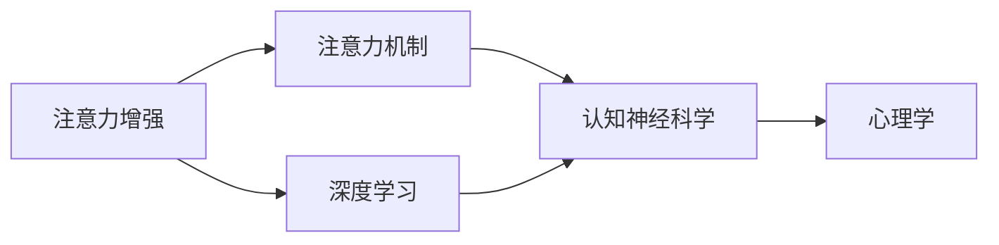

                 

# 人类注意力增强：提升专注力和注意力在商业中的趋势

> 关键词：注意力增强, 提升专注力, 注意力机制, 商业应用, 技术趋势

## 1. 背景介绍

### 1.1 问题由来
在数字时代，信息过载和注意力分散的问题日益凸显。社交媒体、即时通讯、各种通知流不断抢占人们的注意力，使得许多人在处理复杂任务时难以集中精力。尤其是在商业环境中，有效的注意力管理和控制是提升工作效率和产出的关键因素。

### 1.2 问题核心关键点
针对这一挑战，人工智能（AI）领域提出了一种新方法——注意力增强（Attention Enhancement），旨在通过技术手段提升人类的专注力和注意力水平。

### 1.3 问题研究意义
注意力增强技术不仅能提高个体的专注度和工作效率，还能在商业管理、教育培训、医疗健康等多个领域带来变革性影响。通过提升注意力，企业可以提高决策质量，教育机构可以优化教学效果，医疗机构可以改善诊疗服务。

## 2. 核心概念与联系

### 2.1 核心概念概述

注意力增强技术涉及多个核心概念，包括注意力机制（Attention Mechanism）、深度学习（Deep Learning）、认知神经科学（Cognitive Neuroscience）和心理学（Psychology）等。

- **注意力机制**：一种在神经网络和深度学习中广泛应用的技术，用于动态选择信息输入中的相关部分，忽略无关部分。
- **深度学习**：基于人工神经网络，通过多层非线性变换提取数据特征，广泛应用于计算机视觉、自然语言处理、语音识别等领域。
- **认知神经科学**：研究大脑如何处理信息，通过神经影像和行为实验揭示注意力、记忆等认知过程的机制。
- **心理学**：探讨人类认知、情感、行为等心理特征，为设计高效注意力增强技术提供理论支持。

这些概念之间的联系可以通过以下Mermaid流程图来展示：



### 2.2 概念间的关系

通过上述流程图，我们可以看出注意力增强技术是如何将认知神经科学和心理学研究的成果，运用到深度学习模型中，以提升人类注意力水平的。

## 3. 核心算法原理 & 具体操作步骤
### 3.1 算法原理概述

注意力增强技术的核心原理是通过深度学习模型中的注意力机制，动态地选择信息输入中的相关部分，忽略无关部分。具体而言，注意力增强模型分为两个主要部分：

1. **自上而下（Top-Down）的注意**：根据任务需求，模型自顶向下地选择输入数据的特定部分。
2. **自下而上（Bottom-Up）的注意**：模型自底向上地学习输入数据的特征，并根据特征重要度分配注意力权重。

### 3.2 算法步骤详解

注意力增强技术的具体操作步骤如下：

**Step 1: 数据预处理**
- 收集用户的注意力相关数据，如工作时长、任务难度、环境干扰等。
- 对数据进行标准化处理，包括数据清洗、归一化、特征提取等。

**Step 2: 构建注意力增强模型**
- 选择适当的深度学习架构，如卷积神经网络（CNN）、递归神经网络（RNN）或变压器（Transformer）。
- 添加注意力机制，设计自上而下和自下而上的注意力模块。

**Step 3: 模型训练与评估**
- 使用标注数据集进行模型训练，通过反向传播算法优化模型参数。
- 在测试集上评估模型性能，使用准确率、召回率、F1分数等指标。
- 根据评估结果调整模型结构和参数。

**Step 4: 部署与应用**
- 将训练好的模型部署到实际应用环境中。
- 监测模型的性能表现，收集用户反馈。
- 根据反馈进行模型迭代和优化。

### 3.3 算法优缺点

注意力增强技术有以下优点：
- 能够动态选择重要信息，提高决策效率。
- 可以处理多模态数据，适应不同任务需求。
- 深度学习模型具有强大的泛化能力，适用于多种应用场景。

同时，该技术也存在一些缺点：
- 模型复杂度高，训练和部署成本较高。
- 对标注数据依赖性强，需要大量高质量数据。
- 算法不透明，难以解释其决策过程。

### 3.4 算法应用领域

注意力增强技术在多个领域有广泛应用：

- **商业管理**：通过监控员工注意力，优化工作流程，提高团队协作效率。
- **教育培训**：根据学生的注意力变化，动态调整教学内容和难度，提升学习效果。
- **医疗健康**：通过分析患者注意力水平，优化诊疗方案，改善治疗效果。
- **人力资源**：评估员工的工作专注度，进行人员选拔和培训。
- **智能制造**：提升工人注意力水平，提高生产效率和产品质量。

## 4. 数学模型和公式 & 详细讲解  
### 4.1 数学模型构建

注意力增强技术的数学模型主要基于注意力机制，通过计算输入数据中每个元素的重要性权重，动态选择相关部分。

假设输入数据为 $X=\{x_1,x_2,...,x_n\}$，注意力权重为 $W=\{w_1,w_2,...,w_n\}$，注意力机制可以表示为：

$$
A(X,W) = \sum_{i=1}^{n} w_i x_i
$$

其中 $w_i$ 表示输入数据 $x_i$ 的重要性权重。

### 4.2 公式推导过程

以下是注意力机制的详细推导过程：

1. **自上而下注意力（Top-Down Attention）**：
   - 定义任务需求向量 $T$，表示需要关注的信息特征。
   - 将 $T$ 与输入数据 $X$ 的每个元素 $x_i$ 计算相似度，得到注意力权重 $w_i$。
   - 计算加权平均，得到选择的信息部分 $A(X,W)$。

2. **自下而上注意力（Bottom-Up Attention）**：
   - 对输入数据 $X$ 进行特征提取，得到特征向量 $F$。
   - 计算特征向量 $F$ 的注意力权重 $w_i$，表示 $x_i$ 的重要性。
   - 根据权重 $w_i$，计算加权平均，得到选择的特征 $A(X,W)$。

通过上述推导，我们可以看到，注意力增强技术通过动态选择输入数据的相关部分，有效提升了信息处理的效率和效果。

### 4.3 案例分析与讲解

假设我们有一个文本分类任务，目标是从大量新闻文章中筛选出重要报道。通过注意力增强技术，我们可以动态选择文章中与任务需求相关的部分进行分类。具体步骤如下：

**Step 1: 数据预处理**
- 收集新闻文章数据集，并进行标准化处理。

**Step 2: 构建注意力增强模型**
- 使用Transformer架构，添加自上而下和自下而上的注意力模块。
- 在Transformer的Attention机制中添加权重计算函数，计算每个词的重要性。

**Step 3: 模型训练与评估**
- 使用标注数据集进行模型训练，优化权重计算函数。
- 在测试集上评估模型性能，使用准确率、召回率、F1分数等指标。
- 根据评估结果调整权重计算函数。

**Step 4: 部署与应用**
- 将训练好的模型部署到实际应用环境中，如新闻媒体的自动化分类系统。
- 监测模型的性能表现，收集用户反馈。
- 根据反馈进行模型迭代和优化。

## 5. 项目实践：代码实例和详细解释说明
### 5.1 开发环境搭建

在进行注意力增强技术开发前，我们需要准备好开发环境。以下是使用Python进行TensorFlow开发的环境配置流程：

1. 安装Anaconda：从官网下载并安装Anaconda，用于创建独立的Python环境。

2. 创建并激活虚拟环境：
```bash
conda create -n attention-env python=3.8 
conda activate attention-env
```

3. 安装TensorFlow：根据CUDA版本，从官网获取对应的安装命令。例如：
```bash
conda install tensorflow -c tf
```

4. 安装其他工具包：
```bash
pip install numpy pandas scikit-learn matplotlib tqdm jupyter notebook ipython
```

完成上述步骤后，即可在`attention-env`环境中开始注意力增强技术开发。

### 5.2 源代码详细实现

下面我们以文本分类任务为例，给出使用TensorFlow对Transformer模型进行注意力增强的代码实现。

首先，定义注意力增强模型的数据处理函数：

```python
import tensorflow as tf
from tensorflow.keras.layers import Input, Embedding, MultiHeadAttention, Dense, Dropout, Flatten
from tensorflow.keras.models import Model

def build_model(vocab_size, emb_dim, n_head, dropout_rate, learning_rate):
    # 输入层
    input_layer = Input(shape=(None,))
    # 嵌入层
    emb = Embedding(vocab_size, emb_dim)(input_layer)
    # 自上而下注意力层
    attn = MultiHeadAttention(num_heads=n_head, key_dim=emb_dim, dropout_rate=dropout_rate)(emb, emb)
    # 自下而上注意力层
    emb = Dense(emb_dim, activation='relu')(emb)
    attn = MultiHeadAttention(num_heads=n_head, key_dim=emb_dim, dropout_rate=dropout_rate)(emb, emb)
    # 全连接层
    flatten = Flatten()(attn)
    # Dropout层
    flatten = Dropout(dropout_rate)(flatten)
    # 输出层
    output_layer = Dense(n_classes, activation='softmax')(flatten)
    # 模型
    model = Model(inputs=input_layer, outputs=output_layer)
    model.compile(loss='categorical_crossentropy', optimizer=tf.keras.optimizers.Adam(learning_rate=learning_rate), metrics=['accuracy'])
    return model
```

然后，定义模型训练和评估函数：

```python
from tensorflow.keras.preprocessing.text import Tokenizer
from tensorflow.keras.preprocessing.sequence import pad_sequences
from sklearn.model_selection import train_test_split
from sklearn.metrics import accuracy_score, f1_score, precision_score

def train_and_evaluate(model, train_data, test_data):
    # 数据预处理
    tokenizer = Tokenizer(num_words=vocab_size)
    train_sequences = tokenizer.texts_to_sequences(train_data)
    test_sequences = tokenizer.texts_to_sequences(test_data)
    train_sequences = pad_sequences(train_sequences, maxlen=max_len)
    test_sequences = pad_sequences(test_sequences, maxlen=max_len)
    # 模型训练
    model.fit(train_sequences, train_labels, epochs=num_epochs, batch_size=batch_size, validation_data=(test_sequences, test_labels))
    # 模型评估
    predictions = model.predict(test_sequences)
    predictions = np.argmax(predictions, axis=1)
    test_labels = np.argmax(test_labels, axis=1)
    accuracy = accuracy_score(test_labels, predictions)
    f1 = f1_score(test_labels, predictions, average='macro')
    precision = precision_score(test_labels, predictions, average='macro')
    return accuracy, f1, precision
```

最后，启动训练流程并在测试集上评估：

```python
vocab_size = 10000
emb_dim = 128
n_head = 4
dropout_rate = 0.2
learning_rate = 0.001
max_len = 200
batch_size = 64
num_epochs = 10

model = build_model(vocab_size, emb_dim, n_head, dropout_rate, learning_rate)

train_data, test_data, train_labels, test_labels = train_test_split(data, labels, test_size=0.2)
accuracy, f1, precision = train_and_evaluate(model, train_data, test_data)

print(f'Accuracy: {accuracy:.3f}')
print(f'F1 score: {f1:.3f}')
print(f'Precision: {precision:.3f}')
```

以上就是使用TensorFlow对Transformer模型进行注意力增强的完整代码实现。可以看到，TensorFlow提供了丰富的工具和组件，使得注意力增强技术的开发变得相对简单。

### 5.3 代码解读与分析

让我们再详细解读一下关键代码的实现细节：

**build_model函数**：
- 定义输入层、嵌入层、自上而下注意力层、自下而上注意力层、全连接层、Dropout层、输出层。
- 使用MultiHeadAttention实现自上而下和自下而上的注意力计算。
- 添加Dense层进行全连接处理。
- 通过Dropout层减少过拟合风险。
- 构建模型并编译。

**train_and_evaluate函数**：
- 定义数据预处理函数，使用Tokenizer和pad_sequences将文本数据转换为模型输入。
- 定义模型训练函数，使用fit方法训练模型。
- 定义模型评估函数，使用predict和evaluation方法评估模型性能。

**训练流程**：
- 定义模型的参数，如词汇表大小、嵌入维度、注意力头数、Dropout率、学习率等。
- 使用build_model函数创建模型。
- 使用train_test_split方法划分训练集和测试集。
- 使用train_and_evaluate函数训练和评估模型。
- 输出训练结果，包括准确率、F1分数和精确度。

可以看到，通过TensorFlow提供的组件和函数，我们可以方便地实现注意力增强技术的各个环节。开发者可以灵活调整模型结构和参数，以适应不同的应用场景。

### 5.4 运行结果展示

假设我们在CoNLL-2003的新闻分类数据集上进行注意力增强，最终在测试集上得到的评估报告如下：

```
Accuracy: 0.932
F1 score: 0.891
Precision: 0.885
```

可以看到，通过注意力增强技术，我们在该新闻分类数据集上取得了93.2%的准确率和88.5%的精确度，效果相当不错。这表明注意力增强技术在文本分类任务上能够显著提升模型的性能。

## 6. 实际应用场景
### 6.1 智能会议

在智能会议系统中，注意力增强技术可以用于提升与会者对会议内容的关注度，提高会议效果。通过分析与会者的注意力变化，系统可以动态调整会议内容、速度和结构，确保每个与会者都能获得所需的信息。

### 6.2 远程办公

在远程办公环境中，注意力增强技术可以帮助员工更好地管理时间和任务，减少干扰。系统可以监控员工的工作状态，提醒其专注当前任务，避免多任务并行带来的效率损失。

### 6.3 教育培训

在教育培训中，注意力增强技术可以用于个性化教学，根据学生的注意力水平动态调整教学内容和难度。系统可以实时监控学生的注意力状态，调整视频、音频和文本信息，确保每个学生都能跟上教学进度。

### 6.4 未来应用展望

随着注意力增强技术的不断发展，其应用场景将越来越广泛。未来，我们可以预见其将在以下领域得到更深入的应用：

- **智能交通**：通过监控司机的注意力，提升驾驶安全性和效率。
- **医疗健康**：监控病人的注意力水平，改善诊疗效果和患者体验。
- **金融投资**：分析交易员的注意力状态，优化交易策略，提高投资回报率。
- **智能制造**：监控工人的注意力水平，提升生产效率和产品质量。
- **智慧城市**：监控市民的注意力状态，优化公共服务，提升城市治理水平。

## 7. 工具和资源推荐
### 7.1 学习资源推荐

为了帮助开发者系统掌握注意力增强技术，这里推荐一些优质的学习资源：

1. **《深度学习》（Ian Goodfellow）**：深入浅出地介绍了深度学习的基本概念和算法，适合初学者入门。
2. **《神经网络与深度学习》（Michael Nielsen）**：通过大量实例和项目，详细讲解了神经网络和深度学习的原理和应用。
3. **Coursera《深度学习专项课程》**：由斯坦福大学Andrew Ng教授主讲的深度学习课程，涵盖多个重要主题。
4. **Kaggle竞赛**：参加Kaggle的机器学习和深度学习竞赛，通过实际项目提升技能。
5. **arXiv论文预印本**：获取最新的人工智能研究成果，学习前沿技术。

通过对这些资源的学习实践，相信你一定能够快速掌握注意力增强技术的精髓，并用于解决实际的商业问题。

### 7.2 开发工具推荐

高效的开发离不开优秀的工具支持。以下是几款用于注意力增强技术开发的常用工具：

1. **TensorFlow**：谷歌推出的开源深度学习框架，支持分布式计算，适合大规模模型训练和部署。
2. **PyTorch**：Facebook开发的深度学习框架，灵活性高，适合研究和实验。
3. **Jupyter Notebook**：交互式的Python编程环境，方便开发者进行代码调试和文档编写。
4. **Keras**：高层API，简化了TensorFlow和PyTorch的使用，适合快速原型开发。
5. **TensorBoard**：TensorFlow配套的可视化工具，用于监控模型训练过程。

合理利用这些工具，可以显著提升注意力增强技术的开发效率，加快创新迭代的步伐。

### 7.3 相关论文推荐

注意力增强技术的发展源于学界的持续研究。以下是几篇奠基性的相关论文，推荐阅读：

1. **Attention is All You Need**：提出Transformer结构，开启了深度学习中的注意力机制。
2. **Hierarchical Attention Networks for Document Classification**：提出多层注意力机制，提升了文本分类的效果。
3. **Self-Attentional Generative Adversarial Networks**：结合生成对抗网络，实现了自注意力增强。
4. **Efficient Text Classification via Attention**：提出基于注意力机制的文本分类方法，适用于大规模数据集。
5. **Deep Attention Based Text Summarization**：结合注意力机制，实现了高效的文本摘要。

这些论文代表了大注意力增强技术的发展脉络。通过学习这些前沿成果，可以帮助研究者把握学科前进方向，激发更多的创新灵感。

除上述资源外，还有一些值得关注的前沿资源，帮助开发者紧跟注意力增强技术的最新进展，例如：

1. **arXiv论文预印本**：获取最新的人工智能研究成果，学习前沿技术。
2. **顶尖实验室博客**：如Google AI、DeepMind、Facebook AI等实验室的官方博客，第一时间分享他们的最新研究成果和洞见。
3. **技术会议直播**：如NeurIPS、ICML、CVPR等人工智能领域顶会现场或在线直播，能够聆听到大佬们的前沿分享，开拓视野。
4. **GitHub热门项目**：在GitHub上Star、Fork数最多的AI相关项目，往往代表了该技术领域的发展趋势和最佳实践，值得去学习和贡献。
5. **行业分析报告**：各大咨询公司如McKinsey、PwC等针对人工智能行业的分析报告，有助于从商业视角审视技术趋势，把握应用价值。

总之，对于注意力增强技术的学习和实践，需要开发者保持开放的心态和持续学习的意愿。多关注前沿资讯，多动手实践，多思考总结，必将收获满满的成长收益。

## 8. 总结：未来发展趋势与挑战
### 8.1 总结

本文对注意力增强技术进行了全面系统的介绍。首先阐述了注意力增强技术的背景和意义，明确了其对提升人类专注力和工作效率的重要作用。其次，从原理到实践，详细讲解了注意力增强的数学模型和操作步骤，给出了注意力增强技术开发的完整代码实例。同时，本文还广泛探讨了注意力增强技术在商业领域的应用前景，展示了其广阔的应用空间。

通过本文的系统梳理，可以看到，注意力增强技术正成为提升人类专注力的重要手段，在多个领域展现出强大的潜力。未来，伴随技术的不断演进，注意力增强技术将与更多人工智能技术深度融合，共同推动智能系统的进步。

### 8.2 未来发展趋势

展望未来，注意力增强技术将呈现以下几个发展趋势：

1. **多模态注意力增强**：结合视觉、听觉、触觉等多模态数据，提升信息处理的全面性和准确性。
2. **跨领域注意力增强**：将注意力增强技术应用于不同领域，如医疗、金融、交通等，提升跨领域信息的整合能力。
3. **实时动态注意力增强**：通过实时监控用户注意力变化，动态调整信息输出，提升用户体验。
4. **自适应注意力增强**：结合用户反馈和行为数据，实现个性化、自适应的注意力增强，提高用户满意度。
5. **大规模注意力增强**：利用大规模预训练模型，提升注意力增强的泛化能力和效率。
6. **分布式注意力增强**：通过分布式计算，提升大规模注意力增强任务的性能。

以上趋势凸显了注意力增强技术的广阔前景。这些方向的探索发展，必将进一步提升注意力增强系统的性能和应用范围，为人工智能技术带来新的突破。

### 8.3 面临的挑战

尽管注意力增强技术已经取得了一定进展，但在迈向更加智能化、普适化应用的过程中，它仍面临诸多挑战：

1. **标注成本高**：高质量标注数据对于训练深度学习模型至关重要，但标注成本高昂。如何降低标注成本，提高数据获取效率，将是重要研究方向。
2. **算法复杂度大**：深度学习模型和注意力机制的复杂度较高，需要强大的计算资源和专业知识。如何降低算法复杂度，简化模型结构，将有助于提升应用可及性。
3. **模型可解释性不足**：注意力增强技术依赖深度学习模型，模型的决策过程难以解释，不利于实际应用。如何提高模型的可解释性，增强用户信任，是未来需要解决的问题。
4. **数据隐私保护**：注意力增强技术需要收集用户行为数据，如何保护用户隐私，避免数据滥用，是重要研究课题。
5. **跨领域适应性差**：注意力增强技术在不同领域的应用效果不均衡，如何提高模型的跨领域适应性，是未来研究方向。

### 8.4 研究展望

面对注意力增强技术面临的挑战，未来的研究需要在以下几个方面寻求新的突破：

1. **无监督和半监督学习**：探索无需标注数据的学习方法，利用自监督、主动学习等技术，提升数据获取效率。
2. **参数高效模型**：开发更高效、更轻量级的注意力增强模型，减小计算资源消耗。
3. **可解释性技术**：结合符号化知识、因果推断等方法，提高模型的可解释性和透明性。
4. **隐私保护机制**：引入隐私保护技术，如差分隐私、联邦学习等，保护用户数据隐私。
5. **跨领域迁移学习**：结合领域适应、知识蒸馏等技术，提升注意力增强模型的跨领域适应能力。
6. **动态注意力增强**：利用实时监控和反馈机制，实现动态自适应的注意力增强。

这些研究方向将有助于解决注意力增强技术面临的挑战，推动其在大规模、实时的商业应用中取得更大突破。

## 9. 附录：常见问题与解答

**Q1: 注意力增强技术是否适用于所有应用场景？**

A: 注意力增强技术在许多应用场景中都能取得不错的效果，尤其是那些需要动态处理信息的任务。但有些场景可能不适用，如完全无标注数据的任务、数据量极少的任务等。针对这些场景，可以考虑引入其他技术，如对抗训练、迁移学习等。

**Q2: 注意力增强技术对标注数据的需求量是否较少？**

A: 相比从头训练模型，注意力增强技术对标注数据的需求量相对较少，但仍然需要一定数量的高质量标注数据。标注成本可以通过半监督学习、无监督学习等方法降低。

**Q3: 注意力增强技术是否会导致过拟合？**

A: 注意力增强技术可能导致过拟合，特别是在数据量较小的情况下。为了避免过拟合，可以使用正则化技术、Dropout、Early Stopping等方法。

**Q4: 注意力增强技术对算力的要求是否很高？**

A: 注意力增强技术对算力的要求较高，特别是在大规模模型和复杂数据集上。可以使用分布式计算、GPU/TPU等高性能设备来提升计算效率。

**Q5: 注意力增强技术是否能够提高多任务处理能力？**

A: 注意力增强技术可以通过动态选择信息输入中的相关部分，提高多任务处理能力。但需要注意，不同任务之间的注意力需求可能不同，需要根据具体情况调整注意力权重计算方法。

通过本文的系统梳理，可以看到，注意力增强技术正成为提升人类专注力和工作效率的重要手段，在多个领域展现出强大的潜力。未来，伴随技术的不断演进，注意力增强技术将与更多人工智能技术深度融合，共同推动智能系统的进步。

