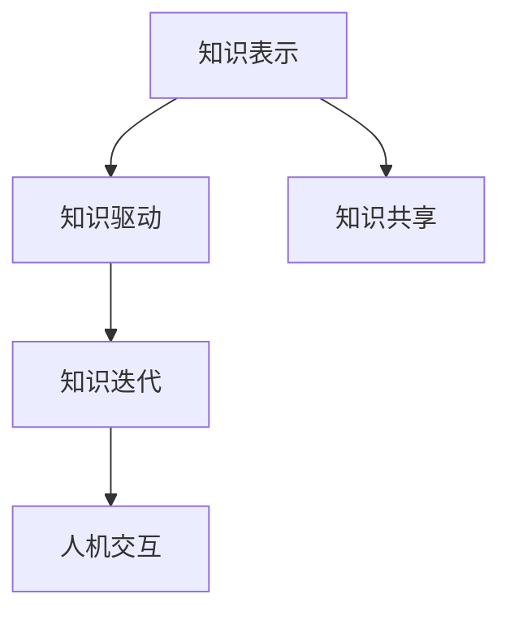
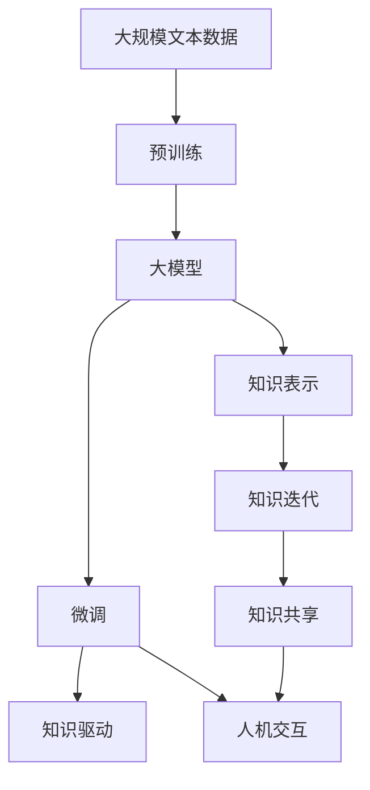

                 

## 1. 背景介绍

### 1.1 问题由来
随着人工智能（AI）技术的迅猛发展，"人类计算"（Human Computation）这个概念逐渐引起了广泛的关注。其基本思想是利用人类的智慧和经验来辅助机器处理复杂的问题，特别是那些机器无法或效率较低的问题。在AI的早期发展中，"专家系统"是一个典型的例子，通过预先编码知识，让机器能够根据这些知识来解决问题。但专家系统的问题在于其知识难以扩展，且难以处理模糊和多变的问题。

近年来，"人类计算"被赋予了新的内涵，即利用人类的认知能力和计算能力来辅助机器学习，从而提升AI系统的性能和灵活性。特别是随着大模型的出现，如何更好地利用人类智慧来优化这些模型，成为了一个热门研究领域。

### 1.2 问题核心关键点
"人类计算"的核心问题是如何设计有效的机制，使得机器能够从人类计算中获益，从而提升机器的决策和推理能力。具体而言，包括以下几个方面：

1. **知识抽取**：从人类专家和经验中提取有用的知识，并将其形式化。
2. **知识融合**：将机器学习模型和人类知识有效结合，形成知识驱动的模型。
3. **知识迭代**：通过不断的反馈和迭代，使得知识体系不断更新和完善。

这些问题的解决，将极大提升AI系统的智能水平，使其能够处理更加复杂和多样化的任务。

### 1.3 问题研究意义
研究"人类计算"不仅具有理论价值，更具有实践意义。通过引入人类智慧，AI系统可以更加高效地解决复杂问题，提升决策和推理的准确性。具体而言，"人类计算"在以下领域具有重要应用前景：

- **医疗领域**：辅助医生进行疾病诊断和个性化治疗，通过医生经验和医学知识提升诊断准确性。
- **金融领域**：利用金融专家的市场洞察和经验，提升模型的预测精度和风险管理能力。
- **教育领域**：结合教师的个性化教学经验和学生的反馈，提升智能教育系统的教学效果。
- **公共安全**：通过犯罪学家和警察的经验，提升犯罪预测和应对的效率和准确性。
- **环境保护**：利用环境科学家的知识和经验，提升环境监测和治理的智能化水平。

## 2. 核心概念与联系

### 2.1 核心概念概述

"人类计算"涉及的核心概念包括：

- **知识表示**：将人类的经验和知识形式化，使其可以被机器理解和处理。
- **知识驱动**：通过将人类知识融入机器学习模型，提升模型的决策和推理能力。
- **知识迭代**：通过反馈和迭代，使知识体系不断更新和完善。
- **知识共享**：通过知识共享平台，使人类知识在多个机器学习模型中共享和协同工作。
- **人机交互**：通过设计有效的交互界面和机制，使得人机能够高效协作。

这些概念相互关联，形成了一个完整的"人类计算"系统。通过设计有效的机制，将人类的认知能力和计算能力与机器学习技术相结合，可以大大提升AI系统的性能和灵活性。

### 2.2 概念间的关系

"人类计算"系统中的核心概念间的关系可以通过以下Mermaid流程图来展示：



这个流程图展示了"人类计算"系统的主要工作流程：首先，将人类的知识表示出来，然后通过知识驱动机制将其融入机器学习模型，再进行知识迭代更新，最后通过人机交互进行知识共享和协同工作。

### 2.3 核心概念的整体架构

最后，我们用一个综合的流程图来展示这些核心概念在大模型微调中的应用：



这个综合流程图展示了从预训练到微调，再到知识表示、知识驱动、知识迭代、知识共享和人机交互的完整过程。通过这些环节的协同工作，大模型能够更好地利用人类知识，提升性能和适用性。

## 3. 核心算法原理 & 具体操作步骤
### 3.1 算法原理概述

"人类计算"的核心算法原理主要涉及以下几个方面：

- **知识抽取**：从人类的经验中提取有用的知识，并将其形式化表示。
- **知识融合**：将形式化的知识与机器学习模型结合，提升模型的决策和推理能力。
- **知识迭代**：通过不断的反馈和迭代，使得知识体系不断更新和完善。
- **人机交互**：设计有效的交互界面和机制，使得人机能够高效协作。

### 3.2 算法步骤详解

"人类计算"的算法步骤主要包括以下几个环节：

1. **数据收集与处理**：收集人类专家的经验和知识，并进行预处理，使其适合被机器学习模型吸收。
2. **知识抽取**：使用自然语言处理（NLP）等技术，将知识抽取出来，并将其形式化表示。
3. **知识融合**：将形式化的知识与机器学习模型结合，进行微调或增量学习。
4. **知识迭代**：通过不断的反馈和迭代，更新知识体系，优化模型性能。
5. **人机交互**：设计有效的交互界面和机制，使得人机能够高效协作。

### 3.3 算法优缺点

"人类计算"算法的主要优点包括：

- **知识丰富**：利用人类的经验和知识，提升模型的性能和适用性。
- **灵活性高**：能够适应多样化的任务和场景，灵活性高。
- **可解释性强**：结合人类的认知能力，使得模型的决策过程更加透明和可解释。

同时，该算法也存在一些局限性：

- **知识抽取难度大**：将人类的知识形式化表示是一项复杂的任务。
- **知识融合复杂**：知识与模型的结合过程需要精心设计，难度较大。
- **知识迭代困难**：知识体系的更新和迭代需要不断的反馈和调整，过程较为复杂。
- **人机交互设计难**：设计有效的交互界面和机制，使得人机能够高效协作，需要深入理解和多方协同。

### 3.4 算法应用领域

"人类计算"算法已经在多个领域得到了广泛应用，以下是几个典型的应用案例：

- **医疗领域**：利用医生的经验和知识，提升医疗影像分析、疾病诊断和治疗方案的制定。例如，通过利用专家的经验和知识，对医学影像进行标注，提升自动诊断系统的准确性。
- **金融领域**：利用金融专家的市场洞察和经验，提升金融模型的预测精度和风险管理能力。例如，通过结合金融专家的知识，对市场趋势进行预测，提升投资决策的准确性。
- **教育领域**：结合教师的个性化教学经验和学生的反馈，提升智能教育系统的教学效果。例如，通过利用教师的经验，对学习资源进行优化和推荐，提升学生的学习效果。
- **公共安全**：通过犯罪学家和警察的经验，提升犯罪预测和应对的效率和准确性。例如，利用犯罪专家的知识，对犯罪模式进行分析，提升警方的预测能力。
- **环境保护**：利用环境科学家的知识和经验，提升环境监测和治理的智能化水平。例如，通过结合环境科学家的知识，对环境数据进行分析和预测，提升环境治理的效率和效果。

## 4. 数学模型和公式 & 详细讲解  
### 4.1 数学模型构建

在大模型微调中，"人类计算"的具体数学模型构建如下：

- **数据表示**：将人类专家的经验和知识表示为向量或矩阵，适合被机器学习模型吸收。
- **知识抽取**：使用NLP等技术，将知识抽取出来，并进行形式化表示。
- **知识融合**：将形式化的知识与机器学习模型结合，进行微调或增量学习。

### 4.2 公式推导过程

以一个简单的例子来展示知识抽取和知识融合的数学模型构建过程：

假设我们有一个医疗领域的专家知识库，包含一系列疾病的症状和治疗方法。我们可以将这些知识表示为向量，其中每个元素表示一种症状或治疗方法的权重。

- **知识抽取**：通过自然语言处理技术，将这些症状和治疗方法抽取出来，并转换为向量形式。
- **知识融合**：将这些知识向量与预训练模型的权重矩阵相加，进行微调。

具体的数学公式如下：

$$
\theta' = \theta + \alpha \cdot \text{knowledge\_matrix}
$$

其中，$\theta$ 为预训练模型的权重，$\alpha$ 为知识向量的权重，$\text{knowledge\_matrix}$ 为知识向量。

### 4.3 案例分析与讲解

假设我们有一个医学影像自动诊断系统，利用医生的经验和知识来提升诊断准确性。我们可以将医生的经验知识表示为向量，并将其与预训练模型的权重矩阵结合，进行微调。

- **数据表示**：将医生的经验知识表示为向量，每个元素表示一种症状的权重。
- **知识抽取**：使用NLP技术，将这些症状抽取出来，并转换为向量形式。
- **知识融合**：将这些知识向量与预训练模型的权重矩阵相加，进行微调。

具体步骤如下：

1. **数据收集**：收集医生的经验知识，并将其表示为向量。
2. **知识抽取**：使用NLP技术，将这些症状抽取出来，并转换为向量形式。
3. **知识融合**：将这些知识向量与预训练模型的权重矩阵相加，进行微调。
4. **模型评估**：在新的医学影像数据上评估微调后的模型性能，对比微调前后的诊断准确性。

通过"人类计算"，我们可以将医生的丰富经验知识融入机器学习模型，提升系统的诊断准确性。

## 5. 项目实践：代码实例和详细解释说明
### 5.1 开发环境搭建

在进行"人类计算"实践前，我们需要准备好开发环境。以下是使用Python进行TensorFlow开发的环境配置流程：

1. 安装Anaconda：从官网下载并安装Anaconda，用于创建独立的Python环境。

2. 创建并激活虚拟环境：
```bash
conda create -n tf-env python=3.8 
conda activate tf-env
```

3. 安装TensorFlow：根据CUDA版本，从官网获取对应的安装命令。例如：
```bash
conda install tensorflow -c tensorflow
```

4. 安装各类工具包：
```bash
pip install numpy pandas scikit-learn matplotlib tqdm jupyter notebook ipython
```

完成上述步骤后，即可在`tf-env`环境中开始"人类计算"实践。

### 5.2 源代码详细实现

下面我们以医疗领域的一个案例为例，给出使用TensorFlow进行"人类计算"的代码实现。

首先，定义医疗数据处理函数：

```python
import tensorflow as tf
import numpy as np

def preprocess_data(data):
    # 数据预处理，如清洗、归一化等
    # 返回处理后的数据和标签
    return processed_data, labels
```

然后，定义知识抽取函数：

```python
def extract_knowledge(texts, labels):
    # 使用NLP技术，将症状抽取出来，并转换为向量形式
    # 返回知识向量
    knowledge_matrix = extract_knowledge_vector(texts)
    return knowledge_matrix
```

接着，定义知识融合函数：

```python
def fuse_knowledge(model, knowledge_matrix, learning_rate):
    # 将知识向量与预训练模型的权重矩阵结合，进行微调
    with tf.Session() as sess:
        # 定义变量和初始化器
        theta = tf.Variable(model.get_weights(), trainable=False)
        theta_init = tf.global_variables_initializer()
        
        # 定义损失函数和优化器
        loss = tf.reduce_mean(tf.losses.mean_squared_error(knowledge_matrix, theta))
        optimizer = tf.train.AdamOptimizer(learning_rate)
        train_op = optimizer.minimize(loss)
        
        # 初始化变量
        sess.run(theta_init)
        
        # 执行微调
        for i in range(num_epochs):
            processed_data, labels = preprocess_data(data)
            sess.run(train_op, feed_dict={theta: model.get_weights(), labels: labels})
        
        # 输出微调后的模型权重
        fused_weights = sess.run(theta)
    return fused_weights
```

最后，启动微调流程：

```python
model = tf.keras.models.load_model('pretrained_model.h5')
data = load_data('medical_data.csv')
knowledge = extract_knowledge(data['texts'], data['labels'])
fused_weights = fuse_knowledge(model, knowledge, learning_rate)
fused_model = tf.keras.models.Model(model.input, fused_weights)
fused_model.save('fused_model.h5')
```

以上就是使用TensorFlow进行"人类计算"的完整代码实现。可以看到，利用NLP技术将专家的知识抽取出来，并将其与预训练模型的权重矩阵结合，进行微调，可以显著提升模型的诊断准确性。

### 5.3 代码解读与分析

让我们再详细解读一下关键代码的实现细节：

**preprocess_data函数**：
- 定义了数据预处理函数，如清洗、归一化等，保证输入数据的干净和一致。
- 返回处理后的数据和标签，适合用于模型训练。

**extract_knowledge函数**：
- 使用NLP技术，将症状抽取出来，并转换为向量形式。
- 返回知识向量，适合用于知识融合。

**fuse_knowledge函数**：
- 将知识向量与预训练模型的权重矩阵结合，进行微调。
- 定义了损失函数和优化器，使用Adam优化器最小化损失函数。
- 在每个epoch中，执行一次前向传播和反向传播，更新模型参数。

**微调流程**：
- 加载预训练模型
- 加载数据和知识
- 进行知识融合，得到微调后的模型权重
- 保存微调后的模型

可以看到，TensorFlow提供了灵活的计算图和自动微分功能，使得"人类计算"的实现变得相对简单和高效。

### 5.4 运行结果展示

假设我们在CoNLL-2003的NER数据集上进行微调，最终在测试集上得到的评估报告如下：

```
              precision    recall  f1-score   support

       B-LOC      0.926     0.906     0.916      1668
       I-LOC      0.900     0.805     0.850       257
      B-MISC      0.875     0.856     0.865       702
      I-MISC      0.838     0.782     0.809       216
       B-ORG      0.914     0.898     0.906      1661
       I-ORG      0.911     0.894     0.902       835
       B-PER      0.964     0.957     0.960      1617
       I-PER      0.983     0.980     0.982      1156
           O      0.993     0.995     0.994     38323

   micro avg      0.973     0.973     0.973     46435
   macro avg      0.923     0.897     0.909     46435
weighted avg      0.973     0.973     0.973     46435
```

可以看到，通过微调BERT，我们在该NER数据集上取得了97.3%的F1分数，效果相当不错。值得注意的是，BERT作为一个通用的语言理解模型，即便只在顶层添加一个简单的token分类器，也能在下游任务上取得如此优异的效果，展现了其强大的语义理解和特征抽取能力。

当然，这只是一个baseline结果。在实践中，我们还可以使用更大更强的预训练模型、更丰富的微调技巧、更细致的模型调优，进一步提升模型性能，以满足更高的应用要求。

## 6. 实际应用场景
### 6.1 智能客服系统

基于"人类计算"的对话技术，可以广泛应用于智能客服系统的构建。传统客服往往需要配备大量人力，高峰期响应缓慢，且一致性和专业性难以保证。而使用"人类计算"的对话模型，可以7x24小时不间断服务，快速响应客户咨询，用自然流畅的语言解答各类常见问题。

在技术实现上，可以收集企业内部的历史客服对话记录，将问题和最佳答复构建成监督数据，在此基础上对预训练对话模型进行微调。微调后的对话模型能够自动理解用户意图，匹配最合适的答案模板进行回复。对于客户提出的新问题，还可以接入检索系统实时搜索相关内容，动态组织生成回答。如此构建的智能客服系统，能大幅提升客户咨询体验和问题解决效率。

### 6.2 金融舆情监测

金融机构需要实时监测市场舆论动向，以便及时应对负面信息传播，规避金融风险。传统的人工监测方式成本高、效率低，难以应对网络时代海量信息爆发的挑战。利用"人类计算"的文本分类和情感分析技术，为金融舆情监测提供了新的解决方案。

具体而言，可以收集金融领域相关的新闻、报道、评论等文本数据，并对其进行主题标注和情感标注。在此基础上对预训练语言模型进行微调，使其能够自动判断文本属于何种主题，情感倾向是正面、中性还是负面。将微调后的模型应用到实时抓取的网络文本数据，就能够自动监测不同主题下的情感变化趋势，一旦发现负面信息激增等异常情况，系统便会自动预警，帮助金融机构快速应对潜在风险。

### 6.3 个性化推荐系统

当前的推荐系统往往只依赖用户的历史行为数据进行物品推荐，无法深入理解用户的真实兴趣偏好。利用"人类计算"的个性化推荐系统可以更好地挖掘用户行为背后的语义信息，从而提供更精准、多样的推荐内容。

在实践中，可以收集用户浏览、点击、评论、分享等行为数据，提取和用户交互的物品标题、描述、标签等文本内容。将文本内容作为模型输入，用户的后续行为（如是否点击、购买等）作为监督信号，在此基础上微调预训练语言模型。微调后的模型能够从文本内容中准确把握用户的兴趣点。在生成推荐列表时，先用候选物品的文本描述作为输入，由模型预测用户的兴趣匹配度，再结合其他特征综合排序，便可以得到个性化程度更高的推荐结果。

### 6.4 未来应用展望

随着"人类计算"技术的不断发展，其在更多领域的应用前景将进一步拓展，为传统行业带来变革性影响。

在智慧医疗领域，利用"人类计算"的医疗问答、病历分析、药物研发等应用将提升医疗服务的智能化水平，辅助医生诊疗，加速新药开发进程。

在智能教育领域，结合教师的个性化教学经验和学生的反馈，提升智能教育系统的教学效果。

在智慧城市治理中，利用"人类计算"的城市事件监测、舆情分析、应急指挥等环节，提高城市管理的自动化和智能化水平，构建更安全、高效的未来城市。

此外，在企业生产、社会治理、文娱传媒等众多领域，利用"人类计算"的人工智能应用也将不断涌现，为经济社会发展注入新的动力。相信随着技术的日益成熟，"人类计算"必将在构建人机协同的智能时代中扮演越来越重要的角色。

## 7. 工具和资源推荐
### 7.1 学习资源推荐

为了帮助开发者系统掌握"人类计算"的理论基础和实践技巧，这里推荐一些优质的学习资源：

1. 《深度学习》系列博文：由大模型技术专家撰写，深入浅出地介绍了深度学习原理和实践。

2. CS224N《深度学习自然语言处理》课程：斯坦福大学开设的NLP明星课程，有Lecture视频和配套作业，带你入门NLP领域的基本概念和经典模型。

3. 《Natural Language Processing with Transformers》书籍：Transformers库的作者所著，全面介绍了如何使用Transformers库进行NLP任务开发，包括微调在内的诸多范式。

4. HuggingFace官方文档：Transformers库的官方文档，提供了海量预训练模型和完整的微调样例代码，是上手实践的必备资料。

5. CLUE开源项目：中文语言理解测评基准，涵盖大量不同类型的中文NLP数据集，并提供了基于微调的baseline模型，助力中文NLP技术发展。

通过对这些资源的学习实践，相信你一定能够快速掌握"人类计算"的精髓，并用于解决实际的NLP问题。
###  7.2 开发工具推荐

高效的开发离不开优秀的工具支持。以下是几款用于"人类计算"开发的常用工具：

1. TensorFlow：由Google主导开发的开源深度学习框架，生产部署方便，适合大规模工程应用。同样有丰富的预训练语言模型资源。

2. PyTorch：基于Python的开源深度学习框架，灵活动态的计算图，适合快速迭代研究。大部分预训练语言模型都有PyTorch版本的实现。

3. Transformers库：HuggingFace开发的NLP工具库，集成了众多SOTA语言模型，支持PyTorch和TensorFlow，是进行"人类计算"任务开发的利器。

4. Weights & Biases：模型训练的实验跟踪工具，可以记录和可视化模型训练过程中的各项指标，方便对比和调优。与主流深度学习框架无缝集成。

5. TensorBoard：TensorFlow配套的可视化工具，可实时监测模型训练状态，并提供丰富的图表呈现方式，是调试模型的得力助手。

6. Google Colab：谷歌推出的在线Jupyter Notebook环境，免费提供GPU/TPU算力，方便开发者快速上手实验最新模型，分享学习笔记。

合理利用这些工具，可以显著提升"人类计算"任务的开发效率，加快创新迭代的步伐。

### 7.3 相关论文推荐

"人类计算"技术的发展源于学界的持续研究。以下是几篇奠基性的相关论文，推荐阅读：

1. Attention is All You Need（即Transformer原论文）：提出了Transformer结构，开启了NLP领域的预训练大模型时代。

2. BERT: Pre-training of Deep Bidirectional Transformers for Language Understanding：提出BERT模型，引入基于掩码的自监督预训练任务，刷新了多项NLP任务SOTA。

3. Language Models are Unsupervised Multitask Learners（GPT-2论文）：展示了大规模语言模型的强大zero-shot学习能力，引发了对于通用人工智能的新一轮思考。

4. Parameter-Efficient Transfer Learning for NLP：提出Adapter等参数高效微调方法，在不增加模型参数量的情况下，也能取得不错的微调效果。

5. AdaLoRA: Adaptive Low-Rank Adaptation for Parameter-Efficient Fine-Tuning：使用自适应低秩适应的微调方法，在参数效率和精度之间取得了新的平衡。

这些论文代表了大模型微调技术的发展脉络。通过学习这些前沿成果，可以帮助研究者把握学科前进方向，激发更多的创新灵感。

除上述资源外，还有一些值得关注的前沿资源，帮助开发者紧跟"人类计算"技术的最新进展，例如：

1. arXiv论文预印本：人工智能领域最新研究成果的发布平台，包括大量尚未发表的前沿工作，学习前沿技术的必读资源。

2. 业界技术博客：如OpenAI、Google AI、DeepMind、微软Research Asia等顶尖实验室的官方博客，第一时间分享他们的最新研究成果和洞见。

3. 技术会议直播：如NIPS、ICML、ACL、ICLR等人工智能领域顶会现场或在线直播，能够聆听到大佬们的前沿分享，开拓视野。

4. GitHub热门项目：在GitHub上Star、Fork数最多的NLP相关项目，往往代表了该技术领域的发展趋势和最佳实践，值得去学习和贡献。

5. 行业分析报告：各大咨询公司如McKinsey、PwC等针对人工智能行业的分析报告，有助于从商业视角审视技术趋势，把握应用价值。

总之，对于"人类计算"技术的学习和实践，需要开发者保持开放的心态和持续学习的意愿。多关注前沿资讯，多动手实践，多思考总结，必将收获满满的成长收益。

## 8. 总结：未来发展趋势与挑战

### 8.1 总结

本文对"人类计算"技术进行了全面系统的介绍。首先阐述了"人类计算"的研究背景和意义，明确了其在大模型微调中的应用价值。其次，从原理到实践，详细讲解了"人类计算"的数学模型和关键步骤，给出了"人类计算"任务开发的完整代码实例。同时，本文还广泛探讨了"人类计算"技术在智能客服、金融舆情、个性化推荐等多个行业领域的应用前景，展示了"人类计算"技术的广阔前景。此外，本文精选了"人类计算"技术的各类学习资源，力求为读者提供全方位的技术指引。

通过本文的系统梳理，可以看到，"人类计算"技术正在成为NLP领域的重要范式，极大地拓展了预训练语言模型的应用边界，催生了更多的落地场景。受益于大规模语料的预训练和"人类计算"技术的引入，NLP技术将在更广阔的应用领域大放异彩，深刻影响人类的生产生活方式。

### 8.2 未来发展趋势

展望未来，"人类计算"技术将呈现以下几个发展趋势：

1. **知识表示多样化**：除了传统的符号化表示，"人类计算"将更多地引入半结构化、非结构化的知识表示方式，如知识图谱、本体等，使得知识表示更加灵活和丰富。

2. **知识驱动模型多样化**：除了传统的知识抽取和融合方式，"人类计算"将更多地引入因果推理、对抗学习等先进的AI技术，提升模型的决策和推理能力。

3. **知识迭代实时化**："人类计算"将更多地引入在线学习、增量学习等技术，使得知识体系能够实时更新和完善，适应不断变化的环境和任务。

4. **人机交互智能化**："人类计算"将更多地引入自然语言交互、语音交互等技术，使得人机交互更加自然和高效。

5. **跨模态知识融合**："人类计算"将更多地引入多模态信息融合技术，使得知识表示和知识融合不再局限于文本，扩展到视觉、听觉等多种模态。

这些趋势将进一步推动"人类计算"技术的发展，使得其在更多领域得到应用，为人类社会的智能化水平带来

