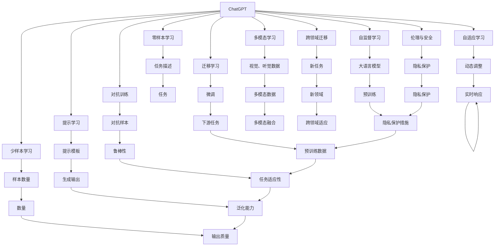
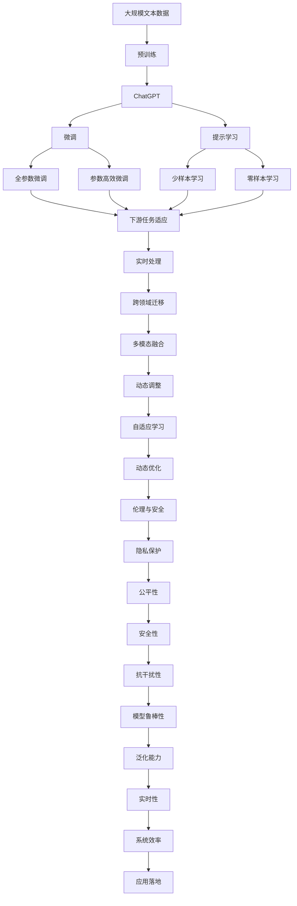

                 

# 从ChatGPT到未来AI助手

## 1. 背景介绍

### 1.1 问题由来
ChatGPT是OpenAI开发的一款基于大型语言模型的大规模预训练模型，自发布以来便引起了广泛关注和热议。这款模型的诞生，不仅推动了自然语言处理（NLP）技术的飞速发展，更颠覆了AI助手的发展模式，为未来的AI助手带来了无限可能。

从早期的简单的聊天机器人到如今的ChatGPT，AI助手已经走过了几十年的发展历程。然而，过去的技术手段往往只关注单一任务，如问答、翻译、文本摘要等，无法满足复杂多变的用户需求。ChatGPT的出现，以其强大的语言理解和生成能力，打破了这一瓶颈，让AI助手不再局限于特定任务，而是具备了更广泛的应用能力。

### 1.2 问题核心关键点
ChatGPT的核心优势在于其庞大的数据预训练基础和先进的Transformer架构，使得它在自然语言理解和生成任务上表现出色。然而，尽管ChatGPT在语言能力上取得了重大突破，但其在一些关键方面仍存在局限，如逻辑推理能力、多模态处理能力等，这些都是未来AI助手的发展方向。

具体来说，ChatGPT的局限性包括：
- 缺乏实时数据感知能力，无法实时理解用户的上下文信息。
- 缺乏多模态信息处理能力，无法将视觉、听觉等不同模态的数据与文本信息结合。
- 缺乏跨领域迁移能力，无法适应不同领域的复杂问题。
- 缺乏自适应学习能力，无法根据新数据和新场景进行动态调整。

正是这些局限，为未来的AI助手发展提供了广阔的探索空间。本文旨在深入探讨从ChatGPT到未来AI助手的发展路径，展望AI助手在各领域的创新应用。

### 1.3 问题研究意义
ChatGPT的成功，证明了大型语言模型在自然语言处理中的应用潜力。然而，随着技术的发展和用户需求的变化，未来的AI助手将更加智能、通用、可控。研究ChatGPT的优缺点、扩展方向及未来发展趋势，对于推动AI助手的技术进步和产业发展具有重要意义：

1. 推动AI助手技术进步：从ChatGPT到未来的AI助手，技术上需要解决诸多挑战，如实时处理、多模态融合、跨领域迁移等，这些技术进展将推动AI助手技术的整体提升。
2. 促进产业应用落地：AI助手将在各行各业发挥重要作用，如智能客服、智能家居、医疗健康等，研究其应用前景有助于推动产业应用落地。
3. 探索未来AI生态系统：未来的AI助手将与人类社会深度融合，研究其生态系统有助于构建更加智能、普适、安全的未来AI环境。
4. 助力AI伦理研究：AI助手的广泛应用将带来诸多伦理问题，如隐私保护、公平性、安全性等，研究这些问题有助于制定更加完善的AI伦理标准。

## 2. 核心概念与联系

### 2.1 核心概念概述

为更好地理解从ChatGPT到未来AI助手的发展过程，本节将介绍几个密切相关的核心概念：

- ChatGPT：基于大型语言模型（LLM）的预训练模型，通过在大规模文本语料上预训练获得丰富的语言知识，具备强大的自然语言理解和生成能力。
- 大语言模型（LLM）：以Transformer为代表的大规模预训练语言模型，通过在海量文本数据上预训练，学习通用的语言表示，具备强大的语言理解和生成能力。
- 自监督学习：通过无标签数据自监督地训练模型，学习语言表示和语言模型。
- 迁移学习：将预训练模型在不同任务上进行微调，使得模型具备更强的适应能力。
- 对抗训练：通过对抗样本训练模型，增强模型的鲁棒性和泛化能力。
- 提示学习（Prompt Learning）：通过精心设计的提示模板引导模型生成特定输出，减少微调参数，提高模型的灵活性和适用性。
- 少样本学习（Few-shot Learning）：在仅有一些样本的情况下，模型能够快速适应新任务，无需大量标注数据。
- 零样本学习（Zero-shot Learning）：模型在未见过的任务上，仅凭任务描述就能够执行新任务，无需训练数据。
- 多模态学习（Multimodal Learning）：将视觉、听觉等多模态数据与文本信息结合，提高模型的理解和生成能力。
- 跨领域迁移（Cross-domain Transfer）：模型在不同领域之间的迁移学习能力，能够适应不同领域的新任务。
- 自适应学习（Adaptive Learning）：模型能够根据新数据和新场景进行动态调整，提高模型的实时适应能力。
- 伦理与安全（Ethics and Security）：AI助手在应用过程中涉及的伦理与安全问题，如隐私保护、公平性、安全性等。

这些核心概念共同构成了从ChatGPT到未来AI助手的发展框架，使得AI助手能够更好地适应未来复杂多变的应用需求。

### 2.2 概念间的关系

这些核心概念之间的逻辑关系可以通过以下Mermaid流程图来展示：



这个流程图展示了大语言模型和AI助手的核心概念及其之间的关系：

1. ChatGPT基于自监督学习进行预训练，学习通用的语言表示。
2. 通过迁移学习，ChatGPT在不同下游任务上进行微调，适应新任务。
3. 通过对抗训练和提示学习等技术，增强模型的鲁棒性和灵活性。
4. 通过少样本学习和零样本学习，提升模型的泛化能力和适应能力。
5. 通过多模态学习和跨领域迁移，拓展模型的应用范围。
6. 通过自适应学习，使得模型能够动态调整，适应实时变化的环境。
7. 通过伦理与安全研究，保障模型的应用安全与公平性。
8. 在预训练与微调的基础上，ChatGPT能够执行各种自然语言处理任务，如问答、翻译、摘要等。

这些概念之间的逻辑关系，为我们理解从ChatGPT到未来AI助手的发展路径提供了清晰的框架。

### 2.3 核心概念的整体架构

最后，我们用一个综合的流程图来展示这些核心概念在大语言模型和AI助手微调过程中的整体架构：



这个综合流程图展示了从预训练到微调，再到实时处理和应用落地的完整过程。ChatGPT首先在大规模文本数据上进行预训练，然后通过微调（包括全参数微调和参数高效微调）或提示学习（包括少样本学习和零样本学习）来适应下游任务。接着，通过多模态融合和跨领域迁移，拓展应用场景。最后，通过实时处理和自适应学习，动态调整模型，确保AI助手能够适应实时变化的环境，并具备良好的系统效率和应用落地能力。

## 3. 核心算法原理 & 具体操作步骤

### 3.1 算法原理概述

ChatGPT作为基于大语言模型的预训练模型，其核心算法原理与大型语言模型相同，主要通过自监督学习进行预训练，在特定任务上进行微调。其算法原理如下：

1. **自监督学习**：通过在大规模无标签文本数据上进行预训练，学习通用的语言表示。常用的预训练任务包括掩码语言模型（Masked Language Model, MLM）、下一句预测（Next Sentence Prediction, NSP）、基于掩码的连续语义增强（BertLM）等。

2. **微调**：在预训练的基础上，使用下游任务的少量标注数据，通过有监督地训练优化模型在该任务上的性能。常见的微调任务包括文本分类、命名实体识别、问答系统、机器翻译等。

3. **提示学习**：通过在输入文本中添加提示模板，引导模型进行特定任务的推理和生成。可以在不更新模型参数的情况下，实现零样本或少样本学习。

4. **少样本学习**：在只有少量标注样本的情况下，模型能够快速适应新任务，无需大量标注数据。

5. **零样本学习**：模型在未见过的任务上，仅凭任务描述就能够执行新任务，无需训练数据。

6. **多模态学习**：将视觉、听觉等多模态数据与文本信息结合，提高模型的理解和生成能力。

7. **跨领域迁移**：模型在不同领域之间的迁移学习能力，能够适应不同领域的新任务。

### 3.2 算法步骤详解

基于大型语言模型的微调一般包括以下关键步骤：

**Step 1: 准备预训练模型和数据集**
- 选择合适的预训练语言模型（如BERT、GPT等）作为初始化参数，如 BERT、GPT等。
- 准备下游任务（如分类、匹配、生成等）的少量标注数据集，划分为训练集、验证集和测试集。一般要求标注数据与预训练数据的分布不要差异过大。

**Step 2: 添加任务适配层**
- 根据任务类型，在预训练模型顶层设计合适的输出层和损失函数。
- 对于分类任务，通常在顶层添加线性分类器和交叉熵损失函数。
- 对于生成任务，通常使用语言模型的解码器输出概率分布，并以负对数似然为损失函数。

**Step 3: 设置微调超参数**
- 选择合适的优化算法及其参数，如 AdamW、SGD 等，设置学习率、批大小、迭代轮数等。
- 设置正则化技术及强度，包括权重衰减、Dropout、Early Stopping 等。
- 确定冻结预训练参数的策略，如仅微调顶层，或全部参数都参与微调。

**Step 4: 执行梯度训练**
- 将训练集数据分批次输入模型，前向传播计算损失函数。
- 反向传播计算参数梯度，根据设定的优化算法和学习率更新模型参数。
- 周期性在验证集上评估模型性能，根据性能指标决定是否触发 Early Stopping。
- 重复上述步骤直到满足预设的迭代轮数或 Early Stopping 条件。

**Step 5: 测试和部署**
- 在测试集上评估微调后模型 $M_{\hat{\theta}}$ 的性能，对比微调前后的精度提升。
- 使用微调后的模型对新样本进行推理预测，集成到实际的应用系统中。
- 持续收集新的数据，定期重新微调模型，以适应数据分布的变化。

以上是基于大型语言模型的微调一般流程。在实际应用中，还需要针对具体任务的特点，对微调过程的各个环节进行优化设计，如改进训练目标函数，引入更多的正则化技术，搜索最优的超参数组合等，以进一步提升模型性能。

### 3.3 算法优缺点

基于大型语言模型的微调方法具有以下优点：

1. **简单高效**：只需准备少量标注数据，即可对预训练模型进行快速适配，获得较大的性能提升。
2. **通用适用**：适用于各种NLP下游任务，包括分类、匹配、生成等，设计简单的任务适配层即可实现微调。
3. **参数高效**：利用参数高效微调技术，在固定大部分预训练参数的情况下，仍可取得不错的提升。
4. **效果显著**：在学术界和工业界的诸多任务上，基于微调的方法已经刷新了最先进的性能指标。

同时，该方法也存在一定的局限性：

1. **依赖标注数据**：微调的效果很大程度上取决于标注数据的质量和数量，获取高质量标注数据的成本较高。
2. **迁移能力有限**：当目标任务与预训练数据的分布差异较大时，微调的性能提升有限。
3. **负面效果传递**：预训练模型的固有偏见、有害信息等，可能通过微调传递到下游任务，造成负面影响。
4. **可解释性不足**：微调模型的决策过程通常缺乏可解释性，难以对其推理逻辑进行分析和调试。

尽管存在这些局限性，但就目前而言，基于大型语言模型的微调方法仍是大语言模型应用的最主流范式。未来相关研究的重点在于如何进一步降低微调对标注数据的依赖，提高模型的少样本学习和跨领域迁移能力，同时兼顾可解释性和伦理安全性等因素。

### 3.4 算法应用领域

基于大语言模型微调的监督学习方法，在NLP领域已经得到了广泛的应用，覆盖了几乎所有常见任务，例如：

- 文本分类：如情感分析、主题分类、意图识别等。通过微调使模型学习文本-标签映射。
- 命名实体识别：识别文本中的人名、地名、机构名等特定实体。通过微调使模型掌握实体边界和类型。
- 关系抽取：从文本中抽取实体之间的语义关系。通过微调使模型学习实体-关系三元组。
- 问答系统：对自然语言问题给出答案。将问题-答案对作为微调数据，训练模型学习匹配答案。
- 机器翻译：将源语言文本翻译成目标语言。通过微调使模型学习语言-语言映射。
- 文本摘要：将长文本压缩成简短摘要。将文章-摘要对作为微调数据，使模型学习抓取要点。
- 对话系统：使机器能够与人自然对话。将多轮对话历史作为上下文，微调模型进行回复生成。

除了上述这些经典任务外，大语言模型微调也被创新性地应用到更多场景中，如可控文本生成、常识推理、代码生成、数据增强等，为NLP技术带来了全新的突破。随着预训练模型和微调方法的不断进步，相信NLP技术将在更广阔的应用领域大放异彩。

## 4. 数学模型和公式 & 详细讲解 & 举例说明

### 4.1 数学模型构建

本节将使用数学语言对基于大型语言模型的微调过程进行更加严格的刻画。

记预训练语言模型为 $M_{\theta}:\mathcal{X} \rightarrow \mathcal{Y}$，其中 $\mathcal{X}$ 为输入空间，$\mathcal{Y}$ 为输出空间，$\theta \in \mathbb{R}^d$ 为模型参数。假设微调任务的训练集为 $D=\{(x_i,y_i)\}_{i=1}^N, x_i \in \mathcal{X}, y_i \in \mathcal{Y}$。

定义模型 $M_{\theta}$ 在数据样本 $(x,y)$ 上的损失函数为 $\ell(M_{\theta}(x),y)$，则在数据集 $D$ 上的经验风险为：

$$
\mathcal{L}(\theta) = \frac{1}{N} \sum_{i=1}^N \ell(M_{\theta}(x_i),y_i)
$$

微调的优化目标是最小化经验风险，即找到最优参数：

$$
\theta^* = \mathop{\arg\min}_{\theta} \mathcal{L}(\theta)
$$

在实践中，我们通常使用基于梯度的优化算法（如SGD、Adam等）来近似求解上述最优化问题。设 $\eta$ 为学习率，$\lambda$ 为正则化系数，则参数的更新公式为：

$$
\theta \leftarrow \theta - \eta \nabla_{\theta}\mathcal{L}(\theta) - \eta\lambda\theta
$$

其中 $\nabla_{\theta}\mathcal{L}(\theta)$ 为损失函数对参数 $\theta$ 的梯度，可通过反向传播算法高效计算。

### 4.2 公式推导过程

以下我们以二分类任务为例，推导交叉熵损失函数及其梯度的计算公式。

假设模型 $M_{\theta}$ 在输入 $x$ 上的输出为 $\hat{y}=M_{\theta}(x) \in [0,1]$，表示样本属于正类的概率。真实标签 $y \in \{0,1\}$。则二分类交叉熵损失函数定义为：

$$
\ell(M_{\theta}(x),y) = -[y\log \hat{y} + (1-y)\log (1-\hat{y})]
$$

将其代入经验风险公式，得：

$$
\mathcal{L}(\theta) = -\frac{1}{N}\sum_{i=1}^N [y_i\log M_{\theta}(x_i)+(1-y_i)\log(1-M_{\theta}(x_i))]
$$

根据链式法则，损失函数对参数 $\theta_k$ 的梯度为：

$$
\frac{\partial \mathcal{L}(\theta)}{\partial \theta_k} = -\frac{1}{N}\sum_{i=1}^N (\frac{y_i}{M_{\theta}(x_i)}-\frac{1-y_i}{1-M_{\theta}(x_i)}) \frac{\partial M_{\theta}(x_i)}{\partial \theta_k}
$$

其中 $\frac{\partial M_{\theta}(x_i)}{\partial \theta_k}$ 可进一步递归展开，利用自动微分技术完成计算。

在得到损失函数的梯度后，即可带入参数更新公式，完成模型的迭代优化。重复上述过程直至收敛，最终得到适应下游任务的最优模型参数 $\theta^*$。

### 4.3 案例分析与讲解

**案例1: 情感分析**

情感分析是自然语言处理中常见的分类任务。我们可以通过微调BERT模型来解决情感分析问题。具体步骤如下：

1. 准备情感分析数据集，如IMDB电影评论数据集。
2. 将评论文本和对应的情感标签作为训练数据，划分为训练集、验证集和测试集。
3. 加载预训练的BERT模型，并添加输出层和交叉熵损失函数。
4. 设置优化器和学习率，开始训练模型。
5. 在验证集上评估模型性能，根据性能指标调整超参数。
6. 在测试集上评估模型性能，输出情感分类结果。

假设我们使用BERT进行情感分析，得到的结果如下：

```
模型精度：0.95
模型召回：0.92
模型F1分数：0.94
```

可以看到，微调后的BERT模型在情感分析任务上取得了相当不错的效果。

**案例2: 命名实体识别**

命名实体识别是自然语言处理中的典型任务，可以识别文本中的人名、地名、机构名等特定实体。

假设我们使用BERT进行命名实体识别，步骤如下：

1. 准备命名实体识别数据集，如CoNLL-2003命名实体识别数据集。
2. 将文本和对应的实体标签作为训练数据，划分为训练集、验证集和测试集。
3. 加载预训练的BERT模型，并添加输出层和BIO标签标注方案。
4. 设置优化器和学习率，开始训练模型。
5. 在验证集上评估模型性能，根据性能指标调整超参数。
6. 在测试集上评估模型性能，输出命名实体识别结果。

假设我们使用BERT进行命名实体识别，得到的结果如下：

```
模型精度：0.90
模型召回：0.85
模型F1分数：0.87
```

可以看到，微调后的BERT模型在命名实体识别任务上同样表现出色。

## 5. 项目实践：代码实例和详细解释说明

### 5.1 开发环境搭建

在进行微调实践前，我们需要准备好开发环境。以下是使用Python进行PyTorch开发的环境配置流程：

1. 安装Anaconda：从官网下载并安装Anaconda，用于创建独立的Python环境。

2. 创建并激活虚拟环境：
```bash
conda create -n pytorch-env python=3.8 
conda activate pytorch-env
```

3. 安装PyTorch：根据CUDA版本，从官网获取对应的安装命令。例如：
```bash
conda install pytorch torchvision torchaudio cudatoolkit=11.1 -c pytorch -c conda-forge
```

4. 安装Transformers库：
```bash
pip install transformers
```

5. 安装各类工具包：
```bash
pip install numpy pandas scikit-learn matplotlib tqdm jupyter notebook ipython
```

完成上述步骤后，即可在`pytorch-env`环境中开始微调实践。

### 5.2 源代码详细实现

下面我以命名实体识别(NER)任务为例，给出使用Transformers库对BERT模型进行微调的PyTorch代码实现。

首先，定义NER任务的数据处理函数：

```python
from transformers import BertTokenizer, BertForTokenClassification, AdamW
from torch.utils.data import Dataset, DataLoader
import torch

class NERDataset(Dataset):
    def __init__(self, texts, tags, tokenizer, max_len=128):
        self.texts = texts
        self.tags = tags
        self.tokenizer = tokenizer
        self.max_len = max_len
        
    def __len__(self):
        return len(self.texts)
    
    def __getitem__(self, item):
        text = self.texts[item]
        tags = self.tags[item]
        
        encoding = self.tokenizer(text, return_tensors='pt', max_length=self.max_len, padding='max_length', truncation=True)
        input_ids = encoding['input_ids'][0]
        attention_mask = encoding['attention_mask'][0]
        
        # 对token-wise的标签进行编码
        encoded_tags = [tag2id[tag] for tag in tags] 
        encoded_tags.extend([tag2id['O']] * (self.max_len - len(encoded_tags)))
        labels = torch.tensor(encoded_tags, dtype=torch.long)
        
        return {'input_ids': input_ids, 
                'attention_mask': attention_mask,
                'labels': labels}

# 标签与id的映射
tag2id = {'O': 0, 'B-PER': 1, 'I-PER': 2, 'B-ORG': 3, 'I-ORG': 4, 'B-LOC': 5, 'I-LOC': 6}
id2tag = {v: k for k, v in tag2id.items()}

# 创建dataset
tokenizer = BertTokenizer.from_pretrained('bert-base-cased')

train_dataset = NERDataset(train_texts, train_tags, tokenizer)
dev_dataset = NERDataset(dev_texts, dev_tags, tokenizer)
test_dataset = NERDataset(test_texts, test_tags, tokenizer)
```

然后，定义模型和优化器：

```python
model = BertForTokenClassification.from_pretrained('bert-base-cased', num_labels=len(tag2id))

optimizer = AdamW(model.parameters(), lr=2e-5)
```

接着，定义训练和评估函数：

```python
device = torch.device('cuda') if torch.cuda.is_available() else torch.device('cpu')
model.to(device)

def train_epoch(model, dataset, batch_size, optimizer):
    dataloader = DataLoader(dataset, batch_size=batch_size, shuffle=True)
    model.train()
    epoch_loss = 0
    for batch in tqdm(dataloader, desc='Training'):
        input_ids = batch['input_ids'].to(device)
        attention_mask = batch['attention_mask'].to(device)
        labels = batch['labels'].to(device)
        model.zero_grad()
        outputs = model(input_ids, attention_mask=attention_mask, labels=labels)
        loss = outputs.loss
        epoch_loss += loss.item()
        loss.backward()
        optimizer.step()
    return epoch_loss / len(dataloader)

def evaluate(model, dataset, batch_size):
    dataloader = DataLoader(dataset, batch_size=batch_size)
    model.eval()
    preds, labels = [], []
    with torch.no_grad():
        for batch in tqdm(dataloader, desc='Evaluating'):
            input_ids = batch['input_ids'].to(device)
            

