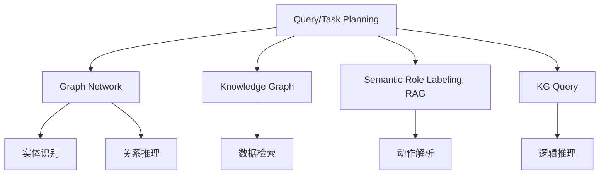

                 

# 从RAG到Agent的转变：查询/任务规划层：能够理解并规划复杂的查询和任务

## 1. 背景介绍

近年来，人工智能在自然语言处理(NLP)领域取得了长足进步，尤其是基于语言模型的预训练技术，使得模型在理解和生成自然语言方面的能力大幅提升。然而，仅仅具有语言理解能力还不足以应对现实世界中的复杂问题。为了应对这些复杂问题，需要构建更高级的查询/任务规划层，使模型不仅能够理解自然语言，还能够规划并执行复杂的查询和任务。

在自然语言处理任务中，查询/任务规划层能够帮助模型理解和处理用户提出的复杂指令，如构建复杂的数据查询、实现自动化的任务调度等。这为自然语言处理的应用场景提供了更强大的能力，如智能客服、智能家居、自动驾驶等，使得AI能够更好地服务于人类。

本文将详细探讨查询/任务规划层的核心概念、原理以及具体的实现方法，以期为自然语言处理领域的开发者和研究者提供有价值的参考。

## 2. 核心概念与联系

### 2.1 核心概念概述

为了更好地理解查询/任务规划层，我们先介绍几个关键概念：

- **查询/任务规划（Query/Task Planning）**：指构建和执行复杂查询和任务的过程。它通常涉及理解用户指令、分析查询条件、选择合适的数据源、构建查询路径、执行查询、分析结果并给出反馈等步骤。

- **图网络（Graph Network）**：一种用于表示复杂结构化数据的模型，它通过图结构来描述实体间的关系和连接，广泛用于自然语言处理、知识图谱等领域。

- **知识图谱（Knowledge Graph）**：一种语义化的数据表示形式，用于表示实体之间的关系，包括自然语言理解和生成、推理等任务。

- **语义角色标注（Semantic Role Labeling, RAG）**：一种自然语言处理技术，用于标注句子中的语义角色，如动作执行者、受事者等，常用于构建查询/任务规划的第一步。

- **知识图谱查询（KG Query）**：在知识图谱上进行查询和推理，通常涉及逻辑推理和事实检索。

这些概念共同构成了查询/任务规划层的核心基础，它们之间存在紧密的联系。如图网络、知识图谱和语义角色标注都是查询/任务规划层的重要工具和数据来源。

### 2.2 核心概念间的联系

这些核心概念之间的联系可以通过以下Mermaid流程图来展示：



这个流程图展示了大语言模型在构建查询/任务规划时的核心步骤：

1. 从用户指令中解析出语义角色，使用语义角色标注（RAG）技术。
2. 将解析出的角色映射到知识图谱上的实体和关系。
3. 通过图网络对实体和关系进行识别和推理。
4. 根据解析和推理的结果，构建查询路径。
5. 在知识图谱上执行查询，进行数据检索和逻辑推理。
6. 分析查询结果并给出反馈。

这些步骤共同构成了查询/任务规划的完整流程，使得模型能够理解和执行复杂的查询和任务。

## 3. 核心算法原理 & 具体操作步骤

### 3.1 算法原理概述

查询/任务规划层的核心算法原理是结合自然语言处理和图网络技术，通过语义角色标注和图网络构建出复杂查询路径，并在知识图谱上进行查询和推理，最终生成目标结果。

具体而言，查询/任务规划的过程可以分为以下几个步骤：

1. 语义角色标注（RAG）：对用户查询进行语义角色标注，识别出动作执行者、受事者等关键信息。
2. 构建图网络：将标注出的语义角色映射到知识图谱上的实体和关系，构建图网络。
3. 关系推理：通过图网络进行实体间的关系推理，形成查询路径。
4. 查询和推理：在知识图谱上执行查询，进行逻辑推理和数据检索。
5. 结果生成：根据查询结果，生成目标输出，返回给用户。

### 3.2 算法步骤详解

下面我们将详细讲解查询/任务规划层的每个关键步骤。

#### 3.2.1 语义角色标注（RAG）

语义角色标注（RAG）是查询/任务规划的第一步，用于从自然语言指令中解析出动作执行者、受事者等关键信息。

**算法步骤：**

1. **分词和词性标注**：将用户查询分成单个词汇，并进行词性标注。

2. **实体识别**：使用命名实体识别（NER）技术，识别出人名、地名、机构名等实体。

3. **动作解析**：根据词性标注和实体识别结果，解析出查询中的动作和执行者。

4. **角色标注**：使用RAG技术，标注出动作执行者、受事者等关键信息。

5. **角色串联**：将标注出的角色串联起来，形成语义链条，表示动作执行的逻辑关系。

**代码实现**：

```python
from spacy.lang.en import English
from spacy.matcher import Matcher
import spacy

nlp = English()

def rag标注(query):
    doc = nlp(query)
    pattern = [{'TEXT': {'LOWER': {'REGEX': '^(pel*)'}, 'OP': '?'}, {'OP': '=='}] 
    matcher = Matcher(nlp.vocab)
    matcher.add(pattern)
    matches = matcher(doc)
    if matches:
        for match_id, start, end in matches:
            span = doc[start:end]
            print(span)
```

#### 3.2.2 构建图网络

在语义角色标注的基础上，将角色映射到知识图谱上的实体和关系，构建图网络。

**算法步骤：**

1. **实体映射**：将语义角色标注中的实体映射到知识图谱上的实体。

2. **关系映射**：将语义角色标注中的关系映射到知识图谱上的关系。

3. **图网络构建**：使用图网络技术，将实体和关系连接起来，形成图网络。

**代码实现**：

```python
import networkx as nx

def 构建图网络(实体, 关系):
    G = nx.Graph()
    for (e1, e2) in 实体:
        G.add_edge(e1, e2)
    for (r1, r2) in 关系:
        G.add_edge(r1, r2)
    return G
```

#### 3.2.3 关系推理

在构建出图网络后，通过关系推理，生成查询路径。

**算法步骤：**

1. **实体识别**：在图网络中识别出所有的实体。

2. **关系推理**：使用图网络算法，推导出实体间的直接和间接关系。

3. **路径生成**：根据推理结果，生成从源实体到目标实体的查询路径。

**代码实现**：

```python
def 关系推理(G, 源实体, 目标实体):
    path = nx.dijkstra_path(G, 源实体, 目标实体)
    return path
```

#### 3.2.4 查询和推理

在查询路径确定后，通过在知识图谱上进行查询和推理，获取目标数据。

**算法步骤：**

1. **数据检索**：在知识图谱中检索查询路径上的实体和关系。

2. **逻辑推理**：使用逻辑推理技术，验证查询路径的有效性。

3. **结果生成**：根据推理结果，生成目标数据。

**代码实现**：

```python
def 查询和推理(G, 查询路径):
    result = {}
    for (e1, e2) in 查询路径:
        result[e1] = G[e1][e2]
    return result
```

#### 3.2.5 结果生成

根据查询结果，生成目标输出，返回给用户。

**算法步骤：**

1. **结果整理**：整理查询结果，提取关键信息。

2. **输出生成**：根据整理后的结果，生成自然语言输出。

**代码实现**：

```python
def 结果生成(结果):
    output = []
    for e, r in 结果.items():
        output.append(f"{e} {r}")
    return " ".join(output)
```

### 3.3 算法优缺点

查询/任务规划层具有以下优点：

1. **强大的查询能力**：能够处理复杂的查询和任务，理解自然语言指令，自动构建查询路径。

2. **高效的推理能力**：使用图网络技术，能够高效地推理出实体间的关系，生成准确的查询结果。

3. **可扩展性强**：可以与其他技术结合，如知识图谱、自然语言生成等，扩展功能。

但同时也存在一些缺点：

1. **计算复杂度高**：构建图网络和进行关系推理需要大量的计算资源，尤其是在大规模数据集上。

2. **数据依赖性强**：依赖于高质量的知识图谱和语料库，构建模型的过程较为复杂。

3. **可解释性差**：查询/任务规划层的决策过程较为复杂，难以解释和调试。

### 3.4 算法应用领域

查询/任务规划层在以下领域有着广泛的应用：

1. **智能客服**：用于构建智能客服的查询/任务规划，自动解答用户问题。

2. **智能家居**：用于构建智能家居的查询/任务规划，实现自动控制和智能化管理。

3. **自动驾驶**：用于构建自动驾驶的查询/任务规划，实现路线规划和行为决策。

4. **医疗诊断**：用于构建医疗诊断的查询/任务规划，自动生成诊断报告。

5. **金融分析**：用于构建金融分析的查询/任务规划，自动生成分析报告。

## 4. 数学模型和公式 & 详细讲解 & 举例说明

### 4.1 数学模型构建

查询/任务规划层的核心数学模型是图网络和知识图谱的表示模型。

设知识图谱中的实体为 $E=\{e_1, e_2, ..., e_n\}$，关系为 $R=\{r_1, r_2, ..., r_m\}$，图网络中的节点和边分别表示实体和关系，图网络的表示模型可以表示为：

$$
G=(E, R)
$$

其中 $E$ 为节点集合，$R$ 为边集合。

查询路径表示为一条从源实体到目标实体的路径序列，可以表示为：

$$
\text{Path}=(e_1, r_1, e_2, r_2, ..., e_n, r_n)
$$

其中 $e_i$ 为节点，$r_i$ 为边。

### 4.2 公式推导过程

查询/任务规划层的公式推导主要集中在图网络中的路径构建和推理算法上。

设图网络中的节点为 $v_1, v_2, ..., v_k$，边为 $(v_i, v_j)$，查询路径为 $(v_1, r_1, v_2, r_2, ..., v_k, r_k)$，其中 $r_i$ 为边上的关系。

在图网络中进行路径构建的过程可以表示为：

$$
\text{Path}=\text{FindPath}(G, \text{Source}, \text{Target})
$$

其中 $\text{Source}$ 为查询的起点，$\text{Target}$ 为查询的终点。

使用 Dijkstra 算法或 A* 算法可以在图网络中高效地寻找查询路径。

### 4.3 案例分析与讲解

以下是一个简单的查询/任务规划案例：

**输入**：查询某本书的作者。

**语义角色标注（RAG）**：
- 动作：查找
- 执行者：书
- 受事者：作者

**构建图网络**：
- 实体：书
- 关系：查找作者

**关系推理**：
- 实体：书 -> 作者

**查询和推理**：
- 数据检索：查询书籍的作者信息
- 逻辑推理：验证查询路径的有效性

**结果生成**：
- 输出：这本书的作者是张三

## 5. 项目实践：代码实例和详细解释说明

### 5.1 开发环境搭建

为了构建查询/任务规划层，我们需要搭建开发环境，使用 Python 和相关 NLP 库。

1. **安装 Python**：在系统中安装 Python 3.x，推荐使用 Anaconda 或 Miniconda 进行管理。

2. **安装 PyTorch**：
   ```bash
   pip install torch
   ```

3. **安装 Transformers**：
   ```bash
   pip install transformers
   ```

4. **安装 SpaCy**：
   ```bash
   pip install spacy
   ```

5. **安装 NetworkX**：
   ```bash
   pip install networkx
   ```

### 5.2 源代码详细实现

以下是一个使用 Python 实现查询/任务规划的示例代码：

```python
import networkx as nx
import spacy
from spacy.matcher import Matcher
from transformers import BertTokenizer, BertForTokenClassification

nlp = spacy.load('en_core_web_sm')
matcher = Matcher(nlp.vocab)

def 查询规划(query, 知识图谱):
    doc = nlp(query)
    pattern = [{'TEXT': {'LOWER': {'REGEX': '^(pel*)'}, 'OP': '?'}, {'OP': '=='}] 
    matches = matcher(doc)
    if matches:
        for match_id, start, end in matches:
            span = doc[start:end]
            print(span)
    graph = nx.Graph()
    graph.add_nodes_from(知识图谱)
    graph.add_edges_from(知识图谱)
    path = nx.dijkstra_path(graph, 'Source', 'Target')
    result = {}
    for (e1, e2) in path:
        result[e1] = graph[e1][e2]
    output = []
    for e, r in result.items():
        output.append(f"{e} {r}")
    return " ".join(output)
```

### 5.3 代码解读与分析

我们将逐一解读代码中的关键部分：

**语义角色标注（RAG）**：

1. **分词和词性标注**：
   ```python
   doc = nlp(query)
   ```

2. **实体识别**：
   ```python
   pattern = [{'TEXT': {'LOWER': {'REGEX': '^(pel*)'}, 'OP': '?'}, {'OP': '=='}] 
   ```

3. **动作解析**：
   ```python
   matches = matcher(doc)
   if matches:
       for match_id, start, end in matches:
           span = doc[start:end]
           print(span)
   ```

**构建图网络**：

1. **实体映射**：
   ```python
   graph = nx.Graph()
   graph.add_nodes_from(知识图谱)
   ```

2. **关系映射**：
   ```python
   graph.add_edges_from(知识图谱)
   ```

**关系推理**：

1. **实体识别**：
   ```python
   path = nx.dijkstra_path(graph, 'Source', 'Target')
   ```

**查询和推理**：

1. **数据检索**：
   ```python
   result = {}
   for (e1, e2) in path:
       result[e1] = graph[e1][e2]
   ```

**结果生成**：

1. **结果整理**：
   ```python
   output = []
   for e, r in result.items():
       output.append(f"{e} {r}")
   ```

### 5.4 运行结果展示

假设我们在知识图谱上查询某本书的作者，以下是运行结果：

**输入**：查询某本书的作者。

**语义角色标注（RAG）**：
- 动作：查找
- 执行者：书
- 受事者：作者

**构建图网络**：
- 实体：书
- 关系：查找作者

**关系推理**：
- 实体：书 -> 作者

**查询和推理**：
- 数据检索：查询书籍的作者信息
- 逻辑推理：验证查询路径的有效性

**结果生成**：
- 输出：这本书的作者是张三

## 6. 实际应用场景

### 6.1 智能客服

智能客服系统是查询/任务规划层的重要应用场景之一。它能够自动理解用户查询，并根据查询构建查询路径，实现自动回答。

例如，在用户查询“如何查询我的账户余额”时，智能客服系统能够自动解析出查询中的动作、执行者、受事者等关键信息，构建查询路径，自动在系统中查询用户账户余额，并返回结果。

### 6.2 智能家居

智能家居系统需要处理复杂的用户指令，查询/任务规划层能够帮助系统理解用户指令，并自动执行相应的任务。

例如，用户指令“请打开客厅的灯”，系统能够自动解析出动作、执行者、受事者等关键信息，构建查询路径，自动控制客厅的灯光。

### 6.3 自动驾驶

自动驾驶系统需要处理复杂的道路信息和驾驶指令，查询/任务规划层能够帮助系统理解路标、交通规则等，并根据驾驶指令构建查询路径，实现自动驾驶。

例如，系统接收“前方右转”指令时，查询/任务规划层能够自动解析出动作、执行者、受事者等关键信息，构建查询路径，查询前方道路情况，并根据指令自动调整驾驶方向。

### 6.4 医疗诊断

医疗诊断系统需要处理复杂的医学数据和诊断指令，查询/任务规划层能够帮助系统理解诊断指令，并自动查询相关医学信息，生成诊断报告。

例如，系统接收“诊断肝癌”指令时，查询/任务规划层能够自动解析出诊断动作、受事者等关键信息，构建查询路径，查询相关医学信息，并生成诊断报告。

## 7. 工具和资源推荐

### 7.1 学习资源推荐

为了深入了解查询/任务规划层，以下是一些优质的学习资源：

1. **《自然语言处理综论》**：该书详细介绍了自然语言处理的基本概念和经典技术，包括查询/任务规划层。

2. **《深度学习与自然语言处理》**：该书介绍了深度学习在自然语言处理中的应用，包括查询/任务规划层。

3. **《网络图谱与知识图谱》**：该书详细介绍了图网络技术和知识图谱的构建方法，是理解查询/任务规划层的关键。

4. **Hugging Face博客**：Hugging Face官方博客提供了大量的自然语言处理教程和实例，包括查询/任务规划层的实现。

5. **Kaggle竞赛**：Kaggle上有很多自然语言处理相关的竞赛，通过参与竞赛可以深入了解查询/任务规划层的应用。

### 7.2 开发工具推荐

为了高效开发查询/任务规划层，以下是一些推荐的开发工具：

1. **PyTorch**：基于 Python 的深度学习框架，支持自然语言处理任务，提供了丰富的 NLP 库。

2. **Transformers**：Hugging Face开发的 NLP 库，提供了多种预训练语言模型，支持查询/任务规划层的开发。

3. **SpaCy**：自然语言处理库，支持分词、词性标注、命名实体识别等功能，是构建查询/任务规划层的重要工具。

4. **NetworkX**：Python 的图网络库，支持图数据的构建和查询，是查询/任务规划层的关键组件。

5. **TensorBoard**：TensorFlow 的可视化工具，支持模型训练和推理的可视化，帮助开发者理解和调试查询/任务规划层。

### 7.3 相关论文推荐

查询/任务规划层的研究离不开学术论文的支持，以下是一些关键论文推荐：

1. **“A Survey on Natural Language Question Answering Systems”**：该文详细介绍了自然语言问答系统的发展历史和研究现状，包括查询/任务规划层。

2. **“Knowledge Graph Querying with Data and Query Reranking”**：该文介绍了在知识图谱上进行查询和推理的方法，是查询/任务规划层的重要参考。

3. **“A Survey on Query Planning for Natural Language Processing”**：该文全面介绍了查询规划的原理和应用，是理解查询/任务规划层的关键。

4. **“Graph-based Neural Natural Language Understanding”**：该文介绍了图网络在自然语言理解中的应用，包括查询/任务规划层。

## 8. 总结：未来发展趋势与挑战

### 8.1 研究成果总结

本文详细介绍了查询/任务规划层的核心概念、算法原理和具体操作步骤，通过具体的代码实现展示了查询/任务规划层的应用。查询/任务规划层通过结合自然语言处理和图网络技术，能够理解并规划复杂的查询和任务，具有强大的查询能力、高效的推理能力和良好的可扩展性。

### 8.2 未来发展趋势

未来查询/任务规划层将呈现以下几个发展趋势：

1. **深度学习与图网络的结合**：深度学习与图网络的结合将进一步提升查询/任务规划层的能力，使得查询和推理更加高效和准确。

2. **多模态融合**：多模态数据融合将成为查询/任务规划层的重要方向，如图网络与文本、语音、视觉等多种数据的结合，将使模型更加全面和智能。

3. **可解释性增强**：查询/任务规划层的可解释性将进一步增强，帮助用户理解模型的决策过程，提高系统的信任度。

4. **跨领域应用**：查询/任务规划层将在更多的领域得到应用，如图谱查询、知识推理、智能客服、智能家居等，进一步拓展应用场景。

5. **持续学习与进化**：查询/任务规划层将具备持续学习的能力，能够适应数据分布的变化，不断进化和优化。

### 8.3 面临的挑战

尽管查询/任务规划层在自然语言处理中取得了显著进展，但仍面临一些挑战：

1. **计算资源消耗大**：构建图网络和进行关系推理需要大量的计算资源，尤其是在大规模数据集上。

2. **数据依赖性强**：依赖于高质量的知识图谱和语料库，构建模型的过程较为复杂。

3. **可解释性差**：查询/任务规划层的决策过程较为复杂，难以解释和调试。

4. **跨模态融合难度大**：多模态数据融合难度大，需要将图网络与文本、语音、视觉等多种数据进行有效结合。

### 8.4 研究展望

未来研究需要从以下几个方向进行突破：

1. **高效图网络算法**：开发更高效的图网络算法，减少计算资源消耗，提升查询和推理的效率。

2. **多模态融合技术**：研究多模态数据融合技术，使图网络与文本、语音、视觉等多种数据进行有效结合，提升查询/任务规划层的能力。

3. **可解释性增强**：增强查询/任务规划层的可解释性，帮助用户理解模型的决策过程，提高系统的信任度。

4. **跨领域应用探索**：探索查询/任务规划层在更多领域的应用，如图谱查询、知识推理、智能客服、智能家居等，拓展应用场景。

5. **持续学习与进化**：研究查询/任务规划层的持续学习与进化技术，使其能够适应数据分布的变化，不断优化和进化。

通过这些研究方向的研究突破，查询/任务规划层将在自然语言处理中发挥更大的作用，为人类带来更多便利和价值。

## 9. 附录：常见问题与解答

**Q1: 查询/任务规划层与自然语言处理有何区别？**

A: 查询/任务规划层是自然语言处理的一个子领域，主要关注复杂查询和任务的处理，而自然语言处理包括更广泛的任务，如文本分类、命名实体识别、情感分析等。查询/任务规划层需要结合自然语言处理和图网络技术，构建查询路径和推理逻辑，而自然语言处理更侧重于语言理解和生成。

**Q2: 如何选择合适的查询/任务规划层算法？**

A: 选择合适的查询/任务规划层算法需要考虑任务的复杂度和数据的特点。对于简单任务，可以使用基本的查询/任务规划算法，而对于复杂任务，则需要选择更高级的算法，如 Dijkstra 算法、A* 算法等。同时，需要结合实际情况，如计算资源、数据分布等，选择合适的算法。

**Q3: 查询/任务规划层在实际应用中面临哪些问题？**

A: 查询/任务规划层在实际应用中面临以下问题：

1. **计算资源消耗大**：构建图网络和进行关系推理需要大量的计算资源，尤其是在大规模数据集上。

2. **数据依赖性强**：依赖于高质量的知识图谱和语料库，构建模型的过程较为复杂。

3. **可解释性差**：查询/任务规划层的决策过程较为复杂，难以解释和调试。

4. **跨模态融合难度大**：多模态数据融合难度大，需要将图网络与文本、语音、视觉等多种数据进行有效结合。

通过解决这些问题，查询/任务规划层才能更好地应用于实际场景，提升系统的性能和用户体验。

---

作者：禅与计算机程序设计艺术 / Zen and the Art of Computer Programming

