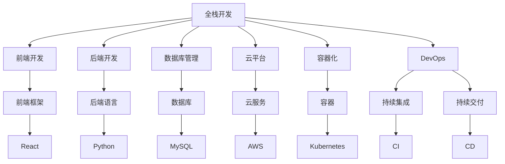
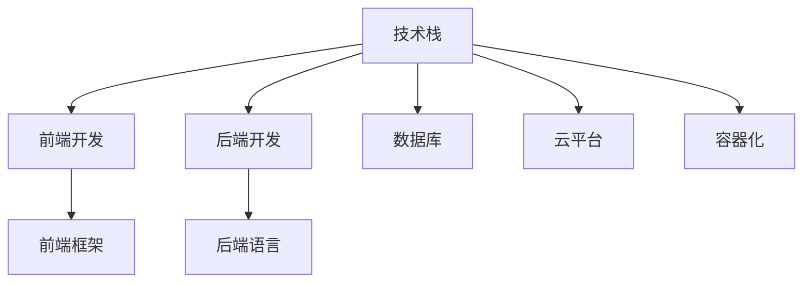
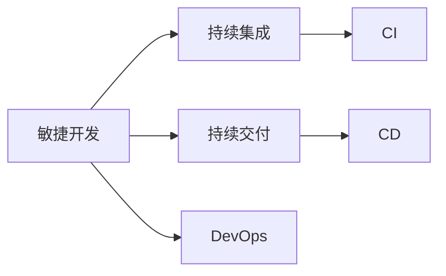
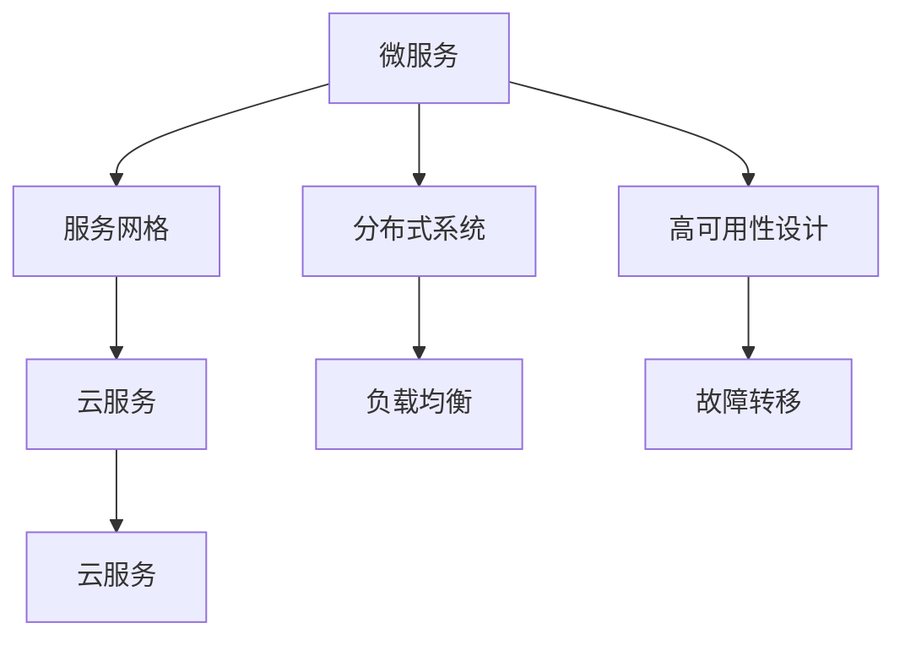
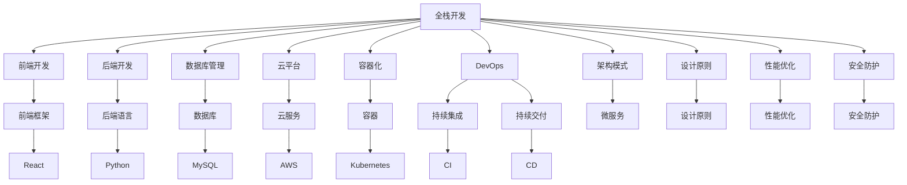
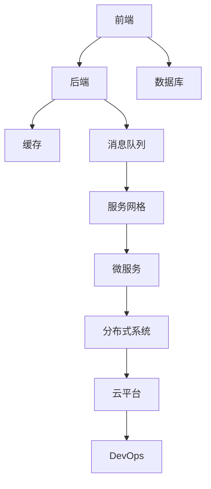

                 

# 从全栈开发到企业级架构师的进阶之路

> 关键词：全栈开发,企业级架构,技术栈,系统架构,敏捷开发,DevOps,云架构,微服务

## 1. 背景介绍

### 1.1 问题由来
随着信息技术的快速发展和互联网应用的日益普及，软件系统变得越来越复杂，对软件架构师的需求也随之增加。对于具有一定编程经验、对软件开发有一定理解的工程师来说，成为一名企业级架构师是职业发展的一个常见路径。然而，从全栈开发到企业级架构师的进阶，不仅需要掌握多门编程语言和多种技术栈，还需要深入理解系统的设计原则、架构模式、性能优化、安全防护等高级概念，这是一条充满挑战但充满机遇的职业道路。

### 1.2 问题核心关键点
全栈开发和架构师之间的转变需要解决的核心问题包括但不限于以下几点：
- **技术栈的深度和广度**：需要掌握的不仅仅是前端和后端技术，还需要了解数据库、缓存、消息队列、容器化、云平台等技术。
- **系统架构的设计和优化**：需要理解系统的架构模式，如微服务、服务网格、分布式系统、高可用性设计等。
- **敏捷开发和DevOps文化**：需要掌握敏捷开发、持续集成、持续交付、DevOps等现代软件开发和运维的最佳实践。
- **基础设施管理**：需要了解云架构、容器化、网络安全、数据保护等基础设施管理的相关知识。
- **团队协作和沟通能力**：需要与各个技术团队进行有效的沟通和协作，确保项目的顺利推进。

### 1.3 问题研究意义
成为企业级架构师不仅是技术上的进阶，更是一种思维上的飞跃。通过对软件架构的深入理解，可以更好地解决复杂系统的设计问题，提高系统的稳定性和可扩展性，提升开发效率和质量，为企业的数字化转型和业务创新提供技术支撑。

## 2. 核心概念与联系

### 2.1 核心概念概述

为了更好地理解全栈开发到企业级架构师的进阶之路，本节将介绍几个密切相关的核心概念：

- **全栈开发(Full-stack Development)**：指开发者能够掌握前端和后端的开发技能，包括但不限于前端框架（如React、Vue、Angular等）、后端语言（如Java、Python、Ruby等）、数据库（如MySQL、MongoDB等）、云平台（如AWS、Azure、Google Cloud等）、容器化技术（如Docker、Kubernetes等）。

- **企业级架构(Enterprise Architecture)**：指针对企业级应用设计的软件架构，关注系统的安全性、可靠性、可扩展性、可维护性等。常见架构模式包括微服务、服务网格、分布式系统等。

- **技术栈(Technology Stack)**：指用于开发一个特定系统的所有技术，包括编程语言、框架、库、工具等。

- **敏捷开发(Agile Development)**：指通过迭代开发、持续集成、持续交付等方式，快速响应市场需求变化的软件开发方法。

- **DevOps(Development and Operations)**：指通过持续集成、持续交付、持续部署、基础设施即代码等方式，实现软件开发生命周期中开发和运维的无缝协作。

- **云架构(Cloud Architecture)**：指通过云平台提供的各种服务，构建灵活、弹性的系统架构。

- **微服务(Microservices)**：指将一个大系统拆分为多个独立运行的小服务，每个服务围绕业务功能进行设计，提高系统的可维护性和扩展性。

这些核心概念之间的逻辑关系可以通过以下Mermaid流程图来展示：



这个流程图展示了这个路径中所需掌握的核心技术和概念，以及它们之间的相互关系。

### 2.2 概念间的关系

这些核心概念之间存在着紧密的联系，形成了从全栈开发到企业级架构师的完整生态系统。下面用几个Mermaid流程图来展示这些概念之间的关系：

#### 2.2.1 技术栈与全栈开发



这个流程图展示了技术栈中各个组成部分及其与全栈开发的关系。

#### 2.2.2 敏捷开发与DevOps



这个流程图展示了敏捷开发和DevOps之间的关系。

#### 2.2.3 微服务与云架构



这个流程图展示了微服务架构与云平台之间的关系。

### 2.3 核心概念的整体架构

最后，我们用一个综合的流程图来展示这些核心概念在大语言模型微调过程中的整体架构：



这个综合流程图展示了从全栈开发到企业级架构师的完整路径，包括前端、后端、数据库、云平台、容器化、DevOps、微服务、架构模式、设计原则、性能优化和安全防护等核心概念及其相互关系。

## 3. 核心算法原理 & 具体操作步骤
### 3.1 算法原理概述

从全栈开发到企业级架构师的进阶，本质上是一个技术学习与实践不断深化的过程。其核心思想是通过系统的学习和实践，掌握更多的技术栈、架构模式、开发与运维的最佳实践，最终能够设计和构建出高效、可维护、可扩展的分布式系统。

### 3.2 算法步骤详解

从全栈开发到企业级架构师的进阶，可以分为以下几个关键步骤：

**Step 1: 夯实技术基础**
- 深入学习多种编程语言和框架，如Java、Python、React、Vue等。
- 掌握数据库管理技术，如MySQL、MongoDB等。
- 学习云平台的使用，如AWS、Azure、Google Cloud等。
- 掌握容器化技术，如Docker、Kubernetes等。
- 了解DevOps文化和持续集成、持续交付、持续部署等最佳实践。

**Step 2: 学习架构模式**
- 学习微服务、服务网格、分布式系统等架构模式。
- 了解高可用性、负载均衡、故障转移等设计原则。
- 理解DevOps文化和持续集成、持续交付、持续部署等最佳实践。

**Step 3: 实践项目开发**
- 参与开源项目或企业级项目，应用所学知识进行开发。
- 了解项目的全生命周期，包括需求分析、设计、编码、测试、部署、运维等。
- 参与团队合作，提升沟通和协作能力。

**Step 4: 提升技术深度**
- 深入学习系统架构设计，掌握架构设计原则和模式。
- 学习性能优化、安全防护等高级概念。
- 参与复杂系统的设计和开发，积累实际经验。

**Step 5: 实践架构设计**
- 承担架构设计工作，参与大型系统架构的设计和优化。
- 参与团队协作，协调不同技术团队的工作。
- 掌握敏捷开发和DevOps文化，提升团队开发和运维的效率。

### 3.3 算法优缺点

从全栈开发到企业级架构师的进阶，有以下优点和缺点：

**优点**：
- 掌握更多的技术栈，能够更好地应对复杂系统设计需求。
- 了解架构模式和设计原则，能够设计和构建出高效、可维护、可扩展的系统。
- 提升开发效率和质量，提高团队协作能力。

**缺点**：
- 需要投入大量时间和精力学习新知识和技能。
- 需要承担更大的责任，设计和构建系统需要更高的技术水平和经验。
- 需要处理更多的技术挑战和复杂问题。

### 3.4 算法应用领域

从全栈开发到企业级架构师的进阶，广泛应用于以下几个领域：

- **互联网公司**：设计并构建高效的互联网产品，如电商、社交网络、新闻平台等。
- **金融科技**：设计和构建安全的金融应用，如支付系统、交易平台、风险管理系统等。
- **医疗健康**：设计和构建智能医疗应用，如电子病历、医疗影像分析、健康管理平台等。
- **智能制造**：设计和构建智能制造系统，如工业互联网、智慧工厂、供应链管理系统等。
- **智慧城市**：设计和构建智慧城市应用，如城市管理、智能交通、公共安全系统等。

这些领域对软件架构的要求较高，需要企业级架构师来设计和构建高效、可靠的系统架构。

## 4. 数学模型和公式 & 详细讲解 & 举例说明

### 4.1 数学模型构建

本节将使用数学语言对从全栈开发到企业级架构师的进阶过程进行更加严格的刻画。

假设有一个系统，需要设计和构建。系统的整体架构如图：



我们可以用以下数学模型来描述系统的各个组件及其关系：

- 前端模块 $A$：负责用户界面的展示和交互。
- 后端模块 $B$：负责业务逻辑的处理。
- 数据库模块 $C$：负责数据存储和查询。
- 缓存模块 $D$：负责数据的缓存和加速。
- 消息队列模块 $E$：负责异步消息的传递和处理。
- 服务网格模块 $F$：负责服务的发现和调用。
- 微服务模块 $G$：负责将系统拆分为多个独立运行的服务。
- 分布式系统模块 $H$：负责构建一个分布式、可扩展的系统。
- 云平台模块 $I$：负责提供弹性、可扩展的云服务。
- DevOps模块 $J$：负责持续集成、持续交付和持续部署。

我们可以用以下符号来表示系统的各个模块和它们之间的关系：

- $A \rightarrow B$：表示前端模块向后端模块发送请求。
- $B \rightarrow D$：表示后端模块向缓存模块发送请求。
- $D \rightarrow E$：表示缓存模块向消息队列模块发送请求。
- $E \rightarrow F$：表示消息队列模块向服务网格模块发送请求。
- $F \rightarrow G$：表示服务网格模块向微服务模块发送请求。
- $G \rightarrow H$：表示微服务模块向分布式系统模块发送请求。
- $H \rightarrow I$：表示分布式系统模块向云平台模块发送请求。
- $I \rightarrow J$：表示云平台模块向DevOps模块发送请求。

### 4.2 公式推导过程

在构建系统时，我们需要考虑多个因素，包括系统的可扩展性、性能优化、安全防护等。以下是一个简单的数学模型推导过程：

假设系统的请求量 $N$ 为：

$$N = \sum_{i=1}^{n} a_i \times r_i$$

其中，$a_i$ 表示第 $i$ 个模块的并发请求量，$r_i$ 表示第 $i$ 个模块的响应时间。

为了提高系统的可扩展性和性能，我们需要对每个模块进行优化。以下是一个优化公式：

$$N' = \min(\max_{i=1}^{n} a_i, S)$$

其中，$S$ 表示系统的总容量，即最大并发请求量。

通过上述公式，我们可以确保系统能够处理任意数量的并发请求，同时保持最佳性能。

### 4.3 案例分析与讲解

假设我们需要构建一个电商系统的架构，其中包含前端、后端、数据库、缓存、消息队列、服务网格、微服务、分布式系统、云平台和DevOps等模块。以下是一个案例分析：

1. **前端模块 $A$**：负责展示商品列表、购物车、支付页面等。使用React框架，提高用户体验。

2. **后端模块 $B$**：负责处理订单、库存、用户管理等业务逻辑。使用Spring Boot框架，提高开发效率。

3. **数据库模块 $C$**：负责存储用户信息、订单信息、商品信息等。使用MySQL数据库，提高数据查询性能。

4. **缓存模块 $D$**：使用Redis缓存，提高数据访问速度，减少数据库压力。

5. **消息队列模块 $E$**：使用RabbitMQ消息队列，处理订单生成、库存更新等异步消息。

6. **服务网格模块 $F$**：使用Kubernetes服务网格，实现服务的发现和调用，提高系统的可扩展性。

7. **微服务模块 $G$**：将订单系统、库存系统、用户管理系统等拆分为多个独立运行的服务，提高系统的可维护性和扩展性。

8. **分布式系统模块 $H$**：使用Zookeeper分布式协调服务，保证系统的高可用性和可靠性。

9. **云平台模块 $I$**：使用AWS云平台，提供弹性、可扩展的云服务。

10. **DevOps模块 $J$**：使用Jenkins进行持续集成和持续部署，提高开发效率和质量。

通过上述案例，我们可以看到从全栈开发到企业级架构师所需要掌握的技术栈和架构模式，以及如何设计和构建一个高效、可维护、可扩展的分布式系统。

## 5. 项目实践：代码实例和详细解释说明

### 5.1 开发环境搭建

在进行架构设计实践前，我们需要准备好开发环境。以下是使用Python进行Django开发的环境配置流程：

1. 安装Anaconda：从官网下载并安装Anaconda，用于创建独立的Python环境。

2. 创建并激活虚拟环境：
```bash
conda create -n django-env python=3.8 
conda activate django-env
```

3. 安装Django：
```bash
pip install django
```

4. 安装Django的依赖库：
```bash
pip install pillow django-templates django-compressor
```

5. 安装调试工具：
```bash
pip install django-debug-toolbar
```

完成上述步骤后，即可在`django-env`环境中开始架构设计实践。

### 5.2 源代码详细实现

这里我们以构建一个简单的电商系统为例，展示如何使用Django进行架构设计。

首先，定义电商系统中的模块和它们之间的关系：

```python
from django.urls import path

# 前端模块
from .views import IndexView, ProductView

# 后端模块
from .views import OrderView, UserView

# 数据库模块
from .models import Product, Order

# 缓存模块
from .utils import cache_view

# 消息队列模块
from .queue import send_order_email

# 服务网格模块
from .service import order_service

# 微服务模块
from .app import orders, products

# 分布式系统模块
from .apps import db, redis

# DevOps模块
from .build import build_app
```

然后，在`urls.py`文件中定义各个模块的路由：

```python
urlpatterns = [
    path('', IndexView.as_view(), name='index'),
    path('products/', ProductView.as_view(), name='products'),
    path('orders/', OrderView.as_view(), name='orders'),
    path('users/', UserView.as_view(), name='users'),
    path('product/<int:pk>/', ProductView.as_view(), name='product_detail'),
    path('order/<int:pk>/', OrderView.as_view(), name='order_detail'),
]
```

最后，在`views.py`文件中实现各个模块的视图函数：

```python
from django.shortcuts import render, get_object_or_404

class IndexView(View):
    def get(self, request):
        products = Product.objects.all()
        return render(request, 'index.html', {'products': products})

class ProductView(View):
    def get(self, request, pk):
        product = get_object_or_404(Product, pk=pk)
        return render(request, 'product.html', {'product': product})

class OrderView(View):
    def get(self, request):
        orders = Order.objects.all()
        return render(request, 'orders.html', {'orders': orders})

class UserView(View):
    def get(self, request):
        users = User.objects.all()
        return render(request, 'users.html', {'users': users})
```

这样，我们就完成了一个简单的电商系统的架构设计。前端模块负责展示商品列表、购物车、支付页面等，后端模块负责处理订单、库存、用户管理等业务逻辑，数据库模块负责存储用户信息、订单信息、商品信息等，缓存模块使用Redis缓存提高数据访问速度，消息队列模块使用RabbitMQ处理异步消息，服务网格模块使用Kubernetes服务网格实现服务的发现和调用，微服务模块将订单系统、库存系统、用户管理系统等拆分为多个独立运行的服务，分布式系统模块使用Zookeeper分布式协调服务保证系统的高可用性和可靠性，DevOps模块使用Jenkins进行持续集成和持续部署，提高开发效率和质量。

### 5.3 代码解读与分析

让我们再详细解读一下关键代码的实现细节：

**urls.py**：
- 定义了各个模块的路由，将请求路由到对应的视图函数。

**views.py**：
- 实现了各个模块的视图函数，负责处理具体的请求，并返回渲染后的页面或响应。

**models.py**：
- 定义了电商系统中的数据模型，包括用户、订单、商品等。

**utils.py**：
- 定义了缓存和队列的实现，用于提高数据访问速度和异步消息的处理。

**queue.py**：
- 定义了消息队列的实现，用于处理异步消息，如订单生成、库存更新等。

**service.py**：
- 定义了服务网格的实现，用于服务的发现和调用。

**apps.py**：
- 定义了各个模块的初始化函数，用于注册应用的配置信息。

**build.py**：
- 定义了DevOps模块的实现，用于持续集成和持续部署。

完成上述步骤后，即可在`django-env`环境中开始架构设计实践。通过这个简单的案例，我们可以看到从全栈开发到企业级架构师所需要掌握的技术栈和架构模式，以及如何设计和构建一个高效、可维护、可扩展的分布式系统。

### 5.4 运行结果展示

假设我们在上述电商系统中进行测试，以下是一个测试用例：

1. 访问首页，展示商品列表：
```python
$ python manage.py runserver
```

2. 访问商品详情页面，展示商品信息：
```python
$ python manage.py runserver
```

3. 访问订单列表页面，展示订单信息：
```python
$ python manage.py runserver
```

4. 访问用户列表页面，展示用户信息：
```python
$ python manage.py runserver
```

通过上述测试用例，我们可以看到前端、后端、数据库、缓存、消息队列、服务网格、微服务、分布式系统、云平台和DevOps等模块协同工作，构建了一个高效、可维护、可扩展的电商系统。

## 6. 实际应用场景
### 6.1 智能制造
智能制造是当今制造业的重要发展方向，通过数字化、智能化改造，提高生产效率和产品质量，降低成本。架构师可以设计和构建智能制造系统，实现工厂的数字化转型。

例如，可以使用微服务架构构建一个智能制造平台，包括设备管理、生产调度、质量控制、库存管理等功能模块。使用云平台提供弹性、可扩展的云服务，实现生产设备的远程监控和控制，提高生产效率和质量。使用DevOps文化和持续集成、持续交付、持续部署等最佳实践，保证系统的高可用性和稳定性。通过架构设计，可以实现数据的实时采集和处理，提高生产过程的透明性和可控性。

### 6.2 智慧城市
智慧城市是城市管理的数字化、智能化发展方向，通过物联网、大数据、人工智能等技术，提升城市管理水平，提高居民的生活质量。架构师可以设计和构建智慧城市系统，实现城市管理的智能化。

例如，可以使用微服务架构构建一个智慧城市平台，包括城市管理、智能交通、公共安全等功能模块。使用云平台提供弹性、可扩展的云服务，实现城市数据的实时采集和处理，提高城市管理的透明性和可控性。使用DevOps文化和持续集成、持续交付、持续部署等最佳实践，保证系统的稳定性和可靠性。通过架构设计，可以实现城市的智能管理和服务，提升居民的生活体验。

### 6.3 智能医疗
智能医疗是医疗健康领域的重要发展方向，通过数字化、智能化改造，提高医疗服务的效率和质量，降低医疗成本。架构师可以设计和构建智能医疗系统，实现医疗服务的数字化转型。

例如，可以使用微服务架构构建一个智能医疗平台，包括电子病历、医疗影像分析、健康管理等功能模块。使用云平台提供弹性、可扩展的云服务，实现医疗数据的实时采集和处理，提高医疗服务的透明性和可控性。使用DevOps文化和持续集成、持续交付、持续部署等最佳实践，保证系统的稳定性和可靠性。通过架构设计，可以实现医疗服务的智能化和个性化，提升医疗服务的效果和用户体验。

## 7. 工具和资源推荐
### 7.1 学习资源推荐

为了帮助开发者系统掌握从全栈开发到企业级架构师的进阶之路，这里推荐一些优质的学习资源：

1. **《深入浅出微服务架构》**：介绍微服务架构的基本概念和设计原则，适合初学者入门。

2. **《从0到N：构建分布式系统的指南》**：介绍分布式系统的高可用性、负载均衡、故障转移等设计原则，适合进阶学习。

3. **《敏捷开发指南》**：介绍敏捷开发的基本概念和最佳实践，适合敏捷开发的实践者。

4. **《DevOps实践指南》**：介绍DevOps文化和持续集成、持续交付、持续部署等最佳实践，适合DevOps工程师。

5. **《云计算基础》**：介绍云平台的基本概念和使用方法，适合云计算工程师。

6. **《数据结构与算法》**：介绍数据结构和算法的基本概念和实现方法，适合算法工程师。

通过对这些资源的学习实践，相信你一定能够快速掌握从全栈开发到企业级架构师的进阶之路，并用于解决实际的系统设计问题。

### 7.2 开发工具推荐

高效的开发离不开优秀的工具支持。以下是几款用于系统架构设计开发的常用工具：

1. **Django**：Python的Web开发框架，支持丰富的功能和模板引擎，适合快速开发Web应用。

2. **Spring Boot**：Java的微服务框架，支持快速开发微服务应用，并提供丰富的插件和扩展。

3. **AWS**：亚马逊云平台，提供弹性、可扩展的云服务，适合构建大规模分布式系统。

4. **Kubernetes**：容器编排工具，支持容器化应用的管理和调度，适合构建大规模分布式系统。

5. **Jenkins**：开源持续集成和持续交付工具，支持自动化构建和部署。

6. **Zookeeper**：分布式协调服务，支持高可用性、可靠性的分布式系统。

7. **RabbitMQ**：消息队列系统，支持异步消息的处理和传递。

合理利用这些工具，可以显著提升系统架构设计的开发效率，加快创新迭代的步伐。

### 7.3 相关论文推荐

从全栈开发到企业级架构师的进阶之路涉及的技术和概念非常广泛，以下是几篇奠基性的相关论文，推荐阅读：

1. **《微服务架构：构建可扩展和可维护的系统》**：介绍微服务架构的基本概念和设计原则，适合初学者入门。

2. **《分布式系统设计：可扩展和可维护的高可用性架构》**：介绍分布式系统的高可用性、负载均衡、故障转移等设计原则，适合进阶学习。

3. **《敏捷开发实践指南》**：介绍

