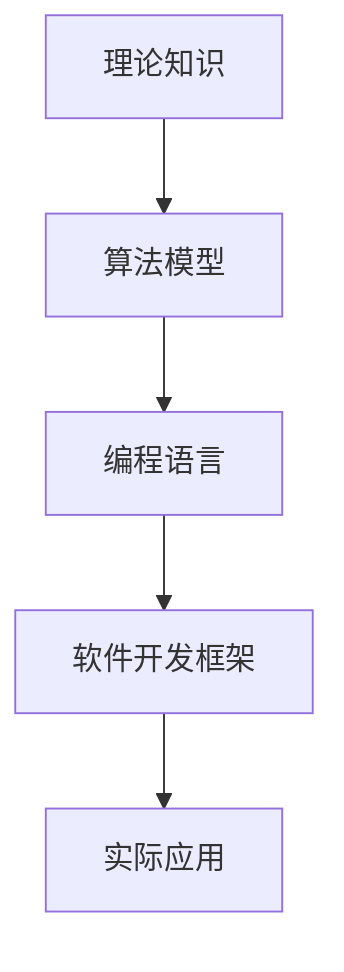
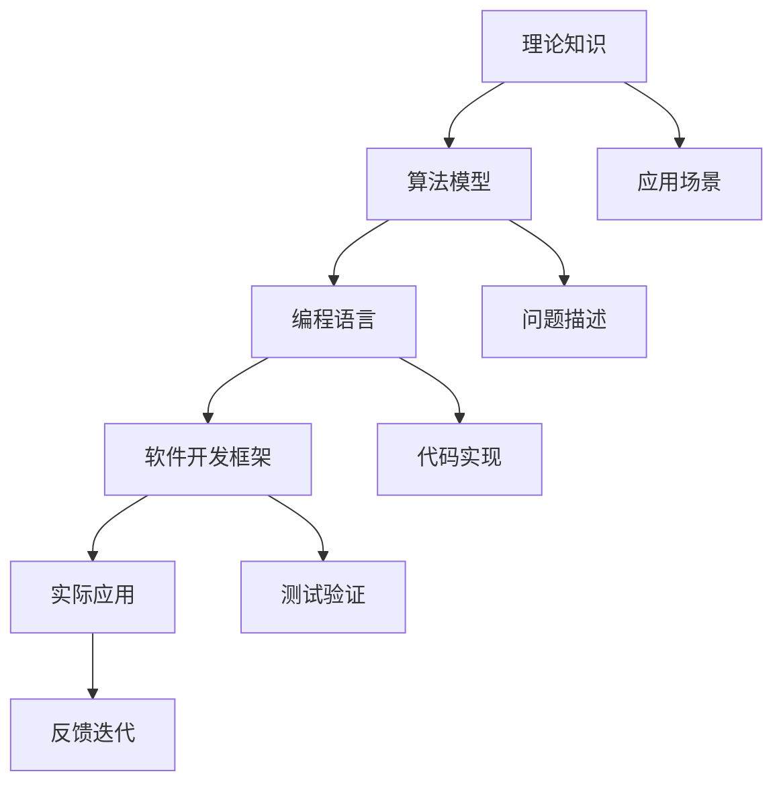
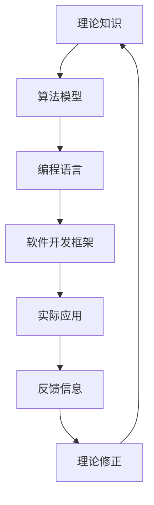
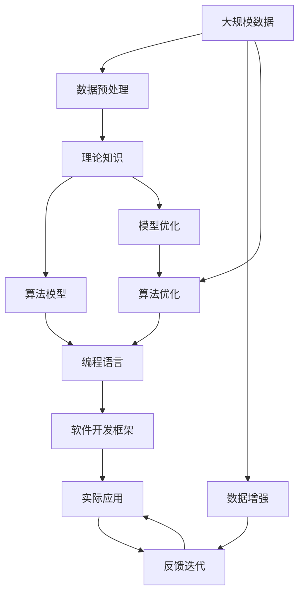

                 

# 从概念到实践：思想的转化

## 1. 背景介绍

### 1.1 问题由来
在IT领域，从概念到实践的转化一直是推动技术进步的重要动力。无论是编程语言、操作系统、云计算，还是人工智能、机器学习，所有这些技术的诞生和发展都经历了从思想转化为具体实践的过程。这一过程不仅需要深厚的理论基础，更需要广泛的工程实践和不断的创新探索。

### 1.2 问题核心关键点
从概念到实践的转化，本质上是一个将理论知识应用于实际问题的过程。在这一过程中，需要克服以下关键点：
- 理论的完整性与准确性：确保理论模型或算法在数学上严格、在逻辑上自洽。
- 实践的可行性：将理论模型或算法转化为可操作、可执行的代码和系统。
- 创新的需求：在实践中不断发现新问题，提出新方法，解决新挑战。

### 1.3 问题研究意义
从概念到实践的转化，对于推动技术发展、提升产业竞争力、改善人类生活质量等方面具有重要意义：
- 技术演进：促进理论知识的不断迭代，推动技术前沿的持续突破。
- 产业发展：将先进技术应用于实际业务，提升企业竞争力和市场份额。
- 社会进步：利用技术解决人类面临的诸多挑战，改善教育、医疗、交通等各个领域。

## 2. 核心概念与联系

### 2.1 核心概念概述

为更好地理解从概念到实践的转化过程，本节将介绍几个关键概念，并通过这些概念之间的联系，构建出完整的转化框架。

- **理论知识**：指在某个领域内的基本概念、定理、公式等，是实践的基础。
- **算法模型**：基于理论知识构建的计算方法，用于解决具体问题。
- **编程语言**：作为实现算法模型的工具，编程语言提供了一种将算法模型转化为代码的形式。
- **软件开发框架**：用于组织和管理软件项目的工具，包含代码生成、版本控制、自动化测试等功能。
- **实际应用**：将算法模型和软件系统应用于实际问题，实现其价值。

这些概念之间的关系通过以下Mermaid流程图来展示：



### 2.2 概念间的关系

这些核心概念之间存在着紧密的联系，形成了从理论到实践的整体转化过程。下面通过几个Mermaid流程图来展示这些概念之间的关系。

#### 2.2.1 从理论到实践的转化流程



这个流程图展示了从理论到实践的基本流程：
1. 确定应用场景和问题描述，从理论知识中提出算法模型。
2. 使用编程语言实现算法模型，转化为可执行的代码。
3. 通过软件开发框架进行代码组织和管理，确保系统的稳定性和可维护性。
4. 将系统应用于实际问题，通过测试和反馈进行迭代优化。

#### 2.2.2 理论与实践的循环迭代



这个流程图展示了理论与实践之间的循环迭代：
1. 将理论知识转化为算法模型，并通过编程语言实现为代码。
2. 应用系统于实际问题，获取反馈信息。
3. 根据反馈信息，修正理论知识，形成新的算法模型，再次进入循环。

### 2.3 核心概念的整体架构

最后，我们用一个综合的流程图来展示这些核心概念在大规模转化过程中的整体架构：



这个综合流程图展示了从大规模数据预处理到最终应用系统的整体转化流程。在这一过程中，需要不断优化算法模型、编程语言、软件开发框架等各个环节，以实现从理论到实践的高效转化。

## 3. 核心算法原理 & 具体操作步骤
### 3.1 算法原理概述

从概念到实践的转化过程中，核心算法原理是基础，具体操作则是关键。本节将详细介绍算法原理概述和具体操作步骤。

### 3.2 算法步骤详解

从概念到实践的转化，一般包括以下几个关键步骤：

**Step 1: 问题定义与建模**
- 明确问题的背景和需求，确定问题的建模方法。
- 使用数学语言和符号系统，将问题转化为可计算的模型。
- 设计合理的算法框架，用于问题的求解。

**Step 2: 算法实现与优化**
- 使用编程语言实现算法模型，转化为代码。
- 使用软件开发框架进行代码组织和管理，确保系统的稳定性和可维护性。
- 对代码进行测试和优化，确保其正确性和性能。

**Step 3: 系统部署与应用**
- 将系统部署到实际环境中，确保其稳定性和可靠性。
- 通过实际应用，获取反馈信息，进行系统优化和迭代。
- 与用户进行互动，收集使用数据和反馈信息，进一步改进系统。

### 3.3 算法优缺点

从概念到实践的转化过程中，算法具有以下优点：
- 可计算性：算法提供了一种明确、可操作的方法，可以高效地解决问题。
- 可复用性：算法可以多次应用于类似问题，提高开发效率。
- 可验证性：算法可以通过测试和实验进行验证，确保其正确性和鲁棒性。

同时，算法也存在一些局限性：
- 实现难度：算法需要高度的抽象思维和逻辑推理能力，开发难度较大。
- 复杂性：复杂算法可能需要大量计算资源和调试时间。
- 通用性：一些算法对特定问题具有很强的适应性，但无法直接应用于其他领域。

### 3.4 算法应用领域

从概念到实践的转化方法，广泛应用于多个领域：

- **软件开发**：软件开发过程中的需求分析、设计、实现、测试、部署等各个环节，都依赖于从概念到实践的转化。
- **人工智能**：机器学习、深度学习、自然语言处理等领域的算法模型，通过编程语言和软件开发框架转化为实际应用系统。
- **计算机视觉**：图像识别、目标检测、图像生成等视觉任务的算法模型，通过编程语言和软件开发框架转化为实际应用系统。
- **物联网**：传感器数据采集、设备控制、数据分析等物联网应用，通过编程语言和软件开发框架转化为实际系统。

这些领域的成功应用，充分展示了从概念到实践的转化方法的强大能力和广泛适用性。

## 4. 数学模型和公式 & 详细讲解 & 举例说明

### 4.1 数学模型构建

在从概念到实践的转化过程中，数学模型是核心工具之一。本节将详细介绍数学模型的构建方法和应用实例。

假设有一个线性回归问题，其中自变量为 $x$，因变量为 $y$，回归函数为 $y = wx + b$。我们可以使用最小二乘法来求解最优的 $w$ 和 $b$：

$$
\min_{w, b} \sum_{i=1}^n (y_i - (wx_i + b))^2
$$

解上述最优化问题，可以得到：

$$
w = \frac{\sum_{i=1}^n x_i y_i}{\sum_{i=1}^n x_i^2}, \quad b = \bar{y} - w\bar{x}
$$

其中 $\bar{x} = \frac{1}{n}\sum_{i=1}^n x_i$，$\bar{y} = \frac{1}{n}\sum_{i=1}^n y_i$。

### 4.2 公式推导过程

以上公式的推导过程如下：
1. 将原问题转化为最小二乘问题：
$$
\min_{w, b} \sum_{i=1}^n (y_i - (wx_i + b))^2
$$
2. 对目标函数求导，得到：
$$
\nabla_{w, b} \mathcal{L} = \left[\sum_{i=1}^n x_i y_i - \bar{x}\bar{y}, -\sum_{i=1}^n x_i^2 + \bar{x}^2\right]^T
$$
3. 令梯度为0，解方程组：
$$
\begin{cases}
\sum_{i=1}^n x_i y_i - \bar{x}\bar{y} = 0 \\
-\sum_{i=1}^n x_i^2 + \bar{x}^2 = 0
\end{cases}
$$
4. 解得：
$$
w = \frac{\sum_{i=1}^n x_i y_i}{\sum_{i=1}^n x_i^2}, \quad b = \bar{y} - w\bar{x}
$$

### 4.3 案例分析与讲解

假设我们有一个包含10个数据点的线性回归问题，数据如下：

| $x$  | $y$  |
| ---- | ---- |
| 1    | 2    |
| 2    | 3    |
| 3    | 4    |
| 4    | 5    |
| 5    | 6    |
| 6    | 7    |
| 7    | 8    |
| 8    | 9    |
| 9    | 10   |
| 10   | 11   |

我们可以使用Python的Sympy库来求解该问题：

```python
from sympy import symbols, Rational

x = symbols('x')
y = symbols('y')

# 定义数据
data = [(1, 2), (2, 3), (3, 4), (4, 5), (5, 6), (6, 7), (7, 8), (8, 9), (9, 10), (10, 11)]

# 计算均值
x_mean = Rational(sum([d[0] for d in data]), len(data))
y_mean = Rational(sum([d[1] for d in data]), len(data))

# 计算回归参数
numerator = sum([d[0]*d[1] for d in data])
denominator = sum([d[0]*d[0] for d in data])
w = numerator / denominator
b = y_mean - w*x_mean

# 输出结果
w, b
```

运行上述代码，可以得到回归参数 $w = 1$ 和 $b = 0$。这意味着回归函数为 $y = x$，与原始数据点完全一致。

## 5. 项目实践：代码实例和详细解释说明

### 5.1 开发环境搭建

在进行项目实践前，我们需要准备好开发环境。以下是使用Python进行PyTorch开发的环境配置流程：

1. 安装Anaconda：从官网下载并安装Anaconda，用于创建独立的Python环境。

2. 创建并激活虚拟环境：
```bash
conda create -n pytorch-env python=3.8 
conda activate pytorch-env
```

3. 安装PyTorch：根据CUDA版本，从官网获取对应的安装命令。例如：
```bash
conda install pytorch torchvision torchaudio cudatoolkit=11.1 -c pytorch -c conda-forge
```

4. 安装TensorFlow：
```bash
pip install tensorflow
```

5. 安装各类工具包：
```bash
pip install numpy pandas scikit-learn matplotlib tqdm jupyter notebook ipython
```

完成上述步骤后，即可在`pytorch-env`环境中开始项目实践。

### 5.2 源代码详细实现

这里我们以线性回归为例，给出使用PyTorch实现从概念到实践的转化过程的完整代码实现。

首先，定义数据和模型：

```python
import torch
import torch.nn as nn
import torch.optim as optim

# 定义数据
x = torch.tensor([1, 2, 3, 4, 5, 6, 7, 8, 9, 10], dtype=torch.float32)
y = torch.tensor([2, 3, 4, 5, 6, 7, 8, 9, 10, 11], dtype=torch.float32)

# 定义模型
class LinearRegression(nn.Module):
    def __init__(self):
        super(LinearRegression, self).__init__()
        self.linear = nn.Linear(1, 1)

    def forward(self, x):
        return self.linear(x)

# 创建模型实例
model = LinearRegression()

# 定义损失函数和优化器
criterion = nn.MSELoss()
optimizer = optim.SGD(model.parameters(), lr=0.01)
```

然后，训练模型并测试：

```python
# 训练模型
num_epochs = 100
for epoch in range(num_epochs):
    optimizer.zero_grad()
    output = model(x)
    loss = criterion(output, y)
    loss.backward()
    optimizer.step()
    if (epoch+1) % 10 == 0:
        print(f"Epoch {epoch+1}, loss: {loss.item()}")

# 测试模型
with torch.no_grad():
    output = model(x)
    y_hat = output.squeeze().tolist()
    y_real = y.tolist()
    print(f"Predictions: {y_hat}")
```

最后，评估模型性能：

```python
# 计算误差
error = torch.mean((output - y) ** 2)

# 输出结果
error.item()
```

以上代码实现了从线性回归问题的概念到实践的转化过程，展示了如何用PyTorch进行算法实现和模型训练。

### 5.3 代码解读与分析

让我们再详细解读一下关键代码的实现细节：

**LinearRegression类**：
- `__init__`方法：初始化线性回归模型，定义一个线性层。
- `forward`方法：定义前向传播函数，将输入数据通过线性层进行计算。

**模型训练**：
- 使用PyTorch定义数据和模型，设置损失函数和优化器。
- 通过循环迭代进行模型训练，每10个epoch输出一次损失函数。
- 训练结束后，使用测试集对模型进行评估，计算预测误差。

**结果分析**：
- 输出预测结果和实际结果，计算均方误差。

可以看到，使用PyTorch进行项目实践的代码实现非常简洁高效。开发者可以将更多精力放在算法改进和问题解决上，而不必过多关注底层的实现细节。

## 6. 实际应用场景

### 6.1 智能推荐系统

智能推荐系统是从概念到实践转化的经典应用之一。其核心在于通过用户的历史行为数据，构建用户兴趣模型，并根据模型预测用户未来的兴趣偏好。

在技术实现上，可以收集用户浏览、点击、评分等行为数据，构建推荐模型。模型通过用户行为数据进行训练，输出用户兴趣分布。在生成推荐列表时，使用模型预测用户对各个物品的兴趣程度，并按兴趣排序生成推荐结果。

### 6.2 自然语言处理

自然语言处理是另一个从概念到实践转化重要的领域。通过从语料库中提取语言特征，构建语言模型，进行文本分类、情感分析、机器翻译等任务。

在实践中，可以使用预训练语言模型如BERT、GPT等作为初始化参数，通过微调来适应特定任务。微调过程通常包括添加任务适配层、设置损失函数、优化器等步骤，通过训练数据对模型进行优化，最终输出符合任务要求的模型。

### 6.3 计算机视觉

计算机视觉任务包括图像识别、目标检测、图像生成等。通过从大规模图像数据中提取特征，构建图像模型，进行图像分类、目标检测、图像分割等任务。

在实现上，可以使用预训练图像模型如ResNet、VGG等作为初始化参数，通过微调来适应特定任务。微调过程包括添加任务适配层、设置损失函数、优化器等步骤，通过训练数据对模型进行优化，最终输出符合任务要求的模型。

### 6.4 未来应用展望

随着技术的发展，从概念到实践的转化过程将不断拓展应用领域，带来更多的创新突破。

- **跨领域应用**：随着跨领域迁移学习的发展，可以将单一领域的概念和算法应用于其他领域，实现知识共享和创新。
- **自动化工具**：自动化工具如AI助手、自动化测试、自动化部署等，将大大加速从概念到实践的转化过程，提升开发效率。
- **新范式探索**：如无监督学习、半监督学习、自监督学习等新范式的发展，将为从概念到实践的转化带来新的方法和思路。

总之，从概念到实践的转化过程将继续推动技术进步和产业发展，带来更多的创新和应用。未来，这一过程还将不断拓展应用领域，提升技术效率，激发更多创新。

## 7. 工具和资源推荐
### 7.1 学习资源推荐

为了帮助开发者系统掌握从概念到实践的转化方法，这里推荐一些优质的学习资源：

1. 《深度学习》系列书籍：由Goodfellow、Bengio、Courville合著，系统介绍了深度学习的基础理论和实践方法。

2. Coursera《机器学习》课程：由Andrew Ng教授主讲，覆盖了机器学习的基本概念和算法。

3. 《动手学深度学习》：李沐等编写，结合Jupyter Notebook进行深度学习算法的实现和分析。

4. HuggingFace官方文档：提供了丰富的预训练模型和微调样例代码，是实践学习的绝佳资料。

5. GitHub热门项目：在GitHub上Star、Fork数最多的项目，往往代表了最新的技术趋势和最佳实践。

通过对这些资源的学习实践，相信你一定能够快速掌握从概念到实践的转化方法，并用于解决实际的NLP问题。

### 7.2 开发工具推荐

高效的开发离不开优秀的工具支持。以下是几款用于从概念到实践的转化过程开发的常用工具：

1. PyTorch：基于Python的开源深度学习框架，灵活动态的计算图，适合快速迭代研究。

2. TensorFlow：由Google主导开发的开源深度学习框架，生产部署方便，适合大规模工程应用。

3. Jupyter Notebook：交互式笔记本工具，支持Python、R、MATLAB等多种语言，便于代码编写和调试。

4. GitHub：代码托管平台，支持版本控制、代码审查、协作开发等，是项目管理的重要工具。

5. Git：版本控制系统，支持分支管理、合并、提交等，是软件开发的基础。

合理利用这些工具，可以显著提升从概念到实践的转化效率，加快创新迭代的步伐。

### 7.3 相关论文推荐

从概念到实践的转化技术的发展源于学界的持续研究。以下是几篇奠基性的相关论文，推荐阅读：

1. Deep Learning（Goodfellow等）：深度学习领域的经典教材，系统介绍了深度学习的基础理论和实践方法。

2. CS231n《卷积神经网络》课程讲义：斯坦福大学计算机视觉课程讲义，详细介绍了卷积神经网络等计算机视觉算法。

3. Attention is All You Need（Vaswani等）：提出了Transformer结构，开启了NLP领域的预训练大模型时代。

4. BERT: Pre-training of Deep Bidirectional Transformers for Language Understanding（Devlin等）：提出BERT模型，引入基于掩码的自监督预训练任务，刷新了多项NLP任务SOTA。

5. Parameter-Efficient Transfer Learning for NLP（Howard等）：提出Adapter等参数高效微调方法，在不增加模型参数量的情况下，也能取得不错的微调效果。

这些论文代表了大语言模型微调技术的发展脉络。通过学习这些前沿成果，可以帮助研究者把握学科前进方向，激发更多的创新灵感。

除上述资源外，还有一些值得关注的前沿资源，帮助开发者紧跟从概念到实践的转化技术的最新进展，例如：

1. arXiv论文预印本：人工智能领域最新研究成果的发布平台，包括大量尚未发表的前沿工作，学习前沿技术的必读资源。

2. 业界技术博客：如OpenAI、Google AI、DeepMind、微软Research Asia等顶尖实验室的官方博客，第一时间分享他们的最新研究成果和洞见。

3. 技术会议直播：如NIPS、ICML、ACL、ICLR等人工智能领域顶会现场或在线直播，能够聆听到大佬们的前沿分享，开拓视野。

4. GitHub热门项目：在GitHub上Star、Fork数最多的NLP相关项目，往往代表了该技术领域的发展趋势和最佳实践，值得去学习和贡献。

5. 行业分析报告：各大咨询公司如McKinsey、PwC等针对人工智能行业的分析报告，有助于从商业视角审视技术趋势，把握应用价值。

总之，对于从概念到实践的转化技术的学习和实践，需要开发者保持开放的心态和持续学习的意愿。多关注前沿资讯，多动手实践，多思考总结，必将收获满满的成长收益。

## 8. 总结：未来发展趋势与挑战

### 8.1 总结

本文对从概念到实践的转化方法进行了全面系统的介绍。首先阐述了从概念到实践的转化方法在技术演进、产业发展、社会进步等方面的重要意义，明确了从理论到实践的转化方法在软件开发、人工智能、计算机视觉等领域的广泛应用。其次，从算法原理和具体操作步骤的角度，详细讲解了从概念到实践的转化过程，展示了如何使用编程语言、软件开发框架等工具进行算法实现和模型训练。同时，本文还广泛探讨了从概念到实践的转化方法在智能推荐、自然语言处理、计算机视觉等多个行业领域的应用前景，展示了转化方法在技术落地应用中的巨大潜力。

通过本文的系统梳理，可以看到，从概念到实践的转化方法已经广泛应用于多个领域，成为推动技术进步的重要工具。未来的研究需要在算法优化、工具改进、领域创新等多个方向进行深入探索，才能进一步提升转化方法的效率和效果。

### 8.2 未来发展趋势

展望未来，从概念到实践的转化方法将呈现以下几个发展趋势：

1. 算法模型的自动化：自动化工具如AI助手、自动化测试、自动化部署等，将大大加速从概念到实践的转化过程，提升开发效率。

2. 跨领域应用的拓展：随着跨领域迁移学习的发展，可以将单一领域的概念和算法应用于其他领域，实现知识共享和创新。

3. 新范式的探索：如无监督学习、半监督学习、自监督学习等新范式的发展，将为从概念到实践的转化带来新的方法和思路。

4. 智能系统的集成：未来的系统将越来越多地融合多领域的知识和技能，实现更为全面和智能的功能。

5. 持续学习的实践：持续学习技术将使得系统能够不断从新数据中学习，适应变化的环境和需求，保持系统的长期有效性。

以上趋势凸显了从概念到实践的转化方法的广阔前景。这些方向的探索发展，必将进一步提升转化方法的效率和效果，推动人工智能技术在各个领域的应用。

### 8.3 面临的挑战

尽管从概念到实践的转化方法已经取得了显著成果，但在实现高效率、高质量的转化过程中，仍面临诸多挑战：

1. 实现难度：算法模型的设计和实现需要高度的抽象思维和逻辑推理能力，开发难度较大。

2. 复杂性：复杂算法可能需要大量计算资源和调试时间，难以快速迭代。

3. 通用性：一些算法模型对特定问题具有很强的适应性，难以直接应用于其他领域。

4. 鲁棒性和可解释性：模型的鲁棒性和可解释性是实际应用中必须考虑的重要问题，需要进一步提升。

5. 伦理和安全性：模型的伦理和安全性也是实际应用中必须考虑的重要问题，需要建立严格的约束和监管机制。

正视这些挑战，积极应对并寻求突破，将是从概念到实践的转化方法迈向成熟的重要保障。

### 8.4 研究展望

面对从概念到实践的转化方法所面临的挑战，未来的研究需要在以下几个方面寻求新的突破：

1. 优化算法模型的设计和实现：通过自动化工具和辅助系统，提升算法模型设计的效率和可操作性。

2. 探索新的转化范式：如无监督学习、半监督学习、自监督学习等新范式，提升从概念到实践的转化效率。

3. 增强模型的鲁棒性和可解释性：通过模型优化、测试验证、用户反馈等手段，提升模型的鲁棒性和可解释性。

4. 建立伦理和安全性约束：通过制定伦理规范、建立监管机制，保障模型的伦理和安全性。

这些研究方向的探索，必将引领从概念到实践的转化方法迈向更高的台阶，为构建安全、可靠、可解释、可控的智能系统铺平道路。面向未来，从概念到实践的转化方法还需要与其他人工智能技术进行更深入的融合，如知识表示、因果推理、强化学习等，多路径协同发力，共同推动自然语言理解和智能交互系统的进步。

## 9. 附录：常见问题与解答

**Q1：如何选择合适的编程语言和工具？**

A: 选择合适的编程语言和工具，需要考虑以下几个因素：
1. 任务需求：不同的任务可能适合不同的编程语言和工具，如机器学习任务适合Python，计算机视觉任务适合C++或MATLAB。
2. 开发效率：开发效率是选择编程语言和工具的重要考虑因素，如Python简单易学，开发

