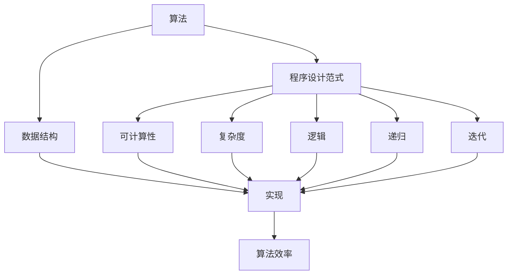

                 

# 从概念到洞见：思想的演变

> 关键词：思想演变, 算法原理, 核心概念, 数学模型, 实际应用, 未来展望

## 1. 背景介绍

### 1.1 问题由来
人类文明的发展史，从某种程度上讲，就是思想和技术的演进史。从原始社会的简单工具到现代科技的复杂系统，每个时代都留下了深刻的思想烙印。而随着科技的不断进步，这些思想也在不断演变，推动着社会的进步和发展。

在计算机科学领域，思想和技术的演进同样迅猛。从早期的汇编语言、高级语言，到现在的深度学习、人工智能，技术的发展不断突破旧有观念，孕育新概念。这不仅体现在算法和工具上，也体现在其背后深层次的哲学思考。

### 1.2 问题核心关键点
本文将聚焦于计算机科学领域中的思想演变，尤其是从算法原理到应用实践的变迁。我们将从概念到洞见，逐步深入探讨计算机科学中重要的思想和原理，及其演变过程。

## 2. 核心概念与联系

### 2.1 核心概念概述

为更好地理解计算机科学中思想和原理的演变，本节将介绍几个密切相关的核心概念：

- 算法（Algorithm）：解决特定问题的一系列步骤和规则。计算机科学中的算法构成了现代科技的基础。
- 数据结构（Data Structure）：用于组织、存储和访问数据的抽象模型。数据结构是算法实现的基础。
- 程序设计范式（Programming Paradigm）：编程时的思考方式和方法。如面向过程、面向对象、函数式等。
- 可计算性（Computability）：问题是否可以通过算法在有限时间内解决。
- 复杂度（Complexity）：算法所需的时间和空间资源。如时间复杂度、空间复杂度。
- 逻辑（Logic）：推理、证明和数学基础。计算机科学中的逻辑常用于定义和分析算法。
- 递归（Recursion）：函数或算法重复调用自身的编程技巧。
- 迭代（Iteration）：重复执行相同操作直到满足特定条件的过程。

这些概念构成了计算机科学思想演变的基石，它们相互作用，推动了计算机技术从原理到实践的不断进化。

### 2.2 概念间的关系

这些核心概念之间的逻辑关系可以通过以下Mermaid流程图来展示：



这个流程图展示了这个核心概念的整体架构：

1. 算法是计算机科学的基础，用于解决特定问题。
2. 数据结构为算法的实现提供了抽象模型，影响算法的效率。
3. 程序设计范式决定了算法和数据结构的编程方式。
4. 可计算性判断问题是否可以通过算法解决。
5. 复杂度评估算法所需的资源。
6. 逻辑提供算法定义和分析的数学基础。
7. 递归和迭代是编程时的两种常用技巧。

## 3. 核心算法原理 & 具体操作步骤
### 3.1 算法原理概述

算法原理是计算机科学中最重要的部分之一。它不仅决定了一个问题的解决方式，也影响了一个系统的性能和效率。本节将介绍几种经典算法原理及其演变。

#### 3.1.1 分治算法（Divide and Conquer）
分治算法是一种将大问题分解成小问题求解的策略。其核心思想是将问题分成若干个子问题，分别解决，最后将子问题的解合并得到原问题的解。

经典例子包括快速排序（Quick Sort）、归并排序（Merge Sort）等。这些算法都通过递归的方式实现分治，提高了排序效率。

#### 3.1.2 动态规划（Dynamic Programming）
动态规划是一种将复杂问题分解为简单子问题求解的策略。它通过保存子问题的解，避免重复计算，提高效率。

经典例子包括背包问题（Knapsack Problem）、最长公共子序列（Longest Common Subsequence）等。动态规划常用于优化问题，如最短路径、最小生成树等。

#### 3.1.3 贪心算法（Greedy Algorithm）
贪心算法是一种每次选择局部最优解的策略，希望通过迭代逼近全局最优解。其核心思想是在每一步选择中都采取当前状态下最好或最优的解决方案。

经典例子包括最短路径问题（Dijkstra算法）、最小生成树问题（Prim算法）等。

### 3.2 算法步骤详解
以快速排序为例，展示分治算法的基本步骤：

1. 选择基准值（Pivot）。
2. 将小于基准值的元素放在左边，大于基准值的元素放在右边。
3. 递归对左右子序列进行排序。

具体代码实现如下：

```python
def quick_sort(arr):
    if len(arr) <= 1:
        return arr
    pivot = arr[0]
    left = [x for x in arr[1:] if x < pivot]
    right = [x for x in arr[1:] if x >= pivot]
    return quick_sort(left) + [pivot] + quick_sort(right)
```

### 3.3 算法优缺点
分治算法和动态规划都是常用的高效算法，但也各有优缺点：

#### 分治算法的优点
- 可扩展性强，适用于各种规模的问题。
- 可以通过并行化提高效率。
- 具有递归性质，易于理解和实现。

#### 分治算法的缺点
- 需要较多的递归调用，占用较多栈空间。
- 递归深度可能过深，导致栈溢出。
- 对于某些问题，分治算法可能不够高效。

#### 动态规划的优点
- 避免重复计算，节省时间和空间。
- 适用于优化问题，具有较好的效率。
- 可以通过状态转移方程求解，易于理解。

#### 动态规划的缺点
- 需要提前计算所有子问题的解，占用较多内存。
- 状态转移方程的推导和求解可能比较复杂。
- 对于某些问题，动态规划可能不够直观。

### 3.4 算法应用领域
算法原理广泛应用于计算机科学的各个领域，包括但不限于：

- 数据结构：如二叉树、图算法、哈希表等。
- 操作系统：如调度算法、磁盘管理等。
- 数据库：如索引、事务处理等。
- 网络通信：如路由算法、流量控制等。
- 机器学习：如优化算法、特征提取等。

## 4. 数学模型和公式 & 详细讲解 & 举例说明

### 4.1 数学模型构建
数学模型是计算机科学中不可或缺的工具，它用于抽象和描述问题，并用于分析和优化算法。本节将介绍几个常用的数学模型。

#### 4.1.1 线性回归模型（Linear Regression）
线性回归模型用于描述因变量与自变量之间的线性关系。其基本形式为：

$$
y = \beta_0 + \beta_1x_1 + \beta_2x_2 + ... + \beta_nx_n + \epsilon
$$

其中，$y$ 是因变量，$x_1, x_2, ..., x_n$ 是自变量，$\beta_0, \beta_1, \beta_2, ..., \beta_n$ 是回归系数，$\epsilon$ 是误差项。

#### 4.1.2 最大熵模型（Maximum Entropy Model）
最大熵模型用于在给定条件概率分布的情况下，寻找最合适的概率分布。其基本形式为：

$$
p(x) = \frac{e^{H(x)}}{Z} \quad \text{其中} \quad H(x) = \sum_i h_i(x_i) - \log Z
$$

其中，$p(x)$ 是概率分布，$h_i(x_i)$ 是约束条件，$Z$ 是归一化因子。

### 4.2 公式推导过程
以线性回归模型为例，展示其基本推导过程。

给定一组训练数据 $(x_i, y_i)$，$x_i$ 是自变量，$y_i$ 是因变量，我们的目标是找到最优的回归系数 $\beta$，使得模型预测值尽可能接近真实值。

设 $\theta$ 是回归系数向量，其形式为：

$$
\theta = \begin{bmatrix}
\beta_0 \\
\beta_1 \\
\vdots \\
\beta_n
\end{bmatrix}
$$

最小化均方误差损失函数：

$$
L(\theta) = \frac{1}{2m} \sum_{i=1}^m(y_i - \theta^T x_i)^2
$$

其中 $m$ 是样本数。

求导并令导数为零，得到：

$$
\frac{\partial L(\theta)}{\partial \theta} = -\frac{1}{m} \sum_{i=1}^m(x_i)(y_i - \theta^T x_i) = 0
$$

化简得到：

$$
\sum_{i=1}^m x_i x_i^T \theta = \sum_{i=1}^m x_i y_i
$$

进一步化简得到：

$$
\theta = (X^T X)^{-1} X^T Y
$$

其中 $X$ 是自变量的矩阵，$Y$ 是因变量的向量。

### 4.3 案例分析与讲解
以最大熵模型为例，展示其在自然语言处理中的应用。

在自然语言处理中，最大熵模型常用于文本分类、词性标注等任务。设文本集合为 $\{x_1, x_2, ..., x_m\}$，每个文本 $x_i$ 可以表示为 $\{w_1, w_2, ..., w_n\}$。假设 $w_j$ 的词性为 $y_j \in \{POS, NEG, NEU\}$，我们的目标是找到一个最大熵模型，使得其预测的词性概率分布与训练数据一致。

设 $h_i(x_i)$ 是约束条件，形式为：

$$
h_1(x_i) = 1
$$

$$
h_2(x_i) = \sum_{j=1}^n \log p(y_j|x_i)
$$

其中 $p(y_j|x_i)$ 是条件概率。

设 $p(x_i)$ 是概率分布，形式为：

$$
p(x_i) = \frac{e^{H(x_i)}}{Z}
$$

其中 $H(x_i)$ 是约束条件之和，$Z$ 是归一化因子。

通过最大化熵，得到最优的概率分布 $p(x_i)$，用于文本分类和词性标注。

## 5. 项目实践：代码实例和详细解释说明

### 5.1 开发环境搭建
在进行算法实现前，我们需要准备好开发环境。以下是使用Python进行PyTorch开发的环境配置流程：

1. 安装Anaconda：从官网下载并安装Anaconda，用于创建独立的Python环境。

2. 创建并激活虚拟环境：
```bash
conda create -n pytorch-env python=3.8 
conda activate pytorch-env
```

3. 安装PyTorch：根据CUDA版本，从官网获取对应的安装命令。例如：
```bash
conda install pytorch torchvision torchaudio cudatoolkit=11.1 -c pytorch -c conda-forge
```

4. 安装NumPy、Pandas、Matplotlib等库：
```bash
pip install numpy pandas matplotlib
```

5. 安装Jupyter Notebook：
```bash
pip install jupyter notebook
```

完成上述步骤后，即可在`pytorch-env`环境中开始算法实现。

### 5.2 源代码详细实现
以下是一个使用PyTorch实现快速排序的示例代码：

```python
import torch

def quick_sort(arr):
    if len(arr) <= 1:
        return arr
    pivot = arr[0]
    left = [x for x in arr[1:] if x < pivot]
    right = [x for x in arr[1:] if x >= pivot]
    return quick_sort(left) + [pivot] + quick_sort(right)
```

### 5.3 代码解读与分析
**quick_sort函数**：
- `if len(arr) <= 1:` 判断数组长度是否小于等于1，如果是，则直接返回数组。
- `pivot = arr[0]` 选择第一个元素作为基准值。
- `left = [x for x in arr[1:] if x < pivot]` 生成小于基准值的子数组。
- `right = [x for x in arr[1:] if x >= pivot]` 生成大于等于基准值的子数组。
- `return quick_sort(left) + [pivot] + quick_sort(right)` 递归对左右子数组进行排序，并将结果合并。

## 6. 实际应用场景

### 6.1 排序算法在编程语言中的应用
排序算法是编程语言中常用的基础功能之一，可以用于对数据进行快速排序、归并排序等操作。Python中的内置函数`sorted`就使用了快速排序算法，其底层实现基于C语言。

### 6.2 动态规划在机器学习中的应用
动态规划在机器学习中常用于优化问题，如线性回归、逻辑回归等。其思想是将复杂问题分解为简单子问题求解，避免重复计算，提高效率。

### 6.3 贪心算法在网络通信中的应用
贪心算法在网络通信中常用于路由算法、流量控制等。其思想是在每一步选择中都采取当前状态下最好或最优的解决方案，实现最优网络通信。

### 6.4 未来应用展望
未来，算法原理将进一步应用于更多领域，如自动驾驶、量子计算等。算法思想将贯穿科技发展的各个方面，推动技术的不断进步。

## 7. 工具和资源推荐

### 7.1 学习资源推荐
为了帮助开发者系统掌握算法原理和实践技巧，这里推荐一些优质的学习资源：

1. 《算法导论》：由Thomas H. Cormen等人合著的经典算法教材，全面介绍了各种算法思想和实现方法。
2. Coursera的《算法设计与分析》课程：由普林斯顿大学开设的算法课程，提供丰富的视频和习题资源。
3. GitHub上的开源算法库：如NumPy、SciPy、SymPy等，提供了大量的数学库和算法实现。
4. LeetCode和HackerRank：提供大量的算法题目和在线评测环境，方便开发者练习和调试。

### 7.2 开发工具推荐
高效的开发离不开优秀的工具支持。以下是几款用于算法开发的常用工具：

1. PyTorch：基于Python的开源深度学习框架，灵活动态的计算图，适合快速迭代研究。
2. TensorFlow：由Google主导开发的开源深度学习框架，生产部署方便，适合大规模工程应用。
3. NumPy：Python中的科学计算库，提供了高效的多维数组操作和数学函数。
4. Jupyter Notebook：交互式编程环境，支持Python、R、 Julia等多种语言，方便进行算法验证和调试。

### 7.3 相关论文推荐
算法原理的研究一直是计算机科学的热点话题，以下是几篇奠基性的相关论文，推荐阅读：

1. Knuth, Donald E. "The Art of Computer Programming, Volume 3: Sorting and Searching." Addison-Wesley Professional; 2nd edition (1998).

2. Cormen, Thomas H., et al. "Introduction to Algorithms." MIT Press; 3rd edition (2009).

3. Karp, Richard M. "Reductions, Pseudopolynomial Time, and the Generalized Traveling Salesman Problem." Proceedings of the Twenty-Third Annual ACM Symposium on Theory of Computing (1981).

这些论文代表了算法原理的最新研究成果，通过学习这些前沿成果，可以帮助研究者把握学科前进方向，激发更多的创新灵感。

## 8. 总结：未来发展趋势与挑战

### 8.1 研究成果总结
本文从算法原理和应用实践的角度，详细介绍了计算机科学中的核心思想和概念。从分治算法、动态规划到贪心算法，从线性回归、最大熵模型到实际应用，深入探讨了算法思想的发展历程及其应用前景。

### 8.2 未来发展趋势
未来，算法原理将继续推动计算机科学的发展，呈现以下几个趋势：

1. 算法高效化：未来将开发更多高效算法，降低计算资源消耗，提高算法效率。
2. 算法可解释化：未来将开发更多可解释性强的算法，提升算法透明性。
3. 算法自动化：未来将开发更多自动化算法，减少人工干预，提高算法开发效率。
4. 算法融合化：未来将开发更多融合多学科知识的算法，实现跨领域应用。

### 8.3 面临的挑战
尽管算法原理不断发展，但在实际应用中仍面临诸多挑战：

1. 算法复杂度高：一些复杂算法如深度学习、进化算法等，需要大量计算资源和时间。
2. 算法可扩展性差：一些算法如递归算法、动态规划算法等，难以扩展到大规模数据集。
3. 算法性能不稳定：一些算法如贪心算法、启发式算法等，在特定条件下可能表现不佳。
4. 算法数据依赖性强：一些算法如深度学习算法、最大熵模型等，对数据质量和数量要求较高。

### 8.4 研究展望
面对算法原理在实际应用中面临的挑战，未来的研究需要在以下几个方面寻求新的突破：

1. 优化算法结构：开发更加高效、可扩展的算法结构，减少计算资源消耗，提升算法性能。
2. 开发可解释性算法：开发更多可解释性强的算法，提升算法的透明性和可理解性。
3. 自动化算法开发：开发更多自动化算法开发工具，提高算法开发效率。
4. 融合跨领域知识：开发更多融合多学科知识的算法，实现跨领域应用。

这些研究方向的探索，必将引领算法原理不断演进，推动计算机科学的发展。未来，算法原理将继续与人工智能、大数据、区块链等前沿技术结合，引领科技发展的新潮流。

