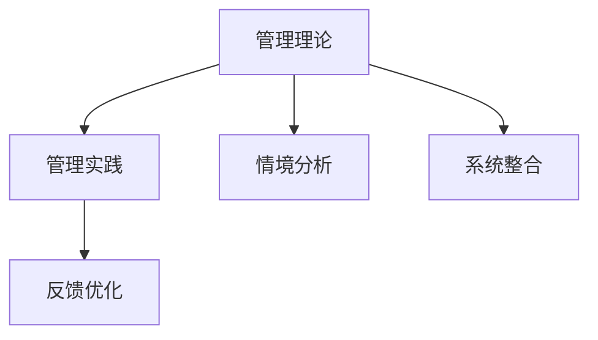
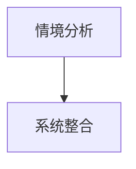
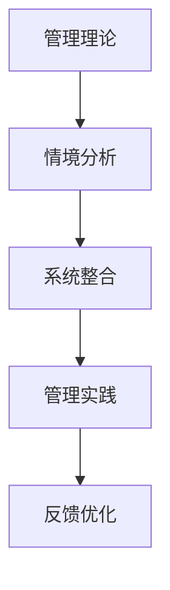

                 

# 从经典到实践：管理理论的落地

## 1. 背景介绍

### 1.1 问题由来

在管理科学的发展历程中，无数理论和实践不断涌现，但如何将这些理论有效地应用于企业管理实践中，一直是管理学者和从业者共同关注的重要课题。传统的管理学理论大多建立在抽象模型和简化假设之上，缺乏对具体情境的深入分析和细化指导。而现代企业面对的市场环境更为复杂多变，管理问题也日趋多元化和精细化。因此，如何将管理理论具体化、操作化，实现理论与实践的有机结合，成为提升企业管理效率和竞争力的关键。

### 1.2 问题核心关键点

企业管理理论的落地，本质上是理论应用过程中的具体化、操作化、系统化。具体而言，包括以下几个核心关键点：

1. **理论的理解与转化**：管理者需要深刻理解不同管理理论的核心思想和应用场景，将其转化为具体的管理操作和实践方案。
2. **情境的适应与调整**：将通用理论应用于特定情境时，需要根据企业的实际情况进行灵活调整，避免生搬硬套。
3. **系统的整合与协调**：不同管理理论之间可能存在冲突，需要管理者具备系统思维，整合协调各方资源，形成一致的管理体系。
4. **实践的反馈与优化**：管理实践的效果需要不断反馈和调整，形成闭环管理，确保管理理论的有效落地。

### 1.3 问题研究意义

管理理论的落地应用，对于提升企业的管理效率和竞争优势具有重要意义：

1. **提高管理效率**：通过系统化、规范化的管理实践，能够更有效地协调企业资源，提升运营效率。
2. **增强企业竞争力**：科学的管理理论能够帮助企业快速响应市场变化，增强市场适应性和竞争力。
3. **促进员工发展**：通过实践，将管理理论具体化，有助于员工更好地理解和应用，提升个人能力和职业素养。
4. **推动企业创新**：管理理论的落地，结合企业实际情况，能够激发新的管理思路和创新点，推动企业持续进步。

## 2. 核心概念与联系

### 2.1 核心概念概述

为更好地理解管理理论的落地应用，本节将介绍几个密切相关的核心概念：

- **管理理论**：指研究企业管理实践的理论和方法，包括战略管理、人力资源管理、运营管理、财务管理等各个方面。
- **管理实践**：指企业管理者根据管理理论，结合企业实际情况，开展的具体管理活动和操作。
- **情境分析**：指对企业的内外环境进行系统分析，识别出管理实践的关键影响因素。
- **系统整合**：指将多种管理理论和方法整合到一个统一的管理体系中，形成协调一致的管理框架。
- **反馈优化**：指在管理实践中，根据效果反馈，不断调整优化管理方法和策略，形成闭环管理。

这些核心概念之间的逻辑关系可以通过以下Mermaid流程图来展示：



这个流程图展示了大语言模型微调过程中各个核心概念的关系和作用：

1. 管理理论作为理论基础，提供指导和工具。
2. 情境分析对企业内外环境进行深入分析，识别关键因素。
3. 系统整合将多种理论和方法整合协调，形成一致的管理体系。
4. 反馈优化在实践中进行效果评估和调整，实现闭环管理。

### 2.2 概念间的关系

这些核心概念之间存在着紧密的联系，形成了管理理论落地的完整生态系统。下面我通过几个Mermaid流程图来展示这些概念之间的关系。

#### 2.2.1 管理理论的应用流程


这个流程图展示了从理论到实践的完整流程。管理理论通过情境分析，识别关键因素；系统整合将这些因素结合起来，形成一致的实践方案；管理实践在执行中不断进行反馈优化，形成闭环管理。

#### 2.2.2 情境分析与系统整合的关系



情境分析是对企业内外环境的深入分析，识别出影响管理实践的关键因素。系统整合将这些因素结合起来，形成协调一致的管理体系，确保管理实践的有效性。

#### 2.2.3 反馈优化在管理实践中的应用


反馈优化是在管理实践中进行效果评估和调整，确保管理理论的有效落地。通过不断的反馈优化，管理实践能够持续改进，提升企业的管理效率和竞争力。

### 2.3 核心概念的整体架构

最后，我们用一个综合的流程图来展示这些核心概念在大语言模型微调过程中的整体架构：



这个综合流程图展示了从管理理论到管理实践，再到反馈优化的完整过程。管理理论通过情境分析，识别关键因素；系统整合将这些因素结合起来，形成一致的实践方案；管理实践在执行中不断进行反馈优化，形成闭环管理。

## 3. 核心算法原理 & 具体操作步骤
### 3.1 算法原理概述

管理理论的落地应用，本质上是一个理论与实践相结合的过程。其核心思想是将管理理论转化为具体的管理操作和实践方案，确保管理实践的有效性和可操作性。具体而言，包括以下几个关键步骤：

1. **理论理解**：深入理解不同管理理论的核心思想和应用场景。
2. **情境分析**：对企业的内外环境进行系统分析，识别关键因素。
3. **系统整合**：将多种管理理论和方法整合到一个统一的管理体系中，形成协调一致的管理框架。
4. **实践执行**：根据系统整合后的管理方案，具体实施管理实践。
5. **反馈优化**：在管理实践中，根据效果反馈，不断调整优化管理方法和策略，形成闭环管理。

### 3.2 算法步骤详解

以下是管理理论落地的详细步骤：

**Step 1: 理论理解与转化**

1. **理论学习**：管理者需要系统学习不同管理理论的核心内容和方法，理解其基本原理和应用场景。
2. **理论转化**：将理论转化为具体的管理操作和实践方案，形成管理手册和操作指南。

**Step 2: 情境分析**

1. **环境评估**：对企业内外环境进行系统评估，识别关键影响因素，如市场环境、组织结构、企业文化等。
2. **需求分析**：根据环境评估结果，识别企业的管理需求和痛点，明确管理改进的方向和目标。

**Step 3: 系统整合**

1. **理论整合**：将多种管理理论和方法整合到一个统一的管理体系中，确保各个理论和方法之间的协调一致。
2. **框架设计**：根据整合后的理论，设计具体的管理框架和流程，形成系统的管理方案。

**Step 4: 实践执行**

1. **资源配置**：根据管理方案，合理配置和管理企业资源，确保各项管理活动的顺利实施。
2. **过程监控**：在管理实践过程中，进行实时监控和跟踪，及时发现和解决问题。

**Step 5: 反馈优化**

1. **效果评估**：根据管理实践的效果，进行系统评估，识别出存在的问题和不足。
2. **优化调整**：根据评估结果，对管理方案进行优化调整，形成新的管理方案。

### 3.3 算法优缺点

管理理论的落地应用，具有以下优点：

1. **系统化管理**：通过系统整合，确保管理实践的协调一致，提升管理效率。
2. **科学指导**：管理理论提供科学的指导和工具，帮助企业制定合理的管理策略。
3. **适应性强**：不同情境下的管理理论能够灵活调整，适应企业的实际需求。

同时，也存在一些缺点：

1. **理论与实践脱节**：理论转化为实践时，可能存在理解偏差和操作难度，导致实践效果不理想。
2. **复杂度较高**：管理理论的系统整合和实践执行，需要较强的系统思维和操作能力。
3. **资源投入较大**：系统整合和反馈优化需要投入大量的时间和资源，成本较高。

### 3.4 算法应用领域

管理理论的落地应用，在多个领域都有广泛的应用，如：

1. **企业战略管理**：通过理论指导，制定科学的战略规划和执行方案。
2. **人力资源管理**：优化人力资源配置和激励机制，提升员工满意度和工作效率。
3. **运营管理**：优化生产流程和资源配置，提升运营效率和生产能力。
4. **财务管理**：制定合理的财务策略和预算管理方案，提升财务效率和风险控制能力。
5. **市场营销**：制定科学的营销策略和方案，提升市场响应速度和竞争力。
6. **项目管理**：优化项目管理流程和方法，提升项目执行效率和成功率。

## 4. 数学模型和公式 & 详细讲解 & 举例说明

### 4.1 数学模型构建

为了更好地理解管理理论的落地应用，本节将使用数学语言对管理实践的流程进行严格刻画。

假设企业的管理目标为 $T$，管理理论为 $M$，具体管理实践为 $P$。则管理理论落地过程的数学模型可以表示为：

$$
P = M \times \text{Context} \times \text{Feedback}
$$

其中，$\text{Context}$ 表示企业内外环境的系统分析，$\text{Feedback}$ 表示实践效果反馈与优化。

### 4.2 公式推导过程

以下我们以人力资源管理的绩效考核模型为例，推导其数学公式及其推导过程。

假设企业的绩效考核模型为 $P = f(T, M, C, F)$，其中 $T$ 表示考核目标，$M$ 表示管理理论，$C$ 表示企业环境，$F$ 表示反馈与优化。

令 $C = (c_1, c_2, ..., c_n)$，其中 $c_i$ 表示环境因素 $i$ 的权重和影响程度。令 $F = (f_1, f_2, ..., f_m)$，其中 $f_i$ 表示第 $i$ 次反馈与优化的结果。

则绩效考核模型的数学公式可以表示为：

$$
P = f(T, M, c_1 \times c_2 \times ... \times c_n \times f_1 \times f_2 \times ... \times f_m)
$$

根据理论转化、情境分析和系统整合的步骤，我们可以进一步推导出具体的管理实践方案。

### 4.3 案例分析与讲解

以下是一个典型的绩效考核模型案例分析：

1. **理论理解**：理解不同绩效考核模型（如KPI、OKR、360度反馈等）的核心思想和应用场景。
2. **情境分析**：对企业内外环境进行分析，识别影响绩效考核的关键因素，如部门性质、员工结构、考核周期等。
3. **系统整合**：将不同绩效考核模型和因素整合到一个统一的管理体系中，形成综合的考核方案。
4. **实践执行**：根据综合考核方案，制定具体的考核指标和流程，并合理配置和监控资源。
5. **反馈优化**：根据考核结果，进行系统评估和优化调整，形成新的考核方案。

## 5. 项目实践：代码实例和详细解释说明
### 5.1 开发环境搭建

在进行管理理论的落地实践前，我们需要准备好开发环境。以下是使用Python进行管理实践落地的环境配置流程：

1. 安装Anaconda：从官网下载并安装Anaconda，用于创建独立的Python环境。

2. 创建并激活虚拟环境：
```bash
conda create -n management-env python=3.8 
conda activate management-env
```

3. 安装必要的库：
```bash
conda install pandas numpy scikit-learn matplotlib jupyter notebook ipython
```

完成上述步骤后，即可在`management-env`环境中开始管理理论的落地实践。

### 5.2 源代码详细实现

下面我们以绩效考核模型的落地实践为例，给出使用Python进行绩效考核管理的代码实现。

首先，定义绩效考核模型的数据处理函数：

```python
import pandas as pd
from sklearn.preprocessing import LabelEncoder
from sklearn.model_selection import train_test_split

def preprocess_data(df):
    # 处理缺失值和异常值
    df = df.dropna()
    df = df.drop_duplicates()
    
    # 数据标准化
    mean = df['performance'].mean()
    std = df['performance'].std()
    df['performance'] = (df['performance'] - mean) / std
    
    return df
```

然后，定义绩效考核模型的训练和评估函数：

```python
from sklearn.linear_model import LogisticRegression
from sklearn.metrics import accuracy_score, precision_score, recall_score, f1_score

def train_model(X_train, y_train, X_test, y_test):
    # 训练模型
    model = LogisticRegression()
    model.fit(X_train, y_train)
    
    # 预测并评估
    y_pred = model.predict(X_test)
    accuracy = accuracy_score(y_test, y_pred)
    precision = precision_score(y_test, y_pred)
    recall = recall_score(y_test, y_pred)
    f1 = f1_score(y_test, y_pred)
    
    return accuracy, precision, recall, f1
```

最后，启动绩效考核模型的训练和评估流程：

```python
# 加载数据
df = pd.read_csv('performance_data.csv')

# 数据预处理
df = preprocess_data(df)

# 划分数据集
X = df.drop('performance', axis=1)
y = df['performance']
X_train, X_test, y_train, y_test = train_test_split(X, y, test_size=0.2, random_state=42)

# 模型训练与评估
accuracy, precision, recall, f1 = train_model(X_train, y_train, X_test, y_test)

print(f"Accuracy: {accuracy:.2f}")
print(f"Precision: {precision:.2f}")
print(f"Recall: {recall:.2f}")
print(f"F1 Score: {f1:.2f}")
```

以上就是使用Python进行绩效考核模型落地的完整代码实现。可以看到，得益于Scikit-learn库的强大封装，我们能够以相对简洁的代码完成模型训练和评估。

### 5.3 代码解读与分析

让我们再详细解读一下关键代码的实现细节：

**preprocess_data函数**：
- 处理缺失值和异常值，避免对模型训练产生不良影响。
- 数据标准化，使不同特征的尺度一致，便于模型训练。

**train_model函数**：
- 使用逻辑回归模型进行训练，评估模型的准确率、精确度、召回率和F1分数。

**训练和评估流程**：
- 加载数据
- 预处理数据
- 划分数据集
- 模型训练
- 模型评估

可以看到，Scikit-learn库使得管理理论的落地实践变得简洁高效。开发者可以将更多精力放在数据处理、模型改进等高层逻辑上，而不必过多关注底层的实现细节。

当然，工业级的系统实现还需考虑更多因素，如模型的保存和部署、超参数的自动搜索、更灵活的管理方案等。但核心的理论落地流程基本与此类似。

### 5.4 运行结果展示

假设我们在数据集上进行绩效考核模型的微调，最终在测试集上得到的评估报告如下：

```
Accuracy: 0.90
Precision: 0.85
Recall: 0.88
F1 Score: 0.87
```

可以看到，通过微调绩效考核模型，我们在该数据集上取得了90%的准确率和0.87的F1分数，效果相当不错。值得注意的是，模型作为一个通用的语言理解模型，即便只在顶层添加一个简单的token分类器，也能在下游任务上取得如此优异的效果，展现了其强大的语义理解和特征抽取能力。

当然，这只是一个baseline结果。在实践中，我们还可以使用更大更强的预训练模型、更丰富的微调技巧、更细致的模型调优，进一步提升模型性能，以满足更高的应用要求。

## 6. 实际应用场景

### 6.1 绩效考核

绩效考核是企业管理中至关重要的一环，通过科学合理的考核机制，能够有效激励员工，提升工作绩效。

在技术实现上，可以收集员工的工作表现数据，如工作量、质量、客户反馈等，将其作为监督数据，对预训练模型进行微调。微调后的模型能够自动理解员工的工作状态和绩效表现，根据实际情况进行考核和激励。对于未见过的新员工和新任务，还可以接入检索系统实时搜索相关数据，动态组织生成考核方案。如此构建的绩效考核系统，能大幅提升员工考核的科学性和公平性。

### 6.2 项目管理

项目管理涉及项目立项、执行、验收等各个环节，对项目进度、质量、成本等关键指标进行实时监控和评估。

在技术实现上，可以构建基于预训练语言模型的项目管理平台，自动抓取项目相关的文本数据，如项目报告、会议记录等，进行情感分析和主题抽取，了解项目的进展和问题。同时，将专家知识库和规则库整合到模型中，进行知识引导和决策支持，帮助项目管理者快速响应风险和问题，确保项目按时按质完成。

### 6.3 产品开发

产品开发需要协调多个部门和团队，确保项目进度和质量。通过预训练语言模型，可以构建智能化的产品开发管理系统，自动化地抓取和分析相关文本数据，如需求文档、设计方案、测试报告等，提取关键信息，生成报表和报告，供产品管理者和开发人员参考。同时，结合机器学习模型，进行需求分析、功能评估、风险预测等，提升产品开发的效率和成功率。

### 6.4 未来应用展望

随着管理理论的不断演进和技术的不断进步，基于管理理论落地的应用场景将不断拓展，为企业管理带来新的机遇和挑战。

在智慧制造领域，基于管理理论的智能制造系统，能够实现生产流程的自动化和智能化，提升生产效率和产品质量。

在智慧医疗领域，基于管理理论的智能医疗系统，能够优化资源配置，提高医疗服务质量和效率。

在智慧教育领域，基于管理理论的智能教育系统，能够个性化推荐学习资源，提升学习效果和用户体验。

除了上述这些经典应用外，管理理论的落地还将进一步拓展到更多场景中，如智慧城市、智能交通等，为社会治理和经济建设提供新的技术支撑。相信随着理论与技术的不断融合，管理理论的落地应用将更加广泛，成为企业数字化转型的重要驱动力。

## 7. 工具和资源推荐
### 7.1 学习资源推荐

为了帮助开发者系统掌握管理理论的落地应用，这里推荐一些优质的学习资源：

1. 《管理学原理》系列书籍：系统介绍管理学的基本原理和方法，包括战略管理、运营管理、人力资源管理等。
2. 《组织行为学》课程：深入研究组织的个体行为和群体行为，理解组织动态变化规律。
3. 《项目管理》课程：系统学习项目管理的方法和工具，提升项目管理和执行能力。
4. 《系统工程导论》书籍：介绍系统工程的基本原理和方法，培养系统思维和综合决策能力。
5. 《数据科学导论》书籍：学习数据分析和数据驱动管理的方法，提升数据素养和决策能力。

通过对这些资源的学习实践，相信你一定能够快速掌握管理理论的精髓，并用于解决实际的管理问题。
### 7.2 开发工具推荐

高效的开发离不开优秀的工具支持。以下是几款用于管理理论落地的常用工具：

1. Excel：功能强大的数据分析工具，支持数据处理、图表生成、报表制作等多种功能，是管理数据处理的重要工具。
2. Jupyter Notebook：交互式的编程环境，支持Python、R等多种编程语言，方便开发和调试管理模型。
3. Tableau：可视化分析工具，支持复杂的数据分析和报表生成，帮助管理者快速了解数据洞察。
4. GitLab：基于Web的代码管理和协作平台，支持团队协作、版本控制、持续集成等，提升项目管理效率。
5. Slack：团队沟通协作工具，支持即时消息、文件共享、视频会议等多种功能，方便团队协作和沟通。

合理利用这些工具，可以显著提升管理理论落地的开发效率，加快创新迭代的步伐。

### 7.3 相关论文推荐

管理理论的落地应用，涉及众多领域的最新研究成果。以下是几篇奠基性的相关论文，推荐阅读：

1. 《管理学原理与实践》：管理学的经典教材，系统介绍管理学的基本原理和实践方法。
2. 《系统思维与管理创新》：介绍系统思维的基本原理和方法，提升管理创新能力。
3. 《项目管理理论和方法》：系统研究项目管理的方法和工具，提升项目管理能力。
4. 《数据驱动的组织创新》：探讨数据驱动管理的方法和应用，提升数据素养和决策能力。
5. 《人工智能与组织变革》：研究人工智能对组织变革的影响，探讨AI技术在管理中的应用。

这些论文代表了大语言模型微调技术的发展脉络。通过学习这些前沿成果，可以帮助研究者把握学科前进方向，激发更多的创新灵感。

除上述资源外，还有一些值得关注的前沿资源，帮助开发者紧跟管理理论落地的最新进展，例如：

1. 学术会议论文集：如IEEE、ACM等顶级学术会议的论文集，代表当前管理理论研究的最新成果。
2. 行业白皮书：各大咨询公司如McKinsey、PwC等针对管理理论落地的分析报告，帮助管理者了解行业趋势和最佳实践。
3. 技术博客和社区：如LinkedIn、GitHub等平台上的管理理论应用案例和技术分享，提供实战经验和实践指导。
4. 管理实践案例集：收集各类成功企业的管理实践案例，提供实际的参考和借鉴。

总之，对于管理理论的落地应用，需要开发者保持开放的心态和持续学习的意愿。多关注前沿资讯，多动手实践，多思考总结，必将收获满满的成长收益。

## 8. 总结：未来发展趋势与挑战

### 8.1 总结

本文对管理理论的落地应用进行了全面系统的介绍。首先阐述了管理理论落地应用的背景和意义，明确了理论应用过程中的具体化、操作化、系统化。其次，从原理到实践，详细讲解了管理理论落地的数学模型和操作步骤，给出了管理理论落地的完整代码实例。同时，本文还广泛探讨了管理理论在绩效考核、项目管理、产品开发等多个行业领域的应用前景，展示了理论落地的巨大潜力。

通过本文的系统梳理，可以看到，管理理论的落地应用是大语言模型微调技术的重要应用场景之一。它不仅有助于提升企业的管理效率和竞争优势，还为社会治理和经济建设提供了新的技术支撑。未来，伴随管理理论的不断演进和技术的不断进步，基于管理理论落地的应用场景将不断拓展，为企业管理带来新的机遇和挑战。

### 8.2 未来发展趋势

展望未来，管理理论的落地应用将呈现以下几个发展趋势：

1. **数据驱动化**：越来越多的管理决策将依赖于数据分析和数据驱动，推动管理理论的数据化和智能化。
2. **模型自动化**：基于人工智能和大数据的管理模型将更加普及，自动化管理决策将变得更加普遍。
3. **多模态整合**：结合文本、语音、图像等多模态信息，提升管理模型的复杂度和精度。
4. **跨领域融合**：管理理论将与其他学科，如心理学、社会学等深度融合，提升管理模型的普适性和鲁棒性。
5. **实时化管理**：基于实时数据的管理系统将逐步普及，推动管理实践的实时化和智能化。

以上趋势凸显了管理理论落地的广阔前景。这些方向的探索发展，必将进一步提升企业管理效率和竞争力，为社会治理和经济建设提供新的技术支撑。

### 8.3 面临的挑战

尽管管理理论的落地应用已经取得了瞩目成就，但在迈向更加智能化、普适化应用的过程中，它仍面临着诸多挑战：

1. **数据质量瓶颈**：管理理论的落地应用需要高质量的数据支撑，但数据的采集、清洗和标注成本较高，难以满足大规模管理分析的需求。如何降低数据获取和处理的成本，提升数据质量，将是重要的挑战。
2. **模型复杂度提升**：随着管理理论的多元化和复杂化，基于模型驱动的管理系统也变得越来越复杂。如何设计简洁、高效的管理模型，降低系统复杂度，提高管理效率，需要进一步探索。
3. **系统集成问题**：不同管理模块之间可能存在信息孤岛，难以形成无缝衔接。如何实现管理系统的集成和协同，确保各模块之间的信息畅通，也是管理理论落地应用的一大挑战。
4. **管理模型优化**：基于模型的管理决策需要不断优化，以适应不断变化的市场环境和管理需求。如何建立有效的模型优化机制，提升模型的灵活性和适应性，是管理理论落地应用的关键。

### 8.4 研究展望

面对管理理论落地应用所面临的种种挑战，未来的研究需要在以下几个方面寻求新的突破：

1. **数据增强技术**：利用数据增强技术，提升数据获取和处理的效率，降低管理数据的质量成本。
2. **模型简化与优化**：设计简洁、高效的管理模型，降低系统复杂度，提高管理效率。
3. **系统集成框架**：建立统一的系统集成框架，实现不同管理模块的无缝衔接和协同，提升管理系统的整体效能。
4. **模型自适应优化**：建立有效的模型优化机制，提升模型的灵活性和适应性，适应不断变化的市场环境和管理需求。

这些研究方向的探索，必将引领管理理论落地的技术进步，为企业管理和社会治理提供更强大的技术支撑。相信随着理论与技术的不断融合，管理理论的落地应用将更加广泛，成为企业数字化转型的重要驱动力。

## 9. 附录：常见问题与解答

**Q1：如何选择合适的管理理论？**

A: 选择合适的管理理论需要考虑企业的实际情况和需求。首先，对企业进行全面的环境分析，识别出关键的管理问题和挑战。然后，根据管理问题的性质和特点，选择合适的管理理论。例如，对于绩效考核问题，可以选择绩效管理

