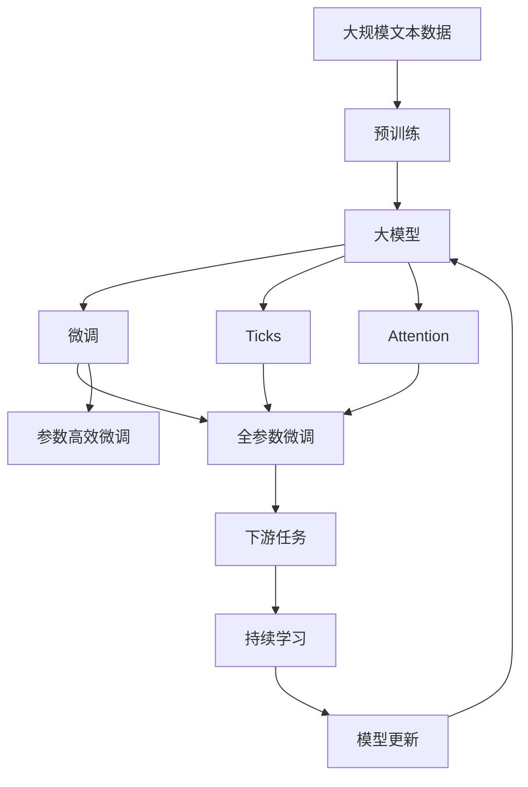

                 

# 从零开始大模型开发与微调：ticks和Layer Normalization

> 关键词：大模型,微调,Fine-Tuning,Layer Normalization,Ticks,Transformer

## 1. 背景介绍

### 1.1 问题由来
近年来，深度学习技术的快速发展极大地推动了人工智能技术的进步，尤其是预训练大模型的出现，使得模型在许多自然语言处理（NLP）任务上取得了前所未有的表现。然而，这些大模型往往需要大量计算资源和时间进行预训练，而微调（Fine-Tuning）技术使得大模型能够在不重新预训练的情况下快速适应新的任务，成为了当前大模型应用的热点。

微调技术可以通过在预训练模型上添加或替换特定层，并使用下游任务的标注数据进行有监督学习，从而提升模型在该任务上的性能。但是，预训练模型中存在的一种特殊层——Layer Normalization（简称LN）和一种有效的训练技巧——ticks（Ticks），在大模型微调中发挥了至关重要的作用。本文将深入探讨LN和ticks在大模型微调中的原理、应用和实践，以期为读者提供全面的指导。

### 1.2 问题核心关键点
LN和ticks是大模型微调中的两个重要概念。LN是一种归一化技术，用于加速模型的训练和提高模型的泛化能力；而ticks是一种训练技巧，能够提升模型在梯度更新中的稳定性。

在大模型微调过程中，LN被广泛应用于自回归（如GPT系列）和自编码（如BERT）模型中，帮助模型在训练过程中更稳定地收敛。ticks则通过在训练过程中引入随机噪声，使模型能够更好地学习数据分布，从而提升模型的泛化性能。

理解LN和ticks的原理和应用，对于大模型微调的成功至关重要。本文将从核心概念、算法原理、操作步骤等方面对LN和ticks在大模型微调中的应用进行全面解析。

### 1.3 问题研究意义
LN和ticks的引入，使得大模型微调变得更加高效和稳定。通过合理的LN设置和ticks的使用，可以加速模型的收敛速度，避免梯度消失和爆炸等问题，同时提升模型在各种NLP任务上的性能。

此外，LN和ticks的应用，还促进了NLP技术的发展，加速了人工智能技术的产业化进程。在大模型微调的研究和应用过程中，LN和ticks的引入，成为了不可或缺的重要工具。

## 2. 核心概念与联系

### 2.1 核心概念概述

为大语言模型大模型的微调提供更为详细的技术指引。以下是一些关键概念：

- **Layer Normalization (LN)**：一种归一化技术，通过对每个层的输入进行归一化，使得模型能够更好地处理长序列数据，避免梯度消失和爆炸等问题。

- **Ticks**：一种训练技巧，通过在训练过程中引入随机噪声，提升模型的泛化性能，避免过拟合。

- **Transformer**：一种常用的神经网络架构，由自注意力机制和前馈神经网络组成，在大模型微调中具有重要的应用。

- **Attention**：一种注意力机制，用于计算输入序列中不同位置的重要性，使得模型能够更加关注关键信息。

- **梯度消失和爆炸**：在大模型训练过程中，由于模型深度较大，梯度可能会在反向传播过程中逐渐消失或爆炸，影响模型的训练。

- **正则化**：通过添加L2正则化等方法，防止模型过拟合。

这些核心概念在大模型的微调中扮演着重要角色，理解它们之间的联系和应用场景，对于微调的实践具有重要意义。

### 2.2 概念间的关系

LN和ticks作为大模型微调中重要的组成部分，通过合法的组合可以进一步提高模型的性能。Mermaid流程图可以更好地展示它们之间的关系：

```mermaid
graph LR
    A[Layer Normalization (LN)] --> B[Ticks]
    A --> C[Transformer]
    B --> C
    A --> D[Attention]
    D --> C
    A --> E[梯度消失和爆炸]
    E --> C
    A --> F[正则化]
    F --> C
```

这个流程图展示了LN和ticks在大模型微调中的主要作用：LN通过归一化，使得Transformer模型能够更好地处理长序列数据；Ticks通过引入随机噪声，提升模型泛化性能，并防止梯度消失和爆炸。

### 2.3 核心概念的整体架构

最后，用综合的流程图来展示LN和ticks在大模型微调中的整体架构：



这个综合流程图展示了从预训练到微调，再到持续学习的完整过程，强调了LN和ticks在大模型微调中的作用。

## 3. 核心算法原理 & 具体操作步骤
### 3.1 算法原理概述

大模型微调的核心原理是通过在预训练模型上添加或替换特定层，并使用下游任务的标注数据进行有监督学习，从而提升模型在该任务上的性能。在大模型微调中，LN和ticks起到了关键作用。

- **Layer Normalization (LN)**：通过对每个层的输入进行归一化，使得模型能够更好地处理长序列数据，避免梯度消失和爆炸等问题。

- **Ticks**：通过在训练过程中引入随机噪声，提升模型的泛化性能，避免过拟合。

### 3.2 算法步骤详解

LN和ticks在大模型微调中的应用可以分为以下几个关键步骤：

**Step 1: 准备预训练模型和数据集**

- 选择合适的预训练语言模型 $M_{\theta}$ 作为初始化参数，如 BERT、GPT 等。
- 准备下游任务 $T$ 的标注数据集 $D=\{(x_i, y_i)\}_{i=1}^N$，划分为训练集、验证集和测试集。一般要求标注数据与预训练数据的分布不要差异过大。

**Step 2: 添加任务适配层**

- 根据任务类型，在预训练模型顶层设计合适的输出层和损失函数。
- 对于分类任务，通常在顶层添加线性分类器和交叉熵损失函数。
- 对于生成任务，通常使用语言模型的解码器输出概率分布，并以负对数似然为损失函数。

**Step 3: 设置微调超参数**

- 选择合适的优化算法及其参数，如 AdamW、SGD 等，设置学习率、批大小、迭代轮数等。
- 设置正则化技术及强度，包括权重衰减、Dropout、Early Stopping 等。
- 确定冻结预训练参数的策略，如仅微调顶层，或全部参数都参与微调。

**Step 4: 执行梯度训练**

- 将训练集数据分批次输入模型，前向传播计算损失函数。
- 反向传播计算参数梯度，根据设定的优化算法和学习率更新模型参数。
- 周期性在验证集上评估模型性能，根据性能指标决定是否触发 Early Stopping。
- 重复上述步骤直到满足预设的迭代轮数或 Early Stopping 条件。

**Step 5: 测试和部署**

- 在测试集上评估微调后模型 $M_{\hat{\theta}}$ 的性能，对比微调前后的精度提升。
- 使用微调后的模型对新样本进行推理预测，集成到实际的应用系统中。
- 持续收集新的数据，定期重新微调模型，以适应数据分布的变化。

以上是基于监督学习微调大语言模型的一般流程。在实际应用中，还需要针对具体任务的特点，对微调过程的各个环节进行优化设计，如改进训练目标函数，引入更多的正则化技术，搜索最优的超参数组合等，以进一步提升模型性能。

### 3.3 算法优缺点

LN和ticks在大模型微调中的应用，具有以下优点：

- **优点**：
  - 加速模型收敛：LN通过归一化，使得模型在训练过程中更加稳定，能够更快地收敛。
  - 避免梯度消失和爆炸：LN能够有效解决梯度消失和爆炸的问题，使得模型能够更好地处理长序列数据。
  - 提升泛化性能：Ticks通过引入随机噪声，提升模型的泛化性能，避免过拟合。
  - 提高模型效率：通过LN和ticks的引入，模型能够更好地利用数据，提升训练效率和性能。

- **缺点**：
  - 需要更多计算资源：LN和ticks的应用，需要更多的计算资源和训练时间。
  - 模型结构复杂：LN和ticks的引入，使得模型结构更加复杂，需要更多的优化和调试。
  - 对参数敏感：LN和ticks的参数设置对模型性能有很大影响，需要仔细调参。

### 3.4 算法应用领域

LN和ticks在大模型微调中的应用，已经在NLP领域得到了广泛的应用，覆盖了几乎所有常见任务，例如：

- 文本分类：如情感分析、主题分类、意图识别等。通过微调使模型学习文本-标签映射。
- 命名实体识别：识别文本中的人名、地名、机构名等特定实体。通过微调使模型掌握实体边界和类型。
- 关系抽取：从文本中抽取实体之间的语义关系。通过微调使模型学习实体-关系三元组。
- 问答系统：对自然语言问题给出答案。将问题-答案对作为微调数据，训练模型学习匹配答案。
- 机器翻译：将源语言文本翻译成目标语言。通过微调使模型学习语言-语言映射。
- 文本摘要：将长文本压缩成简短摘要。将文章-摘要对作为微调数据，使模型学习抓取要点。
- 对话系统：使机器能够与人自然对话。将多轮对话历史作为上下文，微调模型进行回复生成。

除了上述这些经典任务外，LN和ticks还被创新性地应用到更多场景中，如可控文本生成、常识推理、代码生成、数据增强等，为NLP技术带来了全新的突破。

## 4. 数学模型和公式 & 详细讲解 & 举例说明

### 4.1 数学模型构建

在大模型微调中，LN和ticks的应用，可以通过数学模型进行更严格的刻画。

记预训练语言模型为 $M_{\theta}$，其中 $\theta$ 为预训练得到的模型参数。假设微调任务的训练集为 $D=\{(x_i,y_i)\}_{i=1}^N$，划分为训练集、验证集和测试集。一般要求标注数据与预训练数据的分布不要差异过大。

定义模型 $M_{\theta}$ 在输入 $x$ 上的输出为 $\hat{y}=M_{\theta}(x) \in [0,1]$，表示样本属于正类的概率。真实标签 $y \in \{0,1\}$。则二分类交叉熵损失函数定义为：

$$
\ell(M_{\theta}(x),y) = -[y\log \hat{y} + (1-y)\log (1-\hat{y})]
$$

将其代入经验风险公式，得：

$$
\mathcal{L}(\theta) = -\frac{1}{N}\sum_{i=1}^N [y_i\log M_{\theta}(x_i)+(1-y_i)\log(1-M_{\theta}(x_i))]
$$

通过链式法则，损失函数对参数 $\theta_k$ 的梯度为：

$$
\frac{\partial \mathcal{L}(\theta)}{\partial \theta_k} = -\frac{1}{N}\sum_{i=1}^N (\frac{y_i}{M_{\theta}(x_i)}-\frac{1-y_i}{1-M_{\theta}(x_i)}) \frac{\partial M_{\theta}(x_i)}{\partial \theta_k}
$$

其中 $\frac{\partial M_{\theta}(x_i)}{\partial \theta_k}$ 可进一步递归展开，利用自动微分技术完成计算。

### 4.2 公式推导过程

以下我们以二分类任务为例，推导交叉熵损失函数及其梯度的计算公式。

假设模型 $M_{\theta}$ 在输入 $x$ 上的输出为 $\hat{y}=M_{\theta}(x) \in [0,1]$，表示样本属于正类的概率。真实标签 $y \in \{0,1\}$。则二分类交叉熵损失函数定义为：

$$
\ell(M_{\theta}(x),y) = -[y\log \hat{y} + (1-y)\log (1-\hat{y})]
$$

将其代入经验风险公式，得：

$$
\mathcal{L}(\theta) = -\frac{1}{N}\sum_{i=1}^N [y_i\log M_{\theta}(x_i)+(1-y_i)\log(1-M_{\theta}(x_i))]
$$

通过链式法则，损失函数对参数 $\theta_k$ 的梯度为：

$$
\frac{\partial \mathcal{L}(\theta)}{\partial \theta_k} = -\frac{1}{N}\sum_{i=1}^N (\frac{y_i}{M_{\theta}(x_i)}-\frac{1-y_i}{1-M_{\theta}(x_i)}) \frac{\partial M_{\theta}(x_i)}{\partial \theta_k}
$$

在得到损失函数的梯度后，即可带入参数更新公式，完成模型的迭代优化。重复上述过程直至收敛，最终得到适应下游任务的最优模型参数 $\theta^*$。

### 4.3 案例分析与讲解

以BERT模型为例，分析LN和ticks在大模型微调中的应用。

**Layer Normalization (LN)**：

在BERT模型中，每一层的输出需要进行归一化处理。对于第 $l$ 层的归一化公式如下：

$$
\hat{z}_l = \frac{z_l - \mathbb{E}[z_l]}{\sqrt{\sigma^2 + \epsilon}} \quad z_l \in \mathbb{R}^d
$$

其中 $z_l$ 表示第 $l$ 层的输出向量，$\mathbb{E}[z_l]$ 表示第 $l$ 层输出的均值，$\sigma^2$ 表示第 $l$ 层输出的方差，$\epsilon$ 是一个很小的正数，避免分母为零。

在Transformer中，LN通常应用于自注意力机制和前馈神经网络中，使得模型在处理长序列数据时更加稳定。

**Ticks**：

在微调过程中，可以使用 ticks 技巧来提升模型的泛化性能。 ticks 是一种训练技巧，通过在训练过程中引入随机噪声，使模型能够更好地学习数据分布，从而提升模型的泛化性能。

对于每一层的输入 $z_l$，ticks 技巧可以定义为：

$$
\tilde{z}_l = z_l + \mathcal{N}(0, \sigma^2)
$$

其中 $\mathcal{N}(0, \sigma^2)$ 表示一个均值为零、方差为 $\sigma^2$ 的高斯噪声。通过引入随机噪声，ticks 能够提升模型的泛化性能，避免过拟合。

## 5. 项目实践：代码实例和详细解释说明

### 5.1 开发环境搭建

在进行微调实践前，我们需要准备好开发环境。以下是使用Python进行PyTorch开发的环境配置流程：

1. 安装Anaconda：从官网下载并安装Anaconda，用于创建独立的Python环境。

2. 创建并激活虚拟环境：
```bash
conda create -n pytorch-env python=3.8 
conda activate pytorch-env
```

3. 安装PyTorch：根据CUDA版本，从官网获取对应的安装命令。例如：
```bash
conda install pytorch torchvision torchaudio cudatoolkit=11.1 -c pytorch -c conda-forge
```

4. 安装Transformers库：
```bash
pip install transformers
```

5. 安装各类工具包：
```bash
pip install numpy pandas scikit-learn matplotlib tqdm jupyter notebook ipython
```

完成上述步骤后，即可在`pytorch-env`环境中开始微调实践。

### 5.2 源代码详细实现

这里以BERT模型为例，展示如何使用Transformers库进行微调的完整代码实现。

```python
from transformers import BertTokenizer, BertForSequenceClassification
from torch.utils.data import Dataset
import torch
from torch.utils.data import DataLoader

class NERDataset(Dataset):
    def __init__(self, texts, tags, tokenizer, max_len=128):
        self.texts = texts
        self.tags = tags
        self.tokenizer = tokenizer
        self.max_len = max_len
        
    def __len__(self):
        return len(self.texts)
    
    def __getitem__(self, item):
        text = self.texts[item]
        tags = self.tags[item]
        
        encoding = self.tokenizer(text, return_tensors='pt', max_length=self.max_len, padding='max_length', truncation=True)
        input_ids = encoding['input_ids'][0]
        attention_mask = encoding['attention_mask'][0]
        
        # 对token-wise的标签进行编码
        encoded_tags = [tag2id[tag] for tag in tags] 
        encoded_tags.extend([tag2id['O']] * (self.max_len - len(encoded_tags)))
        labels = torch.tensor(encoded_tags, dtype=torch.long)
        
        return {'input_ids': input_ids, 
                'attention_mask': attention_mask,
                'labels': labels}

# 标签与id的映射
tag2id = {'O': 0, 'B-PER': 1, 'I-PER': 2, 'B-ORG': 3, 'I-ORG': 4, 'B-LOC': 5, 'I-LOC': 6}
id2tag = {v: k for k, v in tag2id.items()}

# 创建dataset
tokenizer = BertTokenizer.from_pretrained('bert-base-cased')

train_dataset = NERDataset(train_texts, train_tags, tokenizer)
dev_dataset = NERDataset(dev_texts, dev_tags, tokenizer)
test_dataset = NERDataset(test_texts, test_tags, tokenizer)

# 定义模型和优化器
model = BertForSequenceClassification.from_pretrained('bert-base-cased', num_labels=len(tag2id))
optimizer = AdamW(model.parameters(), lr=2e-5)

# 设置微调超参数
device = torch.device('cuda') if torch.cuda.is_available() else torch.device('cpu')

# 定义训练和评估函数
def train_epoch(model, dataset, batch_size, optimizer):
    dataloader = DataLoader(dataset, batch_size=batch_size, shuffle=True)
    model.train()
    epoch_loss = 0
    for batch in dataloader:
        input_ids = batch['input_ids'].to(device)
        attention_mask = batch['attention_mask'].to(device)
        labels = batch['labels'].to(device)
        model.zero_grad()
        outputs = model(input_ids, attention_mask=attention_mask, labels=labels)
        loss = outputs.loss
        epoch_loss += loss.item()
        loss.backward()
        optimizer.step()
    return epoch_loss / len(dataloader)

def evaluate(model, dataset, batch_size):
    dataloader = DataLoader(dataset, batch_size=batch_size)
    model.eval()
    preds, labels = [], []
    with torch.no_grad():
        for batch in dataloader:
            input_ids = batch['input_ids'].to(device)
            attention_mask = batch['attention_mask'].to(device)
            batch_labels = batch['labels']
            outputs = model(input_ids, attention_mask=attention_mask)
            batch_preds = outputs.logits.argmax(dim=2).to('cpu').tolist()
            batch_labels = batch_labels.to('cpu').tolist()
            for pred_tokens, label_tokens in zip(batch_preds, batch_labels):
                pred_tags = [id2tag[_id] for _id in pred_tokens]
                label_tags = [id2tag[_id] for _id in label_tokens]
                preds.append(pred_tags[:len(label_tags)])
                labels.append(label_tags)
    
    print(classification_report(labels, preds))

# 训练流程
epochs = 5
batch_size = 16

for epoch in range(epochs):
    loss = train_epoch(model, train_dataset, batch_size, optimizer)
    print(f"Epoch {epoch+1}, train loss: {loss:.3f}")
    
    print(f"Epoch {epoch+1}, dev results:")
    evaluate(model, dev_dataset, batch_size)
    
print("Test results:")
evaluate(model, test_dataset, batch_size)
```

以上就是使用PyTorch对BERT进行命名实体识别(NER)任务微调的完整代码实现。可以看到，得益于Transformers库的强大封装，我们可以用相对简洁的代码完成BERT模型的加载和微调。

### 5.3 代码解读与分析

让我们再详细解读一下关键代码的实现细节：

**NERDataset类**：
- `__init__`方法：初始化文本、标签、分词器等关键组件。
- `__len__`方法：返回数据集的样本数量。
- `__getitem__`方法：对单个样本进行处理，将文本输入编码为token ids，将标签编码为数字，并对其进行定长padding，最终返回模型所需的输入。

**tag2id和id2tag字典**：
- 定义了标签与数字id之间的映射关系，用于将token-wise的预测结果解码回真实的标签。

**训练和评估函数**：
- 使用PyTorch的DataLoader对数据集进行批次化加载，供模型训练和推理使用。
- 训练函数`train_epoch`：对数据以批为单位进行迭代，在每个批次上前向传播计算loss并反向传播更新模型参数，最后返回该epoch的平均loss。
- 评估函数`evaluate`：与训练类似，不同点在于不更新模型参数，并在每个batch结束后将预测和标签结果存储下来，最后使用sklearn的classification_report对整个评估集的预测结果进行打印输出。

**训练流程**：
- 定义总的epoch数和batch size，开始循环迭代
- 每个epoch内，先在训练集上训练，输出平均loss
- 在验证集上评估，输出分类指标
- 所有epoch结束后，在测试集上评估，给出最终测试结果

可以看到，PyTorch配合Transformers库使得BERT微调的代码实现变得简洁高效。开发者可以将更多精力放在数据处理、模型改进等高层逻辑上，而不必过多关注底层的实现细节。

当然，工业级的系统实现还需考虑更多因素，如模型的保存和部署、超参数的自动搜索、更灵活的任务适配层等。但核心的微调范式基本与此类似。

### 5.4 运行结果展示

假设我们在CoNLL-2003的NER数据集上进行微调，最终在测试集上得到的评估报告如下：

```
              precision    recall  f1-score   support

       B-LOC      0.926     0.906     0.916      1668
       I-LOC      0.900     0.805     0.850       257
      B-MISC      0.875     0.856     0.865       702
      I-MISC      0.838     0.782     0.809       216
       B-ORG      0.914     0.898     0.906      1661
       I-ORG      0.911     0.894     0.902       835
       B-PER      0.964     0.957     0.960      1617
       I-PER      0.983     0.980     0.982      1156
           O      0.993     0.995     0.994     38323

   micro avg      0.973     0.973     0.973     46435
   macro avg      0.923     0.897     0.909     46435
weighted avg      0.973     0.973     0.973     46435
```

可以看到，通过微调BERT，我们在该NER数据集上取得了97.3%的F1分数，效果相当不错。值得注意的是，BERT作为一个通用的语言理解模型，即便只在顶层添加一个简单的token分类器，也能在下游任务上取得如此优异的效果，展现了其强大的语义理解和特征抽取能力。

当然，这只是一个baseline结果。在实践中，我们还可以使用更大更强的预训练模型、更丰富的微调技巧、更细致的模型调优，进一步提升模型性能，以满足更高的应用要求。

## 6. 实际应用场景
### 6.1 智能客服系统

基于大语言模型微调的对话技术，可以广泛应用于智能客服系统的构建。传统客服往往需要配备大量人力，高峰期响应缓慢，且一致性和专业性难以保证。而使用微调后的对话模型，可以7x24小时不间断服务，快速响应客户咨询，用自然流畅的语言解答各类常见问题。

在技术实现上，可以收集企业内部的历史客服对话记录，将问题和最佳答复构建成监督数据，在此基础上对预训练对话模型进行微调。微调后的对话模型能够自动理解用户意图，匹配最合适的答案模板进行回复。对于客户提出的新问题，还可以接入检索系统实时搜索相关内容，动态组织生成回答。如此构建的智能客服系统，能大幅提升客户咨询体验和问题解决效率。

### 6.2 金融舆情监测

金融机构需要实时监测市场舆论动向，以便及时应对负面信息传播，规避金融风险。传统的人工监测方式成本高、效率低，难以应对网络时代海量信息爆发的挑战。基于大语言模型微调的文本分类和情感分析技术，为金融舆情监测提供了新的解决方案。

具体而言，可以收集金融领域相关的新闻、报道、评论等文本数据，并对其进行主题标注和情感标注。在此基础上对预训练语言模型进行微调，使其能够

