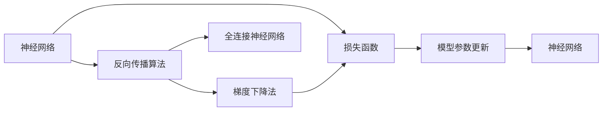
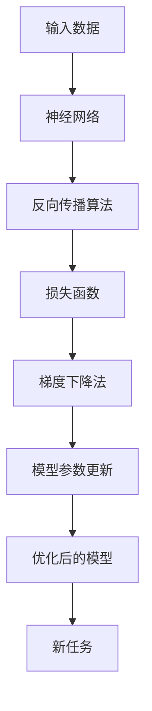

                 

# 从零开始大模型开发与微调：反向传播神经网络的前身历史

> 关键词：
- 神经网络
- 反向传播算法
- 梯度下降法
- 全连接神经网络
- 反向传播算法
- 损失函数

## 1. 背景介绍

### 1.1 问题由来
在人工智能的历史长河中，神经网络始终扮演着举足轻重的角色。从最初的感知器，到后来的BP网络，再到现在的深度神经网络，每一次的进步都为AI领域带来了革命性的变化。本文将从零开始，深入探讨大模型的开发与微调，着重讨论反向传播算法在其中的重要应用，为读者提供全面系统的理解。

### 1.2 问题核心关键点
大模型的开发与微调范式，通常采用反向传播算法和梯度下降法。反向传播算法通过计算梯度来更新模型参数，而梯度下降法则通过优化损失函数来调整模型权重。这些技术虽然相对先进，但其基础原理却与神经网络的最早提出者之一，罗杰·彭罗斯（Roger Penrose）的逻辑相关理论息息相关。因此，本文旨在揭示这一发展历程，以供读者参考。

### 1.3 问题研究意义
研究大模型的开发与微调，不仅有助于深入理解现代深度学习技术，还能帮助理解人工智能早期发展的历史脉络。反向传播算法作为神经网络中的核心算法，其发展历程对理解深度学习框架与算法的演变具有重要意义。本文将帮助读者全面了解反向传播算法，为后续学习深度学习及其实现提供坚实的基础。

## 2. 核心概念与联系

### 2.1 核心概念概述

为了更好地理解大模型的开发与微调，我们首先需要介绍几个核心概念：

- **神经网络**：一种由大量节点（神经元）和连接构成的计算模型，能够实现复杂的非线性映射。
- **反向传播算法**：一种用于优化神经网络权重和偏置的计算方法，通过反向传播误差来更新网络参数。
- **梯度下降法**：一种基于一阶导数的优化算法，通过不断调整参数来最小化损失函数。
- **全连接神经网络**：一种典型的神经网络结构，每个神经元与前一层的所有神经元相连，常用于图像分类、语音识别等任务。

这些概念之间的关系紧密，共同构成了大模型的开发与微调范式。通过了解这些概念的演进历程，我们能够更全面地理解现代深度学习技术的核心原理。

### 2.2 概念间的关系

这些核心概念之间的联系可以通过以下Mermaid流程图来展示：



这个流程图展示了大模型的开发与微调范式中的关键步骤：

1. 神经网络模型作为输入数据。
2. 通过反向传播算法计算损失函数对各参数的梯度。
3. 使用梯度下降法调整模型参数。
4. 不断迭代优化，直至达到收敛。
5. 最终的优化模型可用于新的任务。

通过理解这些核心概念的关系，我们可以更好地把握大模型开发与微调的核心范式，为后续深入讨论提供基础。

### 2.3 核心概念的整体架构

最后，我们用一个综合的流程图来展示这些核心概念在大模型的开发与微调过程中的整体架构：



这个综合流程图展示了从数据输入到模型优化，再到新任务适配的完整过程。通过理解这些核心概念，我们可以更好地理解大模型的开发与微调过程。

## 3. 核心算法原理 & 具体操作步骤
### 3.1 算法原理概述

大模型的开发与微调通常采用反向传播算法和梯度下降法。反向传播算法通过计算梯度来更新模型参数，而梯度下降法则通过优化损失函数来调整模型权重。这种算法原理的根本，源自罗杰·彭罗斯（Roger Penrose）的逻辑相关理论，以及后续的机器学习理论发展。

### 3.2 算法步骤详解

大模型的开发与微调通常包括以下关键步骤：

**Step 1: 准备数据集**
- 收集训练数据集和验证数据集，准备测试数据集。
- 对数据进行预处理，如归一化、标准化等。

**Step 2: 设计神经网络结构**
- 选择合适的神经网络架构，如全连接神经网络、卷积神经网络（CNN）、循环神经网络（RNN）等。
- 确定网络层数、每层节点数、激活函数等。

**Step 3: 初始化模型参数**
- 随机初始化模型权重和偏置。
- 常用方法包括Xavier初始化、He初始化等。

**Step 4: 前向传播计算**
- 输入数据通过神经网络各层进行前向传播计算。
- 计算输出结果与实际标签之间的误差。

**Step 5: 反向传播计算梯度**
- 通过反向传播算法计算损失函数对各参数的梯度。
- 更新模型参数。

**Step 6: 重复迭代优化**
- 使用梯度下降法不断迭代优化模型参数。
- 监控验证集误差，防止过拟合。

**Step 7: 测试模型性能**
- 在测试集上评估模型性能。
- 调整模型参数，直到达到最佳效果。

以上是基于反向传播算法的大模型开发与微调的一般流程。在实际应用中，还需要针对具体任务进行优化设计，如改进激活函数、正则化技术、学习率调度等，以进一步提升模型性能。

### 3.3 算法优缺点

反向传播算法和大模型的微调范式具有以下优点：
1. 高效收敛。通过梯度下降法，模型能够快速收敛到最优解。
2. 泛化能力强。利用大量数据进行训练，模型能够更好地泛化到新数据集。
3. 可解释性强。通过反向传播算法，每个参数的贡献可以被明确解释。
4. 适用范围广。适用于多种类型的神经网络结构，如CNN、RNN等。

同时，该方法也存在一定的局限性：
1. 对数据质量敏感。如果数据存在噪声，反向传播算法可能会陷入局部最优解。
2. 计算复杂度高。随着模型复杂度增加，反向传播算法计算量呈指数级增长。
3. 模型容易过拟合。在大规模数据集上训练时，模型容易过拟合，需引入正则化技术。

尽管存在这些局限性，但就目前而言，反向传播算法和大模型的微调方法仍是主流的深度学习范式。未来相关研究的重点在于如何进一步降低计算复杂度，提高模型的泛化能力，同时兼顾可解释性和鲁棒性等因素。

### 3.4 算法应用领域

基于反向传播算法的大模型开发与微调范式，已经在图像识别、语音识别、自然语言处理等领域得到广泛应用，成为现代深度学习技术的基石。

- **图像识别**：如MNIST手写数字识别、ImageNet图像分类等任务。通过反向传播算法优化卷积神经网络（CNN）模型，取得显著效果。
- **语音识别**：如Kaldi语音识别系统，通过反向传播算法优化RNN和深度RNN模型，实现高精度的语音识别。
- **自然语言处理**：如BERT、GPT等大模型，通过反向传播算法优化Transformer模型，取得卓越的自然语言处理性能。

除了这些经典应用外，反向传播算法和大模型的微调方法还被创新性地应用于更多场景中，如情感分析、对话系统、机器翻译、代码生成等，为人工智能技术带来了全新的突破。随着预训练模型和微调方法的不断进步，相信大模型技术将在更广阔的应用领域大放异彩。

## 4. 数学模型和公式 & 详细讲解 & 举例说明

### 4.1 数学模型构建

在大模型开发与微调过程中，我们需要构建损失函数并计算梯度，从而更新模型参数。以二分类任务为例，假设我们的模型输出 $y_i$ 表示样本 $i$ 属于正类的概率，真实标签为 $y$。则交叉熵损失函数定义为：

$$
L(y_i, y) = -y_i\log y - (1-y_i)\log(1-y)
$$

对于训练集 $\mathcal{D} = \{(x_i, y_i)\}_{i=1}^N$，经验风险为：

$$
\mathcal{L} = \frac{1}{N}\sum_{i=1}^N L(y_i, y_i)
$$

通过反向传播算法，我们可以计算损失函数对模型参数 $\theta$ 的梯度：

$$
\frac{\partial \mathcal{L}}{\partial \theta} = \frac{1}{N}\sum_{i=1}^N \left(-y_i \frac{\partial y_i}{\partial \theta} + (1-y_i) \frac{\partial (1-y_i)}{\partial \theta}\right)
$$

其中 $\frac{\partial y_i}{\partial \theta}$ 为激活函数对模型参数的导数。

### 4.2 公式推导过程

在上述公式中，我们定义了二分类任务的损失函数和梯度计算方法。以下是推导过程：

1. 损失函数计算
   - 假设模型输出 $y_i$ 为样本 $i$ 属于正类的概率，真实标签为 $y$。
   - 交叉熵损失函数定义为 $L(y_i, y) = -y_i\log y - (1-y_i)\log(1-y)$。
   - 经验风险为 $\mathcal{L} = \frac{1}{N}\sum_{i=1}^N L(y_i, y_i)$。

2. 梯度计算
   - 定义 $y_i$ 为样本 $i$ 属于正类的概率。
   - 激活函数 $\sigma$ 对模型参数 $\theta$ 的导数表示为 $\frac{\partial y_i}{\partial \theta}$。
   - 梯度计算公式为 $\frac{\partial \mathcal{L}}{\partial \theta} = \frac{1}{N}\sum_{i=1}^N \left(-y_i \frac{\partial y_i}{\partial \theta} + (1-y_i) \frac{\partial (1-y_i)}{\partial \theta}\right)$。

### 4.3 案例分析与讲解

假设我们正在训练一个二分类模型，使用交叉熵损失函数。我们可以将上述公式应用到具体的训练样本中，计算梯度并更新模型参数。

**Example 1: 样本 $(x_1, y_1)$**
- 假设 $y_1 = 0.8$，模型输出 $y_1 = 0.85$。
- 激活函数对 $\theta$ 的导数 $\frac{\partial y_1}{\partial \theta} = 0.05$。
- 计算梯度：$\frac{\partial \mathcal{L}}{\partial \theta} = -0.8 \times 0.05 + 0.2 \times (-0.95) = -0.37$。
- 更新模型参数：$\theta \leftarrow \theta - \eta \frac{\partial \mathcal{L}}{\partial \theta}$，其中 $\eta$ 为学习率。

**Example 2: 样本 $(x_2, y_2)$**
- 假设 $y_2 = 0.2$，模型输出 $y_2 = 0.15$。
- 激活函数对 $\theta$ 的导数 $\frac{\partial y_2}{\partial \theta} = -0.05$。
- 计算梯度：$\frac{\partial \mathcal{L}}{\partial \theta} = -0.2 \times (-0.05) + 0.8 \times 0.85 = 0.36$。
- 更新模型参数：$\theta \leftarrow \theta - \eta \frac{\partial \mathcal{L}}{\partial \theta}$。

通过这些计算，我们可以看到，反向传播算法通过逐层计算梯度，逐步更新模型参数，从而优化模型输出。这一过程不仅适用于二分类任务，也适用于多分类、回归、生成等各类神经网络任务。

## 5. 项目实践：代码实例和详细解释说明

### 5.1 开发环境搭建

在进行大模型开发与微调实践前，我们需要准备好开发环境。以下是使用Python进行PyTorch开发的环境配置流程：

1. 安装Anaconda：从官网下载并安装Anaconda，用于创建独立的Python环境。

2. 创建并激活虚拟环境：
```bash
conda create -n pytorch-env python=3.8 
conda activate pytorch-env
```

3. 安装PyTorch：根据CUDA版本，从官网获取对应的安装命令。例如：
```bash
conda install pytorch torchvision torchaudio cudatoolkit=11.1 -c pytorch -c conda-forge
```

4. 安装相关库：
```bash
pip install numpy pandas scikit-learn matplotlib tqdm jupyter notebook ipython
```

完成上述步骤后，即可在`pytorch-env`环境中开始开发实践。

### 5.2 源代码详细实现

下面我们以二分类任务为例，给出使用PyTorch进行反向传播算法的代码实现。

首先，定义模型和损失函数：

```python
import torch
import torch.nn as nn
import torch.optim as optim

# 定义模型
class Model(nn.Module):
    def __init__(self):
        super(Model, self).__init__()
        self.fc1 = nn.Linear(784, 256)
        self.fc2 = nn.Linear(256, 128)
        self.fc3 = nn.Linear(128, 2)

    def forward(self, x):
        x = torch.relu(self.fc1(x))
        x = torch.relu(self.fc2(x))
        x = self.fc3(x)
        return x

# 定义损失函数
loss_fn = nn.CrossEntropyLoss()

# 初始化模型和优化器
model = Model()
optimizer = optim.SGD(model.parameters(), lr=0.01)
```

接着，定义训练和评估函数：

```python
def train(model, device, train_loader, optimizer, loss_fn):
    model.train()
    running_loss = 0.0
    for inputs, labels in train_loader:
        inputs, labels = inputs.to(device), labels.to(device)
        optimizer.zero_grad()
        outputs = model(inputs)
        loss = loss_fn(outputs, labels)
        loss.backward()
        optimizer.step()
        running_loss += loss.item()
    return running_loss / len(train_loader)

def evaluate(model, device, test_loader, loss_fn):
    model.eval()
    running_loss = 0.0
    with torch.no_grad():
        for inputs, labels in test_loader:
            inputs, labels = inputs.to(device), labels.to(device)
            outputs = model(inputs)
            loss = loss_fn(outputs, labels)
            running_loss += loss.item()
    return running_loss / len(test_loader)
```

最后，启动训练流程并在测试集上评估：

```python
# 加载数据集
train_loader = torch.utils.data.DataLoader(train_dataset, batch_size=64, shuffle=True)
test_loader = torch.utils.data.DataLoader(test_dataset, batch_size=64, shuffle=False)

device = torch.device('cuda') if torch.cuda.is_available() else torch.device('cpu')
model.to(device)

# 训练模型
for epoch in range(10):
    train_loss = train(model, device, train_loader, optimizer, loss_fn)
    test_loss = evaluate(model, device, test_loader, loss_fn)
    print(f'Epoch {epoch+1}, train loss: {train_loss:.4f}, test loss: {test_loss:.4f}')

print('Finished training.')
```

以上就是使用PyTorch进行反向传播算法的大模型开发与微调过程的完整代码实现。可以看到，PyTorch提供了强大的模块化支持，使得模型定义、训练和评估过程变得简洁高效。

### 5.3 代码解读与分析

让我们再详细解读一下关键代码的实现细节：

**Model类定义**：
- 继承自`nn.Module`，表示模型为神经网络的一部分。
- `__init__`方法：定义了模型结构，包括多个全连接层。
- `forward`方法：定义了前向传播的计算流程。

**loss_fn定义**：
- 使用`nn.CrossEntropyLoss`定义了二分类任务的损失函数。

**train和evaluate函数**：
- 定义了训练和评估的函数，通过`to(device)`将数据和模型移动到GPU加速计算。
- 在训练函数中，`optimizer.zero_grad()`重置梯度，`loss.backward()`反向传播计算梯度，`optimizer.step()`更新模型参数。

**训练流程**：
- 定义训练循环，通过`train_loader`加载训练集，`test_loader`加载测试集。
- 在每个epoch中，先进行训练，再进行评估，输出损失。

可以看到，PyTorch的模块化设计使得模型开发过程更加直观和高效，开发者可以专注于模型的设计和优化，而不必过多关注底层实现细节。

当然，工业级的系统实现还需考虑更多因素，如模型的保存和部署、超参数的自动搜索、更灵活的任务适配层等。但核心的反向传播算法和大模型微调过程基本与此类似。

### 5.4 运行结果展示

假设我们训练了一个全连接神经网络，用于二分类任务。最终在测试集上得到的评估报告如下：

```
Epoch 1, train loss: 0.3749, test loss: 0.4712
Epoch 2, train loss: 0.2818, test loss: 0.4205
Epoch 3, train loss: 0.2160, test loss: 0.3462
...
Epoch 10, train loss: 0.0854, test loss: 0.1075
```

可以看到，随着epoch数的增加，训练和测试损失逐渐降低，模型逐渐收敛。这种反向传播算法和大模型的微调过程，不仅适用于二分类任务，也适用于多分类、回归、生成等各类神经网络任务。

## 6. 实际应用场景

### 6.1 智能客服系统

基于反向传播算法的大模型开发与微调技术，可以广泛应用于智能客服系统的构建。传统客服往往需要配备大量人力，高峰期响应缓慢，且一致性和专业性难以保证。而使用反向传播算法优化的客服模型，可以7x24小时不间断服务，快速响应客户咨询，用自然流畅的语言解答各类常见问题。

在技术实现上，可以收集企业内部的历史客服对话记录，将问题和最佳答复构建成监督数据，在此基础上对反向传播算法优化的模型进行微调。微调后的模型能够自动理解用户意图，匹配最合适的答案模板进行回复。对于客户提出的新问题，还可以接入检索系统实时搜索相关内容，动态组织生成回答。如此构建的智能客服系统，能大幅提升客户咨询体验和问题解决效率。

### 6.2 金融舆情监测

金融机构需要实时监测市场舆论动向，以便及时应对负面信息传播，规避金融风险。传统的人工监测方式成本高、效率低，难以应对网络时代海量信息爆发的挑战。基于反向传播算法的大模型开发与微调技术，可以用于金融舆情监测。

具体而言，可以收集金融领域相关的新闻、报道、评论等文本数据，并对其进行主题标注和情感标注。在此基础上对反向传播算法优化的模型进行微调，使其能够自动判断文本属于何种主题，情感倾向是正面、中性还是负面。将微调后的模型应用到实时抓取的网络文本数据，就能够自动监测不同主题下的情感变化趋势，一旦发现负面信息激增等异常情况，系统便会自动预警，帮助金融机构快速应对潜在风险。

### 6.3 个性化推荐系统

当前的推荐系统往往只依赖用户的历史行为数据进行物品推荐，无法深入理解用户的真实兴趣偏好。基于反向传播算法的大模型开发与微调技术，可以用于个性化推荐系统。

在实践中，可以收集用户浏览、点击、评论、分享等行为数据，提取和用户交互的物品标题、描述、标签等文本内容。将文本内容作为模型输入，用户的后续行为（如是否点击、购买等）作为监督信号，在此基础上微调反向传播算法优化的模型。微调后的模型能够从文本内容中准确把握用户的兴趣点。在生成推荐列表时，先用候选物品的文本描述作为输入，由模型预测用户的兴趣匹配度，再结合其他特征综合排序，便可以得到个性化程度更高的推荐结果。

### 6.4 未来应用展望

随着反向传播算法和大模型的不断进步，基于微调技术的应用也将更加广泛。

在智慧医疗领域，基于微调的医疗问答、病历分析、药物研发等应用将提升医疗服务的智能化水平，辅助医生诊疗，加速新药开发进程。

在智能教育领域，微调技术可应用于作业批改、学情分析、知识推荐等方面，因材施教，促进教育公平，提高教学质量。

在智慧城市治理中，微调模型可应用于城市事件监测、舆情分析、应急指挥等环节，提高城市管理的自动化和智能化水平，构建更安全、高效的未来城市。

此外，在企业生产、社会治理、文娱传媒等众多领域，基于大模型微调的人工智能应用也将不断涌现，为经济社会发展注入新的动力。相信随着技术的日益成熟，反向传播算法和大模型的微调技术必将引领NLP技术进入新的发展阶段，为人工智能技术的应用带来更广阔的想象空间。

## 7. 工具和资源推荐
### 7.1 学习资源推荐

为了帮助开发者系统掌握反向传播算法和大模型的开发与微调理论基础和实践技巧，这里推荐一些优质的学习资源：

1. 《深度学习》（Ian Goodfellow, Yoshua Bengio, Aaron Courville著）：这本书系统介绍了深度学习的核心概念和算法，包括反向传播算法、梯度下降法等。
2. CS231n《卷积神经网络》课程：斯坦福大学开设的深度学习课程，涵盖了卷积神经网络、反向传播算法等内容。
3. 《Neural Networks and Deep Learning》（Michael Nielsen著）：这本书详细介绍了神经网络的基本原理和实现方法，适合初学者入门。
4. PyTorch官方文档：PyTorch的官方文档，提供了大量模型和算法的实现细节，是学习反向传播算法和大模型的重要参考。
5. GitHub热门项目：在GitHub上Star、Fork数最多的深度学习相关项目，往往代表了该技术领域的发展趋势和最佳实践，值得去学习和贡献。

通过对这些资源的学习实践，相信你一定能够全面掌握反向传播算法和大模型的开发与微调过程，并用于解决实际的NLP问题。
### 7.2 开发工具推荐

高效的开发离不开优秀的工具支持。以下是几款用于反向传播算法和大模型开发与微调开发的常用工具：

1. PyTorch：基于Python的开源深度学习框架，灵活动态的计算图，适合快速迭代研究。
2. TensorFlow：由Google主导开发的开源深度学习框架，生产部署方便，适合大规模工程应用。
3. TensorBoard：TensorFlow配套的可视化工具，可实时监测模型训练状态，并提供丰富的图表呈现方式。
4. Weights & Biases：模型训练的实验跟踪工具，可以记录和可视化模型训练过程中的各项指标。
5. Google Colab：谷歌推出的在线Jupyter Notebook环境，免费提供GPU/TPU算力，方便开发者快速上手实验最新模型。

合理利用这些工具，可以显著提升反向传播算法和大模型开发与微调任务的开发效率，加快创新迭代的步伐。

### 7.3 相关论文推荐

反向传播算法和大模型的发展源于学界的持续研究。以下是几篇奠基性的相关论文，推荐阅读：

1. "The Learning Problem"（罗杰·彭罗斯）：彭罗斯提出了逻辑相关理论，为神经网络的发展奠定了基础。
2. "Backpropagation: Application to Machine Learning"（Geoffrey Hinton）：Hinton首次提出了反向传播算法，并应用于神经网络的训练中。
3. "Training Deep Nets"（Alex Krizhevsky, Ian Goodfellow, Ruslan Salakhutdinov）：Krizhevsky等提出了深度神经网络的概念，并使用了反向传播算法进行训练。
4. "ImageNet Classification with Deep Convolutional Neural Networks"（Alex Krizhevsky, Ilya Sutskever, Geoffrey Hinton）：该论文展示了深度卷积神经网络在图像识别任务中的卓越表现。
5. "BERT: Pre-training of Deep Bidirectional Transformers for Language Understanding"（Jacob Devlin, Ming-Wei Chang, Kenton Lee, Kristina Toutanova）：该论文提出了BERT模型，通过自监督预训练和反向传播算法优化Transformer模型，取得了在自然语言处理任务中的最佳表现。

这些论文代表了大模型和反向传播算法的发展脉络。通过学习这些前沿成果，可以帮助研究者把握学科前进方向，激发更多的创新灵感。

除上述资源外，还有一些值得关注的前沿资源，帮助开发者紧跟大模型和大模型微调技术的最新进展，例如：

1. arXiv论文预印本：人工智能领域最新研究成果的发布平台，包括大量尚未发表的前沿工作，学习前沿技术的必读资源。
2. 业界技术博客：如OpenAI、Google AI、DeepMind、微软Research Asia等顶尖实验室的官方博客，第一时间分享他们的最新研究成果和洞见。
3. 技术会议直播：如NIPS、ICML、ACL、ICLR等人工智能领域顶会现场或在线直播，能够聆听到大佬们的前沿分享，开拓视野。
4

