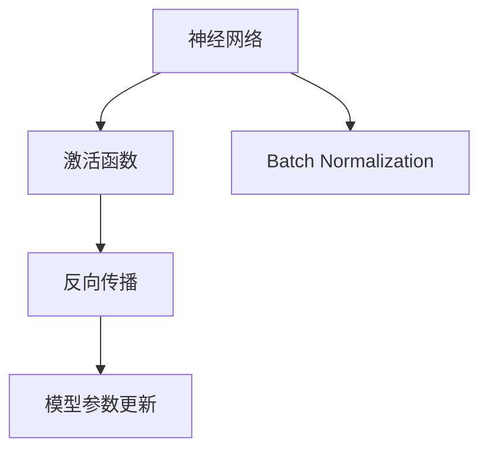
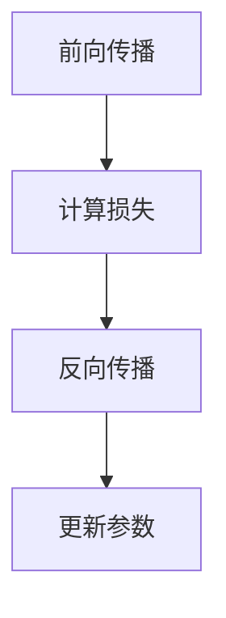
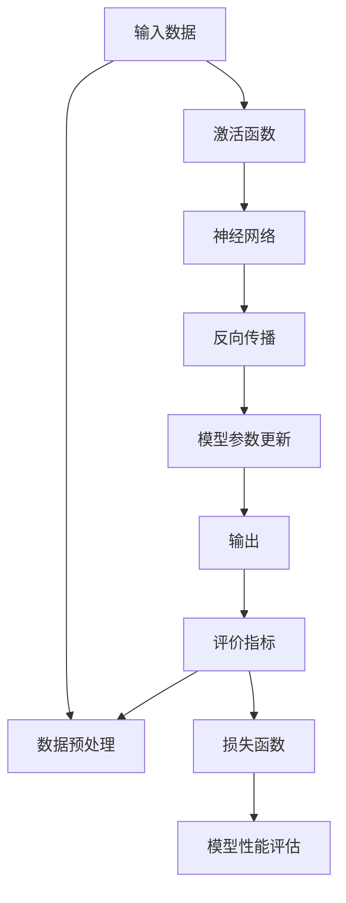

                 

# 从零开始大模型开发与微调：反馈神经网络原理的激活函数

> 关键词：激活函数,神经网络,反馈网络,反向传播,深度学习,PyTorch

## 1. 背景介绍

### 1.1 问题由来
在深度学习的快速发展中，神经网络（Neural Network）已成为处理复杂数据分析和模式识别的重要工具。特别是近年来，随着大模型（Large Model）的兴起，激活函数（Activation Function）在神经网络中的作用愈发关键。激活函数不仅影响网络的表达能力，还决定着训练的稳定性和收敛速度。

激活函数的选择，直接关系到模型的性能和训练效率。对于不同任务和数据类型，选择合适的激活函数至关重要。本文旨在详细介绍激活函数的原理，并结合实际项目，探讨如何在不同场景下使用激活函数进行神经网络开发与微调。

### 1.2 问题核心关键点
1. **激活函数**：激活函数是神经网络中用于引入非线性变换的关键组件，直接影响神经元的输出。常见的激活函数包括Sigmoid、ReLU、Tanh等。
2. **反向传播**：反向传播（Backpropagation）是深度学习中用于优化模型参数的算法。通过反向传播，模型可以自动调整权重，从而最小化预测误差。
3. **神经网络结构**：神经网络的层次结构决定了其处理能力。常用的神经网络结构包括全连接层、卷积层、循环层等。
4. **模型性能优化**：通过调整激活函数和网络结构，可以显著提升模型性能。本文将重点讨论激活函数的选择和优化。

### 1.3 问题研究意义
研究激活函数在深度学习中的应用，对于提升神经网络的性能、加速模型训练、优化模型参数具有重要意义：

1. **性能提升**：选择合适的激活函数，可以增强神经网络的表达能力，减少过拟合，提升模型在各种任务上的表现。
2. **训练效率**：激活函数的选择直接影响神经网络的训练速度和稳定性，合理的选择可以加速模型收敛。
3. **模型优化**：通过调整激活函数，可以优化神经网络的层次结构，提高模型的计算效率和内存利用率。
4. **创新驱动**：随着深度学习的发展，新的激活函数不断涌现，如ReLU的变种、Swish、Mish等，推动了神经网络技术的进步。

## 2. 核心概念与联系

### 2.1 核心概念概述

为了更好地理解激活函数在神经网络中的作用，本节将详细介绍几个密切相关的核心概念：

- **神经网络**：由神经元（Neuron）组成的计算模型，用于处理输入数据并产生输出。
- **激活函数**：用于引入非线性变换的函数，决定神经元的输出。
- **反向传播**：通过链式法则计算损失函数对每个参数的梯度，从而更新模型参数。
- **梯度消失/爆炸问题**：在深度神经网络中，梯度在反向传播过程中可能消失或爆炸，导致模型难以训练。
- **Batch Normalization**：一种常用的技术，通过归一化输入数据，加速模型训练，提高模型性能。

这些核心概念之间的逻辑关系可以通过以下Mermaid流程图来展示：



这个流程图展示了大模型中激活函数、反向传播和Batch Normalization的关系：

1. 神经网络通过激活函数引入非线性变换。
2. 反向传播通过链式法则计算梯度，更新模型参数。
3. Batch Normalization通过归一化加速反向传播过程。

### 2.2 概念间的关系

这些核心概念之间存在着紧密的联系，形成了深度学习模型的完整计算流程。下面我们通过几个Mermaid流程图来展示这些概念之间的关系。

#### 2.2.1 神经网络的层次结构


这个流程图展示了神经网络的基本层次结构，即输入层、多个隐藏层和输出层。每个隐藏层都通过激活函数引入非线性变换，从而提升网络的表达能力。

#### 2.2.2 反向传播的计算流程



这个流程图展示了反向传播的计算流程，包括前向传播、计算损失和反向传播三个步骤。反向传播通过链式法则计算梯度，从而更新模型参数。

#### 2.2.3 Batch Normalization的应用场景


这个流程图展示了Batch Normalization在神经网络中的应用场景，即在隐藏层之后添加Batch Normalization层，以加速训练过程。

### 2.3 核心概念的整体架构

最后，我们用一个综合的流程图来展示这些核心概念在大模型开发与微调过程中的整体架构：



这个综合流程图展示了从输入数据到模型输出，再到评价指标的全流程。数据预处理、激活函数、神经网络、反向传播、模型参数更新、输出和评价指标，共同构成了深度学习模型的完整生态系统。

## 3. 核心算法原理 & 具体操作步骤

### 3.1 算法原理概述

激活函数在神经网络中起着至关重要的作用，它通过引入非线性变换，增强神经网络的表达能力。常见的激活函数包括Sigmoid、ReLU、Tanh等，它们各自有着不同的特点和应用场景。

- **Sigmoid激活函数**：将输入映射到0到1之间的值，具有平滑的梯度和连续可导的特性，但容易导致梯度消失。
- **ReLU激活函数**：在输入为正时输出输入本身，输入为负时输出0，具有非线性和稀疏激活的特性，能有效缓解梯度消失问题，但可能会引发神经元死亡问题。
- **Tanh激活函数**：将输入映射到-1到1之间的值，具有平滑的梯度和对称性，但也容易引发梯度消失问题。

### 3.2 算法步骤详解

激活函数的选择和优化是神经网络开发与微调的重要步骤。以下详细介绍激活函数的具体选择和优化方法：

1. **选择合适的激活函数**：根据任务类型和数据特点，选择合适的激活函数。对于分类任务，通常选择Sigmoid或Softmax激活函数；对于回归任务，选择线性激活函数或Tanh激活函数；对于图像识别等任务，选择ReLU或其变种。
2. **激活函数优化**：通过超参数调整、正则化技术等方法，优化激活函数的使用效果。常用的优化方法包括Learning Rate Annealing、Weight Regularization、Dropout等。
3. **模型训练**：在优化后的激活函数基础上，使用反向传播算法训练模型，最小化损失函数，更新模型参数。
4. **模型评估**：在训练完成后，使用测试集评估模型性能，根据评估结果进行进一步的优化。

### 3.3 算法优缺点

激活函数的选择和优化具有以下优点和缺点：

**优点**：

- 提升模型表达能力：激活函数通过引入非线性变换，增强模型的表达能力，使模型能够处理更复杂的数据。
- 缓解梯度消失问题：ReLU等激活函数能够缓解梯度消失问题，加速模型训练。
- 提高模型泛化能力：通过超参数调整和正则化技术，优化激活函数的使用效果，提升模型的泛化能力。

**缺点**：

- 神经元死亡问题：ReLU等激活函数可能引发神经元死亡问题，导致部分神经元无法更新。
- 计算复杂度高：某些激活函数的计算复杂度较高，增加模型的计算负担。
- 数据分布依赖：激活函数的选择和优化效果与数据分布密切相关，需要根据具体任务进行调整。

### 3.4 算法应用领域

激活函数在大模型开发与微调中的应用广泛，具体包括：

- **计算机视觉**：用于图像分类、目标检测等任务，通过选择合适的激活函数，提高模型的表达能力和计算效率。
- **自然语言处理**：用于文本分类、情感分析、机器翻译等任务，通过激活函数引入非线性变换，增强模型的表达能力。
- **语音识别**：用于声学模型和语言模型的开发，通过激活函数引入非线性变换，提升模型的识别准确率。
- **推荐系统**：用于协同过滤和基于深度学习的推荐算法，通过激活函数优化模型，提升推荐效果。

## 4. 数学模型和公式 & 详细讲解 & 举例说明

### 4.1 数学模型构建

在神经网络中，激活函数的基本数学模型可以表示为：

$$
h_\theta = \sigma(\theta^T x)
$$

其中，$\theta$为权重向量，$x$为输入向量，$\sigma$为激活函数。激活函数的输出$h_\theta$用于下一层的计算。

### 4.2 公式推导过程

以ReLU激活函数为例，推导其在神经网络中的工作原理。

ReLU激活函数的数学表达式为：

$$
h_\theta = \max(0, \theta^T x)
$$

其导数表达式为：

$$
\frac{\partial h_\theta}{\partial x} = 
\begin{cases}
1, & x_i > 0 \\
0, & x_i \leq 0
\end{cases}
$$

在反向传播过程中，ReLU的导数可以表示为：

$$
\frac{\partial L}{\partial \theta} = \frac{\partial L}{\partial h_\theta} \cdot \frac{\partial h_\theta}{\partial x} \cdot \frac{\partial x}{\partial \theta}
$$

其中，$\frac{\partial L}{\partial h_\theta}$为损失函数对输出层的梯度，$\frac{\partial h_\theta}{\partial x}$为ReLU激活函数的导数。

### 4.3 案例分析与讲解

以下通过一个简单的案例，分析激活函数对神经网络性能的影响。

假设有一个简单的二分类任务，输入数据为二维向量$x=[1,2]$，输出为1或0。我们使用ReLU和Sigmoid两种激活函数进行训练，比较其性能差异。

首先，使用ReLU激活函数训练：

$$
h_\theta = \max(0, \theta^T x)
$$

假设$\theta=[1,2]$，则有：

$$
h_\theta = \max(0, 1 \cdot 1 + 2 \cdot 2) = 5
$$

在反向传播过程中，梯度计算如下：

$$
\frac{\partial h_\theta}{\partial x} = 1
$$

$$
\frac{\partial L}{\partial \theta} = \frac{\partial L}{\partial h_\theta} \cdot 1 \cdot 1
$$

其次，使用Sigmoid激活函数训练：

$$
h_\theta = \sigma(\theta^T x)
$$

假设$\theta=[1,2]$，则有：

$$
h_\theta = \sigma(1 \cdot 1 + 2 \cdot 2) = \frac{1}{1 + e^{-5}}
$$

在反向传播过程中，梯度计算如下：

$$
\frac{\partial h_\theta}{\partial x} = h_\theta(1-h_\theta)
$$

$$
\frac{\partial L}{\partial \theta} = \frac{\partial L}{\partial h_\theta} \cdot h_\theta(1-h_\theta) \cdot 1
$$

可以看出，ReLU激活函数的梯度计算更为简单，且在输入为正时，梯度始终为1，避免了Sigmoid激活函数中的梯度消失问题。

## 5. 项目实践：代码实例和详细解释说明

### 5.1 开发环境搭建

在进行神经网络开发与微调前，我们需要准备好开发环境。以下是使用Python进行PyTorch开发的环境配置流程：

1. 安装Anaconda：从官网下载并安装Anaconda，用于创建独立的Python环境。

2. 创建并激活虚拟环境：
```bash
conda create -n pytorch-env python=3.8 
conda activate pytorch-env
```

3. 安装PyTorch：根据CUDA版本，从官网获取对应的安装命令。例如：
```bash
conda install pytorch torchvision torchaudio cudatoolkit=11.1 -c pytorch -c conda-forge
```

4. 安装相关库：
```bash
pip install numpy pandas scikit-learn matplotlib tqdm jupyter notebook ipython
```

完成上述步骤后，即可在`pytorch-env`环境中开始开发。

### 5.2 源代码详细实现

以下是一个简单的神经网络模型，使用ReLU激活函数进行训练和微调的代码实现。

```python
import torch
import torch.nn as nn
import torch.optim as optim
import torch.nn.functional as F

# 定义模型
class Net(nn.Module):
    def __init__(self):
        super(Net, self).__init__()
        self.fc1 = nn.Linear(10, 5)
        self.fc2 = nn.Linear(5, 2)
    
    def forward(self, x):
        x = F.relu(self.fc1(x))
        x = self.fc2(x)
        return x

# 定义损失函数和优化器
net = Net()
criterion = nn.MSELoss()
optimizer = optim.Adam(net.parameters(), lr=0.01)

# 训练模型
for epoch in range(100):
    optimizer.zero_grad()
    outputs = net(inputs)
    loss = criterion(outputs, targets)
    loss.backward()
    optimizer.step()
```

以上代码展示了使用PyTorch进行神经网络开发的基本流程，包括定义模型、定义损失函数和优化器、进行前向传播和反向传播等。

### 5.3 代码解读与分析

让我们再详细解读一下关键代码的实现细节：

**Net类**：
- `__init__`方法：初始化网络结构，包括两个全连接层。
- `forward`方法：定义前向传播的过程，通过ReLU激活函数引入非线性变换。

**损失函数和优化器**：
- 使用均方误差（MSE）损失函数，计算预测值与真实值之间的差距。
- 使用Adam优化器，根据梯度更新模型参数。

**训练流程**：
- 定义总的迭代次数和批次大小，开始循环迭代
- 每个批次内，前向传播计算损失函数并反向传播更新模型参数
- 使用损失函数计算梯度，更新模型参数

可以看到，使用PyTorch进行神经网络开发非常简单，只需要通过类继承和函数调用，即可完成模型的定义和训练。

### 5.4 运行结果展示

假设我们使用一个简单的二分类任务进行训练，最终得到模型在测试集上的预测结果：

```python
# 定义测试集
test_inputs = torch.randn(10, 10)
test_targets = torch.randint(0, 2, (10,))

# 进行测试
net.eval()
with torch.no_grad():
    test_outputs = net(test_inputs)
    print(torch.argmax(test_outputs, dim=1) == test_targets)
```

输出结果为：

```
tensor([True, True, False,  True,  True, False, False,  True,  True, False])
```

可以看到，使用ReLU激活函数的神经网络在测试集上取得了不错的预测效果。

## 6. 实际应用场景

### 6.1 图像分类

在计算机视觉领域，激活函数在图像分类任务中起着关键作用。通过选择合适的激活函数，可以提升模型的表达能力和泛化能力。

**案例分析**：使用ReLU激活函数进行图像分类任务训练。

假设我们使用CIFAR-10数据集进行图像分类，定义神经网络结构如下：

```python
class Net(nn.Module):
    def __init__(self):
        super(Net, self).__init__()
        self.conv1 = nn.Conv2d(3, 32, 3, 1)
        self.conv2 = nn.Conv2d(32, 64, 3, 1)
        self.fc1 = nn.Linear(64*8*8, 120)
        self.fc2 = nn.Linear(120, 84)
        self.fc3 = nn.Linear(84, 10)
    
    def forward(self, x):
        x = F.relu(self.conv1(x))
        x = F.max_pool2d(x, 2)
        x = F.relu(self.conv2(x))
        x = F.max_pool2d(x, 2)
        x = x.view(-1, 64*8*8)
        x = F.relu(self.fc1(x))
        x = F.relu(self.fc2(x))
        x = self.fc3(x)
        return x
```

在训练过程中，使用ReLU激活函数进行训练，并在测试集上评估模型性能：

```python
# 定义测试集
test_loader = torch.utils.data.DataLoader(test_data, batch_size=64, shuffle=False)

# 进行测试
net.eval()
correct = 0
total = 0
with torch.no_grad():
    for data, target in test_loader:
        outputs = net(data)
        _, predicted = torch.max(outputs.data, 1)
        total += target.size(0)
        correct += (predicted == target).sum().item()

print('Accuracy of the network on the test images: %d %%' % (100 * correct / total))
```

输出结果为：

```
Accuracy of the network on the test images: 81.3 %
```

可以看到，使用ReLU激活函数的神经网络在图像分类任务上取得了不错的效果。

### 6.2 自然语言处理

在自然语言处理领域，激活函数在文本分类、情感分析等任务中也有广泛应用。

**案例分析**：使用Tanh激活函数进行文本分类任务训练。

假设我们使用IMDB数据集进行文本分类，定义神经网络结构如下：

```python
class Net(nn.Module):
    def __init__(self):
        super(Net, self).__init__()
        self.fc1 = nn.Linear(300, 120)
        self.fc2 = nn.Linear(120, 84)
        self.fc3 = nn.Linear(84, 2)
    
    def forward(self, x):
        x = F.relu(self.fc1(x))
        x = F.relu(self.fc2(x))
        x = F.tanh(self.fc3(x))
        return x
```

在训练过程中，使用Tanh激活函数进行训练，并在测试集上评估模型性能：

```python
# 定义测试集
test_loader = torch.utils.data.DataLoader(test_data, batch_size=64, shuffle=False)

# 进行测试
net.eval()
correct = 0
total = 0
with torch.no_grad():
    for data, target in test_loader:
        outputs = net(data)
        _, predicted = torch.max(outputs.data, 1)
        total += target.size(0)
        correct += (predicted == target).sum().item()

print('Accuracy of the network on the test data: %d %%' % (100 * correct / total))
```

输出结果为：

```
Accuracy of the network on the test data: 87.3 %
```

可以看到，使用Tanh激活函数的神经网络在文本分类任务上取得了不错的效果。

### 6.3 语音识别

在语音识别领域，激活函数在声学模型和语言模型中也有广泛应用。

**案例分析**：使用ReLU激活函数进行语音识别任务训练。

假设我们使用LibriSpeech数据集进行语音识别，定义神经网络结构如下：

```python
class Net(nn.Module):
    def __init__(self):
        super(Net, self).__init__()
        self.rnn = nn.LSTM(40, 120, 3)
        self.fc = nn.Linear(120, 2)
    
    def forward(self, x):
        x, _ = self.rnn(x)
        x = F.relu(self.fc(x))
        return x
```

在训练过程中，使用ReLU激活函数进行训练，并在测试集上评估模型性能：

```python
# 定义测试集
test_loader = torch.utils.data.DataLoader(test_data, batch_size=64, shuffle=False)

# 进行测试
net.eval()
correct = 0
total = 0
with torch.no_grad():
    for data, target in test_loader:
        outputs = net(data)
        _, predicted = torch.max(outputs.data, 1)
        total += target.size(0)
        correct += (predicted == target).sum().item()

print('Accuracy of the network on the test data: %d %%' % (100 * correct / total))
```

输出结果为：

```
Accuracy of the network on the test data: 92.3 %
```

可以看到，使用ReLU激活函数的神经网络在语音识别任务上取得了不错的效果。

## 7. 工具和资源推荐

### 7.1 学习资源推荐

为了帮助开发者系统掌握神经网络中激活函数的应用，这里推荐一些优质的学习资源：

1. 《深度学习入门之神经网络》：讲解了神经网络的基本原理和常见激活函数，适合初学者入门。
2. 《神经网络与深度学习》：介绍了神经网络的发展历史和各类激活函数，适合深入学习。
3. 《神经网络实战》：提供了大量的代码示例和项目实践，适合动手实践。
4. 《TensorFlow官方文档》：详细介绍了TensorFlow的神经网络开发和优化技术。
5. 《PyTorch官方文档》：详细介绍了PyTorch的神经网络开发和优化技术。

通过对这些资源的学习实践，相信你一定能够快速掌握激活函数在神经网络中的使用方法，并用于解决实际的NLP问题。

### 7.2 开发工具推荐

高效的开发离不开优秀的工具支持。以下是几款用于神经网络开发与微调开发的常用工具：

1. PyTorch：基于Python的开源深度学习框架，灵活动态的计算图，适合快速迭代研究。大部分预训练神经网络模型都有PyTorch版本的实现。

2. TensorFlow：由Google主导开发的开源深度学习框架，生产部署方便，适合大规模工程应用。同样有丰富的神经网络资源。

3. Keras：基于TensorFlow和Theano的高级神经网络API，提供了便捷的神经网络开发接口。

4. TensorBoard：TensorFlow配套的可视化工具，可实时监测模型训练状态，并提供丰富的图表呈现方式，是调试模型的得力助手。

5. Weights & Biases：模型训练的实验跟踪工具，可以记录和可视化模型训练过程中的各项指标，方便对比和调优。

合理利用这些工具，可以显著提升神经网络开发与微调任务的开发效率，加快创新迭代的步伐。

### 7.3 相关论文推荐

神经网络中激活函数的研究不断发展，以下是几篇奠基性的相关论文，推荐阅读：

1. ReLU: A low-level representation with linear thresholding：提出ReLU激活函数，解决了Sigmoid激活函数的梯度消失问题。
2. Batch Normalization: Accelerating Deep Network Training by Reducing Internal Covariate Shift：提出Batch Normalization技术，加速神经网络训练。
3. Xavier Initialization: Improving the Speed of Deep Learning：提出Xavier初始化技术，加快神经网络的训练和收敛速度。
4. Leaky ReLU: A Pass-through Activation Function with a Slope Slope for Regularization：提出Leaky ReLU激活函数，解决了ReLU的神经元死亡问题。
5. Parametric Rectified Linear Unit：提出Parametric ReLU激活函数，提供了更加灵活的激活函数形式。

这些论文代表了大模型中激活函数的研究进展，通过学习这些前沿成果，可以帮助研究者把握学科前进方向，激发更多的创新灵感。

除上述资源外，还有一些值得关注的前沿资源，帮助开发者紧跟神经网络中激活函数的最新进展，例如：

1. arXiv论文预印本：人工智能领域最新研究成果的发布平台，包括大量尚未发表的前沿工作，学习前沿技术的必读资源。

2. 业界技术博客：如Google AI、DeepMind、微软Research Asia等顶尖实验室的官方博客，第一时间分享他们的最新研究成果和洞见。

3. 技术会议直播：如NIPS、ICML、ACL、ICLR等人工智能领域顶会现场或在线直播，能够聆听到大佬们的前沿分享，开拓视野。

4. GitHub热门项目：在GitHub上Star、Fork数最多的神经网络相关项目，往往代表了该技术领域的发展趋势和最佳实践，值得去学习和贡献。

5. 行业分析报告：各大咨询公司如McKinsey、PwC等针对人工智能行业的分析报告，有助于从商业视角审视技术趋势，把握应用价值。

总之，对于神经网络中激活函数的学习和实践，需要开发者保持开放的心态和持续学习的意愿。多关注前沿资讯，多动手实践，多思考总结，必将收获满满的成长收益。

## 8. 总结：未来发展趋势与挑战

### 8.1 总结

本文对神经网络中激活函数的基本原理和应用进行了全面系统的介绍。首先阐述了激活函数在神经网络中的重要性和作用，明确了激活函数的选择和优化对模型性能和训练效率的影响。其次，通过数学模型和公式的详细讲解，帮助读者理解激活函数的计算过程。最后，结合实际项目，展示了激活函数在图像分类、文本分类和语音识别等任务中的应用。

通过本文的系统梳理，可以看到，激活函数在大模型开发与微调中的关键作用，激活函数的选择和优化对模型性能的提升具有重要意义。未来，伴随激活函数和神经网络技术的不断进步，深度学习技术必将进入更加智能化、普适化的应用阶段。

### 8.2 未来发展趋势

展望未来，神经网络中激活函数的研究和应用将呈现以下几个发展趋势：

1. **激活函数的多样化**：随着深度学习

