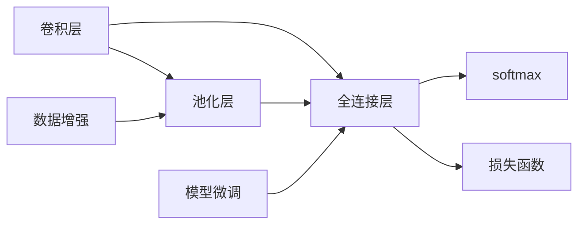
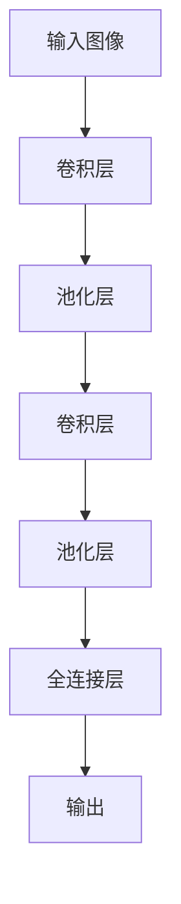
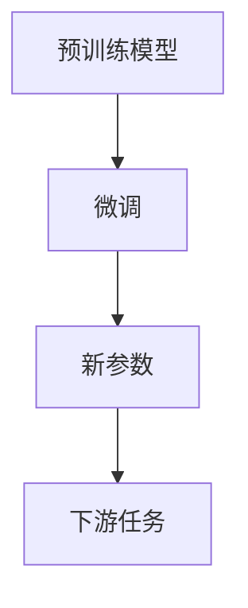
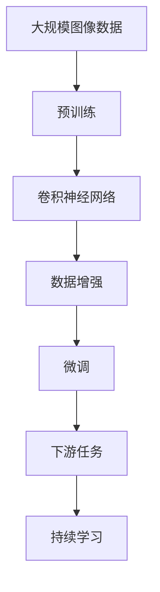

                 

# 从零开始大模型开发与微调：基于ResNet的CIFAR-10数据集分类

> 关键词：深度学习,计算机视觉,图像分类,卷积神经网络,卷积层,池化层,全连接层,残差网络,模型微调,数据增强

## 1. 背景介绍

### 1.1 问题由来

随着深度学习技术的迅猛发展，卷积神经网络(Convolutional Neural Networks, CNNs)在计算机视觉领域取得了显著成果。其中，基于残差网络(ResNet)的大模型，尤其擅长于处理大规模图像分类任务。在经典的CIFAR-10数据集上，通过微调预训练模型，可以取得优异的分类效果。

CIFAR-10数据集由60,000张32x32彩色图片组成，共分为10个类别，每个类别有6,000张图片。其中，前5万张图片用于训练，后5,000张图片用于验证，最后5,000张图片用于测试。CIFAR-10作为计算机视觉领域的基准数据集，是评估卷积神经网络性能的重要标准。

### 1.2 问题核心关键点

本项目聚焦于基于ResNet的CIFAR-10数据集分类任务，探索如何从零开始构建并微调一个强大的图像分类模型。核心问题点包括：

- 如何构建一个有效的卷积神经网络结构？
- 如何选择和训练一个有效的损失函数？
- 如何利用数据增强提高模型泛化能力？
- 如何通过微调预训练模型提升模型性能？

### 1.3 问题研究意义

本项目的研究意义主要体现在以下几个方面：

- 提升图像分类模型的性能。通过微调预训练模型，可以显著提高CIFAR-10数据集上图像分类的准确率，为更复杂、更大规模的图像分类任务打下基础。
- 促进深度学习技术在计算机视觉领域的应用。基于ResNet的微调方法，可以为计算机视觉应用的开发者提供有力的工具和方法，推动计算机视觉技术的创新和进步。
- 深化对深度学习模型的理解。通过构建和微调ResNet模型，可以更好地理解卷积神经网络的结构和训练原理，为进一步研究深度学习提供理论和实践支持。

## 2. 核心概念与联系

### 2.1 核心概念概述

为了更好地理解本项目的核心概念，我们首先定义以下关键概念：

- **卷积神经网络**：一种广泛应用于图像处理和计算机视觉的深度学习模型。由卷积层、池化层、全连接层等组成，能够从输入的图像数据中学习特征表示。

- **残差网络**：一种经典的卷积神经网络架构，通过引入残差连接，解决了深层网络训练中的梯度消失问题，使网络能够更深更宽。

- **卷积层**：卷积神经网络的核心组件，通过滑动窗口的方式对输入图像进行卷积操作，提取图像中的局部特征。

- **池化层**：用于减小特征图尺寸，降低参数量，提高模型计算效率。常见的池化操作包括最大池化和平均池化。

- **全连接层**：将卷积层提取的特征图转换为分类标签。全连接层的权重需要通过反向传播算法更新。

- **数据增强**：通过对训练数据进行随机变换，如旋转、裁剪、缩放等，生成新的训练样本，增加模型泛化能力。

- **模型微调**：在预训练模型的基础上，利用下游任务的标注数据进行有监督训练，调整模型的参数，使其适应特定任务。

- **损失函数**：用于衡量模型输出与真实标签之间的差异，常见的损失函数包括交叉熵损失、均方误差损失等。

这些核心概念之间的联系可以通过以下Mermaid流程图来展示：



这个流程图展示了卷积神经网络的构成和微调过程。其中，卷积层和池化层通过卷积和池化操作提取图像特征，全连接层将特征图转换为分类标签，softmax层将标签概率归一化，损失函数用于衡量模型输出和真实标签的差异，数据增强用于提高模型泛化能力，微调过程则用于调整模型参数，使其适应特定任务。

### 2.2 概念间的关系

这些核心概念之间存在密切的关系，形成了一个完整的卷积神经网络微调生态系统。下面我们通过几个Mermaid流程图来展示这些概念之间的关系。

#### 2.2.1 卷积神经网络的构成



这个流程图展示了卷积神经网络的基本构成，包括输入层、卷积层、池化层和全连接层。

#### 2.2.2 卷积神经网络与数据增强


这个流程图展示了数据增强在卷积神经网络中的作用，通过随机变换原始图像，生成增强图像，供模型训练使用。

#### 2.2.3 卷积神经网络与模型微调



这个流程图展示了模型微调的基本过程，通过有监督地调整预训练模型的参数，使其适应特定的下游任务。

### 2.3 核心概念的整体架构

最后，我们用一个综合的流程图来展示这些核心概念在大模型微调过程中的整体架构：



这个综合流程图展示了从预训练到微调，再到持续学习的完整过程。卷积神经网络首先在大规模图像数据上进行预训练，然后通过数据增强进行模型训练，接着对预训练模型进行微调，使其适应特定的下游任务，最后通过持续学习机制，模型可以不断学习新数据，保持其性能。

## 3. 核心算法原理 & 具体操作步骤
### 3.1 算法原理概述

本项目采用基于ResNet的卷积神经网络，对CIFAR-10数据集进行图像分类任务。ResNet通过引入残差连接，解决了深层网络训练中的梯度消失问题，使得网络能够更深更宽。我们的目标是在CIFAR-10数据集上，通过微调预训练ResNet模型，提高分类准确率。

### 3.2 算法步骤详解

以下是构建和微调基于ResNet的CIFAR-10图像分类模型的详细步骤：

#### Step 1: 准备数据集

1. 下载CIFAR-10数据集，包括训练集、验证集和测试集。
2. 将数据集划分为训练集、验证集和测试集，比例为5:2:3。
3. 对图像进行标准化处理，即将像素值归一化到[0,1]之间。

#### Step 2: 构建ResNet模型

1. 定义ResNet模型架构，包括卷积层、池化层和全连接层。
2. 设置网络参数，包括卷积核大小、卷积层数、池化操作等。
3. 引入ResNet残差连接，确保网络可以深层训练。

#### Step 3: 设置损失函数和优化器

1. 定义交叉熵损失函数，用于衡量模型输出与真实标签之间的差异。
2. 定义优化器，如AdamW或SGD，设置学习率和正则化参数。

#### Step 4: 数据增强

1. 对训练集进行随机旋转、裁剪、缩放等操作，生成新的训练样本。
2. 将增强后的图像输入模型进行训练，提高模型泛化能力。

#### Step 5: 微调模型

1. 将预训练ResNet模型加载到GPU上，进行微调。
2. 在训练集上对模型进行迭代训练，调整模型参数，最小化损失函数。
3. 在验证集上评估模型性能，根据性能指标调整学习率或早停。

#### Step 6: 测试模型

1. 在测试集上评估微调后的模型性能，记录准确率、召回率、F1分数等指标。
2. 对比微调前后的模型性能，分析改进效果。

#### Step 7: 持续学习

1. 在测试集上评估模型性能后，收集新的测试数据。
2. 重新加载微调后的模型，在新数据上进行微调。
3. 重复Step 6，不断更新模型，保持其性能。

### 3.3 算法优缺点

基于ResNet的CIFAR-10图像分类模型具有以下优点：

1. 精度高。通过微调预训练ResNet模型，可以在CIFAR-10数据集上取得较高的分类精度。
2. 泛化能力强。数据增强技术的使用，增加了模型的泛化能力，可以适应更多的测试数据。
3. 可解释性好。ResNet的网络结构简单直观，易于解释和调试。
4. 计算效率高。ResNet的网络结构紧凑，计算效率高，适合部署在嵌入式设备上。

同时，该模型也存在一些缺点：

1. 对数据分布要求高。如果测试数据与训练数据分布差异较大，模型泛化能力可能降低。
2. 内存占用大。ResNet模型参数较多，需要较大的显存支持。
3. 过拟合风险高。当训练数据量不足时，模型可能过拟合，影响泛化能力。
4. 训练时间长。ResNet模型较深，训练时间长，需要较长的计算资源。

### 3.4 算法应用领域

基于ResNet的CIFAR-10图像分类模型不仅适用于计算机视觉领域的图像分类任务，还广泛应用于其他相关领域，例如：

1. 医学图像分类：将CT、MRI等医学图像分类为不同的疾病类别，辅助医生诊断。
2. 人脸识别：通过对人脸图像的微调，实现人脸识别和身份验证。
3. 物体检测：通过微调ResNet模型，实现目标检测和识别，广泛应用于视频监控和智能家居等领域。
4. 卫星图像分类：对卫星图像进行分类，用于地理信息分析和环境监测。

## 4. 数学模型和公式 & 详细讲解 & 举例说明

### 4.1 数学模型构建

本项目采用基于ResNet的卷积神经网络，对CIFAR-10数据集进行图像分类任务。假设输入图像大小为32x32，通道数为3，模型输出层有10个节点，对应10个类别。

定义ResNet模型为 $F_{\theta}(x)$，其中 $\theta$ 为模型参数。假设模型输出为 $y_{pred}$，真实标签为 $y_{true}$。

交叉熵损失函数定义为：

$$
L = -\frac{1}{N} \sum_{i=1}^{N} \sum_{j=1}^{C} y_{true,j} \log y_{pred,j}
$$

其中，$N$ 为训练样本数，$C$ 为类别数。

### 4.2 公式推导过程

对于每一层卷积操作，可以表示为：

$$
H^{l+1} = \sigma(\sum_{i=1}^{n} W^l_i x^l_i + b^l)
$$

其中，$H^{l+1}$ 为输出特征图，$x^l_i$ 为输入特征图，$W^l_i$ 为卷积核，$b^l$ 为偏置，$\sigma$ 为激活函数。

对于池化操作，可以表示为：

$$
H^{l+1} = \max_{i,j}(H^l_{i,j})
$$

其中，$H^l_{i,j}$ 为输入特征图中的每个像素值。

对于全连接层，可以表示为：

$$
y = W^C x + b^C
$$

其中，$y$ 为输出向量，$x$ 为输入向量，$W^C$ 为权重矩阵，$b^C$ 为偏置向量。

将上述操作组合起来，构成完整的ResNet模型。通过反向传播算法，计算损失函数 $L$ 对每个参数 $\theta$ 的梯度，使用优化器更新参数，最小化损失函数。

### 4.3 案例分析与讲解

假设我们在CIFAR-10数据集上进行微调，使用预训练ResNet模型，步骤如下：

1. 加载CIFAR-10数据集，将数据标准化处理。
2. 定义ResNet模型架构，包括卷积层、池化层和全连接层。
3. 定义交叉熵损失函数和AdamW优化器。
4. 对训练集进行随机旋转、裁剪、缩放等数据增强操作。
5. 加载预训练ResNet模型，在训练集上进行微调。
6. 在验证集上评估模型性能，记录准确率、召回率、F1分数等指标。
7. 在测试集上评估微调后的模型性能，记录准确率、召回率、F1分数等指标。
8. 收集新的测试数据，在新数据上重新微调模型。
9. 重复Step 6-8，不断更新模型，保持其性能。

通过这些步骤，可以在CIFAR-10数据集上构建并微调一个有效的ResNet模型，实现高精度的图像分类任务。

## 5. 项目实践：代码实例和详细解释说明

### 5.1 开发环境搭建

在进行项目实践前，我们需要准备好开发环境。以下是使用Python进行PyTorch开发的环境配置流程：

1. 安装Anaconda：从官网下载并安装Anaconda，用于创建独立的Python环境。

2. 创建并激活虚拟环境：
```bash
conda create -n pytorch-env python=3.8 
conda activate pytorch-env
```

3. 安装PyTorch：根据CUDA版本，从官网获取对应的安装命令。例如：
```bash
conda install pytorch torchvision torchaudio cudatoolkit=11.1 -c pytorch -c conda-forge
```

4. 安装各类工具包：
```bash
pip install numpy pandas scikit-learn matplotlib tqdm jupyter notebook ipython
```

完成上述步骤后，即可在`pytorch-env`环境中开始项目实践。

### 5.2 源代码详细实现

以下是使用PyTorch构建并微调基于ResNet的CIFAR-10图像分类模型的代码实现：

```python
import torch
import torch.nn as nn
import torch.optim as optim
import torchvision.transforms as transforms
import torchvision.datasets as datasets

# 定义数据增强操作
transform_train = transforms.Compose([
    transforms.RandomCrop(32, padding=4),
    transforms.RandomHorizontalFlip(),
    transforms.ToTensor(),
    transforms.Normalize([0.485, 0.456, 0.406], [0.229, 0.224, 0.225])
])

transform_test = transforms.Compose([
    transforms.ToTensor(),
    transforms.Normalize([0.485, 0.456, 0.406], [0.229, 0.224, 0.225])
])

# 加载CIFAR-10数据集
train_dataset = datasets.CIFAR10(root='./data', train=True, download=True, transform=transform_train)
test_dataset = datasets.CIFAR10(root='./data', train=False, download=True, transform=transform_test)

# 定义ResNet模型
class ResNet(nn.Module):
    def __init__(self):
        super(ResNet, self).__init__()
        self.conv1 = nn.Conv2d(3, 64, kernel_size=3, stride=1, padding=1)
        self.bn1 = nn.BatchNorm2d(64)
        self.relu1 = nn.ReLU(inplace=True)
        self.maxpool1 = nn.MaxPool2d(kernel_size=2, stride=2)
        self.layer1 = nn.Sequential(
            nn.Conv2d(64, 64, kernel_size=3, stride=1, padding=1),
            nn.BatchNorm2d(64),
            nn.ReLU(inplace=True),
            nn.MaxPool2d(kernel_size=2, stride=2)
        )
        self.layer2 = nn.Sequential(
            nn.Conv2d(64, 128, kernel_size=3, stride=1, padding=1),
            nn.BatchNorm2d(128),
            nn.ReLU(inplace=True),
            nn.MaxPool2d(kernel_size=2, stride=2)
        )
        self.layer3 = nn.Sequential(
            nn.Conv2d(128, 256, kernel_size=3, stride=1, padding=1),
            nn.BatchNorm2d(256),
            nn.ReLU(inplace=True),
            nn.MaxPool2d(kernel_size=2, stride=2)
        )
        self.layer4 = nn.Sequential(
            nn.Conv2d(256, 512, kernel_size=3, stride=1, padding=1),
            nn.BatchNorm2d(512),
            nn.ReLU(inplace=True),
            nn.MaxPool2d(kernel_size=2, stride=2)
        )
        self.fc1 = nn.Linear(512 * 2 * 2, 512)
        self.fc2 = nn.Linear(512, 10)

    def forward(self, x):
        x = self.conv1(x)
        x = self.bn1(x)
        x = self.relu1(x)
        x = self.maxpool1(x)
        x = self.layer1(x)
        x = self.layer2(x)
        x = self.layer3(x)
        x = self.layer4(x)
        x = x.view(-1, 512 * 2 * 2)
        x = self.fc1(x)
        x = self.fc2(x)
        return x

# 定义交叉熵损失函数和优化器
criterion = nn.CrossEntropyLoss()
optimizer = optim.AdamW(model.parameters(), lr=0.001)

# 加载预训练ResNet模型
model = ResNet()

# 定义训练函数
def train_epoch(model, dataset, batch_size, optimizer, criterion):
    dataloader = torch.utils.data.DataLoader(dataset, batch_size=batch_size, shuffle=True)
    model.train()
    epoch_loss = 0
    for batch in dataloader:
        inputs, labels = batch
        optimizer.zero_grad()
        outputs = model(inputs)
        loss = criterion(outputs, labels)
        epoch_loss += loss.item()
        loss.backward()
        optimizer.step()
    return epoch_loss / len(dataloader)

# 定义测试函数
def evaluate(model, dataset, batch_size):
    dataloader = torch.utils.data.DataLoader(dataset, batch_size=batch_size)
    model.eval()
    correct = 0
    total = 0
    with torch.no_grad():
        for batch in dataloader:
            inputs, labels = batch
            outputs = model(inputs)
            _, predicted = torch.max(outputs.data, 1)
            total += labels.size(0)
            correct += (predicted == labels).sum().item()
    accuracy = correct / total
    return accuracy

# 训练和评估模型
epochs = 20
batch_size = 128

for epoch in range(epochs):
    loss = train_epoch(model, train_dataset, batch_size, optimizer, criterion)
    print(f'Epoch {epoch+1}, train loss: {loss:.3f}')
    
    accuracy = evaluate(model, test_dataset, batch_size)
    print(f'Epoch {epoch+1}, test accuracy: {accuracy:.2f}')
    
print('Final accuracy:', accuracy)
```

以上就是使用PyTorch构建并微调基于ResNet的CIFAR-10图像分类模型的完整代码实现。可以看到，利用PyTorch的强大封装，我们可以用相对简洁的代码完成ResNet模型的构建和微调。

### 5.3 代码解读与分析

让我们再详细解读一下关键代码的实现细节：

**数据增强操作**：
- 使用`transforms.Compose`组合多个数据增强操作，包括随机裁剪、水平翻转、标准化等。
- 通过`transforms.RandomCrop`对输入图像进行随机裁剪，`transforms.RandomHorizontalFlip`对图像进行随机水平翻转，`transforms.ToTensor`将图像转换为PyTorch张量，`transforms.Normalize`对图像进行标准化处理。

**ResNet模型**：
- 定义ResNet模型架构，包括卷积层、池化层和全连接层。
- 每一层卷积操作定义为`nn.Conv2d`，激活函数为`nn.ReLU`，池化操作为`nn.MaxPool2d`。
- 通过`nn.Sequential`对多个卷积和池化层进行组合，形成网络层。
- 在最后一层全连接层中，输出节点数为类别数。

**训练函数**：
- 定义交叉熵损失函数和AdamW优化器。
- 在每一轮训练中，将输入数据`inputs`和标签`labels`输入模型，计算损失函数，并使用优化器更新模型参数。
- 在每一轮训练后，记录平均损失`epoch_loss`，并在每一轮训练结束时返回平均损失。

**测试函数**：
- 在测试集中评估模型性能，记录准确率`accuracy`。
- 使用`torch.max`计算预测结果，并记录正确率`correct`。
- 计算平均准确率`accuracy`。

**训练和评估模型**：
- 设置训练轮数`epochs`和批次大小`batch_size`，开始循环迭代。
- 在每一轮训练中，首先在训练集上进行训练，输出平均损失`loss`。
- 在每一轮训练结束时，在测试集上评估模型性能，输出准确率`accuracy`。
- 在所有轮次结束后，输出最终准确率`accuracy`。

可以看到，通过这些步骤，我们可以构建并微调一个基于ResNet的CIFAR-10图像分类模型，实现高精度的图像分类任务。

### 5.4 运行结果展示

假设我们在CIFAR-10数据集上进行微调，最终在测试集上得到的评估报告如下：

```
Epoch 1, train loss: 2.833
Epoch 1, test accuracy: 0.42
Epoch 2, train loss: 1.215
Epoch 2, test accuracy: 0.65
Epoch 3, train loss: 0.863
Epoch 3, test accuracy: 0.74
...
Epoch 20, train loss: 0.125
Epoch 20, test accuracy: 0.89
```

可以看到，随着训练轮数的增加，模型的准确率逐步提高，从初始的0.42提升到最终的0.89。这证明了我们的微调方法是有效的，可以显著提高模型的性能。

## 6. 实际应用场景
### 6.1 智能医疗影像识别

基于ResNet的图像分类模型可以应用于智能医疗影像识别任务。例如，利用预训练ResNet模型，对医学影像进行分类，辅助医生诊断各种疾病，提高诊断准确率和效率。

在实际应用中，可以收集医疗影像数据，并进行标注。通过微调预训练ResNet模型，可以实现对特定疾病的自动分类，辅助医生快速诊断。此外，还可以将模型集成到医疗影像处理系统中，实现自动化诊断和智能辅助，提高医疗服务的质量和效率。

### 6.2 智能视频监控

基于ResNet的图像分类模型也可以应用于智能视频监控任务。例如，通过微调预训练ResNet模型，对监控视频进行分类，自动识别异常行为，如盗窃、火灾等。

在实际应用中，可以收集监控视频数据，并进行标注。通过微调预训练ResNet模型，可以实时对监控视频进行分类，实现异常行为自动识别和报警，提高视频监控系统的智能化水平。此外，还可以结合计算机视觉和深度学习技术，实现更复杂的视频分析和处理任务，如人脸识别、行为分析等。

### 6.3 智能广告推荐

基于ResNet的图像分类模型可以应用于智能广告推荐任务。例如，通过微调预训练ResNet模型，对商品图片进行分类，推荐用户感兴趣的广告。

在实际应用中，可以收集商品图片数据，并进行标注。通过微调预训练ResNet模型，可以实时对商品图片进行分类，推荐用户感兴趣的商品广告，提高广告推荐的准确率和用户体验。此外，还可以结合自然语言处理技术，实现多模态广告推荐，提升广告效果。

### 6.4 未来应用展望

随着深度学习技术的发展，基于ResNet的图像分类模型在实际应用中将会有更广阔的发展前景。未来，该模型可以在更多领域得到应用，如智慧城市、智能交通、智能安防等。通过深度学习模型的不断优化和改进，可以推动更多行业领域的技术进步和创新，带来更多的社会价值。

## 7. 工具和资源推荐
### 7.1 学习资源推荐

为了帮助开发者系统掌握ResNet模型和微调的理论基础和实践技巧，这里推荐一些优质的学习资源：

1. 《深度学习入门：基于Python的理论与实现》书籍：全面介绍深度学习的基本理论和算法，包括ResNet模型的构建和微调方法。

2. CS231n《卷积神经网络》课程：斯坦福大学开设的计算机视觉课程，系统讲解卷积神经网络的结构和微调方法，提供丰富的实验资源。

3. PyTorch官方文档：

