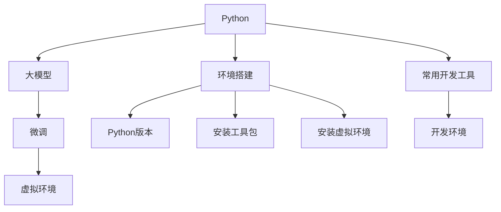

                 

# 从零开始大模型开发与微调：环境搭建1：安装Python

> 关键词：大模型开发,微调,Python环境,环境搭建,安装指南,计算机程序设计

## 1. 背景介绍

### 1.1 问题由来

随着人工智能技术的迅猛发展，大模型（Large Models）已经成为AI研究的热点之一。它们能够通过大规模的预训练数据集学习到丰富的知识，并在微调（Fine-tuning）阶段进一步适应特定任务，从而在各种自然语言处理（NLP）任务中表现出卓越的性能。然而，大模型开发与微调是一个复杂且需要高精度的过程，对开发环境要求较高。其中，安装Python环境是整个开发过程中的第一步，本文将为您详细介绍如何在Windows和Linux系统上安装Python，以及如何在不同的Python版本中安装相应的包和工具。

### 1.2 问题核心关键点

Python作为大模型开发与微调的主要编程语言，其环境搭建的重要性不言而喻。一个稳定且高效的环境将极大地提升开发效率，避免因环境问题导致的调试困难。本节将重点讨论以下几个关键点：

- 不同版本Python的优缺点对比
- Windows和Linux系统的安装方法
- Python虚拟环境的使用
- 常用开发工具的安装

## 2. 核心概念与联系

### 2.1 核心概念概述

在进行大模型开发与微调前，首先需要理解一些核心概念：

- Python：一种广泛用于科学计算、数据分析和人工智能领域的高级编程语言。
- 大模型（Large Model）：指具有大规模参数和计算能力的深度学习模型，如BERT、GPT-3等。
- 微调（Fine-tuning）：在大模型基础上，通过少量标注数据进行有监督学习，以适应特定任务的过程。
- 环境搭建（Environment Setup）：在大模型开发与微调前，对开发环境进行配置，包括安装Python、工具包、虚拟环境等。
- 虚拟环境（Virtual Environment）：在Python中创建的一个隔离的环境，可用于独立安装和管理包。

这些概念构成了大模型开发与微调的基础框架，相互关联，共同支撑整个开发过程。接下来，我们将通过Mermaid流程图详细展示这些概念之间的关系：



这个流程图展示了大模型开发与微调中各个核心概念之间的联系：

1. Python是基础编程语言，用于大模型开发与微调。
2. 大模型通过微调来适应特定任务，提升性能。
3. 虚拟环境为每个项目提供独立的Python安装和包管理。
4. 环境搭建涵盖Python版本选择、工具包安装和虚拟环境设置。
5. 常用开发工具提供更多功能和支持。
6. 配置好的开发环境将支持大模型开发与微调。

## 3. 核心算法原理 & 具体操作步骤

### 3.1 算法原理概述

大模型开发与微调的算法原理基于监督学习。在大规模无标签数据上，使用深度学习技术训练出一个大模型，然后通过微调过程，利用少量标注数据对其进行优化，使其适应特定任务。这一过程可以分为以下步骤：

1. 数据预处理：将原始数据进行清洗、分词、编码等处理，转换为模型可处理的格式。
2. 模型加载：加载预训练模型，通常采用如BERT、GPT等架构。
3. 微调训练：使用微调数据集对模型进行有监督学习，调整模型参数。
4. 模型评估：在测试集上评估模型性能，调整微调参数，直至达到理想效果。

### 3.2 算法步骤详解

本节将详细讲解大模型开发与微调的具体操作步骤：

**Step 1: 选择合适的Python版本**

Python的多个版本之间存在差异，通常建议选择3.x或3.x以上版本。

- Python 2.x：已经停止更新，不再推荐使用。
- Python 3.6/3.7：较为稳定，支持良好，兼容性较好。
- Python 3.8/3.9：最新的稳定版本，性能和特性更优。
- Python 3.10：最新的开发版本，提供更多新特性。

**Step 2: 安装Python**

1. **Windows系统安装Python**

   - 访问Python官网下载对应版本的安装程序。
   - 双击安装程序，按照向导提示完成安装。
   - 安装过程中，选择安装路径，并勾选“Add Python to PATH”以使Python环境变量被添加到系统路径中。

2. **Linux系统安装Python**

   - 打开终端，执行命令 `sudo apt-get update` 更新软件源。
   - 执行命令 `sudo apt-get install python3.x` 安装指定版本的Python。
   - 确认安装成功，可以通过 `python3 --version` 查看Python版本。

**Step 3: 创建虚拟环境**

Python虚拟环境用于独立管理项目的依赖和版本，防止不同项目之间的依赖冲突。

- 执行命令 `python -m venv venv` 创建虚拟环境，其中 `venv` 为虚拟环境名称。
- 进入虚拟环境：`source venv/bin/activate` 或 `.\venv\Scripts\activate`（Windows系统）。
- 退出虚拟环境：`deactivate`。

**Step 4: 安装常用开发工具**

- `pip`：Python包管理工具，用于安装和管理第三方库。
  - 执行命令 `python -m pip install pip --upgrade` 安装或更新pip。
- `Pipenv`：更加智能的包管理工具，自动解决依赖冲突。
  - 执行命令 `pip install pipenv` 安装Pipenv。
- `virtualenv`：Python虚拟环境工具，适用于创建和管理虚拟环境。
  - 执行命令 `pip install virtualenv` 安装virtualenv。
- `PyCharm`：流行的Python IDE，支持代码调试和版本控制。
  - 访问PyCharm官网下载对应版本安装程序，按照提示完成安装。

**Step 5: 安装TensorFlow等常用库**

- 执行命令 `pip install tensorflow==X.X.X` 安装指定版本的TensorFlow。
- 执行命令 `pip install transformers` 安装Transformer库。
- 执行命令 `pip install pandas` 安装Pandas库，用于数据处理和分析。
- 执行命令 `pip install numpy` 安装NumPy库，用于科学计算。
- 执行命令 `pip install scikit-learn` 安装Scikit-learn库，用于机器学习。

### 3.3 算法优缺点

#### 优点

- **灵活性**：Python具有良好的灵活性，支持多种编程范式和工具，适用于不同的开发场景。
- **生态丰富**：Python拥有庞大的开源社区和丰富的第三方库，方便快速实现功能。
- **性能稳定**：Python 3.x版本的性能和稳定性得到显著提升，可以应对大规模数据处理和复杂计算。

#### 缺点

- **运行效率较低**：相比于C++等编译语言，Python的运行效率较低，适用于数据密集型任务时需谨慎。
- **资源消耗大**：Python在处理大量数据时，内存和CPU资源消耗较大，需要合理管理资源。

### 3.4 算法应用领域

Python在大模型开发与微调中的应用领域广泛，包括但不限于以下几个方面：

- 自然语言处理（NLP）：如文本分类、情感分析、机器翻译等。
- 计算机视觉（CV）：如图像识别、目标检测等。
- 推荐系统：如电商推荐、新闻推荐等。
- 数据分析与可视化：如数据清洗、数据可视化等。
- 科学计算：如物理模拟、生物信息学等。

## 4. 数学模型和公式 & 详细讲解

### 4.1 数学模型构建

在微调过程中，我们需要构建数学模型来描述模型的训练过程。假设我们的微调任务为二分类问题，使用交叉熵损失函数。

设模型参数为 $\theta$，输入数据为 $x$，模型预测概率为 $\hat{y}$，真实标签为 $y$，则交叉熵损失函数定义为：

$$
L(\theta, x, y) = -(y\log \hat{y} + (1-y)\log (1-\hat{y}))
$$

在训练过程中，我们的目标是最小化损失函数：

$$
\min_{\theta} \frac{1}{N} \sum_{i=1}^N L(\theta, x_i, y_i)
$$

### 4.2 公式推导过程

根据上述损失函数，我们可以推导出模型参数的梯度更新公式：

$$
\frac{\partial L(\theta, x, y)}{\partial \theta} = -(y-\hat{y})\frac{\partial \hat{y}}{\partial \theta}
$$

其中 $\frac{\partial \hat{y}}{\partial \theta}$ 为模型的导数，可以通过反向传播算法计算。

### 4.3 案例分析与讲解

以二分类任务为例，我们可以使用TensorFlow框架进行微调。假设模型为全连接神经网络，具有两层隐藏层，第一层有64个神经元，第二层有32个神经元。使用二分类交叉熵损失函数。

```python
import tensorflow as tf
from tensorflow.keras import layers

# 定义模型
model = tf.keras.Sequential([
    layers.Dense(64, activation='relu'),
    layers.Dense(32, activation='relu'),
    layers.Dense(1, activation='sigmoid')
])

# 编译模型
model.compile(optimizer='adam', loss='binary_crossentropy', metrics=['accuracy'])

# 训练模型
model.fit(x_train, y_train, epochs=10, batch_size=32, validation_data=(x_val, y_val))

# 评估模型
model.evaluate(x_test, y_test)
```

## 5. 项目实践：代码实例和详细解释说明

### 5.1 开发环境搭建

**Step 1: 选择开发环境**

- 可以选择本地机器安装Python和相关库，也可以使用云平台如AWS、Google Cloud等。
- 建议安装Python 3.6或3.7版本，以避免与第三方库兼容问题。

**Step 2: 安装Python和常用库**

- 在Windows系统上，可以使用Python官网下载安装程序进行安装。
- 在Linux系统上，可以使用包管理器如apt-get或yum进行安装。
- 安装完成后，通过命令行验证安装是否成功。

**Step 3: 创建虚拟环境**

- 在命令行中使用 `python -m venv venv` 创建虚拟环境。
- 进入虚拟环境后，可以使用 `pip install` 命令安装所需库。

### 5.2 源代码详细实现

**Step 1: 安装依赖**

```bash
pip install tensorflow transformers pandas numpy scikit-learn
```

**Step 2: 编写微调代码**

```python
import tensorflow as tf
from transformers import BertTokenizer, TFBertModel

# 加载预训练模型和tokenizer
tokenizer = BertTokenizer.from_pretrained('bert-base-cased')
model = TFBertModel.from_pretrained('bert-base-cased')

# 准备数据
train_data = ...  # 训练数据
val_data = ...    # 验证数据
test_data = ...   # 测试数据

# 定义微调过程
def train_epoch(model, tokenizer, training_data, validation_data):
    batch_size = 16
    num_epochs = 5

    # 加载数据
    training_dataset = tokenizer(train_data, padding=True, truncation=True, max_length=512)
    validation_dataset = tokenizer(val_data, padding=True, truncation=True, max_length=512)

    # 定义模型
    class BertModel(tf.keras.Model):
        def __init__(self, base_model):
            super(BertModel, self).__init__()
            self.base_model = base_model
            self.classifier = tf.keras.layers.Dense(2)

        def call(self, inputs):
            outputs = self.base_model(inputs['input_ids'], attention_mask=inputs['attention_mask'])
            logits = self.classifier(outputs.pooler_output)
            return logits

    # 实例化模型
    model = BertModel(model)

    # 定义损失函数和优化器
    loss_fn = tf.keras.losses.BinaryCrossentropy()
    optimizer = tf.keras.optimizers.Adam()

    # 训练模型
    for epoch in range(num_epochs):
        total_loss = 0
        for batch in training_dataset:
            with tf.GradientTape() as tape:
                logits = model(batch)
                loss = loss_fn(y_true=batch['label'], y_pred=logits)
            grads = tape.gradient(loss, model.trainable_variables)
            optimizer.apply_gradients(zip(grads, model.trainable_variables))
            total_loss += loss

        # 验证集验证
        val_loss = 0
        for batch in validation_dataset:
            logits = model(batch)
            loss = loss_fn(y_true=batch['label'], y_pred=logits)
            val_loss += loss

        print('Epoch {}, train loss={:.4f}, validation loss={:.4f}'.format(epoch+1, total_loss, val_loss))

    return model
```

**Step 3: 运行微调代码**

```python
# 训练模型
model = train_epoch(model, tokenizer, train_data, val_data)

# 评估模型
test_loss = 0
for batch in test_data:
    logits = model(batch)
    loss = loss_fn(y_true=batch['label'], y_pred=logits)
    test_loss += loss

print('Test loss={:.4f}'.format(test_loss))
```

### 5.3 代码解读与分析

通过上述代码，我们完成了一个基于BERT模型的二分类任务微调。具体步骤如下：

- **准备数据**：将训练数据、验证数据和测试数据通过BertTokenizer进行token化。
- **定义模型**：使用BertModel定义微调模型，包含BERT预训练模型的底层和自定义分类器。
- **定义损失函数和优化器**：使用交叉熵损失函数和Adam优化器。
- **训练模型**：在训练数据集上迭代训练，更新模型参数。
- **评估模型**：在测试数据集上评估模型性能。

## 6. 实际应用场景

大模型开发与微调的应用场景广泛，以下是几个典型案例：

### 6.1 自然语言处理（NLP）

自然语言处理是大模型开发与微调的主要应用领域之一。通过微调，模型可以适应各种NLP任务，如文本分类、命名实体识别、机器翻译等。例如，通过微调BERT模型，可以实现情感分析、新闻分类等任务，极大地提升了NLP系统的性能和效率。

### 6.2 计算机视觉（CV）

计算机视觉是大模型开发与微调的重要应用领域，包括图像分类、目标检测、人脸识别等。通过微调，模型可以适应特定的视觉任务，提高识别准确率。例如，通过微调YOLOv3模型，可以实现高速实时目标检测，应用于无人驾驶、安防等领域。

### 6.3 推荐系统

推荐系统是大模型开发与微调的重要应用之一。通过微调，模型可以适应特定的推荐任务，提升推荐效果。例如，通过微调协同过滤模型，可以实现个性化推荐，应用于电商、新闻等领域，提高用户体验和转化率。

## 7. 工具和资源推荐

### 7.1 学习资源推荐

- 《Python编程：从入门到实践》：适合Python初学者阅读，包含丰富的实例和项目。
- 《深度学习入门与实践》：介绍深度学习基础知识和实践技巧，涵盖NLP、CV等领域。
- 《TensorFlow官方文档》：TensorFlow的权威指南，包含大量实例和API说明。
- 《Transformers官方文档》：Transformer库的详细文档，包含模型介绍、示例代码和配置指南。

### 7.2 开发工具推荐

- PyCharm：功能强大的Python IDE，支持代码调试和版本控制。
- Jupyter Notebook：交互式编程环境，适合数据分析和模型开发。
- GitHub：代码托管平台，适合版本控制和团队协作。

### 7.3 相关论文推荐

- 《Attention is All You Need》：Transformer的原始论文，奠定了大模型的基础。
- 《BERT: Pre-training of Deep Bidirectional Transformers for Language Understanding》：BERT模型的原始论文，推动了预训练大模型的发展。
- 《AdaLoRA: Adaptive Low-Rank Adaptation for Parameter-Efficient Fine-Tuning》：提出参数高效微调方法，优化了微调过程。

## 8. 总结：未来发展趋势与挑战

### 8.1 研究成果总结

大模型开发与微调技术的迅速发展，推动了人工智能在各个领域的广泛应用。通过微调，模型可以适应特定任务，提升性能。

### 8.2 未来发展趋势

未来，大模型开发与微调技术将呈现以下几个发展趋势：

- **算法优化**：开发更加高效、稳定的微调算法，减少计算资源消耗。
- **数据利用**：充分利用无监督学习、自监督学习等技术，减少对标注数据的依赖。
- **模型扩展**：开发支持更大规模数据和更复杂模型的微调技术，推动大模型向更加通用和普适的方向发展。
- **应用场景**：在医疗、教育、金融等领域拓展大模型应用，提升决策效率和准确性。

### 8.3 面临的挑战

尽管大模型开发与微调技术已经取得了显著成果，但仍面临诸多挑战：

- **计算资源**：大模型的训练和微调需要高性能计算资源，如何降低资源消耗是一个重要问题。
- **数据质量**：微调效果高度依赖于标注数据的质量和数量，如何获取高质量数据是一个难题。
- **模型泛化**：模型在不同数据集上的泛化性能需要进一步提升，避免过拟合。
- **伦理和安全性**：大模型的决策过程缺乏透明性和可解释性，如何提高模型伦理和安全性是一个重要研究方向。

### 8.4 研究展望

未来的研究需要从以下几个方面进行：

- **算法创新**：开发更加高效、稳定的微调算法，减少计算资源消耗。
- **数据获取**：开发新的数据获取方法，减少对标注数据的依赖。
- **模型扩展**：开发支持更大规模数据和更复杂模型的微调技术，推动大模型向更加通用和普适的方向发展。
- **应用落地**：在医疗、教育、金融等领域拓展大模型应用，提升决策效率和准确性。

## 9. 附录：常见问题与解答

**Q1: 大模型开发与微调需要哪些硬件资源？**

A: 大模型开发与微调需要高性能的GPU/TPU等硬件资源，尤其是大规模数据和复杂模型。建议配置至少一块NVIDIA RTX 3090或以上级别的显卡。

**Q2: 如何处理大模型内存不足的问题？**

A: 大模型内存消耗大，可以通过梯度积累、混合精度训练等技术进行优化。同时，可以使用TensorRT等加速库进行推理加速。

**Q3: 如何选择适当的优化器和学习率？**

A: 优化器和学习率的选择需根据具体任务和模型进行调试。常用优化器包括Adam、SGD等，学习率通常在0.001至0.1之间，具体可根据模型和数据情况进行调整。

**Q4: 大模型开发与微调中需要注意哪些异常情况？**

A: 大模型开发与微调中需要注意内存溢出、GPU显存不足、数据质量低等问题。这些问题通常可以通过调试代码、优化模型和数据预处理等方法解决。

**Q5: 大模型开发与微调是否需要大量的标注数据？**

A: 大模型开发与微调通常需要少量标注数据即可进行，但标注数据的质量和数量对模型性能有重要影响。

---

作者：禅与计算机程序设计艺术 / Zen and the Art of Computer Programming

