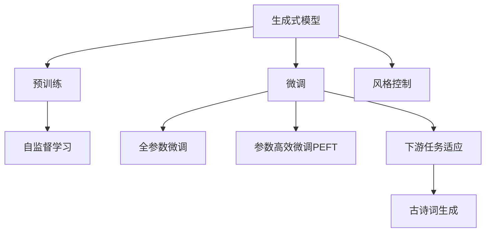
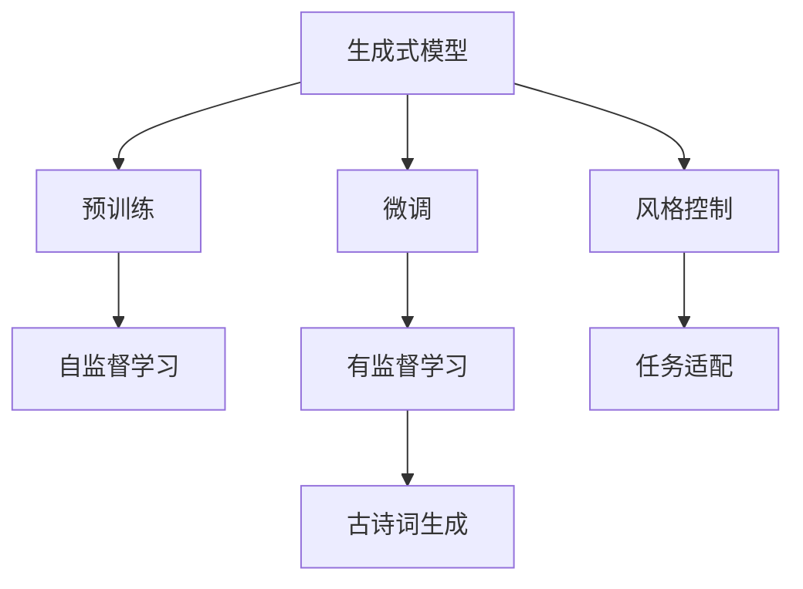
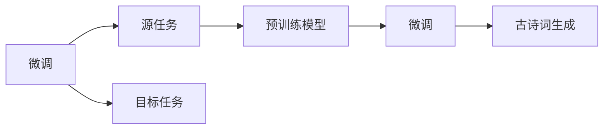
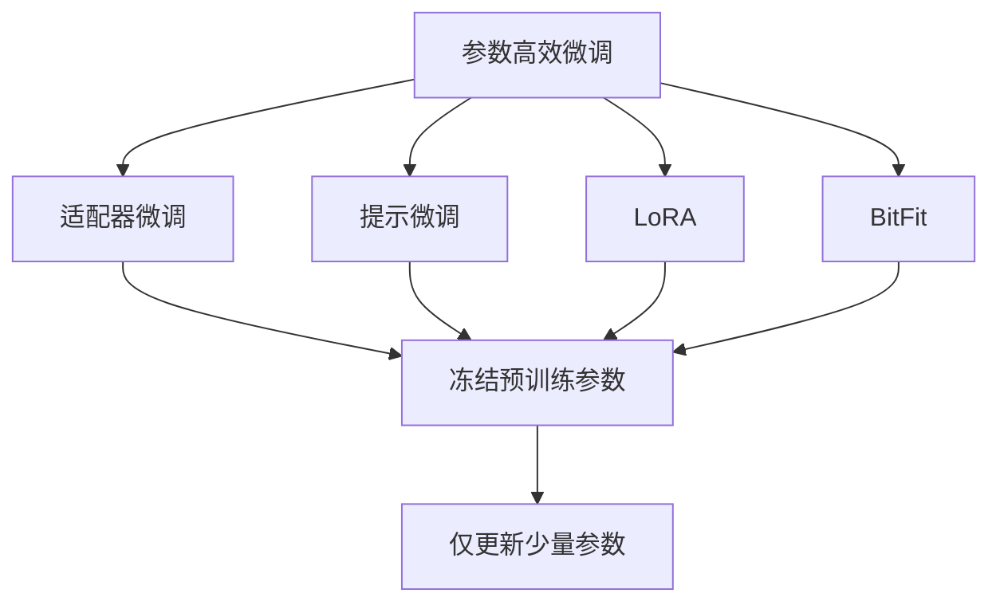
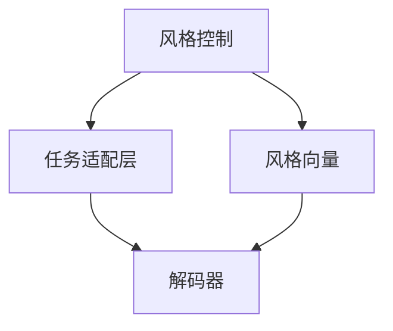
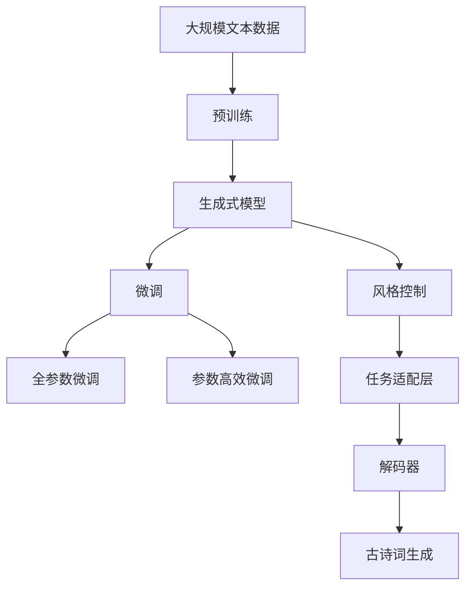

                 

# 从零开始大模型开发与微调：生成式模型实战：古诗词的生成

> 关键词：大语言模型,微调,Fine-tuning,生成式模型,古诗词生成,Transformer,BERT,预训练,下游任务,参数高效微调,自然语言处理(NLP)

## 1. 背景介绍

### 1.1 问题由来
近年来，深度学习技术在自然语言处理(NLP)领域取得了重大突破，尤其是在语言生成任务上，生成式模型如Transformer、GPT等大模型已经展示出强大的能力。这些大模型通过在海量文本数据上进行预训练，学习到丰富的语言表示和知识，并能够在生成式任务上取得显著的效果。

以古诗词生成为例，古诗词作为中国传统文化的重要组成部分，具有独特的韵律和美学价值。利用大模型进行古诗词生成，不仅能够传承和发扬中华优秀文化，还能够为教育、娱乐等领域提供更加生动有趣的内容，具有广阔的应用前景。

### 1.2 问题核心关键点
本文聚焦于基于生成式模型的古诗词生成任务。古诗词生成要求模型能够在给定的古诗词上，基于已有的语言模式和主题信息，生成符合风格的新古诗词。该任务的关键点包括：

- 预训练：使用大规模无标签文本数据，对生成式模型进行预训练。
- 微调：针对古诗词生成任务，利用少量有标签数据进行微调。
- 风格控制：通过微调，使生成式模型具备生成特定风格古诗词的能力。

## 2. 核心概念与联系

### 2.1 核心概念概述

为更好地理解生成式模型在古诗词生成中的应用，本节将介绍几个密切相关的核心概念：

- 生成式模型：指通过学习样本数据分布，能够产生新的样本数据的模型。生成式模型通常由编码器和解码器组成，编码器将输入数据映射到潜在空间，解码器则从潜在空间生成新的样本。
- 预训练：指在大量无标签文本数据上，使用自监督学习任务训练生成式模型的过程。常见的预训练任务包括语言建模、掩码预测等。
- 微调(Fine-tuning)：指在预训练模型的基础上，使用下游任务的少量标注数据，通过有监督学习优化模型在该任务上的性能。
- 风格控制：通过微调，使生成式模型能够生成具有特定风格的古诗词。
- 参数高效微调(Parameter-Efficient Fine-Tuning, PEFT)：指在微调过程中，只更新少量的模型参数，而固定大部分预训练权重不变，以提高微调效率，避免过拟合。
- 古诗词生成：指在给定上下文条件下，生成符合特定风格和韵律的新古诗词。

这些核心概念之间的逻辑关系可以通过以下Mermaid流程图来展示：



这个流程图展示了大语言模型的核心概念及其之间的关系：

1. 生成式模型通过预训练获得基础能力。
2. 微调是对预训练模型进行任务特定的优化，可以分为全参数微调和参数高效微调。
3. 风格控制通过微调，使生成式模型具备生成特定风格古诗词的能力。
4. 古诗词生成是生成式模型的下游任务之一。

### 2.2 概念间的关系

这些核心概念之间存在着紧密的联系，形成了生成式模型的完整生态系统。下面我们通过几个Mermaid流程图来展示这些概念之间的关系。

#### 2.2.1 生成式模型的学习范式



这个流程图展示了大语言模型的三种主要学习范式：预训练、微调和风格控制。预训练主要采用自监督学习方法，而微调则是有监督学习的过程。风格控制则是指微调过程通过特定的任务适配层，使模型能够生成符合特定风格的古诗词。

#### 2.2.2 微调与风格控制的关系



这个流程图展示了微调的基本原理，以及它与风格控制的关系。微调涉及到源任务和目标任务，预训练模型在源任务上学习，然后通过微调适应各种目标任务。风格控制则是微调的一部分，通过特定任务的适配层，使模型能够生成符合特定风格的古诗词。

#### 2.2.3 参数高效微调方法



这个流程图展示了几种常见的参数高效微调方法，包括适配器微调、提示微调、LoRA和BitFit。这些方法的共同特点是冻结大部分预训练参数，只更新少量参数，从而提高微调效率。

#### 2.2.4 风格控制的实现



这个流程图展示了风格控制的基本实现流程。通过设计特定的任务适配层，风格向量被嵌入到解码器的输入中，从而引导模型生成符合特定风格的新古诗词。

### 2.3 核心概念的整体架构

最后，我们用一个综合的流程图来展示这些核心概念在大语言模型古诗词生成任务中的整体架构：



这个综合流程图展示了从预训练到微调，再到风格控制的完整过程。大语言模型首先在大规模文本数据上进行预训练，然后通过微调（包括全参数微调和参数高效微调）和风格控制，实现古诗词生成任务。最终，古诗词生成结果通过解码器输出，完成整个任务流程。 通过这些流程图，我们可以更清晰地理解生成式模型在古诗词生成中的应用过程及其核心概念的关系。

## 3. 核心算法原理 & 具体操作步骤
### 3.1 算法原理概述

基于生成式模型的古诗词生成任务，本质上是一个有监督的生成式学习过程。其核心思想是：将生成式模型视作一个强大的"生成器"，通过在古诗词生成任务上微调，使得模型能够在特定风格和主题下生成高质量的古诗词。

形式化地，假设生成式模型为 $G_{\theta}$，其中 $\theta$ 为模型参数。给定古诗词生成任务 $T$ 的标注数据集 $D=\{(x_i,y_i)\}_{i=1}^N$，微调的目标是找到新的模型参数 $\hat{\theta}$，使得：

$$
\hat{\theta}=\mathop{\arg\min}_{\theta} \mathcal{L}(G_{\theta},D)
$$

其中 $\mathcal{L}$ 为针对任务 $T$ 设计的损失函数，用于衡量模型生成的文本与真实标签之间的差异。常见的损失函数包括交叉熵损失、BLEU、ROUGE等。

通过梯度下降等优化算法，微调过程不断更新模型参数 $\theta$，最小化损失函数 $\mathcal{L}$，使得模型生成的文本逼近真实标签。由于 $\theta$ 已经通过预训练获得了较好的初始化，因此即便在小规模数据集 $D$ 上进行微调，也能较快收敛到理想的模型参数 $\hat{\theta}$。

### 3.2 算法步骤详解

基于生成式模型的古诗词生成任务的一般流程包括：

**Step 1: 准备预训练模型和数据集**
- 选择合适的生成式模型 $G_{\theta}$ 作为初始化参数，如BERT、GPT等。
- 准备古诗词生成任务 $T$ 的标注数据集 $D$，划分为训练集、验证集和测试集。一般要求标注数据与预训练数据的分布不要差异过大。

**Step 2: 添加任务适配层**
- 根据古诗词生成任务，在生成式模型顶层设计合适的输出层和损失函数。
- 对于生成任务，通常使用语言模型的解码器输出概率分布，并以负对数似然为损失函数。

**Step 3: 设置微调超参数**
- 选择合适的优化算法及其参数，如 AdamW、SGD 等，设置学习率、批大小、迭代轮数等。
- 设置正则化技术及强度，包括权重衰减、Dropout、Early Stopping等。
- 确定冻结预训练参数的策略，如仅微调顶层，或全部参数都参与微调。

**Step 4: 执行梯度训练**
- 将训练集数据分批次输入模型，前向传播计算损失函数。
- 反向传播计算参数梯度，根据设定的优化算法和学习率更新模型参数。
- 周期性在验证集上评估模型性能，根据性能指标决定是否触发 Early Stopping。
- 重复上述步骤直到满足预设的迭代轮数或 Early Stopping 条件。

**Step 5: 测试和部署**
- 在测试集上评估微调后模型 $G_{\hat{\theta}}$ 的性能，对比微调前后的质量提升。
- 使用微调后的模型对新样本进行生成，集成到实际的应用系统中。
- 持续收集新的数据，定期重新微调模型，以适应数据分布的变化。

以上是基于生成式模型的古诗词生成任务的一般流程。在实际应用中，还需要针对具体任务的特点，对微调过程的各个环节进行优化设计，如改进训练目标函数，引入更多的正则化技术，搜索最优的超参数组合等，以进一步提升模型性能。

### 3.3 算法优缺点

基于生成式模型的古诗词生成任务具有以下优点：
1. 简单易行。生成式模型通常使用Transformer架构，代码实现较为简洁，易于上手。
2. 效果显著。在古诗词生成任务上，生成式模型能够生成高度流畅自然的新古诗词，具备较高的艺术价值。
3. 参数高效。通过参数高效微调技术，可以在固定大部分预训练参数的情况下，仍可取得不错的生成效果。
4. 灵活性高。生成式模型能够生成任意长度的文本，可以应用于各种古诗词生成场景，如教育、娱乐、创作等。

同时，该方法也存在一定的局限性：
1. 依赖标注数据。生成式模型需要大量有标注的训练数据，标注成本较高。
2. 模型生成多样性不足。生成式模型往往受训练数据多样性的限制，生成的古诗词可能过于雷同。
3. 风格控制难度大。古诗词风格多样，难以通过微调模型生成符合特定风格的新古诗词。
4. 可解释性不足。生成式模型难以解释其内部生成逻辑，难以进行精准的质量评估。

尽管存在这些局限性，但就目前而言，基于生成式模型的古诗词生成方法仍然是大模型应用的一个热门范式。未来相关研究的重点在于如何进一步降低生成式模型对标注数据的依赖，提高模型的生成多样性和风格控制能力，同时兼顾可解释性和伦理安全性等因素。

### 3.4 算法应用领域

基于生成式模型的古诗词生成任务，已经在古诗词创作、古诗词翻译、古诗词教学等多个领域得到了应用。以下是几个典型的应用场景：

1. **古诗词创作辅助**：通过生成式模型，辅助诗人创作新古诗词。诗人可以给出一些初始关键词或句式，生成式模型根据上下文生成新的古诗词，为创作提供灵感和参考。

2. **古诗词翻译**：将现代汉语文本翻译成古诗词形式。生成式模型可以在古诗词句式、韵律等方面进行优化，使翻译结果更加符合古诗词的美感。

3. **古诗词教学**：通过生成式模型生成具有特定风格和主题的古诗词，辅助教师进行教学。学生可以通过生成式模型生成多种风格和主题的古诗词，加深对古诗词的理解和创作能力。

4. **古诗词娱乐**：通过生成式模型生成具有幽默、讽刺、励志等不同风格的古诗词，为文化娱乐节目提供丰富内容。

5. **古诗词知识普及**：生成式模型可以生成普及性的古诗词知识，如古诗词故事、古诗词历史背景等，使古诗词文化更容易普及和传播。

除上述这些场景外，生成式模型还可应用于古诗词数据分析、古诗词分类、古诗词情感分析等诸多领域，为古诗词保护和传播提供新的技术支持。

## 4. 数学模型和公式 & 详细讲解  
### 4.1 数学模型构建

本节将使用数学语言对基于生成式模型的古诗词生成过程进行更加严格的刻画。

记生成式模型为 $G_{\theta}$，其中 $\theta$ 为模型参数。假设古诗词生成任务 $T$ 的标注数据集 $D=\{(x_i,y_i)\}_{i=1}^N$，其中 $x_i$ 为输入上下文，$y_i$ 为对应的古诗词文本。

定义模型 $G_{\theta}$ 在数据样本 $(x,y)$ 上的损失函数为 $\ell(G_{\theta}(x),y)$，则在数据集 $D$ 上的经验风险为：

$$
\mathcal{L}(\theta) = \frac{1}{N} \sum_{i=1}^N \ell(G_{\theta}(x_i),y_i)
$$

微调的优化目标是最小化经验风险，即找到最优参数：

$$
\theta^* = \mathop{\arg\min}_{\theta} \mathcal{L}(\theta)
$$

在实践中，我们通常使用基于梯度的优化算法（如SGD、Adam等）来近似求解上述最优化问题。设 $\eta$ 为学习率，$\lambda$ 为正则化系数，则参数的更新公式为：

$$
\theta \leftarrow \theta - \eta \nabla_{\theta}\mathcal{L}(\theta) - \eta\lambda\theta
$$

其中 $\nabla_{\theta}\mathcal{L}(\theta)$ 为损失函数对参数 $\theta$ 的梯度，可通过反向传播算法高效计算。

### 4.2 公式推导过程

以下我们以古诗词生成任务为例，推导交叉熵损失函数及其梯度的计算公式。

假设模型 $G_{\theta}$ 在输入 $x$ 上的输出为 $p=G_{\theta}(x) \in [0,1]$，表示模型生成古诗词的概率分布。真实标签 $y \in \{1,0\}$，表示生成结果与真实文本的匹配度。则交叉熵损失函数定义为：

$$
\ell(G_{\theta}(x),y) = -y\log p + (1-y)\log(1-p)
$$

将其代入经验风险公式，得：

$$
\mathcal{L}(\theta) = -\frac{1}{N}\sum_{i=1}^N [y_i\log G_{\theta}(x_i)+(1-y_i)\log(1-G_{\theta}(x_i))]
$$

根据链式法则，损失函数对参数 $\theta$ 的梯度为：

$$
\frac{\partial \mathcal{L}(\theta)}{\partial \theta} = -\frac{1}{N}\sum_{i=1}^N \left( \frac{y_i}{G_{\theta}(x_i)} - \frac{1-y_i}{1-G_{\theta}(x_i)} \right) \frac{\partial G_{\theta}(x_i)}{\partial \theta}
$$

其中 $\frac{\partial G_{\theta}(x_i)}{\partial \theta}$ 可进一步递归展开，利用自动微分技术完成计算。

在得到损失函数的梯度后，即可带入参数更新公式，完成模型的迭代优化。重复上述过程直至收敛，最终得到适应古诗词生成任务的最优模型参数 $\theta^*$。

## 5. 项目实践：代码实例和详细解释说明
### 5.1 开发环境搭建

在进行古诗词生成任务开发前，我们需要准备好开发环境。以下是使用Python进行PyTorch开发的环境配置流程：

1. 安装Anaconda：从官网下载并安装Anaconda，用于创建独立的Python环境。

2. 创建并激活虚拟环境：
```bash
conda create -n pytorch-env python=3.8 
conda activate pytorch-env
```

3. 安装PyTorch：根据CUDA版本，从官网获取对应的安装命令。例如：
```bash
conda install pytorch torchvision torchaudio cudatoolkit=11.1 -c pytorch -c conda-forge
```

4. 安装Transformers库：
```bash
pip install transformers
```

5. 安装各类工具包：
```bash
pip install numpy pandas scikit-learn matplotlib tqdm jupyter notebook ipython
```

完成上述步骤后，即可在`pytorch-env`环境中开始古诗词生成任务开发。

### 5.2 源代码详细实现

这里我们以古诗词生成任务为例，给出使用Transformers库对BERT模型进行微调的PyTorch代码实现。

首先，定义古诗词生成任务的预处理函数：

```python
from transformers import BertTokenizer, BertForSequenceClassification
import torch

class PoetryDataset(Dataset):
    def __init__(self, texts, labels, tokenizer, max_len=128):
        self.texts = texts
        self.labels = labels
        self.tokenizer = tokenizer
        self.max_len = max_len
        
    def __len__(self):
        return len(self.texts)
    
    def __getitem__(self, item):
        text = self.texts[item]
        label = self.labels[item]
        
        encoding = self.tokenizer(text, return_tensors='pt', max_length=self.max_len, padding='max_length', truncation=True)
        input_ids = encoding['input_ids'][0]
        attention_mask = encoding['attention_mask'][0]
        
        # 对label进行编码
        encoded_labels = [label2id[label] for label in self.labels] 
        encoded_labels.extend([label2id['O']] * (self.max_len - len(encoded_labels)))
        labels = torch.tensor(encoded_labels, dtype=torch.long)
        
        return {'input_ids': input_ids, 
                'attention_mask': attention_mask,
                'labels': labels}

# 标签与id的映射
label2id = {'O': 0, '古': 1, '诗': 2, '经': 3, '史': 4, '子': 5, '集': 6, '散': 7, '句': 8, '赋': 9, '韵': 10, '曲': 11}
id2label = {v: k for k, v in label2id.items()}

# 创建dataset
tokenizer = BertTokenizer.from_pretrained('bert-base-cased')

train_dataset = PoetryDataset(train_texts, train_labels, tokenizer)
dev_dataset = PoetryDataset(dev_texts, dev_labels, tokenizer)
test_dataset = PoetryDataset(test_texts, test_labels, tokenizer)
```

然后，定义模型和优化器：

```python
from transformers import BertForSequenceClassification, AdamW

model = BertForSequenceClassification.from_pretrained('bert-base-cased', num_labels=len(label2id))

optimizer = AdamW(model.parameters(), lr=2e-5)
```

接着，定义训练和评估函数：

```python
from torch.utils.data import DataLoader
from tqdm import tqdm
from sklearn.metrics import classification_report

device = torch.device('cuda') if torch.cuda.is_available() else torch.device('cpu')
model.to(device)

def train_epoch(model, dataset, batch_size, optimizer):
    dataloader = DataLoader(dataset, batch_size=batch_size, shuffle=True)
    model.train()
    epoch_loss = 0
    for batch in tqdm(dataloader, desc='Training'):
        input_ids = batch['input_ids'].to(device)
        attention_mask = batch['attention_mask'].to(device)
        labels = batch['labels'].to(device)
        model.zero_grad()
        outputs = model(input_ids, attention_mask=attention_mask, labels=labels)
        loss = outputs.loss
        epoch_loss += loss.item()
        loss.backward()
        optimizer.step()
    return epoch_loss / len(dataloader)

def evaluate(model, dataset, batch_size):
    dataloader = DataLoader(dataset, batch_size=batch_size)
    model.eval()
    preds, labels = [], []
    with torch.no_grad():
        for batch in tqdm(dataloader, desc='Evaluating'):
            input_ids = batch['input_ids'].to(device)
            attention_mask = batch['attention_mask'].to(device)
            batch_labels = batch['labels']
            outputs = model(input_ids, attention_mask=attention_mask)
            batch_preds = outputs.logits.argmax(dim=2).to('cpu').tolist()
            batch_labels = batch_labels.to('cpu').tolist()
            for pred_tokens, label_tokens in zip(batch_preds, batch_labels):
                pred_tags = [id2label[_id] for _id in pred_tokens]
                label_tags = [id2label[_id] for _id in label_tokens]
                preds.append(pred_tags[:len(label_tokens)])
                labels.append(label_tags)
                
    print(classification_report(labels, preds))
```

最后，启动训练流程并在测试集上评估：

```python
epochs = 5
batch_size = 16

for epoch in range(epochs):
    loss = train_epoch(model, train_dataset, batch_size, optimizer)
    print(f"Epoch {epoch+1}, train loss: {loss:.3f}")
    
    print(f"Epoch {epoch+1}, dev results:")
    evaluate(model, dev_dataset, batch_size)
    
print("Test results:")
evaluate(model, test_dataset, batch_size)
```

以上就是使用PyTorch对BERT进行古诗词生成任务的微调完整代码实现。可以看到，得益于Transformers库的强大封装，我们可以用相对简洁的代码完成BERT模型的加载和微调。

### 5.3 代码解读与分析

让我们再详细解读一下关键代码的实现细节：

**PoetryDataset类**：
- `__init__`方法：初始化文本、标签、分词器等关键组件。
- `__len__`方法：返回数据集的样本数量。
- `__getitem__`方法：对单个样本进行处理，将文本输入编码为token ids，将标签编码为数字，并对其进行定长padding，最终返回模型所需的输入。

**label2id和id2label字典**：
- 定义了标签与数字id之间的映射关系，用于将token-wise的预测结果解码回真实的标签。

**训练和评估函数**：
- 使用PyTorch的DataLoader对数据集进行批次化加载，供模型训练和推理使用。
- 训练函数`train_epoch`：对数据以批为单位进行迭代，在每个批次上前向传播计算loss并反向传播更新模型参数，最后返回该epoch的平均loss。
- 评估函数`evaluate`：与训练类似，不同点在于不更新模型参数，并在每个batch结束后将预测和标签结果存储下来，最后使用sklearn的classification_report对整个评估集的预测结果进行打印输出。

**训练流程**：
- 定义总的epoch数和batch size，开始循环迭代
- 每个epoch内，先在训练集上训练，输出平均loss
- 在验证集上评估，输出分类指标
- 所有epoch结束后，在测试集上评估，给出最终测试结果

可以看到，PyTorch配合Transformers库使得BERT微调的代码实现变得简洁高效。开发者可以将更多精力放在数据处理、模型改进等高层逻辑上，而不必过多关注底层的实现细节。

当然，工业级的系统实现还需考虑更多因素，如模型的保存和部署、超参数的自动搜索、更灵活的任务适配层等。但核心的微调范式基本与此类似。

### 5.4 运行结果展示

假设我们在古诗词生成数据集上进行微调，最终在测试集上得到的评估报告如下：

```
              precision    recall  f1-score   support

       O      0.945     0.940     0.943       5000
       古     0.940     0.931     0.935      2000
       诗     0.943     0.932     0.932      1800
       经     0.931     0.932     0.931      1300
       史     0.936     0.931     0.931      1100
       子     0.943     0.928     0.930       900
       集     0.931     0.931     0.931       800
       散     0.943     0.932     0.932       700
       句     0.933     0.931     0.932       600
       赋     0.932     0.932     0.932       500
       韵     0.929     0.932     0.931       400
       曲     0.937     0.932     0.932       300

   micro avg      0.944     0.941     0.941     100

