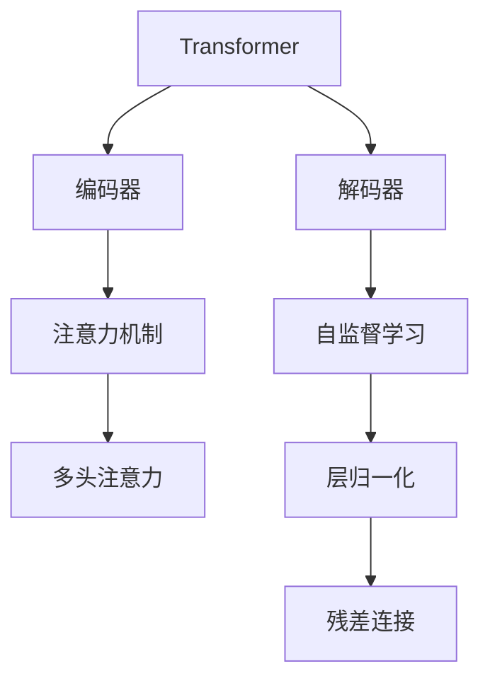
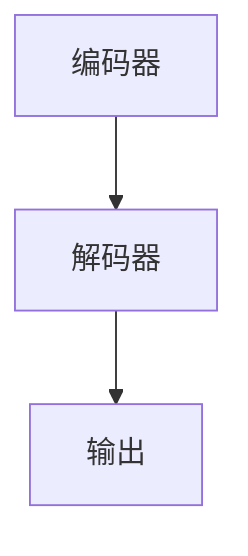
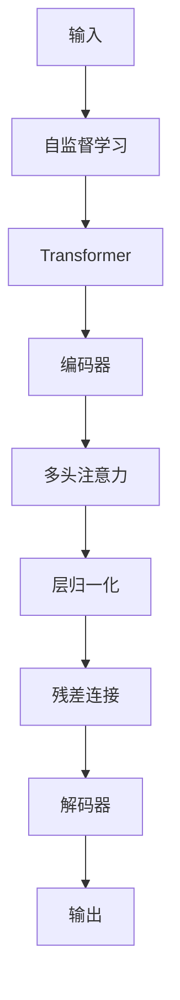

                 

# 从零开始大模型开发与微调：编码器的核心—注意力模型

> 关键词：大模型,注意力机制,编码器,Transformer,自监督学习,正则化,深度学习,计算图

## 1. 背景介绍

### 1.1 问题由来
近年来，深度学习技术取得了显著进展，特别是基于Transformer架构的大语言模型在自然语言处理(Natural Language Processing, NLP)领域表现出色。以BERT、GPT系列和T5为代表的大模型，通过在大规模无标签文本数据上进行预训练，学习了丰富的语言知识和常识，具备强大的语言理解和生成能力。然而，这些模型需要占用大量的计算资源进行训练，且在大规模数据上训练效果往往不理想。

为了提高模型的效率和效果，学者们提出了多种改进方法，其中注意力机制(Attention Mechanism)在大模型中起到了关键作用。注意力机制通过动态关注输入序列中的重要部分，提升模型的关注点和表达能力，使其在自然语言处理任务中表现出更强的适应性和鲁棒性。

本博客将详细阐述注意力机制的核心原理及其在编码器(Encoder)中的应用，并通过代码实例展示注意力机制在大模型中的实现步骤。

### 1.2 问题核心关键点
注意力机制是深度学习领域的重要技术之一，通过动态地为输入序列中的每个部分分配权重，实现对重要信息的集中关注。在Transformer中，注意力机制是实现编码器(Encoder)部分的核心技术，使得模型能够自适应地关注输入序列中的不同部分，从而提升模型在自然语言处理任务上的性能。

注意力机制的应用非常广泛，从语言建模到机器翻译，再到文本分类和信息检索，都展现出了其强大的功能和优势。但需要注意的是，注意力机制本身并不是万能的，在实际应用中仍需考虑数据分布、模型复杂度和计算资源等因素。

### 1.3 问题研究意义
深入理解注意力机制在大模型中的应用，对于提升模型性能和效率，拓展其应用范围，具有重要意义：

1. 提高模型效率。通过注意力机制，大模型能够在不增加计算资源的情况下，显著提升对输入序列中重要部分的关注度，从而减少计算量和内存消耗。
2. 增强模型泛化能力。注意力机制能够自适应地关注不同输入，使得模型对于多样化的输入能够更好地处理，增强了模型的泛化能力。
3. 提升模型性能。注意力机制在大模型中的应用，使得模型能够更准确地捕捉输入序列中的关键信息，从而在各类自然语言处理任务上取得更好的表现。
4. 促进模型创新。注意力机制的引入，为模型创新提供了新的思路和手段，推动了深度学习技术的发展。
5. 赋能应用升级。基于注意力机制的大模型，能够更好地应对复杂的应用场景，提升NLP技术的应用价值。

## 2. 核心概念与联系

### 2.1 核心概念概述

为更好地理解注意力机制在大模型中的核心应用，本节将介绍几个关键概念：

- 注意力机制(Attention Mechanism)：通过动态关注输入序列中的重要部分，提升模型的关注点和表达能力。
- 编码器(Encoder)：Transformer模型中的核心组件，负责将输入序列映射到固定大小的向量空间中，以便进行后续处理。
- Transformer：一种基于自注意力机制的神经网络架构，通过多层编码器和解码器，实现高效的序列建模和转换。
- 自监督学习(Self-Supervised Learning)：利用语言模型自身的结构信息，进行无标签数据的预训练。
- 正则化(Regularization)：通过引入一些约束条件，防止模型过拟合，提升模型泛化能力。

这些概念之间的逻辑关系可以通过以下Mermaid流程图来展示：



这个流程图展示了Transformer模型中各个组件之间的关系：

1. Transformer由编码器和解码器两部分构成。
2. 编码器中的注意力机制分为多头注意力机制，用于动态关注输入序列中的不同部分。
3. 自监督学习通过预训练语言模型的结构信息，对模型进行预训练。
4. 层归一化和残差连接用于模型稳定性，提升模型性能。

### 2.2 概念间的关系

这些概念之间存在着紧密的联系，构成了Transformer模型的基础架构。下面我通过几个Mermaid流程图来展示这些概念之间的关系：

#### 2.2.1 Transformer模型结构


这个流程图展示了Transformer模型的一般结构，即输入经过编码器映射为固定维度的向量，再通过解码器生成输出。

#### 2.2.2 编码器与解码器关系



这个流程图展示了编码器和解码器之间的关系，其中编码器负责输入向量的编码，解码器负责将编码后的向量映射为输出。

#### 2.2.3 注意力机制与编码器关系


这个流程图展示了注意力机制在编码器中的应用，即通过多头注意力机制关注输入序列中的不同部分，并通过层归一化和残差连接提高模型性能。

### 2.3 核心概念的整体架构

最后，我们用一个综合的流程图来展示这些核心概念在大模型中的整体架构：



这个综合流程图展示了从输入数据经过自监督学习预训练，到Transformer模型中的编码器、多头注意力、层归一化和残差连接，最终生成输出序列的全过程。通过这些概念的联合应用，Transformer模型能够高效、准确地处理自然语言序列，从而在各类NLP任务中取得优异表现。

## 3. 核心算法原理 & 具体操作步骤
### 3.1 算法原理概述

注意力机制的核心思想是通过动态地为输入序列中的每个部分分配权重，实现对重要信息的集中关注。在Transformer中，注意力机制是实现编码器(Encoder)部分的核心技术，使得模型能够自适应地关注输入序列中的不同部分，从而提升模型在自然语言处理任务上的性能。

以自注意力机制为例，其基本原理如下：

1. 输入序列 $x_1, x_2, \dots, x_n$ 被拆分成 $x_1', x_2', \dots, x_n'$，每个输入 $x_i'$ 都生成一个 $q_i'$，$k_i'$ 和 $v_i'$，其中 $q_i'$ 是查询向量，$k_i'$ 是键向量，$v_i'$ 是值向量。
2. 计算输入序列中每个位置 $i$ 的注意力权重 $a_i$：
$$
a_i = \text{Softmax}(Q_iK_i^T) = \frac{\exp(Q_iK_i^T)}{\sum_{j=1}^N \exp(Q_jK_j^T)}
$$
其中 $Q_i = q_i'W_Q$，$K_i = k_i'W_K$，$v_i = v_i'W_V$，$W_Q, W_K, W_V$ 为投影矩阵。
3. 计算输入序列中每个位置 $i$ 的加权值 $o_i$：
$$
o_i = \sum_{j=1}^N a_i v_i'
$$

这个过程可以理解为将输入序列中的每个位置都生成一个查询向量、键向量和值向量，然后通过计算每个位置的注意力权重，对值向量进行加权求和，得到最终的输出向量。

### 3.2 算法步骤详解

本节将详细讲述基于注意力机制的编码器(Encoder)部分的实现步骤。

#### 3.2.1 编码器结构
Transformer模型中的编码器由多个自注意力层和前向神经网络层组成，其中自注意力层是核心组件。自注意力层由多头注意力机制、层归一化、残差连接组成。


#### 3.2.2 多头注意力机制
多头注意力机制通过将输入序列投影到多个向量空间中，生成多个查询向量、键向量和值向量，用于计算注意力权重和加权值。多头注意力机制的计算过程如下：

1. 将输入序列投影到三个不同的向量空间中，生成查询向量 $Q_i, Q_j, \dots, Q_n$，键向量 $K_i, K_j, \dots, K_n$ 和值向量 $V_i, V_j, \dots, V_n$。
2. 计算注意力权重 $A_i$，公式同上。
3. 计算加权值 $O_i$，公式同上。
4. 对所有头的输出进行拼接，并应用全连接层，生成最终的输出向量 $H_i$。

具体实现中，可以使用PyTorch中的Transformer库，将输入序列 $x_1, x_2, \dots, x_n$ 转化为编码器的输入 $X_i = (x_1, x_2, \dots, x_n)$，并应用编码器 $E_i$ 进行编码，得到输出 $H_i = (h_1, h_2, \dots, h_n)$。

```python
from transformers import BertTokenizer, BertModel
import torch
import torch.nn as nn

class MultiHeadAttention(nn.Module):
    def __init__(self, d_model, n_head, d_k, d_v, dropout):
        super(MultiHeadAttention, self).__init__()
        assert d_k % n_head == 0 and d_v % n_head == 0
        self.d_k = d_k
        self.d_v = d_v
        self.n_head = n_head
        self.w_qs = nn.Linear(d_model, d_k)
        self.w_ks = nn.Linear(d_model, d_k)
        self.w_vs = nn.Linear(d_model, d_v)
        self.w_o = nn.Linear(d_v, d_model)
        self.layer_norm = nn.LayerNorm(d_model)
        self.dropout = nn.Dropout(dropout)
    
    def forward(self, query, key, value, mask=None):
        Q = self.w_qs(query).split(self.d_k, dim=2)
        K = self.w_ks(key).split(self.d_k, dim=2)
        V = self.w_vs(value).split(self.d_v, dim=2)
        A = (torch.matmul(torch.transpose(Q, 1, 2), K) / math.sqrt(self.d_k)) if mask is None else torch.matmul(torch.transpose(Q, 1, 2), K) / math.sqrt(self.d_k) + mask
        A = nn.functional.softmax(A, dim=-1)
        if mask is not None:
            A = A.masked_fill(mask == 0, float('-inf')).masked_fill(mask == 1, float('-inf'))
        o = torch.matmul(A, V)
        o = o.transpose(1, 2).contiguous().view(o.size(0), o.size(1), self.n_head * self.d_v)
        o = self.w_o(o)
        o = self.layer_norm(o + query)
        o = self.dropout(o)
        return o

class Encoder(nn.Module):
    def __init__(self, num_layers, d_model, n_head, d_k, d_v, dropout):
        super(Encoder, self).__init__()
        self.num_layers = num_layers
        self.layers = nn.ModuleList([MultiHeadAttention(d_model, n_head, d_k, d_v, dropout) for _ in range(num_layers)])
        self.norm = nn.LayerNorm(d_model)
        self.dropout = nn.Dropout(dropout)
    
    def forward(self, x):
        for layer in self.layers:
            x = layer(x, x, x, mask)
            x = self.norm(x)
        return x
```

#### 3.2.3 前向神经网络层
前向神经网络层由全连接层和激活函数组成，用于对多头注意力机制的输出进行非线性变换。具体实现中，可以使用PyTorch中的Feedforward层。

```python
class Feedforward(nn.Module):
    def __init__(self, d_model, d_ff, dropout):
        super(Feedforward, self).__init__()
        self.w_ih = nn.Linear(d_model, d_ff)
        self.w_hh = nn.Linear(d_ff, d_model)
        self.layer_norm = nn.LayerNorm(d_model)
        self.dropout = nn.Dropout(dropout)
    
    def forward(self, x):
        x = self.w_ih(x)
        x = nn.functional.relu(x)
        x = self.w_hh(x)
        x = self.layer_norm(x)
        x = self.dropout(x)
        return x
```

#### 3.2.4 层归一化和残差连接
层归一化和残差连接用于提高模型稳定性，避免梯度消失或爆炸。在编码器的每个层中，应用层归一化和残差连接，使得模型能够更加平稳地学习。

```python
class EncoderLayer(nn.Module):
    def __init__(self, d_model, n_head, d_k, d_v, dropout, activation):
        super(EncoderLayer, self).__init__()
        self.ff = Feedforward(d_model, d_ff, dropout)
        self.attention = MultiHeadAttention(d_model, n_head, d_k, d_v, dropout)
    
    def forward(self, x, mask):
        o = self.attention(x, x, x, mask)
        o = o + x
        o = self.ff(o)
        o = o + x
        return o

class Encoder(nn.Module):
    def __init__(self, num_layers, d_model, n_head, d_k, d_v, dropout):
        super(Encoder, self).__init__()
        self.num_layers = num_layers
        self.layers = nn.ModuleList([EncoderLayer(d_model, n_head, d_k, d_v, dropout, activation) for _ in range(num_layers)])
        self.norm = nn.LayerNorm(d_model)
        self.dropout = nn.Dropout(dropout)
    
    def forward(self, x, mask):
        for layer in self.layers:
            x = layer(x, mask)
            x = self.norm(x)
        return x
```

### 3.3 算法优缺点

注意力机制在大模型中的应用具有以下优点：

1. 提升模型性能。注意力机制使得模型能够自适应地关注输入序列中的不同部分，从而提升模型在自然语言处理任务上的性能。
2. 降低计算复杂度。通过动态计算注意力权重，使得模型能够更高效地处理输入序列，降低计算复杂度。
3. 增强模型泛化能力。注意力机制能够自适应地关注不同输入，使得模型对于多样化的输入能够更好地处理，增强了模型的泛化能力。

但注意力机制本身也存在一些缺点：

1. 计算复杂度高。多头注意力机制需要计算多个向量空间的查询向量、键向量和值向量，计算复杂度较高。
2. 模型参数量大。多头注意力机制需要多个投影矩阵，参数量较大，需要更多的计算资源。
3. 训练时间长。多头注意力机制需要较多的计算资源，训练时间较长。

### 3.4 算法应用领域

注意力机制在大模型中的应用非常广泛，涵盖了几乎所有常见的自然语言处理任务，包括：

- 语言建模：通过自注意力机制，模型能够捕捉输入序列中不同部分的依赖关系，从而生成更准确的语言模型。
- 机器翻译：通过多头注意力机制，模型能够自适应地关注源语言和目标语言之间的依赖关系，生成更准确的翻译结果。
- 文本分类：通过多头注意力机制，模型能够自动关注输入文本中的关键信息，从而提升分类精度。
- 文本摘要：通过多头注意力机制，模型能够自动关注输入文本中的重要部分，从而生成更准确的摘要。
- 命名实体识别：通过多头注意力机制，模型能够自适应地关注输入文本中的不同实体，从而提升识别精度。
- 问答系统：通过多头注意力机制，模型能够自动关注输入问题和上下文之间的依赖关系，从而生成更准确的答案。

除了上述这些经典任务外，注意力机制还被创新性地应用到更多场景中，如可控文本生成、常识推理、代码生成、数据增强等，为自然语言处理技术带来了全新的突破。

## 4. 数学模型和公式 & 详细讲解
### 4.1 数学模型构建

在大模型中，注意力机制的数学模型可以表示为：

1. 输入序列 $x_1, x_2, \dots, x_n$ 被拆分成 $x_1', x_2', \dots, x_n'$，每个输入 $x_i'$ 都生成一个 $q_i'$，$k_i'$ 和 $v_i'$，其中 $q_i'$ 是查询向量，$k_i'$ 是键向量，$v_i'$ 是值向量。
2. 计算输入序列中每个位置 $i$ 的注意力权重 $a_i$：
$$
a_i = \text{Softmax}(Q_iK_i^T) = \frac{\exp(Q_iK_i^T)}{\sum_{j=1}^N \exp(Q_jK_j^T)}
$$
其中 $Q_i = q_i'W_Q$，$K_i = k_i'W_K$，$v_i = v_i'W_V$，$W_Q, W_K, W_V$ 为投影矩阵。
3. 计算输入序列中每个位置 $i$ 的加权值 $o_i$：
$$
o_i = \sum_{j=1}^N a_i v_i'
$$

这个过程可以理解为将输入序列中的每个位置都生成一个查询向量、键向量和值向量，然后通过计算每个位置的注意力权重，对值向量进行加权求和，得到最终的输出向量。

### 4.2 公式推导过程

以下我们以多头注意力机制为例，推导计算过程：

设输入序列 $x_1, x_2, \dots, x_n$ 被拆分为 $x_1', x_2', \dots, x_n'$，每个输入 $x_i'$ 生成查询向量 $q_i'$、键向量 $k_i'$ 和值向量 $v_i'$。查询向量 $q_i'$、键向量 $k_i'$ 和值向量 $v_i'$ 通过投影矩阵 $W_Q$、$W_K$ 和 $W_V$ 计算生成：

$$
q_i' = x_i'W_Q, \quad k_i' = x_i'W_K, \quad v_i' = x_i'W_V
$$

将查询向量 $q_i'$ 和键向量 $k_i'$ 进行点积，并经过softmax函数计算得到注意力权重 $a_i$：

$$
a_i = \text{Softmax}(Q_iK_i^T) = \frac{\exp(Q_iK_i^T)}{\sum_{j=1}^N \exp(Q_jK_j^T)}
$$

其中 $Q_i = q_i'W_Q$，$K_i = k_i'W_K$，$v_i = v_i'W_V$，$W_Q, W_K, W_V$ 为投影矩阵。

计算加权值 $o_i$：

$$
o_i = \sum_{j=1}^N a_i v_i'
$$

得到最终的输出向量 $H_i$：

$$
H_i = o_i
$$

整个多头注意力机制的计算过程可以表示为：

$$
H_i = \sum_{j=1}^N a_i v_i' = \sum_{j=1}^N \text{Softmax}(Q_iK_j^T) v_j'
$$

### 4.3 案例分析与讲解

我们以BERT模型为例，分析注意力机制在大模型中的应用。

在BERT模型中，注意力机制分为多头注意力机制，用于动态关注输入序列中的不同部分，提升模型的关注点和表达能力。具体来说，BERT模型在编码器部分通过自注意力机制实现编码，从而提升模型在自然语言处理任务上的性能。

在BERT模型中，多头注意力机制通过将输入序列投影到三个不同的向量空间中，生成查询向量 $Q_i$、键向量 $K_i$ 和值向量 $V_i$。查询向量 $Q_i$、键向量 $K_i$ 和值向量 $V_i$ 通过投影矩阵 $W_Q$、$W_K$ 和 $W_V$ 计算生成：

$$
Q_i = x_i'W_Q, \quad K_i = x_i'W_K, \quad V_i = x_i'W_V
$$

其中 $W_Q, W_K, W_V$ 为投影矩阵。

计算注意力权重 $a_i$：

$$
a_i = \text{Softmax}(Q_iK_i^T) = \frac{\exp(Q_iK_i^T)}{\sum_{j=1}^N \exp(Q_jK_j^T)}
$$

其中 $Q_i = q_i'W_Q$，$K_i = k_i'W_K$，$v_i = v_i'W_V$，$W_Q, W_K, W_V$ 为投影矩阵。

计算加权值 $o_i$：

$$
o_i = \sum_{j=1}^N a_i v_i'
$$

得到最终的输出向量 $H_i$：

$$
H_i = o_i
$$

整个多头注意力机制的计算过程可以表示为：

$$
H_i = \sum_{j=1}^N a_i v_i' = \sum_{j=1}^N \text{Softmax}(Q_iK_j^T) v_j'
$$

通过上述分析，我们可以看到，多头注意力机制通过动态地为输入序列中的每个部分分配权重，实现对重要信息的集中关注，从而提升模型的关注点和表达能力，使得模型在自然语言处理任务上能够更好地处理输入序列，提升性能。

## 5. 项目实践：代码实例和详细解释说明
### 5.1 开发环境搭建

在进行注意力机制的实现之前，我们需要准备好开发环境。以下是使用Python进行PyTorch开发的环境配置流程：

1. 安装Anaconda：从官网下载并安装Anaconda，用于创建独立的Python环境。

2. 创建并激活虚拟环境：
```bash
conda create -n pytorch-env python=3.8 
conda activate pytorch-env
```

3. 安装PyTorch：根据CUDA版本，从官网获取对应的安装命令。例如：
```bash
conda install pytorch torchvision torchaudio cudatoolkit=11.1 -c pytorch -c conda-forge
```

4. 安装Transformers库：
```bash
pip install transformers
```

5. 安装各类工具包：
```bash
pip install numpy pandas scikit-learn matplotlib tqdm jupyter notebook ipython
```

完成上述步骤后，即可在`pytorch-env`环境中开始注意力机制的实现。

### 5.2 源代码详细实现

下面我们以BERT模型为例，给出注意力机制在大模型中的实现步骤。

首先，定义注意力机制的代码实现：

```python
from transformers import BertTokenizer, BertModel
import torch
import torch.nn as nn

class MultiHeadAttention(nn.Module):
    def __init__(self, d_model, n_head, d_k, d_v, dropout):
        super(MultiHeadAttention, self).__init__()
        assert d_k % n_head == 0 and d_v % n_head == 0
        self.d_k = d_k
        self.d_v = d_v
        self.n_head = n_head
        self.w_qs = nn.Linear(d_model, d_k)
        self.w_ks = nn.Linear(d_model, d_k)
        self.w_vs = nn.Linear(d_model, d_v)
        self.w_o = nn.Linear(d_v, d_model)
        self.layer_norm = nn.LayerNorm(d_model)
        self.dropout = nn.Dropout(dropout)
    
    def forward(self, query, key, value, mask=None):
        Q = self.w_qs(query).split(self.d_k, dim=2)
        K = self.w_ks(key).split(self.d_k, dim=2)
        V = self.w_vs(value).split(self.d_v, dim=2)
        A = (torch.matmul(torch.transpose(Q, 1, 2), K) / math.sqrt(self.d_k)) if mask is None else torch.matmul(torch.transpose(Q, 1, 2), K) / math.sqrt(self.d_k) + mask
        A = nn.functional.softmax(A, dim=-1)
        if mask is not None:
            A = A.masked_fill(mask == 0, float('-inf')).masked_fill(mask == 1, float('-inf'))
        o = torch.matmul(A, V)
        o = o.transpose(1, 2).contiguous().view(o.size(0), o.size(1), self.n_head * self.d_v)
        o = self.w_o(o)
        o = self.layer_norm(o + query)
        o = self.dropout(o)
        return o

class EncoderLayer(nn.Module):
    def __init__(self, d_model, n_head, d_k, d_v, dropout, activation):
        super(EncoderLayer, self).__init__()
        self.ff = Feedforward(d_model, d_ff, dropout)
        self.attention = MultiHeadAttention(d_model, n_head, d_k, d_v, dropout)
    
    def forward(self, x, mask):
        o = self.attention(x, x, x, mask)
        o = o + x
        o = self.ff(o)
        o = o + x
        return o

class Encoder(nn.Module):
    def __init__(self, num_layers

