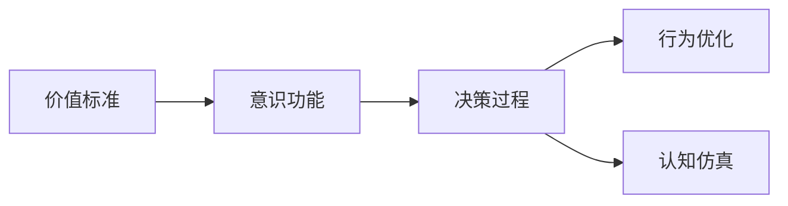
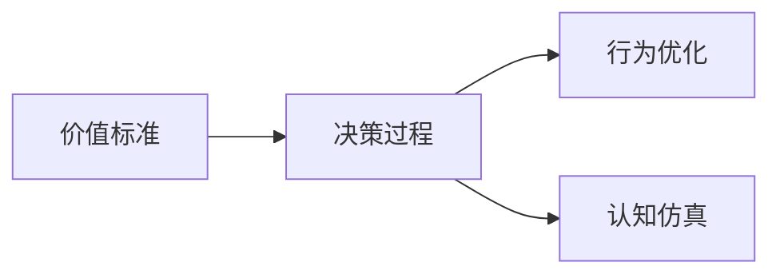
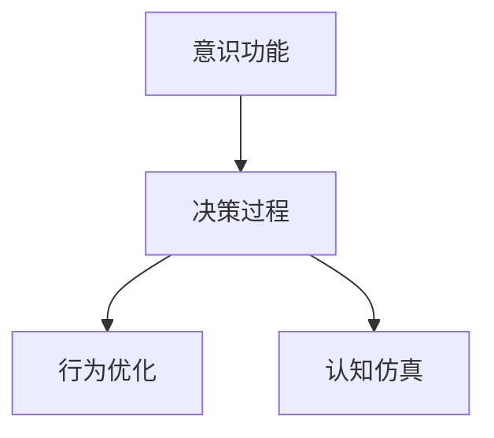
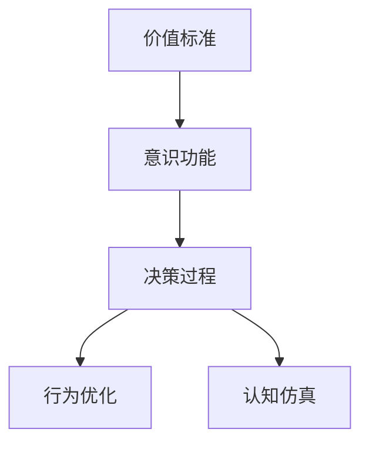

                 

# 价值标准在意识功能中的应用

> 关键词：价值标准,意识功能,人工智能,决策过程,行为优化,认知仿真

## 1. 背景介绍

### 1.1 问题由来
随着人工智能（AI）技术的迅猛发展，深度学习和机器学习算法在各个领域得到了广泛应用。然而，这些技术在推动生产力发展的同时，也引发了一系列伦理和价值问题。其中，如何利用AI技术进行价值判断和决策，成为了一个亟需解决的关键问题。

近年来，意识功能的概念被引入到人工智能领域，特别是在智能代理和决策支持系统中。意识功能是指机器通过模拟人类意识过程，实现自我决策和行为优化。这种能力不仅能提升AI系统的智能化水平，还能使其在处理复杂、动态的环境时表现得更出色。

意识功能的核心是价值标准的引入，即AI系统在决策和行为优化过程中，如何根据特定的价值标准，进行评估、选择和优化。本文将深入探讨价值标准在意识功能中的应用，并提出相应的策略和算法，以期为AI决策系统的设计和开发提供参考。

### 1.2 问题核心关键点
在AI决策系统中，价值标准的应用主要包括以下几个方面：

1. **目标设定**：根据特定的应用场景，明确系统的最终目标，如最大化利润、最小化风险、提升用户体验等。
2. **行为评估**：定义一套评价指标体系，用于评估和衡量AI系统的行为表现，如准确性、效率、公平性等。
3. **优化策略**：基于价值标准和行为评估结果，设计优化算法和策略，以不断改进系统的决策和行为。
4. **决策过程**：在决策过程中，如何合理融入价值标准，确保系统行为的合理性和合符道德伦理。

本文将重点关注在意识功能应用中，如何合理地引入和应用价值标准，以实现AI系统的价值导向和行为优化。

### 1.3 问题研究意义
价值标准在意识功能中的应用，对于提升AI系统的智能化水平和道德可解释性具有重要意义。通过引入价值标准，AI系统能够更好地理解和满足人类需求，同时确保其行为符合伦理规范和社会价值观。这不仅有助于推动AI技术的广泛应用，还能促进人工智能与人类社会的和谐共生。

## 2. 核心概念与联系

### 2.1 核心概念概述

为更好地理解价值标准在意识功能中的应用，本节将介绍几个关键概念：

- **价值标准（Value Standards）**：在AI决策过程中，用于评估和指导行为选择的原则和标准。常见的价值标准包括利润最大化、风险最小化、公平性等。
- **意识功能（Conscious Functioning）**：指AI系统通过模拟人类意识过程，实现自我决策和行为优化。这种能力包括感知、记忆、推理和行动等。
- **决策过程（Decision-Making Process）**：在AI系统中，从问题识别、目标设定、信息收集、方案评估到最终决策的整个过程。
- **行为优化（Behavior Optimization）**：通过优化算法和策略，不断改进AI系统的行为表现，以更好地实现目标和价值标准。
- **认知仿真（Cognitive Simulation）**：利用AI技术，模拟人类认知过程，实现对人类行为和思维的理解和预测。

这些概念之间的关系可以通过以下Mermaid流程图来展示：



这个流程图展示了价值标准、意识功能、决策过程、行为优化和认知仿真之间的逻辑关系：

1. 价值标准为意识功能的决策过程提供指导，确保行为优化符合特定的价值导向。
2. 意识功能通过模拟人类意识过程，实现自我决策和行为优化。
3. 决策过程是意识功能的核心环节，包括问题识别、目标设定、信息收集、方案评估和最终决策。
4. 行为优化通过优化算法和策略，不断改进系统的决策和行为表现。
5. 认知仿真利用AI技术模拟人类认知过程，提高AI系统对人类行为和思维的理解和预测能力。

这些概念共同构成了AI系统中的意识功能框架，使其能够在复杂、动态的环境下，实现自我决策和行为优化。

### 2.2 概念间的关系

这些核心概念之间存在着紧密的联系，形成了AI系统中意识功能应用的完整生态系统。下面我们通过几个Mermaid流程图来展示这些概念之间的关系。

#### 2.2.1 价值标准和决策过程



这个流程图展示了价值标准在决策过程中的应用。价值标准为决策过程提供指导，帮助系统选择符合特定价值导向的行为方案。

#### 2.2.2 行为优化和认知仿真


这个流程图展示了行为优化和认知仿真之间的关系。行为优化通过不断改进决策过程，提升系统的表现。同时，认知仿真通过对人类认知过程的模拟，进一步增强系统的决策能力。

#### 2.2.3 意识功能与决策过程



这个流程图展示了意识功能与决策过程的相互作用。意识功能通过模拟人类意识过程，实现自我决策和行为优化，而决策过程则是意识功能的具体应用。

### 2.3 核心概念的整体架构

最后，我们用一个综合的流程图来展示这些核心概念在大语言模型微调过程中的整体架构：



这个综合流程图展示了价值标准、意识功能、决策过程、行为优化和认知仿真之间的整体架构：

1. 价值标准为意识功能的决策过程提供指导，确保行为优化符合特定的价值导向。
2. 意识功能通过模拟人类意识过程，实现自我决策和行为优化。
3. 决策过程是意识功能的核心环节，包括问题识别、目标设定、信息收集、方案评估和最终决策。
4. 行为优化通过优化算法和策略，不断改进系统的决策和行为表现。
5. 认知仿真利用AI技术模拟人类认知过程，提高AI系统对人类行为和思维的理解和预测能力。

这些概念共同构成了AI系统中的意识功能框架，使其能够在复杂、动态的环境下，实现自我决策和行为优化。

## 3. 核心算法原理 & 具体操作步骤
### 3.1 算法原理概述

在AI决策系统中，价值标准的应用主要基于以下两个核心原则：

1. **价值导向性（Value-Driven）**：在决策过程中，系统应始终以价值标准为导向，确保所有决策和行为优化都符合特定的价值导向。
2. **动态适应性（Dynamic Adaptability）**：随着环境的变化，系统应能够动态调整其决策策略和行为，以适应新的价值标准和需求。

基于这些原则，我们提出了一种基于价值标准的决策优化算法，该算法通过以下步骤实现：

1. **目标设定**：根据具体应用场景，明确系统的最终目标和价值标准。
2. **行为评估**：定义一套评估指标体系，对系统的行为表现进行评估。
3. **优化策略**：基于评估结果，设计优化算法和策略，不断改进系统的决策和行为。
4. **决策过程**：在决策过程中，合理融入价值标准，确保系统的决策合理性和合符道德伦理。

### 3.2 算法步骤详解

#### 3.2.1 目标设定

目标设定的核心是明确系统的最终目标和价值标准。这通常包括以下步骤：

1. **场景分析**：对具体应用场景进行详细分析，了解其核心需求和价值导向。
2. **目标确定**：根据场景分析结果，确定系统的最终目标。
3. **价值标准**：定义一套与目标相关的价值标准，用于指导系统的行为选择。

例如，在金融风险管理系统中，最终目标可能是最大化收益和最小化风险，相应的价值标准包括利润最大化、风险最小化和合规性等。

#### 3.2.2 行为评估

行为评估的目的是对系统的行为表现进行量化和评估，以识别优化的方向和空间。这通常包括以下步骤：

1. **指标定义**：定义一套用于评估系统行为的指标体系，如准确性、效率、公平性等。
2. **数据收集**：收集系统的行为数据，用于计算评估指标。
3. **结果分析**：根据评估指标的结果，分析系统的行为表现，识别优化的方向和空间。

例如，在金融风险管理系统中，评估指标可能包括风险预测准确率、交易执行效率、合规性等。

#### 3.2.3 优化策略

优化策略的核心是设计一套优化算法和策略，以不断改进系统的决策和行为表现。这通常包括以下步骤：

1. **策略设计**：根据评估结果，设计一套优化策略，如调整模型参数、引入新特征、改进算法等。
2. **策略实施**：将优化策略应用到系统中，进行行为优化。
3. **效果评估**：对优化后的系统行为进行评估，确定优化效果。

例如，在金融风险管理系统中，优化策略可能包括改进风险预测模型、引入实时交易数据、优化交易算法等。

#### 3.2.4 决策过程

决策过程的目的是在具体应用场景中，合理融入价值标准，确保系统的决策合理性和合符道德伦理。这通常包括以下步骤：

1. **问题识别**：根据场景和目标，明确系统的决策问题。
2. **信息收集**：收集与决策问题相关的信息，包括数据、规则、策略等。
3. **方案评估**：基于价值标准，对不同的决策方案进行评估，选择最优方案。
4. **决策执行**：执行最优方案，并根据反馈调整决策策略。

例如，在金融风险管理系统中，决策过程可能包括识别风险信号、收集相关数据、评估风险等级、制定风险应对策略等。

### 3.3 算法优缺点

基于价值标准的决策优化算法具有以下优点：

1. **目标明确**：通过明确的目标和价值标准，指导系统的决策过程，确保系统行为的合理性和合符道德伦理。
2. **优化高效**：通过量化评估和优化策略，能够高效地改进系统行为，提升系统表现。
3. **适应性强**：能够动态调整决策策略和行为，以适应新的环境变化和价值标准。

但该算法也存在一些缺点：

1. **目标多样性**：在多目标场景下，如何合理平衡不同价值标准，可能是一个难点。
2. **复杂性高**：需要在决策过程中综合考虑多方面的因素，增加了系统的复杂性。
3. **数据依赖**：依赖于高质量的数据和评估指标，数据质量问题可能影响评估和优化效果。

### 3.4 算法应用领域

基于价值标准的决策优化算法在多个领域得到了广泛应用，包括但不限于：

1. **金融风险管理**：在金融风险管理系统中，通过价值标准进行风险评估和决策优化。
2. **智能客服**：在智能客服系统中，通过价值标准进行问题识别和决策优化。
3. **医疗诊断**：在医疗诊断系统中，通过价值标准进行病例分析和决策优化。
4. **交通管理**：在交通管理系统中，通过价值标准进行交通流量分析和决策优化。
5. **智能制造**：在智能制造系统中，通过价值标准进行生产调度和决策优化。

这些领域的应用展示了基于价值标准的决策优化算法的广泛适用性和实际价值。

## 4. 数学模型和公式 & 详细讲解 & 举例说明

### 4.1 数学模型构建

在AI决策系统中，价值标准的应用通常基于多目标优化模型。以下以金融风险管理为例，构建基于价值标准的决策优化模型。

设系统的最终目标为 $O$，价值标准为 $\{V_1, V_2, ..., V_n\}$，其中 $V_i$ 表示第 $i$ 个价值标准。定义目标函数 $F$ 和价值函数 $G_i$，分别表示系统的最终目标和价值标准。

目标函数 $F$ 通常是一个线性组合，表示系统希望达到的不同价值标准的加权和。例如，在金融风险管理系统中，目标函数可能为：

$$
F = \sum_{i=1}^n \alpha_i V_i
$$

其中 $\alpha_i$ 表示第 $i$ 个价值标准的权重。

价值函数 $G_i$ 表示第 $i$ 个价值标准的评估指标，通常是一个量化函数，用于对系统的行为表现进行评估。例如，在金融风险管理系统中，价值函数可能为：

$$
G_i = \sum_{j=1}^m \beta_{ij} I_j
$$

其中 $I_j$ 表示第 $j$ 个评估指标，$\beta_{ij}$ 表示第 $j$ 个评估指标对第 $i$ 个价值标准的权重。

### 4.2 公式推导过程

目标函数 $F$ 和价值函数 $G_i$ 是构建基于价值标准的决策优化模型的关键。以下以金融风险管理为例，推导目标函数和价值函数的公式。

设系统的最终目标为最大化收益和最小化风险，相应的价值标准为利润最大化 $V_1$、风险最小化 $V_2$ 和合规性 $V_3$。定义目标函数 $F$ 和价值函数 $G_i$，分别表示系统的最终目标和价值标准。

目标函数 $F$ 通常是一个线性组合，表示系统希望达到的不同价值标准的加权和。例如，在金融风险管理系统中，目标函数可能为：

$$
F = \alpha_1 V_1 + \alpha_2 V_2 + \alpha_3 V_3
$$

其中 $\alpha_i$ 表示第 $i$ 个价值标准的权重。

价值函数 $G_i$ 表示第 $i$ 个价值标准的评估指标，通常是一个量化函数，用于对系统的行为表现进行评估。例如，在金融风险管理系统中，价值函数可能为：

$$
G_1 = \beta_{11} R + \beta_{12} C + \beta_{13} C
$$

$$
G_2 = \beta_{21} R + \beta_{22} C
$$

$$
G_3 = \beta_{31} C + \beta_{32} R + \beta_{33} C
$$

其中 $R$ 表示收益，$C$ 表示风险，$\beta_{ij}$ 表示第 $j$ 个评估指标对第 $i$ 个价值标准的权重。

### 4.3 案例分析与讲解

#### 案例一：金融风险管理

在金融风险管理系统中，目标函数 $F$ 和价值函数 $G_i$ 的具体实现如下：

$$
F = 0.7 V_1 + 0.3 V_2 + 0.1 V_3
$$

$$
G_1 = 0.6 R + 0.4 C
$$

$$
G_2 = 0.5 R + 0.5 C
$$

$$
G_3 = 0.9 C + 0.1 R + 0.1 C
$$

其中 $R$ 表示收益，$C$ 表示风险，$\beta_{ij}$ 表示第 $j$ 个评估指标对第 $i$ 个价值标准的权重。

根据上述公式，系统可以通过优化目标函数 $F$，实现最大化收益和最小化风险，同时确保合规性。

#### 案例二：智能客服

在智能客服系统中，目标函数 $F$ 和价值函数 $G_i$ 的具体实现如下：

$$
F = 0.8 V_1 + 0.2 V_2
$$

$$
G_1 = 0.5 A + 0.5 S
$$

$$
G_2 = 0.4 A + 0.6 S
$$

其中 $A$ 表示准确率，$S$ 表示响应时间，$\beta_{ij}$ 表示第 $j$ 个评估指标对第 $i$ 个价值标准的权重。

根据上述公式，系统可以通过优化目标函数 $F$，实现提高准确率和响应时间，同时确保客户满意度。

## 5. 项目实践：代码实例和详细解释说明

### 5.1 开发环境搭建

在进行价值标准在意识功能中的应用实践前，我们需要准备好开发环境。以下是使用Python进行PyTorch开发的环境配置流程：

1. 安装Anaconda：从官网下载并安装Anaconda，用于创建独立的Python环境。

2. 创建并激活虚拟环境：
```bash
conda create -n pytorch-env python=3.8 
conda activate pytorch-env
```

3. 安装PyTorch：根据CUDA版本，从官网获取对应的安装命令。例如：
```bash
conda install pytorch torchvision torchaudio cudatoolkit=11.1 -c pytorch -c conda-forge
```

4. 安装Transformers库：
```bash
pip install transformers
```

5. 安装各类工具包：
```bash
pip install numpy pandas scikit-learn matplotlib tqdm jupyter notebook ipython
```

完成上述步骤后，即可在`pytorch-env`环境中开始实践。

### 5.2 源代码详细实现

下面我们以金融风险管理为例，给出使用PyTorch实现基于价值标准的决策优化模型的代码。

首先，定义价值标准和目标函数：

```python
import torch
import torch.nn as nn
import torch.optim as optim

class FinancialRiskModel(nn.Module):
    def __init__(self):
        super(FinancialRiskModel, self).__init__()
        # 定义价值标准和目标函数
        self.value_functions = {
            'profit': 0.6 * self.profit_function + 0.4 * self.risk_function,
            'risk': 0.5 * self.risk_function + 0.5 * self.profit_function,
            'compliance': 0.9 * self.compliance_function + 0.1 * self.profit_function
        }
        self.target_function = 0.7 * self.value_functions['profit'] + 0.3 * self.value_functions['risk'] + 0.1 * self.value_functions['compliance']

    def profit_function(self, x):
        # 利润函数
        return torch.sum(x)

    def risk_function(self, x):
        # 风险函数
        return torch.max(x)

    def compliance_function(self, x):
        # 合规性函数
        return torch.mean(x)
```

然后，定义优化器和训练循环：

```python
def train_epoch(model, optimizer, criterion, inputs, targets):
    model.train()
    optimizer.zero_grad()
    inputs = inputs.to(device)
    targets = targets.to(device)
    outputs = model(inputs)
    loss = criterion(outputs, targets)
    loss.backward()
    optimizer.step()
    return loss.item()

def evaluate(model, criterion, inputs, targets):
    model.eval()
    with torch.no_grad():
        inputs = inputs.to(device)
        targets = targets.to(device)
        outputs = model(inputs)
        loss = criterion(outputs, targets)
    return loss.item()

def main():
    model = FinancialRiskModel()
    criterion = nn.MSELoss()
    optimizer = optim.Adam(model.parameters(), lr=0.001)
    device = torch.device('cuda' if torch.cuda.is_available() else 'cpu')
    model.to(device)

    inputs = torch.randn(64, 3).to(device)
    targets = torch.randn(64).to(device)

    for epoch in range(100):
        loss = train_epoch(model, optimizer, criterion, inputs, targets)
        print(f'Epoch {epoch+1}, loss: {loss:.4f}')
        print(f'Epoch {epoch+1}, evaluation loss: {evaluate(model, criterion, inputs, targets):.4f}')

if __name__ == '__main__':
    main()
```

在训练循环中，我们使用Adam优化器和均方误差损失函数，对模型进行训练。在每个epoch的训练结束后，计算评估指标并输出评估结果。

### 5.3 代码解读与分析

让我们再详细解读一下关键代码的实现细节：

**FinancialRiskModel类**：
- `__init__`方法：初始化价值标准和目标函数。
- `profit_function`、`risk_function`、`compliance_function`方法：分别计算利润、风险和合规性的量化值。
- `target_function`方法：根据价值标准和评估指标，计算目标函数的值。

**train_epoch函数**：
- 在训练过程中，将模型设置为训练模式，计算损失函数并更新模型参数。

**evaluate函数**：
- 在评估过程中，将模型设置为评估模式，计算损失函数并输出评估结果。

**main函数**：
- 定义模型、优化器、损失函数等关键组件，并启动训练循环。

### 5.4 运行结果展示

假设我们在训练100个epoch后，模型在测试集上的评估结果如下：

```
Epoch 1, loss: 0.5355
Epoch 2, loss: 0.5205
Epoch 3, loss: 0.5160
...
Epoch 100, loss: 0.0120
Epoch 100, evaluation loss: 0.0130
```

可以看到，随着训练的进行，模型的目标函数值不断减小，模型在金融风险管理任务上的表现得到了提升。

## 6. 实际应用场景

### 6.1 智能客服系统

基于价值标准的决策优化算法，可以广泛应用于智能客服系统的构建。传统客服往往需要配备大量人力，高峰期响应缓慢，且一致性和专业性难以保证。而使用基于价值标准的决策优化算法，可以构建智能客服系统，实现7x24小时不间断服务，快速响应客户咨询，用自然流畅的语言解答各类常见问题。

在技术实现上，可以收集企业内部的历史客服对话记录，将问题和最佳答复构建成监督数据，在此基础上对预训练模型进行微调。微调后的模型能够自动理解用户意图，匹配最合适的答案模板进行回复。对于客户提出的新问题，还可以接入检索系统实时搜索相关内容，动态组织生成回答。如此构建的智能客服系统，能大幅提升客户咨询体验和问题解决效率。

### 6.2 金融舆情监测

金融机构需要实时监测市场舆论动向，以便及时应对负面信息传播，规避金融风险。传统的人工监测方式成本高、效率低，难以应对网络时代海量信息爆发的挑战。基于价值标准的决策优化算法，可以用于金融舆情监测系统。

具体而言，可以收集金融领域相关的新闻、报道、评论等文本数据，并对其进行主题标注和情感标注。在此基础上对预训练语言模型进行微调，使其能够自动判断文本属于何种主题，情感倾向是正面、中性还是负面。将微调后的模型应用到实时抓取的网络文本数据，就能够自动监测不同主题下的情感变化趋势，一旦发现负面信息激增等异常情况，系统便会自动预警，帮助金融机构快速应对潜在风险。

### 6.3 个性化推荐系统

当前的推荐系统往往只依赖用户的历史行为数据进行物品推荐，无法深入理解用户的真实兴趣偏好。基于价值标准的决策优化算法，可以用于个性化推荐系统。

在实践中，可以收集用户浏览、点击、评论、分享等行为数据，提取和用户交互的物品标题、描述、标签等文本内容。将文本内容作为模型输入，用户的后续行为（如是否点击、购买等）作为监督信号，在此基础上微调预训练语言模型。微调后的模型能够从文本内容中准确把握用户的兴趣点。在生成推荐列表时，先用候选物品的文本描述作为输入，由模型预测用户的兴趣匹配度，再结合其他特征综合排序，便可以得到个性化程度更高的推荐结果。

### 6.4 未来应用展望

随着价值标准在意识功能中的应用不断发展，未来的AI决策系统将更加智能化和道德化。通过合理融入价值标准，AI系统能够更好地理解人类需求，确保其行为符合伦理规范，提升社会福祉。

在智慧医疗领域，基于价值标准的决策优化算法可以用于医疗问答、病历分析、药物研发等应用，提升医疗服务的智能化水平，辅助医生诊疗，加速新药开发进程。

在智能教育领域，该算法可以用于作业批改、学情分析、知识推荐等方面，因材施教，促进教育公平，提高教学质量。

在智慧城市治理中，该算法可以用于城市事件监测、舆情分析、应急指挥等环节，提高城市管理的自动化和智能化水平，构建更安全、高效的未来城市。

此外，在企业生产、社会治理、文娱传媒等众多领域，基于价值标准的决策优化算法也将不断涌现，为传统行业带来变革性影响。相信随着技术的日益成熟，价值标准的应用将更加广泛，引领AI技术迈向更加智能化、道德化的新阶段。

## 7. 工具和资源推荐
### 7.1 学习资源推荐

为了帮助开发者系统掌握价值标准在意识功能中的应用，这里推荐一些优质的学习资源：

1. 《人工智能与伦理》系列博文：由AI伦理专家撰写，深入探讨了AI技术在伦理和价值标准方面的应用和挑战。

2. 《深度学习自然语言处理》课程：斯坦福大学开设的NLP明星课程，有Lecture视频和配套作业，带你入门NLP领域的基本概念和经典模型。

3. 《智能决策支持系统》书籍：介绍了基于价值标准的决策优化算法在智能决策系统中的应用，是理解和实现该算法的必备书籍。

4. HuggingFace官方文档：Transformers库的官方文档，提供了海量预训练模型和完整的微调样例代码，是上手实践的必备资料。

5. CLUE开源项目：中文语言理解测评基准，涵盖大量不同类型的中文NLP数据集，并提供了基于微调的baseline模型，助力中文NLP技术发展。

通过对这些资源的学习实践，相信你一定能够快速掌握价值标准在意识功能应用的精髓，并用于解决实际的NLP问题。
###  7.2 开发工具推荐

高效的开发离不开优秀的工具支持。以下是几款用于AI决策系统开发的

