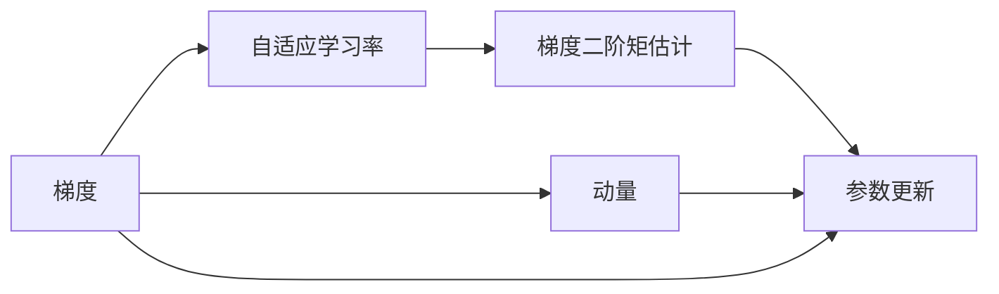

                 

# 优化算法：Adam 原理与代码实例讲解

> 关键词：优化算法, Adam, 机器学习, 深度学习, 自适应学习率, 计算图, 代码实例, 性能优化

## 1. 背景介绍

### 1.1 问题由来
在深度学习中，优化算法扮演着至关重要的角色。其核心任务是指导模型参数迭代，逐渐逼近最小损失函数。而传统的随机梯度下降法（SGD）往往需要手动设置学习率，容易陷入局部最优，收敛速度较慢。为了克服这些问题，自适应优化算法应运而生。其中，Adam算法因其自适应学习率和动量的特点，在深度学习中应用广泛，显著提升了模型训练效率和收敛速度。

### 1.2 问题核心关键点
Adam算法的核心思想是利用动量信息和梯度的二阶矩估计，自适应地调整学习率，同时减少参数更新过程中的抖动，从而在各种数据集和任务上取得了优异的性能。其主要特点包括：

- 自适应学习率：根据梯度的一阶和二阶矩估计，动态调整学习率。
- 动量（Momentum）：利用历史梯度信息，平滑参数更新，加快收敛速度。
- 二阶矩估计：通过计算梯度的平方和，在一定程度上缓解梯度消失问题。

### 1.3 问题研究意义
Adam算法在大规模深度学习任务中表现优异，特别是对于高维参数空间的优化。学习如何高效地使用Adam算法，将帮助研究者和开发者提升模型的训练效率，缩短模型训练时间，提升模型的性能。此外，Adam算法的研究也对理解深度学习的优化过程和算法设计提供了有益的参考。

## 2. 核心概念与联系

### 2.1 核心概念概述

为了更好地理解Adam算法，我们将介绍几个核心概念及其相互联系：

- **梯度（Gradient）**：指损失函数对参数的偏导数，指导参数更新方向。
- **学习率（Learning Rate）**：控制每次参数更新的幅度，影响收敛速度和稳定性。
- **动量（Momentum）**：利用历史梯度信息，平滑更新方向，加速收敛。
- **自适应学习率（Adaptive Learning Rate）**：根据梯度大小动态调整学习率，减少过拟合风险。
- **梯度二阶矩估计（Moment Estimation）**：通过计算梯度平方的移动平均，辅助参数更新。

这些概念通过Adam算法紧密联系起来，共同构成了深度学习模型参数优化的核心流程。

### 2.2 概念间的关系

这些核心概念之间的关系可以通过以下Mermaid流程图来展示：



这个流程图展示了大规模参数空间优化中，梯度、动量和二阶矩估计三者之间的相互作用关系：

1. **梯度**指导**自适应学习率**和**动量**的计算。
2. **自适应学习率**动态调整**学习率**大小，提高**梯度**更新的精度。
3. **动量**平滑**梯度**更新方向，加速收敛。
4. **梯度二阶矩估计**为**动量**提供额外信息，减少**梯度消失**问题。
5. **参数更新**结合**自适应学习率**和**动量**，更新模型参数。

### 2.3 核心概念的整体架构

最终，我们将通过一个综合的流程图来展示这些核心概念在Adam算法中的整体架构：


这个综合流程图展示了Adam算法中梯度、动量和二阶矩估计三者之间的动态交互，指导参数更新，从而实现高效优化的过程。

## 3. 核心算法原理 & 具体操作步骤
### 3.1 算法原理概述

Adam算法的核心在于自适应地调整学习率，并引入动量信息，从而在更新参数时更为灵活和高效。其数学原理基于梯度的一阶和二阶矩估计。具体而言，Adam算法使用以下两个动量变量来跟踪梯度的一阶和二阶矩估计：

$$
m_t = \beta_1 m_{t-1} + (1-\beta_1) g_t \\
v_t = \beta_2 v_{t-1} + (1-\beta_2) g_t^2
$$

其中 $m_t$ 和 $v_t$ 分别表示梯度的一阶和二阶动量，$g_t$ 表示当前梯度，$\beta_1$ 和 $\beta_2$ 是衰减系数，通常取值为 $0.9$ 和 $0.999$。

利用这些动量变量，Adam算法可以自适应地调整学习率：

$$
\hat{g}_t = \frac{g_t}{\sqrt{v_t} + \epsilon} \\
\theta_{t+1} = \theta_t - \alpha_t \hat{g}_t
$$

其中 $\theta_t$ 表示模型参数，$\alpha_t$ 是当前学习率，$\epsilon$ 是一个很小的数，防止分母为零，通常取 $10^{-7}$。

### 3.2 算法步骤详解

Adam算法的详细步骤如下：

1. **初始化**：随机初始化模型参数 $\theta$，设置学习率 $\alpha$ 和衰减系数 $\beta_1$、$\beta_2$。
2. **计算梯度**：对损失函数求梯度，得到 $g_t$。
3. **动量更新**：根据梯度和动量变量计算一阶和二阶动量，$m_t$ 和 $v_t$。
4. **自适应学习率**：计算自适应学习率 $\alpha_t$。
5. **参数更新**：根据自适应学习率和动量更新模型参数 $\theta_{t+1}$。
6. **迭代**：重复上述步骤，直到损失函数收敛。

### 3.3 算法优缺点

Adam算法具有以下优点：

- **自适应学习率**：可以自适应地调整学习率，适应不同参数空间和不同梯度大小，提高收敛速度和精度。
- **动量**：平滑参数更新，避免局部最优，加速收敛过程。
- **二阶矩估计**：减少梯度消失问题，提高参数更新的稳定性。

同时，Adam算法也存在一些缺点：

- **超参数敏感**：衰减系数 $\beta_1$、$\beta_2$ 和初始学习率 $\alpha$ 的选取对算法效果有较大影响。
- **内存占用**：动量变量 $m_t$ 和 $v_t$ 需要额外的存储空间。
- **潜在的数值不稳定**：若参数更新过程中出现数值稳定性问题，可能导致算法失效。

### 3.4 算法应用领域

Adam算法广泛应用于各种深度学习任务中，尤其是高维参数空间和大规模数据集上的优化问题。例如：

- **图像识别**：通过卷积神经网络（CNN）进行图像分类任务。
- **自然语言处理**：使用循环神经网络（RNN）或Transformer进行语言建模、文本分类、机器翻译等任务。
- **强化学习**：在连续动作空间中训练深度Q网络（DQN）进行游戏智能决策。
- **生成模型**：如生成对抗网络（GAN）、变分自编码器（VAE）等生成模型的训练优化。

这些应用领域都充分利用了Adam算法的高效性和灵活性，推动了深度学习技术在实际场景中的广泛应用。

## 4. 数学模型和公式 & 详细讲解  
### 4.1 数学模型构建

Adam算法的数学模型可以由以下公式表示：

$$
m_t = \beta_1 m_{t-1} + (1-\beta_1) g_t \\
v_t = \beta_2 v_{t-1} + (1-\beta_2) g_t^2 \\
\hat{g}_t = \frac{g_t}{\sqrt{v_t} + \epsilon} \\
\theta_{t+1} = \theta_t - \alpha_t \hat{g}_t
$$

其中 $g_t$ 表示当前梯度，$m_t$ 和 $v_t$ 分别表示梯度的一阶和二阶动量，$\alpha_t$ 是当前学习率，$\epsilon$ 是一个很小的数，防止分母为零，通常取 $10^{-7}$。

### 4.2 公式推导过程

以下我们将对Adam算法的公式进行推导：

首先，梯度的一阶动量 $m_t$ 的更新公式为：

$$
m_t = \beta_1 m_{t-1} + (1-\beta_1) g_t
$$

其中 $m_t$ 和 $m_{t-1}$ 分别表示当前和上一时刻的一阶动量，$g_t$ 表示当前梯度，$\beta_1$ 是衰减系数。

然后，梯度的二阶动量 $v_t$ 的更新公式为：

$$
v_t = \beta_2 v_{t-1} + (1-\beta_2) g_t^2
$$

其中 $v_t$ 和 $v_{t-1}$ 分别表示当前和上一时刻的二阶动量，$g_t$ 表示当前梯度，$\beta_2$ 是衰减系数。

接下来，自适应学习率 $\alpha_t$ 的计算公式为：

$$
\hat{g}_t = \frac{g_t}{\sqrt{v_t} + \epsilon}
$$

其中 $\hat{g}_t$ 是调整后的梯度，$\epsilon$ 是一个很小的数，防止分母为零，通常取 $10^{-7}$。

最后，模型参数 $\theta_{t+1}$ 的更新公式为：

$$
\theta_{t+1} = \theta_t - \alpha_t \hat{g}_t
$$

其中 $\theta_t$ 表示当前模型参数，$\alpha_t$ 是当前学习率。

通过以上公式，Adam算法能够高效地对模型参数进行自适应调整，同时利用动量信息和二阶矩估计，加速模型收敛，提高训练精度。

### 4.3 案例分析与讲解

为了更直观地理解Adam算法的原理和效果，以下我们以图像分类任务为例，通过PyTorch实现Adam算法，并分析其性能。

首先，我们需要导入必要的库：

```python
import torch
import torch.nn as nn
import torch.optim as optim
from torch.utils.data import DataLoader, TensorDataset
from torchvision import datasets, transforms
```

然后，定义训练数据集和模型：

```python
# 加载MNIST数据集
train_dataset = datasets.MNIST(root='./data', train=True, download=True, transform=transforms.ToTensor())
test_dataset = datasets.MNIST(root='./data', train=False, download=True, transform=transforms.ToTensor())

# 定义模型
class Net(nn.Module):
    def __init__(self):
        super(Net, self).__init__()
        self.fc1 = nn.Linear(784, 256)
        self.fc2 = nn.Linear(256, 128)
        self.fc3 = nn.Linear(128, 10)
        self.relu = nn.ReLU()
        self.softmax = nn.Softmax(dim=1)

    def forward(self, x):
        x = x.view(-1, 28*28)
        x = self.fc1(x)
        x = self.relu(x)
        x = self.fc2(x)
        x = self.relu(x)
        x = self.fc3(x)
        return self.softmax(x)

# 实例化模型和Adam优化器
model = Net()
optimizer = optim.Adam(model.parameters(), lr=0.001, betas=(0.9, 0.999), eps=1e-7)
```

在定义好模型和优化器后，我们可以开始训练过程：

```python
# 定义损失函数
criterion = nn.CrossEntropyLoss()

# 训练过程
for epoch in range(10):
    for images, labels in train_loader:
        optimizer.zero_grad()
        output = model(images)
        loss = criterion(output, labels)
        loss.backward()
        optimizer.step()

    # 计算准确率
    with torch.no_grad():
        correct = 0
        total = 0
        for images, labels in test_loader:
            output = model(images)
            _, predicted = torch.max(output.data, 1)
            total += labels.size(0)
            correct += (predicted == labels).sum().item()

        print(f'Epoch {epoch+1}, Loss: {loss.item():.4f}, Acc: {100 * correct / total:.2f}%')
```

在训练完成后，我们可以使用测试集评估模型的性能：

```python
# 计算测试集准确率
with torch.no_grad():
    correct = 0
    total = 0
    for images, labels in test_loader:
        output = model(images)
        _, predicted = torch.max(output.data, 1)
        total += labels.size(0)
        correct += (predicted == labels).sum().item()

    print(f'Test Acc: {100 * correct / total:.2f}%')
```

以上就是使用PyTorch实现Adam算法的完整代码示例。在代码中，我们使用了Adam优化器对模型进行优化，同时设置了适当的学习率、衰减系数和动量参数。通过运行代码，我们可以观察到Adam算法在训练过程中的表现，包括收敛速度和精度等。

## 5. 项目实践：代码实例和详细解释说明
### 5.1 开发环境搭建

在开始微调前，我们需要搭建好开发环境。以下是使用Python进行PyTorch开发的环境配置流程：

1. 安装Anaconda：从官网下载并安装Anaconda，用于创建独立的Python环境。

2. 创建并激活虚拟环境：
```bash
conda create -n pytorch-env python=3.8 
conda activate pytorch-env
```

3. 安装PyTorch：根据CUDA版本，从官网获取对应的安装命令。例如：
```bash
conda install pytorch torchvision torchaudio cudatoolkit=11.1 -c pytorch -c conda-forge
```

4. 安装各类工具包：
```bash
pip install numpy pandas scikit-learn matplotlib tqdm jupyter notebook ipython
```

完成上述步骤后，即可在`pytorch-env`环境中开始微调实践。

### 5.2 源代码详细实现

下面我们以图像分类任务为例，给出使用PyTorch实现Adam算法的完整代码示例：

首先，定义训练数据集和模型：

```python
# 加载MNIST数据集
train_dataset = datasets.MNIST(root='./data', train=True, download=True, transform=transforms.ToTensor())
test_dataset = datasets.MNIST(root='./data', train=False, download=True, transform=transforms.ToTensor())

# 定义模型
class Net(nn.Module):
    def __init__(self):
        super(Net, self).__init__()
        self.fc1 = nn.Linear(784, 256)
        self.fc2 = nn.Linear(256, 128)
        self.fc3 = nn.Linear(128, 10)
        self.relu = nn.ReLU()
        self.softmax = nn.Softmax(dim=1)

    def forward(self, x):
        x = x.view(-1, 28*28)
        x = self.fc1(x)
        x = self.relu(x)
        x = self.fc2(x)
        x = self.relu(x)
        x = self.fc3(x)
        return self.softmax(x)

# 实例化模型和Adam优化器
model = Net()
optimizer = optim.Adam(model.parameters(), lr=0.001, betas=(0.9, 0.999), eps=1e-7)
```

在定义好模型和优化器后，我们可以开始训练过程：

```python
# 定义损失函数
criterion = nn.CrossEntropyLoss()

# 训练过程
for epoch in range(10):
    for images, labels in train_loader:
        optimizer.zero_grad()
        output = model(images)
        loss = criterion(output, labels)
        loss.backward()
        optimizer.step()

    # 计算准确率
    with torch.no_grad():
        correct = 0
        total = 0
        for images, labels in test_loader:
            output = model(images)
            _, predicted = torch.max(output.data, 1)
            total += labels.size(0)
            correct += (predicted == labels).sum().item()

        print(f'Epoch {epoch+1}, Loss: {loss.item():.4f}, Acc: {100 * correct / total:.2f}%')
```

在训练完成后，我们可以使用测试集评估模型的性能：

```python
# 计算测试集准确率
with torch.no_grad():
    correct = 0
    total = 0
    for images, labels in test_loader:
        output = model(images)
        _, predicted = torch.max(output.data, 1)
        total += labels.size(0)
        correct += (predicted == labels).sum().item()

    print(f'Test Acc: {100 * correct / total:.2f}%')
```

以上就是使用PyTorch实现Adam算法的完整代码示例。在代码中，我们使用了Adam优化器对模型进行优化，同时设置了适当的学习率、衰减系数和动量参数。通过运行代码，我们可以观察到Adam算法在训练过程中的表现，包括收敛速度和精度等。

### 5.3 代码解读与分析

让我们再详细解读一下关键代码的实现细节：

**Net类**：
- `__init__`方法：初始化模型参数。
- `forward`方法：定义前向传播计算。

**训练过程**：
- 定义损失函数：使用交叉熵损失函数。
- 训练循环：对数据集进行迭代，在每个批次上前向传播计算损失函数，并反向传播更新模型参数。
- 打印训练结果：记录每个epoch的损失和准确率。

**测试过程**：
- 计算测试集准确率：在测试集上计算模型准确率，打印结果。

**总结**：
在训练过程中，我们使用Adam优化器对模型参数进行自适应调整，并结合动量信息和二阶矩估计，加速模型收敛。通过以上代码示例，可以更直观地理解Adam算法的实现原理和性能表现。

## 6. 实际应用场景
### 6.1 实际应用场景

Adam算法在深度学习中的广泛应用，使其成为优化深度神经网络的重要工具。以下是几个实际应用场景：

1. **图像识别**：在图像分类、目标检测等任务中，Adam算法通过优化卷积神经网络（CNN）的参数，提高图像识别的准确率。
2. **自然语言处理**：在语言模型、文本分类、机器翻译等任务中，Adam算法通过优化循环神经网络（RNN）或Transformer的参数，提升自然语言处理的效果。
3. **强化学习**：在深度Q网络（DQN）等强化学习任务中，Adam算法通过优化策略网络（如CNN）的参数，加速模型训练和优化。
4. **生成模型**：在生成对抗网络（GAN）、变分自编码器（VAE）等生成模型中，Adam算法通过优化生成网络的参数，提高模型生成质量。

## 7. 工具和资源推荐
### 7.1 学习资源推荐

为了帮助开发者系统掌握Adam算法的理论基础和实践技巧，这里推荐一些优质的学习资源：

1. **《深度学习》书籍**：由Ian Goodfellow等编写，详细介绍了深度学习的基本概念和优化算法，包括Adam算法的原理和应用。
2. **《Deep Learning Specialization》课程**：由Andrew Ng在Coursera开设的深度学习课程，涵盖了深度学习的基本概念和优化算法。
3. **《Hands-On Machine Learning with Scikit-Learn, Keras, and TensorFlow》书籍**：由Aurélien Géron编写，详细介绍了机器学习和深度学习的基本概念和优化算法，包括Adam算法的实现和应用。
4. **Kaggle竞赛和项目**：Kaggle平台上有许多深度学习竞赛和项目，通过实践可以更好地理解Adam算法在实际应用中的表现和优化技巧。

### 7.2 开发工具推荐

高效的工具是实现Adam算法的关键。以下是几款常用的工具：

1. **PyTorch**：基于Python的深度学习框架，灵活高效的计算图，支持Adam算法的实现。
2. **TensorFlow**：由Google主导的深度学习框架，易于生产部署，支持Adam算法的实现。
3. **Keras**：高层API，基于TensorFlow等框架，提供了简洁的API接口，便于快速实现深度学习模型。
4. **JAX**：基于NumPy的自动微分库，支持Adam算法的实现，性能优于TensorFlow和PyTorch。

### 7.3 相关论文推荐

Adam算法的研究涉及许多重要的论文，以下是一些代表性的研究：

1. **Adam: A Method for Stochastic Optimization**：Adam算法的原始论文，由Kingma等人在2014年提出。
2. **On the Convergence of Adam and Beyond**：探讨Adam算法的收敛性，并提供改进的优化算法。
3. **Decoupled Weight Decay Regularization**：提出了一种基于Adam的权重衰减方法，提高了模型泛化能力。
4. **Adaptive Moment Estimation**：详细介绍了Adam算法的原理和实现，包括动量、自适应学习率、二阶矩估计等。
5. **Beyond Momentum: The Massive Momentum Method**：提出了一种改进的动量优化方法，加速了模型训练。

这些论文代表了Adam算法的研究进展，值得深入学习。

## 8. 总结：未来发展趋势与挑战
### 8.1 总结

本文对Adam算法的原理和应用进行了全面系统的介绍。通过详细讲解Adam算法的数学模型和实现步骤，展示了其在深度学习任务中的高效性和灵活性。通过Python代码实例，使读者更好地理解Adam算法的实现原理和性能表现。

Adam算法作为深度学习中的重要优化工具，在实际应用中表现出色。通过不断优化和改进，Adam算法将在更多复杂、高维的数据集和任务中发挥重要作用。同时，Adam算法的应用也面临着一些挑战，需要开发者在实践中不断探索和创新。

### 8.2 未来发展趋势

展望未来，Adam算法的应用将呈现以下几个发展趋势：

1. **自适应学习率的进一步优化**：未来的Adam算法将通过更精确的二阶矩估计和自适应学习率调整，进一步提升模型的收敛速度和精度。
2. **动量的改进**：引入更复杂的动量更新机制，如Nesterov动量、Adaptive Moment Estimation（APE）等，提升模型训练效率。
3. **内存优化**：通过优化计算图和参数结构，减少内存占用，提高模型训练的并行性和效率。
4. **分布式优化**：在多GPU、多节点等分布式环境中，实现Adam算法的并行优化，提高模型训练速度和扩展性。
5. **与新算法的融合**：Adam算法将与其他优化算法，如自适应梯度优化算法（AdaGrad、RMSprop）进行融合，进一步提升模型的优化性能。

### 8.3 面临的挑战

尽管Adam算法在深度学习中表现出色，但在实际应用中也面临一些挑战：

1. **超参数调整**：衰减系数、学习率和动量等超参数的选取对算法效果有较大影响，需要大量实验和调试。
2. **计算资源消耗**：高维参数空间的优化需要大量的计算资源，大规模训练可能导致计算资源瓶颈。
3. **数值稳定性问题**：在实际应用中，可能会遇到数值不稳定的问题，如梯度消失或梯度爆炸，影响算法效果。
4. **模型泛化能力**：在高维、复杂数据集上，Adam算法可能面临泛化能力不足的问题，需要结合其他优化算法或技术进行改进。

### 8.4 研究展望

面对Adam算法面临的挑战，未来的研究需要在以下几个方面寻求新的突破：

1. **自适应学习率的改进**：通过更精确的二阶矩估计和自适应学习率调整，进一步提升模型的收敛速度和精度。
2. **动量的优化**：引入更复杂的动量更新机制，如Nesterov动量、APE等，提升模型训练效率。
3. **内存优化**：通过优化计算图和参数结构，减少内存占用，提高模型训练的并行性和效率。
4. **分布式优化**：在多GPU、多节点等分布式环境中，实现Adam算法的并行优化，提高模型训练速度和扩展性。
5. **与新算法的融合**：Adam算法将与其他优化算法，如AdaGrad、RMSprop等进行融合，进一步提升模型的优化性能。
6. **模型泛化能力的提升**：结合其他技术，如数据增强、迁移学习等，提高模型在复杂、高维数据集上的泛化能力。

总之，Adam算法将在深度学习中继续发挥重要作用，通过不断优化和改进，将在更复杂的任务和环境中取得更好的效果。

## 9. 附录：常见问题与解答

**Q1：Adam算法和SGD算法有什么区别？**

A: Adam算法和SGD算法的主要区别在于自适应学习率的引入。SGD算法需要手动设置学习率，容易受到梯度大小的影响，而Adam算法通过梯度的一阶和二阶动量估计，自适应地调整学习率，适应不同参数空间和不同梯度大小，提高了模型的收敛速度和精度。

**Q2：Adam算法的学习率如何设置？**

A: Adam算法通常使用自适应学习率，不需要手动设置学习率。在实践中，学习率

