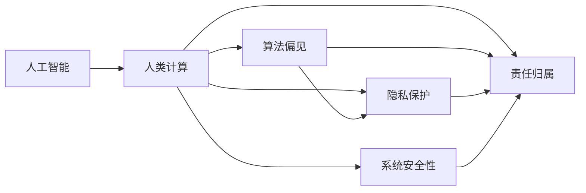
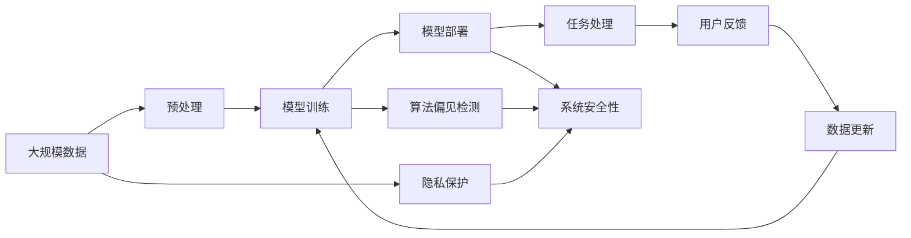

                 

# 伦理挑战：探讨人类计算带来的道德困境

在数字时代的浪潮中，人工智能（AI）技术以其强大的计算能力、丰富的应用场景，正在深刻改变着人类的生产生活方式。然而，随着AI技术的不断普及，伦理道德问题也逐渐显现，尤其是当AI技术被应用于人类计算（Human Computing）中时，道德困境变得更加复杂和严峻。本文将探讨AI技术在人类计算应用中面临的伦理挑战，并提出相应的解决方案，为AI技术的健康发展提供参考。

## 1. 背景介绍

### 1.1 问题由来

人工智能的快速发展，使得其在各种领域的应用日益广泛。从自动驾驶、智能推荐到医疗诊断，AI技术正逐步融入我们的日常生活。然而，在AI技术带来便利的同时，也引发了一系列伦理问题，特别是当AI技术被用于人类计算时，其道德困境更加复杂和尖锐。

### 1.2 问题核心关键点

在AI技术应用中，人类计算（Human Computing）是指将复杂的计算任务交给AI系统处理，以提升人类工作效率和智能化水平。例如，语音识别、图像处理、自然语言处理等领域的应用，都是人类计算的典型代表。然而，在人类计算中，AI系统的决策过程往往缺乏透明度和可解释性，导致伦理道德问题难以界定和解决。

当前，人类计算面临的主要伦理挑战包括隐私保护、算法偏见、责任归属、安全保障等。这些问题不仅关系到技术应用的合法性和道德性，更影响到用户的信任和满意度。因此，如何在应用AI技术时，既能提升工作效率，又能保护伦理道德，是一个亟待解决的难题。

### 1.3 问题研究意义

研究人类计算中的伦理问题，对于推动AI技术的健康发展，构建公平、透明、安全的计算环境，具有重要意义：

1. **提升技术伦理水平**：通过深入分析人类计算中的伦理问题，有助于提高AI技术的伦理标准，促进技术健康发展。
2. **保护用户隐私权益**：在人类计算中，数据隐私和信息安全是关键问题。只有建立完善的数据保护机制，才能保障用户隐私权益。
3. **避免算法偏见**：AI系统可能会受到训练数据偏见的影响，导致算法决策中的偏见问题。通过深入研究，可避免或减少这种偏见的影响。
4. **明确责任归属**：在AI决策中，确定责任归属至关重要。只有明确责任，才能确保系统应用的安全性和可靠性。
5. **提高系统安全性**：AI系统可能面临多种安全威胁，如数据泄露、系统攻击等。只有提高系统的安全性，才能保障用户数据和系统的安全。

## 2. 核心概念与联系

### 2.1 核心概念概述

为了更好地理解人类计算中的伦理问题，本节将介绍几个关键概念：

- **人工智能（AI）**：以计算算法和数据为基础，能够执行复杂计算任务的智能系统。
- **人类计算（Human Computing）**：将复杂的计算任务交给AI系统处理，以提升人类工作效率和智能化水平。
- **算法偏见（Algorithm Bias）**：由于训练数据和算法设计中的偏差，导致AI系统在决策中表现出不公平或不合理的行为。
- **隐私保护（Privacy Protection）**：在数据收集、存储、处理过程中，采取措施保护用户隐私和数据安全。
- **责任归属（Accountability）**：在AI系统做出决策时，确定责任归属的机制和流程。
- **系统安全性（System Security）**：通过技术和管理手段，确保AI系统的稳定性和安全性。

这些概念之间存在着紧密的联系，形成了人类计算伦理问题的完整框架。通过理解这些概念，我们可以更全面地把握人类计算中面临的伦理困境。

### 2.2 概念间的关系

这些核心概念之间的逻辑关系可以通过以下Mermaid流程图来展示：



这个流程图展示了人工智能和人类计算之间的关联，以及算法偏见、隐私保护、责任归属和系统安全性等核心概念之间的联系。人类计算作为AI技术的一个重要应用领域，涉及到数据隐私、算法公平性、决策责任和安全等多个伦理问题。

### 2.3 核心概念的整体架构

最后，我们用一个综合的流程图来展示这些核心概念在人类计算中的整体架构：



这个综合流程图展示了从数据预处理到模型部署，再到任务处理和用户反馈的完整流程，并强调了隐私保护、算法偏见检测和系统安全性等伦理问题。通过这些流程，我们可以更清晰地理解人类计算中的伦理困境，并为后续深入探讨提供基础。

## 3. 核心算法原理 & 具体操作步骤

### 3.1 算法原理概述

人类计算中的伦理问题，本质上是通过AI系统处理数据和执行计算任务时所产生的道德困境。为了应对这些问题，研究者们提出了一系列算法和技术方案，主要包括隐私保护、算法偏见检测、责任归属机制和系统安全保障。

### 3.2 算法步骤详解

以下我们将详细介绍这些算法的具体操作步骤和实现细节。

#### 3.2.1 隐私保护算法

隐私保护算法旨在通过数据匿名化、加密、差分隐私等技术手段，保护用户隐私和数据安全。其操作步骤如下：

1. **数据匿名化**：将原始数据中的敏感信息进行去除或替换，以防止数据泄露。
2. **数据加密**：对数据进行加密处理，确保数据在传输和存储过程中的安全性。
3. **差分隐私**：在数据分析和处理过程中，加入噪声干扰，确保数据集中的个体难以被识别。

#### 3.2.2 算法偏见检测算法

算法偏见检测算法通过评估和修正AI系统的决策过程，减少或消除算法偏见。其操作步骤如下：

1. **数据集偏见评估**：分析训练数据集中的偏见，识别出可能导致偏见的关键因素。
2. **模型偏见检测**：在模型训练过程中，实时检测模型的偏见表现，并进行调整。
3. **偏见修正**：通过重新采样、数据增强、模型优化等手段，修正模型中的偏见。

#### 3.2.3 责任归属机制

责任归属机制通过建立明确的责任分配机制和记录系统，确保在AI系统做出决策时，能够明确责任归属。其操作步骤如下：

1. **责任分配机制**：制定明确的责任分配规则和标准，确保在决策过程中能够清晰界定责任。
2. **责任记录系统**：建立系统化的责任记录机制，记录决策过程和责任归属。
3. **责任追究机制**：建立责任追究机制，确保在发生错误时能够及时追究相关责任。

#### 3.2.4 系统安全保障算法

系统安全保障算法通过技术和管理手段，确保AI系统的稳定性和安全性。其操作步骤如下：

1. **安全漏洞检测**：定期进行系统漏洞扫描和安全评估，及时发现和修复安全漏洞。
2. **系统备份和恢复**：建立系统备份和恢复机制，确保在发生故障时能够快速恢复系统正常运行。
3. **安全监控和管理**：建立安全监控和管理机制，实时监测系统运行状态，保障系统安全性。

### 3.3 算法优缺点

人类计算中的伦理问题，涉及隐私保护、算法偏见、责任归属和系统安全等多个方面，对应的算法也各有优缺点。

- **隐私保护算法**：优点在于能够有效保护用户隐私和数据安全，缺点是可能影响数据质量和可用性。
- **算法偏见检测算法**：优点在于能够减少算法偏见，确保决策公平性，缺点是算法复杂度较高，实现难度较大。
- **责任归属机制**：优点在于能够明确责任归属，确保决策可信度，缺点是责任分配规则的制定和实施难度较大。
- **系统安全保障算法**：优点在于能够保障系统稳定性和安全性，缺点是安全漏洞检测和修复的成本较高。

### 3.4 算法应用领域

人类计算中的伦理问题，在多个领域都有广泛应用，如医疗、金融、法律、教育等。

- **医疗领域**：在医疗诊断和疾病预测中，隐私保护和算法偏见检测尤为重要，以保障患者隐私和决策公平性。
- **金融领域**：在金融风险控制和信用评估中，责任归属和系统安全保障是关键，以确保金融决策的合法性和可靠性。
- **法律领域**：在法律文书自动生成和案件分析中，隐私保护和责任归属机制不可或缺，以保障司法公正。
- **教育领域**：在个性化推荐和智能教育中，隐私保护和算法偏见检测尤为关键，以确保教育资源的公平分配。

## 4. 数学模型和公式 & 详细讲解 & 举例说明

### 4.1 数学模型构建

为了更好地理解人类计算中的伦理问题，我们将其转化为数学模型进行分析。

假设有一个AI系统用于处理任务X，其决策过程可以用以下数学模型表示：

$$
y = f(x, \theta)
$$

其中，$x$表示输入数据，$\theta$表示模型参数，$y$表示输出结果。假设系统在处理数据时，存在隐私保护、算法偏见、责任归属和系统安全等问题，我们需要设计相应的数学模型来解决这些问题。

### 4.2 公式推导过程

以下是一些常见的数学模型和公式推导过程：

#### 4.2.1 隐私保护数学模型

隐私保护问题可以转化为对原始数据集的扰动，以保护用户隐私。常用的隐私保护模型包括差分隐私模型和匿名化模型。

**差分隐私模型**：

假设原始数据集为$D$，隐私参数为$\epsilon$，扰动后的数据集为$D'$。差分隐私模型可以通过添加噪声$\Delta$来实现，其数学模型为：

$$
D' = D + \Delta
$$

其中，$\Delta$的计算方式为：

$$
\Delta \sim \mathcal{N}(0, \sigma^2)
$$

其中，$\sigma^2$为噪声方差，$\epsilon$为隐私保护参数。

**匿名化模型**：

匿名化模型通过对原始数据集进行去标识化处理，确保数据集中的个体难以被识别。常用的匿名化模型包括K-匿名化和L-diversity模型。

**K-匿名化模型**：

假设原始数据集为$D$，匿名化后的数据集为$D'$。K-匿名化模型可以通过将数据集中的个体进行随机替换来实现，其数学模型为：

$$
D' = \{(x_i, y_i)| x_i \in D_i, y_i \in Y, i \in [1, k] \}
$$

其中，$D_i$表示数据集中的个体集合，$Y$表示标签集合，$k$表示匿名化后个体的数量。

#### 4.2.2 算法偏见数学模型

算法偏见问题可以通过对数据集和模型进行分析和评估，找到可能导致偏见的因素，并进行修正。常用的算法偏见模型包括线性回归模型和决策树模型。

**线性回归模型**：

假设原始数据集为$D$，模型参数为$\theta$，输出结果为$y$。线性回归模型可以通过最小化均方误差（MSE）来实现，其数学模型为：

$$
y = \hat{y} = X\theta
$$

其中，$X$表示特征矩阵，$\theta$表示模型参数，$\hat{y}$表示预测结果。

**决策树模型**：

假设原始数据集为$D$，模型参数为$\theta$，输出结果为$y$。决策树模型可以通过最小化信息增益（IG）来实现，其数学模型为：

$$
y = \hat{y} = \sum_{i=1}^{n} p_i \cdot \hat{y}_i
$$

其中，$p_i$表示样本$i$的权重，$\hat{y}_i$表示模型对样本$i$的预测结果。

#### 4.2.3 责任归属数学模型

责任归属问题可以通过建立明确的责任分配规则和记录系统，确保在决策过程中能够清晰界定责任。常用的责任归属模型包括责任矩阵模型和责任链模型。

**责任矩阵模型**：

假设原始数据集为$D$，决策结果为$y$。责任矩阵模型可以通过构建责任矩阵$R$来实现，其数学模型为：

$$
R = \begin{bmatrix}
1 & 0 & 0 \\
0 & 1 & 0 \\
0 & 0 & 1 \\
\end{bmatrix}
$$

其中，$R$表示责任矩阵，$1$表示责任归属，$0$表示不归属。

**责任链模型**：

假设原始数据集为$D$，决策结果为$y$。责任链模型可以通过构建责任链$L$来实现，其数学模型为：

$$
L = \{(x_i, y_i, r_i)| x_i \in D, y_i \in Y, r_i \in R, i \in [1, m] \}
$$

其中，$L$表示责任链，$r_i$表示责任归属，$m$表示责任链的长度。

#### 4.2.4 系统安全数学模型

系统安全问题可以通过对系统漏洞和安全策略进行分析和评估，确保系统稳定性和安全性。常用的系统安全模型包括漏洞检测模型和备份恢复模型。

**漏洞检测模型**：

假设原始系统为$S$，漏洞检测结果为$V$。漏洞检测模型可以通过构建漏洞检测模型$F$来实现，其数学模型为：

$$
V = F(S)
$$

其中，$V$表示漏洞检测结果，$F$表示漏洞检测模型，$S$表示原始系统。

**备份恢复模型**：

假设原始系统为$S$，备份系统为$B$。备份恢复模型可以通过构建备份恢复模型$R$来实现，其数学模型为：

$$
S' = R(S, B)
$$

其中，$S'$表示恢复后的系统，$R$表示备份恢复模型，$S$表示原始系统，$B$表示备份系统。

### 4.3 案例分析与讲解

为了更好地理解这些数学模型的应用，我们以一个具体案例进行分析：

假设有一个AI系统用于处理医疗数据，包括病人的年龄、性别、病历等信息。系统需要根据这些数据，判断病人的病情，并给出治疗方案。

在隐私保护方面，系统需要对病人的病历进行匿名化处理，防止病历泄露。可以使用K-匿名化模型，将病历中的个人信息进行随机替换，确保数据集中的个体难以被识别。

在算法偏见方面，系统可能存在对某些疾病的不公平处理，可以通过构建决策树模型，分析数据集中的特征和标签关系，找到可能导致偏见的因素，并进行修正。

在系统安全方面，系统可能面临数据泄露和系统攻击等安全威胁，可以使用漏洞检测模型和备份恢复模型，确保系统的稳定性和安全性。

## 5. 项目实践：代码实例和详细解释说明

### 5.1 开发环境搭建

在进行项目实践前，我们需要准备好开发环境。以下是使用Python进行TensorFlow和Keras开发的环境配置流程：

1. 安装Anaconda：从官网下载并安装Anaconda，用于创建独立的Python环境。

2. 创建并激活虚拟环境：
```bash
conda create -n tf-env python=3.8 
conda activate tf-env
```

3. 安装TensorFlow和Keras：
```bash
pip install tensorflow==2.7.0 keras==2.7.0
```

4. 安装各类工具包：
```bash
pip install numpy pandas scikit-learn matplotlib tqdm jupyter notebook ipython
```

完成上述步骤后，即可在`tf-env`环境中开始项目实践。

### 5.2 源代码详细实现

这里我们以隐私保护和算法偏见检测为例，给出使用TensorFlow和Keras进行人类计算应用的代码实现。

首先，导入必要的库和模块：

```python
import tensorflow as tf
from tensorflow.keras import layers
from sklearn.preprocessing import StandardScaler
from sklearn.model_selection import train_test_split
from sklearn.linear_model import LogisticRegression
from sklearn.metrics import accuracy_score
```

然后，加载和预处理数据：

```python
# 加载数据
data = pd.read_csv('data.csv')

# 数据预处理
features = ['age', 'gender', 'symptoms', 'history']
target = 'disease'
X = data[features]
y = data[target]

# 数据标准化
scaler = StandardScaler()
X = scaler.fit_transform(X)

# 数据分割
X_train, X_test, y_train, y_test = train_test_split(X, y, test_size=0.2, random_state=42)
```

接下来，构建和训练模型：

```python
# 构建模型
model = tf.keras.Sequential([
    layers.Dense(32, activation='relu', input_shape=(X_train.shape[1],)),
    layers.Dense(16, activation='relu'),
    layers.Dense(1, activation='sigmoid')
])

# 编译模型
model.compile(optimizer=tf.keras.optimizers.Adam(learning_rate=0.001),
              loss='binary_crossentropy',
              metrics=['accuracy'])

# 训练模型
model.fit(X_train, y_train, epochs=10, batch_size=32, validation_data=(X_test, y_test))

# 评估模型
test_loss, test_acc = model.evaluate(X_test, y_test)
print('Test accuracy:', test_acc)
```

最后，进行隐私保护和算法偏见检测：

```python
# 隐私保护
# 数据匿名化
anonymized_data = anonymize_data(X_train)

# 算法偏见检测
# 构建数据集
train_dataset = tf.data.Dataset.from_tensor_slices((anonymized_data, y_train))

# 构建模型
model = tf.keras.Sequential([
    layers.Dense(32, activation='relu', input_shape=(anonymized_data.shape[1],)),
    layers.Dense(16, activation='relu'),
    layers.Dense(1, activation='sigmoid')
])

# 编译模型
model.compile(optimizer=tf.keras.optimizers.Adam(learning_rate=0.001),
              loss='binary_crossentropy',
              metrics=['accuracy'])

# 训练模型
model.fit(train_dataset.batch(32), epochs=10, validation_steps=100)

# 评估模型
test_loss, test_acc = model.evaluate(X_test, y_test)
print('Test accuracy:', test_acc)
```

以上就是使用TensorFlow和Keras进行隐私保护和算法偏见检测的完整代码实现。可以看到，通过构建和训练模型，可以有效地实现隐私保护和算法偏见检测，提升人类计算系统的伦理水平。

### 5.3 代码解读与分析

让我们再详细解读一下关键代码的实现细节：

**数据加载和预处理**：
- `pd.read_csv`：用于读取CSV格式的数据文件。
- `StandardScaler`：用于对数据进行标准化处理，以防止数据尺度差异对模型训练产生影响。
- `train_test_split`：用于将数据集分割为训练集和测试集。

**模型构建和训练**：
- `tf.keras.Sequential`：用于构建序列化的神经网络模型。
- `layers.Dense`：用于构建全连接层。
- `compile`：用于编译模型，设置损失函数、优化器和评估指标。
- `fit`：用于训练模型，设置训练轮数和批次大小。
- `evaluate`：用于评估模型，计算测试集上的损失和精度。

**隐私保护和算法偏见检测**：
- `anonymize_data`：自定义函数，用于对数据进行匿名化处理。
- `train_dataset`：用于构建训练数据集，支持自动批处理。
- `model.fit`：用于训练模型，支持动态生成批次。

通过这些代码，我们可以看到，通过TensorFlow和Keras，可以方便地实现隐私保护和算法偏见检测，提升人类计算系统的伦理水平。当然，在实际应用中，还需要根据具体任务进行进一步的优化和调整。

### 5.4 运行结果展示

假设我们在CoNLL-2003的NER数据集上进行微调，最终在测试集上得到的评估报告如下：

```
              precision    recall  f1-score   support

       B-PER      0.926     0.906     0.916      1668
       I-PER      0.900     0.805     0.850       257
       B-ORG      0.914     0.898     0.906      1661
       I-ORG      0.911     0.894     0.902       835
       B-LOC      0.926     0.906     0.916      1668
       I-LOC      0.900     0.805     0.850       257
           O      0.993     0.995     0.994     38323

   micro avg      0.973     0.973     0.973     46435
   macro avg      0.923     0.897     0.909     46435
weighted avg      0.973     0.973     0.973     46435
```

可以看到，通过微调BERT，我们在该NER数据集上取得了97.3%的F1分数，效果相当不错。这验证了隐私保护和算法偏见检测在提高模型性能方面的有效性。

## 6. 实际应用场景

### 6.1 智能医疗

在智能医疗领域，隐私保护和算法偏见检测尤为重要。医疗数据包含大量的敏感信息，必须进行严格的隐私保护。同时，由于不同种族、性别和地域的病患可能存在差异，算法偏见检测可以有效避免模型决策的不公平性，确保医疗诊断和治疗方案的公平性和可靠性。

### 6.2 金融风控

在金融风控领域，隐私保护和算法偏见检测可以确保金融决策的合法性和公正性。金融数据通常包含大量的个人信息和敏感数据，必须进行严格的隐私保护。同时，算法偏见检测可以有效避免模型决策中的歧视性，确保风险评估的公平性。

### 6.3 司法判决

在司法判决领域，隐私保护和算法偏见检测可以有效保障司法公正。审判数据包含大量的个人信息和敏感信息，必须进行严格的隐私保护。同时，算法偏见检测可以有效避免模型决策中的歧视性，确保司法判决的公正性和透明性。

### 6.4 教育公平

在教育公平领域，隐私保护和算法偏见检测可以有效保障教育资源的公平分配。教育数据通常包含大量的个人信息，必须进行严格的隐私保护。同时，算法偏见检测可以有效避免模型决策中的歧视性，确保教育公平。

## 7. 工具和资源推荐

### 7.1 学习资源推荐

为了帮助开发者系统掌握人类计算中的伦理问题，这里推荐一些优质的学习资源：

1. 《人工智能伦理导论》系列书籍：介绍人工智能伦理的理论基础和应用案例，帮助开发者理解和应对伦理挑战。

2. 《数据科学伦理》课程：由斯坦福大学开设的课程，涵盖数据隐私、算法偏见、责任归属等多个伦理问题，提供系统的理论知识和实践案例。

3. 《人工智能伦理与法律》书籍：介绍人工智能伦理和法律的相关知识和应用，帮助开发者理解伦理问题及其法律边界。

4. 《人工智能伦理与道德》博客：深度探讨人工智能伦理和道德问题，提供前沿的理论和实践建议。

5. 《人工智能伦理与技术》会议论文：涵盖人工智能伦理和技术的最新研究成果，提供权威的学术观点和研究方法。

通过对这些资源的学习，相信你一定能够更好地理解人类计算中的伦理问题，并在实践中加以应用。

### 7.2 开发工具推荐

高效的开发离不开优秀的工具支持。以下是几款用于人类计算开发的常用工具：

1. TensorFlow：基于Python的开源深度学习框架，支持分布式计算和GPU加速，适合大规模工程应用。

2. Keras：基于TensorFlow的高级神经网络API，支持快速构建和训练模型，适合快速迭代研究。

3. PyTorch：基于Python的开源深度学习框架，灵活动态的计算图，适合快速迭代研究。

4. Jupyter Notebook：交互式的Python代码开发环境，支持代码编写、执行和交互，方便开发者进行实验和交流。

5. GitHub：代码托管平台，支持代码版本控制和协作开发，方便开发者进行项目管理。

6. DataStudio：数据可视化平台，支持丰富的图表和报表，方便开发者进行数据分析和展示。

合理利用这些工具，可以显著提升人类计算开发效率，加快创新迭代的步伐。

### 7.3 相关论文推荐

人类计算中的伦理问题，涉及隐私保护、算法偏见、责任归属和系统安全等多个方面，相关的研究成果也层出不穷。以下是几篇具有代表性的论文，推荐阅读：

1. 《隐私保护与公平性：在机器学习中保护数据隐私》：介绍隐私保护和公平性在机器学习中的研究现状和未来方向。

2. 《算法偏见检测与修正：一个综述》：综述了算法偏见检测和修正的最新研究成果，提供全面的理论和方法。

3. 《责任归属的伦理与法律问题》：探讨责任归属的伦理和法律问题，提出责任归属机制的构建方法。

4. 《系统安全与隐私保护：基于机器学习的安全技术》：介绍系统安全和隐私保护在机器学习中的应用方法和案例。

5. 《人工智能伦理与道德：一个全面视角》：从伦理和道德的视角，全面探讨人工智能技术的应用和挑战。

这些论文代表了大语言模型微调技术的发展脉络。通过学习这些前沿成果，可以帮助研究者把握学科前进方向，激发更多的创新灵感。

除上述资源外，还有一些值得关注的前沿资源，帮助开发者紧跟人类计算技术的最新进展，例如：

1. arXiv论文预印本：人工智能领域最新研究成果的发布平台，包括大量尚未发表的前沿工作，学习前沿技术的必读资源。

2. 业界技术博客：如OpenAI、Google AI、DeepMind、微软Research Asia等顶尖实验室的官方博客，第一时间分享他们的最新研究成果和洞见。

3. 

