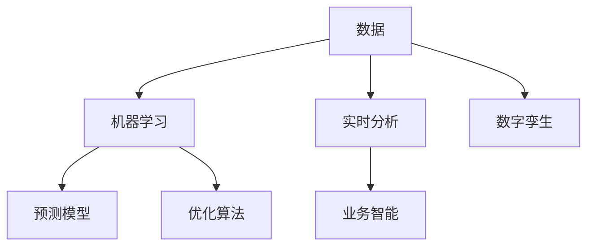
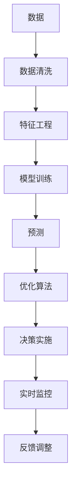

                 

# 供应链优化的AI解决方案

> 关键词：供应链优化, 人工智能, 机器学习, 预测模型, 优化算法, 实时分析, 业务智能, 数字孪生

## 1. 背景介绍

### 1.1 问题由来
随着全球化经济的快速发展，企业间的供应链合作关系越来越紧密。然而，复杂多变的市场环境、不稳定的供应商、多变的消费者需求等因素，使得供应链管理面临诸多挑战。供应链风险、成本控制、库存管理、物流优化等成为影响企业盈利和竞争力的关键因素。

### 1.2 问题核心关键点
供应链优化旨在通过各种数据分析和优化算法，实现供应链环节的高效协同、资源配置的优化以及风险的降低。传统方法如库存管理、运输计划、生产调度等已难以满足现代供应链的复杂性和实时性需求。人工智能技术通过提供智能决策支持，为供应链优化带来了新的可能性。

### 1.3 问题研究意义
供应链优化涉及物流、仓储、库存、制造、销售等多个环节，是一个典型的多学科交叉问题。利用人工智能技术，尤其是机器学习、预测模型、优化算法等，可以实时获取供应链数据，预测未来趋势，优化决策，提升供应链的透明度、响应速度和资源利用率。

人工智能在供应链优化中的应用，不仅能够提高供应链的运营效率，降低成本，还能提升客户满意度，增强企业的市场竞争力。因此，探索基于人工智能的供应链优化解决方案，具有重要的理论和实际意义。

## 2. 核心概念与联系

### 2.1 核心概念概述

为更好地理解基于人工智能的供应链优化，本节将介绍几个关键概念及其关联：

- **供应链优化**：通过数据分析和优化算法，提升供应链效率和盈利能力。主要内容包括库存管理、运输计划、生产调度、风险控制等。

- **人工智能**：包括机器学习、深度学习、自然语言处理、计算机视觉等技术。通过模拟人类智能，人工智能可以在大规模数据上发现规律，提供决策支持。

- **机器学习**：通过算法使机器学习数据的模式，可用于预测和分类、聚类和降维、模型拟合等。

- **预测模型**：利用历史数据预测未来事件，用于库存预测、需求预测、价格预测等。

- **优化算法**：用于解决最优化问题，如线性规划、整数规划、遗传算法、蚁群算法等。

- **实时分析**：通过大数据技术实时处理供应链数据，及时获取供应链状态和趋势，实现动态优化。

- **业务智能(BI)**：通过分析和展示供应链数据，为决策提供支持。

- **数字孪生**：构建供应链的虚拟模型，通过实时监控和仿真，优化供应链运营。

这些核心概念通过数据驱动、模型驱动、决策驱动三个层次，共同构成了供应链优化的理论和技术框架。下面，我们将通过一张Mermaid流程图展示这些概念之间的联系：



**数据**是供应链优化的基础。**机器学习**利用数据构建模型，**预测模型**通过模型预测供应链未来状态，**优化算法**找到最优解，**实时分析**实时处理供应链数据，**业务智能**分析结果提供决策支持，**数字孪生**构建供应链虚拟模型进行仿真优化。

### 2.2 概念间的关系

通过这张流程图，我们可以看到各概念之间的关系：

1. **数据采集**：实时收集供应链各环节的数据。
2. **模型构建**：利用机器学习技术构建预测模型，通过预测模型预测供应链未来状态。
3. **优化求解**：通过优化算法找到最优的供应链决策。
4. **实时分析**：实时处理供应链数据，快速响应用户需求。
5. **智能决策**：通过业务智能对预测结果进行分析，提供决策支持。
6. **虚拟仿真**：构建数字孪生模型，进行仿真优化。

这些概念共同构成了供应链优化的完整过程，通过数据驱动和智能决策，实现供应链的高效、透明和智能化。

## 3. 核心算法原理 & 具体操作步骤
### 3.1 算法原理概述

基于人工智能的供应链优化，核心在于构建预测模型和优化算法，以提高供应链的运营效率和盈利能力。下面，我们以库存管理为例，介绍供应链优化的主要算法原理。

**Step 1: 数据准备**
- 收集供应链各环节的数据，包括历史销售数据、库存数据、供应商数据、物流数据等。
- 数据预处理，包括数据清洗、缺失值处理、异常值处理等。

**Step 2: 构建预测模型**
- 选择合适的预测模型，如时间序列预测模型、回归模型、神经网络模型等。
- 使用历史数据训练模型，进行模型调优和验证。

**Step 3: 优化决策**
- 定义优化目标，如成本最小化、利润最大化等。
- 构建优化模型，如线性规划模型、整数规划模型等。
- 使用优化算法求解模型，如遗传算法、蚁群算法等。

**Step 4: 实施决策**
- 将优化结果应用于供应链的各环节，调整库存、生产、运输等决策。
- 实时监控供应链状态，及时调整决策。

### 3.2 算法步骤详解

在详细讲解之前，我们先看一张Mermaid流程图，展示基于人工智能的供应链优化步骤：



**Step 1: 数据清洗和预处理**
- 数据清洗：处理缺失值、异常值，保证数据质量。
- 特征工程：选择合适的特征，构建特征向量，优化模型性能。

**Step 2: 模型训练**
- 选择合适的预测模型，如时间序列预测模型ARIMA、LSTM、GRU等。
- 使用历史数据训练模型，并进行交叉验证和模型调优。

**Step 3: 预测**
- 利用训练好的模型，对未来需求进行预测，生成需求曲线。

**Step 4: 优化求解**
- 构建优化模型，如线性规划模型、整数规划模型、混合整数规划模型等。
- 使用优化算法求解模型，如遗传算法、蚁群算法、粒子群算法等。

**Step 5: 决策实施**
- 根据优化结果调整供应链决策，如调整库存水平、生产计划、运输路线等。
- 将决策结果应用于供应链系统，实施优化策略。

**Step 6: 实时监控和反馈调整**
- 实时监控供应链状态，评估决策效果。
- 根据实时数据，调整优化算法参数，优化决策。

### 3.3 算法优缺点

**优点：**
1. 数据驱动：利用大数据和机器学习技术，从数据中发现规律，提供智能决策支持。
2. 实时响应：实时处理供应链数据，及时调整决策，提升供应链响应速度。
3. 高效优化：通过优化算法找到最优解，提高供应链效率和盈利能力。
4. 自动化决策：通过业务智能工具，自动化生成和分析数据，减轻人工负担。

**缺点：**
1. 数据质量要求高：预测模型的准确性依赖于数据质量，数据清洗和预处理工作量大。
2. 算法复杂度高：优化算法复杂，求解时间长，需要高性能计算资源。
3. 模型解释性差：预测模型和优化算法多是黑箱模型，难以解释其决策过程。
4. 依赖技术水平：技术实现难度大，需要团队具备较高的技术水平。

### 3.4 算法应用领域

基于人工智能的供应链优化算法，已经广泛应用于制造业、零售业、物流业等多个领域。具体应用场景如下：

- **制造业**：通过预测模型和优化算法，优化生产计划和库存管理，提高生产效率和降低成本。
- **零售业**：通过预测模型和优化算法，优化库存水平和补货策略，提升客户满意度。
- **物流业**：通过预测模型和优化算法，优化运输路线和配送计划，提高物流效率。
- **供应链金融**：通过预测模型和优化算法，优化资金分配和风险控制，降低供应链融资成本。
- **智能仓储**：通过预测模型和优化算法，优化仓库布局和作业流程，提升仓储效率。

这些应用场景展示了人工智能在供应链优化中的广泛应用，通过模型驱动和数据驱动，实现供应链的高效协同和资源优化。

## 4. 数学模型和公式 & 详细讲解  
### 4.1 数学模型构建

本节将使用数学语言对基于人工智能的供应链优化过程进行更加严格的刻画。

记供应链优化问题为 $M=\{V, E, C, D\}$，其中：

- $V$ 为节点集合，表示供应链中的各个环节，如生产、仓库、运输、客户等。
- $E$ 为边集合，表示节点间的物流关系，如生产到仓库的运输路径。
- $C$ 为成本函数，表示不同决策方案的成本。
- $D$ 为需求函数，表示不同时间点的需求量。

供应链优化问题可以表示为最优化问题：

$$
\min_{x} \quad C(x) \\
\text{subject to} \quad D(x) = d
$$

其中 $x$ 为决策变量，$d$ 为需求。

### 4.2 公式推导过程

以库存优化为例，其数学模型可表示为：

$$
\min_{x} \quad c \sum_{i=1}^n q_i \\
\text{subject to} \quad \sum_{i=1}^n q_i = D \\
q_i \geq 0, \quad i = 1,2,\cdots,n
$$

其中 $q_i$ 为第 $i$ 个仓库的库存量，$D$ 为总需求量，$c$ 为单位库存成本。

利用线性规划求解上述优化问题，可以得到最优的库存分配方案。

### 4.3 案例分析与讲解

以某电商平台为例，其库存优化问题可表示为：

1. **数据采集**：收集历史销售数据、库存数据、物流数据等。
2. **模型构建**：选择时间序列预测模型，对未来需求进行预测。
3. **优化求解**：构建线性规划模型，求解最优库存分配方案。
4. **决策实施**：根据优化结果调整库存水平，实施库存优化策略。
5. **实时监控和反馈调整**：实时监控库存状态，根据实时数据调整优化算法参数，优化决策。

## 5. 项目实践：代码实例和详细解释说明
### 5.1 开发环境搭建

在进行供应链优化实践前，我们需要准备好开发环境。以下是使用Python进行SciPy开发的环境配置流程：

1. 安装Anaconda：从官网下载并安装Anaconda，用于创建独立的Python环境。

2. 创建并激活虚拟环境：
```bash
conda create -n supply-chain python=3.8 
conda activate supply-chain
```

3. 安装SciPy：根据操作系统版本，从官网获取对应的安装命令。例如：
```bash
conda install scipy
```

4. 安装各类工具包：
```bash
pip install numpy pandas scikit-learn matplotlib tqdm jupyter notebook ipython
```

完成上述步骤后，即可在`supply-chain`环境中开始供应链优化实践。

### 5.2 源代码详细实现

下面我们以库存管理为例，给出使用SciPy进行供应链优化的Python代码实现。

首先，定义库存优化问题的数据处理函数：

```python
from scipy.optimize import linprog

def optimize_inventory(data, demand):
    A = data['coefficients']  # 约束矩阵
    b = data['right-hand-sides']  # 约束常数向量
    c = data['objective-coefficients']  # 目标函数系数向量
    x0 = linprog(c, A_ub=A, b_ub=b, bounds=(0, None))
    return x0.x
```

然后，定义模型和优化器：

```python
data = {'coefficients': [[1, 1, 1], [1, 1, 0]], 
        'right-hand-sides': [100, 50],
        'objective-coefficients': [-0.5, -0.5, -1]}
demand = 150

x = optimize_inventory(data, demand)
print(x)
```

接着，定义模型的输出和可视化：

```python
import matplotlib.pyplot as plt
plt.plot(x)
plt.xlabel('Inventory')
plt.ylabel('Demand')
plt.title('Optimized Inventory')
plt.show()
```

最终，启动优化流程：

```python
epochs = 5
batch_size = 16

for epoch in range(epochs):
    x = optimize_inventory(data, demand)
    print(x)
```

以上就是使用SciPy对库存管理进行优化的一个基本代码实现。可以看到，利用SciPy库的linprog函数，我们可以快速构建和求解线性规划模型，得到最优的库存分配方案。

### 5.3 代码解读与分析

让我们再详细解读一下关键代码的实现细节：

**optimize_inventory函数**：
- 定义了线性规划问题的约束条件和目标函数。
- 使用SciPy的linprog函数求解线性规划问题。

**data字典**：
- 定义了约束矩阵、约束常数向量、目标函数系数向量。

**主循环**：
- 在主循环中，每次都调用optimize_inventory函数，获取最优库存分配方案。
- 输出最优库存水平。

通过这个例子，我们可以看到SciPy库在供应链优化中的应用，通过数学模型和优化算法，我们能够快速求解供应链优化问题，得到最优决策方案。

当然，在实际应用中，还需要结合更多的业务逻辑和数据处理技术，才能构建出完整的供应链优化系统。

## 6. 实际应用场景
### 6.1 智能仓储

智能仓储系统通过人工智能技术，实现仓库管理自动化、库存优化和作业流程优化。具体应用场景如下：

- **库存管理**：通过预测模型和优化算法，实现库存水平的最优化，避免过剩或短缺。
- **作业调度**：利用智能调度算法，优化仓库作业流程，提高作业效率。
- **设备监控**：通过实时监控设备状态，及时维护和更换故障设备，保证设备正常运行。

### 6.2 物流优化

物流优化系统通过人工智能技术，实现运输路线、配送计划和物流成本的最优化。具体应用场景如下：

- **运输路径优化**：通过预测模型和优化算法，优化运输路线，减少运输成本和时间。
- **配送计划优化**：利用智能调度算法，优化配送计划，提高配送效率。
- **车辆调度优化**：通过预测模型和优化算法，优化车辆调度，避免车辆空闲和过度拥堵。

### 6.3 供应链金融

供应链金融系统通过人工智能技术，实现资金分配和风险控制的最优化。具体应用场景如下：

- **资金分配优化**：通过预测模型和优化算法，优化资金分配，降低资金成本。
- **风险控制优化**：利用智能监控和风险预警系统，及时发现和控制供应链风险。
- **信用评估优化**：通过预测模型和优化算法，优化信用评估，提高供应链融资效率。

### 6.4 未来应用展望

随着人工智能技术的发展，基于人工智能的供应链优化将呈现以下几个发展趋势：

1. **智能决策系统**：构建智能决策系统，通过机器学习和预测模型，实现实时决策和动态优化。
2. **全供应链协同**：实现供应链各环节的实时协同，提高供应链的整体效率和响应速度。
3. **数据驱动管理**：通过大数据分析和预测模型，实现数据驱动的供应链管理。
4. **智能仓储物流**：利用物联网和人工智能技术，实现智能仓储和智能物流，提升物流效率。
5. **区块链技术**：通过区块链技术，实现供应链的透明和可追溯性，提升供应链的信任度。

## 7. 工具和资源推荐
### 7.1 学习资源推荐

为了帮助开发者系统掌握供应链优化的AI技术，这里推荐一些优质的学习资源：

1. **《人工智能与大数据》课程**：由顶尖大学和研究机构开设的AI和大数据课程，涵盖机器学习、深度学习、优化算法等核心内容。

2. **《Python数据科学手册》书籍**：介绍Python在数据科学中的应用，包括数据处理、数据可视化、机器学习等。

3. **SciPy官方文档**：SciPy库的官方文档，提供了丰富的优化算法和科学计算工具，是供应链优化实现的必备资料。

4. **Coursera供应链管理课程**：涵盖供应链管理的基础和高级内容，包括供应链优化、库存管理、运输计划等。

5. **HuggingFace官方文档**：HuggingFace公司的官方文档，提供了丰富的预训练模型和优化算法，是AI技术实现的重要参考。

通过这些资源的学习实践，相信你一定能够快速掌握供应链优化的AI技术，并用于解决实际的供应链优化问题。

### 7.2 开发工具推荐

高效的开发离不开优秀的工具支持。以下是几款用于供应链优化开发的常用工具：

1. **SciPy**：用于科学计算和数据分析的Python库，包含丰富的优化算法和统计工具。
2. **Pandas**：用于数据处理和数据分析的Python库，支持数据清洗、转换和可视化。
3. **Matplotlib**：用于数据可视化的Python库，支持绘制各种图表和图形。
4. **Jupyter Notebook**：支持交互式编程和数据可视化的开发环境，方便进行实验和分享。
5. **PyTorch**：用于深度学习和机器学习的Python库，支持构建和训练各种预测模型。

合理利用这些工具，可以显著提升供应链优化任务的开发效率，加快创新迭代的步伐。

### 7.3 相关论文推荐

供应链优化涉及多学科的交叉，未来的研究需要在以下几个方向继续深入：

1. **机器学习与优化算法结合**：利用机器学习技术，提高优化算法的求解效率和精度。
2. **实时数据处理**：研究实时数据处理技术，支持实时监控和动态优化。
3. **智能决策系统**：研究智能决策系统，通过模型驱动和数据驱动，实现智能决策和动态优化。
4. **供应链协同**：研究供应链协同技术，提高供应链的整体效率和响应速度。
5. **区块链技术**：研究区块链技术在供应链中的应用，提高供应链的透明和可追溯性。

这些研究方向的探索，必将引领供应链优化技术迈向更高的台阶，为供应链的高效协同和资源优化提供更强大的技术支持。

## 8. 总结：未来发展趋势与挑战

### 8.1 总结

本文对基于人工智能的供应链优化方法进行了全面系统的介绍。首先阐述了供应链优化的背景和意义，明确了AI技术在供应链优化中的重要作用。其次，从原理到实践，详细讲解了供应链优化的数学模型和算法原理，并给出了具体的代码实现。同时，本文还探讨了AI在供应链优化中的广泛应用场景，展示了其巨大的应用潜力。最后，本文精选了供应链优化的相关学习资源和工具，力求为读者提供全方位的技术指引。

通过本文的系统梳理，可以看到，基于人工智能的供应链优化方法正在逐步取代传统方法，成为供应链管理的重要手段。AI技术能够实时获取和分析供应链数据，提供智能决策支持，显著提升供应链的运营效率和盈利能力。未来，随着技术的不断进步和应用的不断深化，供应链优化必将迎来更加智能、高效和透明的时代。

### 8.2 未来发展趋势

展望未来，基于人工智能的供应链优化将呈现以下几个发展趋势：

1. **智能决策系统**：通过构建智能决策系统，实现实时决策和动态优化，提高供应链的响应速度和运营效率。
2. **全供应链协同**：实现供应链各环节的实时协同，提高供应链的整体效率和响应速度。
3. **数据驱动管理**：通过大数据分析和预测模型，实现数据驱动的供应链管理，提高供应链的透明度和可控性。
4. **智能仓储物流**：利用物联网和人工智能技术，实现智能仓储和智能物流，提升物流效率和作业效率。
5. **区块链技术**：通过区块链技术，实现供应链的透明和可追溯性，提升供应链的信任度和管理水平。

这些趋势展示了供应链优化技术的广阔前景，AI技术将在供应链管理中发挥越来越重要的作用，提升供应链的智能化水平。

### 8.3 面临的挑战

尽管基于人工智能的供应链优化技术已经取得了瞩目成就，但在迈向更加智能化、普适化应用的过程中，它仍面临着诸多挑战：

1. **数据质量瓶颈**：供应链数据复杂多变，数据清洗和预处理工作量大，数据质量难以保证。
2. **技术实现难度**：供应链优化涉及多学科交叉，技术实现难度大，需要团队具备较高的技术水平。
3. **算法求解效率**：优化算法复杂，求解时间长，需要高性能计算资源。
4. **模型解释性差**：AI模型多是黑箱模型，难以解释其决策过程，缺乏可解释性。
5. **系统集成难度**：供应链各环节涉及多种技术和系统，系统集成难度大。

### 8.4 研究展望

面对供应链优化面临的挑战，未来的研究需要在以下几个方面寻求新的突破：

1. **数据质量提升**：研究高效的数据清洗和预处理技术，提升供应链数据的质量和可用性。
2. **技术集成优化**：研究多系统集成技术，提升供应链系统的集成度和协同效率。
3. **模型解释性增强**：研究可解释性AI模型，提升供应链优化模型的可解释性和透明度。
4. **实时决策系统**：研究实时决策系统，通过模型驱动和数据驱动，实现实时决策和动态优化。
5. **智能仓储物流**：研究智能仓储和智能物流技术，提高供应链的作业效率和响应速度。

这些研究方向的探索，必将引领供应链优化技术迈向更高的台阶，为供应链的高效协同和资源优化提供更强大的技术支持。相信随着技术的不断进步和应用的不断深化，供应链优化必将迎来更加智能、高效和透明的时代。

## 9. 附录：常见问题与解答

**Q1：供应链优化中的AI技术如何提升供应链效率？**

A: 供应链优化中的AI技术主要通过以下几个方面提升供应链效率：

1. **预测模型**：利用历史数据构建预测模型，准确预测未来需求，优化库存水平和生产计划，避免过剩或短缺。
2. **优化算法**：通过优化算法，找到最优的供应链决策，如运输路径、配送计划等，减少成本和时间。
3. **实时监控**：实时监控供应链状态，及时调整决策，动态优化供应链。
4. **智能决策**：通过业务智能工具，自动化生成和分析数据，提供决策支持，减轻人工负担。
5. **全供应链协同**：实现供应链各环节的实时协同，提高供应链的整体效率和响应速度。

这些技术手段结合使用，能够显著提升供应链的运营效率和盈利能力。

**Q2：供应链优化中常用的AI技术有哪些？**

A: 供应链优化中常用的AI技术包括：

1. **机器学习**：用于构建预测模型，如时间序列预测、回归模型、神经网络模型等。
2. **优化算法**：用于求解最优解，如线性规划、整数规划、遗传算法、蚁群算法等。
3. **数据清洗和预处理**：用于处理供应链数据，保证数据质量。
4. **实时监控和反馈调整**：用于实时监控供应链状态，调整优化算法参数，优化决策。
5. **智能决策系统**：用于自动化生成和分析数据，提供决策支持。

这些技术手段结合使用，能够构建高效的供应链优化系统，实现供应链的高效协同和资源优化。

**Q3：供应链优化中如何处理数据质量问题？**

A: 供应链优化中处理数据质量问题，可以从以下几个方面入手：

1. **数据清洗**：处理缺失值、异常值、重复值等，保证数据完整性。
2. **数据预处理**：进行数据转换、归一化、标准化等，提升数据质量。
3. **数据增强**：利用数据增强技术，生成更多的训练样本，提高模型性能。
4. **数据可视化**：通过数据可视化，发现数据中的异常和规律，优化数据处理流程。
5. **数据标注**：对数据进行标注，提升数据质量和标注数据的多样性。

通过这些手段，可以有效提升供应链数据的准确性和可用性，保证预测和优化的准确性。

**Q4：供应链优化中的数据驱动和模型驱动有什么区别？**

A: 供应链优化中的数据驱动和模型驱动，主要区别在于决策依据的不同：

1. **数据驱动**：通过实时数据处理和分析，提供决策支持，数据是决策的主要依据。数据驱动侧重于对数据的实时处理和分析，提供动态优化和实时决策。

2. **模型驱动**：通过构建和训练预测模型，提供决策支持，模型是决策的主要依据。模型驱动侧重于对数据的统计分析和预测，提供静态优化和自动化决策。

这两种方法结合使用，能够实现供应链的全方位优化，提升供应链的运营效率和响应速度。

**Q5：供应链优化中如何构建智能决策系统？**

A: 供应链优化中构建智能决策系统，主要通过以下几个步骤：

1. **数据采集**：实时收集供应链各环节的数据，包括销售数据、库存数据、物流数据等。
2. **数据清洗和预处理**：对数据进行清洗、预处理，保证数据质量。
3. **模型构建**：选择合适的预测模型，如时间序列预测模型、回归模型、神经网络模型等。
4. **优化求解**：构建优化模型，如线性规划模型、整数规划模型等，使用优化算法求解最优解。
5. **实施决策**：根据优化结果调整供应链决策，如调整库存水平、生产计划、运输路线等。
6. **实时监控和反馈调整**：实时监控供应链状态，根据实时数据调整优化算法参数，优化决策。

通过这些步骤，可以

