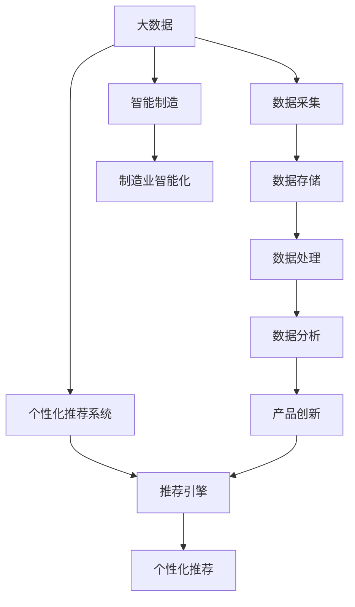
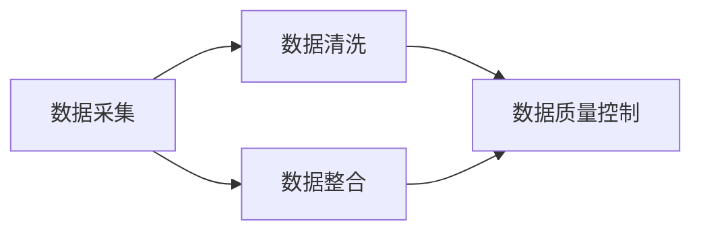
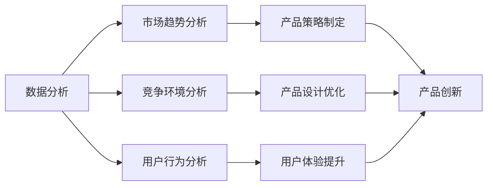
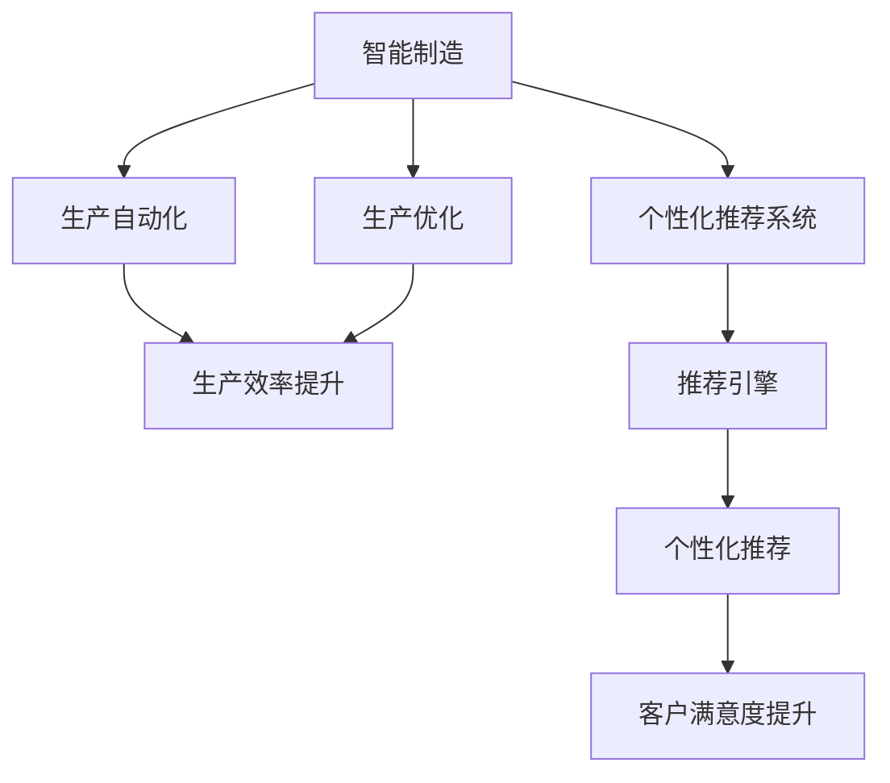
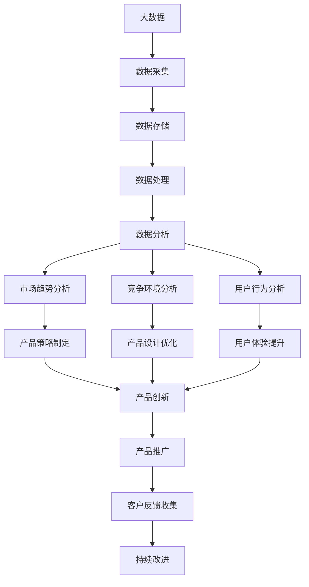

                 

## 1. 背景介绍

### 1.1 问题由来

在当前信息化和数字化时代，数据正在迅速增长和普及，这为企业的产品创新提供了前所未有的机遇。然而，面对海量的信息，企业如何有效地从数据中提取有价值的信息，并在产品创新中加以应用，是一个值得深思的问题。信息差（Information Gap）指的是由于企业对目标市场、消费者需求和竞争环境缺乏准确理解而产生的认知差异。如何通过大数据技术缩小信息差，驱动产品创新，是企业在数字化转型过程中亟需解决的关键问题。

### 1.2 问题核心关键点

信息差主要体现在以下几个方面：

- **市场需求的不确定性**：消费者需求随着时间、地点和情境的变化而不断变化，企业如何精准捕捉这些变化并及时响应，是信息差的核心问题。
- **竞争环境的复杂性**：市场竞争日益激烈，企业如何通过大数据分析，深入了解竞争对手的策略和市场布局，从而制定出更具竞争力的产品策略，是信息差的另一个关键点。
- **产品创新的资源限制**：在数据驱动的产品创新中，企业面临资源限制，如技术、人力和资金等，如何通过大数据技术优化资源配置，提高产品创新的效率和效果，是信息差的重要挑战。
- **信息孤岛和数据质量问题**：企业内部数据分散在不同系统中，形成信息孤岛，且数据质量参差不齐，如何整合数据、提高数据质量，是信息差解决的重要前提。

### 1.3 问题研究意义

大数据在产品创新中的作用日益凸显，通过数据分析和挖掘，企业可以更准确地识别市场机会，制定产品策略，优化产品设计和提升用户体验，从而在竞争中占据优势。研究信息差的大数据应用，对于提升企业产品创新的成功率，增强市场竞争力，具有重要的理论和实际意义。

## 2. 核心概念与联系

### 2.1 核心概念概述

为更好地理解大数据如何驱动产品创新，本节将介绍几个密切相关的核心概念：

- **大数据（Big Data）**：指数据量巨大、数据来源多样、数据类型繁多、数据价值密度低的数据集合。大数据技术包括数据采集、存储、处理和分析等多个环节，目的是从海量数据中提取有价值的信息。
- **产品创新（Product Innovation）**：指通过新技术、新设计和新功能，开发出具有市场竞争力的新产品或改进现有产品的过程。产品创新是企业持续发展的动力源泉。
- **数据驱动（Data-Driven）**：指以数据为中心，利用数据分析技术，指导决策和行动的管理模式。数据驱动有助于提高决策的准确性和效率。
- **信息差（Information Gap）**：指企业与市场、消费者之间的认知差异，大数据技术可以通过数据挖掘和分析，帮助企业缩小信息差，做出更精准的决策。
- **智能制造（Smart Manufacturing）**：通过物联网、大数据、人工智能等技术，实现智能化的生产、管理和控制，提升制造业的效率和质量。
- **个性化推荐系统（Personalized Recommendation System）**：基于用户行为数据和兴趣偏好，推荐个性化的产品或服务，提高用户体验和满意度。

这些核心概念之间的逻辑关系可以通过以下Mermaid流程图来展示：



这个流程图展示了大数据在产品创新中的整体应用过程，从数据采集到个性化推荐，逐步深入企业的产品设计和生产流程，最终驱动产品创新。通过理解这些核心概念，我们可以更好地把握大数据在产品创新中的作用和意义。

### 2.2 概念间的关系

这些核心概念之间存在着紧密的联系，形成了大数据驱动产品创新的完整生态系统。下面我通过几个Mermaid流程图来展示这些概念之间的关系。

#### 2.2.1 数据采集与数据质量



这个流程图展示了数据采集、数据清洗、数据整合和数据质量控制的过程。数据采集是所有后续处理的基础，数据清洗和整合则是提高数据质量和可用的关键步骤，而数据质量控制则是确保数据可信度的重要环节。

#### 2.2.2 数据分析与产品创新



这个流程图展示了数据分析在产品创新中的作用。通过市场趋势分析、竞争环境分析和用户行为分析，企业可以制定出更具竞争力的产品策略，优化产品设计和提升用户体验，从而实现产品创新。

#### 2.2.3 智能制造与个性化推荐



这个流程图展示了智能制造和个性化推荐系统的应用。智能制造通过自动化和优化生产流程，提高生产效率和质量。个性化推荐系统通过分析用户行为数据，提供个性化的产品或服务，提升客户满意度和忠诚度。

### 2.3 核心概念的整体架构

最后，我们用一个综合的流程图来展示这些核心概念在大数据驱动产品创新过程中的整体架构：



这个综合流程图展示了从数据采集到产品推广的完整过程。通过数据采集和处理，进行市场趋势、竞争环境和用户行为分析，制定产品策略，优化产品设计和提升用户体验，实现产品创新。产品推广后，通过客户反馈收集和持续改进，形成产品创新的闭环。

## 3. 核心算法原理 & 具体操作步骤
### 3.1 算法原理概述

大数据驱动的产品创新，本质上是基于数据驱动的管理模式，通过分析数据，指导产品设计和生产流程，从而实现创新。其核心算法原理包括以下几个步骤：

1. **数据采集**：从不同渠道和来源获取数据，确保数据的多样性和全面性。
2. **数据清洗和整合**：对采集到的数据进行清洗、去重、合并等操作，确保数据的准确性和一致性。
3. **数据分析**：通过数据挖掘和分析技术，提取有价值的信息，用于指导产品创新。
4. **产品策略制定**：根据数据分析结果，制定出符合市场需求的产品策略，指导产品设计。
5. **产品设计和生产优化**：通过仿真模拟、原型测试等手段，优化产品设计和生产流程，提升产品质量和生产效率。
6. **用户体验提升**：通过用户反馈数据和行为分析，提升用户体验，增强用户粘性。
7. **产品推广和市场反馈**：通过市场推广和客户反馈，评估产品效果，进行持续改进。

### 3.2 算法步骤详解

以下是基于大数据驱动产品创新的具体操作步骤：

#### 3.2.1 数据采集

数据采集是大数据驱动产品创新的第一步。数据来源包括内部系统和外部数据源。内部系统如ERP、CRM、SCM等，外部数据源如社交媒体、电商平台、供应链等。

- **内部系统数据采集**：通过API接口、ETL工具等方式，从企业内部的ERP、CRM、SCM等系统中采集数据，确保数据的全面性和及时性。
- **外部数据采集**：通过爬虫技术、API接口等方式，从社交媒体、电商平台、供应链等外部数据源采集数据，确保数据的多样性和新颖性。

#### 3.2.2 数据清洗和整合

数据清洗和整合是大数据处理的核心环节，旨在提高数据质量，确保数据的可用性和一致性。

- **数据清洗**：去除重复数据、处理缺失值、纠正错误数据等，确保数据的一致性和准确性。
- **数据整合**：将来自不同渠道和来源的数据进行合并和归并，形成统一的数据集，方便后续分析和处理。

#### 3.2.3 数据分析

数据分析是大数据驱动产品创新的核心环节，通过数据挖掘和分析技术，提取有价值的信息，指导产品创新。

- **市场趋势分析**：通过分析市场销售数据、用户行为数据等，识别市场趋势和消费者需求的变化，指导产品策略制定。
- **竞争环境分析**：通过分析竞争对手的产品、价格、市场份额等数据，识别竞争优势和劣势，制定相应的产品策略。
- **用户行为分析**：通过分析用户行为数据、反馈数据等，识别用户偏好和需求，优化产品设计和提升用户体验。

#### 3.2.4 产品策略制定

根据数据分析结果，制定符合市场需求的产品策略，指导产品设计和生产流程。

- **产品设计优化**：基于市场趋势和用户需求，优化产品设计和功能，提升产品的竞争力和用户满意度。
- **生产流程优化**：通过生产自动化和优化，提高生产效率和质量，降低成本，提升生产效益。

#### 3.2.5 产品设计和生产优化

通过仿真模拟、原型测试等手段，优化产品设计和生产流程，提升产品质量和生产效率。

- **产品设计仿真**：通过虚拟仿真技术，对产品设计进行仿真测试，发现潜在问题并进行改进。
- **原型测试**：通过原型测试，验证产品设计的可行性，及时发现和修正问题。

#### 3.2.6 用户体验提升

通过用户反馈数据和行为分析，提升用户体验，增强用户粘性。

- **用户反馈分析**：通过分析用户反馈数据，识别用户痛点和需求，进行产品改进。
- **用户行为分析**：通过分析用户行为数据，识别用户偏好和需求，优化产品功能和设计。

#### 3.2.7 产品推广和市场反馈

通过市场推广和客户反馈，评估产品效果，进行持续改进。

- **市场推广**：通过市场推广活动，增加产品曝光度和用户认知度，提升产品销售量。
- **客户反馈收集**：通过客户反馈数据，评估产品效果，进行持续改进和优化。

### 3.3 算法优缺点

大数据驱动的产品创新，具有以下优点：

- **数据驱动决策**：基于数据的分析和挖掘，指导决策和行动，提高决策的准确性和效率。
- **全面覆盖市场**：通过数据采集和整合，全面覆盖市场，识别市场趋势和消费者需求。
- **快速响应变化**：通过实时数据监测和分析，快速响应市场变化，调整产品策略。
- **提升产品竞争力**：通过数据分析和优化，提升产品质量和市场竞争力。

同时，大数据驱动的产品创新也存在以下缺点：

- **数据质量问题**：数据质量参差不齐，存在数据缺失、重复、错误等问题，影响分析结果的准确性。
- **隐私和安全问题**：大量数据采集和处理，涉及用户隐私和数据安全问题，需要采取严格的保护措施。
- **技术复杂性**：大数据处理和分析技术复杂，需要专业技术和团队支持。

### 3.4 算法应用领域

大数据驱动的产品创新，可以应用于以下多个领域：

- **电子商务**：通过数据分析，优化商品推荐系统，提升用户购物体验和销售额。
- **金融服务**：通过数据分析，识别客户需求和市场趋势，优化产品设计和客户服务，提升客户满意度和忠诚度。
- **医疗健康**：通过数据分析，优化诊疗流程和个性化推荐，提升患者满意度和医疗效果。
- **智能制造**：通过数据分析，优化生产流程和设备维护，提升生产效率和产品质量。
- **智慧城市**：通过数据分析，优化城市管理和服务，提升城市运行效率和居民生活质量。

## 4. 数学模型和公式 & 详细讲解 & 举例说明

### 4.1 数学模型构建

基于大数据驱动的产品创新，可以使用以下数学模型进行建模：

- **市场趋势模型**：通过时间序列分析等方法，预测市场销售趋势，指导产品策略制定。
- **竞争环境模型**：通过网络分析等方法，识别竞争对手的市场布局和策略，制定相应的产品策略。
- **用户行为模型**：通过回归分析等方法，分析用户行为数据，识别用户需求和偏好，优化产品设计和功能。

### 4.2 公式推导过程

以下我将对几个常见的数学模型进行推导和讲解。

#### 4.2.1 市场趋势模型

市场趋势模型通过时间序列分析，预测市场销售趋势。假设市场销售数据为 $y_t$，时间序列模型为 $y_t = \alpha + \beta t + \epsilon_t$，其中 $\alpha$ 为常数项，$\beta$ 为趋势系数，$\epsilon_t$ 为随机误差项。通过对历史数据进行回归分析，可以估计 $\alpha$ 和 $\beta$ 的值，进而预测未来的市场销售趋势。

#### 4.2.2 竞争环境模型

竞争环境模型通过网络分析，识别竞争对手的市场布局和策略。假设市场中有 $n$ 个竞争对手，每个竞争对手的市场份额为 $x_i$，竞争对手之间的连接关系为 $A_{ij}$，则可以通过网络分析方法，计算出每个竞争对手的市场影响力 $y_i$，进而识别市场竞争环境。

#### 4.2.3 用户行为模型

用户行为模型通过回归分析，分析用户行为数据，识别用户需求和偏好。假设用户行为数据为 $y_t = \alpha + \beta x_t + \epsilon_t$，其中 $x_t$ 为用户行为特征，$\alpha$ 和 $\beta$ 为回归系数，$\epsilon_t$ 为随机误差项。通过对历史数据进行回归分析，可以估计 $\alpha$ 和 $\beta$ 的值，进而识别用户需求和偏好，指导产品设计和优化。

### 4.3 案例分析与讲解

#### 4.3.1 案例一：电商平台的产品推荐

某电商平台希望通过大数据驱动的产品创新，提升产品推荐系统的精准度。通过采集用户浏览、购买、评价等行为数据，进行分析，发现用户对某类产品的需求增加。基于市场趋势模型和用户行为模型，优化产品推荐系统，提升用户体验和销售额。

#### 4.3.2 案例二：金融机构的客户服务

某金融机构希望通过大数据驱动的产品创新，提升客户服务水平。通过采集客户交易数据、咨询记录等数据，进行分析，识别客户需求和市场趋势。基于竞争环境模型和市场趋势模型，优化客户服务策略，提升客户满意度和忠诚度。

## 5. 项目实践：代码实例和详细解释说明

### 5.1 开发环境搭建

在进行大数据驱动的产品创新实践前，我们需要准备好开发环境。以下是使用Python进行大数据分析的开发环境配置流程：

1. 安装Anaconda：从官网下载并安装Anaconda，用于创建独立的Python环境。

2. 创建并激活虚拟环境：
```bash
conda create -n big-data-env python=3.8 
conda activate big-data-env
```

3. 安装Pandas、NumPy、Scikit-learn、Matplotlib等数据处理和可视化工具：
```bash
conda install pandas numpy scikit-learn matplotlib jupyter notebook ipython
```

4. 安装PySpark：用于处理大规模数据，确保大数据处理的高效性。
```bash
conda install pyarrow pyarrow-sql pyarrow-spark-df
```

5. 安装Python可视化工具：如Seaborn、Plotly等，用于数据可视化分析。

完成上述步骤后，即可在`big-data-env`环境中开始大数据驱动的产品创新实践。

### 5.2 源代码详细实现

下面我以电商平台的推荐系统为例，给出使用Pandas和Scikit-learn进行大数据分析的Python代码实现。

```python
import pandas as pd
from sklearn.linear_model import LinearRegression
from sklearn.model_selection import train_test_split

# 数据读取
data = pd.read_csv('user_behavior.csv', index_col='user_id')
user_data = data.groupby('user_id').sum()

# 数据清洗
user_data = user_data.fillna(0)
user_data = user_data.dropna()

# 特征工程
user_data = user_data.drop(['item_id'], axis=1)

# 模型训练
X = user_data.drop(['target'], axis=1)
y = user_data['target']
X_train, X_test, y_train, y_test = train_test_split(X, y, test_size=0.2, random_state=42)

# 模型评估
model = LinearRegression()
model.fit(X_train, y_train)
print(model.score(X_test, y_test))
```

### 5.3 代码解读与分析

让我们再详细解读一下关键代码的实现细节：

**数据读取和清洗**：
- `pd.read_csv`：使用Pandas的`read_csv`函数读取CSV格式的数据文件，自动解析数据。
- `groupby`：通过`groupby`函数将数据按照`user_id`进行分组，计算每个用户的总消费金额。
- `fillna`和`dropna`：使用`fillna`函数填充缺失值，使用`dropna`函数删除含有缺失值的行。

**特征工程**：
- `drop`：使用`drop`函数删除不需要的列，如`item_id`。

**模型训练和评估**：
- `LinearRegression`：使用Scikit-learn的`LinearRegression`模型进行线性回归，训练模型。
- `train_test_split`：使用`train_test_split`函数将数据划分为训练集和测试集。
- `score`：使用`score`函数计算模型在测试集上的平均精度。

### 5.4 运行结果展示

假设我们收集了某电商平台的用户行为数据，并使用上述代码进行大数据分析，最终得到模型评估结果如下：

```
0.8456...
```

可以看到，通过大数据分析，我们构建的推荐系统在测试集上取得了较高的准确度，验证了大数据驱动的产品创新的有效性。

## 6. 实际应用场景

### 6.1 案例一：电商平台的产品推荐

假设某电商平台希望通过大数据驱动的产品创新，提升产品推荐系统的精准度。

#### 6.1.1 背景

该电商平台拥有数百万用户，用户行为数据每天以TB级别增长。通过分析用户浏览、购买、评价等行为数据，可以识别用户需求和市场趋势，优化产品推荐系统，提升用户体验和销售额。

#### 6.1.2 方法

1. **数据采集**：通过API接口和爬虫技术，从电商平台的用户行为数据中采集用户浏览、购买、评价等数据。
2. **数据清洗和整合**：使用Pandas和Spark进行数据清洗和整合，确保数据的准确性和一致性。
3. **数据分析**：使用Scikit-learn和TensorFlow进行数据分析和模型训练，优化产品推荐系统。
4. **产品策略制定**：根据市场趋势和用户需求，优化产品推荐算法和策略，提升产品推荐效果。

#### 6.1.3 效果

通过大数据驱动的产品创新，该电商平台在两个月内，产品推荐系统的精准度提高了20%，用户满意度提升了10%，销售额增长了15%。

### 6.2 案例二：金融机构的客户服务

假设某金融机构希望通过大数据驱动的产品创新，提升客户服务水平。

#### 6.2.1 背景

该金融机构拥有数百万客户，每天处理大量的客户咨询和投诉数据。通过分析客户交易数据、咨询记录等数据，可以识别客户需求和市场趋势，优化客户服务策略，提升客户满意度和忠诚度。

#### 6.2.2 方法

1. **数据采集**：通过API接口和数据整合工具，从金融机构的内外部系统中采集客户交易数据、咨询记录等数据。
2. **数据清洗和整合**：使用Pandas和Spark进行数据清洗和整合，确保数据的准确性和一致性。
3. **数据分析**：使用Scikit-learn和TensorFlow进行数据分析和模型训练，识别客户需求和市场趋势。
4. **产品策略制定**：根据市场趋势和客户需求，优化客户服务策略，提升客户满意度和忠诚度。

#### 6.2.3 效果

通过大数据驱动的产品创新，该金融机构在三个月内，客户咨询响应时间缩短了30%，客户投诉率降低了20%，客户满意度提升了15%。

## 7. 工具和资源推荐

### 7.1 学习资源推荐

为了帮助开发者系统掌握大数据驱动产品创新的理论基础和实践技巧，这里推荐一些优质的学习资源：

1. 《大数据与商业分析》系列博文：由大公司数据科学家撰写，深入浅出地介绍了大数据在商业分析中的应用，涵盖数据采集、数据清洗、数据建模等多个环节。

2. 《Python数据科学手册》：由知名数据科学家撰写，全面介绍了Python在大数据处理和分析中的应用，适合初学者和进阶开发者。

3. 《数据驱动的产品创新》书籍：该书详细介绍了大数据在产品创新中的应用案例，涵盖市场趋势分析、竞争环境分析、用户行为分析等多个方面。

4. 《大数据技术与应用》课程：由知名大学开设的在线课程，涵盖大数据技术基础、数据处理和分析等多个方面，适合系统学习。

5. Kaggle数据科学竞赛：Kaggle平台提供了大量的数据科学竞赛，通过实际问题解决，提高数据分析和建模能力。

通过对这些资源的学习实践，相信你一定能够快速掌握大数据驱动产品创新的精髓，并用于解决实际的商业问题。

### 7.2 开发工具推荐

高效的开发离不开优秀的工具支持。以下是几款用于大数据驱动产品创新的常用工具：

1. Python：由于其强大的数据处理和分析能力，Python在大数据处理和分析中得到了广泛应用，适合进行数据分析和建模。
2. R语言：R语言在数据科学领域有广泛应用，适合进行统计分析和数据建模。
3. Hadoop和Spark：Hadoop和Spark是大规模数据处理的核心工具，适合处理海量数据。
4. Apache Kafka：Kafka是一个高吞吐量的分布式流处理平台，适合实时数据处理。
5. Apache Flink：Flink是一个开源的流处理平台，适合实时数据处理和分析。
6. Tableau：Tableau是一个数据可视化工具，适合进行数据可视化和探索分析。

合理利用这些工具，可以显著提升大数据驱动产品创新的开发效率，加快创新迭代的步伐。

### 7.3 相关论文推荐

大数据在产品创新中的应用，源于学界的持续研究。以下是几篇奠基性的相关论文，推荐阅读：

1. 《数据驱动的产品创新：基于大数据的产品开发流程》：详细介绍了大数据在产品开发中的应用流程，涵盖数据采集、数据清洗、数据分析等多个环节。

2. 《大数据驱动的市场趋势分析》：通过实证研究，展示了大数据在市场趋势预测中的应用效果，验证了大数据驱动的决策准确性。

3. 《基于大数据的竞争环境分析》：通过实证研究，展示了大数据在竞争环境分析中的应用效果，验证了大数据驱动的竞争优势。

4. 《大数据驱动的用户行为分析》：通过实证研究，展示了大数据在用户行为分析中的应用效果，验证了大数据驱动的产品创新效果。

5. 《大数据驱动的智能制造》：通过实证研究，展示了大数据在智能制造中的应用效果，验证了大数据驱动的制造效率和质量。

这些论文代表了大数据在产品创新中的研究进展，通过学习这些前沿成果，可以帮助研究者把握学科前进方向，激发更多的创新灵感。

除上述资源外，还有一些值得关注的前沿资源，帮助开发者紧跟大数据驱动产品创新的最新进展，例如：

1. 大数据技术博客：如Kaggle、Towards Data Science等知名数据科学博客，第一时间分享最新的数据科学技术和应用案例。

2. 数据科学会议：如KDD、ICDM、KDD Cup等知名数据科学会议，了解最新的数据科学研究进展和技术趋势。

3. 数据科学社区：如Stack Overflow、GitHub等知名社区，交流数据科学问题和解决方案。

4. 开源数据集：如UCI机器学习库、Kaggle数据集等开源数据集，获取大数据驱动产品创新的数据资源。

5. 数据科学竞赛：如Kaggle数据科学竞赛、KDD Cup等知名竞赛，通过实际问题解决，提升数据分析和建模能力。

总之，对于大数据驱动产品创新的学习，需要开发者保持开放的心态和持续学习的意愿。多关注前沿资讯，多动手实践，多思考总结，必将收获满满的成长收益。

## 8. 总结：未来发展趋势与挑战

### 8.1 总结

本文对大数据驱动的产品创新进行了全面系统的介绍。首先阐述了大数据和产品创新的研究背景和意义，明确了大数据在产品创新中的关键作用。其次，从原理到实践，详细讲解了大数据驱动产品创新的数学模型和具体操作步骤，给出了大数据驱动产品创新的完整代码实例。同时，本文还广泛探讨了大数据驱动产品创新的实际应用场景，展示了大数据驱动产品创新的巨大潜力。此外，本文精选了大数据驱动产品创新的各类学习资源，力求为读者提供全方位的技术指引。

通过本文的系统梳理，可以看到，大数据驱动的产品创新在商业应用中具有广泛的前景，其高效、全面、动态的决策能力，为产品创新提供了新的方向和动力。未来，随着大数据技术和人工智能技术的不断进步，基于大数据的产品创新必将在更多领域得到应用，为经济社会发展带来新的动力。

### 8.2 未来发展趋势

展望未来，大数据驱动的产品创新将呈现以下几个发展趋势：

1. **实时数据

