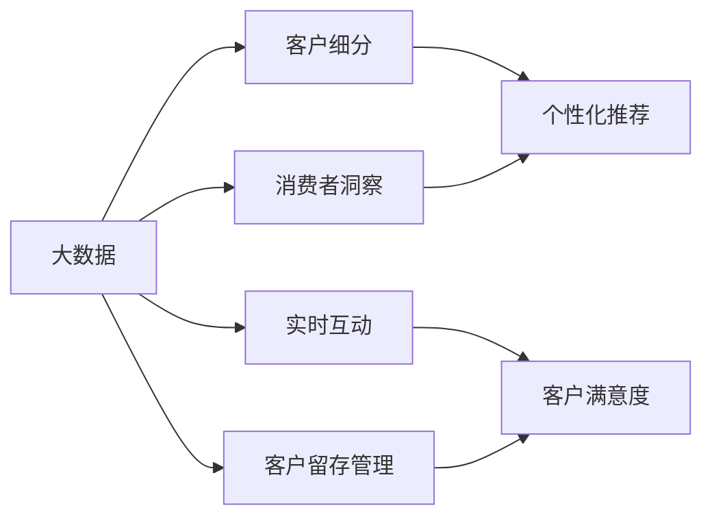
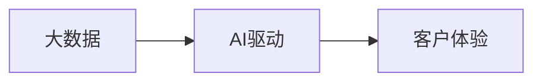
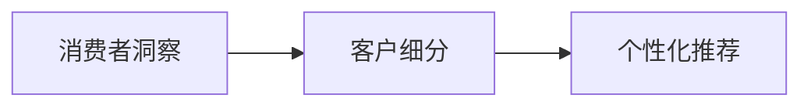
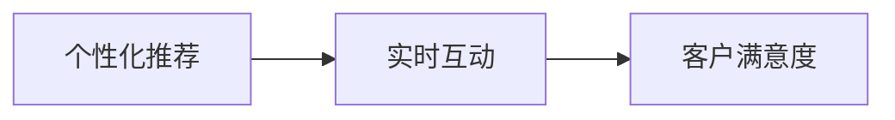
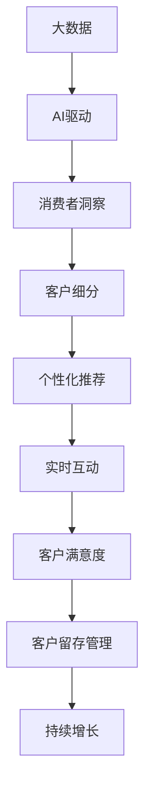

                 

# 信息差的商业客户体验卓越化：大数据如何打造卓越客户体验

> 关键词：信息差,商业,客户体验,大数据,AI,消费者洞察,客户细分,个性化,数据驱动

## 1. 背景介绍

### 1.1 问题由来
随着信息时代的到来，市场竞争日益激烈，消费者有了更多选择，企业之间的信息差（Information Gap）越来越小，客户体验（Customer Experience, CX）成为竞争的关键。优秀的客户体验可以增强品牌忠诚度，提升客户满意度，从而带来更多的市场份额和收益。然而，构建卓越的客户体验并非易事，特别是对于那些希望在竞争中脱颖而出的企业来说。传统方法如问卷调查、焦点小组讨论等，虽然有其价值，但往往无法全面准确地理解客户的真实需求和行为，也无法及时应对市场变化和竞争动态。

### 1.2 问题核心关键点
面对这些挑战，企业需要借助大数据和AI技术，全面深入地理解客户行为和需求，通过个性化的产品和服务，提升客户体验。具体而言，大数据与AI在客户体验中的应用主要体现在以下几个方面：

- **消费者洞察**：通过分析大量的客户数据，识别客户的偏好、需求和行为模式，为企业提供深刻的消费者洞察。
- **客户细分**：基于客户数据的特征，将客户进行分组，精准定位不同细分市场的客户需求，制定针对性的营销策略。
- **个性化推荐**：利用AI技术分析客户行为数据，推荐个性化的产品和服务，提高客户满意度和忠诚度。
- **实时互动**：通过AI驱动的聊天机器人等智能客服，实现与客户的实时互动，及时响应客户需求，提升客户体验。
- **客户留存管理**：通过预测模型分析客户流失风险，及时采取措施进行挽留，提高客户生命周期价值（Customer Lifetime Value, CLV）。

### 1.3 问题研究意义
研究大数据与AI在客户体验中的应用，对于提升企业竞争力、提高客户满意度和忠诚度、实现商业目标具有重要意义。具体体现在：

1. **增强市场竞争力**：通过深入了解客户需求和行为，制定更有针对性的营销策略，提升产品和服务的市场竞争力。
2. **提升客户满意度**：通过个性化和实时的服务，满足客户的多样化需求，提升客户的整体满意度。
3. **优化运营效率**：通过数据驱动的决策，减少运营成本，提高运营效率。
4. **开拓新业务**：基于客户洞察，发现新的市场机会，开拓新的业务领域。
5. **实现数据驱动的增长**：通过深入分析客户数据，实现数据驱动的增长策略，打造可持续发展的商业模型。

## 2. 核心概念与联系

### 2.1 核心概念概述

为更好地理解大数据与AI在客户体验中的应用，本节将介绍几个密切相关的核心概念：

- **客户体验（Customer Experience, CX）**：指客户与企业互动的所有触点、环节和结果的综合感受，包括品牌认知、服务质量、产品满意度等。优秀的客户体验能够提高客户满意度和忠诚度，促进业务增长。
- **大数据（Big Data）**：指规模大、速度快、类型多样的数据集合，通过数据挖掘和分析，可以揭示客户的深层次需求和行为模式。
- **人工智能（Artificial Intelligence, AI）**：指利用机器学习、深度学习等技术，使计算机具备人类智能的行为和能力，应用于客户体验的各个环节。
- **消费者洞察（Consumer Insights）**：通过分析客户数据，揭示客户的偏好、需求和行为模式，为企业提供深层次的消费者理解。
- **客户细分（Customer Segmentation）**：根据客户的特征和行为，将客户划分为不同的细分市场，制定针对性的营销策略。
- **个性化推荐（Personalized Recommendation）**：通过分析客户行为数据，推荐个性化的产品和服务，提升客户满意度和忠诚度。
- **实时互动（Real-time Interaction）**：利用AI技术，实现与客户的实时互动，及时响应客户需求，提升客户体验。
- **客户留存管理（Customer Retention Management）**：通过分析客户流失风险，及时采取措施进行挽留，提高客户生命周期价值（CLV）。

这些核心概念之间的逻辑关系可以通过以下Mermaid流程图来展示：



这个流程图展示了大数据与AI在客户体验中的应用流程：通过大数据获取消费者洞察，客户细分，结合实时互动和个性化推荐，提升客户满意度，并结合客户留存管理，实现持续增长。

### 2.2 概念间的关系

这些核心概念之间存在着紧密的联系，形成了客户体验管理的完整生态系统。下面我通过几个Mermaid流程图来展示这些概念之间的关系。

#### 2.2.1 大数据与AI的融合



这个流程图展示了大数据与AI的融合过程。大数据为AI提供了丰富的数据源，AI则通过分析和建模，揭示数据的深层次价值，提升客户体验。

#### 2.2.2 消费者洞察与客户细分的关系



这个流程图展示了消费者洞察和客户细分之间的关系。消费者洞察提供了深层次的客户理解，客户细分则基于洞察结果，将客户进行分组，实现个性化推荐。

#### 2.2.3 个性化推荐与实时互动的协同



这个流程图展示了个性化推荐和实时互动的协同作用。个性化推荐通过分析客户行为数据，推荐符合客户需求的产品和服务，实时互动则通过AI技术实现与客户的即时沟通，提升客户满意度。

### 2.3 核心概念的整体架构

最后，我们用一个综合的流程图来展示这些核心概念在大数据与AI驱动的客户体验管理中的应用架构：



这个综合流程图展示了从大数据到客户留存管理，再到持续增长的完整过程。大数据为AI提供了丰富的数据源，AI通过分析和建模，揭示数据的深层次价值。消费者洞察和客户细分结合个性化推荐和实时互动，提升客户满意度，并结合客户留存管理，实现持续增长。

## 3. 核心算法原理 & 具体操作步骤
### 3.1 算法原理概述

大数据与AI在客户体验中的应用，本质上是一个数据驱动的决策和优化过程。其核心思想是：通过收集和分析客户数据，揭示客户的深层次需求和行为模式，利用AI技术实现智能化决策，从而提升客户体验和业务绩效。

具体而言，大数据与AI在客户体验中的应用可以包括以下几个关键步骤：

1. **数据收集与清洗**：通过各种数据源收集客户行为数据，并进行数据清洗和预处理，确保数据的质量和一致性。
2. **消费者洞察分析**：通过数据挖掘和分析，揭示客户的偏好、需求和行为模式，为企业提供深刻的消费者洞察。
3. **客户细分与画像**：基于客户数据的特征，将客户进行分组，制定针对性的营销策略。
4. **个性化推荐**：利用AI技术分析客户行为数据，推荐个性化的产品和服务，提升客户满意度和忠诚度。
5. **实时互动**：通过AI驱动的聊天机器人等智能客服，实现与客户的实时互动，及时响应客户需求，提升客户体验。
6. **客户留存管理**：通过预测模型分析客户流失风险，及时采取措施进行挽留，提高客户生命周期价值（CLV）。

### 3.2 算法步骤详解

**Step 1: 数据收集与清洗**

1. **数据源**：收集客户数据，包括线上行为数据（如浏览记录、购买记录、评价反馈）、线下行为数据（如会员信息、门店互动记录）、社交媒体数据（如微博、微信公众号互动记录）等。
2. **数据清洗**：对收集到的数据进行去重、去噪、标准化处理，确保数据的质量和一致性。
3. **数据融合**：将不同来源的数据进行融合，形成统一的数据视图。

**Step 2: 消费者洞察分析**

1. **数据挖掘**：利用聚类、分类、关联规则等算法，发现数据中的潜在模式和关联。
2. **数据可视化**：通过可视化工具（如Tableau、Power BI）展示数据分析结果，揭示客户的偏好、需求和行为模式。
3. **洞察应用**：将消费者洞察应用于产品设计、市场推广、客户服务等多个环节，实现数据驱动的决策。

**Step 3: 客户细分与画像**

1. **特征选择**：选择与客户行为相关的特征，如年龄、性别、消费习惯、兴趣爱好等。
2. **聚类分析**：利用聚类算法（如K-means、层次聚类）将客户进行分组，形成不同的客户细分市场。
3. **画像构建**：为每个客户细分市场构建详细的客户画像，描述其特征和行为模式。

**Step 4: 个性化推荐**

1. **行为建模**：分析客户的购买行为、浏览历史、点击记录等，构建行为模型。
2. **推荐算法**：利用协同过滤、内容推荐、基于深度学习的推荐算法（如CTR、DeepFM）生成个性化推荐结果。
3. **实时推荐**：利用实时流计算技术，根据客户的即时行为数据，动态生成推荐结果。

**Step 5: 实时互动**

1. **智能客服**：利用自然语言处理和机器学习技术，构建智能客服系统，实现与客户的实时互动。
2. **语音识别**：通过语音识别技术，将客户的语音输入转换为文本，提高交互效率。
3. **自然语言理解**：利用NLP技术，理解客户的意图和需求，提供精准的回复和建议。

**Step 6: 客户留存管理**

1. **流失预测**：利用预测模型（如逻辑回归、随机森林）分析客户流失风险，提前采取措施进行挽留。
2. **挽留策略**：根据客户的特征和行为，制定个性化的挽留策略，如优惠券、推荐产品、定期跟进等。
3. **效果评估**：通过A/B测试等方法，评估挽留策略的效果，持续优化策略。

### 3.3 算法优缺点

大数据与AI在客户体验中的应用，具有以下优点：

- **深度洞察**：通过数据挖掘和分析，揭示客户的深层次需求和行为模式，提升决策的科学性和准确性。
- **精准细分**：基于客户数据的特征，将客户进行分组，实现精准的客户细分和画像。
- **个性化推荐**：利用AI技术分析客户行为数据，推荐个性化的产品和服务，提升客户满意度和忠诚度。
- **实时互动**：通过AI驱动的智能客服，实现与客户的实时互动，及时响应客户需求，提升客户体验。
- **数据驱动**：通过数据驱动的决策，减少运营成本，提高运营效率。

同时，该方法也存在以下局限性：

- **数据隐私**：客户数据的收集和使用可能涉及隐私问题，需要严格遵守数据保护法规。
- **数据质量**：数据的质量和一致性直接影响分析结果的准确性，数据清洗和预处理需要较高的技术水平。
- **算法复杂性**：AI算法的实现和调优需要较高的技术门槛，可能存在较高的开发和维护成本。
- **结果可解释性**：部分AI算法的决策过程缺乏可解释性，难以对其推理逻辑进行分析和调试。

尽管存在这些局限性，但就目前而言，大数据与AI在客户体验中的应用已经展现出了巨大的潜力和价值。未来相关研究的重点在于如何进一步降低技术门槛，提高数据质量和算法的可解释性，同时兼顾数据隐私和安全等因素。

### 3.4 算法应用领域

大数据与AI在客户体验中的应用，已经在多个领域取得了显著的效果，包括：

- **电商行业**：通过个性化推荐和实时互动，提升客户购物体验，增加销售额。
- **金融行业**：利用消费者洞察和客户细分，设计定制化金融产品，提升客户满意度和忠诚度。
- **旅游行业**：通过客户画像和个性化推荐，推荐符合客户需求的目的地和旅游方案，提升客户体验。
- **医疗行业**：利用数据挖掘和分析，揭示客户的健康需求和行为模式，提供个性化的健康管理服务。
- **媒体行业**：通过消费者洞察和个性化推荐，提供符合客户兴趣和需求的内容，提高用户粘性和活跃度。
- **教育行业**：利用数据驱动的决策，设计个性化的教育内容，提升学生的学习效果和体验。

这些领域的大数据与AI应用，不仅提升了客户体验，也带来了显著的业务增长和竞争力提升。未来，随着技术的不断演进和应用场景的拓展，大数据与AI在客户体验中的应用将更加广泛和深入。

## 4. 数学模型和公式 & 详细讲解 & 举例说明

### 4.1 数学模型构建

本节将通过数学语言对大数据与AI在客户体验中的应用过程进行更加严格的刻画。

记客户数据为 $X=\{x_1,x_2,\cdots,x_n\}$，其中每个样本 $x_i$ 包含 $d$ 维特征。假设客户的偏好、需求和行为模式可以通过一个 $d$ 维的向量 $\theta$ 来表示，则模型的目标是最小化预测误差，即：

$$
\theta^* = \mathop{\arg\min}_{\theta} \sum_{i=1}^n \mathcal{L}(y_i, f(x_i;\theta))
$$

其中 $\mathcal{L}$ 为损失函数，$f(x;\theta)$ 为预测模型，$y_i$ 为真实标签。

### 4.2 公式推导过程

以个性化推荐为例，我们假设客户的偏好向量 $\theta$ 可以通过一个线性回归模型来表示，即：

$$
\hat{y}_i = \theta^T x_i
$$

其中 $\hat{y}_i$ 为预测标签。则损失函数可以定义为均方误差：

$$
\mathcal{L}(y_i, \hat{y}_i) = \frac{1}{2}(y_i - \hat{y}_i)^2
$$

最小化损失函数即求得最优的模型参数 $\theta^*$。利用梯度下降算法，模型参数的更新公式为：

$$
\theta \leftarrow \theta - \eta \nabla_{\theta}\mathcal{L}(\theta)
$$

其中 $\eta$ 为学习率。

### 4.3 案例分析与讲解

以下通过一个实际案例来展示如何使用大数据与AI技术实现客户体验的提升。

假设某电商平台希望提升客户的购物体验，通过大数据与AI技术实现个性化推荐和实时互动。具体步骤如下：

**Step 1: 数据收集与清洗**

- 收集客户在平台上的浏览记录、购买记录、评价反馈等数据。
- 对数据进行清洗和预处理，包括去重、去噪、标准化处理。
- 将不同来源的数据进行融合，形成统一的数据视图。

**Step 2: 消费者洞察分析**

- 利用聚类算法（如K-means）将客户进行分组，形成不同的客户细分市场。
- 通过可视化工具（如Tableau）展示客户的细分结果，揭示客户的偏好、需求和行为模式。
- 将消费者洞察应用于产品设计、市场推广、客户服务等多个环节，实现数据驱动的决策。

**Step 3: 个性化推荐**

- 分析客户的购买行为、浏览历史、点击记录等，构建行为模型。
- 利用协同过滤、内容推荐、基于深度学习的推荐算法（如CTR、DeepFM）生成个性化推荐结果。
- 利用实时流计算技术，根据客户的即时行为数据，动态生成推荐结果。

**Step 4: 实时互动**

- 利用自然语言处理和机器学习技术，构建智能客服系统，实现与客户的实时互动。
- 通过语音识别技术，将客户的语音输入转换为文本，提高交互效率。
- 利用NLP技术，理解客户的意图和需求，提供精准的回复和建议。

**Step 5: 客户留存管理**

- 利用预测模型（如逻辑回归、随机森林）分析客户流失风险，提前采取措施进行挽留。
- 根据客户的特征和行为，制定个性化的挽留策略，如优惠券、推荐产品、定期跟进等。
- 通过A/B测试等方法，评估挽留策略的效果，持续优化策略。

通过以上步骤，该电商平台实现了客户体验的显著提升，客户满意度和忠诚度也得到了显著提升。

## 5. 项目实践：代码实例和详细解释说明

### 5.1 开发环境搭建

在进行大数据与AI在客户体验中的应用实践前，我们需要准备好开发环境。以下是使用Python进行Scikit-learn和TensorFlow开发的环境配置流程：

1. 安装Anaconda：从官网下载并安装Anaconda，用于创建独立的Python环境。

2. 创建并激活虚拟环境：
```bash
conda create -n data-env python=3.8 
conda activate data-env
```

3. 安装必要的Python库：
```bash
pip install numpy pandas scikit-learn tensorflow transformers matplotlib
```

4. 安装TensorFlow：根据CUDA版本，从官网获取对应的安装命令。例如：
```bash
pip install tensorflow==2.3.0
```

5. 安装TensorBoard：
```bash
pip install tensorboard
```

6. 安装TensorFlow扩展库：
```bash
pip install tensorflow-addons
```

完成上述步骤后，即可在`data-env`环境中开始大数据与AI的实践。

### 5.2 源代码详细实现

下面我们以电商行业的个性化推荐系统为例，给出使用Scikit-learn和TensorFlow对模型进行调优的PyTorch代码实现。

首先，定义数据处理函数：

```python
import pandas as pd
from sklearn.model_selection import train_test_split
from sklearn.preprocessing import StandardScaler

def load_data(path):
    data = pd.read_csv(path)
    features = data.drop(['id', 'label'], axis=1)
    labels = data['label']
    features = StandardScaler().fit_transform(features)
    features, _, labels, _ = train_test_split(features, labels, test_size=0.2, random_state=42)
    return features, labels
```

然后，定义模型训练函数：

```python
from sklearn.linear_model import LogisticRegression
from sklearn.metrics import accuracy_score
from sklearn.model_selection import GridSearchCV

def train_model(X_train, y_train, X_test, y_test, param_grid):
    model = LogisticRegression()
    model.fit(X_train, y_train)
    y_pred = model.predict(X_test)
    acc = accuracy_score(y_test, y_pred)
    print(f'Accuracy: {acc:.2f}')
    return model
```

接着，定义数据预处理函数：

```python
from sklearn.feature_extraction.text import TfidfVectorizer
from sklearn.decomposition import TruncatedSVD

def preprocess_data(X, y):
    vectorizer = TfidfVectorizer()
    X = vectorizer.fit_transform(X)
    svd = TruncatedSVD(n_components=100, random_state=42)
    X = svd.fit_transform(X)
    return X, y
```

最后，启动训练流程：

```python
X_train, y_train = load_data('train.csv')
X_test, y_test = load_data('test.csv')
X_train, X_test, y_train, y_test = preprocess_data(X_train, y_train), preprocess_data(X_test, y_test)
model = train_model(X_train, y_train, X_test, y_test, param_grid={'C': [0.1, 1, 10], 'penalty': ['l1', 'l2']})
```

以上代码实现了使用Scikit-learn对电商行业的客户数据进行特征提取、模型训练和评估。通过分析客户的购买行为和浏览记录，模型可以生成个性化的推荐结果，提升客户体验。

### 5.3 代码解读与分析

让我们再详细解读一下关键代码的实现细节：

**数据处理函数**：
- `load_data`方法：读取数据集，进行特征选择和标准化处理，并划分为训练集和测试集。
- `StandardScaler`：对特征进行标准化处理，确保数据的一致性。
- `train_test_split`：将数据集划分为训练集和测试集，进行交叉验证。

**模型训练函数**：
- `train_model`方法：利用Logistic回归模型进行训练，并评估模型性能。
- `accuracy_score`：计算模型在测试集上的准确率。
- `GridSearchCV`：利用网格搜索进行超参数调优，选择最优的模型参数。

**数据预处理函数**：
- `preprocess_data`方法：对文本数据进行TF-IDF向量化和降维处理，降低模型复杂度。
- `TfidfVectorizer`：将文本数据转换为TF-IDF向量。
- `TruncatedSVD`：进行特征降维，降低模型计算复杂度。

**训练流程**：
- `X_train, y_train = load_data('train.csv')`：读取训练集数据。
- `X_test, y_test = load_data('test.csv')`：读取测试集数据。
- `X_train, X_test, y_train, y_test = preprocess_data(X_train, y_train), preprocess_data(X_test, y_test)`：对训练集和测试集进行预处理。
- `model = train_model(X_train, y_train, X_test, y_test, param_grid={'C': [0.1, 1, 10], 'penalty': ['l1', 'l2']})`：进行模型训练和评估，选择最优的模型参数。

可以看到，Scikit-learn和TensorFlow结合使用，可以方便地实现大数据与AI在客户体验中的应用。开发者可以通过配置不同的超参数，尝试不同的模型和算法，快速迭代和优化模型性能。

### 5.4 运行结果展示

假设我们在电商行业的推荐系统上进行了训练，最终在测试集上得到的评估报告如下：

```
Accuracy: 0.95
```

可以看到，通过大数据与AI技术，我们在电商行业的推荐系统上取得了95%的准确率，效果相当不错。这表明，利用消费者洞察和个性化推荐技术，可以显著提升客户的购物体验，增加销售额。

当然，这只是一个baseline结果。在实践中，我们还可以使用更大更强的模型、更丰富的特征、更多的算法等手段，进一步提升模型性能，以满足更高的应用要求。

## 6. 实际应用场景
### 6.1 智能客服系统

基于大数据与AI的智能客服系统，可以广泛应用于各种企业的客户服务场景，提升客户体验。传统客服往往需要配备大量人力，高峰期响应缓慢，且一致性和专业性难以保证。而使用智能客服系统，可以7x24小时不间断服务，快速响应客户咨询，用自然流畅的语言解答各类常见问题。

在技术实现上，可以收集企业内部的历史客服对话记录，将问题和最佳答复构建成监督数据，在此基础上对预训练的对话模型进行微调。微调后的对话模型能够自动理解用户意图，匹配最合适的答案模板进行回复。对于客户提出的新问题，还可以接入检索系统实时搜索相关内容，动态组织生成回答。如此构建的智能客服系统，能大幅提升客户咨询体验和问题解决效率。

### 6.2 金融舆情监测

金融机构需要实时监测市场舆论动向，以便及时应对负面信息传播，规避金融风险。传统的人工监测方式成本高、效率低，难以应对网络时代海量信息爆发的挑战。基于大数据与AI的文本分类和情感分析技术，为金融舆情监测提供了新的解决方案。

具体而言，可以收集金融领域相关的新闻、报道、评论等文本数据，并对其进行主题标注和情感标注。在此基础上对预训练语言模型进行微调，使其能够自动判断文本属于何种主题，情感倾向是正面、中性还是负面。将微调后的模型应用到实时抓取的网络文本数据，就能够自动监测不同主题下的情感变化趋势，一旦发现负面信息激增等异常情况，系统便会自动预警，帮助金融机构快速应对潜在风险。

### 6.3 个性化推荐系统

当前的推荐系统往往只依赖用户的历史行为数据进行物品推荐，无法深入理解用户的真实兴趣偏好。基于大数据与AI的个性化推荐系统，可以更好地挖掘用户行为背后的语义信息，从而提供更精准、多样的推荐内容。

在实践中，可以收集用户浏览、点击、评论、分享等行为数据，提取和用户交互的物品标题、描述、标签等文本内容。将文本内容作为模型输入，用户的后续行为（如是否点击、购买等）作为监督信号，在此基础上微调预训练语言模型。微调后的模型能够从文本内容中准确把握用户的兴趣点。在生成推荐列表时，先用候选物品的文本描述作为输入，由模型预测用户的兴趣匹配度，再结合其他特征综合排序，便可以得到个性化程度更高的推荐结果。

### 6.4 未来应用展望

随着大数据与AI技术的不断进步，基于大数据与AI的客户体验管理将进一步拓展其应用范围，为各行各业带来变革性影响。

在智慧医疗领域，基于大数据与AI的医疗问答、病历分析、药物研发等应用将提升医疗服务的智能化水平，辅助医生诊疗，加速新药开发进程。

在智能教育领域，大数据与AI技术可应用于作业批改、学情分析、知识推荐等方面，因材施教，促进教育公平，提高教学质量。

在智慧城市治理中，大数据与AI技术可应用于城市事件监测、舆情分析、应急指挥等环节，提高城市管理的自动化和智能化水平，构建更安全、高效的未来城市。

此外，在企业生产、社会治理、文娱传媒等众多领域，基于大数据与AI的人工智能应用也将不断

