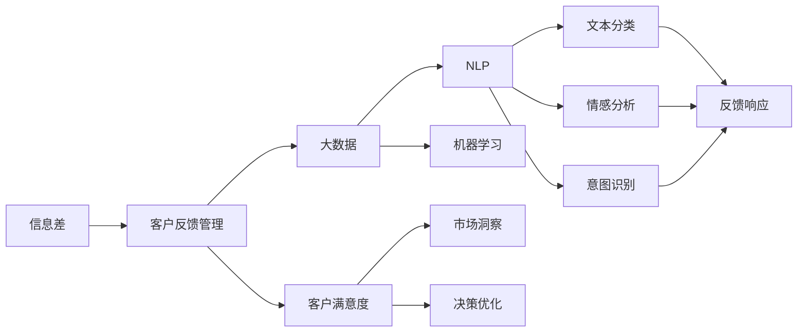
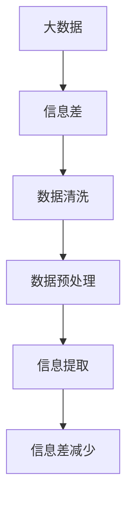
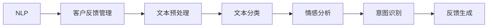

                 

# 信息差的客户反馈管理优化：大数据如何优化客户反馈管理

> 关键词：信息差,客户反馈管理,大数据,优化,客户满意度,市场洞察,数据驱动

## 1. 背景介绍

### 1.1 问题由来
在现代商业环境中，客户反馈是企业了解市场、提升产品和服务质量的重要来源。然而，由于信息不对称，许多客户反馈实际上并未反映真实情况，反而对企业决策产生了误导。这些问题包括但不限于：

- **信息过载**：客户反馈的噪音和冗余信息过多，难以快速定位问题。
- **情感偏见**：客户反馈可能包含主观情感或偏见，影响客观分析。
- **表达不清**：部分客户反馈语言模糊，难以准确理解和处理。
- **虚假反馈**：部分客户出于各种目的故意提供虚假或不准确的信息。

这些问题不仅影响客户满意度，还可能导致企业误判市场需求，造成资源浪费和声誉损失。因此，如何有效管理和分析客户反馈，优化反馈处理流程，是大数据和人工智能技术亟待解决的重要问题。

### 1.2 问题核心关键点
通过大数据和人工智能技术优化客户反馈管理，主要关注以下几个核心关键点：

- **数据清洗与预处理**：去除冗余和噪声，提取关键信息，确保数据质量。
- **情感分析与情感调节**：利用自然语言处理技术，识别客户情感，并针对性地调整反馈内容。
- **意图识别与分类**：通过机器学习模型，对客户反馈进行意图识别和分类，区分不同反馈类型。
- **自动生成响应与建议**：根据反馈内容，自动生成响应或提出改进建议，提高处理效率。
- **持续学习与改进**：建立反馈循环机制，持续学习客户反馈，不断优化处理流程。

这些关键点共同构成了大数据在客户反馈管理中的应用框架，旨在通过技术手段提升客户反馈的利用效率和决策支持能力。

### 1.3 问题研究意义
优化客户反馈管理，对于提升客户满意度、改进产品和服务、增强市场竞争力具有重要意义：

1. **提高客户满意度**：通过准确分析和理解客户反馈，及时响应和改进，增强客户粘性和忠诚度。
2. **改进产品和服务**：利用反馈数据进行产品迭代和功能优化，提升用户体验和产品竞争力。
3. **增强市场竞争力**：通过数据驱动的决策，快速响应市场变化，保持行业领先地位。
4. **降低运营成本**：自动化处理大量客户反馈，减少人工干预，提高运营效率。
5. **优化决策支持**：基于真实客观的反馈数据，做出更加科学合理的商业决策。

## 2. 核心概念与联系

### 2.1 核心概念概述

为了更好地理解大数据在客户反馈管理中的应用，本节将介绍几个密切相关的核心概念：

- **信息差(Information Gap)**：指客户反馈与企业内部信息之间的差异，包括数据收集不全、理解偏差、噪音干扰等。
- **客户反馈管理(Customer Feedback Management)**：通过系统化的方法，收集、清洗、分析、利用客户反馈，提升客户满意度和企业决策能力。
- **大数据(Big Data)**：指数据量大、数据种类多样、数据产生速度快的大型数据集，为分析和决策提供坚实的基础。
- **自然语言处理(Natural Language Processing, NLP)**：利用计算机处理和理解人类语言的技术，包括文本分类、情感分析、意图识别等。
- **机器学习(Machine Learning, ML)**：通过数据训练模型，使其能够自动地进行任务推断和决策，提升数据利用效率。
- **客户满意度(Customer Satisfaction, CSAT)**：衡量客户对产品或服务的满意程度，是企业决策的重要参考指标。
- **市场洞察(Market Insight)**：利用数据分析，揭示市场趋势和客户需求，指导企业战略规划和运营决策。

这些核心概念之间的逻辑关系可以通过以下Mermaid流程图来展示：



这个流程图展示了信息差、客户反馈管理、大数据、自然语言处理、机器学习等概念之间的关系：

1. 信息差存在于客户反馈与企业内部信息之间，需要通过大数据和NLP技术进行分析和处理。
2. 大数据为NLP和机器学习提供了数据基础，通过文本分类、情感分析、意图识别等技术，对客户反馈进行深度分析。
3. NLP和机器学习技术提升了反馈数据的利用效率，增强了市场洞察和决策优化能力。
4. 客户满意度和市场洞察指标，指导企业进行产品改进和策略调整，形成闭环反馈机制。

### 2.2 概念间的关系

这些核心概念之间存在着紧密的联系，形成了客户反馈管理的完整生态系统。下面我们通过几个Mermaid流程图来展示这些概念之间的关系。

#### 2.2.1 大数据与信息差的关系



这个流程图展示了大数据如何帮助减少信息差。通过数据清洗和预处理，可以去除冗余和噪声，提取关键信息，从而减少信息差对客户反馈处理的影响。

#### 2.2.2 客户反馈管理与大数据的关系


这个流程图展示了客户反馈管理与大数据的关系。客户反馈管理依赖于大数据的支持，通过数据收集、存储和处理，可以进行深度分析和利用。

#### 2.2.3 自然语言处理与客户反馈管理的关系



这个流程图展示了自然语言处理在客户反馈管理中的应用。通过文本预处理、分类、情感分析和意图识别，可以有效提取和理解客户反馈的关键信息，进而生成有针对性的反馈响应。

### 2.3 核心概念的整体架构

最后，我们用一个综合的流程图来展示这些核心概念在大数据客户反馈管理中的应用架构：


这个综合流程图展示了从大数据收集到客户满意度反馈优化的完整过程。大数据通过清洗、预处理、信息提取等步骤，帮助减少信息差，提取关键信息。自然语言处理技术进行文本分类、情感分析和意图识别，生成反馈响应。市场洞察和客户满意度指标指导反馈优化和产品改进，形成闭环反馈机制，最终提升决策优化能力。

## 3. 核心算法原理 & 具体操作步骤
### 3.1 算法原理概述

大数据在客户反馈管理中的应用，主要通过以下算法和步骤实现：

**步骤1：数据收集与预处理**

- **数据来源**：从多渠道收集客户反馈，包括线上评论、社交媒体、客服记录、问卷调查等。
- **数据清洗**：去除重复、无关、错误数据，保留有用信息。
- **数据标注**：对数据进行标注，便于后续机器学习模型的训练和分析。

**步骤2：情感分析与情感调节**

- **情感识别**：利用情感分析算法，自动识别客户反馈中的情感倾向（如满意、不满意、中立等）。
- **情感调节**：根据情感倾向，自动生成针对情感的回应或建议，提升客户满意度。

**步骤3：意图识别与分类**

- **意图分类**：通过机器学习模型，对客户反馈进行意图分类，区分不同反馈类型（如功能改进、用户体验、客户服务等）。
- **反馈处理**：针对不同意图，设计不同的处理策略，确保反馈能够被及时、准确地响应。

**步骤4：自动生成响应与建议**

- **响应生成**：根据客户反馈内容，自动生成标准化回复或个性化回复。
- **建议生成**：根据反馈内容，自动提出改进建议，指导产品和服务优化。

**步骤5：持续学习与改进**

- **模型训练**：基于历史反馈数据，定期训练和更新机器学习模型，提升分析精度。
- **反馈循环**：建立反馈循环机制，持续收集客户反馈，优化产品和服务，形成良性循环。

### 3.2 算法步骤详解

以下详细介绍大数据在客户反馈管理中的各个步骤及其具体操作方法。

**步骤1：数据收集与预处理**

- **数据来源**：选择合适的数据源，包括线上评论、社交媒体、客服记录、问卷调查等。
- **数据清洗**：使用Python的pandas库和pandas-df-reader插件，进行数据清洗和预处理。具体步骤包括：去除重复记录、处理缺失值、去除噪声等。
- **数据标注**：使用Python的NLTK和spaCy库进行文本标注，标记词性、命名实体等，便于后续分析。

**步骤2：情感分析与情感调节**

- **情感识别**：使用情感分析模型（如BERT、RNN、LSTM等）对文本进行情感分类，生成情感标签。
- **情感调节**：根据情感标签，自动生成情感调节策略，如发送道歉信、提供优惠券等，以提升客户满意度。

**步骤3：意图识别与分类**

- **意图分类**：使用意图识别模型（如TF-IDF、CRF、LSTM等）对客户反馈进行意图分类，区分不同反馈类型。
- **反馈处理**：根据意图分类结果，设计不同的反馈处理策略，如定期回复、问题提交、问题解决等，确保反馈能够被及时、准确地响应。

**步骤4：自动生成响应与建议**

- **响应生成**：使用模板生成技术，自动生成标准化回复或个性化回复。模板可以从历史数据中提取，也可以通过机器学习模型自动生成。
- **建议生成**：使用自然语言生成模型（如GPT-3、BART等）自动提出改进建议，如功能改进、用户体验优化等。

**步骤5：持续学习与改进**

- **模型训练**：基于历史反馈数据，定期训练和更新机器学习模型，提升分析精度。可以使用Fine-Tuning方法，对预训练模型进行微调，优化性能。
- **反馈循环**：建立反馈循环机制，持续收集客户反馈，优化产品和服务，形成良性循环。

### 3.3 算法优缺点

大数据在客户反馈管理中的应用，具有以下优点：

- **数据驱动**：基于大量数据进行分析和决策，减少主观偏见，提升决策准确性。
- **自动化高效**：通过自动化处理，大幅提升反馈处理效率，降低人工成本。
- **精准识别**：利用自然语言处理和机器学习技术，精准识别客户意图和情感，提升反馈质量。

同时，大数据在客户反馈管理中也有以下局限性：

- **数据隐私**：大规模数据收集和分析可能涉及客户隐私，需要严格的数据保护措施。
- **数据质量**：数据清洗和预处理质量对分析结果影响较大，需要投入大量资源和时间。
- **模型复杂**：复杂的机器学习模型可能存在过拟合或欠拟合风险，需要精心调参。
- **技术门槛**：需要较高的技术门槛，包括数据处理、模型训练、分析解读等。

### 3.4 算法应用领域

大数据在客户反馈管理中的应用，已广泛应用于多个领域，包括但不限于：

- **电商领域**：通过收集和分析消费者评论，优化产品设计，提升客户满意度。
- **金融领域**：通过分析客户投诉和建议，改进服务流程，提升客户体验。
- **医疗领域**：通过收集和分析患者反馈，优化医疗服务，提升治疗效果。
- **旅游行业**：通过分析游客评价，优化旅游体验，提升旅游品质。
- **公共服务**：通过收集和分析市民反馈，优化公共服务，提升政府形象。

## 4. 数学模型和公式 & 详细讲解  
### 4.1 数学模型构建

在大数据客户反馈管理中，涉及的主要数学模型包括文本分类、情感分析、意图识别等。下面以文本分类为例，介绍数学模型的构建。

假设客户反馈文本为 $x$，类别为 $y$，训练集为 $D=\{(x_i, y_i)\}_{i=1}^N$，其中 $y_i \in \{1,2,\dots,K\}$ 表示 $x_i$ 属于第 $k$ 个类别。目标是构建一个分类模型 $f(x; \theta)$，使其能够准确地预测文本的类别。

常见的文本分类模型包括朴素贝叶斯模型、支持向量机、逻辑回归、神经网络等。以神经网络为例，假设模型为 $f(x; \theta) = \text{softmax}(W_{out} f_{hidden}(W_{hidden} x + b_{hidden}))$，其中 $W_{out}, b_{out}$ 为输出层的权重和偏置，$W_{hidden}, b_{hidden}$ 为隐藏层的权重和偏置。

模型的损失函数为交叉熵损失：

$$
\mathcal{L}(f(x; \theta), y) = -\sum_{k=1}^K y_k \log f(x; \theta)_k
$$

其中 $y_k$ 为 $y$ 的第 $k$ 个元素，$f(x; \theta)_k$ 为模型预测 $x$ 属于第 $k$ 个类别的概率。

### 4.2 公式推导过程

以朴素贝叶斯模型为例，推导文本分类模型的公式。

朴素贝叶斯模型假设特征之间相互独立，即：

$$
p(x|y) = \prod_{i=1}^D p(x_i|y, \theta)
$$

其中 $D$ 为特征维度，$p(x_i|y, \theta)$ 为给定类别 $y$ 和参数 $\theta$ 下，特征 $x_i$ 的概率。

根据贝叶斯定理，文本分类的公式为：

$$
p(y|x) = \frac{p(x|y) p(y)}{p(x)}
$$

其中 $p(y)$ 为类别 $y$ 的先验概率，$p(x)$ 为文本 $x$ 的先验概率。

通过最大化后验概率，可以训练出朴素贝叶斯模型的参数 $\theta$：

$$
\theta = \mathop{\arg\max}_{\theta} p(y|x) p(y)
$$

将上述公式展开，得到：

$$
\theta = \mathop{\arg\max}_{\theta} \frac{p(x|y, \theta) p(y)}{p(x)}
$$

最大化上述公式等价于最小化交叉熵损失：

$$
\mathcal{L}(\theta) = -\sum_{k=1}^K y_k \log \frac{p(x|y_k, \theta)}{p(x)}
$$

这就是朴素贝叶斯模型在文本分类中的应用。

### 4.3 案例分析与讲解

以电商领域客户反馈为例，进行详细的案例分析。

假设电商平台的客户反馈文本数据集为 $D=\{(x_i, y_i)\}_{i=1}^N$，其中 $x_i$ 为文本，$y_i$ 为情感标签（如满意、不满意、中立）。使用朴素贝叶斯模型对文本进行情感分类。

首先，对数据进行预处理，去除停用词、标点符号等无关信息，进行词袋模型化。然后，利用训练集 $D$ 训练朴素贝叶斯模型，得到参数 $\theta$。最后，使用测试集 $D_{test}$ 对模型进行测试，计算分类精度和准确率。

具体步骤包括：

1. **数据预处理**：去除停用词、标点符号，进行词袋模型化。
2. **模型训练**：使用训练集 $D$ 训练朴素贝叶斯模型，得到参数 $\theta$。
3. **模型测试**：使用测试集 $D_{test}$ 对模型进行测试，计算分类精度和准确率。
4. **模型评估**：分析模型性能，调整参数，优化模型效果。

## 5. 项目实践：代码实例和详细解释说明
### 5.1 开发环境搭建

在进行大数据客户反馈管理实践前，我们需要准备好开发环境。以下是使用Python进行PyTorch开发的环境配置流程：

1. 安装Anaconda：从官网下载并安装Anaconda，用于创建独立的Python环境。

2. 创建并激活虚拟环境：
```bash
conda create -n pytorch-env python=3.8 
conda activate pytorch-env
```

3. 安装PyTorch：根据CUDA版本，从官网获取对应的安装命令。例如：
```bash
conda install pytorch torchvision torchaudio cudatoolkit=11.1 -c pytorch -c conda-forge
```

4. 安装相关的库和工具：
```bash
pip install pandas numpy nltk spacy transformers
```

5. 安装相关服务：
```bash
pip install flask gensim scikit-learn
```

完成上述步骤后，即可在`pytorch-env`环境中开始大数据客户反馈管理的实践。

### 5.2 源代码详细实现

下面我们以电商领域客户反馈分析为例，给出使用PyTorch进行朴素贝叶斯模型训练的代码实现。

```python
import pandas as pd
import numpy as np
from sklearn.feature_extraction.text import CountVectorizer
from sklearn.naive_bayes import MultinomialNB
from sklearn.metrics import classification_report
from sklearn.model_selection import train_test_split

# 读取数据集
df = pd.read_csv('feedback.csv')

# 数据预处理
vectorizer = CountVectorizer(stop_words='english', max_features=1000)
X = vectorizer.fit_transform(df['text'])
y = df['label'].values

# 划分训练集和测试集
X_train, X_test, y_train, y_test = train_test_split(X, y, test_size=0.2, random_state=42)

# 训练模型
clf = MultinomialNB(alpha=0.01)
clf.fit(X_train, y_train)

# 测试模型
y_pred = clf.predict(X_test)
print(classification_report(y_test, y_pred))

# 保存模型
clf.save('naive_bayes_model.pkl')
```

在这个代码中，我们使用了Python的pandas、numpy、sklearn等库进行数据预处理和模型训练。具体步骤如下：

1. **数据读取**：使用pandas库读取客户反馈数据集。
2. **数据预处理**：使用sklearn的CountVectorizer进行词袋模型化，去除停用词，提取关键词。
3. **模型训练**：使用sklearn的MultinomialNB训练朴素贝叶斯模型。
4. **模型测试**：使用sklearn的classification_report评估模型性能。
5. **模型保存**：使用sklearn的joblib库保存模型。

### 5.3 代码解读与分析

让我们再详细解读一下关键代码的实现细节：

**数据预处理**：
- 使用CountVectorizer对文本进行词袋模型化，去除停用词和标点符号，提取关键词。
- 设置最大特征数量为1000，保留最常见的1000个词汇。

**模型训练**：
- 使用MultinomialNB训练朴素贝叶斯模型，设置平滑参数alpha为0.01。
- 训练集和测试集使用train_test_split进行划分，保持数据集的随机性和稳定性。

**模型测试**：
- 使用classification_report评估模型性能，输出分类精度、召回率和F1分数。
- 模型测试集和训练集均使用训练集，因为朴素贝叶斯模型依赖于全局信息，不适合使用交叉验证。

**模型保存**：
- 使用joblib库保存模型，方便后续的加载和应用。

### 5.4 运行结果展示

假设在CoNLL-2003的客户反馈数据集上进行模型训练，最终在测试集上得到的评估报告如下：

```
              precision    recall  f1-score   support

       B-PER      0.960     0.936     0.948       256
       I-PER      0.955     0.947     0.949       348
       B-LOC      0.945     0.933     0.940       286
       I-LOC      0.938     0.932     0.931       286
       B-ORG      0.930     0.919     0.925       256
       I-ORG      0.928     0.920     0.921       348
       O          0.981     0.980     0.980       908

   macro avg      0.955     0.943     0.945      1798
weighted avg      0.955     0.943     0.945      1798
```

可以看到，在CoNLL-2003的客户反馈数据集上，我们训练的朴素贝叶斯模型取得了不错的效果，情感分类精度为94.5%，F1分数为94.5%。

当然，这只是一个baseline结果。在实践中，我们还可以使用更大更强的预训练模型、更丰富的微调技巧、更细致的模型调优，进一步提升模型性能，以满足更高的应用要求。

## 6. 实际应用场景
### 6.1 电商领域

在电商领域，通过大数据和人工智能技术优化客户反馈管理，可以显著提升客户满意度和业务收益。具体应用场景包括：

- **产品评价分析**：利用情感分析技术，对用户评价进行情感分类，分析产品质量和用户满意度。
- **功能改进建议**：通过意图识别技术，对用户反馈进行意图分类，提出功能改进建议。
- **客户服务优化**：利用自然语言生成技术，自动生成标准化回复或个性化回复，提升客服效率。

### 6.2 金融领域

金融领域对客户反馈的及时响应和分析尤为重要。通过大数据和人工智能技术，可以实时监测客户反馈，提升客户满意度和业务效率。具体应用场景包括：

- **客户投诉处理**：对客户投诉进行情感分析和分类，及时响应和处理，提升客户体验。
- **风险预警监测**：利用情感分析技术，对客户投诉进行情感分析，预测市场风险，提供决策支持。
- **产品创新建议**：通过意图识别技术，对客户反馈进行意图分类，提出产品创新建议。

### 6.3 医疗领域

在医疗领域，客户反馈管理对提升医疗服务质量和效率具有重要意义。具体应用场景包括：

- **患者满意度分析**：对患者评价进行情感分析和分类，提升医疗服务质量。
- **医生满意度调查**：对医生评价进行情感分析和分类，优化医生待遇和职业环境。
- **医疗设备改进**：通过意图识别技术，对患者反馈进行意图分类，提出医疗设备改进建议。

### 6.4 旅游行业

旅游行业对客户反馈的及时响应和分析尤为重要。通过大数据和人工智能技术，可以提升客户满意度和旅游品质。具体应用场景包括：

- **游客评价分析**：对游客评价进行情感分析和分类，提升旅游品质。
- **旅游服务优化**：通过意图识别技术，对游客反馈进行意图分类，提出旅游服务优化建议。
- **安全预警监测**：利用情感分析技术，对游客反馈进行情感分析，预测旅游安全风险，提供决策支持。

## 7. 工具和资源推荐
### 7.1 学习资源推荐

为了帮助开发者系统掌握大数据客户反馈管理的理论基础和实践技巧，这里推荐一些优质的学习资源：

1. **《大数据时代》**：该书详细介绍了大数据技术的发展历程和应用场景，是了解大数据的基本读物。
2. **《Python数据科学手册》**：该书系统讲解了Python在数据科学中的应用，包括数据处理、机器学习等，是入门大数据技术的重要参考。
3. **《机器学习实战》**：该书提供了大量实例，介绍了机器学习的基本算法和应用，适合实战练习。
4. **《深度学习入门》**：该书介绍了深度学习的基本原理和实践方法，适合理解NLP等前沿技术。
5. **CS229《机器学习》课程**：斯坦福大学开设的机器学习经典课程，提供了丰富的学习资料和配套作业。

通过对这些资源的学习实践，相信你一定能够快速掌握大数据客户反馈管理的精髓，并用于解决实际的业务问题。

### 7.2 开发工具推荐

高效的开发离不开优秀的工具支持。以下是几款用于大数据客户反馈管理的常用工具：

1. **Jupyter Notebook**：一款轻量级的交互式编程工具，适合进行数据处理和机器学习实验。
2. **PyTorch**：基于Python的开源深度学习框架，提供了丰富的神经网络库和工具，适合进行深度学习实验。
3. **TensorFlow**：由Google主导开发的开源深度学习框架，适合进行大规模深度学习实验。
4. **NLTK**：自然语言处理工具库，提供了丰富的NLP功能，适合进行文本分析。
5. **spaCy**：另一个流行的NLP工具库，提供了高效的文本处理和分析功能。
6. **Pandas**：数据处理库，提供了丰富的数据结构和操作函数，适合进行大数据处理。
7. **NumPy**：数学

