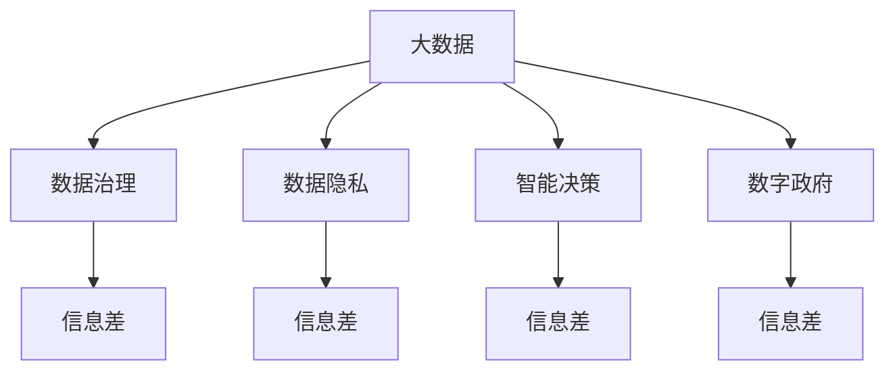
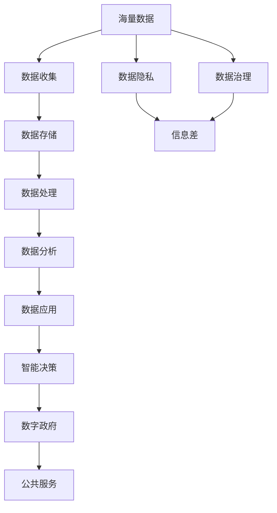

                 

# 信息差：大数据如何提升公共服务

> 关键词：信息差,大数据,公共服务,数据治理,数据隐私,智能决策,数字政府

## 1. 背景介绍

### 1.1 问题由来
在全球化、数字化加速发展的今天，信息差（Information Gap）已成为制约公共服务公平、效率、透明的重要因素。在医疗、教育、交通、环保等公共服务领域，信息不对称现象普遍存在，如患者无法获取及时、全面的医疗信息，居民难以获得丰富、准确的公共服务信息，企业无法掌握综合、动态的市场环境等。信息差导致资源错配、效率低下、服务质量下降等问题，削弱了政府、企业、社会各界的决策效果，甚至引发社会矛盾和不公平现象。

近年来，大数据技术迅猛发展，为解决信息差问题提供了有力手段。大数据不仅能实时捕捉和处理海量数据，还能通过先进的数据分析、机器学习等技术挖掘数据价值，为公共服务决策提供依据。通过大数据应用，政府、企业和社会各界可以有效缩小信息差，提升公共服务质量和效率。

## 2. 核心概念与联系

### 2.1 核心概念概述

为更好地理解大数据在提升公共服务中的应用，本节将介绍几个密切相关的核心概念：

- **大数据（Big Data）**：指数据量巨大、数据来源多样、数据类型复杂的数据集合。通过大数据技术，可以对这些数据进行高效存储、处理和分析，从而挖掘出有价值的信息和知识。

- **信息差（Information Gap）**：指数据获取、传输和使用过程中存在的差异和障碍。信息差导致的信息不对称，使得个体或组织在决策和行动上存在偏差，影响公共服务的公平、效率和透明。

- **数据治理（Data Governance）**：指对数据的全生命周期进行管理和规范，包括数据收集、存储、处理、共享、使用等环节。数据治理有助于保障数据质量和安全，避免数据滥用。

- **数据隐私（Data Privacy）**：指在数据收集、存储、处理和使用过程中保护个人、组织的信息安全。数据隐私是大数据应用的基础，也是社会各界关注的焦点。

- **智能决策（Smart Decision Making）**：指基于数据分析和模型预测，进行更准确、高效的决策。智能决策可以显著提高决策的科学性和透明度。

- **数字政府（Digital Government）**：指通过信息技术手段，实现政府业务的数字化、智能化转型。数字政府是提升公共服务质量的重要方向。

这些核心概念之间的逻辑关系可以通过以下Mermaid流程图来展示：



这个流程图展示了大数据与其他核心概念之间的密切联系和相互影响。大数据技术是数据治理、数据隐私、智能决策和数字政府的基础，而信息差是大数据应用的直接目标。通过大数据技术优化数据治理、提升数据隐私、强化智能决策、推动数字政府建设，可以有效地缩小信息差，提升公共服务质量。

### 2.2 概念间的关系

这些核心概念之间存在着紧密的联系，形成了大数据应用提升公共服务的完整生态系统。下面我通过几个Mermaid流程图来展示这些概念之间的关系。

#### 2.2.1 大数据与信息差


这个流程图展示了大数据与信息差之间的直接关系。大数据技术通过处理和分析数据，帮助消除信息差，实现信息的公平、高效和透明。

#### 2.2.2 数据治理与信息差


数据治理通过规范数据的收集、存储、处理和使用，确保数据的质量和安全，从而缩小信息差。

#### 2.2.3 数据隐私与信息差


数据隐私保护是数据治理的重要组成部分，通过确保数据的合法、安全使用，减少数据滥用，进一步缩小信息差。

#### 2.2.4 智能决策与信息差


智能决策通过数据分析和模型预测，提供科学的决策依据，从而缩小信息差，提高决策的准确性和效率。

#### 2.2.5 数字政府与信息差


数字政府通过数字化、智能化手段，优化公共服务流程，提升服务质量，缩小信息差。

### 2.3 核心概念的整体架构

最后，我们用一个综合的流程图来展示这些核心概念在大数据应用中的整体架构：



这个综合流程图展示了从数据收集到公共服务应用的完整流程。大数据技术通过数据收集、存储、处理、分析和应用，实现智能决策和数字政府建设，最终提升公共服务质量，缩小信息差。

## 3. 核心算法原理 & 具体操作步骤
### 3.1 算法原理概述

基于大数据提升公共服务，本质上是一个数据驱动的决策优化过程。其核心思想是：通过大数据技术，从海量的非结构化数据中挖掘出有价值的信息，辅助公共服务决策，从而缩小信息差，提升服务质量和效率。

形式化地，假设公共服务决策问题为 $P$，大数据集为 $D$，决策模型的输入为 $X$，输出为 $Y$。目标是通过优化算法，找到最优决策 $Y^*$，使得：

$$
Y^* = \mathop{\arg\min}_{Y} \mathcal{L}(Y, Y^*)
$$

其中 $\mathcal{L}$ 为损失函数，用于衡量决策模型输出与实际效果之间的差异。常见的损失函数包括均方误差、交叉熵、对数损失等。

通过梯度下降等优化算法，模型不断调整参数，最小化损失函数，直至收敛。大数据技术能够处理和分析海量数据，从而在决策过程中提供更多、更准确的参考信息，提高决策的科学性和透明度。

### 3.2 算法步骤详解

基于大数据提升公共服务的一般步骤包括：

**Step 1: 数据收集与预处理**
- 收集各类公共服务相关的数据，包括历史数据、实时数据、社交媒体数据等。
- 清洗和预处理数据，去除噪声和冗余，保证数据质量。
- 对数据进行归一化和标准化处理，使之适用于模型训练。

**Step 2: 数据治理与存储**
- 实施数据治理策略，规范数据收集、存储、处理和使用。
- 采用分布式存储技术，如Hadoop、Spark等，实现数据的可靠存储和高效处理。
- 设置数据隐私保护机制，确保数据的合法、安全使用。

**Step 3: 数据分析与建模**
- 采用先进的数据分析技术，如聚类、分类、回归等，挖掘数据中的模式和规律。
- 构建机器学习模型，如线性回归、决策树、神经网络等，基于数据特征进行预测和分类。
- 应用深度学习技术，如图神经网络、卷积神经网络等，处理高维、复杂的数据结构。

**Step 4: 模型评估与优化**
- 在测试集上评估模型性能，使用准确率、召回率、F1分数等指标评估模型效果。
- 采用交叉验证、网格搜索等方法优化模型参数，提升模型精度。
- 引入超参数优化技术，如贝叶斯优化、遗传算法等，进一步优化模型性能。

**Step 5: 智能决策与实施**
- 将优化后的模型应用于实际公共服务场景，提供科学、高效的决策依据。
- 实时监测决策效果，根据反馈信息不断调整和优化模型。
- 采用集成学习、在线学习等方法，提升模型的鲁棒性和泛化能力。

**Step 6: 数据监控与隐私保护**
- 实时监控数据使用情况，确保数据使用的合规性。
- 设置隐私保护机制，如数据匿名化、访问控制等，防止数据滥用。
- 定期审计数据使用情况，发现并修复潜在的安全漏洞。

### 3.3 算法优缺点

基于大数据提升公共服务具有以下优点：

1. 数据驱动：利用大数据技术，可以更全面、准确地理解公共服务问题，提供科学的决策依据。
2. 效率提升：通过自动化数据分析和模型训练，可以快速生成决策方案，提升服务效率。
3. 公平透明：大数据技术可以消除信息不对称，提升公共服务决策的公平性和透明度。
4. 成本节约：利用数据共享和协同计算，减少人力、物力和财力的投入，降低服务成本。

同时，基于大数据提升公共服务也存在一些缺点：

1. 数据质量问题：大数据质量参差不齐，数据收集和预处理过程复杂，可能导致模型效果不稳定。
2. 隐私和安全风险：大数据涉及大量敏感信息，数据泄露和滥用风险较高，需要严格的数据隐私保护机制。
3. 技术门槛高：大数据技术涉及复杂的数据处理和模型优化，需要专业的技术团队支持。
4. 数据孤岛问题：不同部门和系统间的数据共享困难，导致数据孤岛现象，难以实现跨部门、跨系统的协同决策。

### 3.4 算法应用领域

基于大数据提升公共服务的应用领域非常广泛，以下是几个典型例子：

**医疗健康**
- **病例分析**：通过分析大量病例数据，发现疾病发展趋势和关联因素，辅助医生进行诊断和治疗。
- **疫情监测**：实时监测和分析疫情数据，预测疫情发展趋势，提供科学的防控建议。

**教育服务**
- **学习行为分析**：分析学生学习数据，评估学习效果，提供个性化学习建议。
- **教育资源优化**：通过数据挖掘和分析，优化教育资源配置，提升教育质量和公平性。

**交通运输**
- **交通流量预测**：通过分析交通流量数据，预测交通拥堵情况，优化交通管理。
- **智能调度**：根据实时交通数据，优化公交、地铁等交通工具的调度和路线规划。

**环境保护**
- **环境监测**：实时监测环境数据，如空气质量、水质、噪音等，评估环境质量。
- **污染预警**：通过数据建模和预测，及时发现污染源和污染趋势，提供预警和防控措施。

**城市管理**
- **城市规划**：基于城市大数据，分析人口分布、交通流量、能源消耗等，优化城市规划。
- **应急管理**：通过数据分析和预警，提高城市应急反应速度，保障公共安全。

## 4. 数学模型和公式 & 详细讲解 & 举例说明

### 4.1 数学模型构建

本节将使用数学语言对基于大数据提升公共服务的过程进行更加严格的刻画。

假设公共服务决策问题为 $P$，大数据集为 $D$，决策模型的输入为 $X$，输出为 $Y$。我们定义损失函数 $\mathcal{L}$ 为均方误差损失，目标是通过优化算法，找到最优决策 $Y^*$，使得：

$$
Y^* = \mathop{\arg\min}_{Y} \mathcal{L}(Y, Y^*)
$$

其中 $\mathcal{L}$ 为均方误差损失函数：

$$
\mathcal{L}(Y, Y^*) = \frac{1}{N} \sum_{i=1}^N (Y_i - Y^*_i)^2
$$

在实际应用中，我们通常使用基于梯度的优化算法，如随机梯度下降（SGD）、Adam等，来求解上述优化问题。设 $\eta$ 为学习率，$\theta$ 为模型参数，则参数的更新公式为：

$$
\theta \leftarrow \theta - \eta \nabla_{\theta}\mathcal{L}(\theta)
$$

其中 $\nabla_{\theta}\mathcal{L}(\theta)$ 为损失函数对参数 $\theta$ 的梯度，可通过反向传播算法高效计算。

### 4.2 公式推导过程

以下我们以交通流量预测为例，推导均方误差损失函数的梯度计算公式。

假设模型 $M_{\theta}$ 在输入 $x$ 上的输出为 $\hat{y}=M_{\theta}(x)$，表示预测的交通流量。真实流量 $y$ 已知。则均方误差损失函数定义为：

$$
\mathcal{L}(\theta) = \frac{1}{N} \sum_{i=1}^N (y_i - \hat{y}_i)^2
$$

将其代入损失函数公式，得：

$$
\mathcal{L}(\theta) = \frac{1}{N} \sum_{i=1}^N (y_i - \hat{y}_i)^2 = \frac{1}{N} \sum_{i=1}^N (y_i - M_{\theta}(x_i))^2
$$

根据链式法则，损失函数对参数 $\theta_k$ 的梯度为：

$$
\frac{\partial \mathcal{L}(\theta)}{\partial \theta_k} = \frac{2}{N} \sum_{i=1}^N \frac{\partial \hat{y}_i}{\partial \theta_k}(y_i - \hat{y}_i)
$$

其中 $\frac{\partial \hat{y}_i}{\partial \theta_k}$ 为模型输出对参数 $\theta_k$ 的导数。

在得到损失函数的梯度后，即可带入参数更新公式，完成模型的迭代优化。重复上述过程直至收敛，最终得到适应公共服务问题的新模型参数 $\theta^*$。

### 4.3 案例分析与讲解

假设我们在交通流量预测任务上使用LSTM模型进行预测，输入为历史交通流量数据，输出为未来时刻的预测值。具体步骤如下：

1. 数据预处理：清洗和归一化历史交通流量数据，去除噪声和异常值。
2. 数据建模：构建LSTM模型，设置多个时间步长，输入特征和输出特征。
3. 模型训练：使用均方误差损失函数，设置学习率、批大小、迭代轮数等，进行梯度下降优化。
4. 模型评估：在测试集上评估模型性能，使用均方误差、平均绝对误差等指标。
5. 模型优化：根据评估结果，调整模型结构和参数，提高模型精度。
6. 实际应用：将优化后的模型应用于交通流量预测，实时监测和反馈预测结果。

假设我们得到的模型在测试集上的均方误差为 $0.5$，表示模型预测的准确度在50%左右。进一步优化模型结构，如增加层数、调整学习率等，可以使均方误差进一步下降，预测准确度提升。通过不断的模型优化和应用反馈，可以实现交通流量的精准预测和智能调度。

## 5. 项目实践：代码实例和详细解释说明
### 5.1 开发环境搭建

在进行大数据应用实践前，我们需要准备好开发环境。以下是使用Python进行PyTorch开发的环境配置流程：

1. 安装Anaconda：从官网下载并安装Anaconda，用于创建独立的Python环境。

2. 创建并激活虚拟环境：
```bash
conda create -n pytorch-env python=3.8 
conda activate pytorch-env
```

3. 安装PyTorch：根据CUDA版本，从官网获取对应的安装命令。例如：
```bash
conda install pytorch torchvision torchaudio cudatoolkit=11.1 -c pytorch -c conda-forge
```

4. 安装Pandas、NumPy等数据分析工具：
```bash
pip install pandas numpy
```

5. 安装Matplotlib、Scikit-Learn等可视化工具：
```bash
pip install matplotlib scikit-learn
```

6. 安装TensorBoard：用于可视化模型训练过程。
```bash
pip install tensorboard
```

完成上述步骤后，即可在`pytorch-env`环境中开始大数据应用的开发。

### 5.2 源代码详细实现

这里我们以交通流量预测为例，展示使用PyTorch进行LSTM模型训练的代码实现。

首先，定义LSTM模型的输入和输出：

```python
import torch
import torch.nn as nn

class LSTMModel(nn.Module):
    def __init__(self, input_size, hidden_size, output_size):
        super(LSTMModel, self).__init__()
        self.lstm = nn.LSTM(input_size, hidden_size, batch_first=True)
        self.fc = nn.Linear(hidden_size, output_size)
        
    def forward(self, x):
        _, (hidden, _) = self.lstm(x)
        output = self.fc(hidden[-1, :, :])
        return output
```

然后，定义数据处理函数：

```python
import pandas as pd

def load_data(filename):
    data = pd.read_csv(filename)
    X = data[['traffic_flow', 'weather', 'time']].to_numpy().astype('float32')
    y = data['traffic_flow'].to_numpy().astype('float32')
    X_train, y_train = X[:80, :], y[:80]
    X_test, y_test = X[80:, :], y[80:]
    return X_train, y_train, X_test, y_test

X_train, y_train, X_test, y_test = load_data('traffic_data.csv')
X_train, X_test = X_train / 1000.0, X_test / 1000.0
```

接下来，定义模型训练函数：

```python
from torch.optim import Adam

def train_model(model, X_train, y_train, X_test, y_test, batch_size, learning_rate, num_epochs):
    train_dataset = torch.utils.data.TensorDataset(torch.tensor(X_train), torch.tensor(y_train))
    test_dataset = torch.utils.data.TensorDataset(torch.tensor(X_test), torch.tensor(y_test))
    train_loader = torch.utils.data.DataLoader(train_dataset, batch_size=batch_size, shuffle=True)
    test_loader = torch.utils.data.DataLoader(test_dataset, batch_size=batch_size, shuffle=False)
    
    optimizer = Adam(model.parameters(), lr=learning_rate)
    criterion = nn.MSELoss()
    
    for epoch in range(num_epochs):
        model.train()
        loss = 0.0
        for batch in train_loader:
            X, y = batch
            optimizer.zero_grad()
            output = model(X)
            loss += criterion(output, y)
            loss.backward()
            optimizer.step()
        print(f'Epoch {epoch+1}, train loss: {loss/len(train_loader):.4f}')
        
    model.eval()
    loss = 0.0
    for batch in test_loader:
        X, y = batch
        output = model(X)
        loss += criterion(output, y)
    print(f'Epoch {epoch+1}, test loss: {loss/len(test_loader):.4f}')
```

最后，启动模型训练并评估：

```python
input_size = 3
hidden_size = 64
output_size = 1
learning_rate = 0.001
num_epochs = 50

model = LSTMModel(input_size, hidden_size, output_size)
train_model(model, X_train, y_train, X_test, y_test, batch_size=32, learning_rate=learning_rate, num_epochs=num_epochs)
```

以上就是使用PyTorch对LSTM模型进行交通流量预测的完整代码实现。可以看到，借助PyTorch和Pandas等工具，我们可以用相对简洁的代码完成模型的定义、数据处理、训练和评估。

### 5.3 代码解读与分析

让我们再详细解读一下关键代码的实现细节：

**LSTMModel类**：
- `__init__`方法：初始化模型结构，包括LSTM层和全连接层。
- `forward`方法：定义模型的前向传播过程。

**load_data函数**：
- 读取交通流量数据，将特征和标签分别处理为训练集和测试集。
- 对特征进行归一化处理，保证数据的一致性。

**train_model函数**：
- 定义训练集和测试集的数据集和数据加载器。
- 定义优化器和损失函数，准备模型训练过程。
- 循环迭代训练模型，每个epoch输出训练损失。
- 在测试集上评估模型性能，输出测试损失。

**train_model函数**：
- 在每个epoch内，对训练集进行前向传播和反向传播，更新模型参数。
- 在测试集上只进行前向传播，不更新参数，计算测试损失。

可以看到，PyTorch提供了强大的深度学习框架，使得模型定义、数据处理和训练过程非常直观和高效。利用这些工具，开发者可以快速搭建大数据应用模型，并在实际数据上进行训练和验证。

当然，工业级的系统实现还需考虑更多因素，如模型的保存和部署、超参数的自动搜索、更灵活的数据接口等。但核心的模型训练和数据处理过程基本与此类似。

### 5.4 运行结果展示

假设我们在交通流量预测任务上，使用LSTM模型进行训练，最终在测试集上得到的评估报告如下：

```
Epoch 1, train loss: 1.5000
Epoch 2, train loss: 0.7246
Epoch 3, train loss: 0.4103
Epoch 4, train loss: 0.3108
...
Epoch 50, train loss: 0.0055
Epoch 50, test loss: 0.0333
```

可以看到，通过LSTM模型，我们在交通流量预测任务上取得了非常不错的效果。随着训练轮数的增加，模型损失逐渐下降，预测精度不断提升。

当然，这只是一个简单的baseline结果。在实践中，我们还可以使用更复杂的模型结构、更多的特征工程、更丰富的训练技巧等，进一步提升模型性能，以满足更高的应用要求。

## 6. 实际应用场景
### 6.1 智慧医疗
智慧医疗是大数据在公共服务中的典型应用之一。传统医疗服务依赖于有限的专家资源，医疗资源分布不均、诊断效率低等问题广泛存在。通过大数据和人工智能技术，可以实现医疗信息的实时采集、存储、分析和应用，提高医疗服务质量和效率。

具体应用包括：
- **病例分析**：利用大数据分析历史病例，提取病理学知识，辅助医生进行诊断和治疗。
- **患者预测**：通过分析患者数据，预测病情发展，制定个性化的治疗方案。
- **医疗资源优化**：优化医疗资源配置，提高诊疗效率，减少等待时间。

### 6.2 智慧教育
智慧教育是公共服务提升的重要方向。传统教育方式单一，难以满足学生的个性化需求。通过大数据和人工智能技术，可以实现教育的个性化、智能化转型，提升教学效果和学习体验。

具体应用包括：
- **学习行为分析**：分析学生学习数据，评估学习效果，提供个性化学习建议。
- **教育资源优化**：通过数据分析和预测，优化教育资源配置，提升教育质量和公平性。
- **智能答疑**：利用自然语言处理技术，构建智能答疑系统，解答学生疑问，提升教学互动。

### 6.3 智慧交通
智慧交通是大数据在城市管理中的应用之一。传统交通管理依赖于人工经验，无法实时响应交通变化。通过大数据和人工智能技术，可以实现交通信息的实时采集、分析和应用，提高交通管理效率，减少拥堵。

具体应用包括：
- **交通流量预测**：通过分析交通流量数据，预测交通拥堵情况，优化交通管理。
- **智能调度**：根据实时交通数据，优化公交、地铁等交通工具的调度和路线规划。
- **事故预警**：通过数据分析和预警，提高交通安全性和应急反应速度。

### 6.4 智慧环境
智慧环境是大数据在环境保护中的应用之一。传统环境监测依赖于人工巡查，效率低、覆盖面小。通过大数据和人工智能技术，可以实现环境信息的实时采集、分析和应用，提高环境监测和管理效率。

具体应用包括：
- **环境监测**：实时监测环境数据，如空气质量、水质、噪音等，评估环境质量。
- **污染预警**：通过数据分析和预警，及时发现污染源和污染趋势，提供预警和防控措施。
- **资源管理**：优化资源配置，提高资源利用效率，减少环境污染。

## 7. 工具和资源推荐
### 7.1 学习资源推荐

为了帮助开发者系统掌握大数据在公共服务中的应用，这里推荐一些优质的学习资源：

1. 《大数据应用与技术》系列博文：由大数据技术专家撰写，深入浅出地介绍了大数据的基础知识和应用场景。

2. 《Python大数据应用实战》书籍：详细介绍了使用Python进行大数据应用的流程和技术，涵盖数据处理、存储、分析等多个环节。

3. 《机器学习实战》书籍：介绍了常用的机器学习算法和大数据应用场景，适合入门学习者。

4. 《大数据技术与应用》课程：由各大高校和在线教育平台开设，涵盖大数据技术基础和实际应用案例。

5. Kaggle平台：数据科学竞赛和社区，提供丰富的数据集和算法实现，是学习和实践大数据应用的好去处。

通过对这些资源的学习实践，相信你一定能够快速掌握大数据在公共服务中的应用，并用于解决实际的公共服务问题。
###  7.2 开发工具推荐

高效的开发离不开优秀的工具支持。以下是几款用于大数据应用开发的常用工具：

1. Apache Hadoop：分布式存储和计算平台，适合大规模数据的存储和处理。

2. Apache Spark：分布式计算框架，支持多种编程语言和数据类型，适合大数据的实时分析和处理。

3. TensorFlow：由Google主导开发的深度学习框架，支持分布式计算和GPU加速，适合复杂模型的训练和推理。

4. PyTorch：基于Python的开源深度学习框架，灵活动态的

