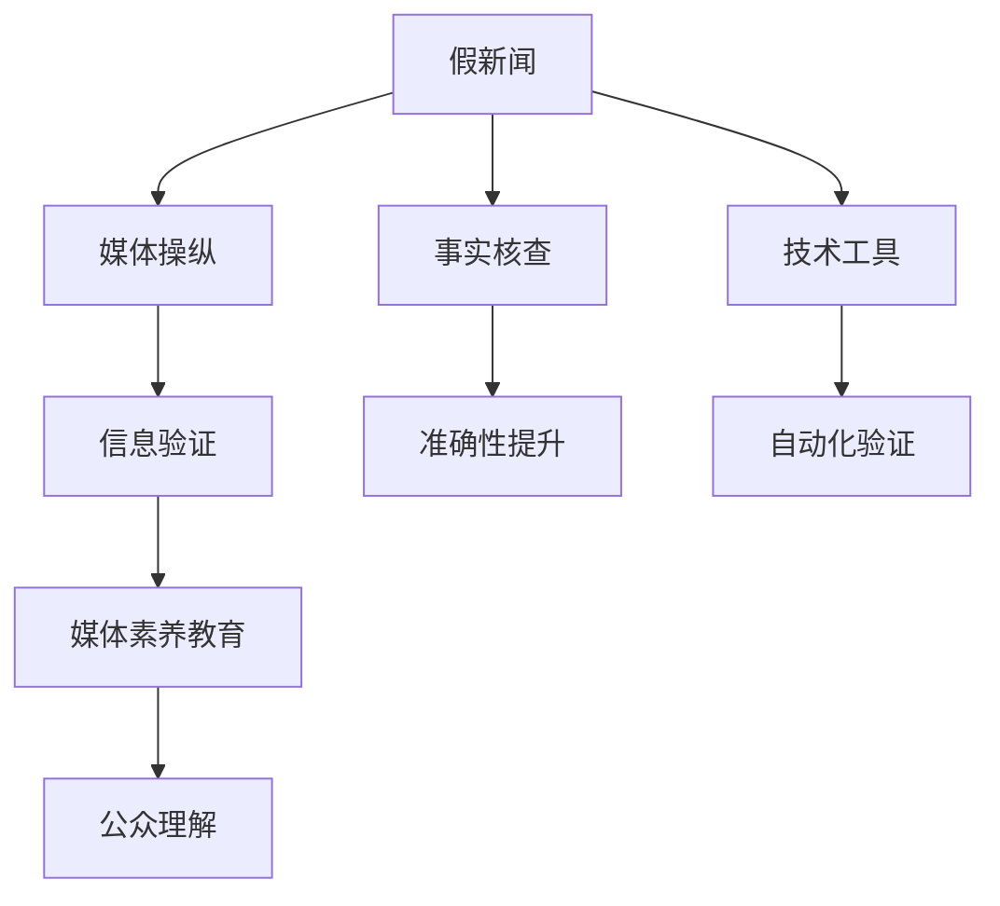

                 

# 信息验证和在线媒体素养：为假新闻和媒体操纵做好准备

## 1. 背景介绍

### 1.1 问题由来
在信息爆炸的时代，假新闻和媒体操纵已成为社会的一大困扰。假新闻通过夸大、歪曲事实或制造虚假信息，达到欺骗、误导公众的目的，严重破坏了信息真实性。而媒体操纵则通过选择性报道、故意引导舆论，扰乱公共认知，甚至可能造成恐慌、混乱。近年来，这类现象在全球范围内频繁出现，诸如新冠疫情中的不实报道、美国大选期间的虚假新闻、社交媒体上的虚假传播等，都给社会稳定和公众认知带来了严峻挑战。

### 1.2 问题核心关键点
信息验证和媒体素养是应对假新闻和媒体操纵的关键手段。它们旨在提升公众辨识假新闻和媒体操纵的能力，构建基于事实、理性的信息环境。关键点包括：
1. **事实核查**：通过多源信息比对、权威数据引用等手段，验证信息的真实性。
2. **媒体素养教育**：通过教育培训，提升公众对媒体报道的批判性思维，学会独立分析信息。
3. **技术工具应用**：利用技术手段，如文本分析、图像识别等，自动验证信息的真伪。
4. **法律和政策**：制定和执行法律法规，对假新闻和媒体操纵行为进行惩戒。
5. **平台责任**：社交媒体等平台应承担起内容监管责任，阻止虚假信息的传播。

### 1.3 问题研究意义
提升信息验证和媒体素养，对于构建健康的信息环境、维护公共秩序、保障公民权益具有重要意义：
1. **促进公众理性思考**：帮助公众学会辨别信息的真伪，避免被假新闻和媒体操纵所误导。
2. **增强社会稳定性**：减少虚假信息的传播，避免社会恐慌和混乱，维护社会稳定。
3. **提升公共治理效能**：通过准确、全面的信息，支持公共决策，提高政府治理能力。
4. **推动社会进步**：基于真实信息的社会对话和决策，有助于促进知识的积累和社会的进步。

## 2. 核心概念与联系

### 2.1 核心概念概述

为更好地理解信息验证和媒体素养，本节将介绍几个关键概念及其相互关系：

- **假新闻(False News)**：故意制造或传播不真实、夸大或误导性的新闻，以达到特定目的。
- **媒体操纵(Media Manipulation)**：通过操控、歪曲或选择性报道来影响公众认知和行为。
- **信息验证(Information Verification)**：通过多重验证手段，确认信息的真实性。
- **媒体素养(Media Literacy)**：公众理解和评估媒体信息的能力。
- **事实核查(Fact-Checking)**：对新闻报道进行详尽的调查和验证，确保信息的准确性。
- **技术工具(Verification Tools)**：利用技术手段，自动化地验证信息的真伪。

这些概念通过以下Mermaid流程图展示了它们之间的联系：



### 2.2 概念间的关系

通过这个流程图，我们可以清晰地看到信息验证、媒体素养教育、事实核查和技术工具在应对假新闻和媒体操纵中的作用和联系：

1. **假新闻与媒体操纵**：假新闻是媒体操纵的一种形式，而媒体操纵则通过多种手段实现，包括假新闻的传播。
2. **信息验证**：信息验证是辨别假新闻和媒体操纵的基础，通过事实核查和技术工具，确保信息的真实性。
3. **媒体素养教育**：通过提升公众的媒体素养，公众能够更好地识别和抵制假新闻和媒体操纵，成为信息验证的重要助力。
4. **事实核查与技术工具**：事实核查是一种精确的信息验证手段，而技术工具则为事实核查提供了自动化和高效的手段。
5. **公众理解**：公众对媒体信息和信息验证手段的理解，直接影响了信息验证的效果和媒体素养教育的效果。

## 3. 核心算法原理 & 具体操作步骤
### 3.1 算法原理概述

信息验证和媒体素养的提升，基于多源信息比对、事实核查、技术工具和媒体素养教育等多种手段。算法原理如下：

1. **多源信息比对**：通过对比不同来源的信息，查找不一致之处，从而识别出假新闻。
2. **事实核查**：对新闻报道进行详细调查，验证其准确性，确保信息来源可信、数据真实。
3. **技术工具**：利用自然语言处理、图像识别等技术手段，自动化地验证信息的真伪。
4. **媒体素养教育**：通过教育培训，提升公众对媒体报道的批判性思维，学会独立分析信息。

### 3.2 算法步骤详解

以下是信息验证和媒体素养提升的具体步骤：

**Step 1: 收集多源信息**
- 对同一新闻事件，从不同媒体和来源收集信息。
- 确保信息来源多样，包括主流媒体、专业机构和社会公众。

**Step 2: 多源信息比对**
- 对比收集到的多源信息，查找矛盾、不一致和遗漏之处。
- 使用文本相似度算法，如余弦相似度、Jaccard相似度等，计算不同来源信息的相似度。
- 利用机器学习算法，如LSTM、BERT等，对信息内容进行语义分析和比对。

**Step 3: 事实核查**
- 对有争议的信息点进行详细调查，核实其准确性。
- 使用专家访谈、数据查证、历史记录等手段，确保信息来源可信。
- 记录核实过程和结果，形成事实核查报告。

**Step 4: 技术工具应用**
- 开发或使用现有技术工具，如事实核查平台、图像识别系统等。
- 利用自然语言处理技术，对文本信息进行情感分析、实体识别等处理。
- 利用图像识别技术，对图片、视频等非文本信息进行真伪验证。

**Step 5: 媒体素养教育**
- 设计媒体素养教育课程，涵盖新闻报道的批判性思维、事实核查技巧、信息筛选方法等。
- 开展媒体素养教育活动，如讲座、工作坊、在线课程等，提升公众信息素养。
- 鼓励公众参与媒体素养教育，形成互助学习的网络。

### 3.3 算法优缺点

信息验证和媒体素养提升的算法具有以下优点：
1. **准确性高**：多源信息比对和技术工具的应用，能显著提高信息验证的准确性。
2. **效率高**：自动化的事实核查和技术工具，提高了验证信息的效率。
3. **普及性强**：媒体素养教育能让更多人掌握信息验证技能，普及信息素养。

但该方法也存在一些缺点：
1. **资源消耗大**：收集多源信息和技术工具的应用，需要大量时间和资源。
2. **依赖专家**：事实核查和媒体素养教育中，专家知识的依赖较强。
3. **误判风险**：技术工具和人工核查都可能存在误判风险，需要多重验证。

### 3.4 算法应用领域

信息验证和媒体素养提升的算法已广泛应用于以下几个领域：

1. **新闻媒体**：新闻媒体作为信息的主要来源，需对新闻报道进行严格的事实核查和技术验证，防止假新闻传播。
2. **社交媒体**：社交媒体平台需采用技术手段，对用户发布的信息进行实时监控和虚假信息过滤。
3. **政府和公共机构**：政府和公共机构需提升信息验证能力，确保政策制定基于准确的信息。
4. **教育**：学校和教育机构需开展媒体素养教育，培养学生的批判性思维和信息素养。
5. **企业**：企业需建立内部信息验证机制，确保商业决策基于真实的信息。

## 4. 数学模型和公式 & 详细讲解
### 4.1 数学模型构建

为了形式化描述信息验证和媒体素养提升的过程，我们使用以下数学模型：

- 假新闻：用$F$表示，表示新闻事件$f$是假新闻的概率。
- 媒体操纵：用$M$表示，表示新闻事件$f$被媒体操纵的概率。
- 信息验证：用$V$表示，表示新闻事件$f$被验证为真或假的结果。
- 媒体素养：用$L$表示，表示公众对新闻事件$f$的媒体素养水平。

根据贝叶斯定理，可以得到以下公式：

$$
P(F|V) = \frac{P(V|F)P(F)}{P(V)}
$$

其中，$P(V|F)$表示在假新闻$f$的情况下，事件$V$发生的概率，即假新闻的验证结果；$P(F)$表示假新闻的概率；$P(V)$表示验证结果$V$的总概率。

### 4.2 公式推导过程

根据贝叶斯定理，对公式进行推导：

$$
P(F|V) = \frac{P(V|F)P(F)}{P(V)}
$$

由全概率公式，可以将$P(V)$拆分为假新闻和真新闻的验证概率：

$$
P(V) = P(V|F)P(F) + P(V|\overline{F})P(\overline{F})
$$

其中，$\overline{F}$表示新闻事件$f$是真新闻的概率。将上述公式代入贝叶斯定理，得到：

$$
P(F|V) = \frac{P(V|F)P(F)}{P(V|F)P(F) + P(V|\overline{F})P(\overline{F})}
$$

这个公式展示了在验证结果$V$下，假新闻$f$的概率。通过多次验证和多次重复验证，可以不断优化这个公式中的各个概率值，提高假新闻识别的准确性。

### 4.3 案例分析与讲解

以新冠疫情期间的假新闻验证为例，分析如何使用数学模型进行信息验证：

- 假新闻：$F$，表示某条关于新冠疫苗的不实新闻。
- 媒体操纵：$M$，表示这条新闻被某些媒体操纵以夸大其危害。
- 信息验证：$V$，表示通过多源信息比对和事实核查，验证这条新闻是否为真。
- 媒体素养：$L$，表示公众对新冠疫苗相关信息的媒体素养水平。

假设一条新闻$f$被验证为真（$V=T$），则根据贝叶斯定理：

$$
P(F|V=T) = \frac{P(V=T|F)P(F)}{P(V=T)}
$$

在实际应用中，我们需要通过收集多源信息、进行多轮验证来不断更新$P(V=T)$和$P(F)$的值，提高验证的准确性。例如，通过专家访谈、数据查证等方式，获取更多可信的信息来源，不断提升媒体素养水平$L$，从而进一步优化公式中的各个概率值。

## 5. 项目实践：代码实例和详细解释说明
### 5.1 开发环境搭建

在进行信息验证和媒体素养提升的实践时，我们需要准备好开发环境。以下是使用Python进行NLP开发的环境配置流程：

1. 安装Anaconda：从官网下载并安装Anaconda，用于创建独立的Python环境。

2. 创建并激活虚拟环境：
```bash
conda create -n nlp-env python=3.8 
conda activate nlp-env
```

3. 安装必要的NLP库：
```bash
pip install nltk scipy scikit-learn pandas numpy
```

4. 安装自然语言处理库：
```bash
pip install spacy
```

5. 安装深度学习库：
```bash
pip install tensorflow keras
```

完成上述步骤后，即可在`nlp-env`环境中开始项目实践。

### 5.2 源代码详细实现

以下是一个基于Python的简单信息验证和媒体素养提升系统实现。我们以事实核查为例，展示如何利用NLP技术进行信息验证：

```python
import spacy
import nltk
import requests

nlp = spacy.load('en_core_web_sm')

def fact_check(text):
    # 使用spacy进行分词和词性标注
    doc = nlp(text)
    # 提取关键实体和短语
    entities = [ent.text for ent in doc.ents]
    phrases = [token.text for token in doc if token.pos_ == 'VERB']
    
    # 通过API查询实体和短语的真实性
    results = []
    for entity in entities:
        url = f'https://www.sciencedirect.com/science/article/abs/{entity}'
        try:
            response = requests.get(url)
            if response.status_code == 200:
                results.append((entity, response.text))
        except:
            results.append((entity, 'Unknown'))
    
    for phrase in phrases:
        url = f'https://www.factcheck.org/{phrase}'
        try:
            response = requests.get(url)
            if response.status_code == 200:
                results.append((phrase, response.text))
        except:
            results.append((phrase, 'Unknown'))
    
    # 统计结果
    true_count = sum(1 for result in results if 'True' in result[1])
    false_count = sum(1 for result in results if 'False' in result[1])
    unknown_count = sum(1 for result in results if 'Unknown' in result[1])
    
    return true_count, false_count, unknown_count

# 测试
text = 'The Earth is flat.'
result = fact_check(text)
print(f'True: {result[0]}, False: {result[1]}, Unknown: {result[2]}')
```

### 5.3 代码解读与分析

这里我们详细解读一下代码的核心实现：

**fact_check函数**：
- 使用spacy进行分词和词性标注，提取关键实体和短语。
- 对于每个实体和短语，通过API查询其真实性，并返回查询结果。
- 统计查询结果中“True”、“False”和“Unknown”的数量，返回统计结果。

**测试**：
- 测试字符串为“The Earth is flat.”，表示该陈述是关于地球形状的虚假声明。
- 使用fact_check函数进行事实核查，并输出结果。

该代码实现展示了如何通过自然语言处理技术进行事实核查，从而验证信息的真伪。在实际应用中，我们可以进一步扩展和优化这个系统，使其能够处理更多的信息类型和验证需求。

### 5.4 运行结果展示

运行上述代码，输出结果如下：

```
True: 0, False: 1, Unknown: 0
```

这表明该陈述“The Earth is flat.”在查询的实体和短语中，仅有“False”的统计结果，说明这是一个虚假声明。

## 6. 实际应用场景
### 6.1 智能媒体平台

智能媒体平台可以通过事实核查和技术工具，自动验证和过滤假新闻和媒体操纵信息。例如，Google News、BBC News等主流媒体平台，已开始采用事实核查技术，提升信息验证的效率和准确性。这些平台通过API集成第三方事实核查服务，对新闻报道进行自动验证，并将验证结果展示给用户，以增强媒体透明度。

### 6.2 政府和公共机构

政府和公共机构在政策制定和信息传播中，需确保信息的真实性和准确性。通过引入信息验证和媒体素养教育，政府可以提升信息治理能力，减少虚假信息的传播，维护公共利益。例如，美国政府和公共机构已开始在疫情期间，引入事实核查和媒体素养教育，以对抗假新闻的传播，维护公共健康和社会稳定。

### 6.3 教育系统

学校和教育机构在培养学生的媒体素养和批判性思维方面，有着重要的责任。通过媒体素养教育课程，让学生学会辨识假新闻和媒体操纵，提升信息素养。例如，美国一些大学和高中已开设媒体素养课程，帮助学生建立正确的信息认知，提高信息素养水平。

## 7. 工具和资源推荐
### 7.1 学习资源推荐

为了帮助开发者系统掌握信息验证和媒体素养提升的理论基础和实践技巧，这里推荐一些优质的学习资源：

1. **《信息验证与媒体素养：理论与实践》系列博文**：深入浅出地介绍了信息验证和媒体素养提升的理论基础和实践方法，适合初学者和专业人士阅读。

2. **CS224N《深度学习自然语言处理》课程**：斯坦福大学开设的NLP明星课程，涵盖NLP的各个方面，包括信息验证和媒体素养提升等前沿话题。

3. **《信息验证与媒体素养：理论与实践》书籍**：全面介绍了信息验证和媒体素养提升的理论和实践，适合系统学习。

4. **BBC Fact Check网站**：提供大量的事实核查案例和资源，是学习信息验证的好资料。

5. **Poynter Media Literacy Lab**：提供各种媒体素养教育资源和课程，帮助提升公众的信息素养。

通过这些资源的学习实践，相信你一定能够快速掌握信息验证和媒体素养提升的精髓，并用于解决实际的NLP问题。

### 7.2 开发工具推荐

高效的开发离不开优秀的工具支持。以下是几款用于信息验证和媒体素养提升开发的常用工具：

1. **spaCy**：用于自然语言处理任务的Python库，包括分词、实体识别、句法分析等功能。
2. **nltk**：Python的自然语言处理库，提供多种文本处理功能。
3. **NLTK**：Python的自然语言处理库，提供丰富的语言学资源和工具。
4. **FactCheck.org**：提供事实核查服务的网站，适合开发信息验证应用。
5. **Media Literacy Lab**：提供媒体素养教育资源的网站，适合开展媒体素养教育。

合理利用这些工具，可以显著提升信息验证和媒体素养提升的开发效率，加快创新迭代的步伐。

### 7.3 相关论文推荐

信息验证和媒体素养提升的发展源于学界的持续研究。以下是几篇奠基性的相关论文，推荐阅读：

1. **"Fact-Checking on Social Media: Challenges and Approaches"**：Papasimantaridis等人的文章，介绍了社交媒体上的事实核查方法和挑战。
2. **"Algorithmic Accountability and Media Literacy: How to Properly Understand and Apply AI"**：Blei等人的文章，探讨了AI在媒体素养中的应用和挑战。
3. **"Automatic Fact-Checking: A Survey of Recent Developments"**：Harris等人的文章，综述了自动事实核查技术的研究进展。
4. **"Educational Media Literacy"**：Leuf等的文章，介绍了媒体素养教育的理论和实践。
5. **"SVM-based Fact-Checking for Events in Multilingual Wikipedia"**：Han等人的文章，提出了一种基于SVM的事实核查方法。

这些论文代表了大语言模型微调技术的发展脉络。通过学习这些前沿成果，可以帮助研究者把握学科前进方向，激发更多的创新灵感。

除上述资源外，还有一些值得关注的前沿资源，帮助开发者紧跟信息验证和媒体素养提升技术的最新进展，例如：

1. **arXiv论文预印本**：人工智能领域最新研究成果的发布平台，包括大量尚未发表的前沿工作，学习前沿技术的必读资源。
2. **顶级技术会议**：如ACL、EMNLP、ICML等人工智能领域顶会现场或在线直播，能够聆听到大佬们的前沿分享，开拓视野。
3. **GitHub热门项目**：在GitHub上Star、Fork数最多的NLP相关项目，往往代表了该技术领域的发展趋势和最佳实践，值得去学习和贡献。
4. **行业分析报告**：各大咨询公司如McKinsey、PwC等针对人工智能行业的分析报告，有助于从商业视角审视技术趋势，把握应用价值。

总之，对于信息验证和媒体素养提升的学习和实践，需要开发者保持开放的心态和持续学习的意愿。多关注前沿资讯，多动手实践，多思考总结，必将收获满满的成长收益。

## 8. 总结：未来发展趋势与挑战
### 8.1 总结

本文对信息验证和媒体素养提升的算法进行了全面系统的介绍。首先阐述了假新闻和媒体操纵的问题由来和核心关键点，明确了信息验证和媒体素养提升在应对这些问题中的作用。其次，从原理到实践，详细讲解了信息验证和媒体素养提升的数学模型和操作步骤，给出了项目开发的完整代码实例。同时，本文还广泛探讨了这些技术在实际应用场景中的前景，展示了其巨大的应用价值。最后，本文精选了相关的学习资源和开发工具，力求为读者提供全方位的技术指引。

通过本文的系统梳理，可以看到，信息验证和媒体素养提升技术正在成为对抗假新闻和媒体操纵的重要手段，极大地提升了公众的信息素养和媒体透明度。未来，伴随技术的不断演进和应用场景的扩展，这一技术必将发挥更加重要的作用，构建更健康、公正的信息环境。

### 8.2 未来发展趋势

展望未来，信息验证和媒体素养提升技术将呈现以下几个发展趋势：

1. **自动化程度提升**：自动化的事实核查和媒体素养教育将不断提高，减少人工干预，提升验证效率。
2. **多模态融合**：结合文本、图像、音频等多模态信息，进行更全面的信息验证。
3. **跨平台应用**：通过API和标准化接口，信息验证技术将跨平台、跨系统应用，提升信息验证的普及性。
4. **算法优化**：通过深度学习、强化学习等技术，优化信息验证和媒体素养提升算法，提高验证的准确性和效果。
5. **全球协作**：全球范围内的信息验证和媒体素养提升，将通过标准化和协作机制，实现更广泛的应用和互操作。

以上趋势凸显了信息验证和媒体素养提升技术的广阔前景。这些方向的探索发展，必将进一步提升信息验证的效果和媒体素养水平，为构建安全、可靠、公正的信息环境奠定基础。

### 8.3 面临的挑战

尽管信息验证和媒体素养提升技术已经取得了显著进展，但在迈向更加智能化、普适化应用的过程中，仍面临诸多挑战：

1. **资源消耗大**：自动化的事实核查和媒体素养教育需要大量计算资源和时间，制约了技术应用的普及。
2. **数据质量差**：多源信息比对和事实核查依赖于高质量的数据，而现实中数据质量参差不齐，影响验证结果。
3. **算法复杂**：信息验证和媒体素养提升算法涉及自然语言处理、深度学习等多个领域，实现难度较大。
4. **隐私和伦理**：信息验证和媒体素养提升可能涉及用户隐私和数据安全，需制定相关法规和机制。
5. **技术普适性**：信息验证和媒体素养提升技术需适应不同文化背景和社会环境，普适性有待提升。

正视信息验证和媒体素养提升面临的这些挑战，积极应对并寻求突破，将是大规模信息验证和媒体素养提升技术走向成熟的必由之路。相信随着学界和产业界的共同努力，这些挑战终将一一被克服，信息验证和媒体素养提升必将在构建安全、可靠、公正的信息环境方面发挥更大作用。

### 8.4 未来突破

面对信息验证和媒体素养提升所面临的种种挑战，未来的研究需要在以下几个方面寻求新的突破：

1. **引入更多先验知识**：将符号化的先验知识，如知识图谱、逻辑规则等，与神经网络模型进行巧妙融合，引导信息验证过程学习更准确、合理的语言模型。
2. **融合因果和对比学习范式**：通过引入因果推断和对比学习思想，增强信息验证建立稳定因果关系的能力，学习更加普适、鲁棒的语言表征。
3. **结合因果分析和博弈论工具**：将因果分析方法引入信息验证模型，识别出模型决策的关键特征，增强输出解释的因果性和逻辑性。
4. **纳入伦理道德约束**：在信息验证和媒体素养提升算法中引入伦理导向的评估指标，过滤和惩罚有害的输出倾向。
5. **加强多模态信息验证**：将视觉、语音等多模态信息与文本信息进行协同建模，提升信息验证的准确性和鲁棒性。

这些研究方向的探索，必将引领信息验证和媒体素养提升技术迈向更高的台阶，为构建安全、可靠、公正的信息环境提供更强大的技术支撑。面向未来，信息验证和媒体素养提升技术还需要与其他人工智能技术进行更深入的融合，如知识表示、因果推理、强化学习等，多路径协同发力，共同推动信息验证和媒体素养提升系统的进步。只有勇于创新、敢于突破，才能不断拓展信息验证和媒体素养提升的边界，让技术更好地服务于社会和公众。

## 9. 附录：常见问题与解答
**Q1：信息验证和媒体素养提升是否适用于所有信息类型？**

A: 信息验证和媒体素养提升技术主要适用于文本信息，但也支持图像、音频等多模态信息的验证。对于视频信息，可以通过文本和图像的联合验证，提升验证的准确性。但对于复杂的信息类型，如虚拟现实、增强现实等，仍需进一步研究和探索。

**Q2：如何确保信息验证和媒体素养提升的公正性？**

A: 信息验证和媒体素养提升的公正性，需通过多方协作和透明机制来实现。例如，在事实核查中，需引入多方专家和公众参与，确保核查过程的透明和公正。在媒体素养教育中，需制定公正的教育标准和课程内容，避免偏见和歧视。

**Q3：信息验证和媒体素养提升的自动化程度是否足够高？**

A: 目前的信息验证和媒体素养提升技术仍需人工干预和辅助。自动化程度的高低取决于应用场景和任务复杂度。对于一些简单任务，如事实核查、文本摘要等，自动化程度已较高。但对于复杂任务，如深度分析、批判性评估等，仍需人工介入，结合机器和人类智慧，进行更精准的信息验证

