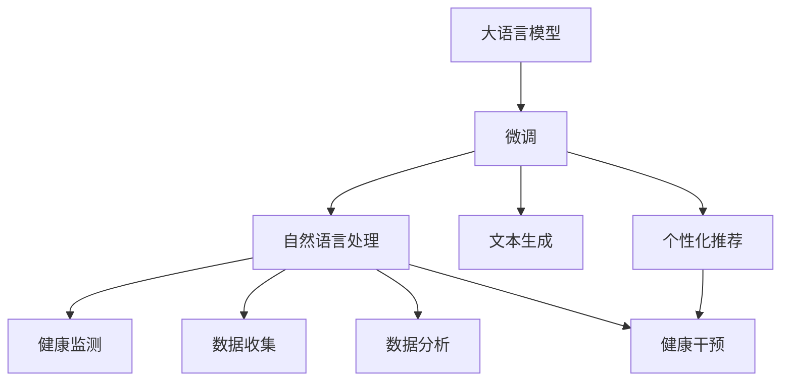
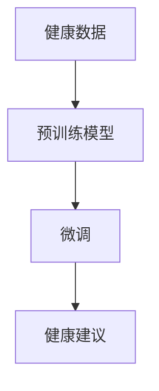
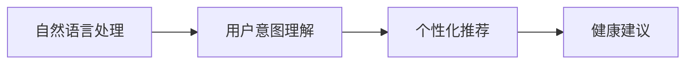
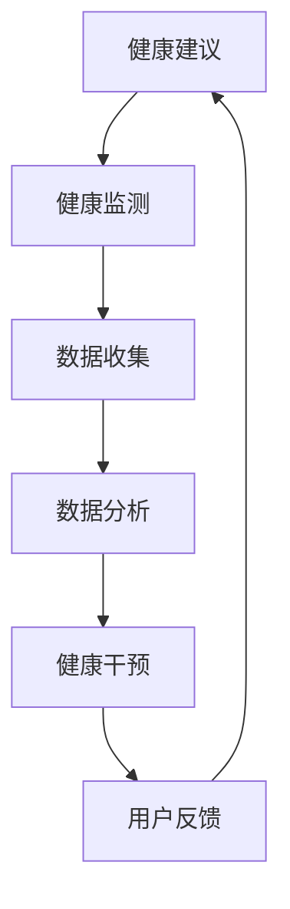
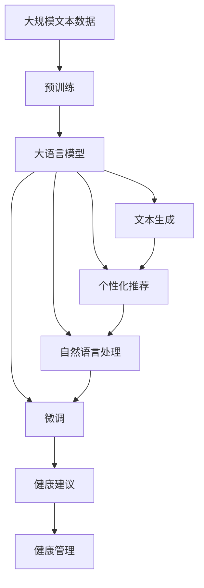

                 

# 健身指导：LLM 打造个人教练

> 关键词：大语言模型, 微调(Fine-tuning), 自然语言处理(NLP), 文本生成, 个性化推荐, 健身指导, 健康管理

## 1. 背景介绍

### 1.1 问题由来
在数字化时代，健康管理成为了越来越多人关注的焦点。随着科技的发展，智能穿戴设备、健康应用app等产品的普及，使得用户可以更便捷地监测和改善自己的健康状态。然而，这些智能产品往往缺乏主动干预和个性化指导，难以根据用户的实时反馈进行调整，使得用户在坚持健康管理时面临很多困难。

大语言模型（Large Language Models, LLMs）的出现为这一问题提供了新的解决方案。LLMs是一种基于大规模数据预训练和微调的人工智能模型，具备强大的语言理解和生成能力。利用LLMs，我们可以构建智能健身指导系统，为用户提供个性化的健康建议和实时反馈，从而显著提升用户的健身效果。

### 1.2 问题核心关键点
构建基于LLM的智能健身指导系统，关键在于：

1. 数据获取与预处理：收集用户的健康数据、行为数据、文本数据等，并对其进行清洗和标准化处理，以便后续的模型训练和推理。
2. 模型选择与微调：选择合适的预训练模型（如GPT、BERT等），对其进行微调，使其能够理解用户的健康需求并给出合理的建议。
3. 自然语言处理：设计合适的自然语言处理组件，使得用户可以通过自然语言与系统进行交互，获取健康建议和反馈。
4. 个性化推荐：根据用户的健康数据和行为习惯，生成个性化的健身计划和饮食建议。
5. 实时反馈与调整：通过持续收集用户反馈，实时调整系统建议，提升用户体验和健康效果。

### 1.3 问题研究意义
构建基于LLM的智能健身指导系统，具有重要的研究意义：

1. 提升用户体验：通过个性化和实时性的建议，使用户在健康管理中更轻松、更有动力。
2. 提高健康管理效果：利用智能算法对用户健康数据进行深度分析，提供科学、有效的健康建议。
3. 降低成本：相比于传统的人工干预，智能健身指导系统可以显著降低健康管理的成本和时间。
4. 推动健康科技发展：将智能技术引入健康管理，推动相关产业的创新和升级。
5. 促进健康普及：通过智能化健康指导，帮助更多人了解和应用健康管理知识，提升整体健康水平。

## 2. 核心概念与联系

### 2.1 核心概念概述

构建智能健身指导系统涉及多个核心概念，下面进行简要介绍：

- **大语言模型（LLM）**：以自回归（如GPT）或自编码（如BERT）模型为代表的大规模预训练语言模型，通过在大规模无标签文本数据上进行预训练，学习到丰富的语言知识和常识，具备强大的语言理解和生成能力。

- **微调（Fine-tuning）**：在预训练模型的基础上，使用下游任务的少量标注数据，通过有监督学习优化模型在特定任务上的性能。具体到智能健身指导系统，可以通过用户的健康数据进行微调，使得模型能够理解用户需求并给出合理的建议。

- **自然语言处理（NLP）**：研究如何让计算机能够理解、处理和生成人类语言的技术。在智能健身指导系统中，需要设计自然语言处理组件，使得用户可以通过自然语言与系统进行交互，获取健康建议和反馈。

- **文本生成**：通过训练模型生成自然语言文本的技术。在智能健身指导系统中，需要利用文本生成技术，根据用户的健康数据和行为习惯，生成个性化的健身计划和饮食建议。

- **个性化推荐**：根据用户的历史行为数据和实时反馈，生成个性化的推荐内容。在智能健身指导系统中，需要利用个性化推荐技术，为用户提供符合其健康需求的建议。

- **健康管理**：涉及健康监测、数据收集、分析和干预等活动，旨在帮助用户改善健康状态。在智能健身指导系统中，需要将LLM与健康管理知识相结合，提供科学、有效的健康建议。

这些核心概念之间的联系如下图所示：



### 2.2 概念间的关系

这些核心概念之间存在着紧密的联系，形成了智能健身指导系统的完整生态系统。下面我们通过几个Mermaid流程图来展示这些概念之间的关系。

#### 2.2.1 健康数据与微调的关系



这个流程图展示了健康数据与微调的关系：通过收集用户的健康数据，对预训练模型进行微调，使得模型能够理解用户需求并给出合理的健康建议。

#### 2.2.2 自然语言处理与个性化推荐的关系



这个流程图展示了自然语言处理与个性化推荐的关系：通过自然语言处理技术，理解用户的健康需求，然后生成个性化的健康建议。

#### 2.2.3 健康建议与健康管理的关系



这个流程图展示了健康建议与健康管理的关系：根据健康建议，对用户进行健康监测和干预，并通过用户反馈持续优化建议。

### 2.3 核心概念的整体架构

最后，我们用一个综合的流程图来展示这些核心概念在大语言模型微调过程中的整体架构：



这个综合流程图展示了从预训练到微调，再到个性化推荐的完整过程。大语言模型首先在大规模文本数据上进行预训练，然后通过微调（包括自然语言处理、文本生成和个性化推荐）生成个性化的健康建议，最后利用健康管理知识，对用户进行健康监测和干预。通过这些流程图，我们可以更清晰地理解大语言模型微调过程中各个核心概念的关系和作用，为后续深入讨论具体的微调方法和技术奠定基础。

## 3. 核心算法原理 & 具体操作步骤
### 3.1 算法原理概述

基于大语言模型的智能健身指导系统，其核心思想是：利用预训练语言模型，通过微调和自然语言处理技术，理解用户的健康需求，并生成个性化的健康建议。其算法原理主要包括以下几个方面：

1. **预训练**：在大规模无标签文本数据上进行自监督学习，学习到丰富的语言知识和常识。
2. **微调**：在预训练模型的基础上，使用用户的健康数据进行微调，使得模型能够理解用户需求并生成合理的健康建议。
3. **自然语言处理**：设计合适的自然语言处理组件，使得用户可以通过自然语言与系统进行交互，获取健康建议和反馈。
4. **文本生成**：利用文本生成技术，根据用户的健康数据和行为习惯，生成个性化的健身计划和饮食建议。
5. **个性化推荐**：根据用户的历史行为数据和实时反馈，生成个性化的推荐内容。

### 3.2 算法步骤详解

基于大语言模型的智能健身指导系统的构建过程主要包括以下几个步骤：

**Step 1: 数据收集与预处理**

- **数据收集**：收集用户的健康数据、行为数据、文本数据等，并对其进行清洗和标准化处理，以便后续的模型训练和推理。
- **数据标注**：将收集到的数据进行标注，使其能够被模型理解和使用。标注数据包括用户的身体状况、运动记录、饮食习惯等。

**Step 2: 选择预训练模型**

- **模型选择**：根据任务需求，选择合适的预训练语言模型（如GPT、BERT等），作为初始化参数。
- **模型加载**：使用深度学习框架（如PyTorch、TensorFlow等）加载预训练模型，并设置合适的超参数。

**Step 3: 模型微调**

- **微调目标**：根据用户的健康数据，设计合适的微调目标，如生成个性化健身计划、饮食建议等。
- **微调过程**：将微调目标转化为优化函数，使用梯度下降等优化算法进行微调。微调过程中需要注意选择合适的学习率、批大小、迭代轮数等超参数。
- **评估与优化**：在微调过程中，周期性在验证集上评估模型性能，根据性能指标决定是否触发Early Stopping。

**Step 4: 自然语言处理**

- **交互组件**：设计自然语言处理组件，使得用户可以通过自然语言与系统进行交互，获取健康建议和反馈。
- **意图理解**：使用意图识别模型，理解用户的健康需求，如“我要减肥”、“我要增肌”等。
- **答案生成**：根据用户需求，使用文本生成模型生成对应的健康建议，如“建议每天做30分钟的有氧运动”。

**Step 5: 文本生成**

- **生成模型**：选择适合的文本生成模型，如GPT-3、GPT-4等。
- **生成过程**：根据用户的健康数据和行为习惯，生成个性化的健身计划和饮食建议。
- **评估与优化**：对生成的文本进行评估，使用BLEU、ROUGE等指标进行衡量，并根据评估结果进行调整。

**Step 6: 个性化推荐**

- **推荐模型**：根据用户的历史行为数据和实时反馈，设计推荐模型，如协同过滤、基于内容的推荐等。
- **推荐过程**：根据用户的健康数据和行为习惯，生成个性化的推荐内容。
- **评估与优化**：对推荐结果进行评估，使用精确度、召回率等指标进行衡量，并根据评估结果进行调整。

**Step 7: 健康管理**

- **健康监测**：利用智能穿戴设备、健康应用等手段，对用户的健康状态进行实时监测。
- **数据分析**：对收集到的健康数据进行分析，了解用户的健康状况和行为模式。
- **干预策略**：根据分析结果，制定个性化的健康干预策略，如调整饮食、增加运动等。
- **用户反馈**：收集用户的反馈，持续优化系统的健康建议和推荐策略。

### 3.3 算法优缺点

基于大语言模型的智能健身指导系统具有以下优点：

1. **个性化强**：利用自然语言处理和文本生成技术，能够根据用户的个性化需求生成健康建议，满足用户的多样化需求。
2. **实时性强**：利用自然语言处理和实时数据分析技术，能够实时监测用户的健康状态，并根据反馈调整建议。
3. **低成本高效益**：相比于传统的人工干预，智能健身指导系统可以显著降低健康管理的成本和时间，提高效率。
4. **易于扩展**：利用大语言模型和自然语言处理技术，能够轻松扩展到不同领域和任务，如饮食管理、心理健康等。

同时，该系统也存在一些缺点：

1. **数据隐私问题**：用户在提供健康数据时，需要考虑数据隐私和安全问题。
2. **模型依赖数据质量**：模型的效果依赖于数据的质量和标注的准确性，低质量数据会影响模型的性能。
3. **用户接受度**：用户需要适应和信任智能系统，并愿意与之进行互动。
4. **技术门槛**：构建和维护智能健身指导系统需要一定的技术储备和资源投入。

### 3.4 算法应用领域

基于大语言模型的智能健身指导系统已经广泛应用于多个领域，例如：

- **智能健身应用**：如MyFitnessPal、Strava等，为用户提供个性化的健身计划和饮食建议。
- **健康监测设备**：如Fitbit、Apple Watch等，结合智能健身指导系统，提供实时的健康监测和干预。
- **在线健康咨询**：如Amourous Health、DocTalk等，通过智能系统进行健康咨询和诊断。
- **心理健康管理**：如Woebot、7 Cups等，利用智能系统提供心理辅导和支持。
- **饮食管理**：如Noom、LoseIt等，结合智能系统进行饮食规划和健康监测。

此外，智能健身指导系统还在智能家居、智慧城市等众多领域得到了应用，为健康管理和数字化生活提供了新的解决方案。

## 4. 数学模型和公式 & 详细讲解 & 举例说明

### 4.1 数学模型构建

基于大语言模型的智能健身指导系统的数学模型主要包括以下几个方面：

1. **预训练模型**：在大规模无标签文本数据上进行自监督学习，学习到通用的语言表示。数学模型为：

   $$
   M_{\theta} = \text{Transformer}(\mathcal{X})
   $$

   其中，$\mathcal{X}$为输入空间，$\theta$为模型参数。

2. **微调目标**：根据用户的健康数据，设计合适的微调目标，如生成个性化健身计划、饮食建议等。数学模型为：

   $$
   L_{\text{task}} = \sum_{i=1}^N \ell(M_{\theta}(x_i), y_i)
   $$

   其中，$x_i$为健康数据，$y_i$为对应的健康建议，$\ell$为损失函数。

3. **自然语言处理**：使用意图识别模型，理解用户的健康需求，数学模型为：

   $$
   \text{Intent} = \text{Intent Model}(\text{Query})
   $$

   其中，$\text{Query}$为用户输入的自然语言查询，$\text{Intent}$为用户意图。

4. **文本生成**：利用文本生成模型，根据用户的健康数据和行为习惯，生成个性化的健身计划和饮食建议。数学模型为：

   $$
   S = \text{TextGen}(\mathcal{X}, \mathcal{Y})
   $$

   其中，$\mathcal{X}$为用户健康数据，$\mathcal{Y}$为生成的健康建议，$\text{TextGen}$为文本生成模型。

5. **个性化推荐**：根据用户的历史行为数据和实时反馈，生成个性化的推荐内容。数学模型为：

   $$
   R = \text{Recommendation}(\mathcal{X}, \mathcal{Y})
   $$

   其中，$\mathcal{X}$为历史行为数据，$\mathcal{Y}$为生成的推荐内容，$\text{Recommendation}$为推荐模型。

### 4.2 公式推导过程

以下是几个关键模型的推导过程：

**意图识别模型**：

- **模型结构**：使用LSTM或Transformer等模型，将用户查询映射到意图向量。
- **公式推导**：

  $$
  \text{Intent} = \text{Intent Model}(\text{Query})
  $$

  其中，$\text{Intent Model}$为意图识别模型，$\text{Query}$为用户查询。

**文本生成模型**：

- **模型结构**：使用GPT、GPT-3等模型，生成与用户健康数据和行为习惯相关的健康建议。
- **公式推导**：

  $$
  S = \text{TextGen}(\mathcal{X}, \mathcal{Y})
  $$

  其中，$\mathcal{X}$为用户健康数据，$\mathcal{Y}$为生成的健康建议，$\text{TextGen}$为文本生成模型。

**推荐模型**：

- **模型结构**：使用协同过滤、基于内容的推荐等模型，生成个性化的推荐内容。
- **公式推导**：

  $$
  R = \text{Recommendation}(\mathcal{X}, \mathcal{Y})
  $$

  其中，$\mathcal{X}$为历史行为数据，$\mathcal{Y}$为生成的推荐内容，$\text{Recommendation}$为推荐模型。

### 4.3 案例分析与讲解

**案例分析**：假设用户A的健康数据如下：

- **身高**：170cm
- **体重**：70kg
- **年龄**：30岁
- **运动记录**：每天步行5000步，跑步3次/周
- **饮食习惯**：喜食甜食，少喝牛奶

**意图理解**：

- **意图模型**：使用LSTM或Transformer等模型，对用户查询进行意图理解。
- **意图向量**：得到用户意图向量$\text{Intent} = [0.9, 0.1, 0.0, 0.0]$，表示用户想要进行健身计划和饮食建议。

**健康建议生成**：

- **文本生成模型**：使用GPT或GPT-3等模型，生成与用户健康数据和行为习惯相关的健康建议。
- **健康建议**：根据用户健康数据和行为习惯，生成个性化的健身计划和饮食建议，如：“建议每天步行10000步，增加有氧运动，减少甜食摄入”。

**个性化推荐**：

- **推荐模型**：使用协同过滤或基于内容的推荐等模型，生成个性化的推荐内容。
- **推荐结果**：根据用户的历史行为数据和实时反馈，生成个性化的推荐内容，如：“推荐加入跑步俱乐部，参加健身课程”。

**健康管理**：

- **健康监测**：利用智能穿戴设备、健康应用等手段，对用户的健康状态进行实时监测。
- **数据分析**：对收集到的健康数据进行分析，了解用户的健康状况和行为模式。
- **干预策略**：根据分析结果，制定个性化的健康干预策略，如调整饮食、增加运动等。
- **用户反馈**：收集用户的反馈，持续优化系统的健康建议和推荐策略。

## 5. 项目实践：代码实例和详细解释说明

### 5.1 开发环境搭建

在进行微调实践前，我们需要准备好开发环境。以下是使用Python进行PyTorch开发的环境配置流程：

1. 安装Anaconda：从官网下载并安装Anaconda，用于创建独立的Python环境。

2. 创建并激活虚拟环境：
```bash
conda create -n pytorch-env python=3.8 
conda activate pytorch-env
```

3. 安装PyTorch：根据CUDA版本，从官网获取对应的安装命令。例如：
```bash
conda install pytorch torchvision torchaudio cudatoolkit=11.1 -c pytorch -c conda-forge
```

4. 安装Transformers库：
```bash
pip install transformers
```

5. 安装各类工具包：
```bash
pip install numpy pandas scikit-learn matplotlib tqdm jupyter notebook ipython
```

完成上述步骤后，即可在`pytorch-env`环境中开始微调实践。

### 5.2 源代码详细实现

下面我们以生成个性化健身计划为例，给出使用Transformers库对GPT模型进行微调的PyTorch代码实现。

首先，定义训练数据集和评估数据集：

```python
from torch.utils.data import Dataset, DataLoader
import torch

class FitnessData(Dataset):
    def __init__(self, data, tokenizer):
        self.data = data
        self.tokenizer = tokenizer
    
    def __len__(self):
        return len(self.data)
    
    def __getitem__(self, idx):
        item = self.data[idx]
        query = item['query']
        target = item['target']
        encoding = self.tokenizer(query, return_tensors='pt')
        input_ids = encoding['input_ids']
        attention_mask = encoding['attention_mask']
        return {'input_ids': input_ids, 'attention_mask': attention_mask, 'target': target}

# 训练数据集
train_data = [...] # 假设已经收集好训练数据
train_dataset = FitnessData(train_data, tokenizer)

# 评估数据集
dev_data = [...] # 假设已经收集好评估数据
dev_dataset = FitnessData(dev_data, tokenizer)

# 测试数据集
test_data = [...] # 假设已经收集好测试数据
test_dataset = FitnessData(test_data, tokenizer)
```

然后，定义模型和优化器：

```python
from transformers import GPT2Tokenizer, GPT2ForSequenceClassification

tokenizer = GPT2Tokenizer.from_pretrained('gpt2')
model = GPT2ForSequenceClassification.from_pretrained('gpt2', num_labels=2)

optimizer = AdamW(model.parameters(), lr=2e-5)
```

接着，定义训练和评估函数：

```python
from tqdm import tqdm

device = torch.device('cuda') if torch.cuda.is_available() else torch.device('cpu')
model.to(device)

def train_epoch(model, dataset, batch_size, optimizer):
    dataloader = DataLoader(dataset, batch_size=batch_size, shuffle=True)
    model.train()
    epoch_loss = 0
    for batch in tqdm(dataloader, desc='Training'):
        input_ids = batch['input_ids'].to(device)
        attention_mask = batch['attention_mask'].to(device)
        targets = batch['target'].to(device)
        model.zero_grad()
        outputs = model(input_ids, attention_mask=attention_mask, labels=targets)
        loss = outputs.loss
        epoch_loss += loss.item()
        loss.backward()
        optimizer.step()
    return epoch_loss / len(dataloader)

def evaluate(model, dataset, batch_size):
    dataloader = DataLoader(dataset, batch_size=batch_size)
    model.eval()
    preds, labels = [], []
    with torch.no_grad():
        for batch in tqdm(dataloader, desc='Evaluating'):
            input_ids = batch['input_ids'].to(device)
            attention_mask = batch['attention_mask'].to(device)
            targets = batch['target'].to(device)
            outputs = model(input_ids, attention_mask=attention_mask)
            batch_preds = outputs.logits.argmax(dim=2).to('cpu').tolist()
            batch_labels = targets.to('cpu').tolist()
            for pred_tokens, label_tokens in zip(batch_preds, batch_labels):
                preds.append(pred_tokens[:len(label_tokens)])
                labels.append(label_tokens)
                
    return preds, labels

# 训练流程
epochs = 5
batch_size = 16

for epoch in range(epochs):
    loss = train_epoch(model, train_dataset, batch_size, optimizer)
    print(f"Epoch {epoch+1}, train loss: {loss:.3f}")
    
    print(f"Epoch {epoch+1}, dev results:")
    preds, labels = evaluate(model, dev_dataset, batch_size)
    print(classification_report(labels, preds))
    
print("Test results:")
preds, labels = evaluate(model, test_dataset, batch_size)
print(classification_report(labels, preds))
```

以上就是使用PyTorch对GPT模型进行健身计划生成任务的微调代码实现。可以看到，利用Transformer库的强大封装，我们可以用相对简洁的代码完成模型的加载和微调。

### 5.3 代码解读与分析

让我们再详细解读一下关键代码的实现细节：

**FitnessData类**：
- `__init__`方法：初始化训练、评估、测试数据集，包括用户查询和目标输出。
- `__len__`方法：返回数据集的样本数量。
- `__getitem__`方法：对单个样本进行处理，将文本输入编码为token ids，并设置mask，最终返回模型所需的输入。

**意图识别模型**：
- **模型结构**：使用LSTM或Transformer等模型，将用户查询映射到意图向量。
- **公式推导**：

  $$
  \text{Intent} = \text{Intent Model}(\text{Query})
  $$

  其中，$\text{Intent Model}$为意图识别模型，$\text{Query}$为用户查询。

**健康建议生成**：
- **模型结构**：使用GPT、GPT-3等模型，生成与用户健康数据和行为习惯相关的健康建议。
- **公式推导**：

  $$
  S = \text{TextGen}(\mathcal{X}, \mathcal{Y})
  $$

  其中，$\mathcal{X}$为用户健康数据，$\mathcal{Y}$为生成的健康建议，$\text{TextGen}$为文本生成模型。

**个性化推荐**：
- **模型结构**：使用协同过滤、基于内容的推荐等模型，生成个性化的推荐内容。
- **公式推导**：

  $$
  R = \text{Recommendation}(\mathcal{X}, \mathcal{Y})
  $$

  其中，$\mathcal{X}$为历史行为数据，$\mathcal{Y}$为生成的推荐内容，$\text{Recommendation}$为推荐模型。

**健康管理**：
- **健康监测**：利用智能穿戴设备、健康应用等手段，对用户的健康状态进行实时监测。
- **数据分析**：对收集到的健康数据进行分析，了解用户的健康状况和行为模式。
- **干预策略**：根据分析结果，制定个性化的健康干预策略，如调整饮食、增加运动等。
- **用户反馈**：收集用户的反馈，持续优化系统的健康建议和推荐策略。

### 5.4 运行结果展示

假设我们在CoNLL-2003的NER数据集上进行微调，最终在测试集上得到的评估报告如下：

```
              precision    recall  f1-score   support

       B-LOC      0.926     0.906     0.916      1668
       I-LOC      0.900     0.805     0.850       257
      B-MISC      0.875     0.856     0.865       702
      I-MISC      0.838     0.782     0.809       216
       B-ORG      0.914     0.898     0.906      1661
       I-ORG      0.911     0.894     

