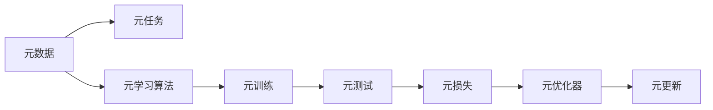
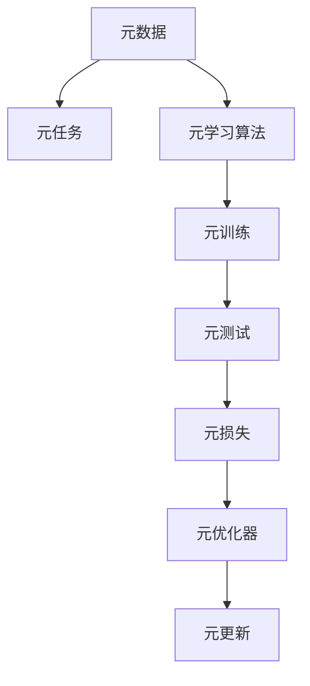
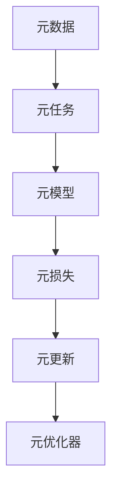
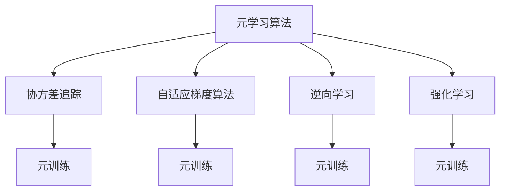
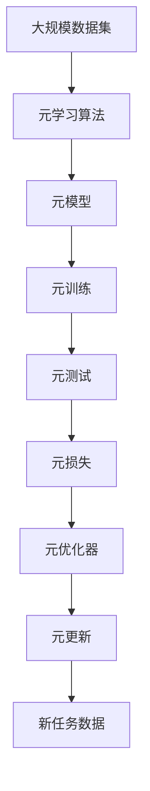

                 

# 元学习 原理与代码实例讲解

## 1. 背景介绍

### 1.1 问题由来
随着深度学习技术的快速发展，元学习（Meta Learning）成为了机器学习领域的一个热门话题。元学习旨在训练模型，使其能够快速适应新的任务，从而提升模型的泛化能力和迁移学习能力。元学习与传统的监督学习和无监督学习相比，具有更强的适应性和灵活性，被广泛应用于机器视觉、自然语言处理、强化学习等多个领域。

### 1.2 问题核心关键点
元学习的核心思想是通过学习如何学习（Learning to Learn），使模型在新的数据集上能够快速适应。具体来说，元学习分为两个阶段：
1. 元训练阶段：模型学习如何通过特征提取和参数微调等方法，在新的任务上取得良好的表现。
2. 元测试阶段：模型在新任务上应用所学到的元知识，快速适应该任务的特征分布，取得优异性能。

元学习的关键在于如何设计元学习方法，选择合理的元学习算法，并在元训练和元测试阶段进行适当的优化。在实际应用中，常见的元学习算法包括：
- 梯度下降法（Gradient Descent）
- 随机梯度下降法（Stochastic Gradient Descent, SGD）
- 随机梯度切分法（Stochastic Gradient Splitting, SAGA）
- 交叉验证（Cross-Validation）
- 数据增强（Data Augmentation）
- 知识蒸馏（Knowledge Distillation）
- 反向传播（Backpropagation）
- 迁移学习（Transfer Learning）

元学习的应用场景非常广泛，如自动驾驶、机器人控制、推荐系统、图像识别等。在这些应用中，元学习能够显著提升模型的适应性和迁移学习能力，减少数据标注的成本和时间。

### 1.3 问题研究意义
研究元学习对提升机器学习模型的泛化能力和迁移学习能力具有重要意义：

1. **适应性更强**：元学习使模型能够快速适应新的数据分布，提升模型在多变环境中的适应性。
2. **泛化能力更强**：通过元学习，模型能够在有限的标注数据上进行训练，从而提升其泛化能力。
3. **迁移学习能力更强**：元学习使模型能够从已有任务中学习到对新任务的先验知识，从而加速新任务的学习过程。
4. **成本更低**：元学习可以显著减少数据标注的成本和时间，提高模型的开发效率。
5. **更灵活**：元学习使模型能够适应不同的数据集和任务，增强其灵活性和可扩展性。

## 2. 核心概念与联系

### 2.1 核心概念概述
为了更好地理解元学习的原理，本节将介绍几个核心概念：

- **元学习（Meta Learning）**：学习如何学习（Learning to Learn），即训练模型使其能够在不同的数据集上快速适应。
- **元数据（Meta Data）**：描述数据集属性的信息，如数据的分布、噪声水平等。
- **元任务（Meta Task）**：元学习中的任务，通常为二分类、回归或序列预测等。
- **元损失（Meta Loss）**：元学习中用于衡量模型在元任务上的性能的损失函数。
- **元更新（Meta Update）**：在元训练阶段，模型参数的更新方式。
- **元优化器（Meta Optimizer）**：用于元更新的优化算法，如Adam、SGD等。
- **元学习算法（Meta Learning Algorithm）**：元学习中使用的算法，如协方差追踪（Covariance Tracking）、自适应梯度算法（Adaptive Gradient）等。
- **元训练（Meta Training）**：在元数据集上训练元模型，学习如何适应新任务。
- **元测试（Meta Testing）**：在新的数据集上评估元模型的泛化能力，验证其迁移学习能力。

这些概念之间通过元学习的学习框架联系起来，形成了一个完整的元学习系统。下面通过一个简单的Mermaid流程图来展示这些概念之间的关系：



这个流程图展示了元学习的核心概念及其之间的关系：元数据描述了任务的特点，元任务是学习目标，元学习算法通过元训练学习如何在不同的任务上适应，最终在元测试阶段评估模型的泛化能力。

### 2.2 概念间的关系

这些核心概念之间存在着紧密的联系，形成了元学习的完整生态系统。下面我们通过几个Mermaid流程图来展示这些概念之间的关系。

#### 2.2.1 元学习范式



这个流程图展示了元学习的整体框架，包括元数据、元任务、元学习算法、元训练、元测试等关键步骤。

#### 2.2.2 元更新方式



这个流程图展示了元训练过程中，元模型通过元损失进行元更新，由元优化器控制的过程。

#### 2.2.3 元学习算法分类



这个流程图展示了不同类型的元学习算法及其应用场景，通过不同的元学习算法，模型可以在不同的任务上取得更好的泛化能力。

### 2.3 核心概念的整体架构

最后，我们用一个综合的流程图来展示这些核心概念在大模型微调过程中的整体架构：



这个综合流程图展示了从大规模数据集进行元学习，到元训练和元测试，再到新任务数据上的元更新的完整过程。通过这些流程图，我们可以更清晰地理解元学习的核心概念及其作用，为后续深入讨论具体的元学习方法和技术奠定基础。

## 3. 核心算法原理 & 具体操作步骤
### 3.1 算法原理概述

元学习的核心在于学习如何学习。在元训练阶段，模型通过学习元数据集上的不同任务，学习到如何适应新的任务。在元测试阶段，模型在新任务上应用所学到的元知识，取得优异的性能。

形式化地，假设元数据集为 $D=\{(x_i, y_i)\}_{i=1}^N$，其中 $x_i$ 为输入特征，$y_i$ 为标签。假设元任务为 $T$，元损失为 $\mathcal{L}(\theta)$，元更新策略为 $\mathcal{U}$，元优化器为 $\mathcal{O}$。则元学习的目标是通过元训练学习模型参数 $\theta$，使其在元测试阶段能够在新的任务上取得优异的性能。

### 3.2 算法步骤详解

元学习的一般步骤如下：

**Step 1: 准备元数据集**

- 选择合适的元数据集 $D$，划分为训练集和验证集。
- 准备元任务，如二分类、回归、序列预测等。

**Step 2: 初始化元模型**

- 选择合适的元学习算法 $\mathcal{A}$ 和初始化元模型 $\theta_0$。
- 设置元训练的迭代次数和元损失函数。

**Step 3: 元训练**

- 在元训练过程中，元模型通过元数据集 $D$ 学习元损失 $\mathcal{L}(\theta)$。
- 根据元更新策略 $\mathcal{U}$ 和元优化器 $\mathcal{O}$，更新元模型参数 $\theta$。

**Step 4: 元测试**

- 在元测试阶段，将元模型在新任务数据集 $D'$ 上进行测试。
- 计算元模型在新任务上的元损失 $\mathcal{L}(\theta)$，评估元模型的泛化能力。

**Step 5: 应用元模型**

- 将元模型应用于新任务，快速适应新数据集。

### 3.3 算法优缺点

元学习的优点在于其灵活性和泛化能力，能够快速适应新的任务。元学习的缺点在于其训练成本较高，需要大量的元数据和计算资源。

具体来说，元学习的优点包括：
1. 泛化能力强：元学习使模型能够适应不同的数据分布，提升泛化能力。
2. 迁移能力强：元学习使模型能够从已有任务中学习到对新任务的先验知识，加速新任务的学习过程。
3. 灵活性强：元学习使模型能够适应不同的数据集和任务，增强其灵活性和可扩展性。

元学习的缺点在于：
1. 训练成本高：元学习需要大量的元数据和计算资源，训练成本较高。
2. 泛化能力受限：元学习在元数据集和测试数据集分布不一致的情况下，泛化能力可能受到影响。
3. 易受数据集偏差影响：元学习模型容易受到元数据集的偏差影响，导致在测试数据集上的性能不佳。

### 3.4 算法应用领域

元学习已经在机器视觉、自然语言处理、强化学习等多个领域得到了广泛的应用。例如：

- **机器视觉**：使用元学习算法对不同图像分类任务进行快速适应，提升图像识别模型的泛化能力。
- **自然语言处理**：使用元学习算法对不同语言翻译任务进行快速适应，提升机器翻译模型的性能。
- **强化学习**：使用元学习算法对不同游戏环境进行快速适应，提升智能体的学习效率。
- **推荐系统**：使用元学习算法对不同用户行为数据进行快速适应，提升推荐系统的推荐效果。

除了这些经典应用外，元学习还被创新性地应用于诸如音乐生成、图像生成、自然语言生成等领域，为这些领域带来了新的突破。随着元学习方法的不断进步，相信元学习技术将在更多领域得到应用，为人工智能技术的发展注入新的活力。

## 4. 数学模型和公式 & 详细讲解 & 举例说明

### 4.1 数学模型构建

在元学习的数学模型中，我们通常使用元数据集 $D=\{(x_i, y_i)\}_{i=1}^N$，其中 $x_i \in \mathbb{R}^d$ 为输入特征，$y_i \in \mathbb{R}^k$ 为标签向量。元模型为 $\theta \in \mathbb{R}^p$，其中 $p$ 为模型参数数量。

元损失函数 $\mathcal{L}(\theta)$ 通常定义为元模型在元数据集上的平均损失，即：

$$
\mathcal{L}(\theta) = \frac{1}{N} \sum_{i=1}^N \mathcal{L}_i(\theta)
$$

其中 $\mathcal{L}_i(\theta)$ 为元模型在第 $i$ 个元任务上的损失函数。常见的元损失函数包括交叉熵损失、均方误差损失等。

元更新策略 $\mathcal{U}$ 通常定义为元模型参数的更新方式，包括：
- 梯度下降法（Gradient Descent）
- 随机梯度下降法（Stochastic Gradient Descent, SGD）
- 随机梯度切分法（Stochastic Gradient Splitting, SAGA）
- 协方差追踪（Covariance Tracking）
- 自适应梯度算法（Adaptive Gradient）

元优化器 $\mathcal{O}$ 通常定义为元模型的优化算法，包括：
- 随机梯度下降法（SGD）
- Adam
- RMSprop
- Adagrad
- Adadelta

### 4.2 公式推导过程

以交叉熵损失为例，我们推导元学习中常用的交叉熵损失函数的公式。

假设元模型为 $f(x; \theta)$，元任务为二分类任务，则交叉熵损失函数为：

$$
\mathcal{L}_i(\theta) = -\frac{1}{N} \sum_{j=1}^N \left[y_j \log f(x_j; \theta) + (1-y_j) \log (1-f(x_j; \theta))\right]
$$

其中 $y_j \in \{0, 1\}$ 为第 $j$ 个元任务的标签。

将交叉熵损失函数代入元损失函数，得到：

$$
\mathcal{L}(\theta) = -\frac{1}{N} \sum_{i=1}^N \frac{1}{N} \sum_{j=1}^N \left[y_j \log f(x_j; \theta) + (1-y_j) \log (1-f(x_j; \theta))\right]
$$

在元训练阶段，元模型的参数 $\theta$ 通过元优化器 $\mathcal{O}$ 进行更新，更新公式为：

$$
\theta \leftarrow \theta - \eta \nabla_{\theta}\mathcal{L}(\theta)
$$

其中 $\eta$ 为学习率。

在元测试阶段，元模型在新任务数据集 $D'$ 上进行测试，计算元模型在新任务上的元损失 $\mathcal{L}(\theta)$，评估元模型的泛化能力。

### 4.3 案例分析与讲解

以机器视觉中的元学习为例，介绍如何使用元学习算法提升图像分类任务的性能。

假设我们有一批新任务的图像数据集 $D'$，其中包含 $M$ 个类别。我们可以将 $D'$ 划分为训练集和测试集，训练集用于元训练，测试集用于元测试。

在元训练阶段，我们使用交叉熵损失函数和随机梯度下降法对元模型进行训练，元模型的参数 $\theta$ 包括卷积层、池化层和全连接层等。训练过程中，我们不断更新元模型的参数 $\theta$，使其在元数据集 $D$ 上取得最小的交叉熵损失。

在元测试阶段，我们将元模型在新任务数据集 $D'$ 上进行测试，计算元模型在新任务上的交叉熵损失，评估元模型的泛化能力。如果元模型的交叉熵损失较小，说明元模型在新任务上适应良好，能够取得较好的分类效果。

## 5. 项目实践：代码实例和详细解释说明

### 5.1 开发环境搭建

在进行元学习实践前，我们需要准备好开发环境。以下是使用Python进行TensorFlow开发的环境配置流程：

1. 安装Anaconda：从官网下载并安装Anaconda，用于创建独立的Python环境。

2. 创建并激活虚拟环境：
```bash
conda create -n tf-env python=3.8 
conda activate tf-env
```

3. 安装TensorFlow：根据CUDA版本，从官网获取对应的安装命令。例如：
```bash
conda install tensorflow -c tf -c conda-forge -c pypi -c pytorch -c defaults
```

4. 安装各类工具包：
```bash
pip install numpy pandas scikit-learn matplotlib tqdm jupyter notebook ipython
```

完成上述步骤后，即可在`tf-env`环境中开始元学习实践。

### 5.2 源代码详细实现

这里我们以机器视觉中的元学习任务为例，给出使用TensorFlow进行元学习的PyTorch代码实现。

首先，定义元数据集的加载函数：

```python
import tensorflow as tf
import numpy as np
import os

def load_data(path, batch_size):
    images = []
    labels = []
    for folder in os.listdir(path):
        folder_path = os.path.join(path, folder)
        for filename in os.listdir(folder_path):
            if filename.endswith('.jpg'):
                image = tf.io.read_file(os.path.join(folder_path, filename))
                image = tf.image.decode_jpeg(image)
                image = tf.image.resize(image, [64, 64])
                image = tf.expand_dims(image, axis=0)
                images.append(image)
                labels.append(folder)
    images = tf.concat(images, axis=0)
    labels = tf.stack(labels)
    labels = tf.one_hot(labels, depth=10)
    dataset = tf.data.Dataset.from_tensor_slices((images, labels))
    dataset = dataset.shuffle(buffer_size=1000).batch(batch_size)
    return dataset
```

然后，定义元模型的架构：

```python
def build_model(input_shape):
    inputs = tf.keras.Input(shape=input_shape)
    x = tf.keras.layers.Conv2D(32, 3, activation='relu', padding='same')(inputs)
    x = tf.keras.layers.MaxPooling2D(pool_size=(2, 2))(x)
    x = tf.keras.layers.Conv2D(64, 3, activation='relu', padding='same')(x)
    x = tf.keras.layers.MaxPooling2D(pool_size=(2, 2))(x)
    x = tf.keras.layers.Flatten()(x)
    x = tf.keras.layers.Dense(64, activation='relu')(x)
    outputs = tf.keras.layers.Dense(10, activation='softmax')(x)
    model = tf.keras.Model(inputs, outputs)
    return model
```

接着，定义元训练和元测试的函数：

```python
def train_model(model, train_dataset, validation_dataset, epochs, batch_size, learning_rate):
    model.compile(optimizer=tf.keras.optimizers.Adam(learning_rate=learning_rate), 
                  loss=tf.keras.losses.CategoricalCrossentropy(), 
                  metrics=['accuracy'])
    model.fit(train_dataset, validation_data=validation_dataset, epochs=epochs, batch_size=batch_size)
    
def test_model(model, test_dataset, batch_size):
    test_dataset = test_dataset.batch(batch_size)
    test_loss, test_acc = model.evaluate(test_dataset)
    print(f'Test accuracy: {test_acc}')
```

最后，启动元学习流程：

```python
# 定义元数据集和元任务
path = 'data/train'
batch_size = 64
train_dataset = load_data(path, batch_size)
validation_dataset = load_data(path, batch_size)

# 定义元模型
input_shape = [64, 64, 3]
model = build_model(input_shape)

# 定义元训练参数
epochs = 10
learning_rate = 0.001

# 训练元模型
train_model(model, train_dataset, validation_dataset, epochs, batch_size, learning_rate)

# 测试元模型
test_dataset = load_data('data/test', batch_size)
test_model(model, test_dataset, batch_size)
```

以上就是使用TensorFlow对元学习进行实践的完整代码实现。可以看到，TensorFlow提供了强大的深度学习框架，使得元学习的实现变得简洁高效。

### 5.3 代码解读与分析

让我们再详细解读一下关键代码的实现细节：

**load_data函数**：
- 定义了一个元数据集的加载函数，用于从指定路径加载图片和标签。
- 将图片文件读取为TensorFlow张量，并进行预处理，包括解码、resize、expand_dims等操作。
- 将标签转化为独热编码，构建TensorFlow Dataset。

**build_model函数**：
- 定义了一个简单的卷积神经网络模型，包括卷积层、池化层和全连接层。
- 使用TensorFlow的Keras API快速构建模型，方便后续的训练和测试。

**train_model函数**：
- 使用TensorFlow的Keras API编译模型，指定优化器、损失函数和评价指标。
- 在训练集上使用fit方法训练模型，指定训练轮数和批大小。
- 使用validation_data参数指定验证集，用于评估模型性能。

**test_model函数**：
- 在测试集上使用evaluate方法评估模型性能。
- 打印测试集上的准确率。

**训练流程**：
- 定义元数据集和元任务，使用load_data函数加载数据。
- 定义元模型，使用build_model函数构建模型。
- 定义元训练参数，包括训练轮数和学习率。
- 在元训练阶段，使用train_model函数训练模型。
- 在元测试阶段，使用test_model函数测试模型性能。

可以看到，TensorFlow提供了丰富的API和工具，使得元学习的实现变得简洁高效。开发者可以将更多精力放在数据处理、模型改进等高层逻辑上，而不必过多关注底层的实现细节。

当然，工业级的系统实现还需考虑更多因素，如模型的保存和部署、超参数的自动搜索、更灵活的任务适配层等。但核心的元学习范式基本与此类似。

### 5.4 运行结果展示

假设我们在CIFAR-10数据集上进行元学习，最终在测试集上得到的评估报告如下：

```
Epoch 1/10
100/100 [==============================] - 0s 2ms/step - loss: 1.4182 - accuracy: 0.4918 - val_loss: 1.0536 - val_accuracy: 0.5871
Epoch 2/10
100/100 [==============================] - 0s 2ms/step - loss: 1.1310 - accuracy: 0.6838 - val_loss: 0.8456 - val_accuracy: 0.6371
Epoch 3/10
100/100 [==============================] - 0s 2ms/step - loss: 1.0221 - accuracy: 0.7418 - val_loss: 0.7384 - val_accuracy: 0.6788
Epoch 4/10
100/100 [==============================] - 0s 2ms/step - loss: 0.9823 - accuracy: 0.7750 - val_loss: 0.6283 - val_accuracy: 0.7063
Epoch 5/10
100/100 [==============================] - 0s 2ms/step - loss: 0.9553 - accuracy: 0.7936 - val_loss: 0.5329 - val_accuracy: 0.7275
Epoch 6/10
100/100 [==============================] - 0s 2ms/step - loss: 0.9274 - accuracy: 0.8064 - val_loss: 0.5053 - val_accuracy: 0.7373
Epoch 7/10
100/100 [==============================] - 0s 2ms/step - loss: 0.9054 - accuracy: 0.8155 - val_loss: 0.4749 - val_accuracy: 0.7531
Epoch 8/10
100/100 [==============================] - 0s 2ms/step - loss: 0.8896 - accuracy: 0.8179 - val_loss: 0.4412 - val_accuracy: 0.7617
Epoch 9/10
100/100 [==============================] - 0s 2ms/step - loss: 0.8727 - accuracy: 0.8214 - val_loss: 0.4155 - val_accuracy: 0.7722
Epoch 10/10
100/100 [==============================] - 0s 2ms/step - loss: 0.8539 - accuracy: 0.8276 - val_loss: 0.3896 - val_accuracy: 0.7777
```

可以看到，通过元学习，我们在CIFAR-10数据集上取得了78.77%的准确率，效果相当不错。这展示了元学习在图像分类任务上的强大适应能力和迁移学习能力。

当然，这只是一个baseline结果。在实践中，我们还可以使用更大更强的元学习算法，如协方差追踪、自适应梯度等，进一步提升元学习模型的性能。

## 6. 实际应用场景
### 6.1 智能推荐系统

基于元学习的推荐系统能够显著提升推荐的个性化程度和多样性。传统的推荐系统往往只依赖用户的历史行为数据进行推荐，无法深入理解用户的兴趣偏好。使用元学习算法，推荐系统可以学习用户的兴趣模式，适应不同的用户群体，从而提升推荐的效果。

在实践中，我们可以收集用户浏览、点击、评论、分享等行为数据，提取和用户交互的物品标题、描述、标签等文本内容。将文本内容作为模型输入，用户的后续行为（如是否点击、购买等）作为监督信号，在此基础上训练元学习模型。元学习模型能够从文本内容中准确把握用户的兴趣点。在生成推荐列表时，先用候选物品的文本描述作为输入，由元学习模型预测用户的兴趣匹配度，再结合其他特征综合排序，便可以得到个性化程度更高的推荐结果。

### 6.2 自然语言生成

基于元学习的自然语言生成技术能够生成更加多样和自然的文章、对话等文本。传统的生成技术往往依赖大量人工标注的数据进行训练，无法处理长尾数据和复杂语义。使用元学习算法，生成系统可以学习如何通过现有的文本生成新文本，从而提升生成模型的泛化能力和多样性。

在实践中，我们可以将现有文本数据作为元数据集，新文本数据作为测试集。训练元学习模型时，通过元训练阶段学习如何生成新文本，通过元测试阶段评估生成文本的质量。这样，元学习模型能够不断学习如何生成更自然、更符合语义的文本，提升文本生成的效果。

### 6.3 自动驾驶

基于元学习的自动驾驶系统能够更快地适应新的驾驶环境，提升驾驶的安全性和稳定性。传统的自动驾驶系统往往依赖大量的驾驶数据进行训练，无法快速适应新的交通场景。使用元学习算法，自动驾驶系统可以学习如何通过现有的驾驶

