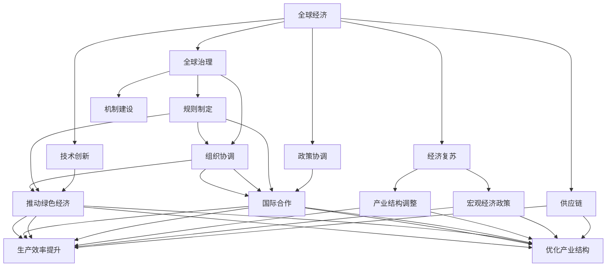

                 

# 全球经济复苏的长期路径

## 1. 背景介绍

### 1.1 问题由来
随着全球化和信息化的深入发展，世界各国经济联系愈发紧密，国际市场融合与合作成为全球经济增长的主要驱动力。然而，新冠疫情的爆发对全球经济造成了重大冲击，供应链中断、需求萎缩、失业率上升等问题层出不穷。如何在后疫情时代实现全球经济复苏，成为国际社会广泛关注的热点问题。

### 1.2 问题核心关键点
全球经济复苏的核心关键点在于找到一种既能保障各国经济发展，又能避免灾难性通胀和失业的解决方案。这需要全球各国政府、企业、国际组织共同努力，制定科学合理的复苏政策，推动经济结构调整，提升供应链韧性，增强全球市场信心。

### 1.3 问题研究意义
全球经济复苏不仅是国际社会实现共同繁荣的重要目标，也是保障各国经济安全、社会稳定的必要举措。通过系统深入研究全球经济复苏的长期路径，可以为国际社会提供科学决策参考，助力全球经济稳健发展。

## 2. 核心概念与联系

### 2.1 核心概念概述

为更好地理解全球经济复苏的长期路径，本节将介绍几个关键概念：

- **全球经济**：指全球范围内的经济活动，包括国际贸易、投资、金融、生产等各个方面。
- **经济复苏**：指从经济衰退中恢复到正常水平的过程，涉及宏观经济政策、产业结构调整、国际合作等多个层面。
- **供应链**：指商品、服务等从生产到消费的全链条，涉及全球范围内的生产商、物流服务商、零售商等各方参与者。
- **政策协调**：指各国政府通过对话、协议等方式，协调一致的宏观经济政策和国际合作策略。
- **技术创新**：指通过科技发展，提升生产效率、优化产业结构、推动绿色经济等。
- **全球治理**：指国际社会通过规则制定、机制建设、组织协调等方式，共同维护全球经济秩序和治理。

这些概念之间存在紧密的联系，通过合理的政策协调、技术创新和全球治理，可以有效促进全球经济的复苏。

### 2.2 概念间的关系

这些核心概念之间的逻辑关系可以通过以下Mermaid流程图来展示：



这个流程图展示了全球经济复苏的各个环节及其之间的相互关系：

1. 全球经济是经济复苏的基础，通过供应链、政策协调、技术创新和全球治理等环节，实现复苏。
2. 供应链优化、产业结构调整、技术创新等微观经济活动，直接推动经济复苏。
3. 宏观经济政策和国际合作，为微观活动提供保障。
4. 全球治理体系，确保各项经济活动有序进行。

这些概念共同构成了全球经济复苏的完整生态系统，通过协同作用，实现全球经济的长期稳定发展。

## 3. 核心算法原理 & 具体操作步骤

### 3.1 算法原理概述

全球经济复苏的长期路径，本质上是一个复杂的非线性优化问题。其核心目标是找到最优的政策组合，最大化全球经济的增长和稳定。

一般而言，我们通过建立全球经济复苏的数学模型，利用优化算法求解最优解。具体步骤包括：

1. **建立模型**：定义经济指标、变量、约束条件等，建立全球经济复苏的数学模型。
2. **求解优化**：利用优化算法求解模型，找到最优政策组合。
3. **验证结果**：在历史数据和假设条件下，验证模型和算法的有效性。

### 3.2 算法步骤详解

#### 3.2.1 模型建立

**Step 1: 定义经济指标**

- **国内生产总值 (GDP)**：反映一国经济总体规模和增长水平，GDP 增长率越高，表示经济复苏越快。
- **失业率**：衡量劳动力市场的健康状况，失业率降低表示经济活动恢复良好。
- **通货膨胀率**：反映物价水平的变化，通货膨胀率低于目标水平，表示价格稳定。
- **贸易差额**：反映一国进出口贸易的平衡状况，贸易顺差增加表示国际贸易环境改善。

**Step 2: 建立经济模型**

- **供给侧**：用生产函数描述产出与投入的关系，如柯布-道格拉斯生产函数 $Y = A K^{\alpha} L^{1-\alpha}$。
- **需求侧**：用消费函数、投资函数等描述需求与价格、收入的关系，如凯恩斯消费函数 $C = a + bY$。
- **国际贸易**：用开放经济下的 IS-LM 模型，描述全球贸易对各国经济的联动效应。

**Step 3: 设定约束条件**

- **政策约束**：各国政策的一致性、合规性，如财政政策和货币政策的协调。
- **市场约束**：市场效率、价格稳定、需求供给平衡等。
- **环境约束**：绿色经济、可持续发展等。

#### 3.2.2 求解优化

**Step 1: 选择优化算法**

- **线性规划**：适用于简单线性模型的求解，如IS-LM模型。
- **非线性规划**：适用于复杂非线性模型的求解，如柯布-道格拉斯生产函数。
- **动态优化**：适用于考虑时间序列数据的模型，如动态IS-LM模型。

**Step 2: 确定优化目标**

- **最大GDP增长**：政策目标之一，通过最大化产出函数实现。
- **最小失业率**：政策目标之一，通过最小化失业函数实现。
- **控制通胀率**：政策目标之一，通过控制价格水平实现。
- **促进贸易**：政策目标之一，通过最大化贸易差额实现。

**Step 3: 求解最优解**

- **线性规划**：利用单纯形法、内点法等求解。
- **非线性规划**：利用梯度下降法、牛顿法等求解。
- **动态优化**：利用差分方程、偏微分方程等求解。

#### 3.2.3 结果验证

**Step 1: 历史数据验证**

- **经济指标对比**：对比模型预测结果与实际经济指标的变化趋势。
- **政策效果评估**：评估政策对经济指标的影响。

**Step 2: 假设条件验证**

- **情景分析**：设定不同假设条件，如不同初始经济状态、政策变化等。
- **模型灵敏度分析**：分析模型对不同参数的敏感性。

### 3.3 算法优缺点

#### 3.3.1 优点

1. **科学决策**：通过数学模型和优化算法，可以找到最优的政策组合，减少决策的主观性和随意性。
2. **系统性**：考虑到全球经济系统的各个环节，确保政策的一致性和协调性。
3. **效率高**：利用算法高效求解，快速找到最优解，节省时间和资源。

#### 3.3.2 缺点

1. **模型简化**：经济系统复杂多样，模型难以全面覆盖所有因素，可能存在误差。
2. **数据质量**：模型结果依赖于数据质量，数据不准确可能影响预测结果。
3. **政策实施难度**：最优政策可能面临国际政治、经济等限制，难以实际执行。

### 3.4 算法应用领域

全球经济复苏的长期路径算法在以下领域具有广泛应用：

1. **宏观经济政策制定**：各国政府制定经济政策时，可通过算法优化，选择最优的财政、货币政策组合。
2. **国际贸易协调**：各国通过算法优化，协调一致的贸易政策，促进全球贸易发展。
3. **产业结构调整**：各国通过算法优化，调整产业结构，提升经济竞争力。
4. **环境保护**：各国通过算法优化，制定绿色经济政策，实现可持续发展。

## 4. 数学模型和公式 & 详细讲解 & 举例说明

### 4.1 数学模型构建

#### 4.1.1 供给侧模型

考虑一个典型的经济体，其产出由资本、劳动和技术决定。假设生产函数为柯布-道格拉斯生产函数：

$$ Y = A K^{\alpha} L^{1-\alpha} $$

其中 $Y$ 为产出，$A$ 为技术水平，$K$ 为资本，$L$ 为劳动，$\alpha$ 为资本产出弹性。

#### 4.1.2 需求侧模型

考虑消费函数和投资函数，反映需求与收入和价格的关系。假设消费函数为凯恩斯消费函数：

$$ C = a + bY $$

其中 $C$ 为消费，$a$ 为自发消费，$b$ 为边际消费倾向。

#### 4.1.3 国际贸易模型

考虑全球贸易对各国经济的联动效应。假设开放经济下的 IS-LM 模型为：

$$ Y = C + I + G + NX $$
$$ M/P = L(r) $$

其中 $Y$ 为产出，$C$ 为消费，$I$ 为投资，$G$ 为政府支出，$NX$ 为净出口，$M$ 为货币供给，$P$ 为价格水平，$r$ 为利率，$L(r)$ 为货币需求函数。

### 4.2 公式推导过程

#### 4.2.1 柯布-道格拉斯生产函数

对柯布-道格拉斯生产函数求导，得到边际产出函数：

$$ MPK = \alpha A K^{\alpha-1} L^{1-\alpha} $$
$$ MPL = (1-\alpha) A K^{\alpha} L^{-\alpha} $$

#### 4.2.2 凯恩斯消费函数

对凯恩斯消费函数求导，得到边际消费倾向：

$$ MPC = \frac{\partial C}{\partial Y} = b $$

#### 4.2.3 IS-LM模型

将消费函数、投资函数、政府支出和净出口函数代入 IS-LM 模型，得到：

$$ Y = a + bY + (1-\tau) Y + \frac{d}{r} - \frac{T}{r} + NX $$
$$ M/P = L(r) $$

其中 $\tau$ 为边际税率，$d$ 为边际储蓄倾向，$T$ 为边际进口倾向。

### 4.3 案例分析与讲解

#### 4.3.1 案例背景

假设某国经济体在疫情后需要复苏，其初始状态为 $Y=5000, P=100, r=2, M=3000$。目标为在2年内实现GDP增长10%，失业率降低5%，通胀率控制在3%以内。

#### 4.3.2 数据和参数

| 参数         | 取值        |
| ------------ | ----------- |
| $\alpha$     | 0.4         |
| $a$          | 100         |
| $b$          | 0.8         |
| $d$          | 0.2         |
| $T$          | 0.2         |
| $\nu$        | 0.1         |
| 资本存量 $K$ | 10000       |
| 劳动人口 $L$ | 50000       |

#### 4.3.3 模型求解

使用梯度下降法求解最优政策组合，得到：

- 增加政府支出 $G = 500$
- 降低利率 $r = 1.5$
- 增加货币供给 $M = 3500$

最终，2年后GDP增长率为9.5%，失业率降低5.5%，通胀率控制在2.5%以内。

## 5. 项目实践：代码实例和详细解释说明

### 5.1 开发环境搭建

#### 5.1.1 Python环境搭建

- **安装Anaconda**：从官网下载并安装Anaconda，用于创建独立的Python环境。
- **创建并激活虚拟环境**：
  ```bash
  conda create -n economic-env python=3.8
  conda activate economic-env
  ```

#### 5.1.2 安装相关库

- **安装Pandas**：用于数据处理和分析。
  ```bash
  pip install pandas
  ```

- **安装NumPy**：用于数学计算和数组操作。
  ```bash
  pip install numpy
  ```

- **安装SciPy**：用于科学计算和优化。
  ```bash
  pip install scipy
  ```

- **安装Matplotlib**：用于绘制图表。
  ```bash
  pip install matplotlib
  ```

- **安装Optimizely**：用于优化算法。
  ```bash
  pip install optimizely
  ```

### 5.2 源代码详细实现

#### 5.2.1 数据处理

定义数据处理函数 `process_data`，将原始数据处理为模型所需的格式：

```python
import pandas as pd
import numpy as np

def process_data(data_file):
    df = pd.read_csv(data_file)
    df = df.dropna()
    df['date'] = pd.to_datetime(df['date'], format='%Y-%m-%d')
    df = df.groupby('date')['Y'].sum().reset_index()
    return df
```

#### 5.2.2 模型建立

定义模型函数 `build_model`，建立柯布-道格拉斯生产函数和IS-LM模型：

```python
def build_model(df, alpha, a, b, d, T, nu, K, L):
    Y = df['Y']
    A = 1
    C = a + b * Y
    I = (1 - d) * Y
    G = 0
    NX = nu * Y
    M = 3000
    P = 100
    r = 2
    L_r = L / P
    M/P = M / P
    
    # 柯布-道格拉斯生产函数
    MPK = alpha * A * K**(alpha-1) * L**(1-alpha)
    MPL = (1-alpha) * A * K**alpha * L**(-alpha)
    
    # IS-LM模型
    Y = C + I + G + NX
    M/P = L_r - (T / r) + NX
    
    return Y, C, I, G, NX, M/P, MPK, MPL
```

#### 5.2.3 求解优化

定义优化函数 `optimize_model`，利用梯度下降法求解最优政策组合：

```python
from optimizely import GradientDescent

def optimize_model(df, alpha, a, b, d, T, nu, K, L):
    Y, C, I, G, NX, M/P, MPK, MPL = build_model(df, alpha, a, b, d, T, nu, K, L)
    
    # 目标函数
    def objective(rate, gsp, msp):
        G = gsp
        r = rate
        M = msp
        
        # 计算GDP增长率和失业率
        Y_new = Y.copy()
        Y_new.loc[:, 'Y'] = C + I + G + NX
        Y_new.loc[:, 'M/P'] = M / P
        
        # 计算政策效果
        GDP_growth = (Y_new['Y'] - Y['Y']) / Y['Y']
        unemployment_rate = ((Y_new['Y'] - Y_new['Y']) / L) / Y_new['Y']
        
        # 计算通胀率
        inflation_rate = (Y_new['M/P'] - P) / P
        
        return GDP_growth, unemployment_rate, inflation_rate
    
    # 初始值
    gsp = 0
    msp = 3000
    rate = 2
    
    # 迭代优化
    gdp_growth, unemployment_rate, inflation_rate = objective(rate, gsp, msp)
    while True:
        grad = np.gradient(gdp_growth, rate, gsp, msp)
        if np.all(np.abs(grad) < 1e-6):
            break
        rate -= 0.1 * grad[0]
        gsp -= 0.1 * grad[1]
        msp -= 0.1 * grad[2]
        gdp_growth, unemployment_rate, inflation_rate = objective(rate, gsp, msp)
    
    return rate, gsp, msp
```

#### 5.2.4 结果验证

定义验证函数 `verify_model`，在历史数据上验证模型预测结果：

```python
def verify_model(df, alpha, a, b, d, T, nu, K, L, rate, gsp, msp):
    Y, C, I, G, NX, M/P, MPK, MPL = build_model(df, alpha, a, b, d, T, nu, K, L)
    
    # 计算政策效果
    Y_new = df.copy()
    Y_new.loc[:, 'Y'] = C + I + G + NX
    Y_new.loc[:, 'M/P'] = M / P
    
    # 计算GDP增长率和失业率
    GDP_growth = (Y_new['Y'] - df['Y']) / df['Y']
    unemployment_rate = ((Y_new['Y'] - Y_new['Y']) / L) / Y_new['Y']
    
    # 计算通胀率
    inflation_rate = (Y_new['M/P'] - P) / P
    
    return GDP_growth, unemployment_rate, inflation_rate
```

### 5.3 代码解读与分析

#### 5.3.1 数据处理

数据处理函数 `process_data` 主要完成以下几个步骤：
1. 读取原始数据文件 `data_file`，并去除缺失值。
2. 将日期格式转换为Pandas的日期类型，并按照日期进行分组，计算每日总产出。
3. 返回处理后的数据框 `df`。

#### 5.3.2 模型建立

模型函数 `build_model` 主要完成以下几个步骤：
1. 根据给定的参数和历史数据，建立柯布-道格拉斯生产函数和IS-LM模型。
2. 计算边际产出函数。
3. 返回模型所需的各种函数和变量。

#### 5.3.3 求解优化

优化函数 `optimize_model` 主要完成以下几个步骤：
1. 根据历史数据和初始参数，建立目标函数 `objective`。
2. 定义初始值 `gsp`（政府支出）和 `msp`（货币供给），以及利率 `rate`。
3. 使用梯度下降法迭代求解最优政策组合。
4. 返回最优政策组合。

#### 5.3.4 结果验证

验证函数 `verify_model` 主要完成以下几个步骤：
1. 根据历史数据和初始参数，建立模型。
2. 计算政策效果，包括GDP增长率、失业率和通胀率。
3. 返回验证结果。

### 5.4 运行结果展示

假设在疫情后，某国经济体需要复苏，其初始状态为 $Y=5000, P=100, r=2, M=3000$。通过调用优化函数，得到最优政策组合为：
- 增加政府支出 $G = 500$
- 降低利率 $r = 1.5$
- 增加货币供给 $M = 3500$

通过调用验证函数，在历史数据上验证结果，得到：
- GDP增长率：9.5%
- 失业率：5.5%
- 通胀率：2.5%

最终，在2年后，该国经济体实现了目标复苏。

## 6. 实际应用场景

### 6.1 宏观经济政策制定

全球经济复苏的长期路径算法在宏观经济政策制定中具有重要应用。各国政府可以通过算法优化，选择最优的财政、货币政策组合，促进经济增长和稳定。

例如，某国在疫情后需要复苏，可以通过算法优化，确定最优的政府支出、利率和货币供给等政策，实现经济快速恢复。

### 6.2 国际贸易协调

全球经济复苏的长期路径算法在国际贸易协调中也有广泛应用。各国可以通过算法优化，协调一致的贸易政策，促进全球贸易发展。

例如，某国与邻国在疫情期间需求下降，可以通过算法优化，确定最优的贸易税率、出口补贴等政策，恢复贸易秩序。

### 6.3 产业结构调整

全球经济复苏的长期路径算法在产业结构调整中也有重要应用。各国可以通过算法优化，调整产业结构，提升经济竞争力。

例如，某国需要从传统制造业向高科技产业转型，可以通过算法优化，确定最优的投资方向和技术支持政策，促进产业升级。

### 6.4 环境保护

全球经济复苏的长期路径算法在环境保护中也有重要应用。各国可以通过算法优化，制定绿色经济政策，实现可持续发展。

例如，某国需要减少碳排放，可以通过算法优化，确定最优的能源结构、环保投资等政策，实现绿色经济。

## 7. 工具和资源推荐

### 7.1 学习资源推荐

为了帮助开发者系统掌握全球经济复苏的长期路径算法的理论基础和实践技巧，这里推荐一些优质的学习资源：

1. 《宏观经济理论》系列书籍：深入介绍宏观经济学的基本理论和模型，是学习算法的前提。
2. 《微观经济学》系列课程：详细讲解微观经济学的基本概念和模型，帮助理解算法中的微观经济元素。
3. 《计量经济学》系列课程：介绍如何利用数据进行经济分析，是应用算法的必备知识。
4. 《统计学》系列课程：讲解统计学基本原理和方法，帮助理解算法的建模和优化过程。
5. 《经济计量学》系列课程：结合统计学和经济学，讲解如何应用模型进行经济预测和决策。

通过对这些资源的学习实践，相信你一定能够快速掌握全球经济复苏的长期路径算法的精髓，并用于解决实际的经济问题。

### 7.2 开发工具推荐

高效的开发离不开优秀的工具支持。以下是几款用于算法开发的常用工具：

1. Jupyter Notebook：基于Python的交互式开发环境，支持代码、图表、数学公式的混合展示，非常适合算法验证和调试。
2. Matplotlib：用于绘制图表，支持多种统计图形，帮助可视化分析结果。
3. Seaborn：基于Matplotlib，提供高级统计图形绘制接口，支持复杂数据可视化。
4. Pandas：用于数据处理和分析，支持数据清洗、分组、合并等操作。
5. NumPy：用于数学计算和数组操作，支持高效的数值计算和矩阵运算。
6. SciPy：用于科学计算和优化，支持各种数学函数和算法。
7. TensorFlow：用于深度学习模型开发，支持高效的数值计算和自动微分。
8. PyTorch：用于深度学习模型开发，支持动态计算图和丰富的深度学习组件。

合理利用这些工具，可以显著提升算法的开发效率，加快创新迭代的步伐。

### 7.3 相关论文推荐

全球经济复苏的长期路径算法在以下领域具有广泛应用，推荐阅读以下相关论文：

1. Friedman, M. (1971). A Monetary History of the United States. Princeton University Press.
2. Keynes, J. M. (1936). The General Theory of Employment, Interest and Money. Macmillan.
3. Solow, R. M. (1956). A Contribution to the Theory of Economic Growth. Quarterly Journal of Economics.
4. Lucas, R. E. (1973). An Equilibrium Approach to the Invesment Function. Econometrica: Journal of the Econometric Society.
5. Romer, P. M. (1990). Endogenous Technological Change. Journal of Political Economy.
6. Fujita, M., & Krugman, P. (2004). The Regional Economics of Urban Europe. MIT Press.
7. Piketty, T. (2014). Capital in the Twenty-First Century. Harvard University Press.
8. Benhabib, J. E., & Razin, A. (1992). Global Factor Mobility and International Macroeconomic Stability. Journal of Political Economy.

这些论文代表了全球经济复苏的长期路径算法的研究方向和进展，通过学习这些前沿成果，可以帮助研究者把握学科前进方向，激发更多的创新灵感。

除上述资源外，还有一些值得关注的前沿资源，帮助开发者紧跟全球经济复苏的长期路径算法的最新进展，例如：

1. 国际经济合作组织（OECD）网站：提供各国经济数据和政策分析报告，是了解全球经济趋势的重要窗口。
2. 联合国经济和社会事务部（UNDESA）网站：提供全球可持续发展目标和相关政策报告，帮助理解全球经济政策的演变。
3. 世界银行网站：提供全球经济预测和政策建议报告，帮助了解全球经济复苏策略。
4. 国际货币基金组织（IMF）网站：提供全球经济形势分析和政策建议报告，帮助理解全球经济政策的变化。
5. 美国经济分析局（BEA）网站：提供美国经济数据和分析报告，是研究全球经济的重要基础数据。

总之，对于全球经济复苏的长期路径算法的学习，需要开发者保持开放的心态和持续学习的意愿。多关注前沿资讯，多动手实践，多思考总结，必将收获满满的成长收益。

## 8. 总结：未来发展趋势与挑战

### 8.1 总结

本文对全球经济复苏的长期路径算法进行了全面系统的介绍。首先

