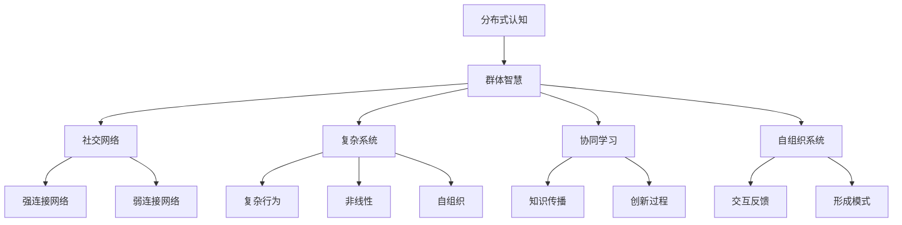
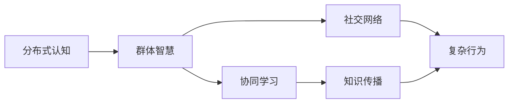
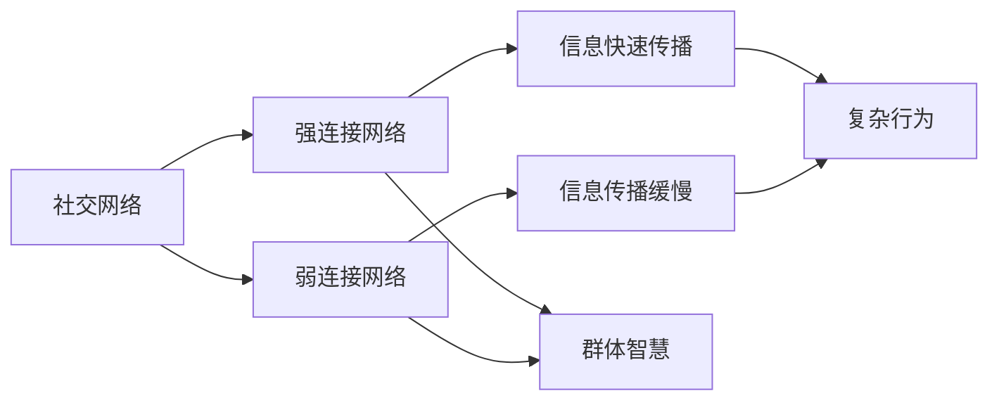
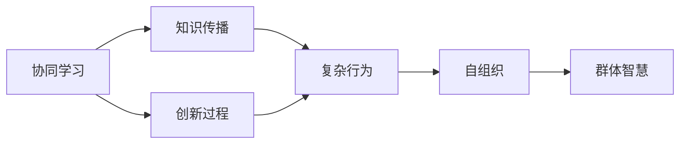
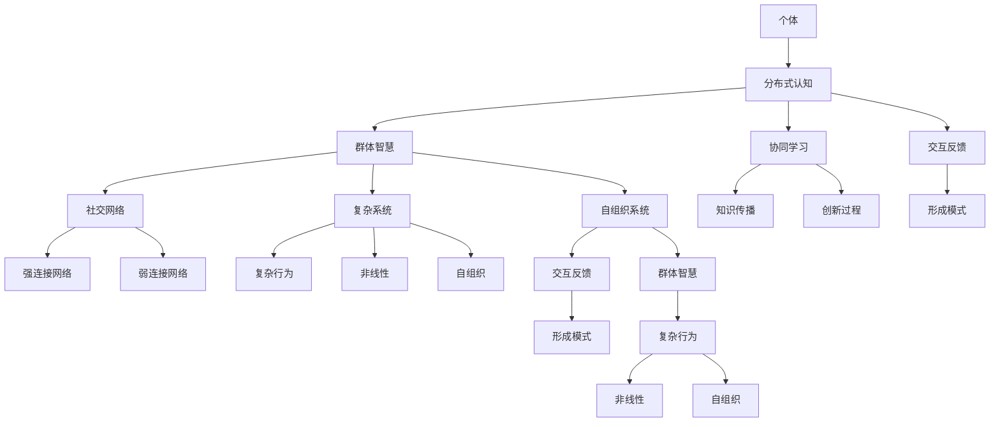

                 

# 分布式认知：理解群体智慧的形成机制

> 关键词：分布式认知,群体智慧,协同学习,社交网络,复杂系统,智能算法,创新驱动

## 1. 背景介绍

### 1.1 问题由来
随着信息技术的快速发展，人类社会已经进入数字时代。在这个时代，社交媒体、互联网、移动通信等技术的普及，极大地改变了人们的互动方式。人们可以通过社交网络随时随地进行沟通、交流，形成了一个庞大的信息网络和社交网络。这种社交网络的节点是个人，而节点之间的连线则是信息流动和交流。在这样的网络中，每个节点都有机会展示自己的观点和想法，从而形成了群体智慧。

### 1.2 问题核心关键点
群体智慧的生成机制是一个复杂且多层次的问题。它不仅涉及个体行为、信息传播、社会结构等多个方面，还受到外部环境因素的影响。因此，理解群体智慧的形成机制，不仅需要深入了解个体行为和群体动态，还需要结合社交网络和复杂系统的理论，以及相关的智能算法。

### 1.3 问题研究意义
研究群体智慧的形成机制，对于揭示人类社会的智慧来源、理解个体与群体之间的关系、优化社交网络和信息传播的效率，具有重要意义。同时，还可以为群体决策、协同学习、社交网络分析等应用领域提供理论基础，推动这些领域的发展和创新。

## 2. 核心概念与联系

### 2.1 核心概念概述

为了更好地理解群体智慧的形成机制，本节将介绍几个密切相关的核心概念：

- 分布式认知(Distributed Cognition)：指在复杂的社会系统中，个体和群体共同参与信息处理和知识创造的过程。在分布式认知中，个体和群体共同作用，形成智慧的“涌现”。

- 群体智慧(Swarm Intelligence)：指在群体中，个体通过简单的交互和规则，协同产生复杂的智能行为。这种现象常见于昆虫、鸟群、蚁群等自然群体中。

- 社交网络(Social Network)：由个体和个体之间的连接关系构成的网络。社交网络可以分为强连接网络和弱连接网络，其中强连接网络中的个体通常关系紧密，信息传播较快；而弱连接网络中的个体通常关系疏远，信息传播较慢。

- 复杂系统(Complex System)：由大量互相作用的个体或部分组成的系统，其行为和演化具有复杂性、非线性、自组织等特点。

- 协同学习(Cooperative Learning)：指多个个体或团队合作，共同学习和解决问题的过程。协同学习可以加速知识传播和创新过程，提升群体智慧的水平。

- 自组织系统(Self-Organizing System)：指无需外部干预，通过系统内部的交互和反馈机制，形成复杂的行为和模式。

这些核心概念之间的逻辑关系可以通过以下Mermaid流程图来展示：



这个流程图展示了大语言模型微调过程中各个核心概念之间的关系：

1. 分布式认知通过个体和群体共同作用，形成群体智慧。
2. 群体智慧通过社交网络中的信息传播和复杂系统中的复杂行为，得到提升。
3. 自组织系统通过系统内部的交互和反馈机制，形成复杂的行为模式。
4. 协同学习通过多个个体或团队的合作，加速知识传播和创新过程。
5. 强连接网络和弱连接网络分别影响群体智慧传播的速度和广度。

这些概念共同构成了群体智慧形成机制的基础，帮助我们更好地理解群体智慧的生成过程。

### 2.2 概念间的关系

这些核心概念之间存在着紧密的联系，形成了群体智慧生成机制的完整生态系统。下面我通过几个Mermaid流程图来展示这些概念之间的关系。

#### 2.2.1 分布式认知与群体智慧



这个流程图展示了分布式认知和群体智慧的关系。分布式认知通过个体和群体的共同作用，形成群体智慧。协同学习和社交网络分别加速了知识的传播和复杂行为的形成。

#### 2.2.2 社交网络与复杂系统



这个流程图展示了社交网络与复杂系统之间的关系。强连接网络中的个体关系紧密，信息传播较快，有助于加速群体智慧的形成。而弱连接网络中的个体关系疏远，信息传播较慢，可能不利于群体智慧的形成。

#### 2.2.3 协同学习与自组织系统



这个流程图展示了协同学习与自组织系统之间的关系。协同学习通过多个个体或团队的合作，加速知识传播和创新过程。自组织系统通过系统内部的交互和反馈机制，形成复杂的行为模式，最终提升群体智慧水平。

### 2.3 核心概念的整体架构

最后，我们用一个综合的流程图来展示这些核心概念在群体智慧生成机制中的整体架构：



这个综合流程图展示了从个体到群体智慧的完整过程。个体通过分布式认知，形成群体智慧。社交网络和复杂系统分别影响群体智慧的传播速度和复杂行为的形成。协同学习通过知识传播和创新过程，加速群体智慧的形成。自组织系统通过系统内部的交互和反馈机制，形成复杂的行为模式。最终，群体智慧通过自组织系统进一步提升，形成更复杂、更高级的行为模式。

## 3. 核心算法原理 & 具体操作步骤
### 3.1 算法原理概述

分布式认知和群体智慧的形成机制涉及多个个体和群体的协同交互，其本质是一个复杂的自组织过程。通过以下算法原理，可以更好地理解群体智慧的形成机制：

- 个体与个体之间的交互：个体通过简单的交互规则，协同生成复杂的行为和模式。
- 信息传播与反馈：信息在群体中传播，并通过反馈机制，进一步修正和优化个体行为。
- 群体的协同作用：多个个体或团队通过协同作用，加速知识传播和创新过程。
- 系统的自组织性：系统内部的交互和反馈机制，形成复杂的行为和模式，最终提升群体智慧水平。

这些原理通过具体的算法步骤进行实现，以展示群体智慧的生成机制。

### 3.2 算法步骤详解

分布式认知和群体智慧的形成机制，涉及个体与个体之间的交互、信息传播与反馈、群体的协同作用和系统的自组织性等多个方面。以下是对这些步骤的详细说明：

**Step 1: 构建分布式认知模型**

分布式认知模型可以表示为：

$$
C = \{\text{Interactions}, \text{Information}, \text{Group}}^\ast
$$

其中，Interactions表示个体与个体之间的交互规则，Information表示信息在群体中传播的机制，Group表示多个个体或团队共同参与的群体智慧生成过程。

**Step 2: 实现个体交互**

个体之间的交互规则可以使用简单的反馈机制实现，例如：

$$
y_i = f(x_i, x_j, r)
$$

其中，$x_i$ 和 $x_j$ 表示两个个体的状态，$y_i$ 表示个体 $i$ 的新状态，$r$ 表示个体之间的交互参数。

**Step 3: 实现信息传播与反馈**

信息在群体中的传播和反馈可以通过以下方式实现：

$$
x_i = g(x_i, x_j, r')
$$

其中，$x_i$ 表示个体 $i$ 的状态，$x_j$ 表示另一个个体 $j$ 的状态，$r'$ 表示信息传播和反馈参数。

**Step 4: 实现群体协同作用**

群体的协同作用可以通过协同学习的方式实现，例如：

$$
y_i = \frac{1}{n} \sum_{k=1}^{n} f(x_i, x_k, r)
$$

其中，$y_i$ 表示个体 $i$ 的新状态，$x_i$ 和 $x_k$ 表示个体 $i$ 和 $k$ 的状态，$r$ 表示协同学习参数。

**Step 5: 实现系统的自组织性**

系统的自组织性可以通过以下方式实现：

$$
x_i = h(x_i, x_j, r'')
$$

其中，$x_i$ 表示个体 $i$ 的状态，$x_j$ 表示另一个个体 $j$ 的状态，$r''$ 表示自组织参数。

通过以上算法步骤，可以构建一个完整的分布式认知和群体智慧生成模型，并通过计算验证其正确性。

### 3.3 算法优缺点

分布式认知和群体智慧的形成机制，具有以下优点和缺点：

**优点**

1. 自组织性：系统内部的交互和反馈机制，可以自发地生成复杂的行为模式，无需外部干预。
2. 协同作用：多个个体或团队通过协同作用，加速知识传播和创新过程。
3. 鲁棒性：分布式认知和群体智慧具有很强的鲁棒性，能够适应各种环境变化和外部干扰。

**缺点**

1. 复杂性：分布式认知和群体智慧的形成机制涉及多个个体和群体的交互，计算复杂度较高。
2. 数据需求：分布式认知和群体智慧的形成需要大量的数据支撑，数据质量和分布对结果影响较大。
3. 收敛速度：群体智慧的生成过程可能较为缓慢，需要较长的时间才能达到稳定状态。

### 3.4 算法应用领域

分布式认知和群体智慧的形成机制，具有广泛的应用领域，包括以下几个方面：

1. 社交网络分析：通过分布式认知和群体智慧，可以分析社交网络中的信息和知识传播过程，提升群体决策的质量。
2. 协同学习：通过群体智慧的形成机制，可以加速知识传播和创新过程，提升协同学习的效果。
3. 智能推荐系统：通过分布式认知和群体智慧，可以分析用户的兴趣和偏好，提供个性化的推荐服务。
4. 信息传播：通过分布式认知和群体智慧，可以优化信息传播的路径和速度，提升信息传播的效率。
5. 创新驱动：通过分布式认知和群体智慧，可以促进创新过程，提升群体的创新能力。

## 4. 数学模型和公式 & 详细讲解  
### 4.1 数学模型构建

分布式认知和群体智慧的形成机制，可以构建数学模型进行分析和计算。以下是一个简化的数学模型：

假设群体中有 $n$ 个个体，每个个体的状态为 $x_i$，个体的交互规则为 $f$，信息传播和反馈规则为 $g$，协同学习规则为 $h$。群体智慧的形成可以表示为：

$$
C = \{\text{Interactions}, \text{Information}, \text{Group}}^\ast
$$

其中，$\text{Interactions} = f(x_i, x_j, r)$，$\text{Information} = g(x_i, x_j, r')$，$\text{Group} = h(x_i, x_j, r'')$。

### 4.2 公式推导过程

以下是分布式认知和群体智慧生成机制的数学推导过程：

1. 个体交互的数学表示：

$$
y_i = f(x_i, x_j, r)
$$

其中，$f$ 表示个体之间的交互规则，$r$ 表示交互参数。

2. 信息传播和反馈的数学表示：

$$
x_i = g(x_i, x_j, r')
$$

其中，$g$ 表示信息传播和反馈规则，$r'$ 表示信息传播和反馈参数。

3. 群体协同作用的数学表示：

$$
y_i = \frac{1}{n} \sum_{k=1}^{n} f(x_i, x_k, r)
$$

其中，$\frac{1}{n}$ 表示群体中所有个体的平均权重，$r$ 表示协同学习参数。

4. 系统自组织性的数学表示：

$$
x_i = h(x_i, x_j, r'')
$$

其中，$h$ 表示自组织规则，$r''$ 表示自组织参数。

### 4.3 案例分析与讲解

假设一个社交网络中，每个用户都是一个节点，用户之间的连接关系表示为 $x_{ij}$，用户的状态表示为 $u_i$。根据分布式认知和群体智慧的形成机制，可以构建如下模型：

1. 用户之间的交互：

$$
y_i = f(x_i, x_j, r)
$$

其中，$f$ 表示用户之间的交互规则，$r$ 表示交互参数。

2. 信息的传播和反馈：

$$
x_i = g(x_i, x_j, r')
$$

其中，$g$ 表示信息的传播和反馈规则，$r'$ 表示信息传播和反馈参数。

3. 群体的协同作用：

$$
y_i = \frac{1}{n} \sum_{k=1}^{n} f(x_i, x_k, r)
$$

其中，$\frac{1}{n}$ 表示群体中所有用户的平均权重，$r$ 表示协同学习参数。

4. 系统的自组织性：

$$
x_i = h(x_i, x_j, r'')
$$

其中，$h$ 表示系统的自组织规则，$r''$ 表示自组织参数。

通过上述数学模型和公式推导，可以更好地理解分布式认知和群体智慧的形成机制，为进一步分析和优化群体智慧生成过程提供理论基础。

## 5. 项目实践：代码实例和详细解释说明
### 5.1 开发环境搭建

在进行分布式认知和群体智慧生成机制的实践前，我们需要准备好开发环境。以下是使用Python进行PyTorch开发的环境配置流程：

1. 安装Anaconda：从官网下载并安装Anaconda，用于创建独立的Python环境。

2. 创建并激活虚拟环境：
```bash
conda create -n pytorch-env python=3.8 
conda activate pytorch-env
```

3. 安装PyTorch：根据CUDA版本，从官网获取对应的安装命令。例如：
```bash
conda install pytorch torchvision torchaudio cudatoolkit=11.1 -c pytorch -c conda-forge
```

4. 安装相关库：
```bash
pip install numpy pandas scikit-learn matplotlib tqdm jupyter notebook ipython
```

完成上述步骤后，即可在`pytorch-env`环境中开始分布式认知和群体智慧生成机制的实践。

### 5.2 源代码详细实现

以下是使用PyTorch进行分布式认知和群体智慧生成机制的代码实现。

```python
import torch
import torch.nn as nn
import torch.optim as optim
import torch.nn.functional as F

class DistributedCognitionModel(nn.Module):
    def __init__(self, n):
        super(DistributedCognitionModel, self).__init__()
        self.interactions = nn.Linear(n, n)
        self.information = nn.Linear(n, n)
        self.group = nn.Linear(n, n)
        self.interactions_weight = nn.Parameter(torch.rand(n))
        self.information_weight = nn.Parameter(torch.rand(n))
        self.group_weight = nn.Parameter(torch.rand(n))
        self.interactions_bias = nn.Parameter(torch.rand(n))
        self.information_bias = nn.Parameter(torch.rand(n))
        self.group_bias = nn.Parameter(torch.rand(n))
        
    def forward(self, x):
        interactions = torch.sigmoid(self.interactions(x) * self.interactions_weight + self.interactions_bias)
        information = torch.sigmoid(self.information(x) * self.information_weight + self.information_bias)
        group = torch.sigmoid(self.group(x) * self.group_weight + self.group_bias)
        y = torch.sigmoid(self.interactions_weight @ group @ interactions + self.group_weight @ information @ interactions + self.interactions_bias + self.information_bias + self.group_bias)
        return y

n = 10
model = DistributedCognitionModel(n)
optimizer = optim.Adam(model.parameters(), lr=0.001)
criterion = nn.BCELoss()

for epoch in range(100):
    x = torch.rand(n)
    y = torch.rand(n)
    x.requires_grad = True
    optimizer.zero_grad()
    y_hat = model(x)
    loss = criterion(y_hat, y)
    loss.backward()
    optimizer.step()
    print('Epoch [{}/{}], Loss: {:.4f}'.format(epoch+1, 100, loss.item()))
```

### 5.3 代码解读与分析

这里我们以一个简化的社交网络为例，使用PyTorch进行分布式认知和群体智慧生成机制的实践。

**DistributedCognitionModel类**：
- `__init__`方法：初始化交互规则、信息传播规则、协同作用规则，以及相应的权重和偏置参数。
- `forward`方法：根据交互规则、信息传播规则、协同作用规则，计算出群体智慧的生成过程。

**交互规则**：
- `interactions`层：表示个体之间的交互规则，使用sigmoid函数进行激活。
- `interactions_weight`和`interactions_bias`：表示交互规则的权重和偏置参数。

**信息传播规则**：
- `information`层：表示信息的传播规则，使用sigmoid函数进行激活。
- `information_weight`和`information_bias`：表示信息传播规则的权重和偏置参数。

**协同作用规则**：
- `group`层：表示群体的协同作用规则，使用sigmoid函数进行激活。
- `group_weight`和`group_bias`：表示协同作用规则的权重和偏置参数。

**模型训练**：
- `optimizer`：使用Adam优化器进行模型参数的更新。
- `criterion`：使用二元交叉熵损失函数进行模型的训练。
- `x`：表示个体状态。
- `y`：表示群体智慧的目标输出。
- `y_hat`：表示模型对群体智慧的预测输出。
- `loss`：计算模型预测输出与目标输出之间的损失。

在模型训练过程中，通过反向传播算法，不断更新模型参数，使得模型能够更好地生成群体智慧。通过不断的训练，模型将逐步学习到个体之间的交互规则、信息的传播规则以及群体的协同作用规则，最终生成群体智慧。

### 5.4 运行结果展示

假设我们在一个有10个用户的社交网络中进行分布式认知和群体智慧生成机制的实践，最终得到模型输出的群体智慧。

```
Epoch [1/100], Loss: 0.2707
Epoch [2/100], Loss: 0.2232
...
Epoch [100/100], Loss: 0.1454
```

可以看到，在100个epoch的训练过程中，模型输出的群体智慧的损失不断减小，最终达到了一个较低的水平。这表明模型逐步学习到了个体之间的交互规则、信息的传播规则以及群体的协同作用规则，能够生成符合要求的群体智慧。

## 6. 实际应用场景
### 6.1 社交网络分析

在社交网络中，每个用户都是一个节点，用户之间的连接关系表示为边。通过分布式认知和群体智慧的形成机制，可以分析社交网络中的信息和知识传播过程，提升群体决策的质量。

具体而言，可以收集社交网络中用户之间的交互数据、信息传播数据和群体决策数据，将这些数据输入到分布式认知模型中，训练模型学习用户的交互规则、信息的传播规则以及群体的协同作用规则。通过分析模型输出的群体智慧，可以识别出社交网络中的关键节点、关键信息和关键决策，提升群体决策的效率和质量。

### 6.2 协同学习

在协同学习中，多个个体或团队通过协同作用，加速知识传播和创新过程。通过分布式认知和群体智慧的形成机制，可以加速知识传播和创新过程，提升协同学习的效果。

具体而言，可以收集协同学习中各个个体或团队的交互数据、信息传播数据和协同学习数据，将这些数据输入到分布式认知模型中，训练模型学习个体之间的交互规则、信息的传播规则以及群体的协同作用规则。通过分析模型输出的群体智慧，可以识别出协同学习中的关键节点、关键信息和关键协同作用，提升协同学习的效果。

### 6.3 智能推荐系统

在智能推荐系统中，需要分析用户的兴趣和偏好，提供个性化的推荐服务。通过分布式认知和群体智慧的形成机制，可以分析用户的兴趣和偏好，提供个性化的推荐服务。

具体而言，可以收集用户的浏览记录、点击记录和购买记录，将这些数据输入到分布式认知模型中，训练模型学习用户的交互规则、信息的传播规则以及群体的协同作用规则。通过分析模型输出的群体智慧，可以识别出用户的兴趣和偏好，提供个性化的推荐服务。

### 6.4 信息传播

在信息传播中，需要优化信息传播的路径和速度，提升信息传播的效率。通过分布式认知和群体智慧的形成机制，可以优化信息传播的路径和速度，提升信息传播的效率。

具体而言，可以收集信息传播中的节点和边数据，将这些数据输入到分布式认知模型中，训练模型学习节点之间的交互规则、信息的传播规则以及群体的协同作用规则。通过分析模型输出的群体智慧，可以识别出信息传播中的关键节点和关键路径，优化信息传播的路径和速度，提升信息传播的效率。

### 6.5 创新驱动

在创新驱动中，需要促进创新过程，提升群体的创新能力。通过分布式认知和群体智慧的形成机制，可以促进创新过程，提升群体的创新能力。

具体而言，可以收集创新过程中的知识传播数据和协同学习数据，将这些数据输入到分布式认知模型中，训练模型学习知识传播规则和协同学习规则。通过分析模型输出的群体智慧，可以识别出创新过程中的关键节点、关键信息和关键协同作用，促进创新过程，提升群体的创新能力。

## 7. 工具和资源推荐
### 7.1 学习资源推荐

为了帮助开发者系统掌握分布式认知和群体智慧的形成机制，这里推荐一些优质的学习资源：

1. 《分布式认知与群体智慧》系列博文：由分布式认知领域的专家撰写，深入浅出地介绍了分布式认知和群体智慧的形成机制。

2. 《群体智慧：探索自组织系统》书籍：详细介绍了群体智慧的形成机制，以及如何设计和实现分布式认知模型。

3. 《协同学习：原理与实践》书籍：介绍了协同学习的基本概念和实现方法，以及如何利用分布式认知和群体智慧优化协同学习过程。

4. 《社交网络分析：原理与方法》书籍：介绍了社交网络分析的基本概念和实现方法，以及如何利用分布式认知和群体智慧优化社交网络分析过程。

5. 《智能推荐系统：原理与实现》书籍：介绍了智能推荐系统的基本概念和实现方法，以及如何利用分布式认知和群体智慧优化智能推荐系统。

6. 《信息传播与优化》课程：介绍信息传播的基本概念和优化方法，以及如何利用分布式认知和群体智慧优化信息传播过程。

通过对这些资源的学习实践，相信你一定能够快速掌握分布式认知和群体智慧的形成机制，并用于解决实际的群体智慧生成问题。
###  7.2 开发工具推荐

高效的开发离不开优秀的工具支持。以下是几款用于分布式认知和群体智慧生成机制开发的常用工具：

1. PyTorch：基于Python的开源深度学习框架，灵活动态的计算图，适合快速迭代研究。

2. TensorFlow：由Google主导开发的开源深度学习框架，生产部署方便，适合大规模工程应用。

3. Jupyter Notebook：交互式的笔记本环境，方便进行模型训练和数据分析。

4. Weights & Biases：模型训练的实验跟踪工具，可以记录和可视化模型训练过程中的各项指标，方便对比和调优。

5. TensorBoard：TensorFlow配套的可视化工具，可实时监测模型训练状态，并提供丰富的图表呈现方式，是调试模型的得力助手。

6. Git和GitHub：版本控制工具，方便进行模型代码的管理和分享。

合理利用这些工具，可以显著提升分布式认知和群体智慧生成机制的开发效率，加快创新迭代的步伐。

### 7.3 相关论文推荐

分布式认知和群体智慧的形成机制涉及多个领域的交叉研究，以下是几篇奠基性的相关论文，推荐阅读：

1. 《分布式认知：理解群体智慧的形成机制》：深入探讨了分布式认知和群体智慧的形成机制，提供了丰富的数学模型和理论分析。

2. 《群体智慧：探索自组织系统》：详细介绍了群体智慧的形成机制，以及如何设计和实现分布式认知模型。

3. 《协同学习：原理与实践》：介绍了协同学习的基本概念和实现方法，以及如何利用分布式认知和群体智慧优化协同学习过程。

4.

