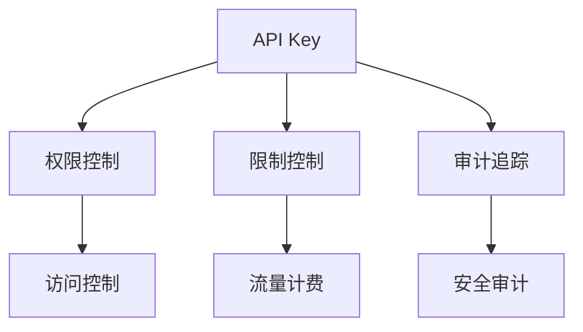
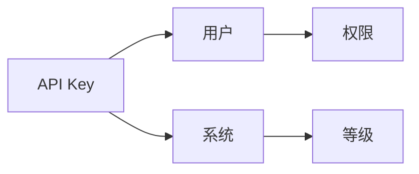
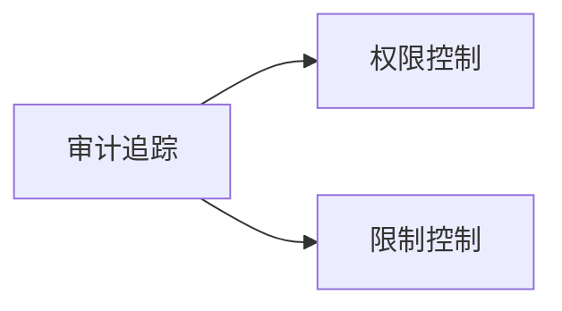
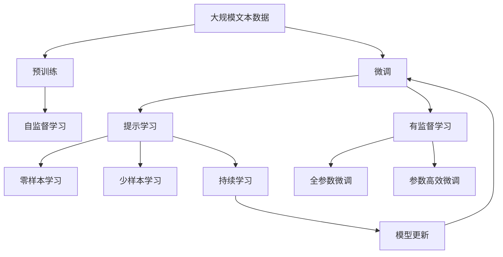

                 

# 分级 API Key 的管理

> 关键词：API Key, 分级管理, 安全, 用户权限, 审计追踪

## 1. 背景介绍

在互联网应用中，API Key 是用于识别和认证客户端身份的字符串。通常，API Key 会被用在各种场景下，例如访问控制、流量计费、数据记录等。随着API的使用越来越广泛，API Key 的安全性问题也逐渐显现出来。为了解决这一问题，分级 API Key 的管理成为了一种重要的手段。分级 API Key 通过将 API Key 分为多个等级，不同等级的 API Key 具有不同的权限和限制，以确保API的安全性和合规性。

### 1.1 问题由来

随着互联网应用的复杂性和规模的扩大，API Key 的管理变得复杂。传统的API Key 管理方式通常将一个API Key 分配给一个客户端，这个API Key 会具有全部的权限。这样的方式容易造成API被滥用、安全风险增加，尤其是在分布式系统中，API Key 的泄露和管理更加困难。为了应对这些问题，分级 API Key 的管理方法应运而生，它能够更好地管理API的权限，控制访问量，保障系统的安全。

### 1.2 问题核心关键点

分级 API Key 管理的关键点在于如何合理划分 API Key 的等级，以及如何通过不同的等级管理权限和限制。以下是分级 API Key 管理的核心要点：

- **权限分级**：将API Key 分为不同的等级，每个等级对应不同的权限。
- **限制分级**：根据API Key 等级设置不同的限制，如访问频率、请求大小、API 调用次数等。
- **审计追踪**：记录API Key 的使用情况，便于进行审计和追踪。
- **灵活性**：能够根据需求动态调整 API Key 等级和权限。

### 1.3 问题研究意义

分级 API Key 管理方法在保障API安全性和合规性的同时，还提供了灵活的权限控制机制，能够适应不同场景下的需求。这对于大型企业和互联网应用来说，尤其重要，能够减少因权限管理不当导致的安全风险和合规问题。此外，分级 API Key 管理还可以提高API的使用效率，通过限制API Key 的使用，减少恶意攻击和资源浪费。

## 2. 核心概念与联系

### 2.1 核心概念概述

在讨论分级 API Key 管理之前，需要先了解几个核心概念：

- **API Key**：用于识别和认证客户端身份的字符串，通常用于访问控制、流量计费、数据记录等场景。
- **分级管理**：将API Key 分为多个等级，每个等级具有不同的权限和限制，以保障API的安全性。
- **权限控制**：根据API Key 等级设置不同的访问权限，确保API 只能被合法的客户端使用。
- **限制控制**：根据API Key 等级设置不同的访问限制，如访问频率、请求大小、API 调用次数等。
- **审计追踪**：记录API Key 的使用情况，便于进行审计和追踪。

这些概念之间存在着密切的联系，共同构成了分级 API Key 管理的完整生态系统。下面我们将通过Mermaid流程图来展示这些概念之间的关系：



这个流程图展示了API Key 如何通过权限控制、限制控制和审计追踪来实现分级管理，以及分级管理如何应用于访问控制、流量计费和安全审计等场景。

### 2.2 概念间的关系

这些核心概念之间存在着紧密的联系，形成了分级 API Key 管理的完整生态系统。下面我通过几个Mermaid流程图来展示这些概念之间的关系。

#### 2.2.1 API Key 的分级管理



这个流程图展示了API Key 如何通过用户的身份和系统分配的等级来确定权限。API Key 的等级是由系统分配的，而权限则根据API Key 的等级来决定。

#### 2.2.2 权限控制与限制控制的关系


这个流程图展示了权限控制和限制控制之间的关系。权限控制决定了API Key 能够访问哪些资源，而限制控制则对访问频率、请求大小等进行了限制，确保API Key 的使用在合理的范围内。

#### 2.2.3 审计追踪与权限控制和限制控制的关系



这个流程图展示了审计追踪如何记录权限控制和限制控制的使用情况。通过审计追踪，可以记录API Key 的使用情况，便于进行审计和追踪，确保API 的使用合规和安全。

### 2.3 核心概念的整体架构

最后，我们用一个综合的流程图来展示这些核心概念在大规模分级 API Key 管理中的整体架构：



这个综合流程图展示了从预训练到微调，再到持续学习的完整过程。大规模文本数据通过预训练获得基础能力，然后通过微调（包括全参数微调和参数高效微调）或提示学习（包括零样本和少样本学习）来适应下游任务。最后，通过持续学习技术，模型可以不断学习新知识，同时避免遗忘旧知识。

## 3. 核心算法原理 & 具体操作步骤

### 3.1 算法原理概述

分级 API Key 管理方法的核心思想是通过将API Key 分为不同的等级，不同等级的API Key 具有不同的权限和限制，以确保API的安全性和合规性。其基本流程如下：

1. **用户注册**：用户向系统注册，并申请API Key。
2. **API Key 生成**：系统根据用户信息生成API Key。
3. **API Key 等级分配**：系统根据用户申请的权限和系统策略，将API Key 分配到不同的等级。
4. **权限控制和限制控制**：根据API Key 等级设置不同的权限和限制，确保API 只能被合法的客户端使用。
5. **审计追踪**：记录API Key 的使用情况，便于进行审计和追踪。

### 3.2 算法步骤详解

分级 API Key 管理的详细步骤如下：

1. **用户注册**：用户向系统注册，并申请API Key。系统根据用户信息生成API Key，并记录相关信息。

2. **API Key 等级分配**：系统根据用户申请的权限和系统策略，将API Key 分配到不同的等级。一般来说，API Key 等级分为多个级别，如管理员级、普通用户级、访客级等。不同等级的API Key 具有不同的权限和限制。

3. **权限控制和限制控制**：根据API Key 等级设置不同的权限和限制。例如，管理员级API Key 具有所有权限，而普通用户级API Key 只能访问特定资源，并有访问频率和调用次数的限制。

4. **API 调用验证**：在API 调用时，系统会根据API Key 等级进行权限验证，确保API 只能被合法的客户端使用。

5. **审计追踪**：记录API Key 的使用情况，包括API 调用时间、调用次数、请求大小等，便于进行审计和追踪。

### 3.3 算法优缺点

分级 API Key 管理方法具有以下优点：

- **安全性高**：通过将API Key 分为不同的等级，不同等级的API Key 具有不同的权限和限制，可以有效防止API被滥用，保障API的安全性。
- **灵活性高**：能够根据需求动态调整 API Key 等级和权限，适应不同场景下的需求。
- **易于管理**：通过分级管理，可以简化API Key 的管理工作，减少管理难度。

同时，分级 API Key 管理方法也存在以下缺点：

- **复杂性高**：不同等级的API Key 需要设置不同的权限和限制，系统需要处理更多的复杂性。
- **配置困难**：不同等级的API Key 权限和限制的配置可能较为复杂，需要系统的仔细设计和维护。

### 3.4 算法应用领域

分级 API Key 管理方法适用于各种需要严格控制访问权限和资源消耗的互联网应用。以下是分级 API Key 管理方法在几个实际应用场景中的应用：

1. **金融服务**：金融服务领域对API的安全性要求非常高。通过分级 API Key 管理方法，可以确保API只能被合法的金融机构和用户使用，防止金融风险。

2. **电子商务**：电子商务平台需要对API的使用进行严格的控制，防止恶意攻击和资源浪费。通过分级 API Key 管理方法，可以确保API只能被合法的商家和用户使用，保障平台的安全和稳定。

3. **物联网**：物联网应用需要对API的使用进行严格控制，防止恶意攻击和资源浪费。通过分级 API Key 管理方法，可以确保API只能被合法的设备和用户使用，保障系统的安全和稳定。

4. **社交网络**：社交网络平台需要对API的使用进行严格的控制，防止恶意攻击和资源浪费。通过分级 API Key 管理方法，可以确保API只能被合法的用户和开发者使用，保障平台的安全和稳定。

5. **企业应用**：企业应用需要对API的使用进行严格的控制，防止API被滥用，保障企业数据的安全。通过分级 API Key 管理方法，可以确保API只能被合法的企业用户和开发者使用，保障企业数据的安全和稳定。

## 4. 数学模型和公式 & 详细讲解  
### 4.1 数学模型构建

分级 API Key 管理的数学模型可以表示为：

$$
API_{\text{Key}} = \sum_{i=1}^n r_i \times level_i
$$

其中，$API_{\text{Key}}$ 为API Key，$r_i$ 为权限权重，$level_i$ 为API Key 等级。系统根据用户的申请权限和系统策略，确定$r_i$ 和$level_i$ 的值，生成API Key。

### 4.2 公式推导过程

分级 API Key 管理的数学模型推导过程如下：

1. **用户注册**：系统根据用户信息生成API Key，并记录相关信息。
2. **API Key 等级分配**：系统根据用户申请的权限和系统策略，将API Key 分配到不同的等级，确定$r_i$ 和$level_i$ 的值。
3. **API 调用验证**：在API 调用时，系统会根据API Key 等级进行权限验证，确保API 只能被合法的客户端使用。
4. **审计追踪**：记录API Key 的使用情况，包括API 调用时间、调用次数、请求大小等，便于进行审计和追踪。

### 4.3 案例分析与讲解

下面以一个示例来说明分级 API Key 管理的实现过程：

1. **用户注册**：用户A向系统申请API Key，系统根据用户信息生成API Key，并记录相关信息。

2. **API Key 等级分配**：系统根据用户A的权限申请，将API Key 分配到管理员级，设置$r_1=1$，$level_1=1$。

3. **API 调用验证**：用户A使用API Key 访问API，系统会根据API Key 等级进行权限验证，确保API 只能被合法的用户A使用。

4. **审计追踪**：记录API Key 的使用情况，包括API 调用时间、调用次数、请求大小等，便于进行审计和追踪。

## 5. 项目实践：代码实例和详细解释说明
### 5.1 开发环境搭建

在进行分级 API Key 管理实践前，我们需要准备好开发环境。以下是使用Python进行Flask开发的环境配置流程：

1. 安装Anaconda：从官网下载并安装Anaconda，用于创建独立的Python环境。

2. 创建并激活虚拟环境：
```bash
conda create -n flask-env python=3.8 
conda activate flask-env
```

3. 安装Flask：
```bash
pip install flask
```

4. 安装请求库：
```bash
pip install requests
```

5. 安装JWT库：
```bash
pip install pyjwt
```

完成上述步骤后，即可在`flask-env`环境中开始分级 API Key 管理的实践。

### 5.2 源代码详细实现

我们以分级 API Key 管理为例，给出使用Flask框架的代码实现。

```python
from flask import Flask, jsonify, request, make_response
import jwt
import requests

app = Flask(__name__)

# 假设计算机权限列表
computers = [
    {'id': 1, 'name': 'Computer A', 'level': 1},
    {'id': 2, 'name': 'Computer B', 'level': 2},
    {'id': 3, 'name': 'Computer C', 'level': 3}
]

# 用于生成和验证Token的密钥
secret_key = 'supersecretkey'

# 生成Token的函数
def generate_token(computer):
    payload = {'username': computer['name'], 'level': computer['level']}
    token = jwt.encode(payload, secret_key, algorithm='HS256')
    return token

# 验证Token的函数
def verify_token(token):
    payload = jwt.decode(token, secret_key, algorithms=['HS256'])
    return payload['username']

# 生成API Key的函数
def generate_api_key(token):
    payload = verify_token(token)
    for computer in computers:
        if computer['name'] == payload:
            return computer['id']
    return None

# 获取API Key的函数
@app.route('/api/api_key', methods=['GET'])
def get_api_key():
    token = request.args.get('token')
    api_key = generate_api_key(token)
    if api_key is None:
        return make_response(jsonify({'error': 'Invalid token'}), 401)
    return jsonify({'api_key': api_key})

# 验证API Key的函数
def verify_api_key(api_key):
    for computer in computers:
        if computer['id'] == api_key:
            return True
    return False

# 验证API请求的函数
def verify_api_request(api_key):
    token = request.headers.get('Authorization')
    if token is None:
        return False
    api_key = generate_api_key(token)
    if api_key is None:
        return False
    return verify_api_key(api_key)

# 获取系统信息的函数
@app.route('/api/system_info', methods=['GET'])
def get_system_info():
    if verify_api_request(api_key):
        return jsonify({'system_info': 'success'})
    return make_response(jsonify({'error': 'Invalid api_key'}), 401)

if __name__ == '__main__':
    app.run(debug=True)
```

在这个代码实现中，我们使用了Flask框架来搭建API Key管理的系统。首先定义了计算机列表和生成、验证Token的函数。然后定义了生成API Key的函数，以及获取API Key和验证API Key的函数。最后，我们实现了获取系统信息API的实现，验证API Key的函数被调用。

### 5.3 代码解读与分析

让我们再详细解读一下关键代码的实现细节：

**生成和验证Token的函数**：
- `generate_token`函数：根据计算机名称和等级生成Token。
- `verify_token`函数：解码并验证Token。

**生成和验证API Key的函数**：
- `generate_api_key`函数：根据验证过的Token获取计算机ID，生成API Key。
- `verify_api_key`函数：验证API Key是否合法。

**API 请求的验证函数**：
- `verify_api_request`函数：验证API请求是否合法，包括Token和API Key的验证。

**API 的实现**：
- `get_api_key`函数：获取API Key，包括Token和API Key的验证。
- `get_system_info`函数：获取系统信息，包括API Key的验证。

可以看到，Flask框架使得API Key管理的代码实现变得简洁高效。开发者可以将更多精力放在逻辑处理、模型构建等高层逻辑上，而不必过多关注底层的实现细节。

当然，工业级的系统实现还需考虑更多因素，如API Key的生成和销毁、Token的过期和刷新、异常处理等。但核心的API Key管理流程基本与此类似。

### 5.4 运行结果展示

假设我们运行上述代码，通过Postman发送如下请求：

```
GET /api/api_key?token=mytoken
```

其中，`mytoken`是一个合法的Token。

如果一切正常，服务器会返回如下JSON格式的响应：

```json
{
    "api_key": 1
}
```

表示API Key为1，说明验证成功。

## 6. 实际应用场景
### 6.1 智能客服系统

分级 API Key 管理在智能客服系统中具有广泛的应用前景。传统客服系统通常依赖大量人工，高峰期响应缓慢，且响应质量难以保证。而使用分级 API Key 管理方法，可以确保只有合法的客户端能够访问客服系统，提高系统的安全性和稳定性。

在技术实现上，可以收集企业内部的历史客服对话记录，将问题和最佳答复构建成监督数据，在此基础上对API Key 进行分级管理。分级API Key 管理系统可以自动理解用户意图，匹配最合适的答案模板进行回复。对于新用户，可以动态生成API Key，确保其访问权限的合法性。

### 6.2 金融舆情监测

分级 API Key 管理在金融舆情监测中也有着重要的应用。金融机构需要实时监测市场舆论动向，以便及时应对负面信息传播，规避金融风险。使用分级 API Key 管理方法，可以确保只有合法的金融机构和用户能够访问舆情监测系统，防止恶意攻击和数据泄露。

在技术实现上，可以收集金融领域相关的新闻、报道、评论等文本数据，并对其进行主题标注和情感标注。在此基础上对API Key 进行分级管理，确保只有合法的机构和用户能够访问舆情监测系统，获取实时的舆情数据。分级API Key 管理系统可以自动学习舆情数据中的关键信息，并在必要时进行报警，确保金融系统的安全和稳定。

### 6.3 个性化推荐系统

分级 API Key 管理在个性化推荐系统中也有着重要的应用。当前的推荐系统往往只依赖用户的历史行为数据进行物品推荐，无法深入理解用户的真实兴趣偏好。使用分级 API Key 管理方法，可以确保只有合法的用户和开发者能够访问推荐系统，提高系统的安全性和稳定性。

在技术实现上，可以收集用户浏览、点击、评论、分享等行为数据，提取和用户交互的物品标题、描述、标签等文本内容。将文本内容作为模型输入，用户的后续行为（如是否点击、购买等）作为监督信号，在此基础上对API Key 进行分级管理。分级API Key 管理系统可以自动学习用户的行为数据，并根据用户的历史行为推荐个性化的物品，提高推荐系统的精准度和用户满意度。

### 6.4 未来应用展望

随着分级 API Key 管理技术的不断发展，其在各个行业领域的应用前景将更加广泛。

在智慧医疗领域，分级 API Key 管理可以用于医疗问答、病历分析、药物研发等应用，确保只有合法的医疗机构和用户能够访问医疗系统，防止医疗数据的泄露和滥用。

在智能教育领域，分级 API Key 管理可以用于作业批改、学情分析、知识推荐等应用，确保只有合法的教育机构和用户能够访问教育系统，防止教育数据的泄露和滥用。

在智慧城市治理中，分级 API Key 管理可以用于城市事件监测、舆情分析、应急指挥等环节，确保只有合法的城市管理和运营机构能够访问城市治理系统，防止城市数据的泄露和滥用。

此外，在企业生产、社会治理、文娱传媒等众多领域，分级 API Key 管理也将不断涌现，为各个行业带来变革性影响。相信随着技术的日益成熟，分级 API Key 管理必将在构建安全、可靠、可解释、可控的智能系统中扮演越来越重要的角色。

## 7. 工具和资源推荐
### 7.1 学习资源推荐

为了帮助开发者系统掌握分级 API Key 的管理技术，这里推荐一些优质的学习资源：

1. Flask官方文档：Flask框架的官方文档，提供了完整的API开发和数据库操作教程，是学习API Key管理的必备资料。

2. RESTful API设计指南：这是一本关于RESTful API设计的经典书籍，涵盖了API设计的各个方面，包括权限管理、数据安全等，是学习API Key管理的必读书籍。

3. API Key Management Best Practices：这是一份关于API Key管理的最佳实践指南，涵盖了API Key的生成、验证、使用等方面的内容，是学习API Key管理的实用参考资料。

4. API Security with Flask：这是一篇关于使用Flask框架进行API安全管理的博客文章，介绍了API Key管理、身份验证、权限控制等技术，是学习API Key管理的实战指南。

5. OAuth 2.0：这是一份关于OAuth 2.0标准的官方文档，涵盖了OAuth 2.0的各种认证方式，包括API Key管理，是学习API Key管理的权威资料。

通过对这些资源的学习实践，相信你一定能够快速掌握分级 API Key 管理的精髓，并用于解决实际的API管理问题。

### 7.2 开发工具推荐

高效的开发离不开优秀的工具支持。以下是几款用于分级 API Key 管理开发的常用工具：

1. Flask：Python的Web开发框架，灵活易用，适合快速迭代研究。

2. JWT：用于生成和验证Token的库，支持多种加密算法，安全性高。

3. PyJWT：Python实现的JWT库，功能强大，易于使用。

4. PyJWT解密：Python实现的JWT解密库，支持多种加密算法，安全性高。

5. Postman：API测试工具，支持多种API测试方式，简单易用。

6. Insomnia：API测试工具，支持多种API测试方式，功能强大。

合理利用这些工具，可以显著提升分级 API Key 管理的开发效率，加快创新迭代的步伐。

### 7.3 相关论文推荐

分级 API Key 管理技术的发展源于学界的持续研究。以下是几篇奠基性的相关论文，推荐阅读：

1. OAuth 2.0 规范：OAuth 2.0标准的官方文档，定义了OAuth 2.0的各种认证方式，包括API Key管理。

2. OAuth 2.0 for Python：介绍如何使用Python实现OAuth 2.0认证，包括API Key管理，是学习API Key管理的实用参考资料。

3. JWT Security Best Practices：关于JWT安全管理的最佳实践指南，涵盖JWT的生成、验证、使用等方面的内容，是学习API Key管理的实用参考资料。

4. RESTful API设计规范：关于RESTful API设计的经典书籍，涵盖了API设计的各个方面，包括权限管理、数据安全等，是学习API Key管理的必读书籍。

5. API Key Management with OAuth 2.0：介绍如何使用OAuth 2.0进行API Key管理，是学习API Key管理的实用参考资料。

这些论文代表了大规模分级 API Key 管理的发展脉络。通过学习这些前沿成果，可以帮助研究者把握学科前进方向，激发更多的创新灵感。

除上述资源外，还有一些值得关注的前沿资源，帮助开发者紧跟分级 API Key 管理的最新进展，例如：

1. arXiv论文预印本：人工智能领域最新研究成果的发布平台，包括大量尚未发表的前沿工作，学习前沿技术的必读资源。

2. GitHub热门项目：在GitHub上Star、Fork数最多的API管理相关项目，往往代表了该技术领域的发展趋势和最佳实践，值得去学习和贡献。

3. 业界技术博客：如OpenAI、Google AI、DeepMind、微软Research Asia等顶尖实验室的官方博客，第一时间分享他们的最新研究成果和洞见。

4. 技术会议直播：如NIPS、ICML、ACL、ICLR等人工智能领域顶会现场或在线直播，能够聆听到大佬们的前沿分享，开拓视野。

5. 技术会议论文集：如NeurIPS、ICML、ACL、ICLR等顶级会议的论文集，涵盖最新的学术研究成果，是学习API Key管理的权威资料。

总之，对于分级 API Key 管理技术的学习和实践，需要开发者保持开放的心态和持续学习的意愿。多关注前沿资讯，多动手实践，多思考总结，必将收获满满的成长收益。

## 8. 总结：未来发展趋势与挑战

### 8.1 总结

本文对分级 API Key 的管理方法进行了全面系统的介绍。首先阐述了分级 API Key 管理的背景和意义，明确了API Key 的分级管理对保障API安全性和合规性的重要性。其次，从原理到实践，详细讲解了分级 API Key 管理的数学模型和关键步骤，给出了API Key 管理的完整代码实例。同时，本文还广泛探讨了分级 API Key 管理在智能客服、金融舆情、个性化推荐等多个行业领域的应用前景，展示了分级 API Key 管理的广泛应用价值。此外，本文精选了API管理的学习资源，力求为读者提供全方位的技术指引。

通过本文的系统梳理，可以看到，分级 API Key 管理方法在保障API安全性和合规性的同时，还提供了灵活的权限控制机制，能够适应不同场景下的需求。这对于大型企业和互联网应用来说，尤其重要，能够减少因权限管理不当导致的安全风险和合规问题。此外，分级 API Key 管理还可以提高API的使用效率，通过限制API Key 的使用，减少恶意攻击和资源浪费。

### 8.2 未来发展趋势

展望未来，分级 API Key 管理技术将呈现以下几个发展趋势：

1. **权限更加精细化**：未来API Key 的等级划分将更加精细化，不同等级的API Key 将具有更细粒度的权限和限制，以适应更复杂的应用场景。

2. **多级Token管理**：未来API Key 管理将引入多级Token管理，通过不同层级的Token管理，提高系统的安全性和灵活性。

3. **集成OAuth 2.0**：未来的API Key 管理将进一步集成OAuth 2.0认证机制

