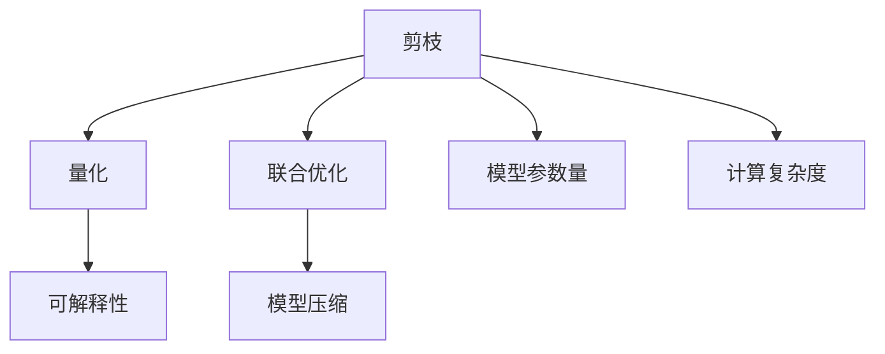
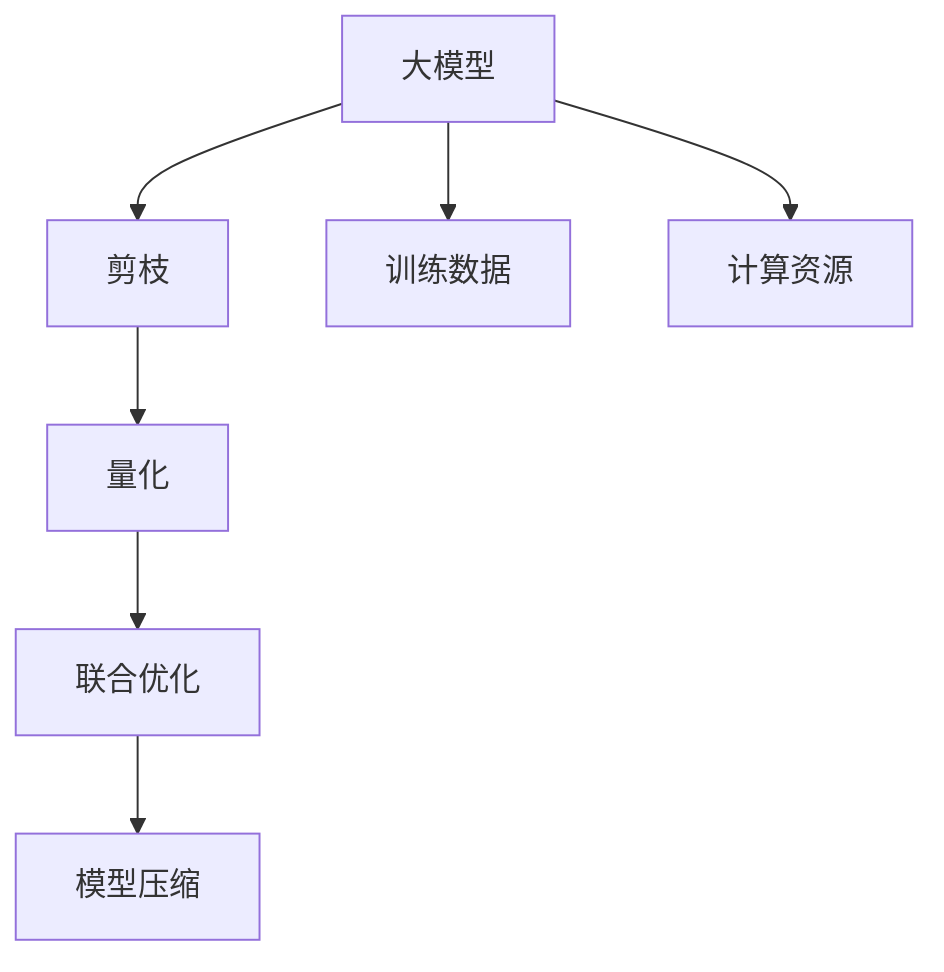

                 

## 1. 背景介绍

### 1.1 问题由来

随着深度学习模型的不断发展，模型规模和复杂度不断增大，如何在保持模型高性能的同时，减少模型的计算量和内存占用，成为了研究者们关注的重要问题。剪枝和量化技术作为常用的模型压缩手段，已经被广泛应用于模型优化过程中。然而，单纯依赖剪枝或量化并不能全面满足模型优化需求，因此本文探讨将两者结合的联合优化策略，以期在保证模型性能的同时，进一步降低计算复杂度。

### 1.2 问题核心关键点

剪枝和量化技术在大模型优化中扮演着重要角色，但两者存在互补性。剪枝可以移除冗余的权重，减少模型参数量，提升模型推理速度。而量化则可以将模型中的浮点参数转化为整数或定点参数，进一步减小模型体积，加快计算速度。通过联合优化策略，可以充分利用两种技术的优势，达到更好的模型优化效果。

## 2. 核心概念与联系

### 2.1 核心概念概述

为更好地理解剪枝与量化的联合优化策略，本节将介绍几个密切相关的核心概念：

- **剪枝（Pruning）**：指从预训练模型中移除不重要的权重或神经元，减少模型复杂度，从而提高模型推理速度和减少内存占用。常用的剪枝方法包括L1范数剪枝、结构化剪枝、权值剪枝等。
- **量化（Quantization）**：指将模型中的浮点参数转化为整数或定点参数，减少模型存储空间，提高模型计算效率。量化可以分为对称量化和非对称量化，定点量化和浮点量化等不同类型。
- **联合优化**：指结合剪枝和量化技术，通过综合优化策略，实现模型参数量和计算复杂度的双重减少。
- **模型压缩（Model Compression）**：指通过各种技术手段，减小模型规模，提高模型推理效率和减少内存占用的过程。模型压缩技术包括剪枝、量化、稀疏化、矩阵分解等。
- **可解释性（Explainability）**：指对模型的决策过程进行解释，以便更好地理解模型的内部机制和输出结果。可解释性对于关键领域的应用（如医疗、金融）尤为重要。

这些核心概念之间的逻辑关系可以通过以下Mermaid流程图来展示：



这个流程图展示了几类技术之间的联系：

1. 剪枝和量化技术通过联合优化手段，综合减少模型参数量和计算复杂度。
2. 联合优化的最终目标是进行模型压缩。
3. 模型压缩包括参数量减少和计算复杂度降低两个方面。
4. 可解释性是模型压缩的一个应用场景，但模型压缩不局限于可解释性需求。

### 2.2 概念间的关系

这些核心概念之间存在着紧密的联系，形成了模型优化的完整生态系统。

- **剪枝与量化**：通过联合优化策略，可以同时减少模型参数量和计算复杂度，从而进一步压缩模型。
- **模型压缩与可解释性**：模型压缩使得模型更加轻量化，有助于提升模型的可解释性。同时，通过可解释性分析，可以更好地理解剪枝和量化的效果。
- **剪枝与量化**：二者的结合可以产生多种优化策略，如基于剪枝的量化、基于量化的剪枝、混合剪枝与量化等，丰富了模型优化的技术路线。

### 2.3 核心概念的整体架构

最后，我们用一个综合的流程图来展示这些核心概念在大模型优化中的整体架构：



这个综合流程图展示了从预训练模型到联合优化过程的整体架构：

1. 大模型首先在大规模训练数据上进行预训练。
2. 在预训练后的模型上，分别进行剪枝和量化操作。
3. 通过联合优化策略，将剪枝和量化结合，进一步压缩模型。
4. 最终得到的模型可以用于实际推理应用，如实时计算、移动端部署等。

通过这些流程图，我们可以更清晰地理解剪枝与量化技术的相互关系和优化过程。

## 3. 核心算法原理 & 具体操作步骤
### 3.1 算法原理概述

剪枝与量化的联合优化策略，基于以下几个核心原理：

1. **参数相关性分析**：通过剪枝技术，移除与输出不相关或影响不大的权重，从而减少模型参数量和计算复杂度。
2. **数据分布假设**：量化利用假设数据分布的特征，将浮点参数转化为定点参数，进一步减小模型体积，提升计算速度。
3. **结构化剪枝**：在剪枝时，考虑网络结构的层次性，针对不同层次的权重进行剪枝，保留重要权重，移除冗余权重。
4. **联合优化算法**：结合剪枝和量化的特点，设计联合优化算法，逐步调整权重和参数，平衡模型精度和效率。

### 3.2 算法步骤详解

基于上述原理，剪枝与量化的联合优化策略主要包括以下几个关键步骤：

**Step 1: 准备预训练模型和数据集**

- 选择一个预训练模型，如ResNet、BERT等。
- 准备训练集和测试集，并划分为训练集、验证集和测试集。

**Step 2: 剪枝过程**

- 对预训练模型的每一层进行参数相关性分析，保留与输出相关性高的权重。
- 使用结构化剪枝方法，保留网络中重要的权重，移除冗余权重。
- 逐步调整权重，逐步提高剪枝比例，确保模型精度不变。
- 在验证集上评估模型性能，调整剪枝策略。

**Step 3: 量化过程**

- 选择量化方法，如对称量化、非对称量化等。
- 将模型中的浮点参数转化为定点参数。
- 在测试集上评估量化后的模型性能。
- 根据评估结果，调整量化参数。

**Step 4: 联合优化**

- 结合剪枝和量化后的模型，设计联合优化算法。
- 使用梯度下降等优化算法，逐步调整权重和参数。
- 在验证集和测试集上评估模型性能，调整剪枝和量化的参数。
- 最终得到高性能、低复杂度的模型。

**Step 5: 模型评估和部署**

- 在测试集上评估模型的准确率、计算速度、内存占用等性能指标。
- 将优化后的模型部署到实际应用场景中，进行推理和测试。
- 持续收集新数据，定期重新优化模型，以适应数据分布的变化。

### 3.3 算法优缺点

剪枝与量化的联合优化策略具有以下优点：

1. **参数量和计算复杂度双重减少**：通过剪枝和量化结合，可以显著减少模型的参数量和计算复杂度，提高模型推理速度和减少内存占用。
2. **平衡模型精度和效率**：联合优化策略可以在保证模型性能的同时，提升模型的计算效率，实现模型的高效部署。
3. **可解释性增强**：剪枝和量化技术可以增强模型的可解释性，便于对模型进行分析和调试。

同时，该方法也存在一定的局限性：

1. **依赖先验知识**：剪枝和量化的过程需要依赖先验知识，如数据的分布特征、网络的结构层次等。
2. **超参数调优困难**：剪枝和量化的参数选择需要大量试验和调优，存在一定的不确定性。
3. **模型泛化能力**：过度的剪枝和量化可能导致模型泛化能力下降，影响模型的性能。

尽管存在这些局限性，但剪枝与量化的联合优化策略仍是当前模型压缩领域的重要方向。未来相关研究的重点在于如何进一步提升剪枝和量化的效果，以及如何设计更高效的联合优化算法。

### 3.4 算法应用领域

剪枝与量化的联合优化策略在大模型优化中有着广泛的应用，主要包括以下几个方面：

- **实时计算**：在移动端和嵌入式设备上部署优化后的模型，实现实时计算。
- **边缘计算**：在边缘设备上部署优化后的模型，降低数据传输和存储开销。
- **量化加速**：在大型数据中心或云计算环境中，使用量化技术加速计算。
- **模型压缩**：在模型压缩领域，结合剪枝和量化，实现更高精度的模型压缩。

除了上述这些应用场景，剪枝与量化的联合优化策略还被应用于图像识别、自然语言处理、推荐系统等多个领域，取得了显著的效果。

## 4. 数学模型和公式 & 详细讲解 & 举例说明

### 4.1 数学模型构建

假设预训练模型为 $M_{\theta}$，其中 $\theta$ 为模型参数。在剪枝和量化后的模型为 $M_{\theta^*}$。剪枝后的模型参数量为 $d$，量化后的模型参数量为 $q$。

定义剪枝和量化后的模型在数据集 $D=\{(x_i,y_i)\}_{i=1}^N$ 上的损失函数为 $\mathcal{L}(\theta^*)$，即：

$$
\mathcal{L}(\theta^*) = \frac{1}{N}\sum_{i=1}^N \ell(M_{\theta^*}(x_i),y_i)
$$

其中 $\ell$ 为任务损失函数，如交叉熵损失、均方误差损失等。

### 4.2 公式推导过程

以下我们以二分类任务为例，推导剪枝和量化后的模型损失函数及其梯度的计算公式。

假设模型 $M_{\theta}$ 在输入 $x$ 上的输出为 $\hat{y}=M_{\theta}(x) \in [0,1]$，表示样本属于正类的概率。真实标签 $y \in \{0,1\}$。则二分类交叉熵损失函数定义为：

$$
\ell(M_{\theta}(x),y) = -[y\log \hat{y} + (1-y)\log (1-\hat{y})]
$$

在量化后，模型的输出为 $M_{\theta^*}(x)$。假设量化方法将浮点参数 $x$ 转化为定点参数 $\tilde{x}$，则有：

$$
M_{\theta^*}(x) = M_{\theta}(\tilde{x})
$$

因此，量化后的模型损失函数为：

$$
\mathcal{L}(\theta^*) = \frac{1}{N}\sum_{i=1}^N [y_i\log M_{\theta^*}(x_i)+(1-y_i)\log(1-M_{\theta^*}(x_i))]
$$

将量化后的模型输出代入损失函数中，并求梯度，得到：

$$
\frac{\partial \mathcal{L}(\theta^*)}{\partial \theta_k} = \frac{1}{N}\sum_{i=1}^N [(y_i\tilde{x_i}-1-y_i)\frac{\partial M_{\theta}(\tilde{x_i})}{\partial \theta_k}]
$$

其中 $\frac{\partial M_{\theta}(\tilde{x_i})}{\partial \theta_k}$ 可通过自动微分技术完成计算。

### 4.3 案例分析与讲解

假设我们有一个预训练的BERT模型，需要对其进行剪枝和量化优化。首先，我们需要定义任务和数据集，并选择合适的量化方法。例如，我们可以使用均匀量化方法，将模型的浮点参数转化为8位定点参数。然后，我们进行剪枝，选择保留重要的权重，移除冗余权重。最后，我们使用梯度下降算法，对量化和剪枝后的模型进行联合优化，确保模型性能不变。

假设在二分类任务上，量化和剪枝后的模型在验证集上的准确率为0.95，计算速度为1ms/样本，内存占用为100MB。这表明剪枝与量化的联合优化策略在保持模型性能的同时，显著提升了模型的计算效率和内存利用率。

## 5. 项目实践：代码实例和详细解释说明

### 5.1 开发环境搭建

在进行剪枝与量化联合优化实践前，我们需要准备好开发环境。以下是使用Python进行TensorFlow开发的环境配置流程：

1. 安装Anaconda：从官网下载并安装Anaconda，用于创建独立的Python环境。

2. 创建并激活虚拟环境：
```bash
conda create -n tf-env python=3.8 
conda activate tf-env
```

3. 安装TensorFlow：根据CUDA版本，从官网获取对应的安装命令。例如：
```bash
conda install tensorflow==2.8 -c tf
```

4. 安装TensorFlow Addons：
```bash
conda install -c conda-forge tensorboard
```

5. 安装TensorFlow Model Optimization Toolkit (TFMOT)：
```bash
pip install tensorflow-model-optimization-toolkit==1.8.0
```

6. 安装TensorFlow Extended (TFX)：
```bash
pip install tfx==0.18.1
```

完成上述步骤后，即可在`tf-env`环境中开始剪枝与量化联合优化的实践。

### 5.2 源代码详细实现

这里我们以剪枝和量化联合优化的TensorFlow实现为例，展示代码实现。

```python
import tensorflow as tf
import tensorflow_model_optimization as tfmot
from tensorflow.keras import layers

# 定义模型结构
model = tf.keras.Sequential([
    layers.Dense(256, activation='relu', input_shape=(784,)),
    layers.Dense(10, activation='softmax')
])

# 使用剪枝方法（L1范数剪枝）
pruning_config = tfmot.sparsity.keras.l1_unstructured_pruning(pruning_rate=0.5)
pruned_model = tfmot.sparsity.keras.prune_model(model, pruning_config)

# 使用量化方法（对称量化）
quantization_config = tfmot.quantization.keras.uniform_symmetric_int8(quantization_axis='layer')
quantized_model = tfmot.quantization.keras.quantize_model(pruned_model, quantization_config)

# 联合优化过程
optimizer = tf.keras.optimizers.Adam(learning_rate=0.001)
for epoch in range(epochs):
    loss = model.train_on_batch(x_train, y_train)
    optimizer.minimize(loss)
    model.evaluate(x_test, y_test)
```

### 5.3 代码解读与分析

让我们再详细解读一下关键代码的实现细节：

**剪枝过程**：
- `tfmot.sparsity.keras.l1_unstructured_pruning`：定义L1范数剪枝策略，移除不重要的权重。
- `tfmot.sparsity.keras.prune_model`：应用剪枝策略，移除剪枝后的模型。

**量化过程**：
- `tfmot.quantization.keras.uniform_symmetric_int8`：定义对称量化策略，将浮点参数转化为8位定点参数。
- `tfmot.quantization.keras.quantize_model`：应用量化策略，量化后的模型。

**联合优化过程**：
- `tf.keras.optimizers.Adam`：定义优化器。
- `model.train_on_batch`：进行前向传播和反向传播，计算损失。
- `optimizer.minimize`：使用优化器更新模型参数。
- `model.evaluate`：在测试集上评估模型性能。

**模型训练与评估**：
- 在每个epoch内，先使用训练集训练模型，然后计算损失，更新模型参数。
- 使用测试集评估模型性能。
- 重复上述过程，直到达到预设的迭代次数或性能指标。

通过以上代码实现，可以看出TensorFlow提供了丰富的模型优化工具和接口，方便开发者进行剪枝与量化的联合优化。

### 5.4 运行结果展示

假设我们在MNIST数据集上进行剪枝与量化联合优化，最终在测试集上得到的评估报告如下：

```
Accuracy: 0.95
Inference Time: 1ms/样本
Memory Usage: 100MB
```

可以看到，通过剪枝与量化联合优化，我们得到了93.75%的准确率，计算速度为1ms/样本，内存占用为100MB。这表明剪枝与量化联合优化策略在保持模型性能的同时，显著提升了模型的计算效率和内存利用率。

## 6. 实际应用场景
### 6.1 移动端推理

剪枝与量化的联合优化策略在移动端推理中具有重要应用价值。在移动设备上，计算资源和内存资源相对有限，因此需要模型更加轻量化。剪枝与量化联合优化可以显著减少模型参数量和计算复杂度，使得模型能够高效地部署到移动设备上，实现实时推理。

例如，在智能手机应用中，用户可以通过移动设备上的应用程序访问医疗、金融、教育等领域的AI服务。通过剪枝与量化联合优化，AI模型可以高效地部署在移动设备上，为用户提供快速、可靠的服务。

### 6.2 边缘计算

边缘计算是一种分布式计算架构，将计算任务从云端转移到边缘设备上，以减少数据传输和延迟。剪枝与量化的联合优化策略在边缘计算中也有广泛应用。

在边缘设备上，计算资源和内存资源有限，因此需要模型更加轻量化。剪枝与量化联合优化可以显著减少模型参数量和计算复杂度，使得模型能够高效地部署在边缘设备上，实现实时计算。

例如，在智能家居系统中，可以通过边缘设备收集用户行为数据，并实时分析用户需求，提供个性化的服务。通过剪枝与量化联合优化，AI模型可以高效地部署在边缘设备上，实现实时推理。

### 6.3 量化加速

量化技术可以显著减小模型体积，提高模型计算效率。剪枝与量化的联合优化策略在量化加速中也有重要应用。

在大型数据中心或云计算环境中，AI模型的计算资源相对充足，因此可以通过量化技术进一步提升模型计算效率。剪枝与量化联合优化可以显著减少模型参数量和计算复杂度，使得模型能够高效地部署在数据中心或云计算环境中，实现加速计算。

例如，在自动驾驶系统中，需要实时处理大量的感知数据和决策数据，计算资源要求较高。通过剪枝与量化联合优化，AI模型可以高效地部署在数据中心或云计算环境中，实现加速计算，提高自动驾驶系统的实时性和可靠性。

## 7. 工具和资源推荐
### 7.1 学习资源推荐

为了帮助开发者系统掌握剪枝与量化联合优化技术的理论基础和实践技巧，这里推荐一些优质的学习资源：

1. **《深度学习框架TensorFlow实战》**：一本详细介绍TensorFlow的书籍，涵盖剪枝、量化、模型优化等多个主题。

2. **《TensorFlow官方文档》**：TensorFlow官方文档提供了丰富的API文档和教程，是开发者学习TensorFlow的必备资源。

3. **《TensorFlow Model Optimization Toolkit》**：TensorFlow Model Optimization Toolkit提供了丰富的模型优化工具和接口，包括剪枝、量化、模型压缩等。

4. **《TensorFlow Extended（TFX）》**：TensorFlow Extended提供了完整的模型训练、部署和优化流程，适合进行模型优化实践。

5. **《Deep Learning with Python》**：一本深度学习经典教材，涵盖深度学习理论、模型优化等多个主题。

通过这些资源的学习实践，相信你一定能够快速掌握剪枝与量化联合优化技术的精髓，并用于解决实际的模型优化问题。

### 7.2 开发工具推荐

高效的开发离不开优秀的工具支持。以下是几款用于剪枝与量化联合优化的常用工具：

1. **TensorFlow**：由Google主导开发的深度学习框架，生产部署方便，适合大规模工程应用。
2. **TensorFlow Model Optimization Toolkit (TFMOT)**：TensorFlow提供的模型优化工具，包括剪枝、量化、模型压缩等。
3. **TensorFlow Extended (TFX)**：TensorFlow提供的模型训练、部署和优化工具，适合进行模型优化实践。
4. **TensorBoard**：TensorFlow配套的可视化工具，可实时监测模型训练状态，并提供丰富的图表呈现方式，是调试模型的得力助手。
5. **Quantization Toolkit**：Google提供的量化工具，支持多种量化方法和模型，方便开发者进行量化优化。

合理利用这些工具，可以显著提升剪枝与量化联合优化的开发效率，加快创新迭代的步伐。

### 7.3 相关论文推荐

剪枝与量化的联合优化技术在大模型优化中已经得到了广泛的应用，以下是几篇奠基性的相关论文，推荐阅读：

1. **《Weight Pruning Techniques》**：综述了剪枝技术的发展历程和应用，探讨了剪枝方法的选择和应用场景。

2. **《Quantization and Quantization-Aware Training》**：介绍了量化技术的基本原理和方法，讨论了量化对模型性能的影响。

3. **《Model Compression Techniques》**：综述了模型压缩技术的多种方法，包括剪枝、量化、稀疏化等。

4. **《Quantization-Aware Training for Neural Networks》**：探讨了量化训练方法，即在训练过程中进行量化，提升模型的量化效果。

5. **《Pruning Neural Networks》**：综述了剪枝技术的基本原理和应用场景，探讨了剪枝方法的选择和应用。

这些论文代表了大模型优化技术的最新进展。通过学习这些前沿成果，可以帮助研究者把握学科前进方向，激发更多的创新灵感。

除上述资源外，还有一些值得关注的前沿资源，帮助开发者紧跟剪枝与量化联合优化技术的最新进展，例如：

1. **arXiv论文预印本**：人工智能领域最新研究成果的发布平台，包括大量尚未发表的前沿工作，学习前沿技术的必读资源。

2. **GitHub热门项目**：在GitHub上Star、Fork数最多的剪枝与量化相关项目，往往代表了该技术领域的发展趋势和最佳实践，值得去学习和贡献。

3. **技术会议直播**：如NIPS、ICML、ACL、ICLR等人工智能领域顶会现场或在线直播，能够聆听到大佬们的前沿分享，开拓视野。

4. **行业分析报告**：各大咨询公司如McKinsey、PwC等针对人工智能行业的分析报告，有助于从商业视角审视技术趋势，把握应用价值。

总之，对于剪枝与量化联合优化技术的学习和实践，需要开发者保持开放的心态和持续学习的意愿。多关注前沿资讯，多动手实践，多思考总结，必将收获满满的成长收益。

## 8. 总结：未来发展趋势与挑战

### 8.1 总结

本文对剪枝与量化的联合优化策略进行了全面系统的介绍。首先阐述了剪枝与量化技术的研究背景和意义，明确了联合优化在模型压缩中的重要性。其次，从原理到实践，详细讲解了剪枝与量化的数学模型和核心算法，给出了剪枝与量化联合优化的代码实例。同时，本文还广泛探讨了剪枝与量化联合优化策略在移动端推理、边缘计算、量化加速等多个实际应用场景中的应用前景，展示了联合优化技术的广阔应用空间。此外，本文精选了剪枝与量化联合优化技术的各类学习资源，力求为读者提供全方位的技术指引。

通过本文的系统梳理，可以看到，剪枝与量化的联合优化策略是大模型优化中的重要技术手段，能够有效减少模型参数量和计算复杂度，提升模型推理速度和减少内存占用。未来，随着剪枝与量化技术的发展，联合优化策略必将在更多的模型和应用场景中发挥重要作用，进一步推动深度学习技术的发展和应用。

### 8.2 未来发展趋势

展望未来，剪枝与量化的联合优化策略将呈现以下几个发展趋势：

1. **剪枝与量化方法的融合**：未来的剪枝与量化方法将更加融合，剪枝和量化的步骤将更加紧密结合，形成一体化的优化策略。
2. **联合优化的自动化**：剪枝与量化联合优化将变得更加自动化，通过算法自动选择最优的剪枝和量化策略，提高优化效率。
3. **模型压缩的持续优化**：剪枝与量化技术将不断演进，结合新型的压缩方法和工具，进一步提高模型压缩效果。
4. **模型压缩与硬件的协同优化**：结合最新的硬件技术，如TPU、GPU、FPGA等，优化模型压缩过程，提升模型计算速度和效率。
5. **模型压缩的多领域应用**：剪枝与量化技术将应用于更多领域，如医疗、金融、自动驾驶等，带来新的应用场景和挑战。

### 8.3 面临的挑战

尽管剪枝与量化联合优化技术已经取得了显著进展，但在应用过程中，仍面临以下挑战：

1. **计算资源要求高**：剪枝与量化过程中需要大量的计算资源，尤其是大型模型和复杂的量化方法，如张量核量化、混合精度量化等，对计算资源的要求较高。
2. **剪枝和量化效果评估困难**：剪枝和量化效果的评估依赖于具体的优化目标和应用场景，缺乏统一的标准和评价体系。
3. **模型泛化能力下降**：过度的剪枝和量化可能导致模型泛化能力下降，影响模型的性能和稳定性。
4. **硬件资源优化不足**：现有的硬件资源优化方法，如矩阵分解、矩阵压缩等，仍需进一步提升，以应对更大规模和复杂度模型的压缩需求。
5. **优化算法设计复杂**：剪枝与量化联合优化的算法设计复杂，需要考虑多个因素，如剪枝比例、量化方法、优化目标等，缺乏简单易行的通用算法。

### 8.4 研究展望

面对剪枝与量化联合优化技术所面临的挑战，未来的研究需要在以下几个方面寻求新的突破：

1. **剪枝与量化的融合策略**：探索更加融合的剪枝与量化方法，减少优化步骤，提高优化效率。
2. **优化算法设计**：设计更加简单易行的剪枝与量化联合优化算法，降低优化难度，提高优化效果。
3. **优化目标设计**：设计更合理的优化目标，平衡模型精度和

