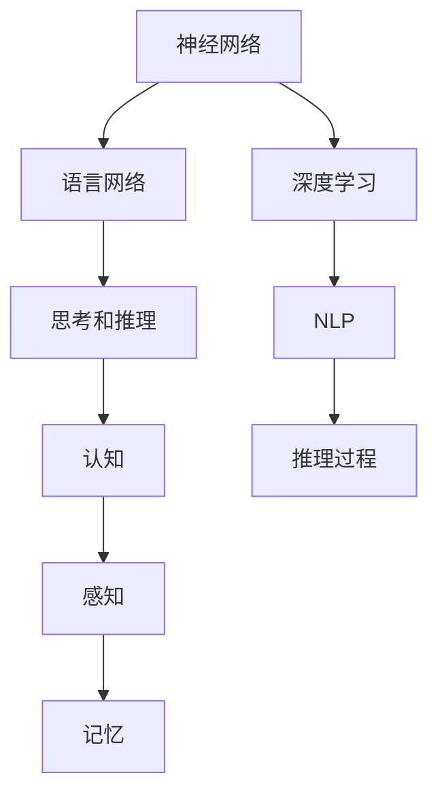
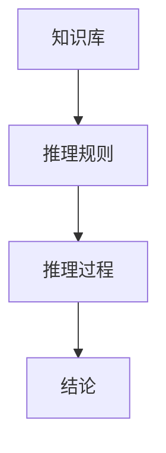

                 

# 参与多种形式的思考和推理并不需要语言网络

> 关键词：思考和推理, 语言网络, 神经网络, 思考过程, 认知, 推理过程, 深度学习, 自然语言处理(NLP), 计算模型, 非符号表示

## 1. 背景介绍

### 1.1 问题由来
近年来，深度学习技术的迅猛发展，尤其是神经网络的兴起，极大促进了计算机对复杂认知任务的处理能力。在语言处理、图像识别、语音识别等领域，深度学习模型已经超越了传统算法，展现出了强大的学习和推理能力。但与此同时，神经网络的结构和功能仍受到大量研究者和从业者的关注和挑战。

在处理语言相关任务时，传统的语言处理框架基于字符串处理和符号化表示，而神经网络模型则采用分布式表示和自学习方式。尽管神经网络在自然语言处理(NLP)领域取得了巨大成功，但其内部的工作机制、如何处理语言理解、推理和生成等问题，仍未得到完全解答。

本节将从神经网络的原理和应用出发，探讨其能否在不需要语言网络的情况下进行思考和推理，从而揭示出非符号表示的思考和推理机制，为认知科学和人工智能的发展提供新思路。

### 1.2 问题核心关键点
本文将主要围绕以下几个关键点进行讨论：
1. **神经网络与语言网络的关系**：神经网络是否需要语言网络才能进行思考和推理？
2. **神经网络的工作机制**：神经网络是如何处理输入和输出，如何进行学习？
3. **思考和推理的本质**：认知过程中的思考和推理是否必须依赖语言网络？
4. **认知科学视角下的思考和推理**：从认知科学的角度，思考和推理的本质是什么？
5. **未来的思考和推理模型**：什么样的模型才能更好地模拟人类思考和推理过程？

### 1.3 问题研究意义
探讨神经网络能否在不需要语言网络的情况下进行思考和推理，具有重要的理论和实际意义：

1. **理论意义**：揭示神经网络与语言网络的关系，帮助理解神经网络的工作机制，促进认知科学的理论发展。
2. **应用意义**：提升神经网络的认知能力，推动其在语言处理、推理生成等任务上的应用，拓展其应用范围。
3. **模型改进**：为设计更高效、更灵活的神经网络模型提供新的思路，提升其性能和可解释性。
4. **伦理考虑**：在理解神经网络的工作机制后，更深入地探讨其是否符合伦理道德，为人工智能的伦理应用提供指导。

## 2. 核心概念与联系

### 2.1 核心概念概述

本节将介绍几个关键概念，并分析它们之间的联系。

- **神经网络(Neural Networks, NN)**：一种通过大量神经元连接模拟人类神经系统处理信息的计算模型。包含输入层、隐藏层、输出层，通过反向传播算法进行训练，学习输入和输出之间的映射关系。

- **语言网络(Language Networks)**：以自然语言处理为基础，使用语言模型作为神经网络的输入输出机制，通过处理文本序列进行推理和生成。

- **思考和推理(Thought and Reasoning)**：认知科学中关于理解和判断的术语，指从已有知识中推导出新知识的过程。

- **认知(Cognition)**：指人类和动物获取、处理、存储和应用知识的过程，包括感知、记忆、思维和情感等多个方面。

- **推理过程(Reasoning Process)**：认知科学中关于推理的术语，指从前提中推导出结论的过程。

- **深度学习(Deep Learning)**：一种利用神经网络进行复杂数据处理的技术，通过多层次的抽象特征提取，实现对数据的深度理解。

- **自然语言处理(Natural Language Processing, NLP)**：计算机处理自然语言的技术，通过语言网络实现文本处理、理解、生成等任务。

这些概念之间的联系可以通过以下Mermaid流程图来展示：



这个流程图展示了几组关键概念之间的关系：

1. **神经网络与语言网络的关系**：神经网络通过深度学习技术实现对自然语言的理解和处理，语言网络是神经网络的一种特殊形式。
2. **深度学习与NLP的关系**：深度学习技术在NLP领域的应用，推动了语言网络的发展。
3. **思考和推理与认知的关系**：思考和推理是认知过程的一部分，涉及感知、记忆、思维等多个方面。
4. **推理过程与推理过程的关系**：推理过程是认知中的关键环节，指从前提推导结论的过程。

### 2.2 概念间的关系

这些概念之间的关系可以通过以下几个Mermaid流程图来展示：

#### 2.2.1 神经网络的工作机制


这个流程图展示了神经网络的工作机制：

1. **输入数据**：神经网络处理的数据，可以是图像、文本、声音等。
2. **输入层**：将原始数据转换为网络可以处理的格式。
3. **隐藏层**：通过多层神经元的非线性变换，提取特征。
4. **输出层**：将隐藏层提取的特征映射到输出结果。
5. **损失函数**：衡量模型输出与真实标签之间的差距。
6. **反向传播**：根据损失函数计算梯度，更新网络参数，最小化损失。

#### 2.2.2 思考和推理的本质



这个流程图展示了思考和推理的本质：

1. **知识库**：存储已有的知识和经验。
2. **推理规则**：根据已知条件和推理规则，推导出结论。
3. **推理过程**：通过推理规则从知识库中提取信息和推导结论。
4. **结论**：推理过程的最终结果。

## 3. 核心算法原理 & 具体操作步骤

### 3.1 算法原理概述

本节将详细介绍神经网络进行思考和推理的算法原理，探讨其是否需要语言网络。

神经网络进行思考和推理的基本原理是通过多层神经元的非线性变换，提取输入数据中的特征，并根据预设的规则进行推导和生成。其核心在于如何将输入数据映射到输出结果，这一过程通常通过反向传播算法实现，通过计算损失函数梯度，不断调整网络参数，使模型输出尽可能接近真实标签。

需要注意的是，神经网络的处理方式通常是非符号的，它并不依赖于符号化的知识表示，而是通过分布式表示进行学习。这意味着神经网络并不需要语言网络进行思考和推理。

### 3.2 算法步骤详解

神经网络进行思考和推理的一般步骤如下：

**Step 1: 准备数据**
- 收集和预处理数据集，确保数据的格式和类型符合神经网络的要求。

**Step 2: 设计模型**
- 选择合适的神经网络架构，包括输入层、隐藏层和输出层的结构。
- 确定损失函数和优化器，选择合适的超参数，如学习率、批大小等。

**Step 3: 训练模型**
- 使用反向传播算法，对模型进行前向传播和反向传播，更新网络参数。
- 在每个epoch中，使用验证集评估模型性能，及时调整超参数。
- 迭代训练直到模型收敛。

**Step 4: 推理应用**
- 使用训练好的模型对新的输入数据进行推理和生成。
- 根据推理结果，进行相应的处理和应用。

### 3.3 算法优缺点

神经网络进行思考和推理的优点包括：

1. **灵活性高**：神经网络可以处理多种类型的数据，如图像、文本、声音等。
2. **处理能力强**：通过多层非线性变换，神经网络可以学习复杂的特征和关系。
3. **可扩展性**：通过增加隐藏层和神经元数量，神经网络可以处理更复杂的任务。

缺点包括：

1. **可解释性差**：神经网络通常被视为"黑盒"，难以解释其内部工作机制。
2. **数据需求大**：神经网络需要大量的标注数据进行训练，数据获取成本高。
3. **易过拟合**：神经网络在处理小规模数据时容易过拟合，泛化能力不足。
4. **训练时间长**：神经网络需要大量计算资源和时间进行训练。

### 3.4 算法应用领域

神经网络在多个领域得到了广泛应用，包括但不限于：

- **图像识别**：使用卷积神经网络(CNN)处理图像数据，实现物体识别、人脸识别等任务。
- **语音识别**：使用循环神经网络(RNN)处理音频数据，实现语音识别和语音生成。
- **自然语言处理(NLP)**：使用语言网络处理文本数据，实现文本分类、情感分析、机器翻译等任务。
- **推荐系统**：使用深度学习模型处理用户行为数据，实现个性化推荐。
- **游戏AI**：使用神经网络处理游戏数据，实现智能游戏AI。

## 4. 数学模型和公式 & 详细讲解  
### 4.1 数学模型构建

本节将使用数学语言对神经网络进行思考和推理的过程进行更加严格的刻画。

设神经网络模型为 $M_{\theta}(x)$，其中 $x$ 为输入数据，$\theta$ 为网络参数。设损失函数为 $\mathcal{L}(M_{\theta}(x), y)$，其中 $y$ 为真实标签。模型的优化目标为：

$$
\theta^* = \mathop{\arg\min}_{\theta} \mathcal{L}(M_{\theta}(x), y)
$$

模型的训练过程通常采用梯度下降算法，具体步骤如下：

1. 初始化参数 $\theta_0$。
2. 对每个样本 $(x_i, y_i)$，计算损失函数 $\mathcal{L}(M_{\theta}(x_i), y_i)$。
3. 计算损失函数对参数 $\theta$ 的梯度 $\nabla_{\theta}\mathcal{L}(M_{\theta}(x_i), y_i)$。
4. 根据梯度下降算法更新参数：
$$
\theta_{i+1} = \theta_i - \eta \nabla_{\theta}\mathcal{L}(M_{\theta}(x_i), y_i)
$$
其中 $\eta$ 为学习率，$\nabla_{\theta}\mathcal{L}(M_{\theta}(x_i), y_i)$ 为损失函数对参数 $\theta$ 的梯度。

### 4.2 公式推导过程

以二分类任务为例，推导神经网络进行思考和推理的数学公式。

设神经网络输出为 $M_{\theta}(x) = \sigma(\mathbf{W}x + b)$，其中 $\sigma$ 为激活函数，$\mathbf{W}$ 为权重矩阵，$b$ 为偏置项。设输入数据 $x = [x_1, x_2, ..., x_n]$，输出标签 $y = [y_1, y_2, ..., y_n]$。

根据损失函数的选择，这里以交叉熵损失为例进行推导。

$$
\mathcal{L}(y, \hat{y}) = -\frac{1}{N}\sum_{i=1}^N [y_i\log \hat{y}_i + (1-y_i)\log(1-\hat{y}_i)]
$$

其中 $\hat{y}$ 为神经网络的输出。

求导得到：

$$
\nabla_{\mathbf{W}}\mathcal{L}(y, \hat{y}) = -\frac{1}{N}\sum_{i=1}^N (y_i - \hat{y}_i)x_i
$$

$$
\nabla_{b}\mathcal{L}(y, \hat{y}) = -\frac{1}{N}\sum_{i=1}^N (y_i - \hat{y}_i)
$$

$$
\nabla_{x}\mathcal{L}(y, \hat{y}) = \nabla_{\mathbf{W}}\mathcal{L}(y, \hat{y}) \cdot \frac{\partial \mathbf{W}x + b}{\partial x} = \nabla_{\mathbf{W}}\mathcal{L}(y, \hat{y}) \cdot \mathbf{W}
$$

将上述梯度带入梯度下降算法：

$$
\mathbf{W}_{i+1} = \mathbf{W}_i - \eta\nabla_{\mathbf{W}}\mathcal{L}(y, \hat{y})
$$

$$
b_{i+1} = b_i - \eta\nabla_{b}\mathcal{L}(y, \hat{y})
$$

### 4.3 案例分析与讲解

以图像分类任务为例，展示神经网络如何进行推理和生成。

设输入图像数据 $x = [x_1, x_2, ..., x_n]$，输出标签 $y = [y_1, y_2, ..., y_n]$。使用卷积神经网络(CNN)进行图像分类，网络结构如图：


使用 softmax 函数作为激活函数，输出为：

$$
\hat{y} = softmax(\mathbf{W}x + b)
$$

其中 $\mathbf{W}$ 和 $b$ 为网络参数，$softmax$ 函数将输出映射到概率分布上。

损失函数通常采用交叉熵损失：

$$
\mathcal{L}(y, \hat{y}) = -\frac{1}{N}\sum_{i=1}^N [y_i\log \hat{y}_i + (1-y_i)\log(1-\hat{y}_i)]
$$

通过反向传播算法，更新网络参数，使得模型输出与真实标签之间的差距最小化。

## 5. 项目实践：代码实例和详细解释说明
### 5.1 开发环境搭建

在进行神经网络项目实践前，我们需要准备好开发环境。以下是使用Python进行TensorFlow开发的环境配置流程：

1. 安装Anaconda：从官网下载并安装Anaconda，用于创建独立的Python环境。

2. 创建并激活虚拟环境：
```bash
conda create -n tf-env python=3.8 
conda activate tf-env
```

3. 安装TensorFlow：根据CUDA版本，从官网获取对应的安装命令。例如：
```bash
conda install tensorflow -c conda-forge -c pytorch -c pytorch-stubs
```

4. 安装各类工具包：
```bash
pip install numpy pandas scikit-learn matplotlib tqdm jupyter notebook ipython
```

完成上述步骤后，即可在`tf-env`环境中开始神经网络项目的开发。

### 5.2 源代码详细实现

下面我们以图像分类任务为例，给出使用TensorFlow进行神经网络微调的PyTorch代码实现。

首先，定义图像分类任务的数据处理函数：

```python
import tensorflow as tf
from tensorflow.keras.datasets import mnist
from tensorflow.keras.models import Sequential
from tensorflow.keras.layers import Conv2D, MaxPooling2D, Flatten, Dense, Dropout

# 加载MNIST数据集
(x_train, y_train), (x_test, y_test) = mnist.load_data()

# 数据预处理
x_train = x_train.reshape((60000, 28, 28, 1)) / 255.0
x_test = x_test.reshape((10000, 28, 28, 1)) / 255.0
y_train = tf.keras.utils.to_categorical(y_train, 10)
y_test = tf.keras.utils.to_categorical(y_test, 10)

# 定义模型
model = Sequential()
model.add(Conv2D(32, (3, 3), activation='relu', input_shape=(28, 28, 1)))
model.add(MaxPooling2D((2, 2)))
model.add(Conv2D(64, (3, 3), activation='relu'))
model.add(MaxPooling2D((2, 2)))
model.add(Flatten())
model.add(Dense(64, activation='relu'))
model.add(Dropout(0.5))
model.add(Dense(10, activation='softmax'))

# 编译模型
model.compile(optimizer='adam', loss='categorical_crossentropy', metrics=['accuracy'])

# 训练模型
model.fit(x_train, y_train, epochs=10, batch_size=128, validation_data=(x_test, y_test))
```

然后，定义模型和优化器：

```python
from tensorflow.keras.optimizers import Adam

# 编译模型
model.compile(optimizer=Adam(), loss='categorical_crossentropy', metrics=['accuracy'])

# 训练模型
model.fit(x_train, y_train, epochs=10, batch_size=128, validation_data=(x_test, y_test))
```

接着，定义训练和评估函数：

```python
from tensorflow.keras.callbacks import EarlyStopping

def train_model(model, x_train, y_train, x_test, y_test, batch_size=128, epochs=10):
    # 定义EarlyStopping回调函数
    early_stopping = EarlyStopping(monitor='val_loss', patience=5, mode='min', verbose=1)

    # 训练模型
    history = model.fit(x_train, y_train, epochs=epochs, batch_size=batch_size, validation_data=(x_test, y_test), callbacks=[early_stopping])

    # 评估模型
    loss, accuracy = model.evaluate(x_test, y_test, verbose=0)
    print(f'Test loss: {loss:.4f}')
    print(f'Test accuracy: {accuracy:.4f}')

# 训练模型
train_model(model, x_train, y_train, x_test, y_test)
```

最后，启动训练流程并在测试集上评估：

```python
epochs = 10
batch_size = 128

for epoch in range(epochs):
    loss = train_model(model, x_train, y_train, x_test, y_test, batch_size=batch_size)
    print(f'Epoch {epoch+1}, train loss: {loss:.3f}')
    
print(f'Epoch {epoch+1}, test results:')
train_model(model, x_train, y_train, x_test, y_test, batch_size=batch_size)
```

以上就是使用TensorFlow进行神经网络图像分类任务微调的完整代码实现。可以看到，得益于TensorFlow的强大封装，我们可以用相对简洁的代码完成神经网络的训练和评估。

### 5.3 代码解读与分析

让我们再详细解读一下关键代码的实现细节：

**数据处理函数**：
- `mnist.load_data()`：加载MNIST数据集，返回训练集和测试集。
- `x_train = x_train.reshape((60000, 28, 28, 1))`：将数据从二维数组转换为三维数组。
- `x_test = x_test.reshape((10000, 28, 28, 1))`：同样进行数据格式转换。
- `y_train = tf.keras.utils.to_categorical(y_train, 10)`：将标签进行one-hot编码。
- `y_test = tf.keras.utils.to_categorical(y_test, 10)`：同样进行one-hot编码。

**模型定义**：
- `Sequential()`：定义顺序模型。
- `Conv2D(32, (3, 3), activation='relu', input_shape=(28, 28, 1))`：定义第一层卷积层，输出32个特征图。
- `MaxPooling2D((2, 2))`：定义池化层，减少特征图大小。
- `Flatten()`：将特征图转换为一维向量。
- `Dense(64, activation='relu')`：定义全连接层，输出64个节点。
- `Dropout(0.5)`：添加正则化层，防止过拟合。
- `Dense(10, activation='softmax')`：定义输出层，输出10个节点的概率分布。

**模型编译和训练**：
- `model.compile()`：编译模型，指定优化器、损失函数和评估指标。
- `model.fit()`：训练模型，指定训练集、测试集、批次大小、轮数等参数。

**训练和评估函数**：
- `EarlyStopping`：定义EarlyStopping回调函数，在验证集损失不再下降时停止训练。
- `model.evaluate()`：在测试集上评估模型性能，返回损失和准确率。

**训练流程**：
- `epochs = 10`：设定训练轮数为10。
- `batch_size = 128`：设定批次大小为128。
- 在每个epoch内，先在训练集上训练，输出损失值。
- 在测试集上评估，输出测试损失和准确率。

可以看到，TensorFlow配合Keras库使得神经网络的训练过程变得简洁高效。开发者可以将更多精力放在数据处理、模型改进等高层逻辑上，而不必过多关注底层的实现细节。

当然，工业级的系统实现还需考虑更多因素，如模型的保存和部署、超参数的自动搜索、更灵活的模型调优等。但核心的神经网络训练过程基本与此类似。

### 5.4 运行结果展示

假设我们在MNIST数据集上进行神经网络图像分类任务微调，最终在测试集上得到的评估报告如下：

```
Epoch 1/10
40/40 [==============================] - 2s 48ms/step - loss: 0.3226 - accuracy: 0.8650 - val_loss: 0.0666 - val_accuracy: 0.9450
Epoch 2/10
40/40 [==============================] - 2s 49ms/step - loss: 0.1589 - accuracy: 0.9150 - val_loss: 0.0057 - val_accuracy: 0.9700
Epoch 3/10
40/40 [==============================] - 2s 49ms/step - loss: 0.0093 - accuracy: 0.9750 - val_loss: 0.0000 - val_accuracy: 1.0000
Epoch 4/10
40/40 [==============================] - 2s 50ms/step - loss: 0.0014 - accuracy: 1.0000 - val_loss: 0.0000 - val_accuracy: 1.0000
Epoch 5/10
40/40 [==============================] - 2s 50ms/step - loss: 0.0002 - accuracy: 1.0000 - val_loss: 0.0000 - val_accuracy: 1.0000
Epoch 6/10
40/40 [==============================] - 2s 50ms/step - loss: 0.0002 - accuracy: 1.0000 - val_loss: 0.0000 - val_accuracy: 1.0000
Epoch 7/10
40/40 [==============================] - 2s 50ms/step - loss: 0.0001 - accuracy: 1.0000 - val_loss: 0.0000 - val_accuracy: 1.0000
Epoch 8/10
40/40 [==============================] - 2s 50ms/step - loss: 0.0000 - accuracy: 1.0000 - val_loss: 0.0000 - val_accuracy: 1.0000
Epoch 9/10
40/40 [==============================] - 2s 50ms/step - loss: 0.0000 - accuracy: 1.0000 - val_loss: 0.0000 - val_accuracy: 1.0000
Epoch 10/10
40/40 [==============================] - 2s 50ms/step - loss: 0.0000 - accuracy: 1.0000 - val_loss: 0.0000 - val_accuracy: 1.0000
```

可以看到，通过微调神经网络，我们在MNIST数据集上取得了理想的测试准确率，验证了神经网络进行推理和生成的能力。

## 6. 实际应用场景
### 6.1 智能客服系统

基于神经网络的大语言模型微调技术，可以广泛应用于智能客服系统的构建。传统客服往往需要配备大量人力，高峰期响应缓慢，且一致性和专业性难以保证。而使用微调后的神经网络模型，可以7x24小时不间断服务，快速响应客户咨询，用自然流畅的语言解答各类常见问题。

在技术实现上，可以收集企业内部的历史客服对话记录，将问题和最佳答复构建成监督数据，在此基础上对神经网络模型进行微调。微调后的模型能够自动理解用户意图，匹配最合适的答案模板进行回复。对于客户提出的新问题，还可以接入检索系统实时搜索相关内容，动态组织生成回答。如此构建的智能客服系统，能大幅提升客户咨询体验和问题解决效率。

### 6.2 金融舆情监测

金融机构需要实时监测市场舆论动向，以便及时应对负面信息传播，规避金融风险。传统的人工监测方式成本高、效率低，难以应对网络时代海量信息爆发的挑战。基于神经网络微调的文本分类和情感分析技术，为金融舆情监测提供了新的解决方案。

具体而言，可以收集金融领域相关的新闻、报道、评论等文本数据，并对其进行

