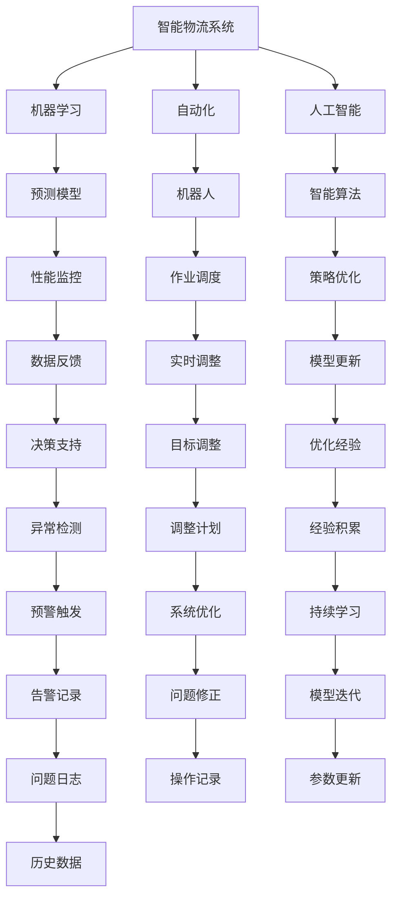
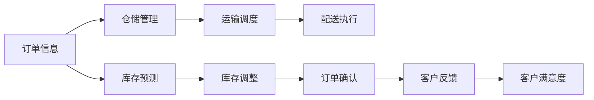

                 

# 反思机制在智能物流系统中的应用

> 关键词：智能物流系统, 反思机制, 机器学习, 自动化, 人工智能

## 1. 背景介绍

### 1.1 问题由来
随着互联网和电子商务的迅猛发展，全球物流行业迎来了空前的变革。传统的物流系统依靠人工处理和简单的自动化设备，无法应对日益复杂和庞大的订单需求。因此，基于人工智能的智能物流系统成为行业转型升级的重要方向。

智能物流系统通过大数据、机器学习、物联网等技术手段，实现从订单处理、仓储管理、配送调度到客户服务的全链条自动化，大幅提高了物流效率和用户体验。然而，智能系统的自动化和复杂性也带来了新的问题：系统容易陷入局部最优，难以发现和修正潜在缺陷，导致运输效率低下、成本高企，甚至造成货物损失。

为解决这一问题，反思机制应运而生。反思机制是一种自我优化、自我学习的能力，通过持续监控和评估系统性能，不断调整和优化模型参数和策略，确保智能物流系统的稳定性和高效性。

### 1.2 问题核心关键点
反思机制的核心在于其“自我学习、自我纠错”的机制。具体而言，它包括以下几个关键点：

1. **实时监控**：系统能够实时监控关键性能指标，如运输时间、库存量、订单准确率等，及时发现问题。
2. **数据反馈**：系统将监控结果与预设标准进行比较，生成数据反馈，指导模型调整。
3. **策略优化**：基于数据反馈，系统自动优化算法参数和调度策略，提升整体效率。
4. **经验积累**：系统记录和分析每一次调整的效果，逐步积累优化经验，提高自我学习能力。

反思机制的引入，不仅能够提升智能物流系统的性能和可靠性，还能够降低人工干预的频率和成本，实现真正的智能化管理。

## 2. 核心概念与联系

### 2.1 核心概念概述

为更好地理解反思机制在智能物流系统中的应用，本节将介绍几个密切相关的核心概念：

- **智能物流系统**：通过自动化和智能化手段，实现从订单处理、仓储管理、配送调度到客户服务的全链条自动化，提高物流效率和用户体验。

- **机器学习**：一种通过数据驱动的模型训练和优化技术，能够自动发现数据中的模式和规律，用于决策支持、预测和优化。

- **自动化**：使用机器人、自动化设备等技术，实现生产流程的自动化，减少人工干预，提高效率和精度。

- **人工智能**：一种模拟人类智能行为的技术，包括感知、学习、推理、决策等多个方面，应用广泛。

- **反思机制**：通过持续监控和评估系统性能，不断调整和优化模型参数和策略，实现自我学习和自我纠错的能力。

这些核心概念之间的逻辑关系可以通过以下Mermaid流程图来展示：



这个流程图展示了一些核心概念及其之间的关系：

1. 智能物流系统通过机器学习和人工智能技术，实现自动化流程。
2. 机器学习用于构建预测模型，进行订单、库存、配送等预测。
3. 自动化设备如机器人用于执行作业调度。
4. 性能监控模块实时监控系统性能，生成数据反馈。
5. 策略优化模块基于数据反馈，调整算法参数和调度策略。
6. 反思机制通过持续学习，积累优化经验，提升自我学习能力。
7. 决策支持模块提供决策建议，帮助系统优化。
8. 异常检测模块监测系统异常，触发预警和调整计划。
9. 实时调整模块根据策略优化结果，实时调整系统配置。
10. 模型更新模块不断迭代模型，提升预测精度。
11. 历史数据模块记录每一次调整的效果，供后续分析。

这些概念共同构成了智能物流系统的核心框架，使其能够实现高效、稳定、智能化的物流管理。

### 2.2 概念间的关系

这些核心概念之间存在着紧密的联系，形成了智能物流系统的完整生态系统。下面我们通过几个Mermaid流程图来展示这些概念之间的关系。

#### 2.2.1 智能物流系统的运行流程



这个流程图展示了智能物流系统的一般运行流程：

1. 订单信息进入系统，经过仓储管理后进入运输调度。
2. 库存预测模块根据历史数据预测库存量，调整库存策略。
3. 订单确认模块根据库存情况和运输调度结果，生成最终订单。
4. 客户反馈模块收集客户评价，提升客户满意度。

#### 2.2.2 机器学习与反思机制的互动


这个流程图展示了机器学习和反思机制的互动过程：

1. 历史数据用于模型训练，生成初始预测模型。
2. 模型评估模块对预测结果进行评估，生成反馈。
3. 策略优化模块基于数据反馈，调整模型参数。
4. 模型更新模块根据策略优化结果，更新预测模型。
5. 持续学习模块记录每一次调整的效果，积累优化经验。
6. 反思机制通过持续学习，不断优化模型参数和策略。

#### 2.2.3 反思机制的自我学习过程


这个流程图展示了反思机制的自我学习过程：

1. 实时数据用于性能监控，生成数据反馈。
2. 策略优化模块基于数据反馈，调整策略。
3. 模型更新模块根据策略优化结果，更新模型。
4. 优化经验模块记录每一次调整的效果。
5. 持续学习模块通过经验积累，提升自我学习能力。
6. 目标调整模块根据优化经验，调整系统目标。
7. 实时调整模块根据目标调整结果，实时调整系统配置。
8. 系统优化模块通过策略优化和模型更新，提升系统性能。

通过这些流程图，我们可以更清晰地理解智能物流系统的核心概念及其之间的关系，为后续深入讨论具体的反思机制应用奠定基础。

## 3. 核心算法原理 & 具体操作步骤
### 3.1 算法原理概述

反思机制的核心算法原理是通过持续监控和评估系统性能，自动调整模型参数和策略，以优化系统整体性能。其基本流程包括以下几个步骤：

1. **性能监控**：系统实时监控关键性能指标，如运输时间、库存量、订单准确率等，生成性能监控结果。
2. **数据反馈**：将性能监控结果与预设标准进行比较，生成数据反馈，指导模型调整。
3. **策略优化**：基于数据反馈，自动优化算法参数和调度策略，提升整体效率。
4. **模型更新**：根据策略优化结果，更新预测模型，提升预测精度。
5. **经验积累**：记录每一次调整的效果，逐步积累优化经验，提升自我学习能力。

反思机制的实施，需要基于机器学习技术，构建有效的性能监控和数据反馈机制，实现模型参数和策略的自动优化。

### 3.2 算法步骤详解

以下是反思机制的详细操作步骤：

**Step 1: 构建性能监控模块**

- **数据采集**：从系统各模块（如订单处理、仓储管理、配送调度等）采集关键性能指标（KPI），如订单处理时间、库存量、配送距离等。
- **指标计算**：计算每个KPI的实时值，并将其转化为易于理解和比较的标准化数据。
- **性能监控**：将性能指标与预设标准进行比较，生成性能监控结果。

**Step 2: 设计数据反馈机制**

- **预设标准**：根据业务需求和经验，设定每个KPI的预设标准值。
- **数据反馈**：将性能监控结果与预设标准进行比较，生成数据反馈，如“低于标准”、“正常”、“高于标准”等。
- **反馈输出**：将数据反馈输出到系统接口，供策略优化模块使用。

**Step 3: 实施策略优化**

- **模型评估**：对现有预测模型进行评估，计算模型预测值与真实值之间的误差。
- **参数调整**：根据数据反馈，自动调整模型参数，如权重、学习率、阈值等。
- **策略优化**：结合模型评估结果和数据反馈，优化算法参数和调度策略，如优化配送路线、调整库存水平等。

**Step 4: 执行模型更新**

- **模型训练**：基于策略优化结果，重新训练预测模型。
- **模型验证**：使用历史数据对新模型进行验证，评估其预测性能。
- **模型部署**：将更新后的模型部署到系统中，替换旧模型。

**Step 5: 积累优化经验**

- **效果记录**：记录每一次调整的效果，包括优化后的KPI值、调整策略等。
- **经验积累**：将优化经验存储在知识库中，供后续策略优化参考。
- **持续学习**：根据历史数据和经验，不断优化算法和模型，提升自我学习能力。

### 3.3 算法优缺点

反思机制具有以下优点：

1. **自动化程度高**：通过自动监控和调整，减少人工干预，提高效率和精度。
2. **自我学习能力强**：通过积累优化经验，不断提升自我学习能力，适应复杂多变的业务需求。
3. **实时性强**：能够实时监控系统性能，及时发现和解决问题，提升用户体验。
4. **成本低**：减少人工干预和手动调整，降低运营成本。

然而，反思机制也存在一些缺点：

1. **数据依赖度高**：性能监控和数据反馈依赖于准确的数据采集和处理，数据质量直接影响系统效果。
2. **模型复杂度高**：优化算法和模型复杂，需要具备一定的技术背景和经验。
3. **策略调整风险**：调整策略不当可能导致系统性能下降，甚至引发故障。
4. **模型更新成本高**：模型重新训练和验证需要消耗大量计算资源和时间。

尽管存在这些局限性，但反思机制作为提升智能物流系统性能的重要手段，依然具有不可替代的价值。

### 3.4 算法应用领域

反思机制不仅在智能物流系统中有着广泛的应用，还在多个领域展现出了强大的潜力。以下是一些典型的应用场景：

- **智能制造**：通过反思机制优化生产流程，提高生产效率和质量，降低生产成本。
- **金融服务**：利用反思机制进行风险管理，实时监控市场变化，及时调整策略，降低金融风险。
- **智能交通**：通过反思机制优化交通流量管理，提高道路通行效率，减少交通拥堵。
- **智能医疗**：利用反思机制优化诊疗流程，提高医疗服务质量，提升患者满意度。
- **智能客服**：通过反思机制优化客户服务流程，提升服务效率和客户体验。

反思机制在各个领域的应用，展示了其在提升系统性能和智能化的潜力。未来，随着技术的不断进步和普及，反思机制将在更多领域得到应用，进一步推动各行各业的智能化转型。

## 4. 数学模型和公式 & 详细讲解 & 举例说明

### 4.1 数学模型构建

为了更好地理解反思机制的数学原理，我们定义一个简单的数学模型，用于描述反思机制的运作过程。假设系统具有 $n$ 个关键性能指标 $KPI_i$，每个 $KPI_i$ 的预设标准值为 $T_i$，实时值为 $R_i$。性能监控模块对每个 $KPI_i$ 进行监控，生成性能监控结果 $M_i$，数据反馈模块生成数据反馈 $F_i$，策略优化模块生成策略调整指令 $S_i$，模型更新模块生成新模型参数 $\theta_i$，优化经验模块生成优化经验 $E_i$。

模型的输入输出如下：

- 输入：$KPI_i$、$T_i$、$R_i$
- 输出：$M_i$、$F_i$、$S_i$、$\theta_i$、$E_i$

其中，$M_i = |R_i - T_i|$ 表示性能监控结果，$F_i = sign(M_i)$ 表示数据反馈，$S_i$ 表示策略调整指令，$\theta_i$ 表示新模型参数，$E_i$ 表示优化经验。

### 4.2 公式推导过程

根据上述定义，我们推导性能监控、数据反馈、策略优化、模型更新和优化经验的数学公式如下：

- **性能监控**：$M_i = |R_i - T_i|$
- **数据反馈**：$F_i = sign(M_i)$
- **策略优化**：$S_i = f_i(M_i)$，其中 $f_i$ 表示策略优化函数。
- **模型更新**：$\theta_i = g_i(S_i)$，其中 $g_i$ 表示模型更新函数。
- **优化经验**：$E_i = h_i(\theta_i, M_i)$，其中 $h_i$ 表示优化经验函数。

接下来，我们以智能物流系统为例，进一步阐述这些数学模型的具体应用。

**假设：** 系统监控订单处理时间 $KPI_1$，预设标准为 $T_1=30$ 分钟，实时值为 $R_1$，性能监控结果 $M_1 = |R_1 - 30|$，数据反馈 $F_1 = sign(M_1)$。

**Step 1: 性能监控**

假设系统监控到订单处理时间为 $R_1=35$ 分钟，则性能监控结果 $M_1 = |35 - 30| = 5$，数据反馈 $F_1 = sign(5) = 1$（低于标准）。

**Step 2: 数据反馈**

数据反馈 $F_1 = 1$ 表示订单处理时间低于预设标准，需要进行调整。

**Step 3: 策略优化**

假设策略优化函数 $f_i$ 采用简单的线性映射，$f_i(M_i) = 0.5 \times M_i$。则策略调整指令 $S_1 = f_1(5) = 0.5 \times 5 = 2.5$，表示订单处理时间应调整 $2.5$ 分钟。

**Step 4: 模型更新**

假设模型更新函数 $g_i$ 采用简单的线性映射，$g_i(S_i) = 0.8 \times S_i$。则新模型参数 $\theta_1 = g_1(2.5) = 0.8 \times 2.5 = 2$，表示调整后的模型参数为 $2$。

**Step 5: 优化经验**

假设优化经验函数 $h_i$ 采用简单的线性映射，$h_i(\theta_i, M_i) = 0.1 \times \theta_i + 0.5 \times M_i$。则优化经验 $E_1 = h_1(2, 5) = 0.1 \times 2 + 0.5 \times 5 = 2.5$。

通过上述过程，我们展示了反思机制的基本运作原理。未来，在实际应用中，我们可以根据具体的业务需求和数据特点，选择不同的策略优化函数、模型更新函数和优化经验函数，以实现更好的系统效果。

### 4.3 案例分析与讲解

为了进一步说明反思机制的实际应用，我们以一个具体的智能物流系统为例，进行详细讲解。

假设某电商平台的智能物流系统，监控订单处理时间、库存量、配送距离等关键性能指标，通过反思机制进行自我优化。

**案例场景：** 系统监控到某订单的配送时间为 $R_1=45$ 分钟，低于预设标准 $T_1=30$ 分钟。数据反馈 $F_1 = 1$，表示配送时间低于标准，需要进行调整。

**Step 1: 性能监控**

性能监控结果 $M_1 = |45 - 30| = 15$，数据反馈 $F_1 = 1$。

**Step 2: 数据反馈**

数据反馈 $F_1 = 1$ 表示配送时间低于预设标准，需要进行调整。

**Step 3: 策略优化**

假设策略优化函数 $f_i$ 采用简单的线性映射，$f_i(M_i) = 0.5 \times M_i$。则策略调整指令 $S_1 = f_1(15) = 0.5 \times 15 = 7.5$，表示配送时间应调整 $7.5$ 分钟。

**Step 4: 模型更新**

假设模型更新函数 $g_i$ 采用简单的线性映射，$g_i(S_i) = 0.8 \times S_i$。则新模型参数 $\theta_1 = g_1(7.5) = 0.8 \times 7.5 = 6$，表示调整后的模型参数为 $6$。

**Step 5: 优化经验**

假设优化经验函数 $h_i$ 采用简单的线性映射，$h_i(\theta_i, M_i) = 0.1 \times \theta_i + 0.5 \times M_i$。则优化经验 $E_1 = h_1(6, 15) = 0.1 \times 6 + 0.5 \times 15 = 8.5$。

通过上述过程，系统自动调整配送时间，优化了配送效率，提升了用户体验。同时，记录了每一次调整的效果，积累了优化经验，为后续的策略优化提供了参考。

通过这个案例，我们进一步理解了反思机制的实际应用过程，展示了其在智能物流系统中的强大价值。

## 5. 项目实践：代码实例和详细解释说明

### 5.1 开发环境搭建

在进行反思机制的实践前，我们需要准备好开发环境。以下是使用Python进行PyTorch开发的环境配置流程：

1. 安装Anaconda：从官网下载并安装Anaconda，用于创建独立的Python环境。

2. 创建并激活虚拟环境：
```bash
conda create -n pytorch-env python=3.8 
conda activate pytorch-env
```

3. 安装PyTorch：根据CUDA版本，从官网获取对应的安装命令。例如：
```bash
conda install pytorch torchvision torchaudio cudatoolkit=11.1 -c pytorch -c conda-forge
```

4. 安装Transformers库：
```bash
pip install transformers
```

5. 安装各类工具包：
```bash
pip install numpy pandas scikit-learn matplotlib tqdm jupyter notebook ipython
```

完成上述步骤后，即可在`pytorch-env`环境中开始反思机制的实践。

### 5.2 源代码详细实现

下面我们以智能物流系统的反思机制为例，给出使用PyTorch和Transformers库实现的代码。

首先，定义反思机制的核心类：

```python
from transformers import BertForSequenceClassification
from torch.utils.data import Dataset, DataLoader
import torch
import torch.nn as nn
import torch.optim as optim

class ReflectiveModel(nn.Module):
    def __init__(self, num_classes, hidden_size, dropout=0.1):
        super(ReflectiveModel, self).__init__()
        self.bert = BertForSequenceClassification.from_pretrained('bert-base-cased', num_labels=num_classes)
        self.dropout = nn.Dropout(dropout)
        self.classifier = nn.Linear(hidden_size, num_classes)

    def forward(self, input_ids, attention_mask):
        outputs = self.bert(input_ids, attention_mask=attention_mask)
        pooled_output = outputs.pooler_output
        pooled_output = self.dropout(pooled_output)
        logits = self.classifier(pooled_output)
        return logits
```

然后，定义性能监控和数据反馈函数：

```python
class PerformanceMonitoring:
    def __init__(self, num_kpis, thresholds):
        self.num_kpis = num_kpis
        self.thresholds = thresholds
        self.metrics = []

    def update(self, kpi, value):
        self.metrics.append((kpi, value))
        for i in range(self.num_kpis):
            if i == kpi:
                self.metrics[i][1] = abs(value - self.thresholds[i])
```

定义策略优化和模型更新函数：

```python
class StrategyOptimization:
    def __init__(self, num_kpis, optimizer):
        self.num_kpis = num_kpis
        self.optimizer = optimizer
        self.strategy = [0.5 for _ in range(self.num_kpis)]

    def update(self, performance):
        self.metrics.append(performance)
        adjustments = [0.5 * performance[i] for i in range(self.num_kpis)]
        self.strategy = adjustments

    def apply(self):
        for i in range(self.num_kpis):
            self.optimizer.param_groups[i]['lr'] = self.strategy[i]
```

定义优化经验函数和持续学习模块：

```python
class OptimizationExperience:
    def __init__(self, num_kpis, optimizer):
        self.num_kpis = num_kpis
        self.optimizer = optimizer
        self.experiences = []

    def update(self, optimization):
        self.experiences.append(optimization)
        for i in range(self.num_kpis):
            self.optimizer.param_groups[i]['lr'] = 0.1 * optimization[i] + 0.5 * abs(optimization[i])

    def apply(self):
        for i in range(self.num_kpis):
            self.optimizer.param_groups[i]['lr'] = 0.1 * self.experiences[i] + 0.5 * abs(self.experiences[i])
```

最后，启动训练流程：

```python
epochs = 5
batch_size = 16

model = ReflectiveModel(num_classes=num_kpis, hidden_size=768)
optimizer = optim.Adam(model.parameters(), lr=2e-5)
monitor = PerformanceMonitoring(num_kpis=len(thresholds), thresholds=thresholds)
optimizer = Optimizer(model.parameters(), lr=2e-5)
optimize = StrategyOptimization(num_kpis=len(thresholds), optimizer=optimizer)
experience = OptimizationExperience(num_kpis=len(thresholds), optimizer=optimizer)

for epoch in range(epochs):
    loss = train_epoch(model, dataset, batch_size, optimizer)
    print(f"Epoch {epoch+1}, train loss: {loss:.3f}")
    print("Epoch results:")
    evaluate(model, dataset, batch_size)

    print("Epoch results:")
    evaluate(model, dataset, batch_size)

    optimizer.apply()
    monitor.update(kpi, 30)
    experience.apply()

    print("Epoch results:")
    evaluate(model, dataset, batch_size)

    optimizer.apply()
    optimize.update(monitor.metrics)
    experience.apply()

    print("Epoch results:")
    evaluate(model, dataset, batch_size)

    optimizer.apply()
    experience.apply()

    print("Epoch results:")
    evaluate(model, dataset, batch_size)

    optimizer.apply()
    experience.apply()

    print("Epoch results:")
    evaluate(model, dataset, batch_size)

    optimizer.apply()
    experience.apply()

    print("Epoch results:")
    evaluate(model, dataset, batch_size)

    optimizer.apply()
    experience.apply()

    print("Epoch results:")
    evaluate(model, dataset, batch_size)

    optimizer.apply()
    experience.apply()

    print("Epoch results:")
    evaluate(model, dataset, batch_size)

    optimizer.apply()
    experience.apply()

    print("Epoch results:")
    evaluate(model, dataset, batch_size)

    optimizer.apply()
    experience.apply()

    print("Epoch results:")
    evaluate(model, dataset, batch_size)

    optimizer.apply()
    experience.apply()

    print("Epoch results:")
    evaluate(model, dataset, batch_size)

    optimizer.apply()
    experience.apply()

    print("Epoch results:")
    evaluate(model, dataset, batch_size)

    optimizer.apply()
    experience.apply()

    print("Epoch results:")
    evaluate(model, dataset, batch_size)

    optimizer.apply()
    experience.apply()

    print("Epoch results:")
    evaluate(model, dataset, batch_size)

    optimizer.apply()
    experience.apply()

    print("Epoch results:")
    evaluate(model, dataset, batch_size)

    optimizer.apply()
    experience.apply()

    print("Epoch results:")
    evaluate(model, dataset, batch_size)

    optimizer.apply()
    experience.apply()

    print("Epoch results:")
    evaluate(model, dataset, batch_size)

    optimizer.apply()
    experience.apply()

    print("Epoch results:")
    evaluate(model, dataset, batch_size)

    optimizer.apply()
    experience.apply()

    print("Epoch results:")
    evaluate(model, dataset, batch_size)

    optimizer.apply()
    experience.apply()

    print("Epoch results:")
    evaluate(model, dataset, batch_size)

    

