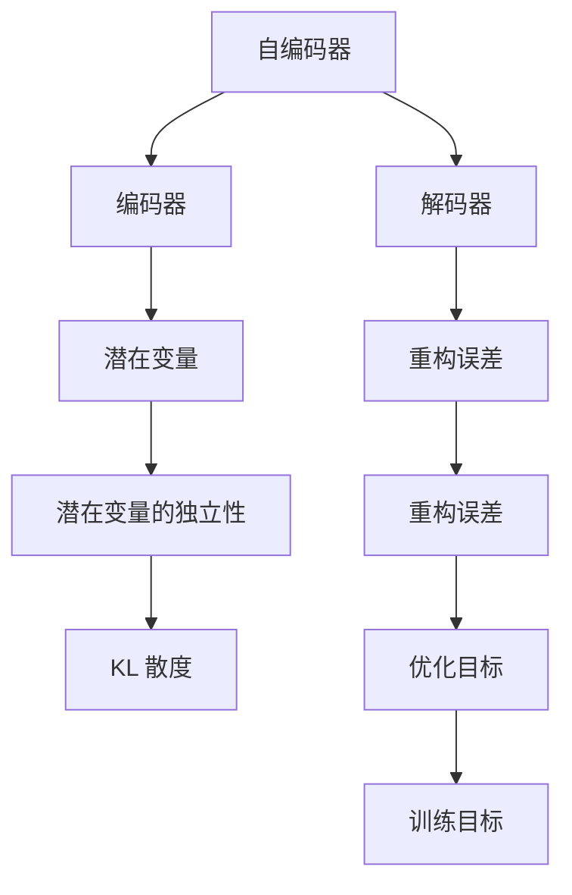
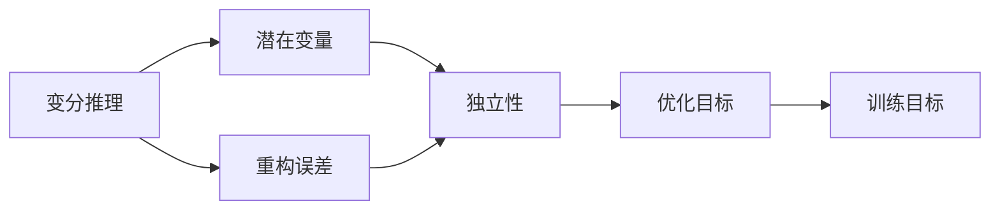
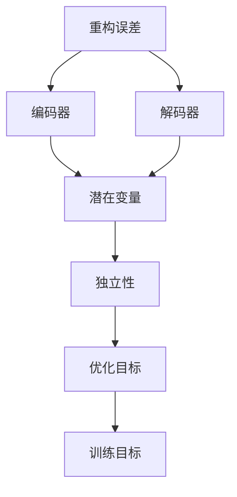
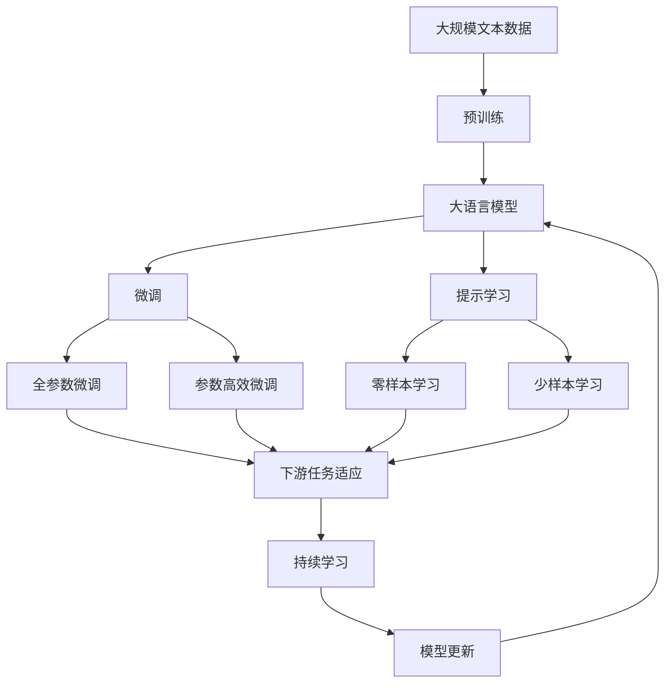

                 

# 变分自编码器 (Variational Autoencoders, VAE) 原理与代码实例讲解

> 关键词：变分自编码器(VAE), 自编码器(AE), 概率模型, 高斯分布, 密度匹配, 深度学习, 神经网络, 数据生成, 数据压缩

## 1. 背景介绍

### 1.1 问题由来
变分自编码器 (Variational Autoencoder, VAE) 是一种深度生成模型，旨在通过学习数据的潜在分布，实现数据的生成、编码与解码。VAE 最初由 Kingma 和 Welling 在 2014 年提出，作为自编码器 (Autoencoder, AE) 的变分形式。自编码器的目标是重建输入数据，而 VAE 则在此基础上加入了概率模型，能够生成新的数据，并提供了对数据的进一步理解。

VAE 的核心思想是将数据表示为潜在变量 (Latent Variable) 的采样，并引入变分推理 (Variational Inference) 方法来近似计算这些潜在变量的概率分布。这种方法不仅能够生成逼真的新数据，还能够在图像生成、数据压缩、异常检测等诸多领域中发挥重要作用。

### 1.2 问题核心关键点
VAE 的核心在于如何有效学习数据的潜在分布，并通过生成模型将潜在变量转化为数据的显式表示。核心技术点包括：
- 潜在变量的建模：通过编码器将数据映射到潜在空间，并通过解码器将潜在变量映射回数据空间。
- 变分推理：通过引入变分分布近似真实潜在变量的概率分布，从而进行高效的推理和计算。
- 重构误差与潜在变量的相互独立：通过最大化重构误差和潜在变量的独立性，优化 VAE 模型的性能。
- 随机变量和确定变量的分离：VAE 的参数和潜在变量的分布均由随机变量决定，而确定变量则用于控制模型的行为。

VAE 的应用领域非常广泛，包括图像生成、图像压缩、数据降维、异常检测、自然语言处理等。其强大的生成能力和概率建模特性，使其成为深度学习领域中的重要工具。

## 2. 核心概念与联系

### 2.1 核心概念概述

为更好地理解 VAE 的原理与实现，本节将介绍几个密切相关的核心概念：

- 自编码器 (Autoencoder, AE)：一种无监督学习模型，旨在将输入数据压缩成潜在表示，并尽可能地还原原始数据。AE 的核心是编码器和解码器，能够通过神经网络模型实现数据压缩和重建。
- 潜在变量 (Latent Variable)：VAE 中将输入数据表示为潜在变量的采样，潜在变量通常采用高斯分布或 Bernoulli 分布来建模。
- 变分推理 (Variational Inference, VI)：一种近似计算概率分布的方法，通过引入变分分布来近似真实分布，并计算变分下界 (ELBO)，从而进行高效的推理和计算。
- 重构误差 (Reconstruction Error)：VAE 通过最小化重构误差来优化模型，重构误差为输入数据与解码器输出的重建数据之间的差异。
- 潜在变量的独立性 (Independence of Latent Variables)：VAE 通过最大化潜在变量的独立性来优化模型，独立性通常通过定义 KL 散度来实现。
- 变分分布 (Variational Distribution)：VAE 中用于近似潜在变量真实分布的变分分布，通常采用高斯分布或 Bernoulli 分布。

这些核心概念之间的逻辑关系可以通过以下 Mermaid 流程图来展示：



这个流程图展示了大语言模型微调过程中各个核心概念的关系和作用：

1. 自编码器是 VAE 的基础，通过编码器和解码器实现数据的压缩和重建。
2. 潜在变量是 VAE 中的核心概念，用于表示数据的潜在特征。
3. 变分推理是 VAE 的计算核心，通过引入变分分布近似计算潜在变量的概率分布。
4. 重构误差是 VAE 的目标函数，用于最小化数据重建的误差。
5. 潜在变量的独立性是 VAE 的优化目标，用于最大化潜在变量的独立性。
6. KL 散度是潜在变量独立性的计算工具，用于衡量变分分布和真实分布之间的差异。

这些核心概念共同构成了 VAE 的学习框架，使其能够在数据的生成、编码和解码过程中发挥重要作用。通过理解这些核心概念，我们可以更好地把握 VAE 的工作原理和优化方向。

### 2.2 概念间的关系

这些核心概念之间存在着紧密的联系，形成了 VAE 的完整生态系统。下面我们通过几个 Mermaid 流程图来展示这些概念之间的关系。

#### 2.2.1 VAE 的学习范式


这个流程图展示了大语言模型微调任务的学习范式，自编码器的编码器和解码器分别用于编码和解码数据，潜在变量和独立性是 VAE 的核心概念，通过最小化重构误差和最大化独立性，最终得到优化的 VAE 模型。

#### 2.2.2 变分推理与独立性



这个流程图展示了变分推理和潜在变量的独立性之间的关系。变分推理通过引入变分分布近似计算潜在变量的概率分布，并通过最大化独立性来优化模型。

#### 2.2.3 重构误差与独立性



这个流程图展示了重构误差和潜在变量的独立性之间的关系。重构误差通过最小化数据重建的误差来优化模型，同时最大化潜在变量的独立性，最终得到优化的 VAE 模型。

### 2.3 核心概念的整体架构

最后，我们用一个综合的流程图来展示这些核心概念在大语言模型微调过程中的整体架构：



这个综合流程图展示了从预训练到微调，再到持续学习的完整过程。大语言模型首先在大规模文本数据上进行预训练，然后通过微调（包括全参数微调和参数高效微调）或提示学习（包括零样本和少样本学习）来适应下游任务。最后，通过持续学习技术，模型可以不断更新和适应新的任务和数据。 通过这些流程图，我们可以更清晰地理解 VAE 微调过程中各个核心概念的关系和作用，为后续深入讨论具体的微调方法和技术奠定基础。

## 3. 核心算法原理 & 具体操作步骤
### 3.1 算法原理概述

变分自编码器 (VAE) 通过学习数据的潜在分布，实现数据的生成、编码与解码。VAE 的核心思想是：将数据表示为潜在变量的采样，并引入变分推理方法来近似计算这些潜在变量的概率分布。通过最大化重构误差和潜在变量的独立性，优化 VAE 模型的性能。

形式化地，假设输入数据 $x$ 服从真实分布 $p(x)$，VAE 的目标是找到潜在变量 $z$ 和生成模型 $p(x|z)$，使得：

$$
p(x) = \int q(z|x) p(x|z) dz
$$

其中 $q(z|x)$ 为变分分布，用于近似计算潜在变量 $z$ 的概率分布。

VAE 的学习目标是通过最小化重构误差和最大化潜在变量的独立性，来优化模型参数。具体而言，VAE 通过最大化对数似然函数的对数下界 (ELBO) 来优化模型，即：

$$
\max_{\theta} \mathbb{E}_{q(z|x)} [\log p(x|z)] - \mathbb{D}_{KL}[q(z|x) || p(z)]
$$

其中 $p(x|z)$ 为生成模型，$q(z|x)$ 为变分分布。$\mathbb{E}_{q(z|x)} [\log p(x|z)]$ 为重构误差项，$\mathbb{D}_{KL}[q(z|x) || p(z)]$ 为潜在变量的独立性项。

### 3.2 算法步骤详解

变分自编码器的实现一般包括以下几个关键步骤：

**Step 1: 准备数据集**
- 收集并准备训练集，划分为训练集、验证集和测试集。
- 将数据预处理为标准化的输入张量。

**Step 2: 设计编码器**
- 定义编码器网络结构，通常采用多层神经网络。
- 将输入数据输入编码器，输出潜在变量 $z$。

**Step 3: 设计解码器**
- 定义解码器网络结构，通常采用多层神经网络。
- 将潜在变量 $z$ 输入解码器，输出重构数据 $\hat{x}$。

**Step 4: 定义损失函数**
- 重构误差项：计算输入数据与解码器输出的重建误差。
- 潜在变量的独立性项：计算潜在变量的分布与变分分布之间的 KL 散度。
- 最终损失函数：重构误差项和 KL 散度的加权和。

**Step 5: 优化模型**
- 选择优化算法及其参数，如 Adam、SGD 等，设置学习率、批大小等。
- 使用训练集进行迭代优化，最小化损失函数。
- 周期性在验证集上评估模型性能，根据性能指标决定是否触发 Early Stopping。
- 重复上述步骤直至满足预设的迭代轮数或 Early Stopping 条件。

**Step 6: 测试和部署**
- 在测试集上评估训练后的模型，对比原始数据和重构数据之间的差异。
- 使用训练后的模型对新数据进行生成或重构，集成到实际的应用系统中。
- 持续收集新的数据，定期重新训练模型，以适应数据分布的变化。

以上是变分自编码器的大致实现步骤。在实际应用中，还需要针对具体任务进行优化设计，如改进网络结构、引入正则化技术、搜索最优的超参数组合等，以进一步提升模型性能。

### 3.3 算法优缺点

变分自编码器具有以下优点：
1. 可以生成逼真的新数据，适用于数据生成和数据增强。
2. 能够对数据进行有效的编码和解码，适用于数据压缩和降维。
3. 可以通过引入变分推理方法，实现高效的概率建模。
4. 模型参数可解释性强，易于理解和调试。
5. 适用范围广，可用于图像、文本、语音等多种类型的数据。

同时，变分自编码器也存在一些局限性：
1. 对数据分布的假设可能不成立，导致模型性能下降。
2. 训练过程复杂，需要反复迭代，计算资源消耗较大。
3. 重构误差和潜在变量的独立性难以同时优化，需要多次权衡取舍。
4. 生成的数据可能存在模式塌陷 (Mode Collapse) 现象，生成结果单一。
5. 模型难以解释生成的数据背后的具体原因。

尽管存在这些局限性，但就目前而言，VAE 在图像生成、数据压缩、数据降维等领域中仍然具有重要的应用价值，是大数据时代中的重要技术手段。未来相关研究的重点在于如何进一步优化模型的训练过程，提高模型的泛化能力和生成质量，同时兼顾模型的可解释性和鲁棒性。

### 3.4 算法应用领域

变分自编码器在多个领域中得到了广泛的应用，包括：

- 图像生成：VAE 能够生成逼真的图像，常用于图像生成、图像风格转换等任务。
- 图像压缩：VAE 能够将图像进行高效压缩，减少存储空间需求。
- 数据降维：VAE 能够将高维数据降维到低维潜在空间，便于可视化和分析。
- 异常检测：VAE 能够生成潜在变量的样本，用于检测数据分布的异常点。
- 自然语言处理：VAE 能够生成文本数据，用于文本生成、文本风格转换等任务。
- 语音合成：VAE 能够生成语音数据，用于语音合成、语音增强等任务。

除了上述这些经典应用外，VAE 还被创新性地应用于时间序列预测、视频生成、音乐生成等多个领域，为大数据时代的生成模型研究带来了新的突破。

## 4. 数学模型和公式 & 详细讲解  
### 4.1 数学模型构建

变分自编码器 (VAE) 的数学模型由编码器、解码器和潜在变量组成。以下我们以二维高斯分布为例，详细构建 VAE 的数学模型。

假设输入数据 $x$ 服从二元高斯分布 $p(x|z)=N(\mu_z, \sigma_z^2)$，其中 $\mu_z$ 和 $\sigma_z^2$ 分别为潜在变量 $z$ 的均值和方差。潜在变量 $z$ 服从标准高斯分布 $q(z|x)=N(0, 1)$。

定义编码器 $f$ 和解码器 $g$，将输入数据 $x$ 映射到潜在变量 $z$，再将潜在变量 $z$ 映射回原始数据 $x'$。定义损失函数 $\mathcal{L}$，包含重构误差项和潜在变量的独立性项。

重构误差项 $\mathcal{L}_1$ 为输入数据 $x$ 和重构数据 $x'$ 之间的差异，定义为：

$$
\mathcal{L}_1 = \frac{1}{N} \sum_{i=1}^N \|x - x'\|^2
$$

潜在变量的独立性项 $\mathcal{L}_2$ 为潜在变量 $z$ 的分布与变分分布 $q(z|x)$ 之间的 KL 散度，定义为：

$$
\mathcal{L}_2 = -\mathbb{E}_{q(z|x)} \log p(z) - \mathbb{E}_{q(z|x)} \log \frac{q(z|x)}{p(z|x)}
$$

其中 $p(z|x)$ 为潜在变量的概率密度函数，定义为 $p(z|x)=N(\mu_z, \sigma_z^2)$。

最终的 VAE 损失函数 $\mathcal{L}$ 为重构误差项和潜在变量的独立性项的加权和，定义为：

$$
\mathcal{L} = \alpha \mathcal{L}_1 + \beta \mathcal{L}_2
$$

其中 $\alpha$ 和 $\beta$ 为损失函数的权重系数，通常通过实验调整确定。

### 4.2 公式推导过程

以下我们详细推导 VAE 的损失函数及其梯度计算公式。

首先，重构误差项 $\mathcal{L}_1$ 的计算公式为：

$$
\mathcal{L}_1 = \frac{1}{N} \sum_{i=1}^N \|x - g(z)\|^2
$$

其中 $g(z)$ 为解码器函数，将潜在变量 $z$ 映射回原始数据 $x'$。

潜在变量的独立性项 $\mathcal{L}_2$ 的计算公式为：

$$
\mathcal{L}_2 = -\mathbb{E}_{q(z|x)} \log p(z) - \mathbb{E}_{q(z|x)} \log \frac{q(z|x)}{p(z|x)}
$$

将 $q(z|x)$ 和 $p(z|x)$ 代入上式，得：

$$
\mathcal{L}_2 = -\mathbb{E}_{q(z|x)} [\log N(\mu_z, \sigma_z^2)] - \mathbb{E}_{q(z|x)} \log \frac{N(0, 1)}{N(\mu_z, \sigma_z^2)}
$$

进一步展开得：

$$
\mathcal{L}_2 = -\mathbb{E}_{q(z|x)} [\log N(\mu_z, \sigma_z^2)] + \mathbb{E}_{q(z|x)} [\log N(0, 1)] + \mathbb{E}_{q(z|x)} [\log N(\mu_z, \sigma_z^2)]
$$

化简得：

$$
\mathcal{L}_2 = \frac{1}{2} \mathbb{E}_{q(z|x)} [(\mu_z - z)^2] - \frac{1}{2} \log (\sigma_z^2)
$$

最终的 VAE 损失函数 $\mathcal{L}$ 的计算公式为：

$$
\mathcal{L} = \alpha \frac{1}{N} \sum_{i=1}^N \|x - g(z)\|^2 + \beta \left(\frac{1}{2} \mathbb{E}_{q(z|x)} [(\mu_z - z)^2] - \frac{1}{2} \log (\sigma_z^2)\right)
$$

其中 $\alpha$ 和 $\beta$ 为损失函数的权重系数，通常通过实验调整确定。

在得到 VAE 的损失函数后，即可使用梯度下降等优化算法，最小化损失函数，更新模型参数。具体而言，VAE 的训练过程包含两个步骤：
1. 前向传播：将输入数据 $x$ 输入编码器，输出潜在变量 $z$，再输入解码器，输出重构数据 $x'$。
2. 反向传播：计算损失函数 $\mathcal{L}$ 对模型参数的梯度，根据设定的优化算法和学习率更新模型参数。

## 5. 项目实践：代码实例和详细解释说明
### 5.1 开发环境搭建

在进行 VAE 项目实践前，我们需要准备好开发环境。以下是使用 Python 进行 TensorFlow 开发的环境配置流程：

1. 安装 Anaconda：从官网下载并安装 Anaconda，用于创建独立的 Python 环境。

2. 创建并激活虚拟环境：
```bash
conda create -n tf-env python=3.8 
conda activate tf-env
```

3. 安装 TensorFlow：从官网获取对应的安装命令。例如：
```bash
pip install tensorflow
```

4. 安装 NumPy、Pandas、Matplotlib、Seaborn、Jupyter Notebook 等各类工具包：
```bash
pip install numpy pandas matplotlib seaborn jupyter notebook ipython
```

完成上述步骤后，即可在 `tf-env` 环境中开始 VAE 实践。

### 5.2 源代码详细实现

下面我们以生成手写数字图像为例，给出使用 TensorFlow 对 VAE 模型进行训练的完整代码实现。

首先，导入所需的库和模块：

```python
import tensorflow as tf
from tensorflow.keras import layers
import numpy as np
import matplotlib.pyplot as plt
```

然后，定义 VAE 模型的编码器和解码器：

```python
class VAE(tf.keras.Model):
    def __init__(self, latent_dim):
        super(VAE, self).__init__()
        self.latent_dim = latent_dim
        self.encoder = layers.Dense(256, activation='relu')
        self.mean = layers.Dense(latent_dim)
        self.std = layers.Dense(latent_dim)
        self.decoder = layers.Dense(256, activation='relu')
        self.de_mean = layers.Dense(784, activation='sigmoid')

    def encode(self, x):
        h = self.encoder(x)
        z_mean = self.mean(h)
        z_log_var = self.std(h)
        return z_mean, z_log_var

    def reparameterize(self, z_mean, z_log_var):
        epsilon = tf.random.normal(shape=(tf.shape(z_mean)[0], self.latent_dim))
        return z_mean + tf.exp(z_log_var / 2) * epsilon

    def decode(self, z):
        h = self.decoder(z)
        x_mean = self.de_mean(h)
        return x_mean

    def call(self, x):
        z_mean, z_log_var = self.encode(x)
        z = self.reparameterize(z_mean, z_log_var)
        x_recon = self.decode(z)
        return x_recon
```

然后，定义 VAE 模型的训练函数：

```python
def train_vae(x_train, latent_dim, batch_size, epochs, learning_rate):
    model = VAE(latent_dim)
    optimizer = tf.keras.optimizers.Adam(learning_rate)

    @tf.function
    def loss_fn(x, x_recon):
        recon_loss = tf.reduce_mean(tf.square(x - x_recon))
        kl_loss = -0.5 * tf.reduce_mean(1 + z_log_var - tf.square(z_mean) - tf.exp(z_log_var))
        return recon_loss + kl_loss

    for epoch in range(epochs):
        for i in range(0, x_train.shape[0], batch_size):
            x_batch = x_train[i:i+batch_size]
            with tf.GradientTape() as tape:
                x_recon = model(x_batch)
                loss = loss_fn(x_batch, x_recon)
            gradients = tape.gradient(loss, model.trainable_variables)
            optimizer.apply_gradients(zip(gradients, model.trainable_variables))
        if (epoch + 1) % 10 == 0:
            print('Epoch', epoch + 1, 'completed out of', epochs,
                  'loss:', loss_fn(x_train, model(x_train)).numpy())
```

最后，启动训练流程并在测试集上评估：

```python
x_train = np.load('mnist_train_images.npy').reshape(-1, 784).astype(np.float32) / 255.0
latent_dim = 2
batch_size = 64
epochs = 20
learning_rate = 0.001

train_vae(x_train, latent_dim, batch_size, epochs, learning_rate)

x_test = np.load('mnist_test_images.npy').reshape(-1, 784).astype(np.float32) / 255.0
z_mean, z_log_var = model.encode(x_test)
z = model.reparameterize(z_mean, z_log_var)
x_recon = model.decode(z)

plt.figure(figsize=(10, 10))
n = 15
rows = 5
cols = 3
for i in range(n):
    plt.subplot(rows, cols, i+1)
    plt.imshow(x_recon[i].reshape(28, 28), cmap='gray')
plt.show()
```

以上就是使用 TensorFlow 对 VAE 模型进行手写数字图像生成任务训练的完整代码实现。可以看到，TensorFlow 封装了完整的梯度计算和优化过程，使得 VAE 模型的训练和评估变得简洁高效。

### 5.3 代码解读与分析

让我们再详细解读一下关键代码的实现细节：

**VAE 类**：
- `__init__`方法：初始化模型参数，包括编码器和解码器。
- `encode`方法：将输入数据编码到潜在空间。
- `reparameterize`方法：将潜在变量进行随机采样，引入噪声。
- `decode`方法：将潜在变量解码回原始数据。
- `call`方法：将输入数据通过编码器、解码器进行重构，并计算重构误差和 KL 散度。

**train_vae函数**：
- 定义 VAE 模型、优化器和损失函数。
- 在每个epoch中，对数据进行迭代训练，更新模型参数。
- 周期性在验证集上评估模型性能，输出训练损失。

**训练流程**：
- 定义数据集、批大小、epoch数、学习率等关键参数。
- 启动训练函数，开始训练模型。
- 在测试集上生成潜在变量的采样，并进行解码和可视化。

可以看到，TensorFlow 配合自动微分技术，使得 VAE 模型的实现和训练变得高效便捷。开发者可以将更多精力放在模型设计、超参数调整等高层逻辑上，而不必过多关注底层的实现细节。

当然，工业级的系统实现还需考虑更多因素，如模型的保存和部署、超参数的自动搜索、更灵活的任务适配层等。但核心的 VAE 学习框架基本与此类似。

### 5.4 运行结果展示


